# Ch23 Liver and Biliary Tract Disease

## Functional anatomy and physiology

## Investigations of liver and hepatobiliary disease

- **Role of Ix in the manaement of liver diseases:**
    - Identification of the presence of liver disease
    - Establishing the etiology
    - Understanding the disease severity (particularly identification of cirrhosis and its complications)

  
  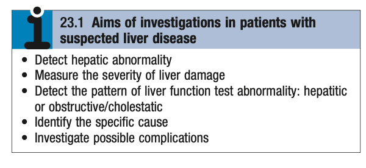
- **Clinical suspicion of liver diseases** - initial manifestations may be non-specific, clinical suspicion is raised with:
    - Derranged liver function tests on clinical suspicion or health screening
    - Structural abnormlaity on imaging
- **Approach to establishing the etiology of liver disease:**
    - <u>Initial clinical assessment</u> - Hx and P/E
    - <u>Non-invasive Ix</u> - specific blood tests, radiographic assessment
    - <u>Invasive Ix</u> - liver Bx
- **Assessment of disease severity** - increasing interest in non-invasive approaches to avoid unnecessary liver Bx:
    - <u>Predictive scoring systems</u> - based on 1) clinical, and 2) biochemical data
    - <u>Novel imaging modalities</u> - elastography (e.g. FibroScan)
    - <u>Serum markers of fibrosis</u> (under development) - alpha-2 macroglobulin, hepatpglobin, ELF serological assay etc.
    - <u>Liver Bx and histological assessment</u> - histological assessment of fibrosis and cirrhosis remains **gold-standard**

### Liver blood biochemistry

- **Components of LFTs:**
    - Total bilirubin
    - Transaminases (ALT, AST)
    - Alkaline phosphatase
    - Gamma-glutamyl transferase
    - Albumin
- **Bilurubin** - degree of elevation of bilirubin can reflect the degree of liver damage:
    - <u>Haemolysis</u> - raised bilirubin despite normal liver and biliary system
    - <u>Primary liver disease</u> - active inflammation of results in swelling of the liver within the capsule resulting in impaired bile flow
    - <u>Biliary disease</u> - often early rise than disease of the liver parenchyma
- **Serum transaminases** - marker of <u>hepatocellular injury</u>:
    - **AST vs ALT** - normally ALT \> AST (De Reiter's ratio): 
    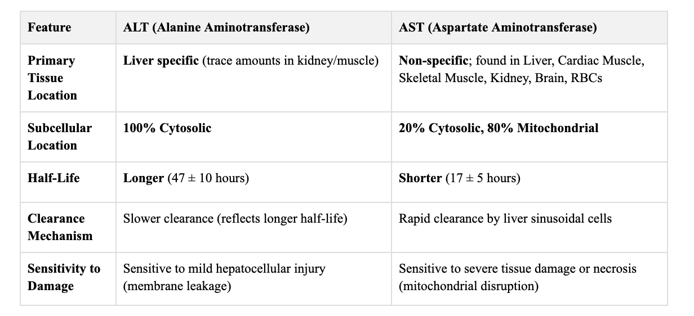
    - **DDx of reversed De-Reiter's Ratio:**
        - <u>Ischaemic hepatitis</u> - due to hepatic necrosis and release of mitochondrial AST
        - <u>HCC and secondary metastasis</u> - due to macromitochondria
        - <u>Alcoholic hepatitis and steatohepatitis</u> - due to macromitochondria
- **Alkaline phosphatase and gamma-glutamyl transferase** (ductal enzymes):
    - **ALP** - collection of several different enzymes that hydrolyse phosphate esters at alkaline pH:
        - <u>Physiology</u>:
            - Expressed in various tissues, including liver, GI tract, bone, placenta, and kidneys
            - In the liver, expressed in the hepatic sinusoids and biliary parenchyma
            - Undergoes post-translational modification into different <u>isoforms</u>, which are expressed at different levels in different tissues
            - These isoforms have different heat stability and may be differentiated by specific assays
        - <u>DDx of elevated ALP</u>:
            - Osteoblastic activity - e.g. fractures
            - Pregnancy - increased production from placenta
            - Liver and biliary disease:
                - Infiltrative liver diseases (sinusoidal obstruction)
                - Intrahepatic or extrahepatic biliary obstruction
    - **GGT:**
        - <u>Physiology</u>:
            - Responsible for transfer of gamma-glytamyl peptide to other peptides and amino-acids
            - Expressed in various cells but highest concentration in the liver
            - Expression of GGT may be induced in ALD, MASLD, or microsomal enzyme-inducing drugs
        - <u>DDx of elevated ALP</u>:
            - Intrahepatic and extrahepatic biliary obstruction
            - Alcoholism
            - MASLD
            - Microsomal enzyme inducing drugs

      
      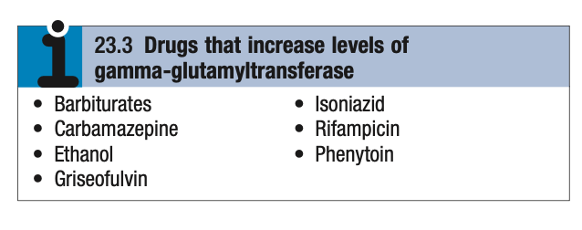
- **Patterns of LFT:** 
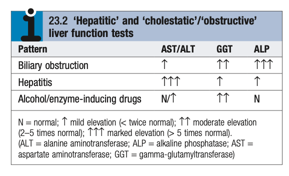

### Other Blood tests

- **Other significant blood tests:**
    - CBC
    - RFT
    - Ferritin
    - Clotting profile
    - Liver screen
- **Identification of the cause of LFT abnormality:** 
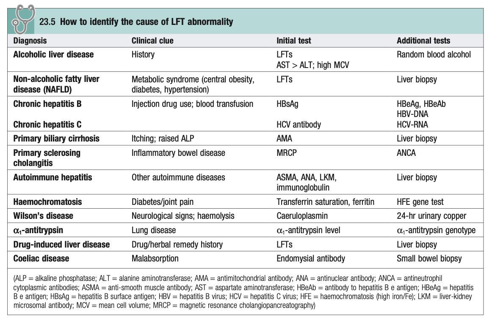

### Immunological tests

- **Liver screen:** 
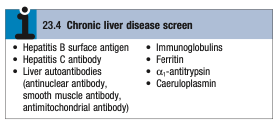
    - <u>Viral hepatitis</u> - HBsAg, Anti-HBc, Anti-HCV
    - <u>Ig pattern</u> - hypergammaglobulinaemia (IgM, IgG) suggestive of an autoimmune process (accounts for reversed A:G ratio), but elevated IgA are often seen in advanced liver disease but is non-pathogenic (see IgA nephropathy)
    - <u>Liver autoantibodies</u> - ANA, anti-SMA, anti-LKM, anti-mitochondrial antibody
    - <u>Ferritin</u> - markedly elevated levels suggest haemochromatosis; while modest elevations suggest alcohol excess and inflammatory conditions

### Imaging

### Histological examination

### Non-invasive markers of hepatic fibrosis

- **Non-inavsive markers of hepatic fibrosis:**
    - <u>Novel serological studies</u> - alpha-2-macroglobulin, haptoglobulin or enhanced liver fibrosis assay (combination of hyaluronic acid, procollagen peptide III, and tissue inhibitor of metalloproteinase I)
    - <u>Transient elastography</u> (e.g. fibroscan) - USG-based shock wave as a measurement of liver stiffness (LSM) for hepatic fibrosis, now also used for assessment of steatosis (CAP)

## Presenting problems in liver disease

### Acute liver failure

- **Definition** - practically defined as acute deterioration of liver function w/ encephalopathy and prolonged INR \<= 8 weeks from the onset of precipitating illness, in the absence of evidence of pre-existing liver disease
- **Differences between acute liver failure and acute-on-chronic liver failure** - difference in the extent of hepatocyte loss necessary for triggering ALF:
    - Acute liver failure in a previously healthy individual suggests a <u>very high level of insults</u>, hence prognosis is very poor (fulminant liver failure)
    - Patients w/ chronic liver disease may develop acute liver failure w/ minimal insult, which is associated w/ paradoxially lower risk
- **Etiology of acute liver failure** - any cause of hepatotoxicity provided that it is sufficiently severe: 
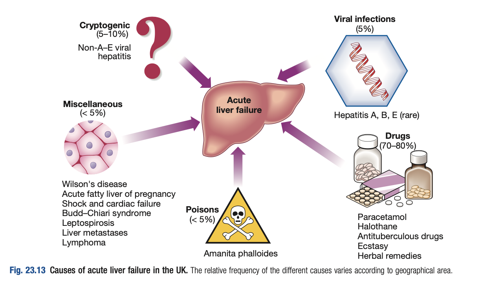
    - <u>Acute viral hepatitis</u> (most common cause worldwide) - HAV, HEV, HBV
    - <u>Drug-induced hepatitis</u>:
        - Paracetamol toxicity (esp. on a background of chronic alcoholism; most common cause in the UK)
        - Anti-tuberculous medications
        - Traditional chinese medication
    - <u>Poisonings</u> - Amanita phalloides (mushroom poisoning)
    - <u>Autoimmune hepatitis</u> - rare but possible manifestation of fulminant hepatitis in the first episode
    - <u>Miscellaneous</u>:
        - Wilson's disease
        - Pregnancy-related liver failure (e.g. acute fatty liver of pregnancy, HELLP syndrome)
        - Shock liver
        - Diffuse liver metastasis
        - Lymphoma
        - Cryptogenic (postulated to be related to non A-E viral hepatitis)
- **Classification of acute liver failure** - classification based on interval between onset of jaundice to encephalopathy: 
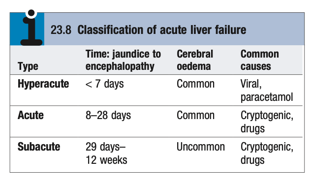
- **Clinical features of acute liver failure:**
    - **Jaundice** - classically precedes encephalopathy but there are exceptions:
        - <u>Jaundice preceeding encephalopathy</u> - viral hepatitis, autoimmune hepatitis
        - <u>Absence of jaundice</u> - paracetamol overdose, Reye's syndrome, fulminate cases of acute liver failure
    - **Cerebral disturbances** - as a result of 1) hepatic encephalopathy, and 2) cerebral oedema:
        - <u>Features of encephalopathy</u> - progresses from mild, episodic occurences of reduced alertness, into aggressive behaviour and finally coma (may be a/w fetor hepaticus): 
        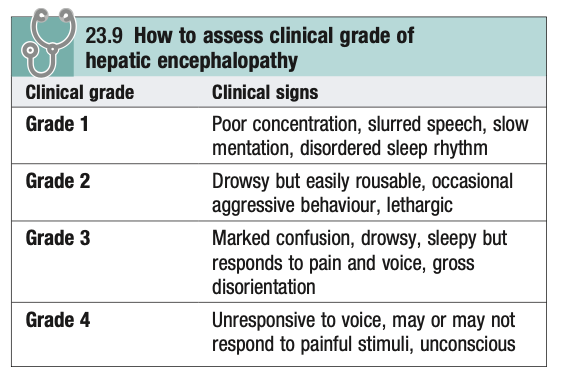
        - <u>Features of cerebral oedema</u>:
            - Raised ICP - N/V, weakness, myoclonus or seizures
            - Brain herniation - unequal, fixed pupils, hypertensive episodes, bradycardia, hyperventilation
    - **Ascites** - should raise the suspicion of a background of chronic liver disease, but can in fact occur in acute Budd-Chiari syndrome
- **P/E:**
    - <u>Fetor hepaticus</u> - shunted mercaptans to the lungs; may be present
    - <u>Absence of hepatomegaly or splenomegaly</u> - presence should raise suspicion of background of chronic liver disease
    - <u>Ascites and edema</u> - likely related to fluid therapy
- **Ix** - search for etiology, detection of complications, and prognostication:
    - **Routine bloods** - CBC, LRFT, clotting profile, RBG, ammonima levels:
        - <u>CBC</u> - clue for alcoholism, and underlying chronic liver disease (e.g. PLT)
        - <u>LFT</u> - extent of liver injury:
            - Differentiation between the etiology based on pattern of rise and trends
            - Bilirubin used as a prognostic marker
        - <u>RFT</u> - electrolyte disturbances and AKI complicating ALF
        - <u>Clotting profile</u> (q12h) - prolonged PT and INR for prognostication
        - <u>RBG</u> (q2h in acute phase) - due to high risk of hypoglycaemia that is "clinically silent" during HE
        - <u>Ammonia</u> - hyperammonaemia is non-specific for HE
    - **CT brain** - indicated due to altered mental status:
        - r/o other causes of delirium
        - Marked cerebral oedema w/ sucal effacements
        - +/- Evidence of herniation
    - **Ix for evaluation of cause of ALF:**
        - <u>Toxicology screen of blood and urine</u> - Acetaminophen (Rummack nomogram), alcohol, illicit drugs, iron
        - <u>Viral hepatitis serology</u> - HBsAg, IgM Anti-HBc, Anti-HAV, Anti-HEV
        - <u>Additional viral serology</u> - CMV, HSV, EBV
        - <u>Autoimmune hepatitis</u> - Ig, ANA, Anti-SMA, Anti-LKM, Anti-SLA
        - <u>Wilson's disease</u> - **serum caeruloplasmin**, urinary copper, SL examination
        - <u>Budd-Chiari syndrome</u> - USG liver w/ doppler of the hepatic veins
    - **Liver Bx** - typically <u>contraindicated</u> because of severe coagulopathy
- **King's criteria** - adverse prognostic criteria in acute liver failure: 
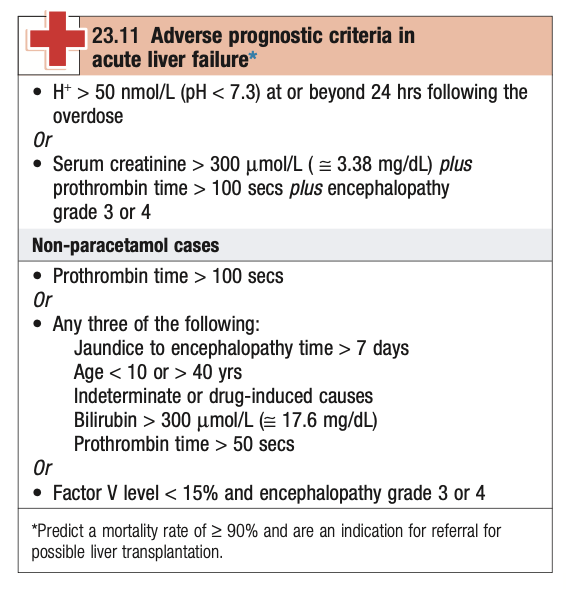
- **Complications for acute liver failure:** 
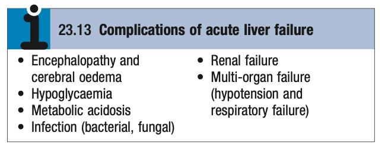
- **Mx:**
    - **Principles of Mx:**
        - <u>Specific Mx</u> - specific Mx for certain causes of ALF
        - <u>ICU monitoring</u> - monitoring for complications of acute liver failure
        - <u>Conservative Mx</u> - supportive Mx to maintain life in hopes that hepatic regeneration will occur
        - <u>Liver transplant</u> - increasingly viewed as a viable option
    - **Specific Mx:**
        - N-acetylcysteine therapy for paracetamol overdose
        - Glucocorticoids for alcoholic hepatitis in the absence of infection
    - **Close monitoring in intensive care unit:** 
    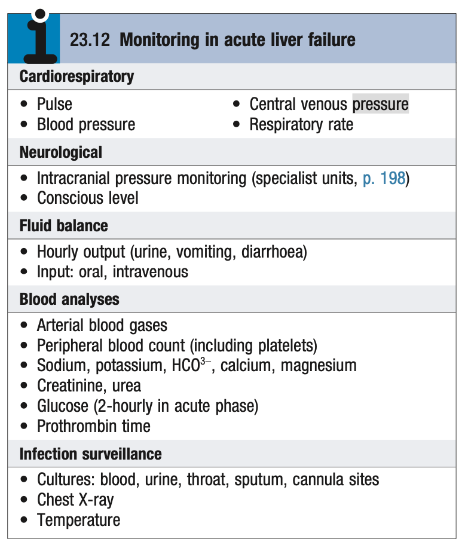

### Abnormal LFT

- **Background:**
    - LFTs are often routinely requiested for routine health checks, insurance medicals, and drug monitoring
    - Those w/ chronic liver disease may have dLFT but are otherwise asymptomatic (or have very vague, non-specific Sx)
    - Abnormal LFTs in otherwise asymptomatic individual is a common scenario and require structural evaluation
- **Epidemiology:**
    - <u>Prevalence</u> - up to 10% in some studies (3.5% of patients prior to elective surgery)
    - <u>Most common etiology</u> - alcoholic hepatitis, MASLD
- **DDx of hepatocellular pattern of dLFT:** 
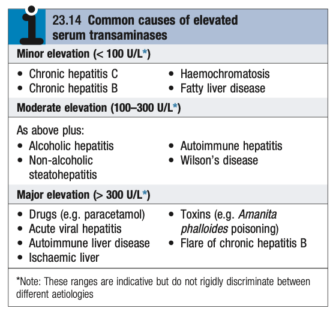
- **DDx of cholestatic pattern of dLFT:** 
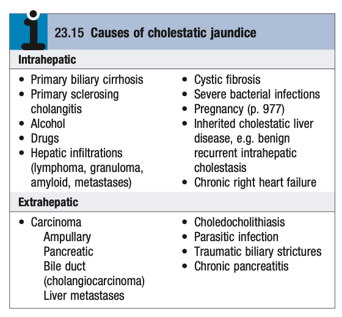
- **Salient points of Hx:**
    - **HPI** - generally no chief complaint other than incidental finding of dLFT
    - **Associated Sx:**
        - <u>Jaundice</u> - icteric illness, tea colour urine etc.
        - <u>Neurological Sx</u> - e.g. tremors or movement disorders in Wilson's disease
    - **Risk factor assessment:**
        - <u>Drug Hx</u> - prescription medications, OTC drugs, TCM, illicit drugs
        - <u>Alcohol Hx</u> - thorough Hx of alcohol consumption (see notes on Alcoholic liver disease)
        - <u>Risk factors for viral hepatitis</u> - tattoos, injection drug use, blood transfusions
        - <u>Hx of autoimmune disease</u> - ulcerative colitis, hashimoto's thyroiditis, rheumatoid arthritis in personal Hx or FHx
        - <u>Evidence of metabolic syndrome</u> - e.g. obesity, DM
- **P/E** - look for stigmata of chronic liver disease (unreliable):
    - Presence of stigmata of chronic liver disease is indicative of underlying liver disease
    - Absence does not reliably rule out significant disease
- **Approach to the asymptomatic dLFTs:** 
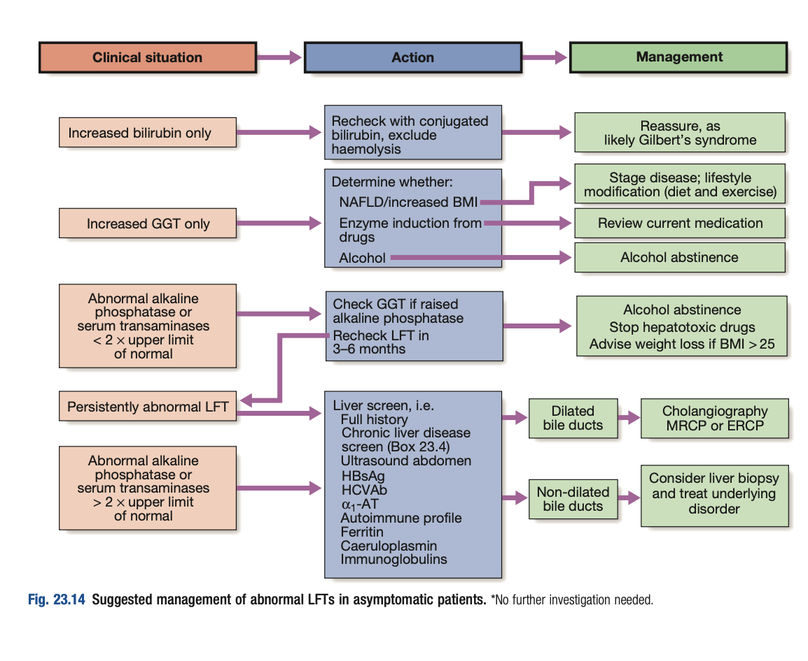
- **Hepatocellular pattern of dLFT:**
    - <u>Approach</u>:
        - Mild elevation of serum transaminase (\< 2x ULN) - lifestyle modification (weight loss and alcohol abstinence), consider stopping hepatotoxic drugs, and **recheck LFT q3-6mo**
        - Severe elevation of serum transaminase (\> 2x ULN) or persistent hepatocellular pattern - full Hx + liver screen
    - <u>Ix</u>:
        - **Liver screen:** 
        
        - **USG of the hepatobiliary system** - for dilated intra-hepatic ducts
        - **Additional Ix:**
            - <u>MRCP</u> - if dilated intra-hepatic ducts on USG
            - <u>Liver Bx</u> - if absence of dilated ducts and no identifiable causes
- **Isolated raised GGT:**
    - <u>Approach</u> - detailed Hx regarding alcohol, drugs, and risk factors of metabolic syndrome
    - <u>Mx</u>:
        - Alcohol abstinence
        - Lifestyle modification
- **Cholestatic pattern of dLFT** - USG of hepatobilliary system
- **Isolated hyperbilirubinaemia:**
    - <u>Approach</u>:
        - r/o haemolysis (e.g. LDH)
        - Recheck w/ conjugated bilirubin
    - <u>Mx</u> - reassurence if conjugated hyperbilirubinaemia as likely Gilbert's syndrome

### Jaundice

- **Definition** - clinical sign reflecting yellowing of the skin and sclera, reflecting hyperbilirubinaemia (clinically detectable when \> 40 mmol/L)
- **Etiology of jaundice** - classified into prehepatic, intrahepatic and post-hepatic causes:
    - **Prehepatic jaundice** - either by haemolysis or by congenital hyperbilirubinaemia, characterised by isolated hyperbilirubinaemia
    - **Hepatocellular jaundice** - caused by hepatocyte dysfunction in terms of uptake, conjugation and excretion into bile cannaliculi, accompanied by raised serum transaminase
        - **Acute liver injury** - Viral hepatitis, alcoholic hepatitis, drug-induced hepatitis, Autoimmune hepatitis
        - **Chronic liver disease** - Viral hepatitis, alcoholic liver disease, NAFLD, Wilson's disease, haemachromatosis, alpha-1 anti-trypsin deficiency, autoimmune hepatitis, HCC
        - **Congenital** - Dubin-Johnson syndrome (reduced excretion), Rotor syndrome (reduced uptake)
    - **Post-hepatic jaundice** - caused by 1) failure to initiate bile flow, 2) obstruction of bile ducts or portal tracts, 3) obstruction of flow between porta hepatis and ampulla of vater
        - **Intrahepatic cholestasis** - Primary billiary cirrhosis, Primary sclerosing cholangitis, liver SOL (lymphoma, granuloma, amyloid, metastasis), pregnancy, chronic right heart failure
        - **Extrahepatic cholestasis** - Cholangitis, choledocholithiasis, Malignant biliary obstruction (MBO), parasitic infections, biliary strictures (post-ERCP, chronic pancreatitis)
- **Clinical approach to jaundice:**
    - **HPI** - clinical features of obstructive jaundice, duration, time course, associated symptoms:
        - **Clinical features of obstructive jaundice** - pale stools, tea coloured urine, generalised pruritis prior to onset of jaundice, and secondary cholangitis (charcot's triad)
        - **Duration and time course** - acute vs chronic, static and progressive vs fluctuating and intermittent
        - **Associated symptoms:**
            - <u>Abdominal pain</u> - biliary colic suggestive of stones
            - <u>Fever</u> - suggestive of bile sepsis secondary to choledolithiasis (i.e. cholangitis) or malignant biliary obstruction
            - <u>Abdominal mass</u> - malignancy
            - <u>Weight loss</u> - malnutrition, chronic liver disease, and malignancy
            - <u>Stearrhoea</u> - reflects chronic cholestasis resulting in malabsorption
            - <u>Bleeding tendancy</u> - reflects chronic cholestasis resulting in impaired lipid-handling
    - **PMH** - identify risk factors suggestive of liver derrangement or cholestasis:
        - Intrahepatic jaundice - Hx of liver diseases (incl. HBV/HCV status), autoimmune disease Hx (thyroid), recent drug Hx and TCM intake
        - Obstructive jaundice - Hx of gallstone, prior TAUS, Hx of biliary colic Sx
    - **FHx** - liver disease, autoimmune disease or metabolic syndrome
    - **SHx** - alcohol history, RFs for viral hepatitis (blood transfusion and IV drug use)
- **PE** - complete abdominal examination:
    - General examination - cachexia, jaundice, pallor, stigmata of chronic liver disease, cervical LNs
    - Abdomen - epigastric mass, hepatomegaly, palpable gallbladder (Courvoisier's Law), ascites, PR bleeding
- **Ix** - LFT for all, and subsequent workup dependent on suspected type of jaundice
    - **LFT** - isolated hyperbilirubinaemia vs hepatocellular picture vs cholestatic picture
    - **Ix for pre-hepatic jaundice** - CBC, LDH, haptoglobin, +/- PBS +/- Coomb's test and haemolysis workup
    - **Ix for hepatocellular jaundice:**
        - **Assessment of derranged synthetic functions** - Clotting profiles (PT especially)
        - **Assessment of etiology:**
            - Serology - Anti-HAV IgM, HBsAg, Anti-HBc IgM, anti-HCV Anti-HEV IgM
            - Ig pattern and Autoimmune panel - ANA, ASMA, anti-LKM1
            - Metabolic screen - Cu studies and Fe profile
            - AFP
    - **Ix for post-hepatic jaundice:**
        - <u>Trans-abdominal ultrasound</u> (TAUS) - demonstration of mechanical obstruction and dilatation of biliary tree
        - <u>Cholangiography</u> - ERCP vs MRCP depending on clinical scenario
        - +/- <u>CT A+P</u> - clinically indicated for suspected MBO

### Hepatomegaly

- **Definition** - ?liver span \> 11cm (along right MCL)
- **DDx of hepatomegaly:**
    - **Parenchymal hepatomegaly** - Alcoholic cirrhosis, Haemochromatosis
    - **Neoplastic hepatomegaly:**
        - Malignant hepatomegaly - Primary liver tumour (HCC, intrahepatic CC), secondary liver metastasis (GI primary and others)
        - Benign hepatomegaly - <u>focal nodular hyperplasia</u>, agiomyolipoma, hemangioma, adenoma
    - **Infiltrative hepatomegaly** - haematological malignancies (lymphoma, leukaemia, amyloidosis), sarcoidosis
    - **Vascular hepatomegaly** - RHF, TR, Budd-Chiari syndrome
    - **Cystic hepatomegaly** - Polycystic Kidney Disease, cystadenoma, <u>liver abscess</u>

1.  Clinical approach to heptomegaly

    - **Salient points of Hx:**
      - **HPI:**
        - <u>Site</u> - is it really hepatomegaly?
        - <u>Onset and timecourse</u> - since when? progressive?
        - <u>Associated Sx</u> - identify features of malignancy:
          - **RUQ pain** - typically minimal dull, aching pain in malignant conditions (unless in acute complications)
          - **Features of obstructive jaundice** (tea-coloured urine, pale stools) - features of MBO
          - **Altered bowel habits and PR bleeding** - suggestive of colonic primary
          - **Constitutional Sx** - malaise, weight loss, anorexia
      - **PMH** - HBV/HCV status, other liver disease, conditions related to colorectal maligancy
      - **SHx** - alcohol (RF for alcoholic cirrhosis and HCC), diet (GI malignancy)
      - **FHx** - HBV status and Hx of GI malignancies
      - Systems review - Sx suggestive of other primary (e.g. cough, haemoptysis etc.)
    - **P/E:**
      - General - pallor, jaundice, lymphadenopathy, <u>stigmata of chronic liver disease</u>
      - Abdomen - hepatomegaly (liver span, tenderness, consistency, surface, edge, bruit), other organomegaly (e.g. splenomegaly), mass, ascites, PR exam
        - Characteristic of hepatomegaly:
          - Diffuse, smooth firm hepatomegaly - alcoholic cirrhosis, haematological malignancies
          - Irregular, hard hepatomegaly - HCC (typically soft and vascular), CC, secondary malignancy
      - Systems review
    - **Ix:**
      - **Routine bloods** - CBC, LRFT, Clotting
      - **Viral hepatitis serology** - HBsAg, Anti-HBs, Anti-HBc, Anti-HCV
      - **Tumour markers** - AFP, CEA, CA19-9
      - **Imaging** - CXR, US upper abdomen, CT, staging imaging (MRI, PET-CT)
      - **+/- other Ix** - based on clinical suspicion:
        - Endoscopy - colonoscopy (colorectal primary, +ve PR), upper endoscopy
        - Biopsy - FNAC, Trucut core biopsy (risk of bleeding, and tumour cell seeding)

### Ascites

- **Definition** - accumulation of free fluid in the peritoneal cavity
- **Etiology of ascites** (common DDx in bold):
    - **Portal HTN** - Liver cirrhosis, cardiac cirrhosis, other causes of pHTN
    - **Primary disorders of the peritoneum** - peritoneal carcinomatosis, peritonitis, peritoneal TB, acute pancreatitis (pancreatic ascites)
    - **Liver disease** - HCC, liver metastasis, hepatic venous occlusion (e.g. Budd-Chiari syndrome, Veno-occlusive disease)
    - **Hypoproteinaemia** - Nephrotic syndrome, protein losing enteropathy, malnutrition
    - **Rarer causes** - Meig's syndrome, Hypothyroidism
- **Pathophysiology of ascites in portal HTN:** 
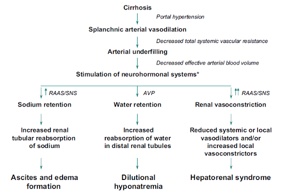
    - **Splanchnic arterial vasodilation** - mediated by local factors (e.g. NO), in response to portal HTN:
        - **Marked decrease in SVR and MAP** - results in neuroendocrine responses (SNS, RAAS, ADP) triggering Na and water retention
        - **Transudation of fluid into peritoneal cavity** - as a result of portal HTN, and fluid retention
    - **Other contributing factors include:**
        - **Hypoalbuminaemia** - increases transudation of fluids into the peritoneal cavity
        - **Portal hypertension** - increases transudation of fluids into the peritoneal cavity
        - **Liver decompensation** - <u>decreases rate of aldosterone metabolism and clearance</u>, increasing Na+ and water retention
- **Clinical features of ascites** - small amounts of ascites is asymptomatic:
    - <u>Abdominal distension</u> - classically buldging flanks with everted umbilicus when marked with white striae
    - <u>Sx related to ascites</u> - weight gain, SOB, early satiety
    - <u>+ve abdomen for ascites</u> - shifting dullness +/- fluid thrills
    - <u>Clinical S/S of underlying cause</u>:
        - Portal HTN - splenomegaly + caput medusae
        - IVC obstruction - gross bilateral LL oedema and upward-draining dilated veins
        - Peritoneal carcinomatosis - sister mary joseph nodule
- **DDx of abdominal distension** - 6Fs:
    - Fat - abdominal obesity
    - Flatus - intestinal obstruction (mechanical or ileus)
    - Foetus - pregnancy
    - Faeces - constipation
    - Filthy big tumour - giant pelvic tumour
- **Salient points of Hx:**
    - **HPI** - onset, progression, previous episodes:
        - <u>Onset and progression</u> - over course of days, weeks or months:
            - **Rapid progression** - suggestive of liver decompensation (e.g. cirrhosis, HCC, hepatic venous occlusion)
            - **Slow progression** - suggestive of malignant ascites due to peritoneal carcinomatosis
        - <u>Previous episodes</u> - first or repeated episodes?
            - **First episode** - must tap to find out etiology (even on background of known cirrhosis as it may be suggestive of liver decompensation by HCC)
            - **Repeated episode** - may not need to tap if attributed to a known cause
    - **Associated Sx:**
        - <u>Associated Sx related to ascites</u> - weight gain, dyspnoea, early satiety
        - <u>Associated Sx of liver decompensation</u> - variceal bleeding, hepatic encephalopathy
        - <u>Associated Sx of heart failure</u> - orthopnoea, PND, peripheral oedema, chest pain
        - <u>Lower GI Sx</u>:
            - **Diarrhoea and steorrhaea**
            - **Change in bowel habits** - e.g. constipation must r/o IO first
        - <u>Features of obstructive jaundice</u> - tea-coloured urine, pale stool, pruritis
    - **PMH** - HBV/ HCV, documented cirrhosis or liver disease
    - **Relevant SHx and FHx**
- **Ix:**
    - **Routine bloods** - suggests underlying cause of ascites:
        - <u>CBC</u>:
            - Thromboyctopenia suggestive of cirrhosis (hypersplenism)
            - Leukocytosis suggestive of peritonitis
        - <u>LFT</u> - assessment of cirrhosis and for determining SAAG for diagnostic paracentesis
        - <u>RFT</u> - concomitent renal failure
    - **Ultrasound** - diagnosis of ascites and evidence for cirrhosis or malignancy
    - **Diagnostic paracentesis** - determining cause of ascites (see below)
    - **CXR** - for concomitant pleural effusion (esp. on right side for hepatic hydrothorax) in 10% of patients
- **Diagnostic paracentesis:**
    - **Indications** - necessary for all new-onset ascites
    - **Ascitic fluid analysis:**
        - <u>Appearance</u>:
            - Cirrhosis - straw-coloured or light green
            - Malignant disease - bloody (1/3 bloody taps in cirrhotic patients have HCC)
            - Infection - cloudy
            - Biliary communication - heavy bile staining
            - Lymphatic obstruction - chylous
        - <u>WBC and differentials</u> - \> 250 cells/mm3 in SBP
        - <u>Total protein and Serum-ascites albumin gradient</u> (SAAG) - distinguish between transudative and exudative causes:
            - SAAG \> 11g/L - 96% PPV that ascites is due to portal HTN
            - SAAG \< 11g/L - infections (esp. TB), malignancy, hepatic venous obstruction, pancreatic ascites
            - Total protein \> 25g/L - typically due to hepatic outflow obstruction or RHF (but also in 30% of cirrhosis)
        - <u>Amylase</u> - \> 1000 U/L for Dx of pancreatic ascites
        - <u>Glucose</u> - low in infections or malignancy
        - <u>Cytological examination</u> - insensitive for malignant cells
- **Mx** - symptomatic relief but no effects on mortality:
    - **Principles of Mx of exudative ascites** - therapeutic paracentesis
    - **Principles of Mx of transudative ascites:**
        - Restriction of Na and water intake
        - Diuretics
        - Therapeutic paracentesis with fluid replacement (IV albumin)
        - Monitor - avoid excess fluid depletion by daily body weight Mx and complications
    - **Sodium and water restriction:**
        - **Sodium restriction:**
            - <u>Diet</u> - \< 100 mmol/d ('no added salt diet')
            - <u>Drugs</u> - avoid drugs w/ high Na intake and drugs that promote Na retention
        - **Fluid restriction** - \< 1-1.5L/d only if Na \< 125 mmol/L
    - **Diuretics:**
        - <u>Regimen</u> - Spironolactone +/- Furosemide (100:40 ratio)
        - <u>Dosing</u> (start low and go slow) - initiate Spironolactone 100mg/d with max dosing at 400mg spironolactone + 160 mg furosemide, titrated against rate of fluid loss (\< 1L/d)
        - <u>Monitoring</u> - monitor serum K, Na, and Cr (esp. on furosemide)
        - <u>Diuretic-resistant ascites</u> - if resistant against maximum doses or unable to tolerate maximal doses due to hypoNa or renal impairments, require Tx by other measures
    - **Therapeutic paracentesis:**
        - <u>Indications</u> - refractory ascites
        - <u>Procedure</u> - paracentesis to dryness with IV albumin (100 ml 20% HAS for every 1.5-2L of ascitic fluid drained)
    - **Complications of ascitic Mx:**
        - Precipitate Hepatic encephalopathy
        - Electrolyte disturbances - e.g. HypoNa, HyperK
        - AKI - due to over-diuresis
- **Prognosis** - poor:
    - 5y survival after 1st episode of ascites due to cirrhosis -10-20%
    - 1y survival after SBP - 50%

1.  Spontaneous bacterial peritonitis

    - **Definition** - spontaneous onset of peritonitis due to translocation of enteric organisms into ascitic fluid
    - **Clinical features of SBP** - clinical suspicion raised in a <u>cirrhotic patient</u> presenting with 1) Ascites, 2) Fever, and 3) Hepatic Encephalopathy:
      - <u>Abdominal pain</u> - theoretically acute onset of sharp, diffuse abdominal pain reflecting peritonitis, but often unable to elicit from Hx perhaps due to encephalopathy
      - <u>Fever</u> - reflects an underlying infective process
      - <u>Hepatic encephalopathy</u> - precipitated by underlying sepsis and dehydration and often becomes the **predominant clinical feature**
    - **Signs of SBP:**
      - **Assessment of general consciousness** - reduced GC on GCS/ AVPU with evidence of delirium
      - **General examination:**
        - <u>Temperature</u> - febrile
        - <u>Vitals</u> - septic w/ or w/o shock
      - **Abdominal examination** - markly distended abdomen, but abdominal signs are mild or absent in 1-3 of patients:
        - Rebound tenderness
        - Guarding and rigidity
        - Absent bowel sounds
    - **Dx** - diagnostic paracentesis:
      - Cloudy fluid
      - Ascitic neutrophil count \>= 250 x 106 / L is diagnostic of SBP
      - Culture (Often -ve; E. coli is most commonly isolated, but multimicrobial culture should raise suspicion of perforated viscus)
    - **Mx:**
      - **Principles of Mx:**
        - <u>General measures</u> - IV albumin to prevent AKI
        - <u>Empirical IV broad-spectrum ABx</u> - initiated immediately upon suspicion
        - <u>Monitoring and reassessment</u> - reassess Tx response by repeat diagnostic paracentesis for decreasing PMN count
        - <u>Recurrence prevention</u> - ABx to prevent recurrence
      - **Empirical broad spectrum ABx:**
        - <u>Selection</u>:
          - IV 3rd generation cephalosporin (e.g. ceftriaxone, cefotaxime)
          - IV carbepenam
      - **ABx prophylaxis for recurrence** - fluoroquinolones:
        - Levofloxacin
        - Cibrofloxacin

        
        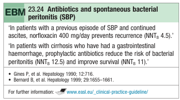

### Hepatic encephalopathy

- **Definition** - a neuropsychiatric syndrome caused by decompensated liver disease that when progresses, can lead to coma
- **Pathophysiology of HE:**
    - **Neurotoxin accumulation resulting in disruption of brain function** - exact neurotoxin is unknown, but postulated substances include:
        - <u>Ammonia</u> - traditionally an important risk factor (hence measured clinically), thought to arise as nitrogenous substances produced by gut baccterial action
        - <u>Gamma-aminobutyric acid</u> (GABA) - thought to be a mediator as is a known inhibitory neurotransmitter
        - <u>Others</u> - octopamine, amino acids, mercaptans, and fatty acids may act as neurotransmitters
    - **Accumulation of neurotoxins that are normally metabolised by the liver** - most affecting patients will have evidence of liver failure and portosystemic shunting but the balance between the two varies between individuals:
        - <u>Hepatocellular insufficiency</u> - reduced metabolic functions of the liver reduces the capacity for metabolism of neurotoxins into their non-toxic metabolites, such that they accumulate due to an increase in load
        - <u>Porto-systemic shunting</u> - direct shunting of neurotoxins into systemic circulation to affect the brain
    - **Triggers of HE** - HE may be precipitated by other factors, particularly other complications of liver disease (see below)
- **DDx of HE:** 
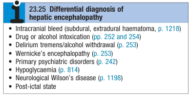
    - **Head injuries or intracranial bleeds** (common in alcoholics) - e.g. TBI, subdural haematoma, extra-dural haematoma
    - **Drug or alcohol intoxicication** - includes prescribed drugs such as <u>sedatives</u>, and <u>antidepressants</u>
    - **Delirium tremens** - i.e. alcohol withdrawal
    - **Wernicke's encephalopathy**
    - **Metabolic encephalopathies** - e.g. hyponatraemia, hypoglycaemia
    - **Primary psychiatric disorders**
    - **Post-ictal state**
    - **Neurological Wilson's disease** - if Hx of hepatic involvement of Wilson's disease
- **Preciptating factors of HE** - usually found if HE occurs acutely: 
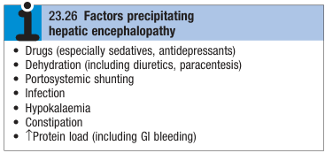
    - **Dehydration** - hypovolaemic state results in increased concentration of nerotoxins, and in a cirrhotic patient the following causes are important:
        - Variceal bleeding
        - Over-diuresis
        - Excessive paracentesis w/ replacement of IV albumin
    - **Increased portosystemic shunting:**
        - <u>Iatrogenic</u> - TIPPs procedure, surgery
        - <u>Vascular occlusion</u> - e.g. portal vein thrombosis, hepatic vein thrombosis
    - **Metabolic abnormalities** - hypoK, metabolic alkalosis
    - **Drugs** - esp. sedative and antidepressants as the brain in cirrhosis is excessively sensitive to such drugs
    - **Increased load of neurotoxins** - increased production or reduced excretion:
        - GI bleeding
        - Sepsis
        - Constipation
        - Renal failure
- **Approach to delirium or coma in a patient with a history of liver disease:**
    - <u>Hx</u> - detailed drug Hx, and exposure to medications, drugs, toxins or alcohol
    - <u>P/E</u> - assess for 1) hydration status, 2) GI bleeding
    - <u>Ix</u> - 1) r/o causes other than HE, and 2) Ix for HE and find precipitating cause
- **Clinical features of HE:**
    - **Neuropsychiatric manifestation:**
        - <u>Grade I</u> - slow mentation, change in behavior, disordered sleep
        - <u>Grade II</u> - lethargy, drosy but arrousable, irritable
        - <u>Grade III</u> - stupor, sleepy but responsive, incoherent speech, gross disorientation
        - <u>Grade IV</u> - coma and unresponsive to voice or pain

    
    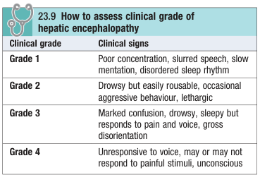
    - **Seizures** - ocassionally occur
- **Signs of HE** - dependent on severity:
    - **Assessment of general consciousnes** - GCS, AVPU score
    - **General examination:**
        - <u>Pallor</u> - may point towards UGIB
        - <u>Hydration status</u> - dehydration is an important precipitant of HE
        - <u>Flapping tremor</u> - may be initial manifestation of HE
        - <u>Fetor hepatis</u> - sign of liver failure and porto-systemic shunting rather than HE
    - **Psychometric test** - demonstrates poor mentation:
        - <u>Constructional apraxia</u> - inability to draw objects such as a start
        - <u>Reiten's test</u> - connection of numbers on a sheet for bedside monitoring of progress
    - **Neurological examination** - rarely present w/ focal neurological S/S and other causes must be ruled out:
        - <u>UMN pattern</u> - progressive HE may result in hyper-reflexia and bilateral up-going planterns
        - <u>Other patterns of chronic HE</u> - hepatocerebral degeneration results in variable patterns of:
            - Cerebellar dysfunction
            - Parkinsonian syndromes
            - Spastic paraplegia
            - Dementia
    - **Systems review** - assessment of cause:
        - <u>Temperature</u> - fever suggestive of underlying sepsis
        - <u>Ascites</u> - Tx may complicate w/ HE, or reflect underlying SBP
        - <u>PR bleeding</u> - r/o GI bleeding
- **Ix:**
    - **Arterial ammonia** - usually raised in patients w/ HE (however raised levels may occur in absence of HE, limiting diagnostic evaluation)
    - **CT Brain** - r/o other causes of delirium or coma
    - **Electroencephalogram** (EEG):
        - Diffuse slowing of normal alpha waves
        - Eventual development of delta waves
    - **Additional Ix** - Dx of precipitating causes:
        - <u>CBC</u> - Hb for GI bleeding, HCT as marker of hydration, WBC for potential infection
        - <u>RFT</u> - detect UGIB (U:Cr ratio), renal failure, hypoK, or metabolic alkalosis
        - <u>Toxicology screen</u> - for drugs (including sedatives) or alcohol
        - <u>Septic workup</u> - blood and urine cultures +/- paracentesis for SBp
- **Dx** - clinical, but requires ruling out other causes
- **Mx:**
    - **Principles of Mx:**
        - <u>Dx and Tx of precipitating causes</u> - requires additional workup to remove precipitating cause (e.g. coorrect hypokalaemia)
        - <u>Suppress production of neurotoxins</u> - mainly by targeting bacterial production of nitrogenous compounds in the bowel by lactulose and rifaximin
        - <u>Liver transplantation</u> - chronic or refractory encephalopathy is one of the main indications for LT
    - **Lactulose:**
        - <u>Regimen</u> - 15-30 mL tid (titrated to loose stool 2-3x a day)
        - <u>MOA</u>:
            - Osmotic laxative effect
            - Reduction of colonic pH
            - Promotes incorporation of nitrogen into bacteria
        - <u>S/E</u> - diarrhoea can be troublesome
    - **Rifaximin** - typically used in additon to lactulose to provide maximal clinical benefit:
        - <u>Regimen</u> - 400 mg tid
    - **Role of protein restriction** - no longer recommended:
        - Often unpalatable
        - Can lead to worsening nutritional state in already malnourished patients

### Variceal bleeding

- **Definition** - acute UGIB from gastroesophageal varices
- **Risk of bleeding** - dependent on PVPG:
    - <u>Small varices</u> - 2y risk 7%
    - <u>Large varices</u> - 2y risk up to 30%
- **DDx of variceal bleeding** - patients w/ cirrhosis can develop non-variceal bleeding (20%):
    - <u>Peptic ulcer disease</u> - higher incidence of peptic ulceration in patients w/ chronic liver disease compared w/ general population
    - <u>Mallory-Weiss syndome</u> - especially w/ alcoholic cirrhosis
- **Mx** - primary prevention and control of variceal bleeding:
    - **Principles of Mx:**
        - <u>Routine screening and primary prevention of variceal bleeding</u>
        - <u>Acute management of variceal bleeding</u> - management of upper GI bleeding with pre-endoscopic Tx and various modalities: 
        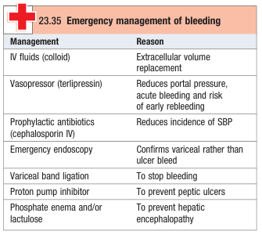
        - <u>Secondary prevention of recurrent variceal bleeding</u> - e.g. Beta-blockers, esophageal banding programmes, TIPPS
    - **Primaey prevention of variceal bleeding:**
        - **Beta-blocker therapy** - initiated if non-bleeding ulcers are identified at endoscope:
            - <u>Selection</u> - Propanolol (80-160mg/d), Nandolol, Carvedilol
            - <u>MOA</u> - reduce HR, thus reducing portal venous pressures
            - <u>Clinical efficacy</u> - reduces incidence, mortality from variceal bleeding
        - **Prophylactic banding** - indicated for large varices
    - **Management of acute variceal bleeding:**
        - **Resuscitation** - O2 if shock, fluids (colloids), restriction transfusion strategy
        - **IV antibiotics:**
            - <u>Selection</u> - IV cephalosporin or quinolones (e.g. ciprofloxacin)
            - <u>Rationale</u> - SBP and sepsis is common in variceal bleeding (demonstrated to improve outcomes)
        - **IV terlipressin** - pharmacological reduction of portal venous pressure:
            - <u>RoA</u> - intermittent injection rather than continuous infusion
            - <u>Dosing</u> - IV 2mg q.i.d until bleeding stops, followed by 1mg q.i.d. for up to 24h
            - <u>MOA</u> - Splanchnic vasoconstriction reducing portal blood flow and hence reduces portal pressure
            - <u>S/E</u> - beware in IHD or PAD due to vasoconstrictive properties
        - **Endoscopic Tx** - diagnostic of variceal bleeding and therapeutic maneuvers:
            - **Band ligation** - preferred over injection sclerotherapy:
                - <u>Principles</u> - rubber band cap to occlude varices, which subsequently sloughs w/ variceal obliteration
                - <u>Technical details</u> - banding repeated q4-6w until varices are obliterated (w/ follow up endoscopy for recurrence)
                - <u>Complications</u> - banding-induced ulceration and bleeding (prevented by acid suppression)
            - **Injection sclerotherapy:**
                - <u>Principles and technical details</u> - injection of sclerosing agent in varices
                - <u>Complications</u>:
                    - Perforation of esophagus
                    - Benign esophageal strictures
            - **Balloon tamponade:**
                - <u>Principles</u> - balloon at pressure \> Portal venous pressure to stop bleeding as a **bridge to definitive therapy**
                - <u>Technical details</u>:
                    - Endotracheal intubation prior to tube insertion - reduce risk of aspiration
                    - Insertion of **Sengstaken-Blackmore tube** - tip placed into stomach confirmed by radiology (or via endoscopic vision)
                    - Inflation of the gastric balloon (200-250 mL) - gental traction to maintain pressure on the varices to control bleeding
                    - Inflation of esophageal baloon to no less than 40 mmHg - requires deflation for 10 minutes every 3h to avoid mucosal damage
        - **Transjugular intrahepatic portosystemic shunt** (TIPSS):
            - <u>Principles</u> - reduction of portal pressure by placing stent between portal vein and hepatic vein
            - <u>Clinical outcomes</u> - 1) Reduces variceal bleeding, 2) Increased HE, 3) Does not improve survival 
            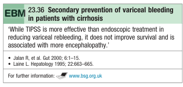
            - <u>Complications</u>:
                - Hepatic encephalopathy - managed by reducing shunt diameter
        - **Surgery** - Tx of last resort:
            - <u>Portosystemic shunt surgery</u> - often leads to HE and reserved for patients w/ good liver function
            - <u>Oesophageal transection</u> - Tx of last resort, but operative mortality is high
- **Prognosis** - overall mortality 15%, but as high as 45% in decompensated liver function (Child's C)

## Cirrhosis

- **Definition** - a histological diagnosis describing diffuse hepatic fibrosis and regenerative nodule formation
- **Etiology of cirrhosis** - most commonly 1) chronic viral hepatitis (HBV, HCV), 2) alcoholiic liver disease, 3) NALFD:
    - <u>Chronic viral hepatitis</u> - HBV, HCV
    - <u>Alcoholic liver disease</u>
    - <u>Non-alcoholic fatty liver disease</u>
    - <u>Autoimmune disease</u> - e.g AIH, Primary sclerosing cholangitis
    - <u>Biliary and cholestatic disease</u> - primary biliary cirrhosis, secondary biliary cirrhosis, cystic fibrosis
    - <u>Chronic venous outflow obstruction</u> - right heart failure, TR, hepatic veno-occlusive disease (e.g. Budd-Chiari syndrome)
    - <u>Genetics</u> - alpha-1-antitrypsin deficiency, Haemochromatosis, Wilson's disease
    - <u>Cryptogenic cirrhosis</u> (~15%)
- **Pathophysiology of cirrhosis** - viscious pathological cycle of injury and regeneration:
    - <u>Initial liver insult</u> - stellate cells are activated by Kupffer cells which differentiate into myofibroblast-like cells causing fibrosis
    - <u>Autocrine activation</u> - activated stelate cells perpetuate theirown activation bby synthesis of TGF-beta, PDGF through autocrine loops
    - <u>Molecular mechanisms of liver fibrosis</u> - release of fibrogenic and inflammatory cytokines, where ET1-induced vasoconstriction may further induce portal HTN

  
  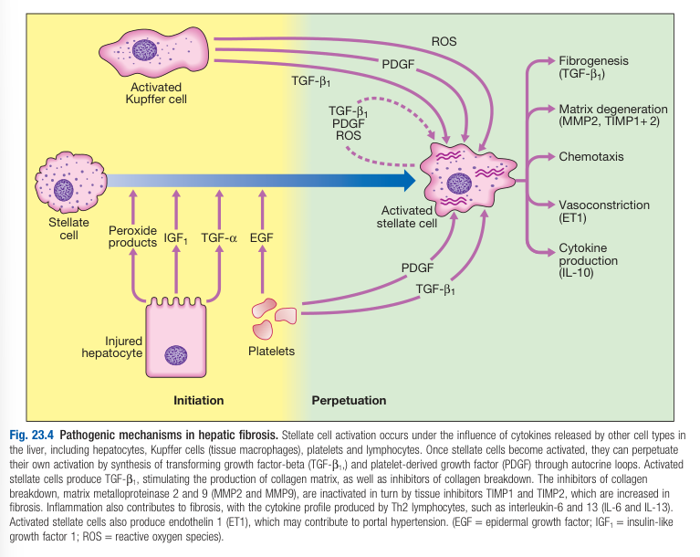
- **Clinical features of cirrhosis** - highly variable, initial presentation dependent on whether chronic liver disease is known, but principally caused by portal HTN or hepatic insufficiency:
    - **Assymptomatic** - Dx through imaging either incidentally or routinely for screening
    - **Non-specific Sx** - weakness, fatigue, muscle cramps, weight loss, anorexia, N/V upper abdominal discomfort
    - **Features related to portal HTN** - due to venous congestion and porto-systemic shunting:
        - <u>Splenomegaly</u> - palpable spleen on physical examination with laboratory findings of **hypersplenism** (thrombocytopenia initially, followed by pancytopenia)
        - <u>Ascites</u> - accumulation of transudative fluid in the peritoneal cavity secondary to fluid retention from portal HTN
        - <u>Variceal bleeding</u> - from collateral vessels in the esophagus, gastric reptum and other areas
    - **Features related to hepatic insufficiency:**
        - <u>Hepatic ecephalopathy</u> - when the matabolic capcity of the liver is exceeded resulting in accumulation of neurotoxins, attributed to both hepatic insufficiency and portal HTN
        - <u>Jaundice</u> - hepatocellular jaundice as a result of reduced capacity for uptake and conjugation of bilirubin
        - <u>Endocrine changes</u> - hyperestrogenic state, due to reduced liver metabolism of oestrogen:
            - **Both sexes** - loss of libido, hair loss, circulatory changes (e.g. spider telangiectasia, telangiectasia, palmar erythema)
            - **Men** - gynaecomastic, testicular atrophy, impotence
            - **Women** - breast atrophy, hypo-/ a-menorrhoea
    - **Other clinical features:**
        - <u>Bleeding tendancy</u> (petechiae, purpura, epistaxis) - due to thrombocytopenia and coagulation factor deficiency
        - <u>Hypoalbuminaemia</u> (peripheral oedema, ascites, pleural effusion) - due to reduced albumin synthesis in liver decompensation
        - <u>Increased risk of infection</u>
    - **Mx:**
        - <u>Treatment of underlying cause</u>
        - <u>Maintenance of nutrition</u> - no role in low-protein diet in preventing hepatic encephalopathy
        - <u>Mx and treatment of complications</u> - e.g. Ascites, hepatic encephalopathy, variceal bleeding
        - <u>Screening and prophylactic Tx of varices</u> - Upper endoscopy q2y +/- initiation of beta blockers
        - <u>Screening for HCC</u> - regular surveillance for HCC q6mo by TAUS and AFP measurement
        - <u>Liver transplantation</u> - chronic liver failure (decompensation) or early HCC can be treated by LT
    - **Prognosis** - poor (oveerall 5y survival 25% depending on liver function), and unpredictable due to fatal complications:
        - **Varying prognosis based on liver function** (Child-Pugh Score):
            - Child's A - 5y survival \> 50%
            - Child's B/C - 5y survival \< 20%
        - **Poor prognostic factors** - features of liver decompensation:
            - Clinical - ascites, encephalopathy, jaundice
            - Laboratory - Hyperbilirubinaemia, hypoNa (\< 120 mmol/L), hypoalbuminaemia (\<30 g/L),prolonged PT
        - **Commonly applied prognostic score** - Child-Pugh Score, Model for end-stage liver disease (MELD) score
        - **Child-Pugh Score** - classification based on clinical and laboratory findings: 
        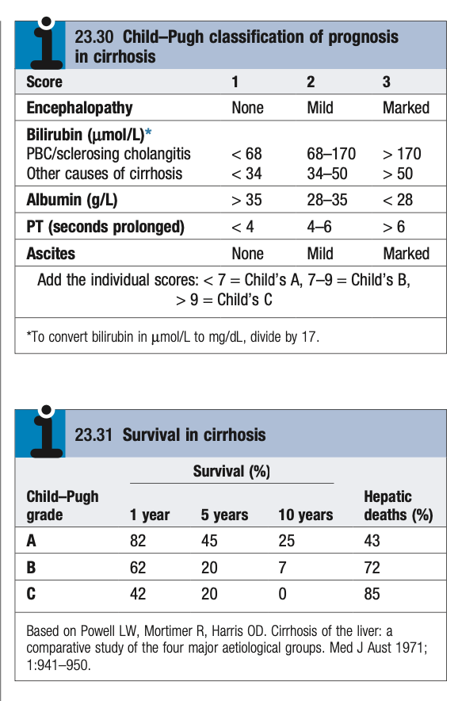
        - **Model for end-stage liver disease score (MELD score)** - based on purely laboratory findings: 
        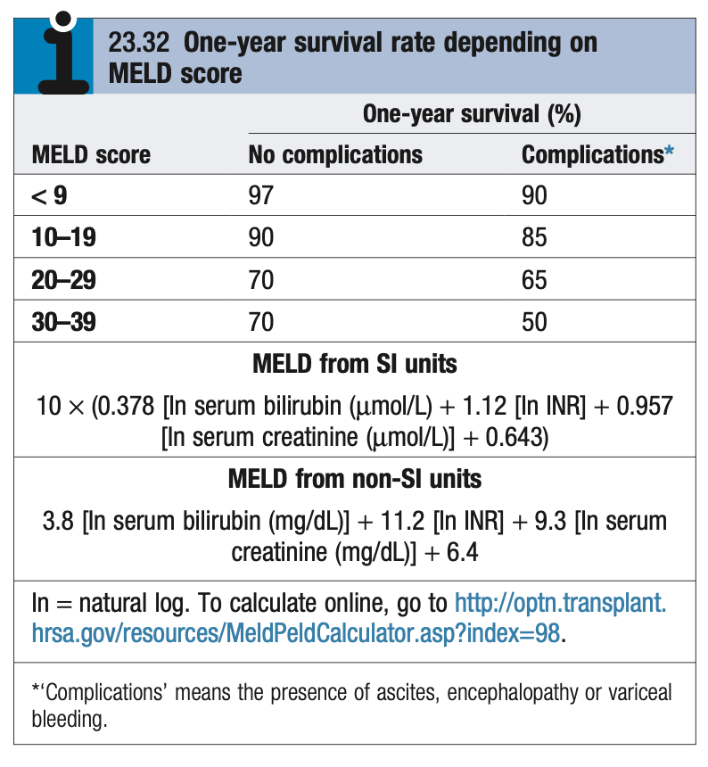

## Portal Hypertension

- **Definition** - Increased hepatic venous pressure gradient (HVPG) \> 10 mmHg
- **Etiology of portal HTN** - \> 90% attributed to cirrhosis but classified into pre-hepatic, intrahepatic, and posthepatic:
    - <u>Pre-hepatic</u> - portal vein thrombosis, splenic vein thrombosis
    - <u>Intrahepatic</u> - cirrhosis (95%), liver metastasis, nodular regenerative hyperplasia, polycystic kidney disease, schistosomiasis
    - <u>Post-hepatic</u> - Veno-occlusive diseaase, Budd-Chiari syndrome, Right Heart Failure, Tricuspid Regurgitation
- **Pathophysiology of portal HTN:**
    - <u>Increased portal vascular resistance</u> - gradual reduction of portal blood flow and development of collaterals (enabling porto-systemic shunting)
    - <u>Porto-systemic shunting</u> - development of collateral vessels enabling portal blood to bypass the liver and enter systemic circulation directly (\> 50% may be shunted):
        - **Distal esophagus** - leads to esophageal varices
        - **Stomach** - leads to gastric varices or portal-hypertensive gastropathy
        - **Rectum** - leads to rectal bleeding
        - **Anterior abdominal wall** - leads to the clinical sign of caput medusae
- **Clinical features of portal HTN** - arises from portal venous congestion and collateral vessel formation:
    - <u>Ascites</u> - arises from renal sodium retention and portal HTN
    - <u>Variceal bleeding</u> - fatal upper GI bleeding due to rupture of esophageal or gastric varices
    - <u>Hepatic encephalopathy</u> - attributes to HE by porto-systemic shunting of neurotoxins but does not fully explain the neuropsychiatric syndrome
    - <u>Fetor hepaticus</u> (late feature) - direct shunting of mercaptans to lungs
- **Signs:**
    - <u>Splenomegaly</u> - cardinal finding detected clinically or sonographically, resulting in hypersplenism and thrombocytopenia
    - <u>Dilated veins on abdominal wall</u> (caput medusae) - radiates from umbilical veins, rarely forming a large umbilical collateral with venous hum oon asuscultation (Cruveilhier-Baumgarten syndrome)
    - <u>Signs of underlying cause</u>:
        - **Stigmata of chronic liver disease** - suggestive of cirrhosis
- **Ix and Dx evaluation of portal HTN** - principally a clinical diagnosis:
    - <u>CBC</u>:
        - Thrombocytopenia - ~100 x 109 region due to hypersplenism, \< 50 x 109/L is uncommon
        - Leukopenia - ocassionally present attributed to hypersplenism
        - Anaemia - presence cannot be attributed to hypersplenism, but should be thoroughly investigated
    - <u>Transabdominal USG</u>:
        - Splenomegaly
        - Collateral vessels
        - Cause of portal HTN - e.g. cirhosis, portal vein thrombosis
    - <u>CT/ MRI angiography</u> - if suspecting vascular cause
    - <u>Endoscopy</u> - screening for esophageal varices (q2y)
    - <u>Measurement of portal venous pressure gradient</u> (PVPG) - rarely performed:
        - **Technique** - balloon cathetrisation via transjugular route to measure wedge hepatic venous pressure (WHVP) as surrogate of portal vein pressure, and hepatic vein pressure
        - **Interpretation:**
            - Clinically significant portal HTN - \> 10 mmHg difference
            - Pressure gradient leading to varices - \> 12 mmHg difference
- **Prognosis:**
    - 2y risk of variceal bleeding - 7-30% (depending on size of varice)
    - Mortality from variceal bleeding - 15% overall, but up to 45% in poor liver function (e.g. Child's C)
- **Mx of portal HTN** - primary prevention and control of variceal bleeding:
    - **Principles of Mx:**
        - <u>Routine screening and primary prevention of variceal bleeding</u>
        - <u>Acute management of variceal bleeding</u> - management of upper GI bleeding with pre-endoscopic Tx and various modalities
        - <u>Secondary prevention of recurrent variceal bleeding</u> - e.g. Beta-blockers, esophageal banding programmes, TIPPS
    - **Primaey prevention of variceal bleeding:**
        - **Beta-blocker therapy** - initiated if non-bleeding ulcers are identified at endoscope:
            - <u>Selection</u> - Propanolol (80-160mg/d), Nandolol, Carvedilol
            - <u>MOA</u> - reduce HR, thus reducing portal venous pressures
            - <u>Clinical efficacy</u> - reduces incidence, mortality from variceal bleeding
        - **Prophylactic banding** - indicated for large varices
    - **Management of acute variceal bleeding** - see notes on acute variceal bleeding
- **Congestive gastropathy:**
    - **Definition** - chronic gastric congestion as areas of punctate erythema on endoscopy caused by <u>long-standing portal HTN</u>
    - **Clinical features:**
        - Iron deficiency anaemia (more common) - requires iron supplementation and repeated blood transfusions
        - Acute upper GI bleeding (less common)
    - **Mx:**
        - Medical Tx - propanolol (80-160 mg/d)
        - TIPPS procedure

## Infections and the liver

### Viral Hepatitis

### Liver Abscess

- **Classification of liver abscess:**
    - Pyogenic
    - Hydatid
    - Amoebic

1.  Pyogenic Liver Abscess

    - **Definition** - liver abscesses caused by bacterial infection
    - **Epidemiology** - uncommon but more common in elderly
    - **Etiology of pyogenic liver abscess:**
      - <u>Ascending infection</u> (e.g. cholangitis) - often due to biliary obstruction (E. coli, and various streptococci)
      - <u>Haematogenous spread</u>:
        - Portal vein (mesenteric infections or colorectal pathologies) - gut streptococci, anaerobes like Bacterioides
        - Hepatic artery (e.g. from dental abscesses)
    - **Clinical features of pyogenic liver abscess** - often marked systemic upset (e.g. pyrexia of unknown origin):
      - **Systemic Sx** - fever, rigors (septic), and weight loss
      - **Abdominal pain** - RUQ shartp, well-localised pain that may radiate to the right shoulder tip:
        - <u>Site</u> - RUQ, a/w tender hepatomegaly
        - <u>Onset and progression</u> - acute, subacute
        - <u>Quality</u> - sharp, peritoneal pain (ocassionally a/w pleuritic pain)
        - <u>Radiation</u> - to right shoulder tip due to diaphragmatic irritation
      - **Jaundice** - mild typically due to hepatocyte injury, but bmay become severe if large abscess causes biliary obstruction
    - **Ix:**
      - **Blood cultures** - +ve in 50-80%
      - **Routine bloods** - CBC, LFT:
        - <u>CBC</u> - leukocytosis
        - <u>LFT</u>:
          - ALP raised
          - Hypoalbuminaemia (-ve APP)
      - **CXR** - corresponding findings to a liver abscess include:
        - Raised right hemidiaphragm
        - Right lung collapse
        - Right pleural effusion
      - **Contrast CT A+P** - most revealing Ix and shows 90% of symptomatic abscesses:
        - <u>Characteristic findings</u> - rim-enhancing mass w/ central hypoattenuation
        - <u>DDx of CT findings</u> - necrotic colorectal metastasis
        - <u>Image-guided drainage</u>:
          - diagnostic and provision of pus for culture
          - therapeutic
      - **Endoscopy** - requires r/o colonic pathologies if abscess is caused by gut-derived organisms (e.g. anaerobes, streptococci)
    - **Mx:**
      - **Principles of Mx:**
        - <u>Dx and Mx of underlying pathology</u> - e.g. biliary drainage for cholangitis
        - <u>Prolonged antibiotic therapy</u> - empirical ABx therapy w/ G+, G- and anaerobe coverage (e.g. ampicillin, gentamycin, and metronidazole)
        - <u>Surgical Mx</u> - rarely undertaken:
          - Surgical drainage of abscess
          - Hepatic resection for chronic persistent abscesses or pseudotumours

2.  Hydatid Cysts

    - **Definition** - specific form of liver abscess caused by Echinococcus granulosus infection

3.  Amoebic Liver Abscesses

    - **Definition** - liver abscess caused by Entamoeba histolytica infection

## Alcoholic Liver Disease

- **Definition** - spectrum of liver disease related to alcohol consuption
- **Epidemiology** - most common cause of chronic liver disease in the West
- **Factors influencing development of alcoholic liver disease:**
    - <u>Mean alcoholic consumption</u> - no linear relationship between dose and extent of liver damage:
        - Clinically significant chronic liver disease - quoted consumption \> 80g/d (10 units) for \> 5y
        - Alcoholic cirrhosis - quoted consumption \> 160g/d (20 units) for \> 8y
    - <u>Drinking pattern</u> - alcoholic liver disease and alcohol dependence are not synonymous (many who develop ALD may not be synonymous, and most dependent drinkers have normal liver function):
        - **Continuous drinking** - countinuous drinking with no recovery in between can cause extensive liver damage as there is no time for the liver to recover
        - **Intermittent or binge drinking** - recommended \> 2 alcohol-free days each week to give the liver a chance to recover
    - <u>Genetics</u> - genetic influence to alcoholism (high monozygous concordance) but not in the development of ALD
    - <u>Nutrition</u> - via synergistic effects w/ NAFLD or as alcoholism is frequently a/w malnutrition and morbidity
- **Pathophysiology of alcoholic liver disease:**
    - **Normal alcohol metabolism** - reaches peak concentration after 20 min (influenced by stomach content), and metabolised exclusively in the liver:
        - <u>Mitochondrial enzyme pathway</u> (80%) - alcohol dehydrogenase (ADH) converts ethanol into acetaldehyde, which is then converted to acetyl-CoA and acetate by aldehyde hydrogenase
        - <u>Microsomal ethanol-oxidising system pathway</u> (20%) - cytochrome CYP2E1 oxidises ethanol to acetate and is induced by alcohol (N.B. acetaminophen metabolism by the same enzyme)
    - **Overload of hepatic alcohol metabolism** - destruction of liver parenchyma due to non-immune and immune-mediated damage:
        - <u>Accumulation of acetaldehyde</u> - aducts w/ cellular proteins in hepatocytes to trigger immune response and cell injury
        - <u>Excessive MEOS system activation</u> - accumulation of ROS, leading to lipid peroxidation and mitochondrial damage (+/- susceptability to paracetamol-induced liver toxicity)
        - <u>Susceptibility to hepatotoxicity from low-dose paracetamol</u> - induction of CYP2E1 results in increased conversion of paracetamol into hepatotoxic NAPQI
    - **Pathogenesis of alcoholic cirrhosis** - repeated bouts of increased gut permeability results in leakage of endotoxins that activate Kupffer cells, resulting in chronic inflammation and release of pro-fibrotic cytokines

  
  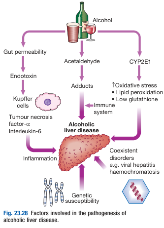
- **Histopathological features of alcoholic liver disease:** 
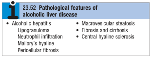
- **Clinical syndromes of ALD** - significant overlap but w/ different prognostic implications:
    - <u>Alcoholic fatty liver disease</u> (a/w good prognosis) - asymptomatic disease w/ dLFT, often a/w good prognosis and steatostasis disappears after a month
    - <u>Alcoholic hepatitis</u> (a/w worse prognosis) - acute hepatic flare manifesting as icteric illness and potentially acute liver failure, poor prognosis w/ 33% in-hospital mortality, and 5y survival of 70% (lower if fail to abstain)
    - <u>Alcoholic scirrhosis</u> (a/w worst prognosis) - poor but extremely variable prognosis at 5y survival around 50% (although some who survive the initial illness and become abstinent may have longer survival)

  
  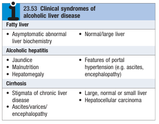
- **Clinical features of ALD** - wide clinical spectrum from mild abnormalities of LFT to advanced cirrhosis:
    - **Asymptomatic abnormal LFT** - asymptomatic findings of dLFT in a hepatocellular pattern, classically with **isolated elevated GGT** (normal ALP) pointing towards alcoholism but is in fact <u>non-specific</u> (also elevated in NAFLD)
    - **Manifestations of alcoholic hepatitis** - acute flare of hepatocellular injury often w/ progression to cirrhosis:
        - <u>Jaundice</u> - persistent icteric illness characterised by hyperbilirubinaemia, that evein if they abstain, may **persist for up to 6mo**
        - <u>Malnutrition</u> - muscle wasting, weight loss may accompany alcoholic hepatitis usually due to reduced self-care in chronic alcoholics
        - <u>Manifestations of acute liver failure</u> - lost of liver synthetic and metabolic functions with 1) bleeding tendancy due to prolonged PT, and 2) hepatic encephalopathy
        - <u>Manifestation of portal HTN</u> - typically if cirrhosis co-exists, manifesting as ascites and variceal bleeding
    - **Manifestations of alcoholic cirrhosis** - classically hepatomegaly presenting w/ complications of cirrhosis, including ascites, variceal bleeding, encephalopathy, or hepatocellular carcinoma
- **Ix** - depends on clinical presentation and disease severity:
    - **Routine bloods** - CBC, LRFT, clotting profile:
        - **CBC:**
            - <u>Hb and MCV</u> - macrocytosis in absence of anaemia is classically a/w alcohol misuse
            - <u>WBC</u> - raised WBC during alcoholic hepatitis is a poor prognostic marker
            - <u>PLT</u> - mild thrombocytopenia present if pHTN
        - **LFT:**
            - <u>AST/ALT</u> - characteristically \< 500 U/L, and **reversed De Ritis ratio** (AST:ALT \> 2:1) is cardinal for alcoholic hepatitis
            - <u>ALP/GGT</u> - isolated raised GGT is non-specific for ALD (as in NAFLD)
            - <u>Biluribin</u> - raised during alcoholic hepatitis (degree of elevation is prognostic)
            - <u>Albumin</u> - hypoalbuminaemia may be a result of malnutrition (or rarely decompensated cirrhosis)
        - **RFT:**
            - <u>Urea</u> - elevated urea is a poor prognostic marker in alcoholic hepatitis
            - <u>SCr</u> - concomittent hepatorenal syndrome
    - **Clotting profile** - isolated prolonged PT reflects synthetic failure
- **Assessment of severity of alcoholic hepatitis episode:**
    - <u>Maddrey score</u> (discriminant function \[DF\]) - cut-off value of 32 implies poor prognosis and guides Mx: 
    
    - <u>Glasgow alcoholic hepatitis score</u> - cut-off value of 9: 
    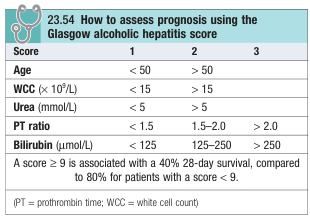
- **Mx:**
    - **Principles of Mx:**
        - <u>Alcohol abstinence</u> - lifelong abstinence in all to improve QoL, disease progression and prevent decompensation
        - <u>Corticosteroid therapy</u> - used during alcoholic hepatitis for those w/ poor prognosis
        - <u>Pentoxifylline</u> - some role in alcoholic hepatitis
        - <u>Liver transplantation</u> - may be indicated for patients w/ ALD (usually not alcoholic hepatitis) but controversial because disease recurrence depends solely on abstinence
    - **Corticosteroid:**
        - <u>Indications</u> - severe alcoholic hepatitis (Maddrey's DF score \> 32 or Glasgow score \>= 9)
        - <u>Clinical efficacy</u> - fall in biluribin observable within 7d usually (withdrawn if no response): 
        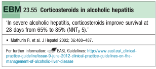
        - <u>S/E</u> - increased risk of sepsis and bleeding
        - <u>C/I</u>:
            - Active sepsis
            - Variceal bleeding
    - **Pentoxifylline:**
        - <u>Indications</u> - severe alcoholic hepatitis
        - <u>Clinical efficacy</u> - reduction of mortality and hepatorenal syndrome (NEJM Thursz et al 2015 seems to favour prednisolone): 
        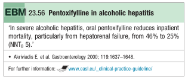
        - <u>MOA</u> - weak anti-TNF agent

## Non-Alcoholic Fatty Liver Disease

- **Definition and terminology** - NAFLD (now known as MASLD) is a spectrum of hepatic manifestations encompasing simple fatty infiltration (steatosis), fat and inflammation (non-alcoholic steatohepatitis), and cirrhosis (NASH-cirrhosis) in absence of excessive alcohol consumption:
    - <u>Steatosis</u> - histological manifestation w/ fat infiltration and minimal inflammation, and has not be related to liver-related morbidity
    - <u>Non-alcoholic steatohepatitis</u> (NASH) - fatty infiltration in presence of necroinflammation, linked with progressive liver fibrosis, cirrhosis, liver cancer, as well as an increased cardiovascular risk
- **NAFLD can be considered the hepatic manifestation of metabolic syndrome** - as risk factors and comorbid conditions relating to <u>insulin resistance</u> are extremely common in NAFLD patients:
    - <u>Risk factors for insulin resistance</u> - obesity (\> 90% of obese patients in the US has variable degrees of NAFLD), physical inactivity
    - <u>Comorbid conditions</u> - dyslipidaemia, T2DM, IGT

  
  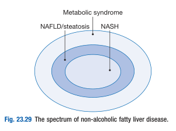
- **Pathophysiology of NAFLD** - "two-hit" hypothesis:
    - **Increasing insulin resistance as the first hit** - altered fat metabolism, i.e. imbalance between rate of influx and efflux of fatty acid in the liver results in steatosis (as an adaptive mechanism for storage of toxic lipids as relatively inert TG):
        - <u>Increased import and synthesis of FA</u> - due to increased FA uptake, and increased de novo fatty acid synthesis
        - <u>Decreased efflux and utilisation of FA</u> - due to reduced VLDL assembly and FA oxidation
    - **Second hit caused by various immune factors** - progression to NASH and cirrhosis is caused by several different hits:
        - Direct lipotoxicity
        - Increased oxidative stress produced during FA oxidation
        - Gut-derived endotoxins
        - Cytokine-release (e.g. TNF-alpha)

  
  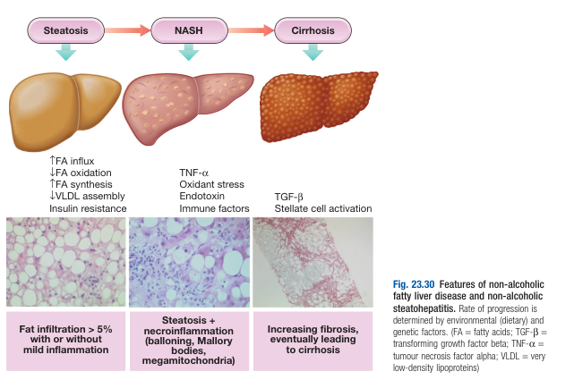
- **Clinical features of NAFLD** - clinically variable and is frequently asymptomatic:
    - <u>Asymptomatic</u> - identified as incidental biochemical abnormality during routine blood tests
    - <u>Non-specific Sx</u> - fatigue and mild right upper quadrant discomfort possibly due to distending liver capsule
    - <u>Manifestation of NASH and cirrhosis</u> - manifestation of an icteric illness or complications of cirrhosis (e.g. ascites, varieal bleeding, or HCC)
- **Ix:**
    - **Routine bloods** - LFT, ANA, iron profile:
        - **LFT:**
            - <u>AST/ALT</u> - modest elevations (\< 2x ULN) and typically AST:ALT ratios \< 1 (but reverse de Retis ratio seen in those w/ cirrhosis)
            - <u>GGT</u> - non-specific elevations (not attributable to alcoholism)
        - **ANA** - low titres +ve in 20-30%
        - **Iron profile** - non-specific elevation in ferritin
    - **Transabdominal USG** - for qualitative assessment of hepatic fat content:
        - <u>Test properties</u> - modest Sn (dependent on volume of liver affected by steatosis)
        - <u>Findings</u>:
            - Areas of hyperechogenicity (liver appears bright)
    - **Additional cross-sectional imaging** - CT/ MRI
    - **Liver Bx** - various histological Dx criteria and scoring systems for objective Dx
- **Mx:**
    - **Principles of Mx:**
        - <u>Non-pharmacological therapy</u> - address risk factors (e.g. weight reduction, increased physical activity)
        - <u>Pharmacological therapy</u> - no drugs currently licensed, Tx of comorbidities\*\* Autoimmune liver and biliary disease
- **Definition** - spectrum of hepatobiliary disease caused by an autoimmune process, ranging from primary hepatocellular injury (AIH), to biliary epithelial injury (PBC, PSC)

### Autoimmune hepatitis

- **Definition** - disease of immune-mediated liver injury characterised by circulating autointibodies and T lymphocytes reactive w/ self proteins (and a strong association w/ other autoimmune diseases)
- **Epidemiology:**
    - Demographic - most commonly seen in F in 2nd-3rd decade of life, but can arise in any sex and age
- **Pathophysiology of AIH:**
    - **Mechanism in breakdown in immune tolerance** - remains unclear, but attributed to cross-reactivity with viruses (e.g. HAV, EBV) in immunogenetically susceptible individuals
    - **Several subtypes of AIH** - different immunological markers:
        - Type 1 AIH (classically young female population) - ANA +ve, ASMA +ve, typically a/w IgG hypergammaglobulinaemia
        - Type 2 AIH (classically pediatrics or HCV infection) - Anti-LKM (liver-kidney-microsomal) +ve
        - Type 3 AIH - Anti-SLA (soluble lipid antigen) +ve, Anti-LP +ve
        - Type 4 AIH - no identifiable immune markers
- **Clinical features of AIH:**
    - Clinical presentation - variable in onset:
        - Insiduous onset - as non-specific fatigue, anorexia and jaundice, ocassionally asymptomatic w/ dLFTs
        - Acute onset - presents as icteric disease as in viral hepatitis, but does not resolve on its own, and can lead to extensive liver necrosis and ALF
    - Other non-specific clinical features - Amenorrhoea, fever, arthralgia, vitiligo, epistaxis
    - Presentation in chronic phase - signs of chronic liver disease +/- hepatosplenomegaly
    - Typically a/w a Hx of autoimmune diseases:
        - Hashimoto thyroiditis - presenting w/ thyrotoxicosis or myxoedema
        - Rheumatoid arthritis
        - Autoimmune haemolytic anaemia
        - Ulcerative colitis
        - Migrating polyarthritis
- **Ix:**
    - **Viral serology** - r/o overlying viral hepatitis
    - **LFT** - typically hepatocellular pattern dLFT in acute flares, elevated globulin (reversed A:G ratio)
    - **Immunoglobulin panel** - IgG hypergammaglobulinaemia in acute flares (key diagnostic feature and assessment of Tx responsiveness)
    - **Autoimmune markers** (+ve in low titre in certain healthy individuals) - Antinuclear Ab (ANA), Anti-smooth muscle Ab (ASMA), Anti-LKM Ab
    - \+*- Liver biopsy - for diagnostic uncertainty (shows interface hepatitis +*- cirrhotic features)
- **Mx:**
    - **Principles of Mx:**
        - Type 1 AIH is most steroid-sensitive compared to Type 2 AIH
        - Tx of acute exacerbations - high-dose corticosteroids
        - In between flares - reduced-dose steroid +/- steroid sparing therapy (Azathioprine, mycofenolate mofetil)
    - **Mx of acute exacerbation:**
        - **High-dose-corticosteroids** (40 mg/d) - dampen the immune process
    - **Maintenance Tx** - initated once LFT and IgG normalise:
        - Low-dose prednisolone (\<5-10 mg/d) +/- steroid sparing agements (e.g. 1-1.5 mg/d Azathioprine)
- **Prognosis** - Tx reduced rate of progression to cirrhosis (but can still occur despite Tx)

### Primary biliary cirrhosis

- **Definition** - chronic progressive cholestatic liver disease caused by autoimmune-mediated inflammation of the portal tracts, leading to loss of small and middle-sized bile ducts
- **Epidemiology** - typically affects middle-aged women of the West:
    - Geographical variation - more common in Europe and North America, rare in Africa and Asia
    - Demographic - strong female predominance (F:M = 9:1)
    - Environmental risk factors - cigarrette smoking and other environmental risk factors
- **Pathophysiology:**
    - **Autoimmune mechanism in a genetically-predisposed individual** - HLA-DR8 +/- polymorphyism in immune gnes
    - Production of auto-antibodies (typically IgM):
        - Production of AMA - direted at pyruvate dehydrogenase complex
        - ANA - selective binding to nuclear rim
    - Chronic granulomatous inflammation of interlobular bile ducts - spread to liver parehcyma to cause cirrhosis
- **Clinical features:**
    - Systemic Sx precede Dx for years - e.g. fatigue
    - Features of cholestasis - pruritis (severe causing scratch marks) is typically 1st complaint, typically worse on limbs, where jaundice presents late but becomes intense +/- Xanthelesma deposits
    - Bone malabsorption - bone pain or fractures from osteomalacia, or osteoporosis (hepatic osteodystrophy)
    - Associated diseases - autoimmune disease and CTD (esp. Sicca syndrome, SSc, coeliac and thyroid disease)
- **Ix and Dx:**
    - LFT - cholestatic pattern
    - Lipid profile - hypercholesterolaemia (worsens on progression, but not diagnostic)
    - US - r/o other cause of biliary obstruction
    - Autoimmune markers - AMA (95% +ve), ANA, ASMA (15% +ve), +/- associated disease autoantibodies
    - Cholangiography - r/o other biliary disease if AMA -ve
    - +/- Liver Bx - only in diagnostic uncertainty
- **Mx:**
    - Ursodeoxycholic acid (UDCA) - a hydrophilic bile acid displacing toxic hydrophobic bile acid in bile acid pool, improving bile flow
        - Dosage - 13-15 mg/kg/d
        - Clinical effects - normalise LFT, slow histological progression

### Primary sclerosing cholangitis

- **Definition** - autoimmune cholestatic liver disease caused by diffuse inflammation and fibrosis of the entire biliary tree ersulting in gradual obliteration of the intrahepatic and hextraheptic ducts, and ultimately biliary cirrhosis and liver failure
- **Epidemiology:**
    - <u>Incidence</u> - 6.3/100,000/y in Caucasians
    - <u>Demographic</u> - presentation at 25-40y, but theoretically at any age, male preponderance (M:F = 2:1)
- **Clinical associations of PSC** - autoimmune basis not as strong as AIH or PBC, but a/w manny organ-specific autoimmune disease: 
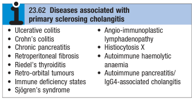
    - <u>Inflammatory bowel disease</u> - 3-10% of UC develop PSC (esp. if extensive or pancolitis) while \< 1% of CD develop PSC (N.B. UC and PSC significantly increase risk of CRC, and CRC significantly increases risk of CC)
    - <u>Autoimmune thyroid disease</u> - e.g. Riedel's thyroiditis
    - <u>Autoimmune pancreatitis/ IgG4-associated cholangitis</u>
- **Pathophysiology of PSC:**
    - <u>Infective or toxic exposure in a genetically susceptible individuals</u> - close link w/ HLA haplotype A1 B8, DR3, DRW52A (which is also a/w other organ-specific autoimmune disease)
    - <u>Immunological factors</u> - autoantibodies non-specific to PSC have been described (e.g. ANCA)
    - <u>Chronic inflammation and fibrosis of entire biliary tree</u> - results in characteristic generalised beading and stenosis visualised on cholangiography
- **Clinical presentation of PSC:**
    - **Asymptomatic** - Dx made on raised ALP/GGT on routine ALP in an individual with ulcerative colitis
    - **Intermittent obstructive jaundice** - non-progressive, intermittent tea-colour urine, pale stools, and pruritis
    - **Constitutional Sx** - e.g. fatigue, weight loss
    - **Abdominal pain** - non-specific RUQ pain
    - **Complications:**
        - <u>Cirrhosis and liver failure</u> - late stage of disease
        - <u>Colorectal carcinoma</u> - esp. w/ positive Hx of UC and PSC
        - <u>Cholangiocarcinoma</u> - occurs in 10-30% of patients during course of disease
- **Signs of PSC** - abnormal findings in 50% of symptomatic patients:
    - <u>General examination</u> - jaundice, features suggestive of other autoimmune disease (e.g. erythema nodosum, pyoderma gangrenosum in ulcerative colitis)
    - <u>Abdominal examination</u> - hepatomegaly and splenomegaly (suggestive of biliary cirrhosis)
- **Ix of PSC:**
    - **Blood tests:**
        - **LFT:**
            - <u>Bilirubin</u> - elvated, but fluctuates for no apparent reason
            - <u>Liver enzymes</u> - fluctuating cholestatic pattern (ALP and GGT elevated), with modest elevations of serum transaminase
            - <u>Albumin</u> - hypoalbuminaemia is a late feature suggestive of biliary cirrhosis
        - **Clotting profile** - elevated Pt suggestive of decompensated liver function
        - **Autoimmune markers:**
            - <u>ANCA</u> - elevated in 60-80% of patients (non-diagnostic), but only in 30-40% of patients with ulcerative colitis
            - <u>ANA, Anti-SM</u> - low titres may be found but not diagnostic
            - <u>AMA</u> - absence excludes PBC
    - **Cholangiography** - MRCP, PTC +/- ERCP:
        - <u>Diagnostic findings</u> - multiple irregular stricturing and dilatation along the entire biliary tree, resulting in a beading and stenotic appearance 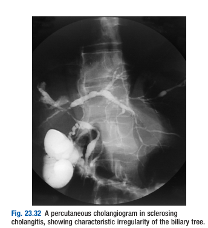 
        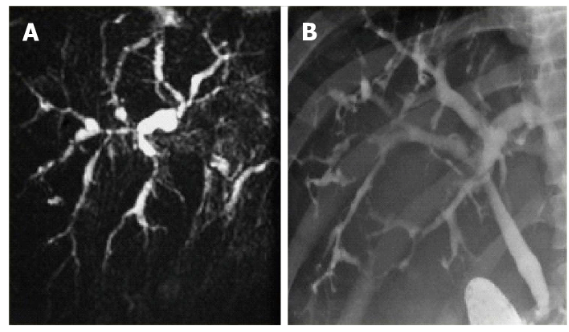
        - <u>Role of ERCP</u> - not for diagnostic but only therapeutic, as biliary instrumentation may trigger attacks of acute cholangitis due to pre-dilectation to bile stasis and secondary infection
    - +/- **Liver biopsy:**
        - <u>Early features</u> - periductal 'onion-skkin' fibrosis and inflamamtion with portal oedema and ductular proliferation resulting in expansion of portal tracts 
        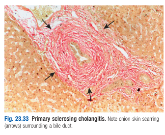
        - <u>Late features</u> - biliary cirrhosis or 'vanishing bile duct syndrome' (obliterative cholangitis)
- **Dx criteria of PSC:**
    - 1\. <u>Presence of characteristic cholangiographic findings</u> - generalised beading and stenosis of the biliary system on cholangiography
    - 2\. <u>Rule out secondary sclerosing cholangitis</u> - r/absence of choledolithiasis or history of bile duct sturgery with stricturing and cholangitis 
    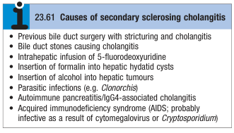
    - 3\. <u>Exclusion of Cholangiocarcinoma</u> (esp. dominant extrahepatic stricture) - by prolonged follow-up
- **Mx** - no cure:
    - **Principles of Mx:**
        - <u>Mx of cholestasis</u> - e.g. UDCA to initiate bile flow
        - <u>Mx of complications</u> - Tx bile sepsis in cholangitis +/- therapeutic ERCP if refractory biliary obstruction, fat-soluble vitamin deficiency, osteoporosis, cholangiocarcinoma
        - <u>Mx of advanced disease</u> - surgical Tx
            - Orthotopic liver transplantation - role in advanced liver disease (but risk of disease recurrence and CRC risk)
    - **Mx of complications:**
        - <u>Persistent biliary obstruction by 'dominant stricture'</u> (**r/o distal CC**) - ERCP with therapeutic balloon dilatation or plastic stenting
        - <u>Bile sepsis secondary to acute cholangitis</u> - best medical care w/ broad-spectrum IV ABx
        - <u>Vitamin deficiency</u> - fat soluble vitamin replacement may be necessary in jaundiced patients (esp. VitK)
        - <u>Osteoporosis</u> - pharmacological Mx and lifestyle modification
        - <u>Cholangiocarcinoma</u> - workup for MBO
    - **Orthotopic liver transplantation** (5y survival 80-90%) - indicated in advanced liver failure (N.B. unresectable CC is C/I for LT as it counts as extrahepatic malignancy):
        - <u>Complications speecific for PSC</u>:
            - 1\. Disease recurrence in graft
            - 2\. Increased risk of CRC - due to imunosuppression and enhanced surveillance is recommended

## Liver tumours and other focal liver lesions

### Primary malignant tumours

1.  Hepatocellular carcinoma

    - **Definition** - Most common primary liver tumour arising from hepatocytes
    - **Clinical features:**
      - Asymptomatic presentation through screening at HCC - typically detected at much earlier in natural Hx
      - Worsening clinical status in cirrhotic patient - sudden deterioration of LFT, worsening ascites, or variceal haemorrhage
      - Complications of HCC:
        - Ruptured HCC - intra-abdominal bleeding
    - **Signs of HCC:**
      - Hepatomegaly/ right hypocondrial mass
      - Audible liver bruit
    - **Ix:**
      - **Alpha-fetoprotein** (AFP) - non-sensitive, non-specific tumour marker for HCC (60%):
        - **Principles** - levels dependent on size of tumour (normal does not r/o small HCC)
        - **Reasons for False +ve** - requires cautious interpretation:
          - Acute flares of Hep B and Hep C
          - Severe liver necrosis - e.g. paracetamol toxicity
        - **Indications for search of HCC** - progressive rise in AFP levels, or \> 400 ng/mL (almost diagnostic)
        - **Serial measurements** - Assessment of treatment responsiveness and disease progression
      - **US liver** - screening for focal liver lesion (detectable at \> 2-3cm):
        - Other identifiable features - faetures of cirrhosis, portal vein involvement etc.
      - **Contrast CT** - characteristic findings based on the hyvascular lesion:
        - CT criteria - HCC is a hypervascular lesion characterised by hyper-intensity in arterial phase and rapid venous washout:
          - Non-contrast phase - hypodense
          - Arterial-phase - hyperdense
          - Portal venous phase - hypodense
      - **Liver biopsy** - indicated for patients who do not have cirrhosis or hepatitis B to exclude metastatic tumour
        - C*I - avoided in patients w* potentially resectable disease to avoid needle-tract tumour seedling
        - Cx:
          - Risk of bleeding (highly vascular tumour)
          - Needle tract seedling

    1.  Management of HCC

        - **Principles of Mx** - different for patients w/ cirrhosis and those w/o:
          - Cirrhosis - modality of Tx dependent on HKLC or BCLC staging system:
            - Tx of curative intent - hepatic resection, liver transplantation, thermal ablation
            - Loco-regional Tx (paliative) - TACE, TARE, SCRT
            - Chemotherapy (paliative) - targeted and immunotherapy
          - w/o cirrhosis -
        - **Hepatic Resection** - treatment of choice for non-cirrhotic patients and subset of cirrhotic patients:
          - <u>Procedure</u> - hepedectomy of the lobe with HCC involvement
          - <u>Indications</u> - most non-cirrhotic patients w/ localised disease, selected cirrhotic patients w/ very early stage HCC (PST 0, Child's A w/ no pHTN)
          - <u>C/I</u> - most cirrhotic patients (risk of insufficient functional liver remnant and decompesated liver function)
          - <u>Outcomes</u> - 5y survival (50%), 5y recurrence (50%)
        - **Liver transplantation** - currative for underlying cirrhosis and removing risk of second, de-novo individual:
          - <u>Indications</u> (Milan Criteria) - good survival for small tumours (\< 5cm) or \<4 nodules (each \< 3cm)
          - <u>Outcomes</u> - 5y survival \> 75% for selected individuals
          - <u>Risk of recurrence</u> - complicated by necessary immunosuppression
        - **Percutaneous therapy**
        - **Trans-arterial chemo-embolisation**
          - <u>Procedure</u> - combined chemotherapy and embolisation of the lesion via hepatic artery:
            - Lipiodol - contrast selectively uptake by liver (then why not use it for CT)
            - Cisplatin - chemotherapy
            - Gelfoam - embolisation to block off arterial supply
          - <u>C/I</u> - decomensated cirrhosis, multifocal HCC
          - <u>Outcomes</u> - 2y survival approx 60% in cirrhotic patient w/ good LFT
        - **Chemotherapy** - paliative for advanced stage diseases:
          - Targeted therapy - Sorafenib (multikinase inhibitor inhibiting VEGF), Levitinib, Bevalizumab
          - Immunotherapy - Atezolizumab

### Secondary malignant tumours

### Benign tumours

- **Epidemiology** - increasingly picked up due to use of transabdominal USG
- **Haemangiomas** - <u>most common</u> benign liver tumours present in 1-20% of population
    - **Clinical features** - almost always asymptomatic (most are \< 5cm)
    - **Dx** - by USG and CT:
        - <u>USG findings</u> - well-defined hyper-echoic lesions (ocassionally hypoechoic due to increased echogenicity of surrounding liver parenchyma in steatostasis)
        - <u>CT findings</u> - well-defined hypodense lesion (\< 20 HU) relative to parenchym with delayed arterial filling resulting in discontinuous, nodular, peripheral enhancement
- **Hepatic adenomas** - rare benign <u>vascular tumours</u> of the liver:
    - **Clinical features** - usually asymptomatic:
        - <u>Abdominal pain</u>
        - <u>Abdominal mass</u>
        - <u>Rupture and intraperitoneal bleeding</u>
    - **Mx** - resection for symptomatic relief
- **Focal nodular hyperplasia** - common in F \< 40y:
    - **Pathology** - focal regeneration of hepatocytes w/o fibrosis
    - **Dx** - CT:
        - Focal central scar
- **Liver cysts** - can be associated with ADPKD

## Drugs and the liver

## Inherited liver diseases

### Haemochromatosis

- **Defintion** - condition caused by iron accumulation (normal iron \< 4g)
- **Causes of haemochromatosis:**
    - <u>Primary haemochromatosis</u>:
        - Hereditary haemochromatosis (HHC)
        - Congenital acaeruloplasminaemia
        - Congenital atransferinnaemia
    - <u>Secondary iron loading</u>:
        - Parenteral iron loading - repeated blood transfusions
        - Iron-loading anaemia (thalassaemia) - thalassaemia, sideroblastic anaemia, pyruvate kinase deficiency
        - Liver disease
    - <u>Complex iron overload</u>:
        - Juvenile haemochromatosis
        - Neonatal haemochromatosis
        - Alcoholic liver disease
        - Porphyria cutanea tarda
        - African iron overload (Bantu siderosis)

1.  Hereditary Haemochromatosis

    - **Definition** - autosomal recessive disease caused by single-point mutation of HFE disease, associated w/ <u>increased iron absorption</u> and hence haemochromatosis
    - **Pathophysiology of HHC:**
      - <u>Autosomal recessive inheritence of HFE protein</u> - 90% patients are homozygous for single-point LOF mutation (C282Y) in the HFE protein
      - <u>Other genetic and environmental factors affecting Sx onset</u>:
        - **H63D single point mutation** - can cause less severe form but ususally as part of compound heterozygote w/ C282Y mutation
        - **Environmental factors** - postulated roles of unknown environmental factors as \< 50% of homozygotes for C282Y actually develop clinically significant haemochromatosis
        - **Regular iron loss** - iron loss from menstruation and pregnancy can delay onset of HHC in females
      - <u>Reduced activity of HFE</u> - suspected to be due to reduced binding of HFE to transferrin receptor resulting in **defective transferrin-associated iron uptake**, mechanistically resulting in a functional iron deficiency
      - <u>Increased absorption of dietary iron</u> - functional iron deficiency resulting from reduced activity of HFE results in up-regulation of enterocyte divalent metal transporters and hence increased iron absorption
    - **Clinical features of HHC:**
      - **Liver disease** - onset of chronic liver disease often a/w hepatomegaly
      - **Cardiac disease** - manifests as heart failure and cardiac arrhythmias due to iron deposition in the heart
      - **Diabetes mellitus** - due to deposition of iron in pancreatic islets, often irreversible by venesection
      - **Arthritis** - due to chondrocalcinosis secondary to CPPD
      - **Endocrine dysfunction** - hypogonadotrophic hypogonadism underlying impotence, loss of libido and testicular atrophy
    - **Signs of HHE:**
      - **General examination** - Leaden-grey skin pigmentation (Bronzed diabetes) occuring in exposed parts, genitalia, axilla and groin
      - **Abdominal examination:**
        - Stigmata of chronic liver disease
        - Hepatomegaly
      - **Cardiovascular examination** - to assess for cardiac disease a/w haemochromatosis
    - **Ix:**
      - **Iron profile:**
        - <u>Iron</u> - increased
        - <u>Ferritin</u> - increased (those w/ significant liver disease have \> 1000 microgram/L)
        - <u>Transferrin saturation</u> - raised \> 45% suggestive of iron overload
      - **MRI** - high Sp for iron overload, but low Sn
      - **Liver Bx** - diagnostic:
        - Assessment of degree of fibrosis
        - Distribution of iron - hepatocyte iron characteristic of haemochromatosis (initially in periportal hepatocytes and extending later to all hepatocytes)
        - Hepatic iron index (HII) - quantification of liver iron (\> 1.9 suggestive of primary cause)
      - **Genetic testing** - detection of C282Y and H63D mutations in routine clinical use
    - **Mx:**
      - **Principles of Mx:**
        - <u>Reduction of total body iron</u> - serial venesection to control ferritin levels
        - <u>Standard care for established complications</u> - standard care for patients w/ chronic liver disease, cirrhosis, and diabetes mellitus (incl. **regular screening for HCC**)
        - <u>Genetic screening</u> - by iron profile, LFT +/- liver biopsy
      - **Serial venesection:**
        - <u>Intervals</u> - initially weekly venesection of 500 ml (250 mg iron) until serum ferritin \< 50 microgram/L (continued therefater to control ferritin levels)
        - <u>Clinical efficacy</u>:
          - Expected improvement of liver and cardiac problems
          - Joint problems less predictable and can improve or worsen after iron removal
          - DM does not resolve and require follw up
      - **Regular screening of HCC** - serial liver USG, and AFP:
        - <u>Rationale</u> - main cause of death of patients with HHC (venesection reduces but does not abolishes) risk of HCC
      - **Genetic screening** - all family members by iron profile and LFT, Bx indicated for:
        - Abnormal LFTs
        - Serum ferritin \> 1000 microgram/L as predictor of significant liver disease

2.  Secondary Haemochromatosis\*\*\* Wilson's disease

    - **Definition** - rare, but important autosomal recessive disorder of copper metabolism caused by a variety of mutations in the ATP7B gene on chromosome 13, resulting in <u>increased total body copper</u>
    - **Normal physiological handling of copper:**
      - <u>Absorption</u> - dietary copper absorbed from the stomach and proximal SB
      - <u>Assimilation</u> - rapid transport to liver, where it is stored and incorporated into **caeruloplasmin**, and subsequently released into blood
      - <u>Excretion</u> - mainly through **biliary excretion**
    - **Pathophysiology of Wilson's disease:**
      - <u>Mutation of the ATP7B gene</u> - encodes a member of the copper-transporting P-type ATP family involving in cellular export of copper, with over **200 different mutations implicated**, and patients are often **compound heterozygotes with two different mutations** (no correlation w/ genotype and phenotype)
      - <u>Failure of synthesis of caeruloplasmin</u> - prevents normal physiological handling of copper and biliary excretion of copper, such that there is a **steady copper acumulation at birth** (5% patients have normal caeruloplasmin levels as the gene is not the primary defect)
      - <u>Accumulation of copper in organs</u> - accounts for hepatolenticular degeneration:
        - Liver - results in recurrent hepatitis culminating into cirrhosis
        - Basal ganglia and brain - accounts for extra-pyrimidal manifestations and dementia
        - Eyes - Kayser-Fleischer rings as the single most important clinical clue, but only present in roughly 60% patients
        - Kidneys - renal tubulopathy by copper toxicity
        - Bone - osteoporosis
    - **Clinical features of Wilson's disease** - natural Hx of disease classically presents as a **liver manifestation followed by neurological manifestations** (although can manifest alone or simultaneously):
      - **Liver disease** - arises as early as in 5y:
        - <u>Acute hepatitis</u> - episodes of acute hepatitis, sometimes recurrent in children, may progress to <u>acute fulminant liver failure</u>
        - <u>Fulminant liver failure</u> - caused by severe episode of acute hepatitis, where clinical suspicion is necessary with acute liver injury **manifesting w/ haemolysis and renal tubulopathy**, caused by <u>liberation of Cu from hepatocytes</u>
        - <u>Chronic hepatitis and cirrhosis</u> - indolent chronic hepatitis that does not present until established cirrhosis, where effects of hepatocellular insufficiency and portal hypertension supervene
      - **Neurological disease** - arises as early as late adolescence:
        - <u>Extrapyramidal manifestation</u> - due to deposition of Cu to BG of brain, manifesting as **unusual clumsiness for age**:
          - Tremor
          - Hyperkinetic disorders - choreoathetosis, dystonia
          - Hypokinetic disorders - Parkinsonism
        - <u>Dementia</u>
      - **Kayser-Fleischer rings** - greenish-brown discolouration of the corneal margin starting from upper periphery (60% present, but invariable in neurological Wilson's)
      - **Renal impairment** - manifest as tubulointerstitial disease
      - **Osteoporosis** - caused by Cu deposition in bone
    - **Ix:**
      - <u>SL examination</u> - Kayser-Fleischer rings are the single most important clinical clue for Wilson's
      - <u>Serum caeruloplasmin</u> - low level as single best diagnostic marker:
        - FP - advanced liver failure irrespective of cause
        - FN - 5% have normal serum caeruloplasmin
      - <u>Blood Cu level</u> - high free serum Cu
      - <u>Urine Cu excretion</u> - \> 0.6 micromol/24h
      - <u>D-penicillamine test</u> - \> 25 micromol/24h is diagnostic of Wilson's disease
    - **Mx:**
      - **Principles of Mx:**
        - <u>Removal of total body copper</u> - use of copper binding agents indefinitely for live and care must be taken to ensure re-accumulation of copper does not happen
        - <u>Liver transplantation</u> - indicated for fulminant acute liver failure of advanced cirrhosis
        - <u>Genetic counselling</u> - testing of siblings and children to r/o Wilson's disease and establish Tx for all affected individuals even if asymptomatic
      - **Copper binding agents:**
        - <u>Selection and dosing</u> - ensure cupriuresis:
          - Penicillamine (1st line) - 1-4g/d
          - Trientine dihydrochloride - 1.2-2.4g/d
          - Zinc - 50 mg tid
        - <u>Regimen</u> - lifelong Tx, w/ dosing reduced once disease in remission
        - <u>S/E</u> - of penicillamine:
          - Rashes
          - Protein-losing nephropathy
          - Lupus-like syndrome
          - Bone marrow depression

### Alpha-1-antitrypsin deficiency

- **Alpha-1-antitrypsin** (α1-AT) - serine protease inhibitor (Pi) produced by the liver and an important cause of hepatic and pulmonary disease
- **Definition** - mutation of the alpha-1-antitrypsin gene resulting in <u>low alpha-1-AT levels in blood</u>
- **Pathophysiology of alpha-1-AT deficiency:**
    - <u>Inherited mutation of alpha-1-AT gene</u> - mutated serine protease inhibitor (PiZ) are unable to be secreted into blood, where **homozygous individuals** will have low alpha-1-AT levels in blood
    - <u>Liver manifestation</u> - may result in cholestatic disease, cirrhosis, and eventually HCC
    - <u>Pulmonary manifestation</u> - early onset emphysema
- **Clinical manifestations of alpha-1-AT deficiency:**
    - **Hepatic manifestations:**
        - <u>Neonatal hepatitis</u> - cholestatic jaundice of the newborn that typically resolves spontaneously
        - <u>Acute liver injury</u> - typically an exacerbating factor for acute liver injury, where a **primary pathology** (e.g. drug induced) manifests severely and is disproportinate to the initial insult
        - <u>Chronic hepatitis and cirrhosis</u> - possible cause of cirrhosis in adults
        - <u>HCC</u> - long term complication of alpha-1-AT deficiency
    - **Pulmonary manifestations** - early onset emphysema
- **Ix and Dx:**
    - <u>LFT</u> - derranged
    - <u>alpha-1-AT concentration</u> - low
    - <u>Genotyping</u> - detect the presence of mutation
    - <u>Liver Bx</u> - not required, but alpha-1-AT containing globules demonstrable
- **Mx:**
    - Smoking cessation - due to risk of severe and early-onset emphysema (reduction of protease activity to match deminished anti-protease activity)
    - No specific Tx

### Gilbert's syndrome

- **Definition** - most common inherited disorder of bilirubin metabolism caused by a loss-of-function mutation of the UDPGCT enzyme
- **Genetics and mode of ineritence of Gilbert's syndrome:**
    - <u>Mutation of promotor region of the UDP-glucoronyl transferase activity</u> - reduced expression of enzyme resulting in **reduced conjugation of bilirubin**
    - <u>Mode of inheritance</u> - autosomal dominant trait
- **Clinical features of Gilbert's syndrome:**
    - <u>Isolated elevation of bilirubin</u> - unconjugated hyperbilirubinaemia, typically, but not exclusively **in setting of physical stress or illness**
    - <u>Absence of stigmata of chronic liver disease</u> - other than jaundice, there are no stigmata of chronic liver disease
    - <u>Dark stool</u> - increased stercobilinogen in face of excretion of bilirubin
    - <u>Dark urine</u> - increased urobilinogen excretion causes the urine to **turn dark on standing** as urobilin is formed
- **Signs of Gilbert's syndrome** - jaundice and otherwise normal:
    - **General examination** - jaundice +/- pallor if concomitent haemolysis (no stigmata of chronic liver disease)
    - **Abdominal examination** - usually normal:
        - Splenomegaly present in concomittent haemolytic disease
- **Ix:**
    - **LFT:**
        - <u>Bilirubin</u> - usually \< 100 micromol/L (~ 6 mg/dL)
        - <u>Liver enzymes</u> - normal
    - **Liver Bx** - not recommended in Ix of possible Gibert's syndrome
- **Mx** - reassure patients, no Tx required
- **Prognosis** - excellent

## Vascular liver disease

### Hepatic arterial disease

### Portal venous disease

### Hepatic venous disease

### Nodular regenerative hyperplasia

## Pregnancy and the liver

## Liver transplantation

- **Indications for LT assessment in patient w/ cirrhosis** - related for decompensated cirrhosis, or complications of cirrhosis:
    - **Poor liver function:**
        - <u>MELD score</u> - \> 12
        - <u>Child-Pugh Score</u> - Child's C
        - <u>Bilirubin</u> (only applicable to PBC) - \> 100 micromol/L
    - **Complications of cirrhosis:**
        - <u>Complications of portal HTN</u> - 1) diuretic-resistant ascites, 2) 1st-episode of bacterial peritonitis, 3) recurrent ascites
        - <u>Complications of hepatocellular insufficiency</u> - persistent hepatic encephalopathy
        - <u>Selected patients with HCC</u> - N.B. Milan Criteria
- **C/I of LT in cirrhosis:**
    - <u>Extra-hepatic malignancy</u> - metastatic HCC or locally-advanced HCC demonstrated to have high risk of recurrence
    - <u>Poor self-care</u> - active alcohol, or non-capacity for abstinence, substance abuse
    - <u>Active sepsis</u>
    - <u>Other medical comorbidities</u> - marked cardiorespiratory dysfunction
- **Listing for non-super-urgent LT** - requires \> 50% post-transplant 5y survival and fall into one of the following catagories:
    - **Category 1** (decompensated liver failure) - estimated 1y mortality \> 9% (based on MELD score)
    - **Category 2** (selected early HCC) - localised HCC \< 5cm or \<3 nodules \< 3cm, no macrovascular invasion, no LN metastasis, no distant metastasis
    - **Category 3** (variant syndromes):
        - <u>Complicated cirrhosis</u> - e.g. diuretic-resistant ascites, hepatopulmonary syndrome, perisistent HE
        - <u>Other diseases</u> - familial amyloidosis, familial hyperlipidaemia, polycystic liver disease and recurrent cholangitis
- **Listing for super-urgent LT** - uses different set of criteria
- **Complications of LT:**
    - **Early complications:**
        - <u>Primary graft non-function</u> - hepatocellular dysfunction as a consequence of liver ischaemia following removal from the donor and prior to reperfusion in the recipient
        - <u>Technical complications</u> - e.g. hepatic artery thrombosis, anastamotic biliary strictures, portal vein thrombosis
        - <u>Rejection</u> - most commonly 6-10 day post-transplant, and usually within 6 weeks
        - <u>Infection</u> - due to immunosuppression, resulting in primary bacterial or viral infections (chest or surgical site infections), or reactivation of latent microbes (e.g. HSV, CMV, TB)
    - **Late complications:**
        - <u>Complications related to immunosuppression</u> - e.g. renal insufficiency on cyclosporin
        - <u>Metabolic syndrome</u> - described in 50% of transplant recipients within 6mo in the US
        - <u>Disease recurrence in liver graft</u> - e.g. HCC recurrence in new liver
- **Prognosis in LT:**
    - <u>Super-urgent transplantation</u> (for ALF) - worse mortality as most patients have multi-organ failure at time of transplantation (65% 1y mortality, 59% 57 mortality)
    - <u>Non-super-urgent transplantation</u> (for cirrhosis and selected HCC) - 90% 1y survival, 70-75% 5y survival

## Cholestatic and biliary disease

- Cholestasis - a physiological concept of obstructed bile flow, reflected by biochemical abnormality (raised ALP, GGT, and subsequently bilirubin)
- Biliary disease - pathology at any level of the biliary tree from the bile cannaliculi to the sphincter of Oddi

### Chemical Cholestasis

### Benign recurrent intrahepatic cholestasis

### Intrahepatic biliary disease

### Extrahepatic billiary disease

### Secondary biliary cirrhosis

### Gallstones

- Gallstones - precipitation of stones at any level of the biliary tree
- **Epidemiology** - most common disorder of the biliary tree:
    - Prevalence - 11% overall, 7% of M 18-65y, 15% of F 18-65y
    - Demographic:
        - \< 40y - female proponderance (F:M = 3:1)
        - Elderly - no sex predisposition
- **Pathophysiology of gallstones** - dependent on the type of gallstones:
    - **3 types of gallstones** - cholesterol stones, pigment stones, mixed stones
    - **Cholesterol stones** - caused by excess of cholesterol relative to bile:
        - Deficiency of bile salt - pregnancy
        - Hepatic hypersecretion of cholesterol (lithogenic bile) - female, fat, fourty, fertile
    - **Pigmented stones** - caused by precipitation with calcium:
        - Brown pigmented stones - infected bile secondary to bacterial biliary infection, where beta-glucuronidase hydrolyse conjugated bilirubin into free form to precipitate as calcium bilirubinate
        - Black pigmented stones - a/w haemolytic disease
- **Clinical features of gallstones:**
    - Asymptomatic - only 10% of individuals w/ gallstones develop clinical evidence of gallstone disease
    - Biliary colic - misnomer because not typically colicky in nature (not caused by peristalsis against obstruction), but occurs whenever <u>stone acutely impacted on cystic duct</u>:
        - Site - epigastrium (70%) or RUQ (20%)
        - Onset - sudden onset and persistent for a while
        - Character - visceral pain that comes on suddenly and persists for hours before subsiding
        - Radiation - interscapular region or tip of right scapula
    - Cholecystitis - acute or chronic (see below)
- **Complications of gallstones:**
    - Cholecystitis and pancreatitis
    - Empyema of the gallbladder
    - Choledocholithiasis - when gallstone migrates to the common bile duct and manifest as biliary colic
    - Gallstone ileus
    - Mirizzi's syndrome
    - Fistula formation - with duodenum, colon or stomach
    - Carcinoma of gallbladder - rare but 95% attributable to gallstones
- **Ix of gallstones:**
    - Transabdominal ultrasound - 92% sensitivity and 99% specificity
    - CT/ MRCP - for detecting complications (distal bile duct, gallbladder empyema)
    - Endoscopic US - recurrent attacks of acute pancreatitis otherwise unexplained (may result from microlithiasis in the gallbladder)
- **Mx** - only managed if symptomatic:
    - Cholecystectomy - open or laparscopic
    - Oral bile acids - chenodeoxycholic or ursodeoxycholic

### Cholecystitis

- **Definition of acute cholecystitis** - inflammation of the gallbladder
- **Etiology of acute cholecystitis:**
    - Gallstones (most common)
    - Tumour of the bile duct
    - Parasitic worm
    - Mucus
    - Post-ERCP stenting
- **Pathophysiology of acute cholecystitis** - not clearly understood:
    - Chemical-induced gallbladder mucosal damage –\> release of phospholipase –\> conversion of lecithin to lysolecithin (mucosal toxin)
    - Subsequent infection of gallbladder (approximately 50% sterile) - especially in elderly patients and DM
- **Clinical features of acute cholecystitis:**
    - **Persistent biliary colic** - typically severe RUQ pain (or epigastrium) tjat radiates to right shoulder tip or the interscaupular region (differentiated from gallstone mediated biliary colic by severity and prolonged duration)
    - **Fever** - differentiating fever from simple biliary colic
- **DDx of acute cholecystitis:**
    - Common DDx - appendicitis, perforated peptic ulcer, acute pancreatitis
    - Rare DDx - acute pyelonephritis, myocardial infarction, pneumonia (RLL)
- **Signs of acute cholecystitis:**
    - **General examination** - febrile, but rigors is unusual
    - **Abdominal examination:**
        - <u>Right hypochondrial tenderness and guarding</u> - due to inflammation of the associated parietal peritoneum
        - <u>Murphy's sign</u> (97% Sn, 48% Sp) - deep inspiration causes descent of inflammed gallbladder to catch the palpating hands (+ve Murphy sign occurs when there is sudden arrest of inspiration or discomfort)
        - <u>Palpable gallbladder</u> - only seen in 30% due to Courvoisier's law
        - +/- <u>Jaundice</u> - only in CBD stone (choledocholithiasis) or Mirizzi's syndrome
        - +/- <u>Signs of complication</u> - e.g. generalised peritonitis, sepsis, abdominal crepitus, SBO
- **Ix:**
    - CBC - leukocytosis (common except in elderly patients)
    - LFT - non-specific elevation of transaminase
    - Amylase - minor increase unless complicated with acute pancreatitis (Atlanta classification)
    - Imaging:
        - AXR - may detect radio-opaque stones (due to calcium salt), but more important to rule out lower lobe pneumonia, and perforated viscus
        - Transabdominal US - gallstones (accoustic shadowing) and gallbladder thickening due to cholecystitis
        - +/- CT abdomen - detect complications (e.g. gallbladder empyema, perforation)
- **Mx:**
    - **Medical Mx:**
        - General measures - bed rest, pain relief, IV fluids
        - ABx - cepharosporin (e.g. cefuroxime), piperacillin/tazobactam +/- metronidazole (Davidsons)
    - **Surgical Mx** - cholecystectomy, percutaneous transhepatic cholecystostomy (PTC)

### Acute cholangitis

- **Definition** - inflammation of the biliary duct secondary to ascending bacterial infection following obstruction
- **Etiology:**
    - Choledocholithiasis (CBD stone) - occurs in 15% patients w/ gallstones
    - Biliary strictures
    - MBO
    - Post-ERCP
- **Clinical presentation** - Charcot's triad:
    - Fever (+/- rigors)
    - RUQ pain
    - Obstructive jaundice
- **Mx:**
    - ABx
    - Relief of obstruction - ERCP or percutaneous transhepatic biliary drainage (PTBD)

### Choledocholithiasis

- **Definition** - stones in common bile duct which have usually migrated from the gallbladder
- **Epidemiology** - occurs in 10-15% of patients w/ gallstone disease
- **Etiology of choledocholithiasis:**
    - Gallstones (most common)
    - Primary bile duct stones - years after cholecystectomy, biliary sludge from Sphincter of Oddi dysfunction, parasitic infections
- **Clinical features of choledocholithiasis** - uncomplicated vs complicated CBD stones:
    - **Asymptomatic** - incidentally found on operative cholangiography during cholecystectomy
    - **Symptomatic uncomplicated choledocholithiasis** - transient impaction of CBD which spontaneously resolves due to 'ball-valve' effect, w/ <u>absence of systemic inflammation</u>:
        - <u>Recurrent biliary colic</u> - recurrent RUQ or epigastric pain that lasts longer than typical biliary colic
        - <u>Obstructive jaundice</u> - pruritis, tea-coloured urine, pale stools
    - **Features of complications:**
        - <u>Acute cholangitis</u> - **Charcot's triad** (fever, rigors and leukocytosis reflects systemic inflammation)
        - <u>Acute pancreatitis</u> - severe epigastric pain (amylase \> 3x ULN as defining feature)
- **Signs of choledocholithiasis:**
    - General - jaundice
    - Abdomen - previous cholecystectomy, impalpable gallbladder (fibrotic)
- **Ix and Dx:**
    - <u>CBC</u> - leukocytosis (if cholangitis ensues)
    - <u>LFT</u> - cholangiohepatitis pattern
    - <u>Amylase</u> - r/o pancreatitis
    - <u>Transabdominal US</u> (diagnostic):
        - Features of biliary obstruction - dilatation extra-hepatic and intra-heaptic bile ducts
        - Cause of CBD stones - gallbladder stones
        - Bile duct stones - only in 50% cases, especially in distal bile duct
    - <u>MRCP</u> - indicated if not necessary
    - <u>Blood culture</u> - prior to ABx andminitsration
- **Mx:**
    - Management of cholangitis - analgesia, IV fluids, broad-spectrum ABx
    - Urgent decompression of biliary tree and stone removal:
        - ERCP with biliary sphincterotomy and stone extraction (successful in 90% patients)
        - Other modalities of Tx:
            - Percutaneous transhepatic biliary drainage and combined endoscopic procedures
            - Extracorporeal shock wave lithotripsy (ESWL)
            - Surgical exploration of CBD

### Tumour of the gallbladder and bile duct

1.  Carcinoma of the gallbladder

2.  Cholangiocarcinoma

3.  Carcinoma of the ampulla of Vater

### Miscillaneous biliary disorders

1.  Post-cholecystectomy syndrome

    - **Definition** - non-specific dyspeptic symptoms and abdominal pain recurring and persisting following cholecystectomy
    - **Epidemiology** - occurs in up to 30% patients:
      - Demographic - female preponderance, and more likely for symptomatic gallstone disease \> 5y
    - **Pathophysiology** - typically explained by biliary and extra-biliary disorders:
      - <u>Biliary causes</u>:
        - **Early PCS** - bile duct injury, retained cystic duct or CBD stones
        - **Late PCS** - recurrent CBD stones, bile duct strictures cystic duct stump syndrome, neoplasm, disorders of the ampulla of Vater (SOD, Benign papillary fibrosis)
      - <u>Extra-biliary causes:</u>
        - **Pancreatic causes** - pancreatic disease
        - **Gastric causes** - functional dyspepsia, peptic ulcer, GERD
        - **Intestinal causes** - irritable bowel syndrome
    - **Clinical features** - heterogenous:
      - <u>Persistent RUQ abdominal pain</u>
      - <u>Flatulence</u>
      - <u>Fatty food intolerance</u>
      - <u>Altered bowel habits</u> - due to bile acid diarrhoea (5-10%)
      - <u>Cholestasis</u> - cholestatic dLFT. jaundice, cholangitis

2.  Sphincter of Oddi dysfunction

    - **Definition** - increased contractility in the Sphincter of Oddi that produces a benign non-calculous obstruction to flow of bile or pancreatic juice
    - **Epidemiology:**
      - <u>Demographic</u> - female preponderance
    - **Clinical features of SOD** - classified into biliary SOD or pancreatic SOD:
      - **Biliary type SOD** - recurrent biliary type pain but absence of gallstones
      - **Pancreatic type SOD** - unexplained recurrent attacks of pancreatitis not attributed to gallstones, including microlithiasis
    - **Ix and Dx evaluation** - established based on compatible Hx and exclusion of gallstones and microlithiasis:
      - **Sphincter of Oddi manometry** - considered gold standard for objective Dx after exclusion (not widely available w/ high rates of procedural related cholangitis)
      - **Poor contrast drainage in ERCP** - slowly draining bile ducts is suggestive of SOD
      - **Other compatible features:** 
      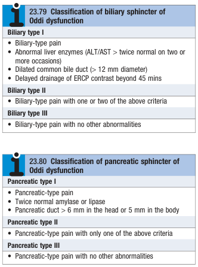
    - **Mx of biliary SOD:**
      - <u>Endoscopic sphincterotomy</u> - indicated for all type 1 biliary SOD as it is a/w good outcomes (but warned as also high risk of perioperative complications)
      - <u>Medical therapy</u> - nifedipine or low-dose amitryptyline for type III biliary SOD w/o evidence of sphincteric HTN
    - **Mx of pancreatic SOD:**
      - <u>Pancreatic sphincterectomy</u> - w/ prophylactic pancreatic duct stenting to avoid procedure-related pancreatitis

3.  Cholesterolosis of the gallbladder

4.  Adenomyomatosis of the gallbladder

5.  IgG4-associated cholangitis
