# Ch26 Neurological Disease

## Clinical examination of the nervous system

## Functional anatomy and physiology

### Localising lesions in the brainstem

- **Rationale:**
    - High density of tracts and nuclei withi the brainstem
    - Detailed localisation is possible on the basis of Hx and P/E alone
    - If a brainstem lesion is suspected, consider which tracts and nuclei are affected, and determine whether they can be affected by a single lesion (or by involking the fewest number of lesions)
    - Ix is only to confirm or refute the Dx
- **Common types of brainstem lesion:**
    - Vascular
- **Principles of clinical manifestations of brainstem lesions:**
    - Cranial nerve syndromes
    - Cerebellar dysfunction
    - UMN dysfunction

  
  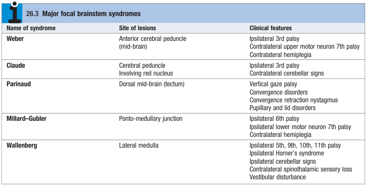

## Investigations of neurological disease

## Neurological history

- **Importance of Hx taking in neurology** - many diseases have no confirmatory tests, and disease have chronic paths
- **Principles of the neurological Hx** - 2 questions are answered:
    - 1\. Where is the lesion?
        - Is it even a neurological disease?
        - Which part to the nervous system does it localise to anatomically (central vs peripheral), or functionally (sensory, motor, both)?
    - 2\. What is the lesion?
        - VINDICATE:
            - Vascular
            - Inflammatory/ Infectious
            - Neoplastic
            - Degenerative/ Deficiency/ Drugs
            - Iatrogenic/ Intoxication/ Idiopathic
            - Congenital
            - Autoimmune/ Allergic/ Anatomic
            - Traumatic
            - Endocrine/ Metabolic
- **General template of neurological Hx:**
    - **Demographic** - age, sex, handedness
    - **Chief complaint and HPI:**
        - **CC** - clarify what patient means by certain ambiguous words (e.g. weakness, numbness, dizziness)
        - **HPI** - onset, progression, quality, radiation, severity, time course, associated Sx, effects on daily living:
            - <u>Onset</u> (what is the lesion?):
                - Sudden (min to h) - vascular (stroke/ TIA), nerve entrapment syndromes, functional
                - Gradual over days - demyelination, infection, subdural haematoma
                - Gradual over weeks to months - neoplastic, paraneoplastic, motor neuron disease
                - Gradual over months to years - degenerative
            - <u>Progression</u> - pattern of Sx (intermittent, persistent, nature of progression):
                - Intermittent (e.g. migraines, epilepsy) - documente the frequency and duration of specific events
                - Progression - evolution of Sx narrow down DDx (see above)
            - <u>Associated Sx</u> - include non-neurological Sx
            - <u>Effects of daily lifing</u>:
                - Disabilities - e.g. walking, fine hand movements, work
                - Effects on family life and leisure
    - **PMH:**
        - Previous neurological symptoms and whether similar to current symptoms
        - Previous medical Hx
        - Medications - current and at time of symptom onset
    - **SHx:**
        - Smoking and alcohol
        - Recreational drug use or other toxin exposure
        - Domestic situatioon
        - Driving license status
    - **FHx**
    - **Developmental Hx**

  
  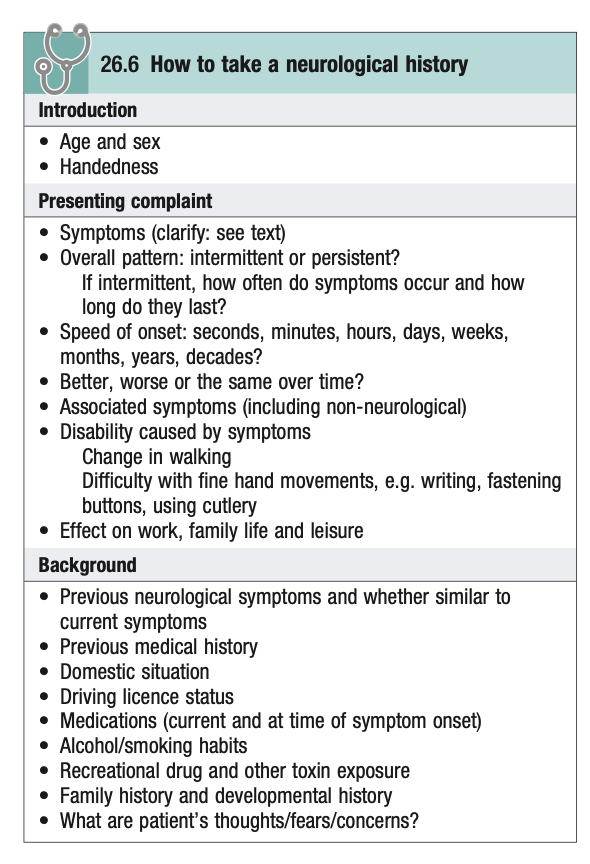
- **Localisation of lesion** - answering the question of 'where is the lesion?':
    - **Cerebral cortex** - painless loss of hempispheric functions
    - **Widespread cerebral lesions** - visual loss, pyramidal signs, cerebellar signs
    - **Brainstem** - cranial nerve lesions with limb pyramidal signs or sensory loss +/- sphincteric disturbances
    - **Spinal cord** - pyramidal weakness in tetraplegic or paraplegic pattern, with sensory loss with spinal level
    - **Upper and lower motor neurons** (motor neuron disease) - widespread LMN and UMN signs
    - **Peripheral neuropathy** - distal loss of sensation and/or weakness

  
  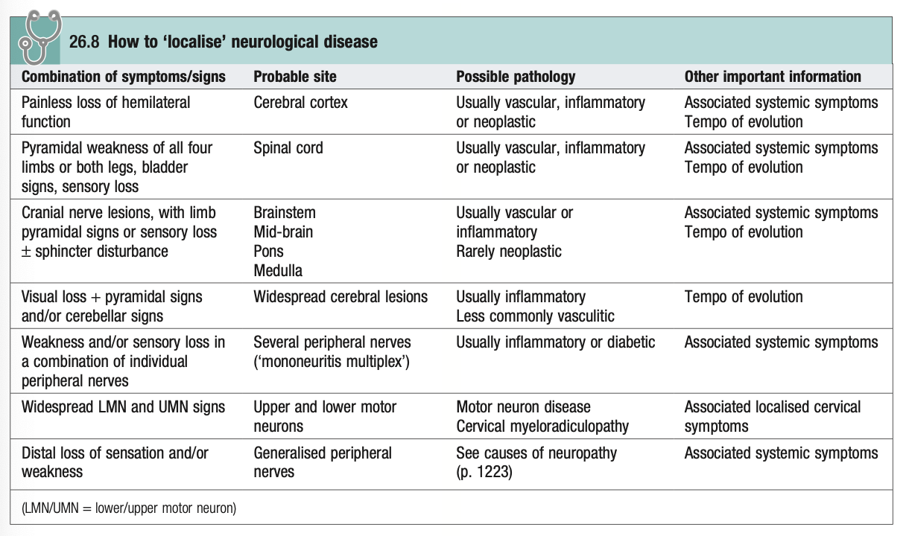

## Presenting problems in neurological disease

### Headaches and facial pain

- **Overview** - one of the most common chief complaints, and can cause considerable worry, but rarely represent sinister disease; classified into:
    - <u>Primary headache syndrome</u> - benign primary headache disorders when there is no identifiable underlying cause (e.g. migraine, TTH, cluster headache)
    - <u>Secondary headache</u> - headache with an indentifiable underlying cause
- **Red flags for headache:**
    - **Nature of onset:**
        - <u>Rapid onset</u> (onset to maximal intensity within minutes) - requires rapid assessment inpatient for possible **subarachnoid haemorrhage**
        - <u>New-onset headache \> 60y</u> - consider **temporal arteritis** especially if pain localised to one or both temples
    - **Progression of Sx:**
        - <u>Persistent headache</u> - persistent headache that does not comes and goes not suggestive of primary headache syndromes and may be caused by mass lesion
    - **Associated Sx:**
        - <u>Progressive focal Sx</u> - associated Sx that do not precede headache suggestive to migraine should raise suspicion of **intracranial mass lesion**
        - <u>Features of raised ICP</u> - worse on wakening/ lying down, a/w N/V raises suspicion of intracranial mass lesion
        - <u>Fever, rash or meningism</u> - suspicious of meningoencephalitis
        - <u>Other constitutional Sx</u> - e.g. weight loss, general malaise, raises suspicion of an inflammatory or neoplastic process

  
  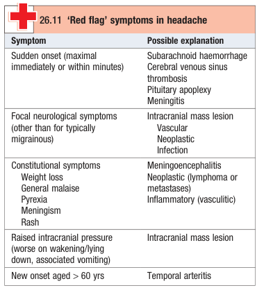
- **DDx for headaches** - classified into primary and secondary: 
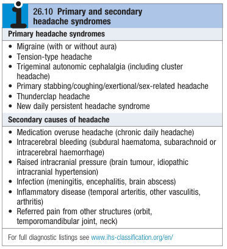
    - **Primary headache syndrome:**
        - Migraine (w/ or w/o aura)
        - Tension-type headache
        - Cluster headache or other trigeminal autonomic cephalgia
        - Primary stabbing/ coughing/ exertional/ sex-related headache
        - New daily persistent headache syndrome
    - **Secondary causes of headaches:**
        - <u>Traumatic injury to the headache</u> - TBI w/ or w/o intracranial bleeding
        - <u>Intracranial haemorrhage</u> - chronic subdural haematoma, subarachnoid haemorrhage, intracerebral haemorrhage
        - <u>Raised ICP</u> - brain tumour, idiopathic intracranial hypertension, normal pressure hydrocephalus
        - <u>CNS infections</u> - meningitis, encephalitis, cerebral abscess, systemic viral infections
        - <u>Autoimmune or inflammatory disease</u> - e.g. temporal arteritis, other vasculitis, arthritis
        - <u>Referred pain from other structures</u> - orbit, TMJ, dental, neck
        - <u>Drug-related</u> - medication overuse headache
- **DDx for occular pain:**
    - <u>Occular disease</u> - e.g. acute glaucoma
    - <u>Trigeminal autonomic cephalgia</u> (TAC)
    - <u>Carvenous sinus lesions</u> - usually evident w/ 3rd, 4th and 6th nerve palsies
    - <u>Infiltrative lesion of the orbit</u>
- **DDx of facial pain:**
    - <u>Sinusitis</u> - often a/w other features of sinus congestion/ infection but is almost never the explanation for persistent facial pain (typically facial pain subsides if chronic rhinosinusitis)
    - <u>Dental or TMJ pathologies</u> - referred pain to the trigeminal divisions
    - <u>Neurological causes</u> - note destructive lesions typically cause numbness rather than pain:
        - Trigeminal neuralgia
        - Shingles or post-herpetic neuralgia

### Dizziness, blackouts and 'funny turns'

- **Definition** - spells of episodic lost or altered consciousness
- **Ambiguity of terminology:**
    - <u>Blackouts</u> - some describe as purely visual symptoms, but some describe as total LOC
    - <u>Dizziness</u> - abnormal perception of motion (e.g. vertigo), faintness, or lightheadedness ir simply unsteadiness
- **Salient points of Hx** - require clear characterisation of Sx from the patient:
    - <u>HPI</u> - characterise 1) prior full consciousness, 2) altered consciousness, 3) vertigo, 4) transient amnesia
- **DDx of dizziness, blackouts and funny turns:**
    - **Abnormal sensation of movement** (vertigo) - central or peripheral vertigo
    - **Loss of balance** - ataxia, weakness, proprioceptive dysfunction, joint disease, visual disturbances etc.
    - **Sx fitting description of light-headedness:**
        - <u>Syncope and pre-syncope</u> - cardiogenic syncope, neurocardiogenic syncope, orthostatic hypotension
        - <u>Hypoglycaemia</u> - poor glycaemic control of DM, especially patients w/ T1DM or T2DM on insulin
        - <u>Other non-epileptic attacks</u> - e.g. panic attacks, anxiety, hyperventilation, post-concussive syndrome
    - **Seizures and epilepsy** - impaired awareness seizures

  
  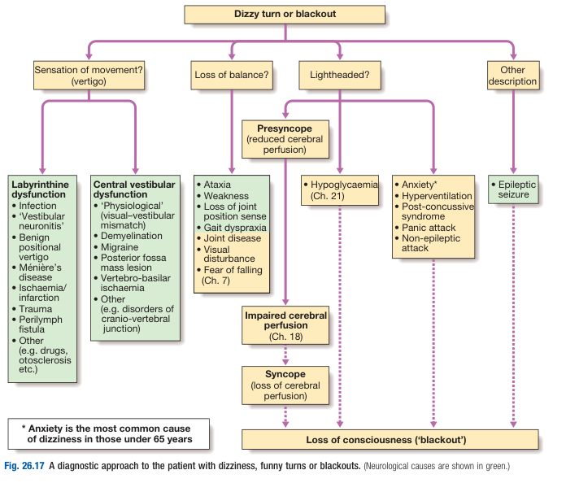

### Status epilepticus

- **Definition** - seizure activity that:
    - Does not resolve spontaneously, or
    - Recurrent seizure w/ no recovery of consciousness disease
- **Etiology of status epilepticus** - all etiology of seizures, consider reversible causes:
    - Hypoglycaemia
    - Hyponatraemia
    - Hypocalcaemia
    - Fall in anti-epileptic drug level in known epilepsy
- **Clinical features of status epilepticus:**
    - <u>Prolonged motor manifestation</u> - prolonged rigidity and/or clonic movements, which may become subtle as seizure activity becomes prolonged
    - <u>Prolonged loss of awareness</u> - defined as convulsions \> 5 min w/o awareness, or inability to regain consciousness after convulsions
    - <u>Features of increased metabolic rate</u>:
        - Pyrexia
        - Sweating
        - Acidosis
    - <u>Complications of status epilepticus</u>:
        - Aspiration
        - Hypotension
        - Arrhythmia
        - Hepatic and reanal failure
        - Mortality
- **Dx** - clinical Dx based on description
- **Mx:**
    - **Principles of Mx:**
        - <u>Primary assessment</u> - assess and secure airway, breathing, circulation, disability and glucose
        - <u>Investigation of cause</u> - performed simultaneously when Mx patient
        - <u>Initiation of anti-epileptic medications</u> - if seizure continue for \> 5 min
        - <u>Tx of reversible causes</u> - e.g. hypoglycaemia
    - **Primary assessment:**
        - <u>Airway</u> - ensure airway patent
        - <u>Breathing</u> - give O2 to prevent cerebral hypoxia, assess respiratory rate
        - <u>Circulation</u> - check BP/P, secure IV access
        - <u>Disability</u> - unconscious on AVPU scale
        - <u>Glucose</u> - haemstix for hypoglycaemia
    - **Ix of cause** - send blood:
        - CBC, clotting, glucose, LRFT, Ca, Mg, +/- anti-epileptic levels
        - Additional sample for future analysis (e.g. toxicology)
    - **Initiation of anti-epileptic medications:**
        - <u>Initial regimen</u> - repeat 1x only after 15 min:
            - Lorazapam 4 mg IV
            - Diazepam 10 mg Iv/ rectal
        - <u>Escalation for IV infusion</u> - w/ cardiac monitoring, blood gases, and neuro monitoring:
            - Phenytoin 15 mg/kg at 50 mg/min
            - Fosophenytoin 15 mg/kg at 100 mg/min
            - Phenobarbital 10 mg/kg at 100 mg/min
    - **Long-term anti-seizure medications** - indicated even if provoked:
        - Sodium valpropate 10 mg/kg IV over 3-5 mins, then 800-2000 mg/d
        - Phenytoin loading dose of 15 mg/kg at \< 50 mg/min (if not used previously), then at 300 mg/d
        - Carbamazepine 400 mg by NG tube, then 400-1200 mg/d

  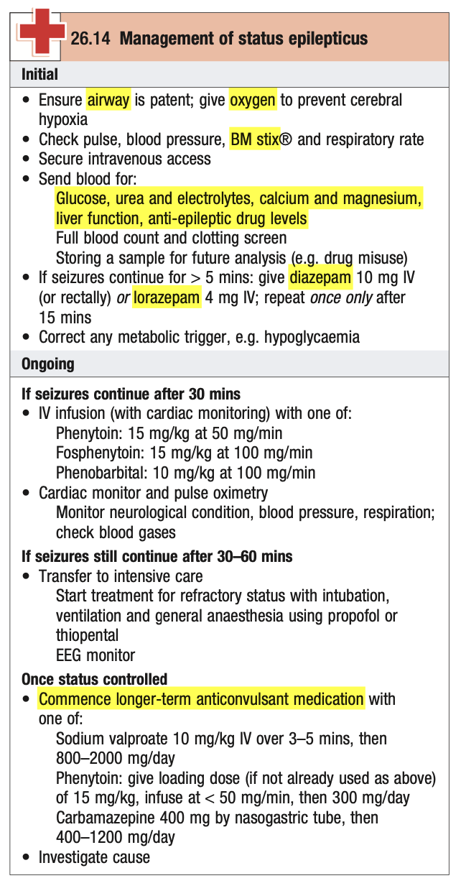 **\*** Coma
- **Consciousness** - objectively accessed using Glasgow Coma Scale (GCS)
- **Definition of Coma** - Persistence loss of consciousness (defined as GCS \<= 8) that occurs if the arousal mechanisms in the brainstem and diencephalon are disturbed, localising to either brainstem or both cerebral hemispheres
- **Etiology of coma** - neurological or non-neurological diseases:
    - **Neurological diseases** - functional or structural brain disease:
        - <u>Traumatic brain injury</u> - e.g. cerebral contusion, extradural haematoma, subdural haematoma, global axonal injury (i.e. deceleration injury)
        - <u>Cerebrovascular disease</u> - Brainstem infarction/ haemorrhage, spontaneous ICH, SAH, cerebral venous sinus thrombosis
        - <u>CNS infections</u> - Encephalitis, cerebral abscess, systemic sepsis, meningitis
        - <u>Other neurological disease</u> - e.g. epilepsy, brain tumour, functional coma ('pseudo-coma')
    - **Non-neurological diseases** - often via metabolic disturbances:
        - <u>Liver failure</u> - hepatic encephalopathy
        - <u>Renal failure</u> - uraemic encephalopathy
        - <u>T2 Respiratory failure</u> - causing acidosis
        - <u>Hyponatraemia</u> - causing vasogenic oedema
        - <u>Hypothyroidism</u> - myxoedematous coma
        - <u>Diabetes mellitus</u> - hypoglycaemia, DKA, HHS
        - <u>Others</u> - e.g. drug overdose, thiamin deficiency, hypothermia
- **Salient points of Hx** - obtain Hx from faily or other witnesses:
    - <u>HPI</u> - mode of onset of coma, progression, any precipitating events (e.g. trauma)
- **P/E:**
    - <u>Assessment of conscious levels</u> - by GCS
    - <u>General examination</u> - clues for drug abuse, rashes, fever and focal signs of infection, meningism and evidence of head injury
    - <u>Neurological examinaion</u> - focal neurological signs may suggest a structural neurological disease but may be falsely localising
- **Brain death** - state of cortical and brainstem failure:
    - **Definition** - state in which cortical and brainstem function is irreversibly lost, once satisfied enables life-support to be withdrawn and natural death to ocur
    - **Dx of brain death** - made by 2 experienced doctors: 
    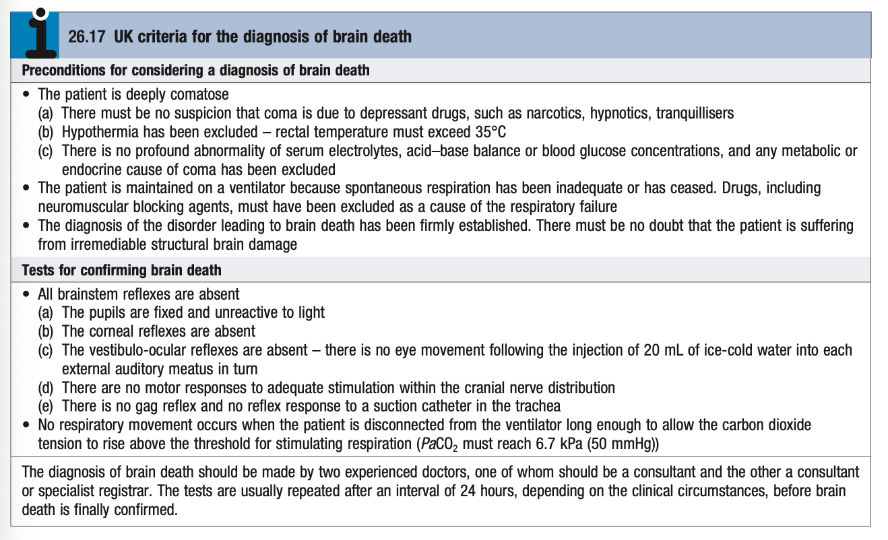
    - **Differentiation between brain death, 'locked-in' syndrome, and minimally conscious states** - by definition some retention of brainstem function and cortical function, but differentiating is challenging: 
    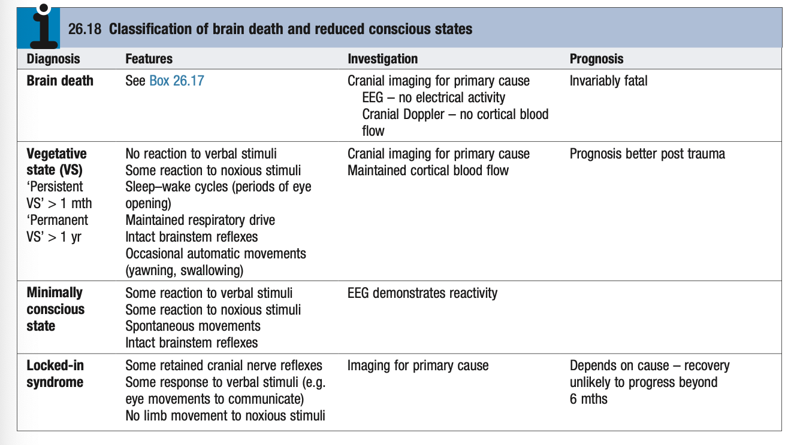

### Delirium

### Amnesia

### Weakness

- **Definition** - reduced power over muscles
- **Clinical approach to weakness** - answer the two salient questions of neurology?
    - **Where is the lesion?**
        - <u>Hx</u> - pattern and distribution of weakness, associated Sx:
            - **Pattern and distribution of weakness:**
                - Hemiparesis - hemispheric lesion, less likely unilateral cord or brainstem lesion
                - Tetraparesis - brainstem, upper spinal cord lesion
                - Paraparesis - spinal cord (esp. look for spinal levels)
                - Over one limb - mononeuropathy, less likely small hemispheric lesion
                - Proximal muscles - myasthenia gravis (look for fatiguability), endocrine disorders
                - Distal muscles - peripheral neuropathy
                - Isolated muscles - radiculopathy, mononeuropathy
                - Bizarre, fluctuating, not following anatomical rules - functional symptoms

        
        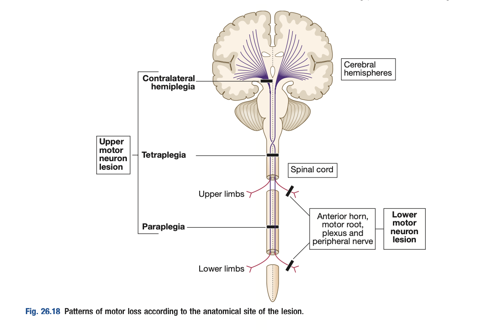
            - **Associated Sx:**
                - Absence of sensory involvement - motor neuron disease, MG, myopathies
        - <u>P/E</u> - differentiation between upper and lower motor neuron weakness (see below):
            - **UMN pattern** - brain and spinal cord
            - **LMN pattern** - peripheral nervous system
            - **Mixed pattern** - motor neuron disease

      
      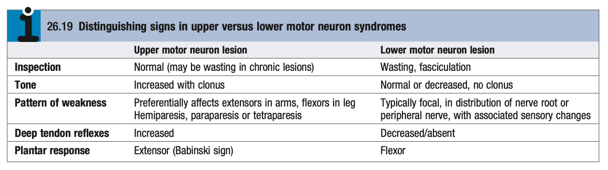
    - **What is the lesion?**
        - <u>Hx</u> - evolution of weakness, fatiguability:
            - **Evolution of weakness:**
                - <u>Sudden and improving</u> - stroke, TIA, nerve entrapment syndrome
                - <u>Gradually worsen over days or weeks</u> - cerebral mass, demyelination
                - <u>Gradually worsening over months or years</u> - meningioma, cervical myelopathy
- **Salient points of Hx:**
    - **Is it true weakness?**
        - <u>Generalised fatigue</u> - may mimick weakness
        - <u>Pain</u> - may reduce movement thus mimicking weakness
        - <u>Reduced sensation</u>
    - **What is the pattern of weakness?** - roughly answers where is the lesion (see above)
    - **HPI** - evolution of weakness:
        - <u>Sudden and improving</u> - stroke, TIA, nerve entrapment syndrome
        - <u>Gradually worsen over days or weeks</u> - cerebral mass, demyelination
        - <u>Gradually worsening over months or years</u> - meningioma, cervical myelopathy
        - <u>Fatiguability</u> - myasthenia gravis
    - **Associated Sx** - sensory involvement, bulbar symptoms
    - **Relevant PMH, SHx, FHx**
- **P/E:**
    - <u>Observation</u> - observe for any pain, abnormal movements (e.g. Parkinsonism), or extrapyramidal signs
    - <u>Formal examination of the motor system</u> - inspection, tone, power, reflexes, pathological reflexes
    - <u>Hoover's sign</u> - demonstration of functional weakness:
        - **Principles** - simuatneous hip extension when contralateral hip flexes
        - **Interpretation:**
            - Return of power of affected hip when testing contralateral hip - suggestive of functional weakness

### Facial weakness

- **Etiology of facial weakness:**
    - **Cortical lesions** (e.g. stroke, intracranial mass etc.) - manifests as UMN facial nerve palsy (upper face spared) with associated hemiparesis, sensory deficits or aphasia
    - **Peripheral lesions:**
        - <u>Bell's palsy</u> - most common cause of facial weakness due to lesion in facial canal
        - <u>Ramsey Hunt syndrome</u> - zoster reactivation along 7th nerve, resulting vesicles in ear or palate
        - <u>Parotid gland lesions</u>
- **Bell's palsy:**
    - <u>Pathophysiology</u> - lesion in the facial nerve within the facial canal
    - <u>Clinical features</u> - gradual subacute onset over few hours, with spontaneous recovery in 12 weeks for most patients:
        - **Otalgia** - pain around the ear typically preceding the unilateral facial weakness
        - **Unilateral facial weakness** - complete unilateral facial weakness demonstrated during P/E, while patient may describe numbness, although there is no objective sensory loss
        - **Hyperacusis** - nerve to stapeius affected, affecting sound modulation
        - **Decreased lacrimation and salivation** - ocassionally reported
    - <u>Complications</u>:
        - **Exposure keratitis or corneal abraisions** - initial acute phase due to inability to close the eyes (taping eye shut may help)
        - **Residual facial disfiguration** - patient left with facial disfiguration if episode lasts too long, and may be corrected by plastics surgry
        - **Aberrant re-innervation resulting in unwanted facial movements** - synkinesis (eye closure when mouth moved), or crocodile tears (tearing during salivation)
    - <u>Mx</u>:
        - **Steroids** - initiated within 72h of onset to improve recovery rates
        - **Taping eyes shut overnight** - prevent exposure keratitis

### Sensory disturbance

- **Types of sensory disturbances:**
    - <u>Negative Sx</u> - numbness
    - <u>Positive Sx</u> - tingling parasthesia, neuropathic pain

1.  Numbness and parasthesia

    - **Clinical approach to numbness and parasthesia:**
      - <u>Anatomical patterns of numbness and parasthesia</u> - hemispheric lesions, brainstem lesions, cord lesions, nerve root lesions, peripheral nerve lesions:
        - **Hemispheric lesions** - Sx dependent on the site of lesion corresponding to the homunculus:
          - <u>-ve Symptoms</u> (e.g. numbness, sensory loss) - focal damage due to neoplastic, vascular lesions
          - <u>+ve symptoms</u> (e.g. parasthesia) - abnormal excitation of the area after stimulus (e.g. migrainous aura)
        - **Brainstem lesion**
      - <u>Specific pattern of numbness and parasthesia</u>:
        - **Migraine aura** - characteristically <u>spreading parasthesia</u> (+ve symptoms), followed by hemilateral numbess (-ve Sx) evolving over 20-30 minutes splitting the tongue, followed by migranous headaches
        - **Stroke/TIA** - sudden onset of numbness (-ve symptoms), rather than parasthesia (+ve symmptoms)
        - **Epilepsy** - unpleasant sensory parasthesia spreading gradually
        - **Inflammatory spinal cord lesions** - gradual ascension of sensory loss from limbs to particular spinal level over trunk over days

### Abnormal movement

- **Classification** - classified into hyperkinetic disorders (excess, unwanted movements). or hypokinetic disorders 
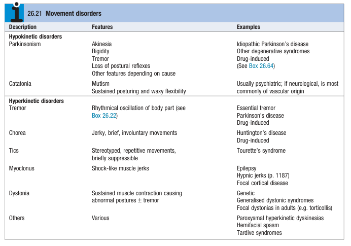
- **Pathophysiology of movement disorders:**
    - <u>Lesion localised to the basal ganglia</u> - due to disturbances in function of BG to inhibit excess unwanted movement, and promote wanted movements
    - <u>Tremors may be a/w other pathologies</u> - e.g. cerebellar or brainstem dysfunction, metabolic causes
- **Tremors** - rhythmic osscilation of a body part caused by involuntary alternating contraction and relaxation of an antagonistic pair:
    - **Types of tremors:**
        - **Rest tremors** - tremors maximal at rest or occurs only at rest (by definition the body part must be completely supported against gravity and not performing any voluntary movements)
        - **Postural tremors** - Occurs when body part maintains a certain posture
        - **Kinetic tremors** - tremors occuring during voluntary movement
            - **Simple kinetic tremors** - tremors roughly the same in frequency and amplitude during the course of voluntary movements
            - **Intention tremors** - tremors increase as body part approaches its target
    - **Etiology of tremors:**
        - **Rest tremors** - parkinsonism and parkinson's disease
        - **Postural tremor** - Physiological tremors, essential tremors, drugs, substances, hyperthyroidism, HE, hypoglycaemia
        - **Intention tremors** - cerebellar disorders

    
    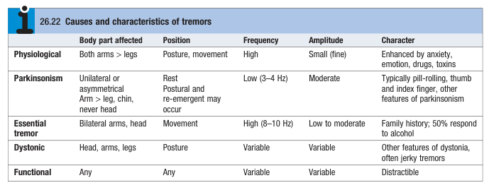
- **Other hyperkinetic syndromes:**
    - <u>Chorea</u> - jerky, brief purposeless involuntary movements that appear as fidgity movements, suggestive of pathology affecting the Caudate
    - <u>Athetosis</u> - slower, writhing movements of the limb, can occur w/ chorea (choreoathestosis) and has the same etiologies
    - <u>Ballism</u> - dramatic form of chorea with violent flinging movements of one limb (monoballism), or one side of the body (hemiballism) and localises to the contraleteral Subthalamic nucleus (mostly caused by strokes)
    - <u>Dystonia</u> - sustained muscle contraction causing abnormal posturing and movements
    - <u>Myoclonus</u> - brief, isolated random jerks, may be physiological (e.g. hypnic jerks), or localises to part of the cortex (e.g. epilepsy)
    - <u>Tics</u> - stereotyped repetitive movements which may be consciousless suppressed for a brief period of time (childhood disorders)
- **Hypokinetic disorders** - parkinsonism (see notes on parkinsonism and PD), catatonia

### Abnormal perception

### Altered balance and vertigo

### Abnormal gait

- **Definition** - abnormal gait may arise from neurological disorders or pain from skeletal abnormalities which must be distinguished
- **Pyramidal gait** - <u>UMN lesion</u> resulting in characteristic <u>extension of the LL</u>:
    - Inability to flex the knee joint on the affected side results in a <u>tendancy for the toes to strike the ground on walking</u>
    - Compensatory <u>circumduction</u> of leg to swing outward of the hip is neccessary to clear the ground
    - In **unilateral UMN lesion** (e.g. hemiparesis), <u>asymmetry between the two sides</u> when walking is obvious, while worn-out shoe on toe side may give clues as to where the lesion is
    - In **bilateral UMN lesions** (e.g. paraparesis), both lower limbs circumduct slowly and are unable to clear the ground, and are dragged stiffly over the ground (<u>walking in mud</u>)
- **Foot drop** - <u>LMN lesion of the leg</u> resulting in <u>severe weakness in ankle dorsiflexion</u>, which is necessary for <u>heel to strike the ground first in normal gait</u>:
    - Weakness of ankle dorsiflexion results in <u>uncontrolled descent of the leg during swing phase</u>, resulting in a slapping noise when foot strikes the groud
    - Compensatory <u>high stepping gait</u> enables foot to be lift higher at the knee, to allow for inadequately dorsiflexed foot to clear the ground
- **Myopathic gait** - proximal muscle weakness results in <u>inadequate hip abduction</u> which is necessary for normal gait:
    - **Rolling or waddling gait** manifests as <u>exagerated trunk movement</u> to swing the leg forward
- **Ataxic gait** - gait arising from ataxia, due to disorders of the cerebellum, vestibular apparatus, or peripheral nerves (particularly in propioception):
    - **Wide-based gait** (or inability for **heel-to-toe walk**) arises when the <u>vermis</u> (central portion of cerebellum) or its inputs from <u>vestibular apparatus</u> is comprimised
    - **Stamping gait** arises in peripheral neuropathy resulting in <u>impairment of proprioception</u>, characterised by placing the ground w/ greater emphasis
- **Apraxic gait** - inability to formulate motor act of walking despite normal neurological examination reflecting diffuse frontal lobe disease (e.g. NPH):
    - Normal tone, power, reflexes, cerebellar function and prioprioception of the legs
    - Inability to formulate motor act of walking due to higher cerebral dysfunction, feet hence appears <u>stuck to the ground</u> and cannot walk
- **Marche a petis pas** - minor UMN lesions pressumed to originate from small-vessel cerebrovascular disease:
    - <u>Slow, small steps w/ marked instability</u> but <u>differs from festination</u> by the absence of increasing pace (shuffling) or freezing (no problem w/ initiation)
    - Presence of <u>UMN signs</u> suggests disease may be cerebral in origin
- **Extrapyramidal gait** - due to basal ganglia dysfunction seen in parkinsonism (see details in notes on parkinsonisn)
- **Antalgic gait** - due to skeletal abnormalities resulting in pain:
    - <u>Shortened stance phase on affected side</u> as a result of pain

### Abnormal speech and language

- **Definition and terminology** - speech disturbance may be isolated to disruption in volume or quality of sound output, or may involve language disturbances:
    - <u>Dysphonia</u> - reduction in sound/ volume typically results from mechanical laryngeal disruption
    - <u>Dysarthria</u> - disruption in quality in sound output and related to swallowing problems due to neurological diseases
    - <u>Dysphasia</u> - inability to understand or express onself through language and always localises to the dominant hemisphere (usually left irrespective of handiness)
- **Etiology of dysphonia** - hoarse or whispered speech:
    - <u>Laryngeal pathology</u> - laryngitis (most common), vacal cord pathologies (e.g. polyps)
    - <u>Neurological pathology</u> - recurrent laryngeal nerve palsy, 10th nerve palsy
- **Etiology of dysarthria** - poorly articulated or slurred speech typically neurological in origin:
    - <u>Bulbar pathologies</u> - often a/w dysphagia, diploipia and ataxia
    - <u>Cerebellar pathologies</u> - slurred and impaired timing and cadence ('scanning') w/ associated ataxia
    - <u>Myasthetic pathologies</u> - e.g. myasthenia gravis with fluctuating severity of speech disturbance and associated features
    - <u>Myopathic pathogies</u> - weakness in muscles of speech

  
  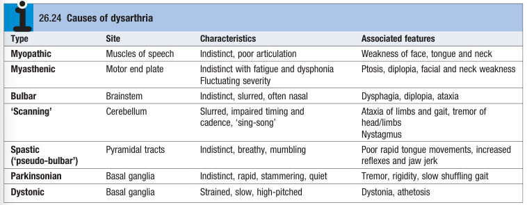
- **Etiology of dysphasia** (aphasia) - disorder of language content of speech always localising to dominant hemisphere:
    - <u>Receptive aphasia</u> (fluent aphasia a/w damage to Wernicke's area) - difficulties in reception of language, but affects output of speech as well, such as paraphasia or neologism
    - <u>Expressive aphasia</u> (non-fluent aphasia a/w damage to Bronca's area) - difficulty in articulating but w/ good auditory verbal comprehension

  
  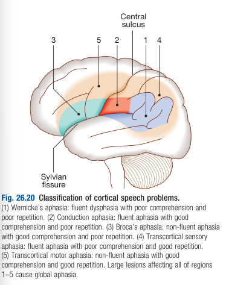

### Disturbance of smell

### Visual disturbances and ocular abnormalities

- **Overview:**
    - Visual disturbances are non-specific complaints and require further characterisation (e.g. -ve Sx, +ve Sx, double vision, blurred vision)
    - Disturbances of vision may be due to 1) <u>primary occular disease</u>, or 2) <u>disorders of central connections and visual cortex</u>
- **Common visual complaints:**
    - <u>Vision loss</u> - as a result of lesion from the retina to the visual cortex
    - <u>Positive visual phenomena</u> - most common cause is migraine, but look out for acute closed-angle glaucoma (halos), retinal detachments, psychiatric disorders or other CNS causes
    - <u>Double vision</u> - caused by malalignment of eyes due to a central disorder or a disorder of a cranial nerve involved in EOM
    - <u>Nystagmus</u> - repetitive to-and-fro movement of the eyes which localises to the vestibular system, brainstem or cerebellum
    - <u>Ptosis</u> - drooping of the eyelid that localises to the PNS, particularly the 3rd nerve, NMJ, muscles etc.
    - <u>Swelling of optic disc</u> - localises to vascular/ nerve damage to the eye, if bilateral, suggestive of raised ICP (i.e. papilloedema)
    - <u>Optic atrophy</u> - localises to the optic nerve

1.  Visual loss

    - **Definition** - by definition complete loss of vision, or loss of part of the visual field, and is localised to any area between the retina and visual cortex
    - **Approach to visual field loss** - ascertain pattern of visual field loss:
      - **Pattern of visual field loss** - see details below:
        - <u>Symptoms affecting one eye only</u> - localises to lesions **anterior to the optic chiasm** (retinal or optic disc)
        - <u>Symptoms affecting both eyes</u> - localises toe lesions **posterior to the optic chiasm, including the optic chiasm itself**
      - **Duration of visual field loss:**
        - <u>Sudden transient visual loss</u> (\< 15 min) - likely of vascular origin
        - <u>Persistent, or progressive visual loss</u> - points towards other etiologies
    - **Patterns of visual field loss** - dependent by the affected area of the optic tract: 
    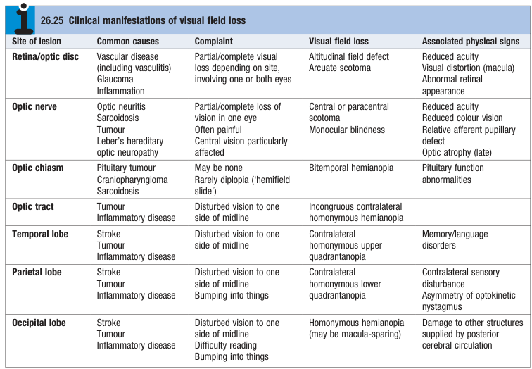

2.  Positive visual phenomena

    - **Types of positive visual phenomena:**
      - <u>Fortification spectra</u> - often described as silvery zigzag lines
      - <u>Teichopsia</u> - flashing couloured light
      - <u>Phosphenes</u> - simple flashes of light
      - <u>Halos</u> - bright circular rings around light as a result of glaucoma
      - <u>Visual hallucinations</u> - for complex formed visual elements
    - **DDx of of positive visual phenomena:**
      - <u>Migraine</u> (most common) - classically w/ fortification spectra or teichopsia preceeding the headache
      - <u>Retinal pathology</u> (e.g. detachment) - many manifest as phosphenes which is mononuclear
      - <u>Primary cortex pathology</u> - may manifests as phosphenes to one side of midline

3.  Diplopia

    - **Definition** - double vision, occassionally reported by patients as blurred vision, most commonly arising from misalignment of the eyes
    - **Differentiation between monocular diplopia and binocular diplopia:**
      - <u>Monocular diplopia</u> (rare) - diplopia cannot be aborted by closing the unaffected eye and points towards an ocular disease
      - <u>Binocular diplopia</u> - diplopia can be aborted by closing either eye and points towards a neurological disease
    - **Pathophysiology of binocular diplopia:**
      - <u>Impaired eye movement</u> - image is not projected onto the same point on the two retinae
    - **Clinical assessment** - the exact defect may be affected based on:
      - 1\. Determining whether diplopia is maximal in any particular direction of gaze
      - 2\. Whether images are separated horizontally and vertically
      - 3\. Additional features of diplopia (e.g. fatigability in myasthenia)
      - 4\. Whether there are any associated S/S (e.g. pupillary disturbances, ptosis, pain)
    - **DDx of diplopia:**
      - <u>UMN lesion</u> - e.g. brainstem pathologies
      - <u>LMN lesions</u>:
        - Intrameningeal
        - Carvenous sinus
        - Superior orbital fissure
        - Orbit
      - <u>Disease of NMJ</u> - classical in myasthenia gravis

4.  Nystagmus

    - **Definition** - a repetitive to-andfro movement of the eye, usually the slow drift being the primary pathology, followed by the fast-corrective phase
    - **Direction of the nystagmus** - by convetion refers to the <u>direction of the fast phase</u>, as it is easily identified, although the primary abnormality is the slow-phase:
      - Vertical nystagmus
      - Horizontal nystagmus
      - Tortional nystagmus
    - **Nature of nystagmus:**
      - <u>Peduncular</u> - i.e. both phases are equal and 'peduncular' with no identifiable fast phase or slow phase
      - <u>Jerky</u> - presence of the fast phase and a slow phase, which is a result of a vestibular, central, or cerebellar lesion
    - **Pathophysiology of nystagmus** - damage to the control systems of the eyes (cerebellum, vestibular system, brainstem) causing the eyes to drift offset:
      - **Peripheral or central vestibular lesions** - vestibular damage results in loss of tonic vestibular signals from the affected side:
        - <u>Unopposed tonic output from contralateral side</u> - tonic output from the unopposed contralateral side causes the eyes to drift **towards the lesion**, such that the corrective fast phase jerks **towards the contralateral side away from the lesion**
        - <u>CNS habituation enables correction of nystagmus</u>:
          - **Peripheral vestibular lesions** - nystagmus accompanies vertigo, N/V and unsteadiness, but as the CNS habituates, the nystagmus dissapears or (fatigues)
          - **Central vestibular lesions** - CNS unable to habituate and hence nystagmus is more persistent
      - **Brainstem or cerebellar (central) lesions** - results in difficulty in maintaining eccentric positions of gaze, i.e. looking to the side, up or down from the straight-ahead-primary position:
        - <u>Inability to maintain eccentric position</u> - eyes will tend to drift back to the primary position, away from the visual target in the slow phase (i.e. primary position)
        - <u>Corrective saccades to focus on target again</u> - this manifests as a **fast phase** towards the direction of the gaze (i.e. <u>gaze-evoked nystagmus</u>)
      - **Ipsilateral cerebellar lesions** - occular dysmetria occuring only when looking towards the pathological lesions, in a similar manner as past-pointing
    - **Localisation of lesion:**
      - <u>Central nystagmus</u> - gaze-evoked nystagmus evoked only in all directions
      - <u>Cerebellar nystagmus</u> - gaze-evoked nystagmus evolved only when looking towards the abnormal side
      - <u>Vestibular nystagmus</u> - theoretically present at rest, w/ fast phase jerking towards normal side, and accentuated when looking towards normal side

5.  Ptosis

    - **Definition** - drooping of the eyelid
    - **Causes of ptosis:** 
    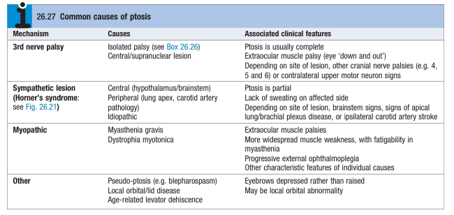

6.  Swelling of optic disc

7.  Optic atrophy

### Hearing disturbances

### Bulbar symptoms - dysphagia and dysarthria

- **Definition and terminology** - bulbar symptoms including dysphagia and dysarthria refers to weakness or incoordination of action of the lips, tongue, soft palate, pharynx and larynx, reflecting pathologies of CN 7, 9, 10, 11 and 12:
    - <u>Dysphagia</u> - perceived difficulty in swallowing which may be a result of structural cause in the GI tract, or as a result of neurological cause
    - <u>Dysarthria</u> - disruption in quality in sound output often accompanying oropharyngeal dysphagia seen in neurological disease
    - <u>Bulbar palsy</u> - refers to LMN lesions within the medulla or outside the brainstem affecting the lower cranial nerves (CN 9, 10, 11, 12)
    - <u>Pseudobulbar palsy</u> - refers to widespread, bilateral UMN bulbar paralysis as UMN innervation of swallowing is bilateral
- **Neurological coordination of swallowing:**
    - Complex neurological coordination of the lips, tongue, soft palate, pharyngeal and laryngeal muscles
    - Dysfunction of the LMN involved in swallowing, unilaterally or bilaterally will result in bulbar symptoms
    - CN motor nuclei involved in coordination of swallowing receive bilateral UMN input, such that unilateral UMN lesions should not cause dysphagia (except for hemispheric stroke)
- **DDx of bulbar and pseudobulbar palsy:**
    - **Bulbar palsy** - localises to within or just outside the medulla:
        - <u>Genetic</u> - Kennedy's disease (X-linked bulbospinal neuropathy)
        - <u>Vascular</u> - medullary infarction (brainstem stroke)
        - <u>Degenerative</u> - motor neuron disease, syringobulbia
        - <u>Inflamatory or autoimmune</u> - GBS, myasthenia gravis, poliomyelitis, lyme disease, vasculitis
        - <u>Neoplastic</u> - brainstem glioma, malignant menignitis
    - **Pseudobulbar palsy** - localises to bilateral hemispheres:
        - <u>Vascular</u> - bilateral hemisphere infarction
        - <u>Degenerative</u> - motor neuron disease
        - <u>Inflammatory</u> - multiple sclerosis, cerebral vasculitis
        - <u>Neoplastic</u> - high brainstem tumours

  
  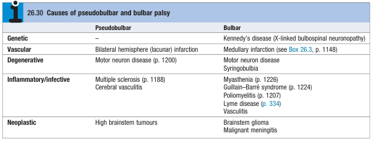
- **Approach to bulbar weakness** - tempo of bulbar Sx is crucial in differentiating between causes:
    - <u>Rapid onset</u> - brainstem stroke, rapidly developing neuropathy (e.g. GBS), diptheria
    - <u>Gradual onset</u> - MND, polymyositis, and inflammatory brainstem disease
    - <u>Chronic onset</u> - suggestive of myopathy, syringobulbia, or brainstem tumour
- **P/E** - examination of CN X and XII are extremely important in <u>differentiating bulbar and pseudobulbar palsy</u>:
    - **Examination of CN X:**
        - <u>Bulbar palsy</u> - asymmetrical soft palate w/ deviation towards lesion
        - <u>Pseudobulbar palsy</u> - reduced palatal movement
    - **Examination of CN XII:**
        - <u>Bulbar palsy</u> - deviation of tongue to pathological side with ipsilateral wasting
        - <u>Pseudobulbar palsy</u> - entire tongue is small and contracted, with slow movement

### Bladder, bowel and sexual disturbance

### Personality change

### Sleep Disturbance

### Psychiatric disorders

## Functional symptoms

## Headache syndromes

- **Classification of headaches** - primary vs secondary headache syndromes:
    - **Primary headache syndromes:**
        - Tension-type headache
        - Migraine headache (w/ or w/o aura)
        - Trigeminal autonomic cephalagia (including cluster headache)
        - Primary stabbing/coughing/exertional/sex-related headache
        - Thunderclap headache
        - New daily persistent headache syndrome
    - **Secondary causes of headache:**
        - Medication overuse headache
        - Intracranial bleeding - subdural haematoma, subarachnoid or intracerebral haemorrhage
        - Raised intracranial pressure
        - CNS infections
        - Inflammatory disease - e.g. temporal arteritis, other vasculitis, arthritis
        - Referred pain from other structures - orbit, temporomandibular joint, neck

### Tension-type headache

- **Definition** - most common type of primary headache syndrome a/w emotional and anxiety and is experienced to some degree by the majority of the population
- **Pathophysiology of TTH** - incompletely understood:
    - <u>Emotional precipitants</u> - emotions, stress or anxiety are common precipitants and there is sometimes an associated depressive episode
    - <u>Perpetuation of headache</u> - patients who notice the headache may become anxious about the headache, especially if convinced of a serious underlying conditions, and can lead to **continuation of Sx**
- **Clinical features of TTH:**
    - **Headache** - dull, tight or band-like pressure and generalised, usually radiating from the occipital region:
        - <u>Site</u> - generalised and **bilateral**, usually from the occipital region or vertex
        - <u>Onset</u> - gradual onset
        - <u>Progression</u> - attacks ranging from 30min to 7d, can remain unabated for weeks or months w/o interruption (cf migraines), usually less severe in the morning, but becomes troublesome as day goes on, and usually fluctuates w/ activity
        - <u>Quality</u> - dull, tight, band-like pressure
        - <u>Severity</u> - usually mild-to-moderate pain, fluctuates throughout the day
        - <u>Timing</u> - usually worse later in the day, but less noticeable when the patient is occupied by another activity (not exacerbated by physical activity)
    - **Absence of migraine-like features** - e.g. aura, vomiting, photophobia
- **Mx:**
    - **Principles of Mx:**
        - **Abortive Tx** - analgesics play a role in aborting TTH attacks
        - **Prevention of next attack:**
            - <u>Patient education and re-assurance</u> - provided careful assessment followed by discussions of likely precipitates and reassurance that the prognosis is good and not caused by any organic disease
            - <u>Pharmacological therapy</u> - analgesics (limited benefits), low-dose amitriptyline
            - <u>Physiotherapy and stress management</u> - helps w/ muscle relaxation and stress management

### Migraines

- **Definition** - a primary headache syndrome with neurovascular origin appearing usually before middle age with <u>characteristic presentation</u>
- **Epidemiology** - 20% F, 6% M at some point in life
- **Pathophysiology of migraine:**
    - **Spreading depression of Leao** - dysfunction in ion channels causes a spreading front of cortical depolarisation (excitation) followed by hyperpolarisation (depression of activity) underlying aura preceeding headache
    - **Vasodilation of extracranial vessels** - vasodilatation and activation of trigeminovascular system explains the headache phase
    - **Precipitants of migraine:**
        - <u>Hormonal influence</u> - demonstrable female preponderance and increased frequency of attacks in certain points of menstrual cycle, exacerbation by COC pills suggests a hormonal influence (COC pills increases risk of stroke in patients suffering from migraine w/ aura)
        - <u>Dietary precipitants</u> - cheese, chocolate, red wine
        - <u>Psychological factors</u> - after periods of sterss (e.g. Friday evenings, begninning of holidays)
- **Clinical features of migraines:**
    - **Prodrome** - prodrome of malaise, irritability or behavioural changes for some hours or days preceeding onset of migraine aura
    - **Aura** - gradual development of focal neurological Sx, 20% of patients experience migraine w/ aura ('classical' migraine), while 80% patients experience migraine w/o aura with characteristic headaches ('common' migraine):
        - **Visual aura** - most common migraine aura:
            - <u>Fortification spectra</u> (+ve Sx) - shimmering, silvery zigzag lines that march across visual fields for up to 40 min
            - <u>Scotoma</u> (-ve Sx) - trail of temporary visual field loss following fortification spectra
        - **Sensory aura:**
            - <u>Tingling sensation or parasthenia</u> (+ve Sx) - spreading tingling sensation from one part of the body to another
            - <u>Numbness</u> (-ve Sx) - loss of sensation following the sensation (r/o focal epilepsy)
        - **Aphasic aura** - transient speech disturbance if CSD spreads through the dominant lobe
        - **Motor aura** - hemiplegia
    - **Migraine headache** - usually severe, unilateral, throbbing headache lasting 4-72h with marked systemic features:
        - <u>Site</u> - unilateral
        - <u>Onset</u> - gradual onset following onset of aura (within 60 min)
        - <u>Progression</u> - unremitting until headache is over
        - <u>Quality</u> - throbbing quality
        - <u>Severity</u> - severe
        - <u>Timing</u> - worse with light, noise or movement (i.e. <u>patient prefer to lie still in a quiet, dark room</u>)
    - **Marked accompliants of migrain headaches** - photophobia, phonophobia, and vomiting
- **Mx of migraines:**
    - **Principles of Mx:**
        - <u>Avoidance of precipitants</u> - e.g. food, stress, COC pills (esp. for women w/ migraine w/ aura as a/w increased stroke risk)
        - <u>Abortive Tx</u> - analgesics, triptans, ergotamines
        - <u>Prophylactic Tx</u> - vasoactive drugs such as CCB, BBs, anti-depressants, anti-epileptics
    - **Abortive Tx** - Tx of acute attack:
        - **Selection for abortive Tx:**
            - <u>Analgesics</u> - e.g. aspirin, paracetamol, NSAIDS
            - <u>Triptans</u> (5-HT agonist) - sumatriptan
            - <u>Ergotamine</u> - ergotamines, dihydroergotamines
            - <u>D2 antagonists anti-emetics</u> - metoclopramide, domperidone
        - **Triptans** - reserved for severe attacks:
            - <u>MOA</u> - 5-HT agonists resulting in extra-cranial vasoconstriction
        - **Ergotamine** - reserved for severe attacks:
            - <u>MOA</u> - 5-HT agonist resulting in generalised vasoconstriction
            - <u>S/E</u>:
                - Dependence
                - Ischaemic stroke
    - **Prophylactic Tx** - prophylaxis if attacks are frequent (\> 3-4 per mo) or debilitating

### Medication overuse headache

- **Definition** - headaches caused by overuse of over the counter analgesics, and often can complicate any other headache syndrome, especially TTH, and migraines
- **Clinical features of MOH:**
    - <u>Chronic daily headaches</u> - unremitting headache especially increasing frequency or duration of TTH or migraine
    - <u>Excessive medication use</u> - most common culprits are compound analgesia (w/ weak opioids) or triptans, and is usually associated w/ use of \> 10-15d a month
- **Mx** - withdrawal of responsible analgesic (patient warned that initial effect will be to exacerbate the headache) +/- prophylactic for migraines

### Cluster headache

- **Definition** - also known as migranous neuralgia, a form of trigeminal autonomic cephalgia characterised by strikingly periodic runs of identical headaches
- **Epidemiology** - male preponderance (cf migraines)
- **Pathophysiology** - cause unknown:
    - Lack of genetic predisposition
    - Lack of provoking dietary factors
    - Patient often smoker w/ higher than average alcohol consumption
    - Functional imaging studies suggest abnormal hypothalamic activity
- **Clinical features of cluster headache:**
    - **Cluster headaches** - strikingly periodic, featuring runs of identical headache beginning at the same hour for weeks at a time before spontaneous remission for months to years:
        - <u>Site</u> - classically unilateral periorbital pain
        - <u>Onset</u> - sudden spontaneous onset at the same hour
        - <u>Duration</u> - characteristically brief (30-90 min)
        - <u>Progression</u> - runs of the same headache at the same time for weeks before spontaneous remission
        - <u>Quality</u> - piercing around one eye
        - <u>Severity</u> - quite severe and does not respond to Tx for migraines (possibly due to brief duration)
        - <u>Associated behaviour</u> - often agitated during the headache phase (cf lying down in a dark quiet room for migraines)
    - **Unilateral autonomic features** - autonomic features may occur on the ipsilateral side including:
        - <u>Occular manifestations</u> - unilateral lacrimation, conjunctival injection
        - <u>Nasal manifestation</u> - unilateral nasal discharge, nasal obstruction
        - <u>Horner syndrome</u> - ipsilateral ptosis, miosis, anhidrosis
- **Mx:**
    - **Principles of Mx:**
        - <u>Mx of acute episodes</u> - SC injection of sumatriptan or inhalation of 100% oxygen, but migrainous therapies are ineffective due to brevity ofevents
        - <u>Prophylaxis</u> - no role of migrainous medications, but some evidence for sodium valpropate, varapamil, methyseragide, short causes of oral corticoteroid (+/- lithium)

### Trigeminal neuralgia

- **Definition** - lancinating facial pain in a dermatomal fashion likely caused by an irritative lesion at the trigeminal nerve root
- **Epidemiology** - usually in patients \> 50y
- **Pathophysiology of trigeminal neuralgia:**
    - <u>Irritative lesion involving trigeminal root zone</u> - in some cases caused by an aberrant loop of artery, while other benign compressive lesions are occasionally found (if a/w multiple sclerosis, it is classically caused by a plaque of demyelination in the brainstem)
    - <u>Additional stimulus results in a neuropathic pain</u> - additional stimulation by touch, cold wind or movement exacerbates the pain
- **Clinical features of trigeminal neuralgia:**
    - **Facial pain in the trigeminal division** - relapsing and remitting course of unilateral facial pain:
        - <u>Site</u> - unilateral, often involving 2nd and 3rd divisions of the trigeminal nerve territory
        - <u>Onset</u> - typically onset \> 50y
        - <u>Progression</u> - relapsing and remitting course
        - <u>Quality</u> - chronic lancinating pain in a dermatomal fashion, but can be exacerbated by additional stimulus
        - <u>Severity</u> - often severe, especially when provoked
        - <u>Exacerbating factors</u> - can be triggered by touch, a cold wind, eating or spasms of facial muscles (tic douloureux)
- **Mx:**
    - **Principles of Mx:**
        - <u>Medical therapy</u> - carbamazepine first line; other Tx for neuropathic pain (e.g. gabapentin, pregabalin, amitriptyline) or steroids may be effective if carbamazepine not tolerated
        - <u>Surgical decompression</u> - e.g. decompression of the inciting vascular loop has a 90% success rate

### Headache associated with specific activities and ther headache syndromes

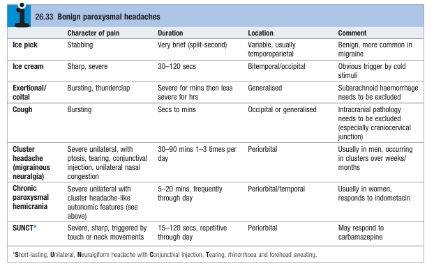

## Epilepsy

- **Definition and terminology:**
    - <u>Seizure</u> - the occurence of S/S due to abnormal, excessive, or synchronous neuronal activity in the brain
    - <u>Epilepsy</u> - the tendancy to have unprovoked seizures
    - <u>Grand mal seizures</u> - historical term that describes tonic-clonic seizures
    - <u>Petit mal seizures</u> - historic term to absence seizures, but commonly used to describe anything other than Grand mal
- **Epidemiology** - prevalence of active epilepsy around 0.5%
- **Pathophysiology of seizure and epilepsy:**
    - **Imbalance between excitation and inhibition** - paroxysmal depolarisation shift in neuronal membrane potential, predisposing to recurrent action potentials with **repetitive discharges involving large neuronal networks**:
        - <u>Inhibitory neurotransmitters</u> - GABA (gamma-aminobutyric acid) acts on ion channels to enhance chloride influx and **hyperpolarisation**, preventing action potential formation
        - <u>Excitatory neurotransmitters</u> - Glutamate and asparate act on ion channels to enhance sodium and calcium influx and hence **depolarisation**, promoting action potential formation
    - **Principles of focal onset seizures:**
        - <u>Localised pathology causing focal seizure at first instance</u> - from focal infections, tumours, vascular event, or trauma-related scarring
        - <u>Semiology is dependent on cortical area affected</u> - e.g. origin in temporal lobe results in impaired awareness but w/o tonic-clonic movement
        - <u>Seizure activity can spread</u> - spread to different cortical areas will result in different clinical features, and subsequently secondary generalisation when spread to the contralateral hemisphere
    - **Principles of generalised seizures:**
        - <u>Seizures can be generalised in onset</u> - caused by genetic basis (e.g. channelopathies) involving **central mechnisms** controlling cortical activations (<u>diencephalic activating system</u>) and spreads rapidly
        - <u>Secondary generalisation after focal onset seizures</u> - caused by focal seizures that spread to bilateral hemispheres via spreading of abnormal electrical activity to the diencephalic activating pathways

    
    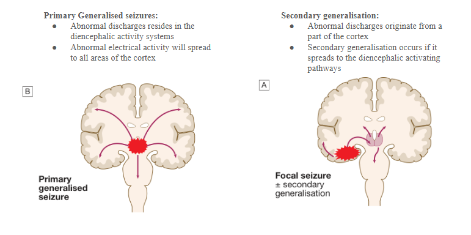

### Seizure types and epilepsy types

- **Seizure types** - determine 1) whether there is a focal onset, and 2) whether it conforms to a recognised pattern of seizures:
    - **Focal seizures:**
        - **Causes of focal seizures:**
            - <u>Idiopathic</u> - benign rolandic epilepsy of childhood, benign occipital epilepsy of childhood
            - <u>Genetic structural lesions</u> - Tuberous sclerosis, von Hippel-Lindau disease, Neurofibromatosis
            - <u>Neoplastic</u> - primary or secondary tumours
            - <u>Infective</u> - e.g. cerebral abscess, subdural empyema, encephalitis, tuberculoma, toxoplasmosis, cysticercosis (parasitic)
            - <u>Vascular</u> - ICH, AVM, cerebral infarction

      
      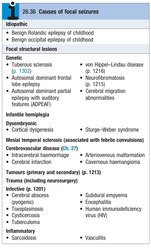
        - **Clinical features of focal seizures** - +ve neurological phenomena corresponding to the cortical area affected:
            - <u>Occipital lobe involvement</u> - +ve visual phenomena (e.g. light and blobs of colour)
            - <u>Parietal onset</u> - sensory strip involvement results in sensory alterations (e.g. burning sensation, tingling)
            - <u>Frontal lobe involvement</u> - results in +ve motor Sx or bizzare behavioural patterns:
                - **Focal Motor Sx** - jerking (e.g. myoclonus)
                - **Bizzare behavioural patterns** - e.g. abnormal posturing, sleep walking, or even frenetic ill-directed motor activity (e.g. incoherent screening)
            - <u>Temporal lobe involvement</u> - results in impaired awareness, false recognition, or other features of automatism:
                - **Impaired awareness** - initially evident by its vacant stare and unresponsiveness
                - **False recognition** - sense of 'deja vu', occassionally presenting w/ <u>epigastric discomfort</u>
                - **Features of automatism** - repetitive, seemingly purposeful behaviour:
                    - Repetitive blinking
                    - Lip-smacking
                    - Fiddling of clothes (from simple picking to repetitive dressing and undressing)
                    - Pill-rolling movements
                    - Hand-clapping or rubbing

          
          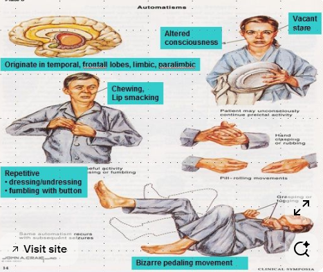
        - **Classification into focal aware seizures and focal impaired aware seizures:**
            - <u>Focal aware seizures</u> ('simple partial seizures') - if abnormal cortical activity never involves the temporal lobe, where individual retains awareness, and is often characterised by positive neurological S/S correspond to the normal function of the area
            - <u>Focal impaired aware seizures</u> ('complex partial seizures') - if abnormal cortical activity involves the temporal lobe, resulting in **impaired awareness**, and a/w signs of automatism
    - **Generalised seizures** - may either be 1) generealised onset, or 2) secondary generalisation of focal seizures:
        - **Classification of generalised seizures** - based on whether there is a recognisable pattern of seizures:
            - <u>Generalised tonic-clonic seizures</u> - LOC a/w increased rigidity as a result of rapid discharge (tonic phase), followed by what appears to be jerking motions due to reduced discharge frequency (clonic phase), often associated w/ 1) central cyanosis, 2) tongue biting, 3) urinary incontinence, 4) post-ictal drowsiness and 5) sustained injury from fall
            - <u>Absence seizures</u> (previously petit mal) - brief periods of loss of awareness in childhood, mistakened for daydreaming or poor concentration in school
            - <u>Myoclonic seizures</u> - brief jerking movements predominantly in the arms, more marked in the morning, on awakening, and provoked by fatigue, alcohol or sleep deprivation
            - <u>Atonic seizures</u> - brief loss of muscle tone resulting in falls w/ or w/o LOC, and only occurs in epileptic syndromes w/ other seizure types
            - <u>Tonic seizures</u> - LOC a/w generalised increase in tone w/o being followed by a clonic phase, only occurs as part of an epielpsy syndrome
            - <u>Clonic seizures</u> - LOC a/w generalised jerking without a preceding tonic phase, similar to GTCS
    - **Seizures of uncertain generalised or focal nature:**
        - <u>Epileptic spasms</u> - takes form w/ widespread marked contractions of axial musculature lasting \< 1s but recurring in clusters of 5-10, often on awakening (highlighted in classification system but seldom used in adulthood)
- **Epilepsy types** - determine 1) whether there is a focal onset:
    - **Generalised vs focal epilepsies** - a tendancy of either developing unprovoked generalised or focal seizures:
        - <u>Generalised epilepsies</u> - defects of the central cortical activating systems that is typically genetic in origin, resulting in immediate onset of generalised seizures
        - <u>Focal epilepsies</u> - focal cerebral events that results in focal seizure activity, but may subsequently undergo secondary generalisation if activity spreads to the central contrical activating systems
    - **Differentiating by age of onset:**
        - <u>Onset before 35y</u> - increases likelihood of **generalised epilepsies**, which have a genetic basis and thus almost always becomes apparant before 35y
        - <u>Onset after 35y</u> - invariably will be **focal epilepsies**, secondary generalisation to GTCS will often be preceded by focal +ve neurological Sx
- **Causes of GTCS:** 
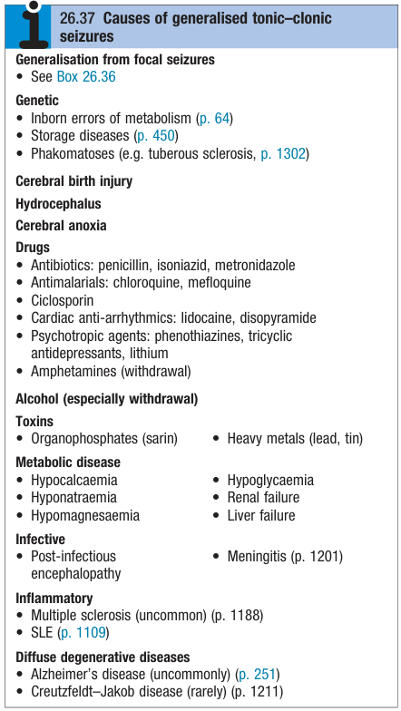

### Epilepsy syndrome

- **Definition** - electroclinical syndromes characterised by EEG patterns, age-of-onset, clinical features (including seizure types), and possibly underlying genetic basis and molecular pathophysiology, defined as distinct epilepsy syndromes will show characteristic treatment responsiveness
- **Common epilepsy syndromes** - most of these Sx are a/w certain triggers (see below): 
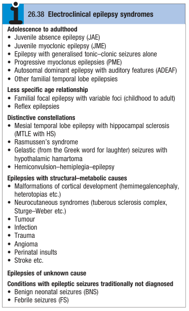
- **Common triggers of seizures in epilepsy syndromes:**
    - Photic stimulation
    - Sleep deprivation
    - Alcohol
    - Hyperventilation

### Investigations

### Management

- **Principles of Mx:**
    - <u>Patient and carer education</u> - educate patient and carer on nature and cause of seizures, and to instruct carer in the first aid Mx of seizures
    - <u>Patient reassurance</u> - inform patient that they should not feel stigmatised and emphasise that it is a common disorder (0.5-1% depending on age), and that most patients (70%) can be seizure free
    - <u>General measures</u> - lifestyle modification including avoiding seizure triggers, avoiding dangerous activities if seizure occurs, and driving regulations
    - <u>Anti-seizure medications</u> - anticonvulsants should be iniitiated once a diagnosis of epilepsy is made
- **Carer education** - on provision of the <u>immediate care during active seizure</u>:
    - Little can be done by the observer except not to leave the person actively seazing
    - If convulsions persist for more than 5 min, summon urgent medical attention
    - Ensure patent airway in actively seizing individuals, and do not insetrt anything in the mouth to avoid tongue biting

  
  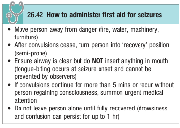
- **Lifestyle modification** - Avoiding actities that place themselves or others at risk during active seizure:
    - Baths (consider only shallow baths or showers to avoid drowning)
    - Activities a/w prolonged proximity to water (e.g. swimming, fishing or boating), should be carried in company who is aware of the risk and potential need for rescue measures
    - Driving (regulation dependent on country)
    - Certain occupations are not open to anyone w/ previous seizures

  
  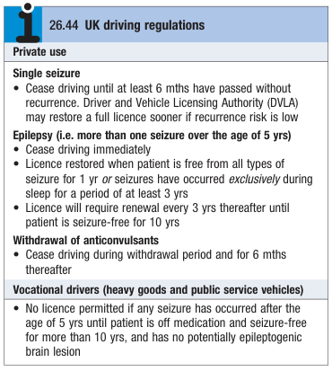
- **Anti-seizure medications:**
    - **Principles of ASM** - balance cortical stimulatory and inhibitory neurotransmission:
        - <u>Increased inhibitory neurotransmission</u> - e.g. GABA agonists
        - <u>Na channel inhibition</u> - e.g. valproate
    - **Selection of anti-seizure medications** - different 1st-line agents based on the epilepsy type:
        - **Principles of selection of ASM for seizure type:**
            - <u>Focal onset seizure</u> (w/ or w/o secondary generalisation) - lamotrigine is considered first-line monotherapy as RCTs suggests its superioriority (SANAD II study), although levetiracetam and zonosamide are acceptable alternatives
            - <u>Other seizure subtypes</u> - sodium valpropate a/w best resonse although levatiracetam is also used
        - **Other considerations for selection of ASM:**
            - <u>Sodium valproate</u> - generally avoided in women of reproductive ages due to problems w/ pregnancy
            - <u>Lamotrigine</u> - caution if used together w/ COC pills

    
    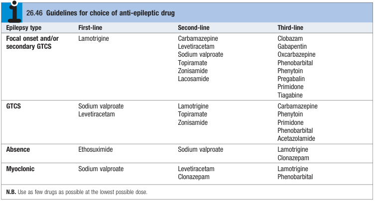
    - **Approach to initiation of anticonvulsant therapy** - using as few drugs at as low-doses as possible to control seizures:
        - <u>Initial Tx</u> - initiate first-line drug for epilepsy subtype at low doses, increased dose incrementally until seizure controlled or S/E intolerable
        - <u>Escalation of Tx</u> - if seizures persist at maximal or intolerable doses:
            - Second-line drug monotherapy with gradual withdrawal of first
            - Combination therapy of second-line drug w/ first-line drug at maximally tolerable doses (beware of drug-drug interactions)
            - Replace second-line drug with alternative second-line drug

    
    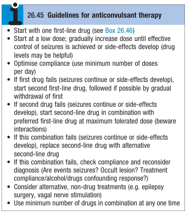
    - **Withdrawal of ASM** - if considered, done gradually over weeks or months:
        - May be considered for patients who have been <u>seizure-free for \> 2y</u>
        - Prognosis and <u>recurrence rate</u> on drug withdrawal <u>dependent on epilepsy subtype</u>:
            - Childhood onset epilepsy (esp ebsence seizures) has best prognosis w/ documented success of seizure withdrawal
            - Other known epilepsy syndromes tend to reccur
            - Epilepsy a/w structural lesions tend to recur but depends on the individuals epilepsy history
        - A <u>shared decision making</u> and ultimately comes down to patients concerns of risk of recurrence and medication S/E
    - **Relations w/ contraceptives:**
        - <u>Pathophysiology</u> - some drugs are CYP450 inducers that metabolise hormones
        - <u>ASM a/w contraceptive failure</u>:
            - Carbamazepine
            - Phenytoin
            - Barbiturates
            - Lamotrigine
            - Topiramate
        - <u>ASM w/o interactions w/ COC pills</u>:
            - Sodium valproate (although avoided in women of reproductive age)
            - Levetiracetam
    - **Relations w/ pregnancy** - valproate icnreased risk of teratogenesis
- **Non-pharmacological intervention** - considered for patients who experience seizures despite appropriate drug Tx (requires balancing against dispensability of target neurological function):
    - <u>Epilepsy surgery</u> - surgical resection of epileptogenic brain tissue
    - <u>Vagal nerve stimulation</u> - less invasive than eipelsy surgery
- **Prognosis:** 
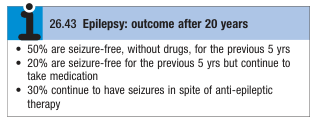

### Non-epileptic attack disorders

- **Definition** - also known as psychogenic non-epileptic seizures, resembling frontal seizures w/ bizzare behaviours
- **Epidemiology** - female preponderance (F:M = 3:1) w/ Hx of past or ongoing trauma
- **Distinctions between NEAD and epileptic attacks:**
    - Tongue biting and central cyanosis do not occur (although urinary incontinence seldom occur)
    - Little post-ictal drowsiness while distress and crying are common in NEAD
    - Formal distinction may require videotelemetry and prolonged EEG recordings
- **Mx** - psychotherapeutic interventions

## Vestibular disorders

- **Common manifestations of vestibular disorder** - vertigo
- **DDx of vertigo:**
    - <u>Peripheral vertigo</u> - acute vestibular failure, BPPV, Meniere's disease
    - <u>Central vertigo</u> - migraine, brainstem lesions

### Acute vestibular failure

- **Definition** - also known as 'acute labyrinthitis' or 'vestibular neurobitis', is an idiopathic acute onset of vertigo w/ vomiting and unsteadiness
- **Etio-pathophysiology of acute vestibular failure:**
    - Idiopathic (common)
    - Viral infections often implicated
- **Clinical features of acute vestibular failure** - onset upon waking and Sx typically last a few days:
    - <u>Severe vertigo</u> - sensation of room spinning upon waking such that many patients are bed-bound, and is often exacerbated by head movements
    - <u>Nausea and vomiting</u> - as a result of severe vertigo
    - <u>Unsteadiness</u> - if patient attempts to walk when vertigo is severe
- **Signs of acute vestibular failure:**
    - **Nystagmus** - typically present in the first few days of disease
- **Ix and Dx** - clinical Dx
- **Mx:**
    - **Principles of Mx:**
        - <u>Symptomatic relief</u> - cinnarizine (CCB), prochlorperazine (1G anti-psychotic), betahistine (vestibular sedatives)
        - <u>Vestibular rehabilitation</u> - for patients who fail to recover fully with residual sense of disequilibrium

### Benign paroxysmal positional vertigo

- **Definition** - pathologically defined as cupulolithiasis, that is the presence of otolithic debris from the saccule or utricle affecting the free flow of endolymph in semicircular canals
- **Pathophysiology of BPPV:**
    - <u>Cupolithiasis</u> - dislodged otolithic debris from the saccules or utricles into the semicircular cannals
    - <u>Obstructed endolymph flow</u> - endolymph flow within the semicircular canal is obstructed, underlying vertigo w/ head movements
- **Clinical features of BPPV** - Hx is diagnostic:
    - **Vertigo** - <u>transient</u> vertigo, that is always <u>preceded by head movement</u>, classically rolling over in bed, or getting out of or into bed
- **Signs of BPPV:**
    - **Dix Hallpike maneuver** - demonstration of transient positional nystagmus accompanied by vertigo:
        - **Technique:**
            - Ask patient to keep eyes open to visualise the nystagmus
            - Swing patient briskly backwards through 120 degrees from sitting to overhang the edge of the couch
            - At the end of the motion, the ear tested should face down to the floor

      
      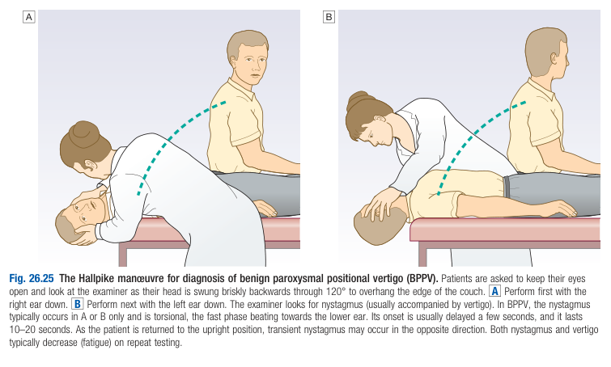
        - **Findings:**
            - **Torsional nystagmus** - note that will decrease upon repeated testing due to fatigue:
                - <u>At end of the bed</u> - fast phase jerks towards the lower ear; the nystagmus is delayed for a few seconds, and tends to last for 10-20 seconds
                - <u>Recovery to sitting position</u> - transient nystagmus may occur in the opposite direction
            - **Vertigo** - patient reports vertigo upon the maneuver
- **Mx:**
    - **Principles of Mx:**
        - <u>General measures</u> - patient education, explanation and reassurance of benign nature of the condition
        - <u>Epley manoeuvre</u> - designed to return otolithic debris back into saccule or utricles
        - <u>Cawthorne-Cooksey exercises</u> - re-edjucate brain to cope w/ inappropriate signals from the labyrinth

### Meniere's disease

- **Definition** - idiopathic endolymph abnormalities a/w vestibular attacks, and progressive hearing Sx
- **Clinical features of Meniere's disease:**
    - <u>Vertigo</u> - vertigo attacks typically lasting a few hours and complete absence of Sx between attacks
    - <u>Tinnitus and aural fullness</u> - accompanying features of the vertigo attacks which dissapear after the attack is over
    - <u>Progressive deafness</u> - usually low-tone hearing loss on audiometry
- **Ix** - PTA to demonstrate low-tone deafness
- **Dx** - clinical
- **Mx:**
    - <u>General measures</u> - low-salt diet, and vestibular sedatives during attacks
    - <u>Surgical Mx</u> - ocassionally indicated

## Disorders of sleep

## Neuroinflammatory diseases

### Multiple sclerosis

- **Definition** - a chronic, progressive inflammatory demyelinating disorder of the CNS
- **Epidemiology** - important cause of long-term disability in adults:
    - <u>Prevalence</u> - 120/100000, lifetime risk of 1 in 400 (UK Data)
    - <u>Incidence</u> - 7/100000/y
    - <u>Demographic</u> - female preponderance (M:F = 1:2), peak presentation at 4th decade (rarely in puberty or \> 60y)
- **Pathophysiology of MS** - genetic and environmental factors play causative roles:
    - <u>Genetic predisposition</u> - 15% risk of familial recurrence (highest risk in 1st degree relatives), 30% monozygotic concordance rate:
        - **Implicated genes** - HLA predisposition, IL receptors, CLEC16A, CD266 genes
    - <u>Environmental factors</u> - demonstrated by fact that there is geographical variation, and people <u>retain risk of developing disease in zones where they grow up in</u> (impact of environmental exposures during growth and development):
        - **Implicated environmental exposure** - sunlight, vitamin D, EBV etc.
    - <u>Paroxysms of CNS inflammation</u> - intiates through entry of activated T cells across BBB, which recognise myelin-derived antigens presented by microglial cells:
        - <u>Release of inflammatory cytokines</u> - direct effect on transmission of nervous impulse causing clinical effect, prior to demyelination (hypothesis for the acute benefit of high-dose corticosteroids)
        - <u>Inflammatory demyelination</u> - destruction of the oligodendrocyte-myelin units after macrophage recruitment, which is replaced by scarring through gliosis
    - <u>Progressive axonal loss after attacks</u> - due to successive damage from acute attacks and subsequent loss of neurotrophic factors from oligodendrocyte, resulting in **progressive and persistent disabilities**
- **Clinical features of MS:**
    - **Clinical course** - 80% have a relapsing and remitting clinical course, while 20% have a progressive clinical course:
        - <u>Relapsing and remitting course</u> (80%) - Gradual onset of S/S over days or weeks, resolving over weeks or months (episodic dysfunction with variable intervening recovery)
        - <u>Progressive</u> (20%) - slowly progressive focal neurological S/S with no recovery in between
        - <u>Fulminant</u> - early death
    - **Frequency of attacks** - extremely variable:
        - <u>Mild cases</u> - years to decades between attacks, or even no recurrence (especially if optic neuritis is the initial manifestation)
    - **Common clinical presentation of multiple sclerosis:** 
    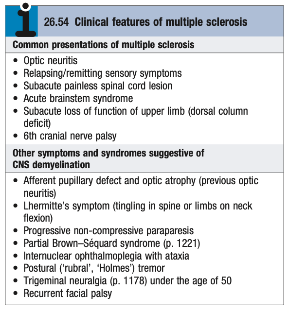
- **Ix** - no single diagnostic test for MS (requires correlation w/ clinical picture):
    - <u>T2-weighteed MRI of brain and spinal cord</u> - 1) demonstration of disseminated demyelinating plaques in space or time and 2) exclude other structure diseases
    - <u>Electrophysiology</u> - e.g. visual evoked potential (clinically silent lesions in \>70%), and other evoked potentials
    - <u>Lumbar puncture and CSF analysis</u> - demonstrate inflammatory nature of disease:
        - Cell counts - lymphocytic pleocytosis in acute phase
        - Protein electrophoresis - oligoclonal bands in 70-90% patients in between attacks (non-specific for MS and only indicates intrathecal inflammation)

  
  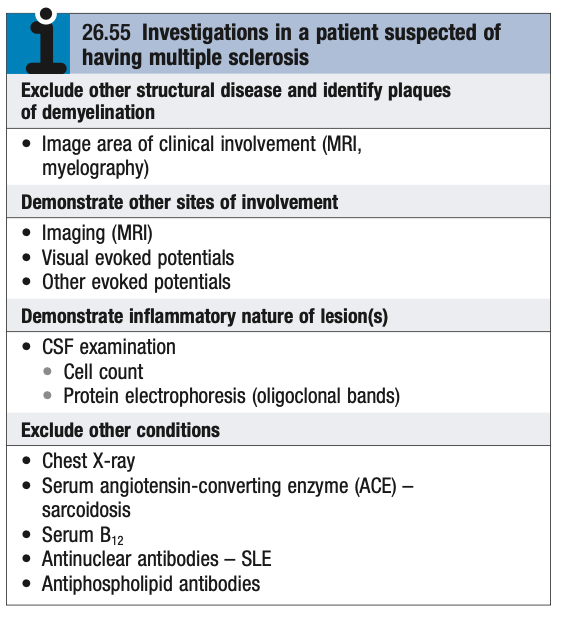
- **Dx criteria** (MacDonald's criteria) - demonstration of <u>otherwise unexplained</u> CNS lesions <u>disseminated in space and time</u>: 
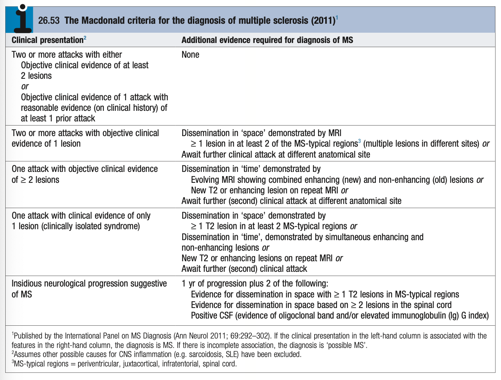
- **Mx of MS:**
    - **Principles of Mx:**
        - <u>Mx of acute episode</u> - high dose steroids to avoid permanent disability
        - <u>Disease-modifying Tx</u> - Tx in inter-critical stages to reduce relapse rate and improve long term outlook
        - <u>Mx of complications and disabilities</u>
    - **Mx of acute episode:**
        - **High dose steroids** - inhibit inflammatory response at onset of acute episode to prevent demyelination causing permanent disabilities:
            - <u>RoA</u> - IV or oral
            - <u>Duration</u> - 3-5d
            - <u>Osteoporosis prophylaxis</u> - considered in patients requiring multiple courses of corticosteroids
            - <u>Evidence for corticosteroids</u> - evidence supporting use in acute setting, but no effect of long-term steroids on preventing exacerbations and delaying progression of MS: 
            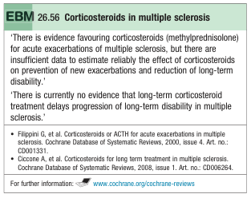
    - **Disease-modifying Tx:** 
    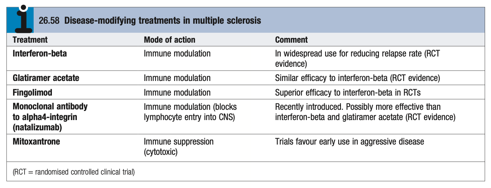
        - **Beta-interferons:**
            - <u>MOA</u> - immune modulation
            - <u>Clinical efficacy</u> - effective in RRMS, and not effective in PPMS/ SPMS:
                - RRMS - modest reduction of relapse rates (30%), and reduced long-term disability
                - PPMS/SPMS - no effects in development of permanent physical disability
            - <u>S/E</u>:
                - Flu-like Sx
                - Depression
                - ABx against INF-beta (monitored; may preclude further long-term Tx, but does not appear to affect clinical outcomes)
        - **Mitoxantrone:**
            - <u>MOA</u> - cytotoxic agent (similar to daunorubicin)
            - <u>S/E</u>:
                - Cardiotoxicity
        - **Natalizumab:**
            - <u>MOA</u> - MAb against alpha-4 integrin (prevents entry into CNS)
            - <u>Clinical efficacy</u> - improved clinical and radiological outcomes
            - <u>S/E</u>:
                - Progressive multifocal leucoencephalopathy (C/I in those w/ +ve titres of JC virus)
    - **Tx of symptoms, complications and disabilities:** 
    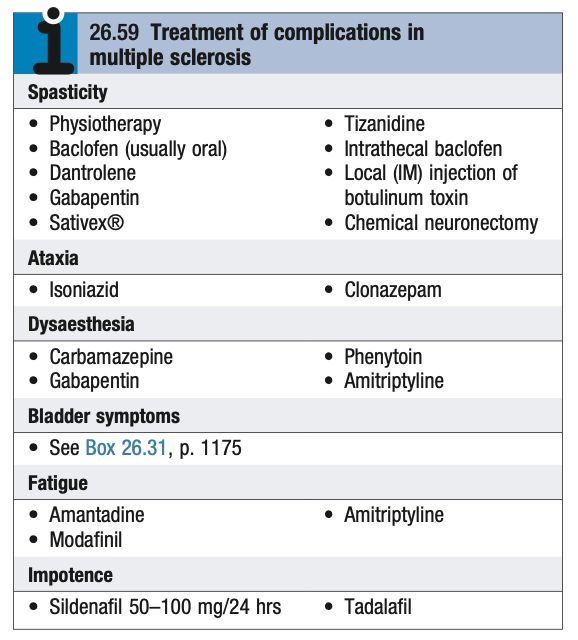
- **Prognosis** - difficult to predict w/ confidence:
    - **Prognosis after 1st attack:**
        - Fulminant - 5% mortality within 5y of disease onset
        - Remitting and relapsing - most have 1-2 episodes every 2 years
        - Single occurance - 15% have single demyelinating episode and do not suffer from any other episodes
    - **Good prognostic features:**
        - Optic neuritis
        - Only sensory relapse
    - **Prognosis on morbidity** - 1/3 disabled after 10y, 1/2 after 15y

### Acute disseminated encephalomyelitis

- **Definition** - an <u>acute monophasic demyelinating condition</u> which there are perivenous demyelination widely disseminated throughout the brain and spinal cord
- **Clinical features of ADEM** - acute onset usually follows a week after viral infection (esp. measles and chickenpox), but may occur spontaneously:
    - **Focal or multifocal neurological S/S** - typically UMN features localising to the brain and spinal cord
    - **Pyrexia** - often a presenting features
    - **Features of raised ICP:**
        - Headache
        - Vomiting
        - Seizures or coma
- **Ix** - indistinguishable to first relaspe of MS:
    - **Neuroimaging** - MRI:
        - Multiple high-signal areas in a pattern similar to MS, but often <u>large confluent areas of abnormalities</u>
    - **LP** - may be normal:
        - <u>WBC</u> - lymphocytic pleocytosis (occasionally \> 100 x 106 cells/L)
        - <u>Protein</u> - raised
        - <u>Oligoclonal bands</u> - may be found in acute episode but does not persist beyond recovery (cf MS)
- **Mx:**
    - **Principles of Mx:**
        - <u>Supportive Mx</u> - may be fatal in acute stages but is otherwise self-limiting
        - <u>Steroids</u> - same regimen of steroids as in relapse of MS
    - **Steroids:**
        - <u>Regimen</u> - high dose IV methylprednisolone

### Transverse myelitis

- **Definition** - an acute, usually monophasic demyelinating disorder affecting spinal cord, thought to be post-infectious in origin
- **Epidemiology** - can present w/ any age and may reflect subsequent development of MS
- **Clinical features of transverse myelitis** - always capable of localising to the spinal cord:
    - <u>Severe pain</u> - acute severe lancinating pain of the neck and back at the onset reflecting level of lesion
    - <u>Paraplegia</u> - weakness of bilateral LL at onset
    - <u>Sensory level</u> - numbness and parasthesia of bilateral LL and up to a sensory level of the trunk
- **DDx of transverse myelitis:**
    - Other external lesions of the spinal cord
- **Ix:**
    - **MRI spine** - r/o structural lesions of the spinal cord
    - **LP:**
        - <u>WBC</u> - pleocytosis that is usually neutrophil at onset
        - <u>Oligoclonal bands</u> - usually absent
- **Mx:**
    - High dose IV methylprednisolone
- **Prognosis:**
    - 1/3 will have static deficit
    - 1/3 will recover and subsequently not relapse
    - 1/3 will develop MS
- **Prognostic features predicting MS after transverse myelitis:** 
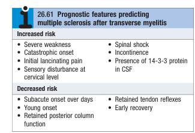

### Neuromyelitis optica

- **Definition** - also known as Devic's disease, refers to the occurence of transverse myelitis and bilateral optic neuritis
- **Epidemiology** - recognised particularly in Asia
- **Clinical features of NMO:**
    - Transverse myelitis
    - Bilateral optic neuritis
- **Ix:**
    - **Neuroimaging** - MRI brain:
        - High-signal regions restricted to periventricular regions (cf MS which can be anywhere)
    - **MRI spine** - lesions longer than 3 segments (unlike shorter lesions of MS)
    - **Serology** - a/w +ve Ab against aquaporin 4
- **Mx:**
    - Immunosuppressives - steroids, azathioprine, cyclophosphamide
    - Plasmapheresis
- **Prognosis** - clinical deficits recover less well than MS

## Paraneoplastic neurological disorders

## Neurodegenerative diseases

### Movement disorders

1.  Idiopathic Parkinson's disease

    - **Definition and terminology:**
      - <u>Parkinsonism</u> - defined as a clinical syndrome characterised by 1) rest tremors, 2) rigidity, 3) a-/ brady-kinesia and 4) loss of postural reflexes
      - <u>Idopathic Parkinson's disease</u> - most common cause of parkinsonism
    - **Epidemiology:**
      - <u>Incidence</u> - 18/100000/y in the UK (but extremely age-dependent)
      - <u>Demographic</u>:
        - Age - increasing incidence w/ age with mean age of onset around 60y (up to 300-500/100000/y after 80y)
        - Sex - male preponderance (M:F = 3:2)
    - **Etiology of parkinsonism:**
      - **Idiopathic Parkinson's disease** - PD accounts for 80% of parkisonisum
      - **Vascular PD** - caused by subclinical stroke involving the BG circuit
      - **Drug-induced parkisonism:**
        - Atypical antipsychotic drugs
        - Metoclopramide, prochlorperazine
        - Sodium valproate
        - Mood stabilisers (e.g. Lithium)
      - **Parkisonian plus syndromes** - Lewy Body Dementia, Multiple system atrophy, Progressive supranuclear palsy, Corticobasal degeneration, Spinocerebellar ataxia

      
      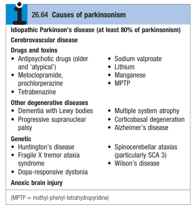
    - **Pathophysiology of parkinsonism:**
      - <u>Accumulation of pathological protein inclusions in dopaminergic cells</u> (Synucleinopathy) - particularly alpha-synuclein protein, resulting i Lewy body formation initially in BG, and subsequently the brainstem and cortex
      - <u>Depletion of pigmented dopaminergic neurons in the substantia niagra</u> - loss of dopaminergic tone accounts for much of the clinical features
    - **Clinical features of PD:**
      - **Pro-dromal Sx** - including hyposmia, constipation and REM motor behavioural disturbance (RBD) may precede development of typical motor features for many years but patient rarely present at this stage
      - **Motor Sx** - characteristically <u>assymetrical</u> even when it progresses:
        - <u>Tremors</u> (80%) - unilateral rest tremor affecting limbs, jaw, chin but not he head
        - <u>Bradykinesia</u> - hallmark difficulty in initiating movement, and an overall reduction in velocity and amplitude of movement
        - <u>Rigidity</u> - constant increase in tone that is irrespective to velocity (cf spasticity), resulting in stopped posture and stiffness
        - <u>Loss of postural reflexes</u> - pathologically manifests early but falls tend not to occur until later
      - **Non-motor symptoms:**
        - <u>Cognitive impairment and dementia</u> (30-80% in disease course) - cognition generally spared in early disease but becomes invariably common and disabiling (early decline in cognition to raise alternative Dx \[e.g. LBD\])
        - <u>Neuropsychiatric manifestations</u>:
          - Mood disorders - e.g. anxiety, depression, apathy
          - Disorders of perception - e.g. hallucinations, psychosis
        - <u>Sleep disturbances</u> - fatigue, insomnia, hypersomnolence
        - <u>Sexual dysfunction</u> - erectile failure, loss of libido, or hypersexuality
    - **Signs in PD:**
      - **General appearance:**
        - <u>Masked facies and Reptillian eyes</u> - expressionless face (hypomimia), with unblinking eyes attributed to bradykinesia
        - <u>Soft, rapid, indistinct speech</u> (dysphonia) - monotomous speech attributed to bradykinesia
        - <u>Stopped posture</u> - flexed posture as a result of rigidity
      - **Gait** - shuffling/ festination gait with difficulty in initiation and turning:
        - <u>Failure of gait ignition</u> - difficulty to initiate gait, especially when getting up from chair due to akinesia
        - <u>Shuffling gait/ festination</u> - rapid, short stride length with tendancy to shorten due to **postural instability**
        - <u>Reduced arm swing</u> - as a result of rigidity and bradykinesia
        - <u>Difficulty in turning</u> - due to loss of postural mechanisms upon turning
      - **Tremor:**
        - <u>Resting tremor</u> (3-4 Hz) - asymetrical, usually in the hand (pill rolling), that by definition is maximal at rest and suppressed by **voluntary movement and posture maintenance**
        - <u>Postural tremor</u> (6-8 Hz) - tremor on out-stretched hands
        - <u>Re-emergent tremor</u> (3-4 Hz) - rest tremor re-emerges after few seconds of stretching arms out
      - **Rigidity** - on testing tone of the upper limb:
        - <u>Cogwheel rigidity</u> - jerky resistance to passive movements as muscle tenses and relaxes, caused by tremors superimposed on rigidity
        - <u>Lead-pipe rigidity</u> - passive movement of an extremity met w/ a constant dead-feeling resistance
      - **Akinesia** (fundamental feature of PD) - slowness of movement w/ fatiguing and decreasing in size of repetitive movement:
        - <u>Finger tapping</u> - slowness and reduced amplitude on finger tapping
        - <u>Hand-opening and closing</u> - slowness and reduced amplitude on hand opening and closing
        - <u>Pronation and supination of forearms</u> - slowness when assessing for Dysdiadokinesia
      - **Postural reflexes** - pull test
      - **Normal findings** - if abnormal, consider other causes:
        - Power, deep tendon reflexes, plantar responses
        - Eye movements
        - Sensation
        - Cerebellar examination
    - **Ix:**
      - **Neuroimaging** (CT/ MRI) - not useful as most are normal (may enable identification of <u>vascular PD</u>)
      - **Functional dopaminergic imaging** (SPECT):
        - Abnormal in early stages
        - Does not differentiate between different degenerative causes

        
        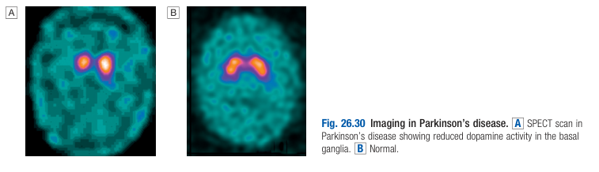
      - **Blood tests:**
        - <u>Serum ceruloplasmin</u> - to exclude Wilson's Disease in young patient
        - <u>Genetic tests</u> - e.g. exclusion of Huntington's or those w/ supciious FHx
    - **Mx:**
      - **Principles of Mx:**
        - <u>General measures</u> - multidisciplinary approach from PT, OT, and Speech to overcome functional limitations
        - <u>Symptomatic Mx of PD</u> - pharmacological therapy (e.g. L-dopa) or neurosurgery (e.g. DBS)
        - <u>Mx of progression of PD</u> - includes Mx of motor fluctuations and other non-motor manifestations (e.g. MCI-dementia)
      - **Drug therapy** - remains syptomatic where no drug is "neuroprotective":
        - **Selection of regimes:**
          - Levodopa
          - Dopamine agonists
          - Anti-cholinergics
          - MAOI-B
          - COMT
          - Amantadines
        - **Initiation of Tx** - no consensus, but initiate Tx when Sx are impacting everyday life: 
        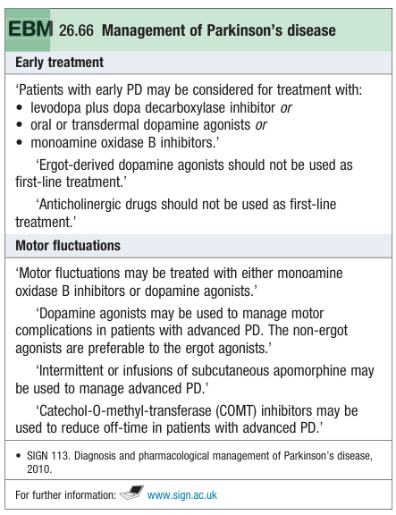
        - **Levodopa** (LD) - typically first-line Tx in combination w/ **dopa decarboxylase inhibitor** (DDI):
          - <u>Selection</u>:
            - Sinemet - LD + carbidopa
            - Maldopar - LD + benserazide
          - <u>Dosing</u> - up to 1000 mg/d
          - <u>MOA</u> - precursor to dopamine:
            - 90% undergo peripheral conversion to dopamine if taken alone (prevented by DDI)
            - 10% reaches the brain
          - <u>Clinical efficacy</u> - only effective for certain motor Sx:
            - Most effective for **akinesia** and **rigidity**
            - Less effective for tremors
            - Almost no effect on postural instability (e.g. festination, freezing), and non-motor Sx
          - <u>S/E</u>:
            - **S/E related to peripheral conversion** - orthostatic hypotension, N/V (offset by domperidone)
            - **S/E related to increased central dopaminergic tone:**
              - Confusions and hallucinations
              - Impulse control disorders
              - Dopamine dysregulation syndrome
              - Motor fluctuations
          - <u>Motor flucuations</u> - caused by progressive loss of dopamine storage capacity in SnG (and may be improved by addition of dopamine agonists)
        - **Dopamine receptor agonist:**
          - <u>Indications</u> - thought to delay LD initiation in young PD to delay motor fluctuations (evidence is accruing to suggest usefulness is short-lasting)
          - <u>Selection</u> - only apomorphine is as effective as LD:
            - **Ergot-derived** (no longer recomended due to cardiotoxicity) - bromocriptine, carbegoline
            - **Non-ergot-derived** - apomorphine, rotigotine
          - <u>S/E</u> - similar to LD but much more severe (esp. N/V, hallucination, and impulse control disorders)
        - **Monoamine oxidase type B inhibitors** (MAOI-B):
          - <u>Selection</u>:
            - Selegiline
            - Rasagiline
          - <u>MOA</u> - inhibition of MAOI-B, which results in breakdown of synaptic dopamine (hence increasing dopamine levels)
          - <u>Clinical efficacy</u> - at most modest, but can be used to control motor fluctuations
          - <u>S/E</u> - very well tolerated
        - **Catechol-O-methyl-transferase inhibitors** (COMT inhibitors) - as adjunct to LD for early wean off:
          - <u>MOA</u> - inhibition of COMT, which is responsible for peripheral conversion of LD to dopamine
          - <u>Selection</u> - available as single tablet w/ each LD dose, or as combined tablets:
            - Entacapone (peripheral conversion; better safety profile)
            - Tolcapone (peripheral and central conversion; risk of severe hepatotoxicity)
          - <u>S/E</u> - hepatotoxicity
        - **Amantadine** (Anti-influenza)
          - <u>MOA</u> - NMDA blockade
          - <u>Clinical efficacy</u> - mainly for those w/ LD-induced dyskinesia
        - **Anticholinergics** (historical interest):
          - <u>Selection</u> - trihexyphenidyl, orphenadrine
          - <u>Clinical efficacy</u> - doubtful (only for tremors)
          - <u>S/E</u> - anticholinergic S/E
      - **Motor fluctuations in PD:**
        - <u>Pathophysiology</u> - caused by progressive loss of dopamine storage capacity by dwindling number of striatoniagral neurons:
          - **Off-phase** - increasing Sx of parkisonism (i.e. end-of-dose deterioration), due to effects wearing off (which can be combated by increasing LD dosing and frequency or COMT inhibitors)
          - **On-phase** - improved mobility but with dyskinesia likely as a S/E of LD
        - <u>Mx</u>:
          - Consider increasing dose frequency or addition of COMT if prolonging off-phase
          - On times may be result of excessive LD dosing
      - **Deep brain stimulation** (DBS) - for refractory tremors or motor fluctuations

2.  Parkinsonian Plus syndrome

    - **Multiple system atrophy:**
      - **Definition** - clinical syndrome characterised by parkisonism, autonomic failure and cerebellar symptoms w/ either parkisonism (MSA-P) or cerebellar features (MSA-C) predominating
      - **Pathophysiology** - synucleinopathy in the BG, cerebellum and motor cortex
      - **Differentiation between MSA-P and IPD:**
        - <u>Cognition</u> - preserved
        - <u>Cerebellar Sx</u> - present
        - <u>Postural istability</u> - early falls are often a clue
        - <u>Tx responsiveness</u> - lack of responsiveness to LD
    - **Progressive supranuclear palsy:**
      - **Definition** - clinical syndrome characterised by symmetrical parkisonism, cognitive impairment, early falls and bulbar symptoms
      - **Pathophysiology** - Tauopathy of the substantia nigra, subthalamic nucleus and <u>midbrain</u> (bulbar and eye Sx)
      - **Differentiation of PSP and IPD:**
        - <u>PD</u> - parkinsonism is symmetrical, with early falls and cognitive impairments
        - <u>Midbrain involvement</u>:
          - Bulbar Sx
          - Characteristic eye movement disorder w/ impairment of up and down gaze (late feature)
        - <u>Tx responsiveness</u> - lack of responsiveness to LD
    - **Corticobasal degeneration:**
      - **Definition** - clinical syndrome characterised by parkinsonism, and abnormal cortical features
      - **Differentiation of CBD and IPD:**
        - <u>Cortical Sx</u>:
          - Dementia
          - Apraxia
          - Alien limb phenomenon (limb moves about and interferes w/ other limb w/o conscious control)
        - <u>Other motor manifestations</u> - myoclonus, dystonia

3.  Other parkinsonian syndromes

### Ataxias

- **Definition** - heterogenous group of inherited and acquired disorders, presenting either with pure ataxia or in association w/ other neurological or non-neurological features
- **DDx of ataxia** - significant proportion of cases remain idiopathic despite investigation:
    - **Inherited ataxia** - inherited disorders in which <u>degenerative changes</u> occur to varying extents in 1) cerebellum, 2) brainstem, 3) pyramidal tracts, 3) spinocerebellar tracts, and 5) optic and peripheral nerve: 
    
    - **Acquired ataxia:** 
    

### Tremor disorders

- **Tremor** - clinical feature of many disease, including:
    - Parkisonism
    - Essential tremor
    - Drug-induced tremors:
        - Dopamine agonists - ergots, rotigotine, apomorphine, pramipexole, ropinirole
        - Asthma medications - beta-agonists (e.g. salbutamol), theophyline
        - Psychiatric medications - tricyclic antidepressants, lithium
        - Anticonvulsants - sodium valproate
        - Other drugs and substances - e.g. thyroxine, alcohol, caffeine, recreational drugs
    - Functional (psychogenic) tremors
    - Thyrotoxicosis

1.  Essential tremors

    - **Definition** - most common cause of tremors with some evidence of dominant pattern of inheritence but no genes have been identified
    - **Epidemiology** - prevalence about 300/100,000 (can present at any age)
    - **Clinical features of essential tremors:**
      - **Tremor** - typically bilateral hand tremor (6-10 Hz) that is rare at rest and typical w/ movement:
        - <u>Site</u> - bilateral hands, ocassionally affecting head and voices
        - <u>Onset</u> - at any age
        - <u>Quality</u> - fine (8-10 Hx)
        - <u>Provocation</u> - w/ movement
        - <u>Relieving factors</u> - 50% patients improve w/ small amounts of alcohol, beta-blockers and primidone
        - <u>Timing</u> - only during movements
    - **Mx:**
      - Beta-blockers and primidone are sometimes helpful
      - DBS of thalamus is an effective treatment in severe cases

### Dystonia

- **Definition** - focal increase in tone affecting muscle in the links and trunk, resulting in abnormal posturing
- **DDx of dystonia:**
    - <u>Secondary damage to the brain</u> - e.g. traumatic brain injury, old stroke
    - <u>Neurological conditions</u> - PD, Wilson's disease
    - <u>Primary dystonia</u> - genetically implicated where often generalised in children, and focal in adult onset:
        - Torticollis (wry neck)
        - Blepharospasm (repetitive blinking)
        - Task-specific spasms (e.g. writer's cramp, muscician's dystonia)
- **Mx:**
    - Botulinum toxin injections
    - DBS

### Hemifacial spasm

- **Definition** - suspected degenerative disorder a/w intermittent twitching around one eye and spreading ipsilaterally to other facial muscles
- **Epidemiology** - typically presents after middle age
- **Etio-pathophysiology of hemifacial spasm** - idiopathic:
    - <u>Proposed irritation of 7th nerve</u> - aberrant arterial loop just outside of pons irritating 7th nerve (underlies microvascular decompression for Mx)
- **Clinical features** - intermittent twitching of eye and other facial muscles exacerbated by talking, eating or stress
- **DDx of hemifacial spasm:**
    - Structural brain lesions
    - MS
- **Mx:**
    - Botulinum toxin injections
    - Microvascular decompression for severe cases

### Motor neuron disease

- **Definition** - neurodegenerative condition caused by <u>loss of UMN and LMN of spinal cord, cranial nerve nuclei and motor cortex</u>
- **Epidemiology:**
    - <u>Prevalence</u> - 7/100,000
    - <u>Incidence</u> - 2/100,000/y
    - <u>Demographic</u>:
        - **Age:**
            - Usually presents after 50y (10% present before 45y, but very uncommon after 30y)
            - Average age of onset around 65y
        - **Sex** - male preponderanece
- **Genetic associations** - most are soradic and only 5-10% are familial:
    - Superoxide dismutase (SOD1) gene - accounts for 20%
    - C9ORF72 gene expanded repeat sequences on chromosome 9 - also a/w frontotemporal dementia
- **Forms of MND** - all will eventually progress into ALS:
    - <u>Amyotrophic lateral sclerosis</u> (ALS) - combination of UMN and LMN signs
    - <u>Progressive muscular atrophy</u> - pure LMN lesions
    - <u>Progressive lateral sclerosis</u> - pure UMN lesions
    - <u>Progressive bulbar palsy</u> - early bulbar Sx presenting with dysarthria, and dysphagia
- **Clinical features of MND** - Sx begin focally, but spread gradually and is relentlessly progressive; 50% die within 2y of Dx:
    - **Limb weakness** - typically presenting focally with limb onset (e.g. <u>foot drop</u>), associated w/ cramps and ocassionally fasciculations
    - **Bulbar Sx** - ocassionally presenting with dysphagia or dysarthria with tongue signs
    - **Respiratory failure** - T2RF rarely a presenting symptom but is a <u>common terminal event</u>
    - **Cognitive impairment** - up to 50% will have executive impairment on formal testing and 10% may develop frontal temporal dementia (10% FTD patients will subseuqne tdevelop ALS within a few years of dementia onset)
    - **Absence of other localising Sx:**
        - <u>Sensory Sx</u> - absence of numbness of parasthesia
        - <u>Autonomic Sx</u> - absence of cardiovascular, GI, genitourinary Sx
        - <u>Visual Sx</u> - absence of vision loss or visual field defects
- **Signs of MND** - classically combination of UMN and LMN signs (e.g. brisk reflex in a wasted, fasciculating muscle): 
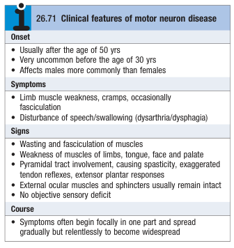
    - <u>Cranial nerves</u> - may show weakness of tongue, palate and fae, but EOM usually intact
    - <u>Sensory system</u> - no objective sensory deficit
    - <u>Motor system</u> - dependent on involvement: 
    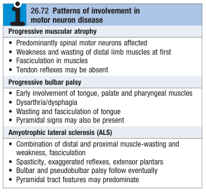
- **Ix** - r/o more common treatable causes (e.g. immune-mediated multifocal motor neuropathy, radiculopathy):
    - **Blood tests** - all normal except for mildly <u>raised CK</u>
    - **Electrophysiological testing:**
        - <u>Nerve conduction studies</u> - usually normal but reduction of amplitude of motor action potentials may be present due to axonal loss
        - <u>Electromyography</u> - diagnostic, showing typical features **denervation and re-innervation**
    - **Neuroimaging** - r/o focal lesions suggesting alternative Dx
    - **LP** - typically not required
    - **DNA testing** - for genetic diagnosis
- **Mx:**
    - **Principles of Mx:**
        - <u>Multidisciplinary approach</u> - neurologist, respiratory physicians, palliative care teams, and allied health (PT, OT, speech therapy, dietitians)
        - <u>Pharmacological therapy</u> - riluzole licensed for ALS but has modest effect
        - <u>Ventilatory or feeding support</u> - non-invasive ventilatory support or percutaneous gastrostomy may improve QoL of selected patients

    
    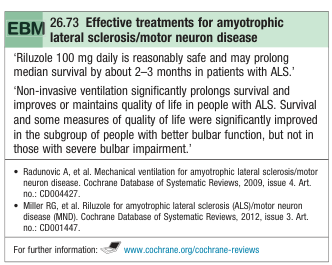

### Spinal muscular atrophy

- **Definition** - geneitically determined disorder affecting spinal and cranial LMN
- **Clinical features** - progression is slow and prognosis is better than MND:
    - Muscle weakness
    - Proximal and distal muscle wasting
    - Fasciculations

## Infections of the nervous system

- **Classification of CNS infections:**
    - <u>By site</u> - meningitis, encephalitis, brain abscess, spinal cord
    - <u>By causative organism</u> - virus, bacterium, fungal, parasite
    - <u>By chronicity</u> - acute vs chronic
- **Classification of CNS infections by site:**
    - Infection of the meninges - acute meningitis, chronic meningitis
    - Infection of the brain parenchyma - viral encephalitis (parenchymal viral infection), brain abscesses (parenchymal bacterial infection)
- **Classification of CNS infections by causative organisms:** 
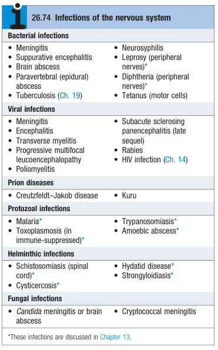

### Meningitis

- **Definition** - inflammation of the meninges by infetive or non-infectiva cause:
- **Etiological agent of infective meningitis:**
    - <u>Bacterial meningitis</u> - age-dependent (see below)
    - <u>Viral meningitis</u> (most common):
        - Enteroviruses (echo, Coxackie, polio)
        - Herpes virus - herpes simplex virus (type 1 or 2), varicella zoster virus
        - EBV
        - Mumps
        - HIV
        - Influenza
    - <u>Fungal meningitis</u>:
        - Cryptococcus neoformans
        - Candida
        - Histoplasma
- **Etiological agent of bacterial meningitis** - dependent on age of onset:
    - <u>Neonate</u> - G- bacilli (Proteus spp, E. coli), GBS
    - <u>Pre-school children</u> - H. influenzae, N. meiningitidis, S. pneumoniae
    - <u>Older children and adults</u> - N. meningitidis, S. pneumoniae, S. aureus, H. influenzae, Listeria

  
  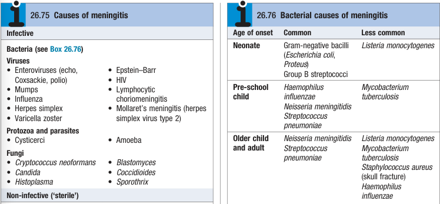
- **Etiology of non-infective meningitis** (sterile meningitis):
    - <u>Malignancy</u> - leukaemia, lymphoma, breast carcinoma, bronchial carcinoma
    - <u>Inflammatory disease</u> - SLE, Behcet's disease, Sarcoidosis
- **Pathophysiology of bacterial meningitis:**
    - **Haematogenous spread of inciting bacteria to subarachnoid space** - inciting bacteria (e.g. Neisseria meningitidis, Streptococcus pneumoniae, and Haemophilus influenzae) colonizes the nasopharynx and subsequently spreads to subarachnoid space haematogenously by means of virulence factors
    - **Infection stimulates an immune response** - triggers inflammation, causing the congestion of the pia-arachnoid membrane and infiltration by inflammmatory cells reorganising into **pus** and **adhesions**
    - **Physiological sequelae of inflammation** - affects local circulation and neurovascular supply:
        - <u>Damage to cranial nerves</u> - typically at the base of the brain (hearing loss is a common complication)
        - <u>Obstruction of CSF flow</u> - hydrocephalus and raised ICP, reduced GC
        - <u>Obliterative endarteritis of leptomeningeal arteries</u> - secondary cerebral infarction
- **Clinical features of meningitis** - triad of pyrexia, headache, and meningism:
    - **Pyrexia** - high fever due to underlying infection
    - **Headache** - caused by meningeal irritation, and potentially due to raised ICP
    - **Meningism** - constellation of S/S (e.g. headache, photophobia, neckstiffness) a/w meningeal irritation, that, in presence of fever is suggestive of infective meningitis (can occur in SAH)
    - **Additional features:**
        - <u>Altered consciousness and reduced GC</u> - patient may become drowsy, agitated, and subsequently comatosed as a result of **raised ICP** or encephalitis
        - <u>Focal neurological S/S</u>
        - <u>Seizures</u> - from acute brain injury
    - **Clinical features of meningococcal septicaemia** - 90% of meningococcal meningitis will have \>= 2 of the following, including fever, neck stiffness, altered consciousness, rash:
        - <u>Meningitis</u> - triad of fever, headache, and meningism as above
        - <u>Rash</u> - classically non-blanchable morbilliform, petechial or purpuric rash
        - <u>Sepsis</u> - may present w/ septic shock, pre-renal AKI, DIC, peripheral gangrene, arthritis or pericarditis

    
    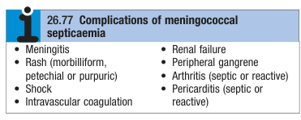
    - **Clinical features of pneumococcal and haemophilus infections** - a/w concurrent respiratory tract infections:
        - <u>Pneumonia</u> - particularly in older patients, alcoholics and those w/ splenectomy performed
        - <u>Otitis media</u> - associated w/ both pneumococcal and haemophilus infections
- **Signs of meningitis:**
    - <u>Assessment of vitals and primary assessment</u>:
        - Septic picture - high fever, tachypnoea, tachycardia, hypotension, warm/ cool peripheries, bounding pulse
        - Disability - may be unable to protect airway (see below)
        - Exposure - assessment for presence of **rash**
    - <u>Assessment of consciousness</u> - AVPU score or GCS revealing reduced consciousness suggests that underlying pathology is causing **raised intracranial pressure**
    - <u>Signs of meningeal irritation</u>:
        - **Kernig's sign** - extension at the knee with hip flexed causes spasms in the hamstring muscles
        - **Brudzinski's sign** - passive flexion of neck causes flexion at both hips and knees
    - <u>Neurological examination</u> - focal neurological deficits are rare in viral meningitis but may be present in complicated bacterial meningitis
- **Ix:**
    - **Routine bloods** - CBC, LRFT, Clotting profile, inflammatory markers, ABG, BG, lactate:
        - <u>CBC w/ differentials</u> - leukocytosis or leukopenia
        - <u>LRFT</u> - baseline organ dysfunction (Albumin marker of severity for certain infectioons, e.g. pneumonia)
        - <u>Clotting profile</u> - identify DIC (C/I for LP)
        - <u>Inflammatory markers</u> (CRP, ESR) - non-specifically elevated
        - <u>Lactate</u> - marker of sepsis and shock
        - <u>BG</u> - for pairing w/ CSF analysis
        - +/- <u>ABG</u> - hypoxaemia or hypercapnia
    - **Urinalysis** - dipstick for glucose, protein, blood, WBC, and bacteria
    - **Neuroimaging** - indicated for all patients requiring LP:
        - **Non-contrast CT-brain** - to r/o mass lesions (e.g. neoplastic lesions, brain abscess) before lumbar puncture (esp. if focal neurological deficits or impaired consciousness)
    - **Microbiology** - blood culture, urine culture (must be obtained prior to initiation of ABx)
    - **Lumbar puncture** (diagnostic) - mandatory unless there are C/I:
        - **C/I:**
            - <u>Risk of local haemorrhage</u> - thrombocytopenia, DIC, anti-coagulated patients (may be performed if low-dose heparin or aspirin)
            - <u>Risk of coning</u> - clinical suspicion of SOL, clinical evidence of raised ICP (e.g. papilloedema), decreased GC, focal neurological signs, seizures
        - **Caution** - perform neuroimaging to r/o mass lesions
        - **Diagnostic findings:**
            - <u>Viral meningitis</u> - cloudy appearance; lymphocytic pleocytosis; normal glucose and protein (protein may be raised); -ve G stain and cultures (r/o use of ABx)
            - <u>Bacterial meningitis</u> - cloudy appearance; neutrophilic pleocytosis; glucose reduced and protein elevated; +ve microbiology

      
      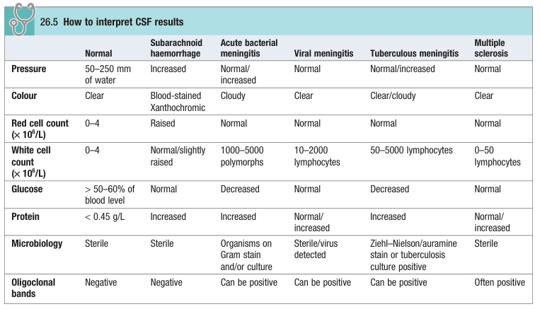
    - **Other Ix as indicated** - identify other primary infections:
        - **Imaging:**
            - <u>CXR</u> - pneumonia
            - <u>Contrast CT/ MRI</u> - abscess, meningeal enhancement, tuberculomas (rim enhancement)
            - <u>Echo</u> - suspecting IE
        - **Microbiology:**
            - <u>NPA</u> - for respiratory viruses
            - <u>Sputum</u> - C/ST +/- AFB
            - <u>Bilster fluids</u> - viral studies (e.g. PCR)
        - **EEG** - generalised slow waves (encephalopathic changes) or periodic lateralising epileptiform discharges (e.g. HSV encephalitis)
- **Dx** - requires LP
- **Mx:**
    - **Principles of Mx** - dependent on suspected etiology:
        - **General measures:**
            - Symptomatic Tx
            - ICP control
            - Resuscitation if in shock
        - **Specific Tx:**
            - <u>Viral meningitis</u> - benign and self-limiting course (few days) and no-specific Tx (symptomatic relief in quiet environment)
            - <u>Bacterial meningitis</u> - urgent initiation of broad-spectrum ABx at meningitic dose as highly fatal (80% mortality rate if untreated), +/- adjunctive dexamethasone:
        - **Contact tracing** - chemoprophylaxis following meningococal exposure
    - **ABx therapy** - <u>IV empirical broad-spectrum ABx at meningitic dose</u> based on most likely organism:
        - **Empirical regimen** - initiated when cause still unknown: 
        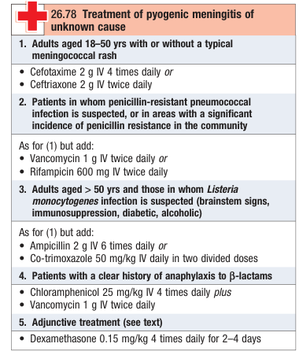
        - **Subsequent regimen** - tailored based on ABx resistance testing: 
        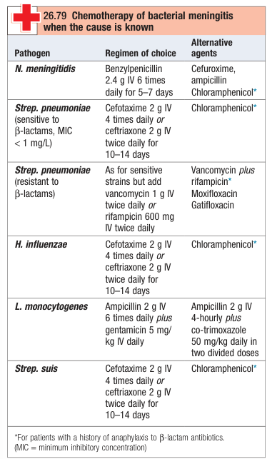
    - **Adjunctive dexamethasone:**
        - <u>Dosing</u> - 0.15 mg/kg q8h for 2-4d
        - <u>Evidence</u> - effective in developed countries w/ low penicillin resistance:
            - Reduced morbidity (hearing loss and neurologial sequelae)
            - No effects on overall mortality

      
      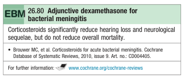
    - **Chemoprophylaxis following meingococcal exposure:**
        - <u>Indications</u>: 
        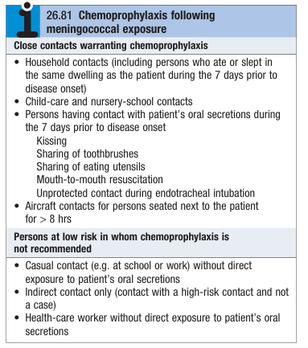
            - Household contacts in past 7d
            - Contact via oral secretions in past 7d
            - Aircraft contacts for person seated next to patient for \> 8h
            - Child care or nursery-school contacts in past 7d
        - <u>Regimen</u> - 2d oral rifampicin or single dose ciprofloxacin
- **Prognosis** - 80% mortality rate if untreated bacterial meningitis:
    - <u>Poor prognostic factors</u>:
        - Meningococcal disease
        - Presentation w/ septicaemia rather than meningitis
        - Hypotensive shock
        - Rapidly developing rash
        - Haemorrhagic diathesis
        - Multisystem failure
        - Age \> 60y

### Parenchymal viral infections

1.  Viral encephalitis

    - **Definition** - infection of the cerebral parenchyma by viruses
    - **Etiology of viral encephalitis:**
      - <u>Herpesviridae</u> - HSV-2, VZV
      - <u>Arboviruses</u> - e.g. japanese encephalopathy
    - **Pathophysiology of viral encephalitis:**
      - <u>Viral infection of the brain parenchyma</u> - viruses may reach the brain via the olfactory nerves
      - **Inflammatory response of brain parenchyma** - distribution of lesions varies for type of viruses, but can essentially affect cortex, white matter, subcortical nuclei, and brainstem:
        - <u>Herpes simplex encephalitis</u> - temporal lobe is primary affected
        - <u>Cytomegalovirus</u> - area adjacent to the ventricles typically affected (ventriculitis)
      - **Effects of inflammatory response:**
        - Neuronal degeneration and diffuse glial proliferation
        - Cerebral oedema
    - **Clinical features of viral encephalitis** - acute onset of Sx:
      - <u>Fever</u> - pyrexia points towards an infection
      - <u>Headache</u> - attributable to viral infection, meningeal irritation +/- cerebral oedema
      - <u>Focal neurological Sx</u> - e.g. aphasia, hemiplegia and visual field defects and may mimick stroke
      - <u>Seizures</u> - occurs as a result of acute brain injury
      - <u>Disturbed consciousness</u> - ranges from drowsiness to deep coma
    - **Ix:**
      - **CT brain** - may show hypodense lesions in the affected area (mainly to r/o mass lesion resulting in focal neurological Sx)
      - **LP** (normal in 10%) - performed once imaging has excluded a mass lesion:
        - <u>WBC and differentials</u> - lymphocytic pleocytosis (although PMN may dominate in early stages or in selected viral infections \[e.g. West Nile Virus\])
        - <u>Protein</u> - elevated
        - <u>Glucose</u> - normal
        - <u>Virological Ix</u> - PCR for viral DNA for microbiological Dx
      - **EEG** - characteristically abnormal (esp. periodic slow waves in temporal lobes for HSV)
    - **Mx:**
      - **Principles of Mx:**
        - <u>General measures</u>:
          - Anticonvulsants may be needed if presents w/ seizures
          - Dexamethasone may be needed if presents w/ raised ICP
        - <u>Empirical antiviral therapy</u> - initiate acyclovir early for all patients suspected to suffer from viral encephalitis
      - **Empirical IV aciclovir** - initiated for all patients:
        - <u>Dosing</u> - 10mg/kg IV tid for 2-3 weeks
        - <u>Efficacy</u> - reduces mortality from 70% to 10%

2.  Brainstem encephalitis

    - **Clinical features of brainstem encephalitis:**
      - Ataxia
      - Dysarthria
      - Diplopia
      - Other CN palsies
    - **Etiology:**
      - Viral encephalitis
      - Listeria monocytogenes

3.  Rabies

    - **Definition** - CNS infection caused by rhabdovirus that is most commonly derrived dog bites, and follows a predictable, fatal clinical course
    - **Route of transmission** - commonly aquired from dogs or bats, but theoretically any mammal:
      - Saliva through bites (abraisions) or licks (intact mucous membrane)
    - **Incubation period of rhabdovirus:**
      - Minimum of 9 days to many months
      - Usually between 4-8 weeks
      - Severe bites to H&N region a/w shorter incubation times
    - **Clinical features of rabies** - progression of Sx is remarkably constant:
      - **Fever** - usually at onset
      - **Parasthesia over bite** - usually first Sx to occur along the fever
      - **Progression of neuropsychiatric Sx** - intervals of lucidity but patient remains anxious:
        - <u>Anxiety</u> - progressively becomes anxious from Sx onset to death
        - <u>Hydrophobia</u> - characteristic painful contractions of diaphragm and other inspiratory muscles provoked by attempts at drinking water
        - <u>Delerium and psychiatric manifestations</u> - dellusions, hallucinations, often accompanied by **manic attempts at spreading the virus** through spitting or biting
      - **Brainstem Sx** - cranial nerve lesions develop
      - **Terminal hyperpyrexia** - typically near death
    - **Ix** - IMF to detect Ag on corneal impression smears or skin Bx
    - **Mx:**
      - **Principles of Mx:**
        - <u>Prophylaxis</u> - includes pre-exposure and post-exposure prophylaxis
        - <u>Mx of established disease</u> - supportive measures including ICU care w/ heavy sedation (very little survive with established rabies)
      - **Post-exposure prophylaxis** - rabies can typically be prevented if Tx started within 1-2d of biting, although delayed Tx is still of value:
        - **General wound care**:
          - Clean wound thoroughly preferably w/ quaternary ammonium detergent or soap
          - Excision of the damaged tissue with wound unsutured
        - **Antirabies antiserum** - human rabies immunoglobulin:
          - <u>Administration</u> - 20U/kg split between site of bite, and at another injection site
          - <u>S/E</u> - hypersensitivity reaction (including anaphylaxis)
        - **Vaccine** - human diploid cell strain vaccine:
          - <u>Administration</u> - IM 1.0 mg on days 0, 3, 7, 14, 30 and 90

4.  Poliomyelitis

### Parenchymal bacterial infections

1.  Cerebral abscess

    - **Definition** - suppurative infection of the cerebral parenchyma acquired from a different foci, subsequently progression into abscess formation
    - **Pathophysiology of cerebral abscess:**
      - **Access of bacterial into cerebral substances** - the source of infection <u>informs the likely pathogens</u>, which guides Tx (see below)
      - **Local suppurative process** - initial infection results in a local suppurative process and pus formation, leading to an inflammatory response
      - **Organisation into abscess** - local damage results in <u>activation of astrocytes and gliossis to contain the infection</u>, which results in loculation of pus within the wall of gliosis, subsequently resulting in a tough abscess
    - **Source of infection:** 
    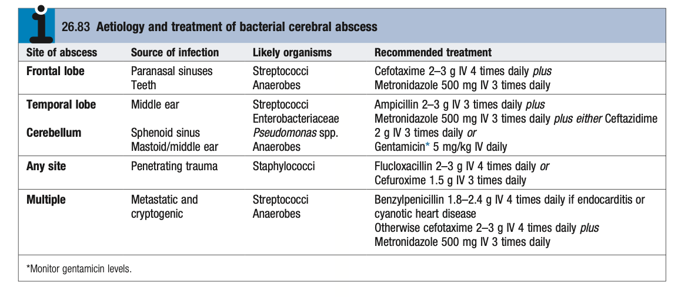
    - **Clinical features of cerebral abscess:**
      - <u>Fever</u> - may present acutely as fever suggestive an infective process
      - <u>Features of raised ICP</u> - may present as headache, HV, meningism, and drowsiness
      - <u>Focal neurological S/S</u> - localising neurological S/S may present acutely, but may also present over days or weeks w/ no evidence of infection (distinction from cerebral tumour impossible on clinical grounds)
      - <u>Seizures</u> - progression into epilepsy is frequent and is often resistant to Tx
    - **Ix:**
      - **Routine bloods** - CBC, ESR:
        - <u>CBC</u> - shows leukocytosis reflecting active infection
        - <u>ESR</u> - non-specifically elevated
      - **CT** - diagnostic and is often indicated w/ features of raised ICP and focal neurological S/S where LP is contraindicated:
        - Hypodense lesion with rim enhancement
        - Associated surrounding hypodense cerebral (vasogenic) oedema
        - Midline shift present if sizable abscess

        
        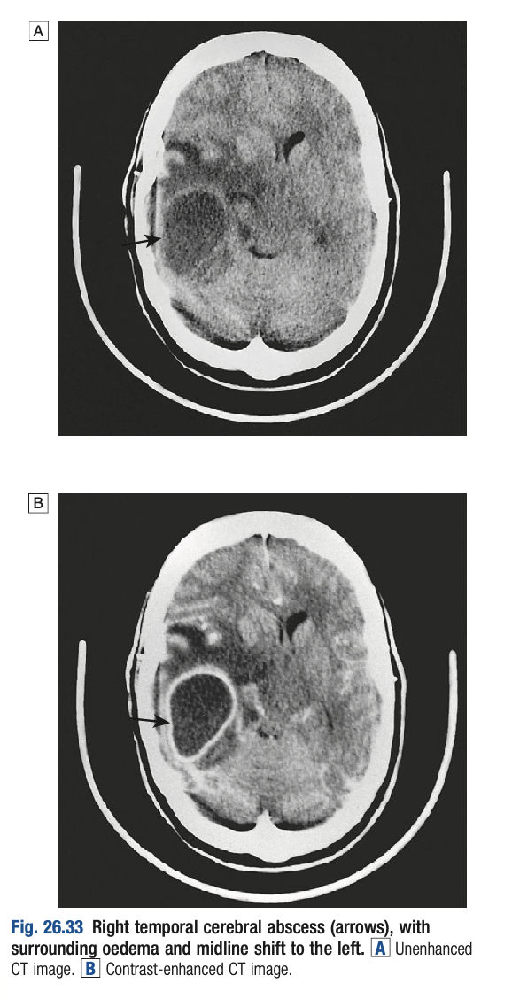
      - **LP** - potentially hazardous in presence of raised ICP and may be contraindicated
    - **Mx:**
      - **Principles of Mx:**
        - <u>ABx therapy</u> - source of infection guides choice of ABx (vancomycin added in neurosurgical patients)
        - <u>Surgical Mx</u> - burr-hole aspiration or excision and drainage of abscess may be necessary\*\*\*\* Subdural empyema

2.  Spinal epidural abscess

3.  Lyme disease

4.  Neurosyphillis

### Diseases caused by bacterial toxins

### Transmissible spongiform encephalopathies

## Intracranial mass lesions and raised intracranial pressure

### Raised intracranial pressure

- **Definition** - raised intracranial pressure as defined by pressure relative to atmospheric pressure measured at external acoustic meatus
- **Etiology of raised ICP:**
    - **Space-occupying lesion:**
        - <u>Intracranial haemorrhage</u> - extradural haematoma, subdural haematoma, intracerebral haemorrhage
        - <u>Cerebral tumours</u> - particularly posterior fossa lesions or high-grade gliomas
        - <u>Infective causes</u> - brain abscesses, tuberculoma, cysticercosis, hydatid cyst
    - **Hydrocephalus** - communicating vs non-communicating hydrocephalus
    - **Cerebral oedema:**
        - <u>Local oedema</u> - post-cerebral infarction (cytotoxic oedema), local tumour (vasogenic oedema)
        - <u>Diffuse oedema</u> - meningoencephalitis, trauma, SAH, metabolic (e.g. hypoNa, HE)
    - **Hyperaemia** - e.g. idiopathic intracranial HTN
    - **Venous congestion** - cerebral venous thrombosis, trauma (e.g. depressed fractures overlying sinuses)
- **Clinical features of raised ICP:**
    - <u>Headaches</u> - classically worse on lying, straining, and in the morning
    - <u>Nausea and vomiting</u> - direct stimulation of emetic centre, and transiently causes relieve of headaches due to transient hyperventilation
    - <u>Diplopia and visual impairment</u> - arising most commonly from CN VI palsy, CN III palsy
    - <u>Decreasing states of consciousness</u> - late feature typically reflecting herniation syndromes
    - <u>Papilloedema</u> - late clinical sign on fundoscopy which can be documented by decrease in VA in both eyes
    - <u>Cushing's triad</u> (Bradycardia, HTN, respiratory depression) - late feature caused by brainstem compression
- **Mx of raised ICP:**
    - <u>Supportive measures</u>:
        - Head elevation
        - Blood pressure control
        - Osmotherapy - e.g. mannitol and diuretics
    - <u>Neurosurgical Mx</u> - relieving the underlying cause (e.g. surgical decompression of mass lesson, shunt procedure for hydrocephalus, steroids for vasogenic oedema)

### Brain tumours

- **Definition** - heterogeneous collection of neoplasms arising from the brain tissue or meninges, and vary from benign to highly malignant
- **Classification of brain tumours:**
    - **Benign primary brain tumours:**
        - <u>Meningioma</u> (most common primary brain tumour) - arising from the meninges, particularly in the cortical dura, parasagittal, sphenoid ridge, suprasellar, or olfactory groove
        - <u>Neurofibroma</u> - tumour of the peripheral or central nerve
        - <u>Craniopharyngioma</u> - rare benign tumour manifesting as a suprasellar mass
        - <u>Pituitary adenoma</u> - benign tumour of the pituitary glands manifesting as sellar mass and hypopituitarism (+/- hormone excess)
        - <u>Others</u> - e.g. pineal tumours, colloid cysts
    - **Malignant brain tumours** - primary malignant tumours are rare accounting of 1% of all brain tumours:
        - <u>Secondary metastasis</u> (much more common) - intracranial metastasis complicating about 20% of extracranial malignancies, with higher rates with primaries in the **bronchus**, **breast**, and **GI tract**
        - <u>Primary malignant brain tumour</u> - rare malignancies with different histological subtype (see below)

  
  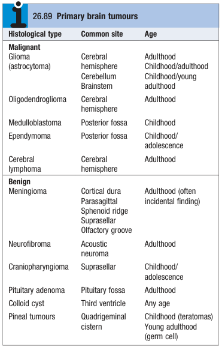
- **Common sites of intracranial metastasis for extracranial malignancies** - may be multifocal:
    - White matter of cerebral hemispheres
    - White matter of cerebellar hemispheres
    - Diffuse leptomeningeal metastasis (poor prognosis)
- **Principles of clinical presentation of brain tumours** - dependent on <u>rate of growth</u>:
    - <u>High grade tumours</u> (WHO G3-4) - typically presents w/ short 4-6 week Hx of features suggestive of **raised ICP** (e.g. headache and N/V)
    - <u>Low grade tumours</u> - slowly progressive and ICP is well-compensated, but may present w/ **focal neurological deficits** depending on site of tumour
- **Clinical features of brain tumours:**
    - <u>Focal neurological S/S</u> - dependent on the site of tumour, and are typically more marked in indolent presentation
    - <u>Headache and N/V</u> - underlying raised ICP especially in the setting of aggressive tumours
    - <u>Seizures</u> - focal orgeneralised seizures are a common presenting Sx
    - WHO histological grade
- **Ix:**
    - **Neuroimaging** - contrast-enhanced CT or MRI brain:
        - <u>Contrast enhancement</u> - a/w metastatic tumours (search for primary via a malignancys creen)
        - <u>Surrounding hypodensity on CT</u> - due to vasogenic oedema

    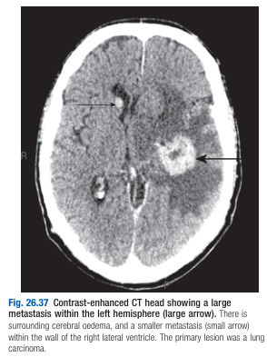 
    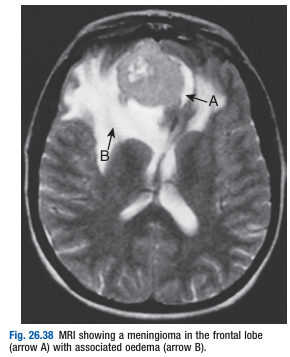
    - **Neurosurgical Bx** - needed for histological Dx
- **Mx:**
    - **Principles of Mx:**
        - **Decision of Tx** - 1) Decision to Tx, and 2) Intent of Tx:
            - Low-grade asymptomatic tumours (WHO G1-2) may not require active Tx and <u>watchful waiting after Bx</u> is often appropriate
            - Decision whether Tx with curative intent is to be pursued, especially in the setting of <u>elderly w/ intracranial metastasis</u> or high grade primary brain tumour, where <u>palliative care</u> (w/ steroid therapy) is often acceptable
        - **Supportive Tx** - oral (or IV if raied ICP) dexamethasone is initiated to reduce vasogenic oedema
        - **Dx and Tx of underlying cause** - e.g. some pituitary tumours (e.g. prolactiomas) may be treated by medical therapy
        - **Multi-modal Tx** - mixture of surgery, chemotherapy and radiotherapy (+/- targeted therapy for certain primaries) plays a role in Mx of brain tumours
    - **Neurosurgery** - maximal safe ressection is the rule:
        - <u>Extent of resection</u> - maximal safe ressection is the rule:
            - Complete ressection may be offered for certain benign tumours such as meningiomas, acoustic neuromas and pituitary adenomas
            - Partial resection ('debulking') may only be possible if it occurs in key areas (e.g. motor strip), 2) difficult anatomy (e.g. sphenoid ridge), or 3) malignant disease w/ infiltrative growth
        - <u>Clinical efficacy</u>:
            - Alleviating Sx caused by raised ICP
            - Increasing evidence that extent of surgical excision may have positive influence on survival (lacks quality evidence on RCTs)
    - **Chemotherapy and radiotherapy** - often as to control CNS disease and potentially extend survival
- **Prognosis** - variable:
    - <u>Overal 5y survival</u> - around 14% in adults
    - <u>Poor prognostic factors</u>:
        - Tumour type
        - Tumour grade
        - Tumour location (more prognostic than size)
        - Advancing age
        - Deteriorating functional status (ECOG)

1.  Acoustic neuroma

    - **Definition** - a benign tumour of Schwann cells of the 8th cranial nerve, which may arise in isolation or as part of NF2
    - **Epidemiology:**
      - <u>Demographic</u>:
        - Age - arises in the 3rd decade of life
        - Sex - slight female preponderance
    - **Site of tumour** - accounts for 80-90% of tumours of the cerebropontine angle:
      - On the vestibular division
      - Near the nerve's entry point into the medulla, or arises in the internal acoustic meatus
    - **Clinical features of acoustic neuroma:**
      - <u>Unilateral hearing loss</u> - classically presents w/ progressive unilateral SNHL, occasionally a/w **tinnitus**
      - <u>Vertigo</u> - rare presentation despite arising from vestibular division, as slow growth enables compensatory brainstem mechanisms to develop
      - <u>Incoordination or ataxia</u> - incoordination of the ipsilateral limbs due to progressive enlargement leading to distortion of the brainstem and/or ipsilateral peduncle
      - <u>Raised ICP</u> - headache, N/V due to hydrocephalus due to obstruction of 4th ventricle
      - <u>Facial weakness</u> - rare presenting Sx and is more a/w a complication after surgical resection
    - **Ix** - MRI is Ix of choice: 
    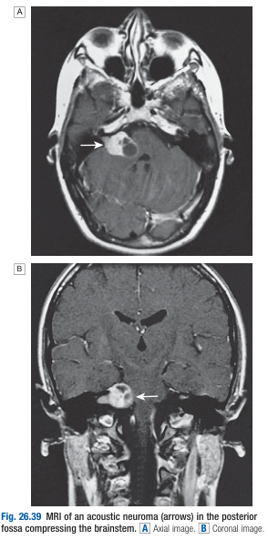
    - **Mx:**
      - **Principles of Mx:**
        - <u>Surgical resection</u> - often complete in many tumours (may complicate w/ deafness and facial weakness)
        - <u>Stereotactic radiosurgery</u> - selected lesions

2.  Neurofibromatosis

    - **Definition and terminology** - two clinically and genetically separated autosomal dominant conditions:
      - <u>Neurofibromatosis 1</u> - caused by mutation of NF1 gene of chromosome 17 (50% de novo) characterised by neurofibromas and cutaneous involvement
      - <u>Neurofibromatosis 2</u> - caused by mutation of NF2 gene of chromosome 22 characterised by schwanomas
    - **Epidemiology** - NF1 is more common than NF2:
      - <u>Prevalence of NF1</u> - 20-50/100,000
      - <u>Prevalence of NF2</u> - 1.5/100,000
    - **Clinical features of NF1 and NF2:** 
    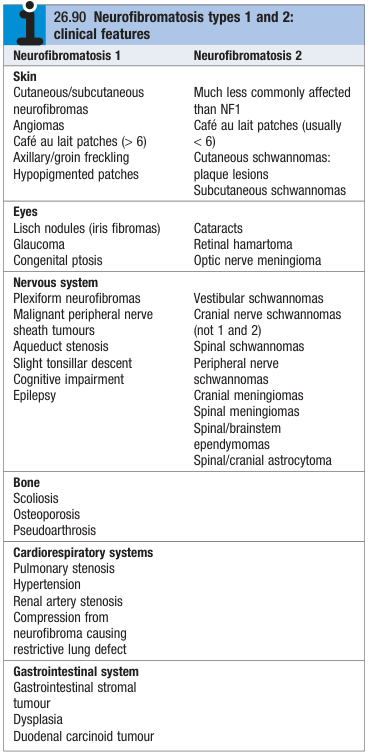
    - **Malignant potential of neurofibromas and schwanommas:**
      - NF1 neurofibromas can undergo malignant change
      - NF2 schwanommas rarely undergo malignant change

3.  Von Hippel-Lindau disease

    - **Definition** - rare autosomal dominant cancer predisposition syndrome a/w tumour formation of the kidneys, adrenal glands, CNS, eye, inner ear, epididymis and pancreas which may undergo malignant transformation
    - **Genetics** - mutation of VHL tumour suppressor gene in chromosome 3 (AD)

### Paraneoplastic neurological disease

### Hydrocephalus

### Head injury

## Disorders of cerebellar function

## Disorders of the spine and spinal cord

### Cervical spondylosis

1.  Cervical radiculopathy

2.  Cervical myelopathy

    - **Definition** - narrowing of the cervical canal due to various disease mechanism
    - **Clinical features of cervical myelopathy** - often insidious and <u>painless</u> at onset:
      - **Features of upper motor neuron manifestations** - typically develop over the legs before the arms:
        - <u>Spasticity</u> - typically manifestations in abnormal gait
      - **Features of DCML manifestations:**
        - <u>Reduced proprioception</u> - results in clumsiness/ reduced dexterity of the hands, as well as an unsteady gait
        - <u>Reduced fine touch</u> - parasthesia and numbness over the UL and involvement is related to concurrent nerve root compression (rarely LL)
      - **Features of sphincteric disturbances** - disturbances in micturation ande defacation are very late features
    - **Mx:**
      - <u>Anterior approach</u> - anterior discectomy
      - <u>Posterior approach</u> - laminectomy

### Lumbar spondylosis

1.  Lumbar disc herniation

2.  Lumbar canal stenosis

### Spinal cord compression

- **Definition** - neurological emergency caused by various pathophysiologies, where initial injury is reversible, but severely damaged neurons do not recover
- **Etiology of spinal cord compression:**
    - <u>Vertebral</u> (80%):
        - Traumatic - traumatic spinal cord injury
        - Degenerative - IV disc prolapse
        - Neoplastic - metastasis (prostate, breast, lungs), myeloma
        - Infective - spondylodisciitis, TB
    - <u>Intradural extramedullary</u> (15%):
        - Neoplastic - meningioma, neurofibroma, ependymoma, lymphoma, leukaemia, metastasisa
        - Infective - epidural abscess
    - <u>Intradural intramedullary</u> (5%):
        - Neoplastic - glioma, ependymoma, metastasis
- **Clinical features of spinal cord compression:**
    - **Clinical course** - acute if a result of trauma, metastasis or arterial occlusion, otherwise subacute over weeks
    - **Principles of onset of clinical features** - pain and sensory impairment occur early, followed by weakness, and sphincter dysfunction
    - **Symptoms of spinal cord compression:**
        - **Pain and tenderness to percussion** - tenderness elicited by palpation or percussion over spine to estimate the level of pathology, aggravated by coughing, sneezing or straining
        - **Sensory deficit** - numbness or parasthesia over limbs, especially of LL, spreading proximally and often to a spinal level
        - **Weakness** - spastic type weakness in a paraplegic pattern
        - **Sphincter dysfunction** - initially urgency or hesitency durinv voiding, eventually leading to AROU
    - **Pattern of neurological dysfunction** - dependent on site of lesion:
        - <u>Above C5</u> - UL and LL completely affected:
            - Sensory deficits - over all 4 limbs
            - Motor deficits - UMN signs over all 4 limbs
            - Respiratory muscle weakness - phrenic nerve palsy (C3-5), intercostal muscle weakness
        - <u>Around C6</u>:
            - Sensory deficits - C5 dermatome spared
            - Motor deficits - C5-6 spared enabling shoulder abduction, otherwise UMN signs over the 4 limbs
        - <u>C5-T1</u>:
            - Sensory deficits - dermatomal pattern sensory loss in UL, complete sensory loss in LL
            - Motor deficits - LMN signs in UL, UMN signs in LL
        - <u>Thoracic spine</u>:
            - Sensory deficits - sensory loss over LL with sensory level over trunk
            - Motor deficits - UMN signs over LL
        - <u>Cauda equina</u>:
            - Sensory deficits - sensory loss over LL
            - Motor deficits - LMN signs over LL
- **Ix:**
    - <u>Plain radiographs of spine</u> - assessent of bony destruction and soft tissue abnormalities
    - <u>MRI</u> (T2W) - diagnostic:
        - Findings - define extent of compression and soft tissue abnormalities
    - <u>CSF</u> - normal blood count but very elevated protein causing yellow discolouration of CSF (Froin's syndrome)
    - <u>CXR</u> - for acute systemic disease
    - <u>Myelography</u> - alternative to MRI spine
    - <u>Bloods</u> - B12
- **Mx** - dependent on underlying cause

### Intrinsic diseases of the spinal cord

## Diseases of peripheral nerves

- **Definition and terminology** - disease of the peripheral nerves may occur at different sites:
    - <u>Radiculopathy</u> - nerve root involvement
    - <u>Plexopathy</u> - plexial involvement
    - <u>Neuropathy</u> - nerve involvement
- **Classification of neuropathy** - based on number of nerve involvement:
    - <u>Mononeuropathy</u> - single nerve involvement
    - <u>Mononeuritis multiplex</u> - involvement of multiple nerves often in an asymmetrical pattern
    - <u>Polyneuropathy</u> - involvement of many nerves often in a symmetrical pattern
- **Clinical manifestations** - either in isolation or combination; acute or chronic:
    - Motor dysfunction
    - Sensory dysfunction
    - Autonomic dysfunction
- **Pathophysiology of neuropathies** - different pathological changes may result in distinct suscptibility of Tx:
    - <u>Demyelinating neuropathies</u> - damage to the Schwann cell resulting in transient demyelination, which is usually **susceptible to Tx**
    - <u>Axonal neuropathies</u> - damage to the nerve cell body or axon, which is irreversible and not susceptible to Tx
- **Etiology of polyneuropathy:** 
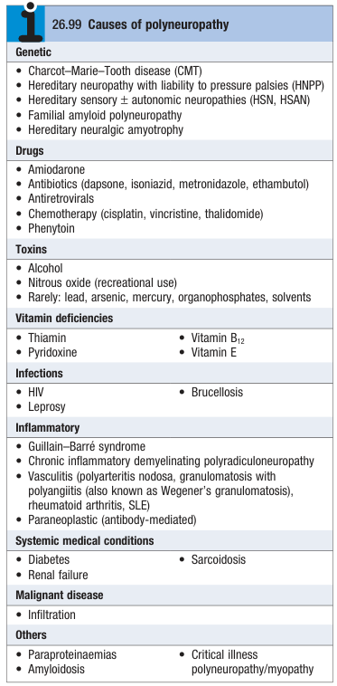
- **Etiology of chronic neuropathies classified by pathogenic mechanism:** 
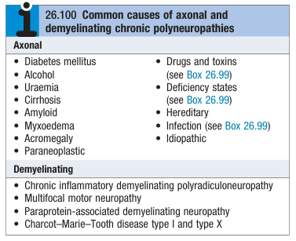
    - **Axonal neuropathies:**
        - <u>Metabolic disturbances</u> - chronic hyperglycaemia (DM), cirrhosis, uraemia, myxoedema, acromegaly
        - <u>Deficiency states</u> - B12, pyridoxine, thiamine, vitamin E
        - <u>Drugs</u> - e.g. ABx (isoniazid, metronidazole, ethambutol), chemotherapy (cisplatin, vincristine), phenytoin, amiodarone, antiretrovirals
        - <u>Toxins</u> - alcohol, nitrous oxide, organophosphate poisoning, heavy metals (lead, arsenic, mercury)
        - <u>Systemic infections</u> - HIV, leprosy, Brucellosis
        - <u>Infiltrative</u> - e.g. amyloidosis, sarcoidosis
        - <u>Hereditary</u> - e.g. CMT, HSN, HSAN, HNPP
    - **Demyelinating chronic polyneuropathies:**
        - Chronic inflammatory demyelinating polyradiculopathy (CIDP)
        - Multifocal motor neuropathy
        - Paraprotein-associated demyelinating neuropathy
        - CMT disease type I and type X
- **Ix:** 
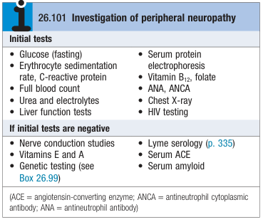
    - **Routine bloods** - CBC, LRFT, ESR/CRP, FBG/A1c TFT, B12, folate, ANA, ANCA, serum protein electrophoresis:
        - <u>CBC</u> - megaloblastic anaemia if B12 deficiency; detect inflammatory process
        - <u>LRFT</u> - detection of dLRFT or uraemia
        - <u>Inflammatory markers</u> (ESR/CRP) - non-specifically elevated reflects inflammatory process
        - <u>FBG/A1c</u> - diabetic
        - <u>TFT</u> - hypothyroidism
        - <u>B12, folate</u> - most common deficiency states
        - <u>ANA, ANCA</u> - detect autoimmune disease including WG
        - <u>SPE</u> - paraprotein-associated demyelinating neuropathy
    - **CXR** - r/o chest malignancy or systemic conditions w/ chest involvements
    - **Additional Ix:**
        - <u>Nerve conduction study</u> - discriminating between axonal or demyelinating neuropathies (most are axonal)
        - <u>Serum amyloid</u> - for amyloidosis
        - <u>Serum ACE</u> - for sarcoidosis
        - <u>Vitamin A and E assay</u> - for deficient states
        - <u>Genetic testing</u> - e.g. for CMT, HNPP, HSN, HSAN and others

### Entrapment neuropathy

### Mononeuropathy multiplex

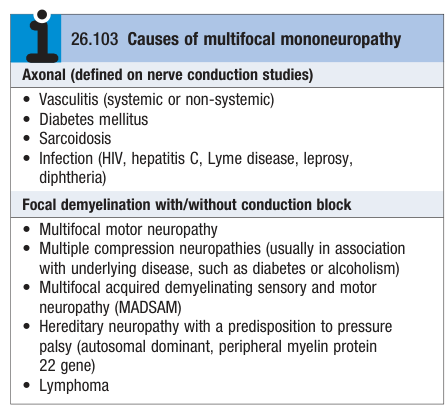

### Polyneuropathy

### Guillain-Barre syndrome

- **Definition** - a heterogenous group of acute, immune-mediated polyneuropathy
- **Epidemiology:**
    - <u>Incidence</u> - 1-2/1000000/y
    - <u>Geographic variation</u> - form of GBS differs in different areas:
        - Acute inflammatory demyelinating polyneuropathy (AIDP) more common in Europe and North America
        - Axonal variants (AMAN or ASMAN) more common in China and Japan
- **Variants of GBS:**
    - <u>Miller Fisher syndrome</u> - a/w anti-GQ1b Ab and presents w/ weakness along with, internal and external opthalmoplegia, ataxia and areflexia
- **Clinical features of GBS** - progresses and reaches nadir at around 4 weeks
    - **Distal parasthesia and pain** - sensory Sx typically precedes muscle weakness and ascends rapidly from LL to UL
    - **Muscle weakness** - ascending from LL and UL, more marked proximally than distally
    - **Facial and bulbar weakness** - commonly results in dysarthria and dysphagia
    - **Respiratory weakness** - may require ventilatory support in 20% of cases and rapid clinical deterioration into respiratory failure occurs within hours
- **Signs of GBS:**
    - Diffuse weakness
    - Areflexia over all limbs
- **Ix:**
    - **LP** - shows <u>albumimocytologic dissociation</u>:
        - <u>Protein</u> - raised (normal in first 10d)
        - <u>WBC</u> - not raised (\> 10 x 106/L suggests an alternative Dx)
    - **Electrophysiological studies** - emerge after a week or so:
        - Conduction block
        - Multifocal motor slowing
        - Evident proximally as delayed F waves
    - **AutoAb** (Anti-GM1) - only +ve in 25% (typically in AMAN form)
- **Mx:**
    - **Principles of Mx:**
        - <u>Supportive measures</u> - prevention of pressure sores and DVT
        - <u>Regular monitoring</u> - especially of respiratory function in acute phase to detect early deterioration into respiratory failure
        - <u>Medical Mx</u> - IVIG or plasma exchange
    - **IVIG and plasma exchange:** 
    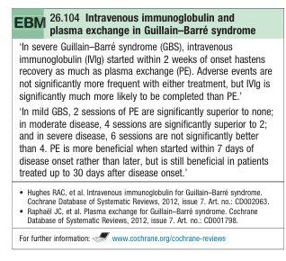
- **Prognosis** - 80% complete recovery in 3-6mo:
    - <u>Mortality</u> - 4%
    - <u>Poor prognostic markers</u>:
        - Old age
        - Rapid deterioration

### Chronic polyneuropathy

### Brachial plexopathy

### Lumbosacral plexopathy

### Radiculopathy

## Diseases of neuromuscular junction

### Myasthenia gravis

- **Definition** - autoimmune disease of the NMJ manifesting as acutely evolving, fatigable weakness preferentially affecting occular, facial and bulbar muscles
- **Epidemiology:**
    - <u>Incidence</u> - most common cause of acutely evolving fatigable weakness
    - <u>Demographic</u> - peak incidence in 15-50y, F preponderance in younger patients while M preponderance in older patients
- **Associated conditions:**
    - <u>Thymic disorder</u> - thymoma (15%, particularly in late onset MG), thymic follicular hyperplasia
    - <u>Organ-specific autoimmune disorders</u>:
        - T1DM
        - AIH
        - Autoimmune thyroid disease
- **Pathophysiology of MG:**
    - **Triggers for autoimmune processes** - not usually evident:
        - <u>Drugs</u> - e.g. penicillamine can Ab-mediated myasthenic syndrome that persists after drug removal
    - **Autoantibodies against acetycholine receptor function** - Ab against AChR (detectable in 80% of patients), while other Ab produces similar clinical pictures (e.g. Anti-MuSK)
    - **Effects of autoimmunity:**
        - 1\. Blockage of neuromuscular transmission
        - 2\. Complement-mediated inflammatory response reduces number of AChR and damages motor end plates

    
    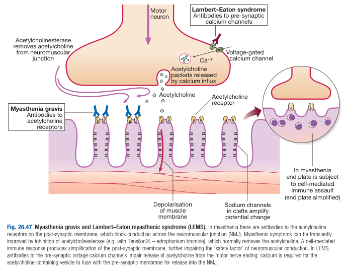
- **Clinical features of MG** - relapsing and remitting course as in many autoimmune disorders:
    - **Fatiguable weakness** - movement is initially strong but rapidly weakens as muscle use continues:
        - <u>Site</u> - can affect any muscle theoretically but classically preferentially affects **occular, facial and bulbar muscles**:
            - **EOM** - manifests as intermittent ptosis or diplopia
            - **Bulbar Sx** - dysphagia and dysarthria reported as weakness in chewing, swallowing and speech
            - **Limbs** - commonly shoulder girdle and unable to complete tasks above shoulder level (e.g. combing hair)
            - **Respiratory muscles** - results in type 2 (ventilatory) respiratory failure
        - <u>Onset and progression</u> - usually acute onset with rapid evolvement
        - <u>Timing</u> - **fatiguability** demonstrated as weakening towards the end of the day or following exercise
    - **Absence of sensory Sx** - no numbness or parasthesia confirmed on P/E
    - **Absence of CNS involvement** - as confirmed on P/E
- **Signs of MG:**
    - <u>Examination of EOM</u> - ptosis, and diplopia
    - <u>Examination of CN VII</u> - facial weakness
    - <u>Limb examination</u> - weakness on prolonged testing of power, reflex normal/ hyporeflexic
- **Ix and Dx:**
    - **Tensilon test** (historical interest) - demonstrate improvement of Sx on IV anti-cholinesterase but lacks objectivity:
        - <u>Test properties</u> - lacks objectivity (moderate Sn and Sp)
        - <u>Technique</u>:
            - Assessment beforehand to allow for objectivity
            - IV injection of short-acting anti-cholinesterase (Edrophonium bromide)
            - IV atropine to avoid bradycardia
            - Detect Sx improvement
        - <u>Diagnostic findings</u> - improvement in muscle function within 30s and persists for 2-3 min
    - **Nerve conduction studies with repetitive stimulation:**
        - <u>Diagnostic findings</u> - characteristic **decremental response**
    - **Autoantibodies:**
        - Anti-AChR (present in 80% patients)
        - Anti-MuSK (common in Anti-AChR -ve patients w/ prominent bulbar Sx)
        - Thyroid Ab (screening for autoimmune thyroid disease)
    - **CT thorax** - exclude thymoma especially in Anti-AChR -ve patients
- **Mx:**
    - **Principles of Mx:**
        - **Acute Tx:**
            - <u>Supportive care</u> - e.g. ventilatory support if T2RF
            - <u>Rapid suppression of autoimmunity</u> - IVIG or plasma exchange
        - **Long-term Tx:**
            - <u>Maximise activity of ACh on remaining AChR</u> - through inhibition of acetylcholinesterase (AChE) by a long-acting anticholinesterase (e.g. pyrigdostigmine)
            - <u>Limit autoimmune destruction of motor endplates</u> - immunosuppression by corticosteroids, steroid-sparing therapy, or thymectomy

    
    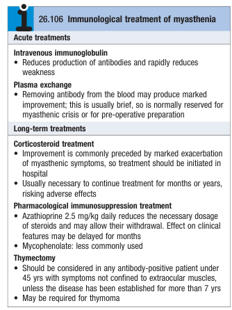
    - **Anti-cholinesterase:**
        - <u>Selection</u> - pyridostigmine, neostigmine
        - <u>MOA</u> - inhibition of AChE, and maximise activity of ACh on remaining AChR
        - <u>S/E</u>:
            - GI disturbance - diarrhoea and colic (controlled by propantheline)
            - Cholinergic crisis if overdose - muscle fasciculation, paralysis, pallor, sweating, salivation and small pupils
    - **Immunological Tx:**
        - **Corticosteroid Tx** - necessary to continue Tx for mo to y before switching to steroid-sparing agent:
            - <u>S/E</u> - extremely common and needs monitoring (risk adverse effects)
            - <u>Caution</u> - initiate in hospitals as improvement commonly preceded by marked exacerbation of myasthenic crisis
        - **Azathioprine** - 2.5 mg/kg/d allows for steroid-sparing in long run
    - **Thymectomy** - may be considered in the presence or absence of thymoma:
        - <u>Indications</u>:
            - Thymoma (esp. if Anti-AChR -ve patients)
            - Considered in Ab +ve patients \< 45y with Sx not confined to EOM (unless established for \> 7y)
        - <u>Clinical efficacy</u> - may improve prognosis (awaiting clinical trials), but may not induce remission in older patients
- **Prognosis:**
    - Excellent if entirely occular
    - Rapid progression of disease after 5y of onset uncommon

### Other myasthenic syndromes

- **Lambert-Eaton myasthetic syndrome** (LEMS) - inflamatory or paraneoplastic phenomenon:
    - **Pathophysiology of LEMS:**
        - <u>Ab against pre-synaptic voltage-gated calcium channels</u> - impaired neurotransmitter release across the synapse
        - <u>Effects across neuromuscular junction</u> - impaired transmission, but sustained stimulation may result in return of power
        - <u>Effects on autonomic nervous system</u> - often results in parasympathetic autonomic dysfunction
    - **Clinical features of LEMs:**
        - **Muscle weakness** - weakness initially but sustained contraction of the relavent muscle results in return of power (mirror image of MG)
        - **Autonomic dysfunction** - e.g. dry mouth
    - **Signs of LEMs** - on examination of motor system:
        - <u>Jerks</u>:
            - Absence of tendon reflexes initially
            - Return of reflexes after sustained contraction of the muscle
    - **Ix:**
        - <u>Nerve conduction study</u> - presence of post-tetanic potentiation of motor response to nerve stimulation of a frequency of 20-50s
    - **Clinical assocation** - malignancies
    - **Mx:**
        - <u>Symptomatic Tx</u> - 3,4-diaminopyridine/ pyridostigmine and immunosuppression
        - <u>Search for malignancy</u> - malignancy screen to identify the underlying neoplasm

## Diseases of muscles

- **Clinical suspicion of muscle diseases:**
    - <u>Proximal symmetrical weakness</u> - most typically proximal muscles are affected symmetrically that reflects **LMN lesion** on examination, but specific muscular dystrophies may be a/w different muscles affected
    - <u>Absence of sensory Sx</u> - r/o neuropathy as a cause
    - <u>Cardiorespiratory involvement</u> - cardiorespiratory involvement is suggestive of muscular dystrophies
- **DDx of suspected muscle disease:**
    - **Hereditary syndromes** - muscular dystrophies, muscle channelopathies, metabolic myopathies, congenital myopathies
    - **Acquired proximal myopathies:**
        - <u>Idiopathic inflammatory myositis</u> - polymyositis, dermatomyositis, inclusion body myositis
        - <u>Endocrine and metabolic disorders</u>:
            - **Thyroid disorders** - hypothyroidism, hyperthyroidism
            - **Adrenal disorders** - Cushing's syndrome, Conn's syndrome, Addison's disease
            - **Pituitary disorders** - Acromegaly
            - **Electrolyte imbalance** - hypoK, HyperCa (e.g. hyperPTH)
        - <u>Toxins</u> - alcohol, organophosphate poisoning, amphetamines, cocaine, heroin
        - <u>Drugs</u> - e.g. statins, steroids, ICIs, cytotoxic agents, opiates
        - <u>Paraneoplastic</u> - carcinomatous neuromyopathy, DM, ASyS

    
    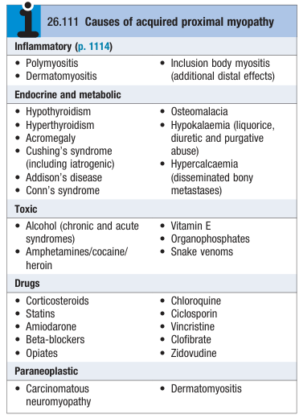

### Muscular Dystrophies

### Inherited metabolic myopathies and channelopathies
