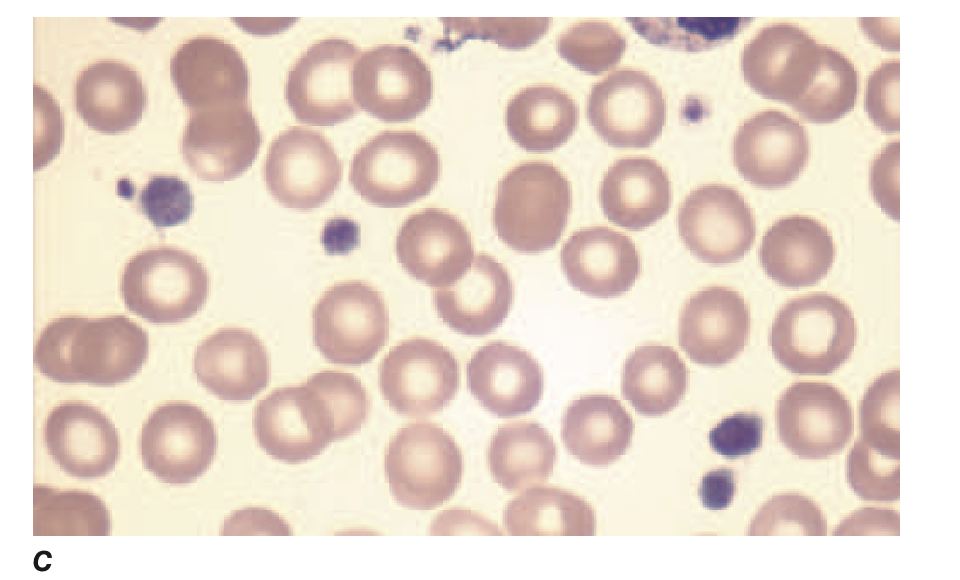
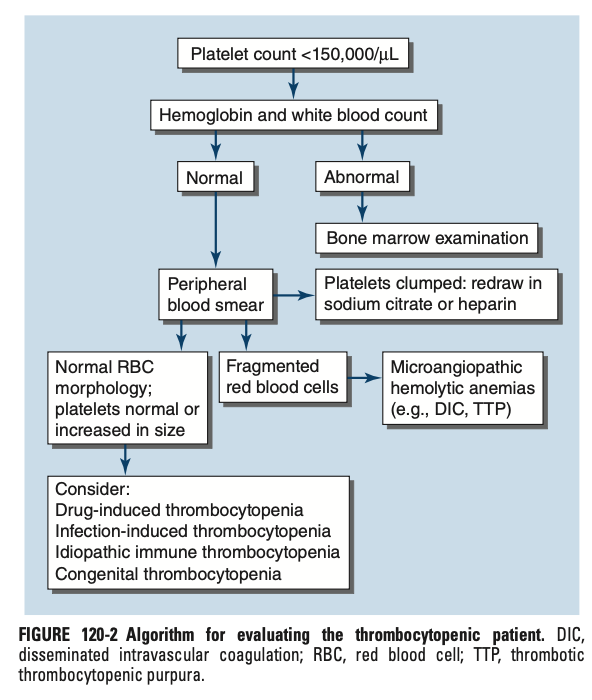
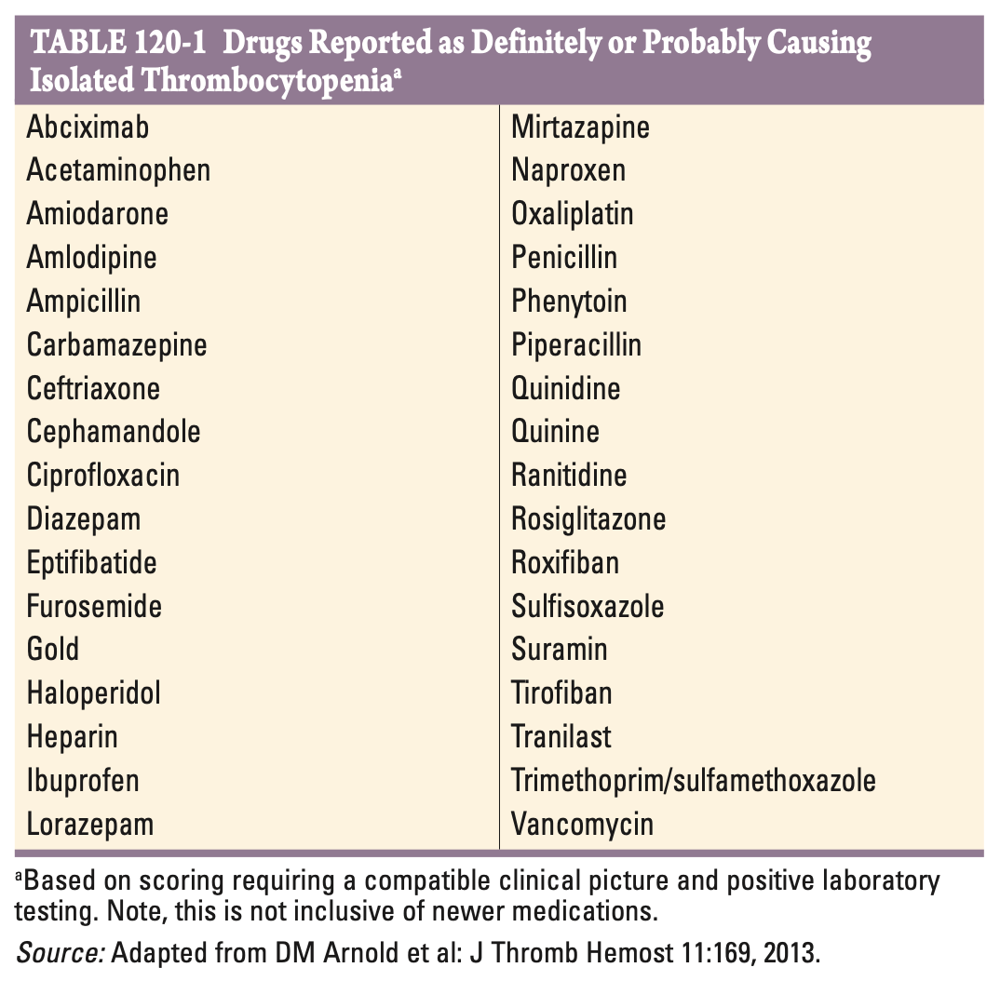

# Ch120 Disorders of Platelet and Vessel Wall

## Platelet and Vessel Wall

## Disorders of Platelets

### Thrombocytopenia

- **Classification of causes of thrombocytopenia:**
    - <u>By pathophysiology</u> - 1) decreased BM production, 2) sequestration, and 3) increased PLT destruction
    - <u>By genetics</u> - inherited or acquired (typically for classification of disorders of decreased production)
- **Approach to thrombocytopenia:**
    - <u>Initial evaluation</u> - Hx (N.B. drug Hx etremely important), P/E, CBC, PBS
    - <u>Diagnostic evaluation</u>:
        - BM examination - should be performed esp in older patients not responding to empirical therapy
- **Pseudothrombocytopenia:**
    - In vitro artifact resulting from platelet agglutination via Ab (IgG), when Ca content decreased by blood collection in EDTA blood
    - PLT count can be rechecked in citrated blood (blue) or heparin blood (green)

  
  
- **DDx of thrombocytopenia** - arises from one or more of three processes, including 1) decreased BM production, 2) sequestration, and 3) increased PLT destruction:
- **Salient points of Hx:**
    - <u>PMH</u>:
        - CKD
        - Alcoholism
    - <u>Drug Hx</u> - drugs are most common cause of thrombocytopenia:
        - Bone marrow failure - cytotoxic agents, anti-metabolites
        - Anticoagulants - heparin (HIT)
        - Immunotherapy
        - OTC drugs and herbal remedies
    - <u>FHx</u> - FHx of childhood BM failure syndromes and hereditary thrombocytopathies
- **P/E:**
    - <u>Mucocutaneous findings</u> - PLT of 50-10 x 109/L needed:
        - Petechiae - pinpoint non-blanchable haemorrhages in dependent areas (due to higher venous pressures), are usually a sign of thrombocytopenia not platelet dysfunction
        - Purpura - larger areas caused by petechiae coelascing together
        - Wet purpura/ blood blisters - found on oral surfaces, thought to denote an increased risk of impending life-threatening haemorrhage
    - <u>Stigmata of chronic liver disease</u> - e.g. jaundice, spider angioma, gynaecomastia
- **Approach to Ix of a thrombocytopenic patient:** 

    - <u>Isolated thrombocytopenia</u> - workup w/ PBS and consider BM examination
    - <u>Pancytopenia</u> - direct bone marrow examination
- **Infection-induced thrombocytopenia** - most common non-drug related thrombocytopaenia:
    - <u>Viral infections</u> - infectious mononucleosis-like syndromes, acute retroviral syndrome, ?COVID-19
    - <u>Bacterial infections</u> - DIC secondary to sepsis, especially w/ G- bacteria
    - <u>Post-infectious ITPs</u> - prior coryza in children but thrombocytopenia almost always resolves spontaneously (association less clear in adults)
- **Drug-induced thrombocytopaenia:**
    - <u>Bone marrow suppression</u> - predictable after Tx w/ chemotherapeutic drugs
    - <u>Drugs causing isolated thrombocythaemia</u> - all drugs are suspects including OTC and herbal medications: 
    
    - <u>Drug-dependent Ab</u> (demonstrable by laboratory assays) - quinine, sulfonamides
    - <u>Heparin-induced thrombocytopenia</u> - typically requires heparin exposure and presence of anti-heparin/PF4 Ab:
        - Delayed-onset HIT is rare but can occur after heparin has been stopped
        - Spotaneous HIT syndrome (autoimmune HIT) can occur w/ no Hx of heparin
        - Case reports of vaccine-induced immune thrombocytopenia and thrombosis (VITT) after COVID-19 vaccination
        - Extremely rarely, a similar thrombotic syndrome follows adenovirus infection
- **Heparin-induced thrombocytopenia** - a thrombotic disorder:
    - **Epidemiology** - rare disorder but must be considered in anticoagulated patients
    - **Pathophysiology**:
        - Anti-heparin/PF4 Ab - produced during presence of heparin Tx and can induce platelet activation
        - Microthrombus formation - thrombosis all through out microvasculature
        - Exhaustive coagulopathy - over-activation of coagulation cascade
    - **Clinical manifestations** - arterial and venous thrombotic disorder w/ paradoxical thrombocytopaenia:
        - Usually when patient is actively on heparin (~ \< 100d)
        - Atypical manifestation in delayed manner or spontaneously may occur (see above)

    
    
    - **Dx** - essentially clinical:
        - 4 T's (scoring system to exclude HIT) - thrombocytopenia, timing of platelet count drop, thrombosis, and other causes of thrombotypenia not evident
        - Vascular imaging to confirm thrombosis (at least LL duplex USG, if not arteriogrpahy)
        - Anti-heparin/PF4 Ab immunoassay (high Sn, low Sp)
        - Serotonin release platelet activation assay (low Sn, high Sp)
    - **Mx**:
        - Immediate **discontinuation of heparin** and consider other anticoagulants
        - Alternative anticoagulation should be considered including argotraban, while other direct thrombin inhibitors (bivalirudin), and DOACs have similar efficacy (LMWH avoided as Ab will cross-react)
        - Warfarin must be bridged w/ DTI or fondaparinux after resolution of thrombocytopenia and lessening of prothrombotic state as it paradoxically increases risk of venous gangrene (presumably due to clotting activation and severely reduced protein C and protein S levels)
        - Trial of IVIG to block platelet activation in VITT syndrome to block platelet activation
- **Immune thrombocytopenic purpura** (ITP; previously termed idiopathic thrombocytopenic purpura):
    - **Etiology**:
        - Primary ITP - acute post-infectious complication in children, chronic disease indult, but generally responds to therapy
        - Secondary ITP:
            - Autoimmune disorders - esp. SLE
            - Infections - HIV, HCV, H. pylori infections
            - Lymphoproliferative disorders - e.g. lyphoma
    - **Pathopphysiology**:
        - Increased destruction - immune-mediated destruction of platelets
        - Decreased production - inhibition of platelet release from megakaryocytes
    - **Clinical features** - thrombocytopenia despite relatively normal blood film:
        - Mucocutaneous bleeding - petechiae +/- echymosis on skin, ocassionally w/ GI bleeding, or HMB
        - Life-threatening CNS bleedings - often heralded by wet purpura and retinal haemorrhages
    - **Signs**:
        - Mucocutaneous bleeding (petechiae, purpura, echymosis)
        - Splenomegaly often not palpable in primary ITP
    - **Ix**:
        - CBC - isolated thrombocytopenia (+/- IDA if significant bleeding)
        - PBS - otherwise normal if not the thrombocytopenia, platelets may be large with normal morphology
        - Anti-PLT Ab - low Sn and Sp, does not differentiate between both forms
        - Evaluation of secondary causes:
            - Serology for SLE (ANA, anti-dsDNA, C3/4)
            - SPE and Ig testing
            - Anti-HCV, Anti-HIV
            - Urease-breath test for H. pylori
        - Coomb's test to r/o combined AIHA and ITP (Evan's syndrome)
    - **Mx:**
        - **Principles of Mx** - decision to Tx dependent on 1) PLT count, 2) clinically assessed bleeding diathesis, 3) anticipated haemostatic challenge:
            - <u>Threshold to Tx</u> - PLT \> 30 x 109/L appear not to have increased mortality rates (higher if anticipated procedure)
            - <u>Selection of agents</u>:
                - No severe ITP (PLT \< 5; signs of impending ICH) - out-patient Mx w/ single agent, either oral glucocorticoids or Rh0(D) Ig
                - Severe ITP - combined modality Tx using high-dose glucocorticoids and IVIG
                - Chronic ITP - TPPO-RAs favoured over broad immune therapy and splenectomy

### Thrombocytosis

### Qualitative Disorders of Platelet Function

## Von Willebrand Disease
