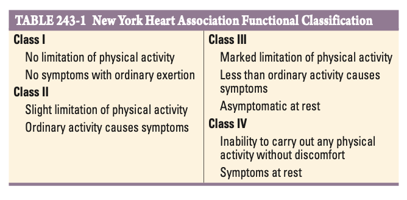

# Ch243 Approach to teh Patient with Possible Cardiovascular Disease

- **Epidemiology** - the magnitude of the problem:
    - <u>Prevalence</u> - most prevalent serioud disorders in developed nations; rapidly increasing problem in developed nations
    - <u>Demographic</u>:
        - Sex - more common in M; decreasing mortality rate in M but increasing in F
    - <u>Burden</u>:
        - Most common cause of death (700,000 deaths per year in the US); 33% of the deaths are sudden
        - Declined of age-adjusted death rates for coronary heart disease, but recent plateau possibly due to growing incidence of obesity, T2DM, and the metabolic syndrome
- **Different cardiovascular disease have different clinical courses:**
    - <u>Acute presentation w/ no-prior Sx</u>:
        - First clinical manifestation may be catastrophic (e.g. syncope or SCD), as in the presence of AMI in a patient who has asymptomatic coronary disease, a patient w/ arrhythmia due to underlying cardiomyopathic process or prolonged QT interval
        - Prevention is largely based on opportunistic screening, e.g. for risk factors (HTN, HL, DM for atherosclreosis) or for silent diseases (e.g. heart murmur for cardiomyopathy)
    - <u>Prolonged clinical course w/ disease progression</u> - usually w/ structural heart diseases (e.g. valvular heart diseases, certain dilated cardiomyopathy)
- **Cardiac symptoms:**
- **NYHA elements of a complete cardiac diagnosis:**
    - <u>Etiological diagnosis</u> - e.g. congenital/ genetic, hypertensive, ischaemic, inflammatory
    - <u>Anatomical diagnosis</u>:
        - Chamber involvement - e.g. hypertrophy, dilatation, both
        - Valvular involvement - e.g. stenosis, regurgitation, both
        - Pericardial involvement - e.g. pericarditis, pericardial effusion
    - <u>Physiological diagnosis</u>:
        - Rhythm - sinus rhythm, presence of arrhythmia, presence of conduction system disease
        - Haemodynamics - evidence of clinically sigificant heart failure
        - Ischaemia - cardiac disease complicated by an ischaemic element
    - <u>Functional diagnosis</u> - assessment of severity based on the degree of physical activity required to elicit Sx, guding extent and tempo of workup: 
    
- **Approach to the correct and complete cardiac Dx:**
    - <u>Initial clinical assessment</u> - Hx and P/E
    - <u>Initial and diagnostic Ix</u> - ECG, imaging, blood tests, invasive examinations, genotyping
- **Forms of Ix in cardiology:**
    - <u>12-lead ECG</u> - taken at rest, during Sx, or w/ stress
    - <u>Non-invasive imaging</u> - CXR, echocardiogram, CCTA, SPECT, cardiac MRI
    - <u>Blood tests</u>:
        - Risk assessment - e.g. A1c, lipid profile, CRP
        - Precipitating factors - e.g. Hb, TFT
        - Cardiac function - e.g. NT-proBNP
        - Myocardial injury - e.g. CK-MB, troponin
    - <u>Invasive examinations</u> - e.g. cardiac catheterisation, invasive coronary angiography
    - <u>Genetic testing</u> - for monogenic diseases (e.g. Marfan's syndrome, cardiomyopathies, genetic arrhythmia syndromes)
- **Principles of FHx** - familial clustering due to presence of a genetic or environmental risk factors:
    - **Genetic factors:**
        - <u>Monogenic disorders</u> - folows Mendelian transmission patterns as in HCM, Marfan's syndrome, LQTS
        - <u>Polygenic disorders</u> - HTN, T2DM, HL, premature coronary diseases
    - **Environmental factors** - e.g. dietary (calories intake) or behavioural (smoking) pattern
- **Functional limitation and exercise tolerance** - information regarding functional limitation must be individualised and interpreted w/ respect to the context:
    - <u>Interpretation w/ respect to baseline and expected health</u> - e.g. 2FOS may be more significant in an fit individual compared to a previously sedentary person
    - <u>Interpretation w/ respect to intensity of medical therapy</u> - e.g. angina despite multiple anti-anginals is more severe than angina that occurs in the absence of Tx
    - <u>Interpretation w/ respect to the rate of decline of functional limitation</u> - rate of decline exceeding that of the expected natural Hx should raise suspicion of another contributory element
- **Pitfalls in cardiovascular medicine:**
    - Failure of non-cardiologist to recognise important of cardiac manifestation of a systemic disease
    - Failure of the cardiologist to recognise the underlying systemic disorder in patient w/ heart disease
    - Overreliance and overutilisation of laboratory tests, particularly invasive techniques
