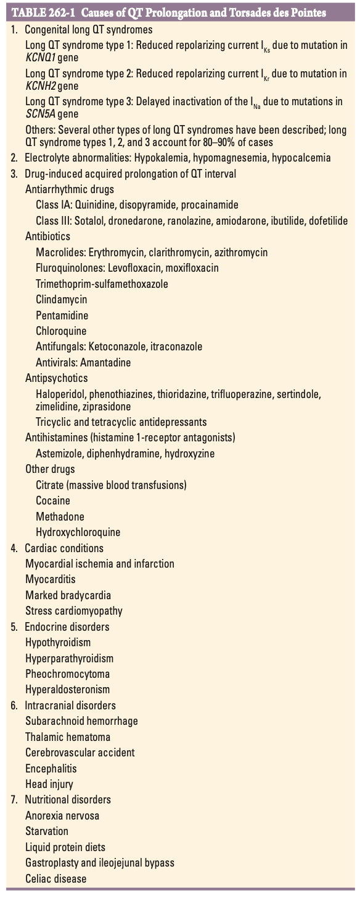

# Ch262 Polymorphic Ventricular Tachycardia and Ventricular Fibrillation

## Poymorphic Ventricular Tachycardia

- **Definition** - ventricular tachycardia w/ continuously changing QRS configuration from beat to beat, indicating a continually changing ventricular activation sequence
- **Mechanisms of polymorphic VT:**
    - **Re-entry** - unlike monomorphic VT, does not depend on a fixed arrhythmogenic substrate such as myocardial scarring or fixed increased automaticity:
        - <u>Virable re-entrant pathways</u> - electrical activity passing through multiple re-entrant pathways rather than a fixed circuit
        - <u>Spiral wave re-entry</u> - rotating pattern of electrical activity meandering through the ventricular tissue
        - <u>Multiple automatic foci</u> - several sites of increased automaticity
    - **Repolarisation abnormalities** - in setting of long-QT syndrome (irrespective of cause), or other repolarisation abnormalities secondary to channelopathies etc.
- **Causes of polymorphic VT:**
    - Acute myocardial ischaemia (or infarction)
    - Ventricular hypertrophy
    - Repolarisation abnormalities
    - Genetic arrhythmia syndromes

## Polymorphic VT associated with Acute Myocardial Ischaemia

- **Polymorphic VT associated w/ acute myocardial ischaemia** - most common cause of polymorphic VT:
    - **Epidemiology** - 10% of AMI develop VT that degenerate to VF
    - **Pathophysiology** - multiple-rentrant circuits through the infarct border zone
    - **Clinical manifestations:**
        - Risk is greatest in \< 1y of AMI, as surviving purkinje fibres serve as a source of automaticity to initiate polymorphic VT
        - Recurrent polymorphic VT is extremely suggestive AMI, and warrants assessment of adequate reperfusion
        - Risk declines w/ time but never reaches zero
        - Polymorphic VTs and VFs \<48h of AMI a/w greater in-hospital mortality, but those who survive are <u>not at risk of SCD</u> (ICD indications as in other AMI)
        - Accounts for most AMI that do not reach the hospital
    - **Mx:**
        - <u>Initial resuscitation</u> - as per ACLS guidelines, prompt defibrillation and restoration of sinus rhythm
        - <u>Arrhythmia suppression</u>:
            - Pharmacological therapy
            - Correction of electrolyte abnormalities (?high-normal K)
        - <u>Urgent myocardial reperfusion</u> - as per ECS guideline

## Repolarisation Abnormalities and Genetic Arrhythmia Syndromes

- **VT and QTc prolongation:**
    - **Pathophysiology**:
        - QT prolongation as a result of 1) reduced repolarisation currents via K channels, or 2) increased depolarisation from late Na currents
        - QT prolongation causes delayed inactivation of Ca channels, leading to excessive Ca influxes and **Early after depolarisations**
        - Overall heterogeneity of repolarisation enables TdP trigged by EAD
    - **Causes of QT prolongation** - inherited or acquired (see below)
    - **Characteristic polymorphic VT torsades des pointes (TdP):**
        - <u>Pause dependance</u> - PVC induces a pause followed by a sinus beat resulting in further **prolongation of QT interval**
        - <u>Increased QT interval</u> - increases chance of PVC to occur on a T wave, which becomes the first ventricular beat of TdP
    - **Clinical manifestations:**
        - PVCs and NSVT precede episodes of sustained VT
        - Polymorphic VT will almost manifest as near syncope, syncope, and cardiac arrest
    - **Mx:**
        - <u>IV MgSO4</u> (1-2g) - usually suppresses recurrent episodes
        - <u>Increased heart rate</u> - by pharmacological (isoproterenol infusion) or pacing to raises of 100-120 depolarisations to shorten QT ratio and suppress PVCs
        - <u>Correction of precipitating factors</u> - hypoK, hypoCa
        - <u>Avoidance of drugs causing QT prolongation</u> - as individuals thought to have a susceptibility to arrhythmias
- **Acquired causes of QT prolongation:**
    - **Myocardial ischaemia** - prompt ischaemia workup in patient w/ QT prolongation
    - **Electrolyte abnormalities** - hypoK, hypoCa, hypoMg
    - **Drug-induced QT prolongation** - drug-classes conveniently starts w/ "A":
        - <u>Anti-arrhythmics</u> - class IA (procainamide, disopyramide) and class III (sotalol, dronedarone, amiodarone)
        - <u>ABx</u>:
            - Macrolides - erythromycin, clarithromycin, azithromycin
            - Fluroquinolones - levofloxacin, moxifloxacin
        - <u>Anti-fungals</u> - ketoconazole, itraconazole, trimethroprim-sulmethoxazole
        - <u>Anti-psychotics</u> - TCA, haloperidol, ziprasidone
        - <u>Antihistamines</u> - diphenhydramine, hydroxyzine, astemizole
        - <u>Miscellaneous</u>:
            - HCQ (for SLE)
            - Opioids (e.g. cocaine, methadone)
            - Citrate (massive blood transfusion)
    - **Endocrine conditions** - <u>hypothyroidism</u>, hyperparathyroidism, phaemochromocytoma, hyperaldosteronism
    - **Other cardiac conditions** - myocarditis, marked bradycardia, stress cardiomyopathy

  
  
- **Congenital long QT syndrome** (LQTS) - group of genetic arrhythmia syndromes (specifically channelopathies, that affect ventricular repolarisation:
    - <u>Classification of LQTS</u> - 12 types; types 1, 2, and 3 account for 80-90% cases:
        - Type 1 LQTS - reduced repolarising current due to mutation of KCNQ1 gene (slow-activating delayed rectifier K channels)
        - Type 2 LQTS - reduced repolarising current due to mutation of KCNH2 gene (rapidly activating delayed rectifier K channels)
        - Type 3 LQTS - delayed inactivation of INa current due to mutation of SCN5A gene
    - <u>Clinical manifestations</u> - syncope or cardiac arrest episodes in childhood w/ different triggers:
        - Type 1 LQTS - a/w exertion, particularly swimming
        - Type 2 LQTS - a/w sudden auditory stimuli or emotional upsets
        - Type 3 LQTS - suddend death occurs during sleep
    - <u>Dx</u> - incidental finding of prolonged QTc (\> 440 ms in M, \> 460 ms in F) in an asymptomatic patient w/ no attributable causes and subsequent genotyping
    - <u>Markers of increased risk of SCD</u>:
        - Markedly prolonged QTc (\> 500 ms)
        - Female gender
        - Hx of syncope or cardiac arrest
        - Syncope despite beta-blocker therapy
        - High-risk genotypes (emerging correlation between genotype w/ risk and response to therapy)
    - <u>Mx</u>:
        - Beta-blocker therapy - preferably non-selective agents such as nadolol and propranolol
        - ICD - for those w/ added risk of SCD
        - Avoidance of drugs causing QT prolongation - for all patients w/ LQTS incuding genotype +ve patients w/ normal QTc on ECG
- **Short QT syndrome** - very rare compared to LQTS:
    - <u>Pathophysiology</u>:
        - Gain of function of IKr channels
        - Reduced inward depolarising currents
    - <u>Clinical manifestations</u>:
        - Atrial fibrillation
        - Polymorphic VT
        - SCD
- **Brugada syndrome:**
    - **Definition and terminology:**
        - <u>Brugada syndrome</u> - rare syndrome characterised by \> 0.2 mV ST-segment elevation w/ coved ST segment and -ve T wave in \>=1 anterior precordial lead, which has **manifested as episodes of syncope of cardiac arrest due to polymorphic VT in the absence of structural heart disease**
        - <u>Brugada pattern</u> - asymptomatic individuals w/ characteristic findings which have yet to manifest (similar to WPW syndrome vs WPW pattern)
    - **Epidemiology:**
        - <u>Sex</u> - M more commonly affected irrespective of Brugada syndrome or Brugada pattern
        - <u>Inheritence</u> - in those w/ +ve FHx, autosomal dominant pattern w/ variable penetrance
    - **Mutations a/w Brugada syndrome** - 25% a/w Na channel mutations:
        - Na channels (SCN5A, SCN1B, SCN10A)
        - LOF in Ca channels
        - GOF in K channels
        - Structural or trafficking proteins have been indicated
    - **Pathophysiology of Brugada syndrome:**
        - <u>Variable effect w/ autonomic tone</u> - as evident w/ waxing and waning STE over time and is more pronounced during acute illness or fever
        - <u>Variable dispersuion of repolarisation</u> - epicardial and M cells affeted more than endocardial cells, resulting in difference in transmembrane potential in RVOT (hence coved STE w/ TWI on V1-V3)
    - **Clinical manifestations:**
        - <u>Syncope</u> - due to polymorphic VT
        - <u>Cardiac arrest</u> - due to polymorphic VT w/ degenration to VF; may occur during sleep or **provoked by febrile illness**
    - **ECG findings of Brugada syndrome** - note STE may wax and wane over time and possibly modulated by 1) autonomic tone, or 2) administration of Na channel blockers:
        - <u>Brugada type 1</u> - coved STE in \>=1 anterior precordial leads
        - <u>Brugada type 2</u> - saddle shaped STE in \>= 1 anterior precordial leads
    - **Mx:**
        - <u>Anti-arrhythmic therapy</u> - quinidin
        - <u>Ablation</u> - catheter ablation of abnormal epicardial region of RVOT
        - <u>ICD implantation</u> - for those who have had unexplained syncope or resuscitated from cardiac arrest
        - <u>Avoidance of drugs affecting Na channels</u> - cocaine, cannabis, psychotropics, and certain antiepileptics
- **Other rare genetic arrhythmia syndromes:**
    - Catecholaminergic polymorphic VT (cardiac RyR mutation)
    - Early repolarisation syndromes

## Ventricular Fibrillation

- **Definition** - disorganised electrical ventricular activation w/o identifiable QRS complexes
- **Mechanisms of ventricular fibrillation** - similar to polymorphic VT:
    - Spiral wave re-entry
    - Multiple circulating re-entry wavefronts
- **Causes of VF** - consider causes of sustained monomorphic VT or polymorphic VF
- **Mx:**
    - <u>Initial resuscitation</u> - CPR + unsynchronised defibrillation per ACLS guidelines
    - <u>Search for reversible causes</u> - e.g. acute myocadial ischaemia, electrolytes
    - <u>ICD</u> - if no reversible cause identified
