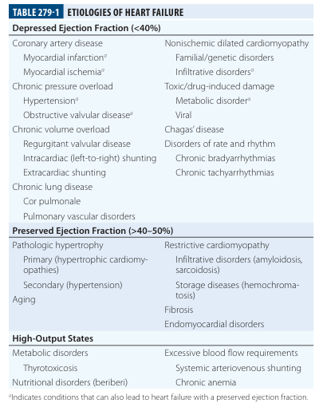
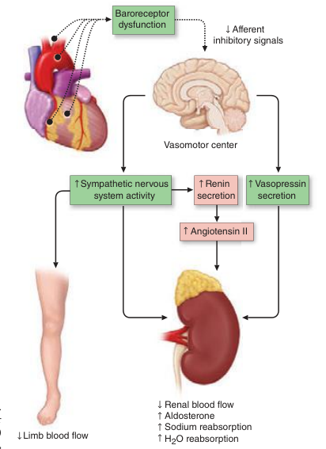
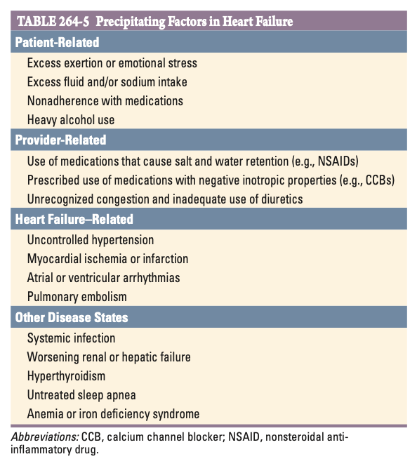
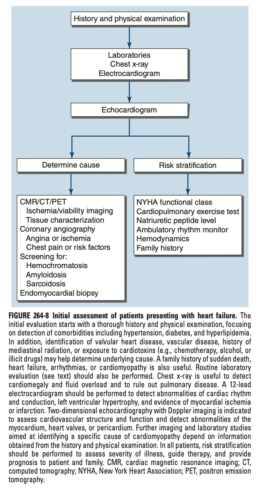
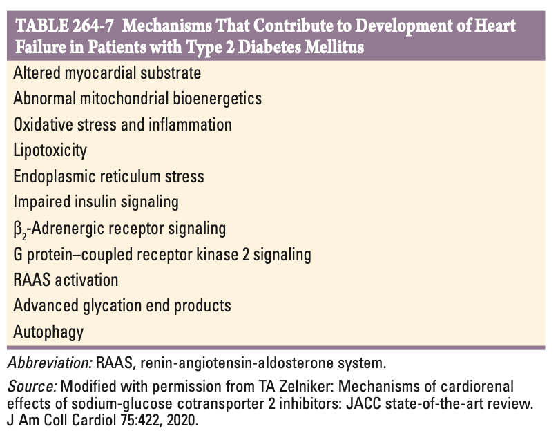
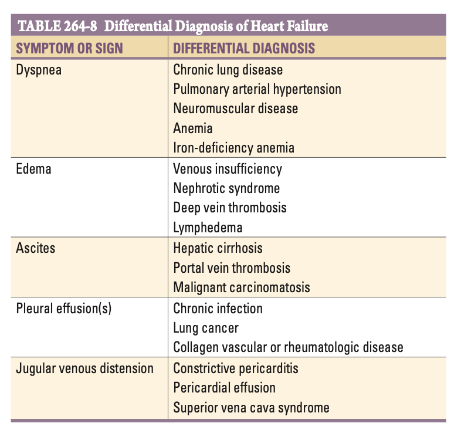

# Ch279 Heart Failure: Pathophysiology and Diagnosis

## Clinical Definitions, Epidemiology and Phenotypes

- **Definition of Heart Failure:**
    - <u>Clinical definition of HF</u> - complex clinical syndrome a/w cardinal S/S (as described by ECS) resulting from any structural or functional impairment of ventricular filling or ejection of blood
    - <u>Pathophysiological definition of HF</u> - syndrome characterised by elevated cardiac filling pressures (w/ or w/o inadequate DO2) at rest or during stress due to cardiac dysfunction
- **Stratification of HF into phenotypes** - based on ejection fraction into HFrEF, HFmrEF, HFpEF and HFrecEF:
    - Reflects differences in demographic, comorbidities, and underlying etiology
    - Predicts different responses to therapies

  
  

- **Phenotypes of HFrEF:**
    - <u>HFrEF</u> (50%) - defined by reduced left ventricular ejection fraction (LVEF) at \<= 40%
    - <u>HFmrEF</u> - defined by moderately reduced LVEF at 41-49%
    - <u>HFpEF</u> - defined by LVEF \>= 50%
    - <u>HFrecEF</u> - patients initially diagnosed w/ HFrEF and treated w/ guideline-directed medical therapy (GDMT) with rapid or gradual improvement of EF, w/ predictors including 1) younger age, 2) shorter duration of HF, 3) non-ischaemic etiology, 4) pathoanatomical favourable features (e.g. absence of fibrosis, smaller ventricular volumes), generally a/w better prognosis than HFrEF and HFpEF
- **Causes of hear failure** - acquired vs familial, ogenital, and other disorders:
    - Coronary artery disease remains most prevalent although principal contributing risk factors varies according to sex, race, and ethnicity
    - Increasing evidence of inherited cardiomyopathies as a cause of HF in adults putting emphasis on the importance of complete 3-generation FHx
    - Systemic disorders (e.g. infiltrative, autoimmune, infectious, drug-induced) contribute to a minor proportion of HF
    - High-output states seldom associated w/ HF in the absence of underlying structural heart disease

## Pathophysiology

- **Progressive disease** - involves an index event followed by months to years of structural and functional remodelling
- **Mechanisms of disease progression** - maladaptive compensatory mechanisms developed and are potentially druggable to reverse the process:
    - **Neurohormonal activation** - initially as mechanism to maintain cardiac output, but unchecked results in excessive myocardial workload, renal abnormalities, baroreceptor dysfunction, direct myocardial toxicity and cardiac arrhythmias, and potentially contributes to cardiac and vascular remodelling: 
    
    - **Vasodilatory hormones** - counteregulatory hormones (ANP and BNP) upregulated and exert beneficial effects of cardiovascular system against maladaptive effects of neurohormonal activation
    - **Endothelin release and inflammatory cytokines** - released by endothelial cells resulting in myocyte hypertrophy and interstitial fibrosis, but endothelin blockade has no demonstrable effects of slowing disease progression
    - **Dyssynchrony and electrical instability** - abnormal electrophysiological functions ensues in HF contributes to haemodynamic consequences:
    - <u>Electrical dyssyncrony</u> (1/3) - prolongation of QRS interval in the form of LBBB or intraventricular delays results in reduced systolic function and increases functional MR
    - <u>Electrical instability</u> - particularly AF and premature ventricular complexes contribute to worsening HF with links to adverse effects of cardiac remodelling
    - **Secondary mitral regurgitation** - anatomical and functional distortion of the mitral valve apparatus, where increased regurgitant volume contributes to progression in HF:
    - <u>Altered ventricular shape</u> - spherical shape of the ventricle influences length and function of chordal-papillary muscle structure
    - <u>Altered atrial structure</u> - dilatation of posterior wal distorts the posterior leaflet of the valve
    - <u>Decreased coaptation of mitral valve leaflets</u> - due to reduced contractile force
    - <u>Increased diameter of mitral annulus</u> - due to dilatation of ventricles w/ inability of annulus to contract during systole
- **Cardiorenal syndrome and abdominal interactions** - <u>renal hypoperfusion</u> results in further activation of neurohormonal mechanisms resulting in volume overload:
    - <u>Arterial underfilling</u> - reduced CO results in reduced GFR, worsening renal functions, and neurohormonal activation (RAAS, VP) to mediate fluid retention
    - <u>Abdominal venous congestion</u> - rise in abdominal cogestion results in activation of hepatorenal or splenorenal reflexes that results in renal vasoconstriction, highlighting role of diuretic therapy to improve renal functions
- **Gut congestion and altered microbiome** - gut congestion may alter gut microbial composition and propagate a chronic state of inflammation

## Evaluation

- **Clinical features of HF:**
    - **Symptoms of pulmonary congestion** - transudation of fluids into interstitum and alveoli, w/ shortness of breath (dyspnoea) as cardinal manifestation and may progress as exertional dyspnoea, orthopnea, PND, and dyspnoea at rest:
    - <u>Exertional dyspnoea and reduced ET</u> - dyspnoea that can be elicited in a predictable manner from a certain level of exertion, the severity classified based on the level of activity that provokes SOB (N.B. NYHA functional classification)
    - <u>Bendopnoea</u> - shortness of breath when bending forward caused by increased cardiac filling pressure especially in presence of low CO
    - <u>Orthopnoea</u> - dyspnoea in recumbant position caused by redistribution of fluids from abdomen and lower extremities into the chest:
      - Typically occurs within 1-2 min of lying down
      - Relieved immediately by sitting upright, and often raising the head and chest with pillows/ sleeping on recliner chair
      - Decrease in orthopnoea may decrease if worsening right HF ensues
    - <u>Paroxysmal nocturnal dyspnoea</u> - episodes of sudden awakening from sleep w/ feeling of suffocation that is not immediately relievable by sitting:
      - Less predictable in occurence and usually occurs after prolonged recumbency or associated central sleep apnoea/ Cheyne-Stoke respiration
      - May require 30 min or longer in upright position for relief
      - Termed 'cardiac asthma' as episodes are accompanied by cough and wheezing due to increased airway resistance fro interstitial pulmonary oedema
      - Pink frothy sputum may be expectorated as a result of pulmonary oedema
    - **Symptoms of systemic congestion:**
    - <u>LL oedema</u> - pitting oedema in dependent areas over the lower limb as a result of fluid overload
    - <u>Features of gut and hepatic congestion</u> - anorexia, malabsorption, and early satiety +/- RUQ abdominal pain w/ N/V
    - <u>Anasara</u> - massive oedema involving entire body w/ recurrent pleural effusions and/or ascites
    - **Symptoms of reduced perfusion** - low-output syndrome:
    - <u>Fatigue</u> - non-specific and may be due to poor sleep, reduced cerebral perfusion, volume depletion, hyponatremia, iron deficiency and medication S/E
    - <u>Weakness</u> - described as weakness mainly in the lower extremities caused by reduced blood flow to exercising muscles as a result of endothelin dysfunction and increased SVR from neurohormonal activation, which may further result in wasting, sarcopenia and cardiac cachexia
    - **Other symptoms:**
    - <u>Insomnia</u> - as a result of nocturnal dyspnoea and nocturia (see below)
    - <u>Nocturia</u> - due to improved renal perfusion in supine position and delayed diuretic effects
    - <u>Oliguria</u> - due to severe reductions in renal blood flow in advanced stage HF
- **Precipitating factors of acute-on-chronic heart failure** (identified in 50-90% admissions) - anything that increases cardaic workload and disrupts the balance in favor of decompensation: 

- **P/E:**
    - **General appearence** - most w/ mild-moderate HF will appear well nourished and comfortable, but cachaxic, dyspnoeic and diaphoretic if severe HF:
    - <u>Pallor</u> - reflects underlying anaemia
    - <u>Duskiness, w/ cool peripheries</u> - reflects low CO state
    - <u>Cardiac cachexia</u> - characterised by bitemporal or upper body muscle wasting due to anorexia, poor absorption due to gut congestion, and pro-inflammatory state
    - <u>Jaundice</u> - severe right HF
    - <u>Pittting oedema</u> - bilateral pitting oedema
    - **Vital signs:**
    - <u>HR and BP</u> - initially elevated due to sympathetic activation and absence of GDMT (targetted HR \< 70-75 bpm w/ BP in low-normal range), hypotensive w/ rapid thready pulse if severe HF
    - <u>RR</u> - normal at rest but increased on exertion or lying down (Cheyne-Stokes respiration in advanced HF)
    - <u>SpO2</u> - typically normal unless 1) **APO**, 2) underlying shunting, 3) severe pulmonary arterial HTN or 4) concomitent lung disease
    - <u>Temperature</u> - mild fever in acute severe HF due to cytokine activation but subside w/ compensation restored
    - **Arterial pulse:**
    - <u>Rate and rhythm</u> - irregular rhythm due to AF, AFlu or frequenv PVCs
    - <u>Pulsus alternans</u> - reduced LV contraction in every cardiac cycle due to incomplete recovery
    - **Jugular venous pressure:**
    - <u>Height</u> - estimation of right atrial pressure, usually raised; if paradoxically absent, sit the patient upwards to see if JVP was in fact beyond the jaw
    - <u>Character</u> - giant V wave and y descent suggestive of severe TR
    - <u>Other additional findings</u>:
      - Abdominojugular test - increase in RAP during 10s of firm abdominal compression followed by abrupt drop on pressure release suggestive of elevated left-sided filling pressure
      - Kusmaull's sign - paradoxical increase in JVP in inspiration as marker of poor outcome
    - **Chest examination:**
    - <u>Basal crepitations</u> - caused by transudation into alveoli and airways, typically over the bases but can be throughout the lung fields if severe APO
    - <u>Wheezes</u> - may be caused by increased airway resistance due to bronchial mucosal oedema
    - <u>Pleural effusion</u> - typically bilateral in predominate right HF (usually right-sided if unilateral)
    - **Cardiac examination:**
    - <u>Displaced apex beat</u> - to the left and downwards
    - <u>Apical impulse</u> - heaving in volume overload; thrusting in pressure overload
    - <u>Parasternal heave</u> - in severe right or biventricular HF
    - <u>Heart sounds</u>:
      - S3 suggests haemodynamic comprimise and carries poor prognosis
      - Holosystolic murmur suggestive of functional MR and TR
      - Loud P2 indicative of secondary pulmonary HTN
    - **Abdominal examination:**
    - <u>Hepatomegaly</u> - early sign of systemic venous congestion which may be tender due to distension of liver capsule
    - <u>Pulsatile liver</u> - if TR is present
    - <u>Ascites +/- splenomegaly</u> - mild-to-moderate ascites in cardiac cirrhosis (presence of massive ascities should lead to search of other causes)
    - **Examination of the LL extremities:**
    - <u>Bilateral LL edema</u> - typically symmetrical and pitting +/- reddening and induration or lead to cellulitis if long-standing

## Diagnosis

- **Dx** - typically clinical Dx:
    - Clinical Dx if presenting w/ typical S/S
    - High index of suspicion required in those at increased risk where additional Ix may be required
- **Initial assessment of patient w/ congestive heart failure:**
    - <u>Routine laboratories</u> - urinalysis, CBC, LRFT, clotting profile, TFT, RBG/A1c, lipid profile
    - <u>Additional laborities</u> - ANA, RF, SPE, serum FLC, ferritin, ceruloplasmin, hepatits C, HIV
    - <u>CXR</u> - assessment of pulmonary congestion, cardiomegaly, and r/o other concomitent cause of SOB
    - <u>ECG</u> - non-diagnostic but provides clues of structural heart disease, coronary artery disease, and conduction system disease
    - <u>Non-invasive imaging</u> - echocardiography +/- CMR, cardiac CT, CCTA for Dx, evaluation, and Mx of HF
    - <u>Biomarkers</u> - NT-proBNP (+/- other upcoming biomarkers)
    - <u>Invasive studies</u> - CVP monitoring, coronary angiography, cardiac catheterisation, endomyocardial Bx etc.

  
  

## Comorbidities

- **Diabetes mellitus** - known risk factor for development of HF and increases risk of morbidity and mortality in those w/ established disease:
    - <u>Epidemiology</u>:
    - Prevalence of DM ranges from 10-40% in ambulatory HF; likely higher in hospitalised patients
    - Co-existence of both diseases are associated w/ poorer outcomes
    - <u>Potential mechanism linking T2DM to HF</u>: 
    
    - <u>Role of glucose lowering agents</u> - SGLT2i a/w improvement of LVEF and decreases risk of hospitalisation and death irrespective of DM status
- **Sleep apnea** - increased incidence of obstructive and central sleep apnea in HF patients:
    - <u>Pathophysiology</u> - a/w:
    - Increased afterload
    - Decreased preload
    - Intermittent hypoxia
    - Sympathetic activation (ischaemia and pro-arrhythmia)
    - <u>Role of CPAP in HFrEF and OSA patients</u> - better sleep quality, better BP control, better rhythm control, increased LVEF
- **Obesity** - high prevalence and known risk factor for development of HF:
    - <u>Association between risk of morbidity and mortality in patients w/ HF</u> - obesity paradox (unexplained):
    - Obese patients w/ HF have more favourable prognosis
    - Those w/ low or even normal BMI have relatively poor prognosis
    - <u>Role of weight loss in HF patients</u>:
    - Improved ET and QoL, w/ reversal of ventricular modelling
    - However, impact on survival unknown
    - <u>Current evidence showing role of GLP-1 agonists</u> - semaglutide may improve CVS outcomes
- **Depression** - independent risk factor for adverse outcomes:
    - <u>Pathophysiology</u> - postulated to be:
    - Biological - neuroendocrine dysfunction and systemic inflammation
    - Behavioural - por sleep, decreased appetite, alcohol etc.
    - <u>AHA recommendations</u>:
    - Screening w/ validated questionaires
    - SSRIs are safe but do not alter outcomes

## Differential Diagnosis

- **DDx:** 

