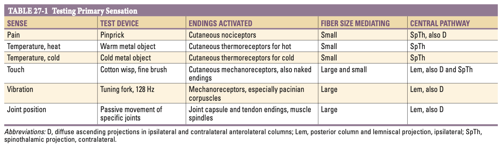
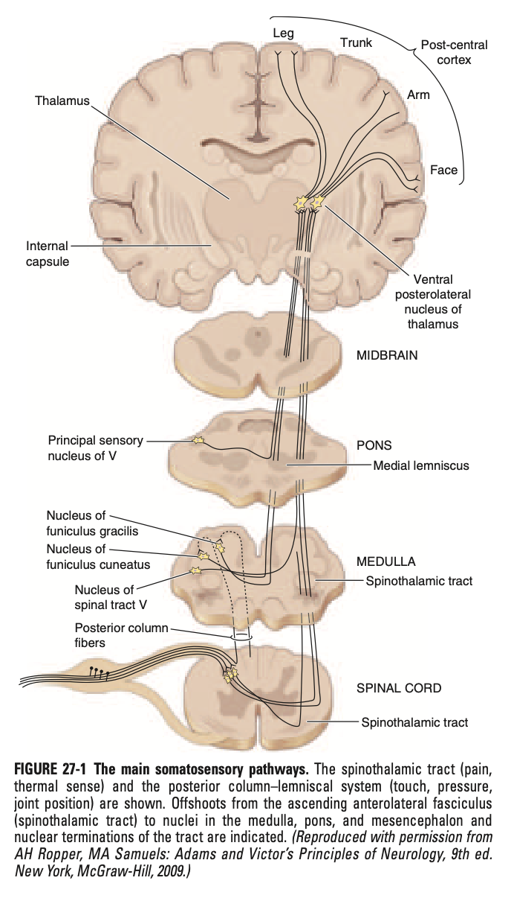

# Ch27 Numbness, Tingling, and Sensory Loss

- **Overview:**
    - <u>Normal somatic sensation</u> - a continuous monitoring process, little of which reeaches consciousness under ordinary conditions
    - <u>Disordered sensation</u> - subjective sensation and objectively demonstrable, an alarming Sx that will dominate the patient's attention especially if painful

## Positive and Negative Symptoms

- **Classification of disordered sensation:**
    - <u>Positive Sx</u> - prototypical Sx being tingling/ parasthesia (pins and needles), while other +ve Sx are described as pricking, bandlike, lancinations (lightning-like shooting feelings) and many more (N.B. most are painful)
    - <u>Negative Sx</u> - loss of sensory function characterised by deminished or absent feeling subjectively described as 'numbness' and objectively demonstrable on sensory examination
- **Positive phenomena** - parasthesia and dysethesia are general terms to denote +ve phenomena:
    - <u>Pathophysiology</u> - trains of impulses generated at sites of lowered threshold or heightened excitability along a peripheral or central sensory pathway, nature and severity dependent on:
        - Number, rate, time and distribution of ectopic impulses
        - Type and function of nervous tissue in which they arise from
    - <u>Descriptors</u> - including but not limited to the following:
        - Pins and needles (parasthesia)
        - Pricking
        - Bandlike or tightening
        - Lightning-like shooting (lancinations)
        - Aching
        - Knifelike
        - Twisting, drawing or pulling
        - Burning, searing or electrical
    - <u>Signs</u> - not necessary associated w/ sensory loss on examination as represent excessive activity in sensory pathway
- **Negative phenomena:**
    - <u>Pathophysiology</u> - loss of sensory function, usually along the peripheral pathway, where nature and severity depends on:
        - Rate of loss of function (gradual loss may go unnoticed and difficult to demonstrate on examination, while rapid loss is associated with both +ve and -ve phenomena)
        - Site of innervation affected
    - <u>Signs</u> - by definition can be demonstrated objectively on physical examination:
        - Possibly requires \> 50% of afferent axons to be functionless before can be demonstrable
        - Subclinical sensory functions may be revealed by 1) sensory NCS, or 2) somatosensory-evoked potentials
- **Sensory signs** - always a measure of -ve phenomena

## Terminology

- **Terminology:**
    - **Terms reflecting a subjective experience of sensory dysfunction:**
        - <u>Parasthesias</u> - typically refers to classical tingling, or pins-and-needles sensations bt may include a wider variety of similar abnormal sensations, **except pain**
        - <u>Dysethesias</u> - general term involving all abnormal sensations regardless of whether a stimuli is present, **including painful experiences**
    - **Terms for objective demonstration of sensory dysfunction on examination:**
        - <u>Hypoesthesia</u> (also hypesthesia) - reduction of cutaneous sensation to a specific type of testing, including pressure, light touch, and warm or cold stimuli
        - <u>Anesthesia</u> - complete absence of skin sensation to the **same stimuli plus pinprick**
        - <u>Hyperesthesia</u> - pain or increased sensitivity in response to touch
        - <u>Hypoalgesia or analgesia</u> - reduced or absent pain perception (nociception)
        - <u>Hyperalgesia</u> - severe paain in response to a mildly noxious stimuli
        - <u>Allodyia</u> - situation in which nonpainful stimulus, once perceived is experienced as painful, even excruciating
        - <u>Hyperpathia</u> - broad term encompassing hyperesthesia, allodynia, and hyperalgesia, where threshold for a sensory stimulus is increased and perception is delayed, once felt is unduly painful
    - **Sensory ataxia** - disorders of proprioception due to sensory dysfunction of the muscle spindles, tendons and joints:
        - <u>Clinical manifestations</u> :
            - Imbalance (particularly in the dark or with eye closed)
            - Clumsiness of precision movements
            - Unsteadiness of gait
        - <u>Signs</u>:
            - Reduced or absent joint position and vibratory sensation
            - Reduced or absent deep tendon reflex
            - Romberg sign +ve (topples over when asked to stand feets together and eyes closed)
            - Pseudoathetosis (continuous involuntary movements of outstretch hands and fingers with eyes closed)
            - Stomping gait

## Anatomy of Sensation

- **Receptors** - each receptor has own Sn to stimuli, size, distinctness of receptive fields:
    - <u>Naked nerve endings</u> - serves as nociceptors (to tissue damaging stimuli), and thermoreceptors (responds to noninjurous thermal stimuli)
    - <u>Encapsulated terminals</u> - mechanoreceptors activated by physical deformation of skin, muscles
- **Somatosensory pathway:** 

    - **Dorsal column-medial lemniscal pathway** (LEM):
        - <u>Sensation</u> - fine touch, vibration, joint position
        - <u>Pathway</u> - first order neurons generally are made of **large myelinated fibres**:
            - Larger axonal fibers subserve tactile, position sense and kinesthesia **ascend ipsilateral in the posterior and posterolateral column**, and synapse at the **gracile and cuneate nucleus of the lower medulla**
            - Axons of second order neurons **decussates** and ascend along the **medial lemniscus** medially in medulla and the tegmentum of the pons, and synapses at the **VPL nucleus of the thalamus**
            - Third order neurons project towards the post-central gyrus of the parietal cortex and other cortical areas
    - **Spinothalamic pathway** (SpTh) - also known as the anterior or anterolateral pathway:
        - <u>Sensation</u> - pain, hot and cold temperature
        - <u>Pathway</u> - first order neurons are made of **smaller fibres**:
            - Smaller unmyelinated fibres subserve nociception, itch, temperature, sensibility and touch **forms polysnaptic projections to the second order neurons**
            - Second order neurons **decussate to the contralateral anterior and lateral columns** of the spinal cord and brainstem, and synapses at the **VPL nucleus of the thalamus**
            - Third order neurons project towards the post-central gyrus of the parietal cortex and other cortical areas
    - **Diffuse fibres system:**
        - Unknown fibres conveys various <u>sensory information from bilateral sides</u> in the <u>anterolateral comparments</u> of the spinal cords
        - This system explains why a complete lesion of the posterior columns could be associated with minmal sensory loss

  
  

## Approach to the Patient with Numbness, Tingling, or Sensory Loss
