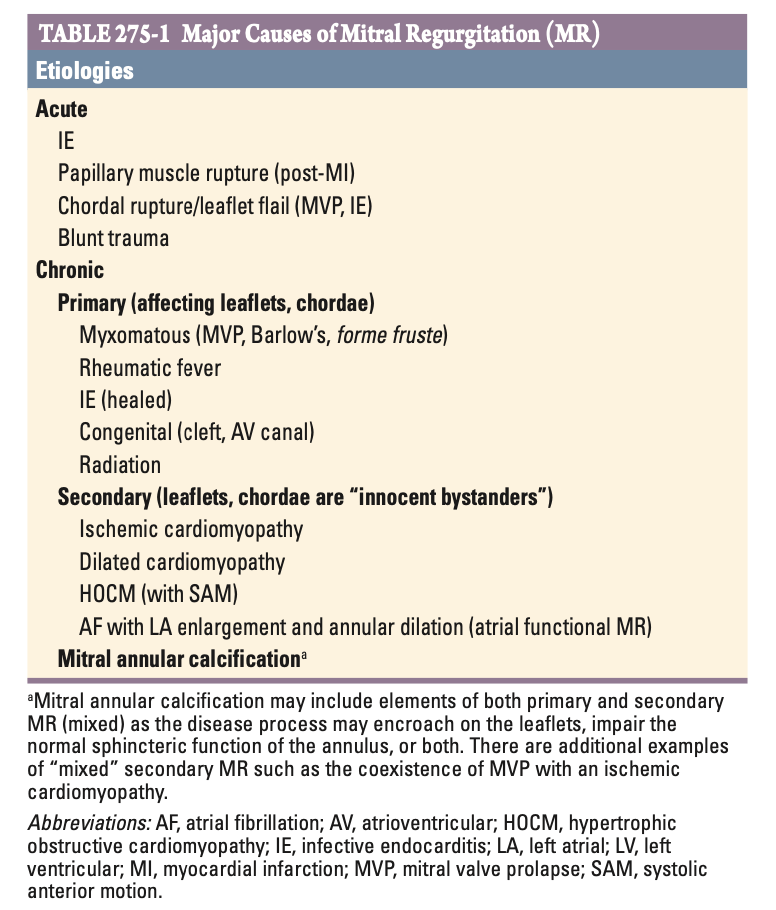
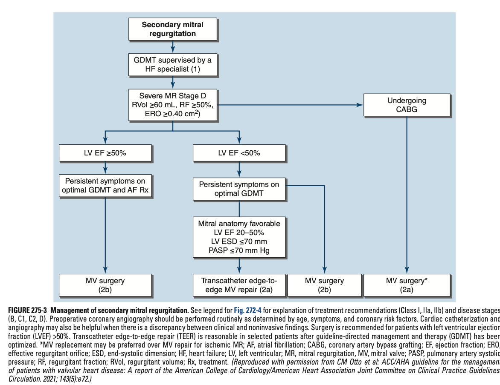

# Ch275 Mitral Regurgitation

## Etiology

- **Definition** - mitral valvular insufficiency resulting in volume overload of the LV, resulting an abnormality or disease process affecting \>= 1 of the 5 functional components the mitral valve apparatus (leaflets, annulus, chordae tendineae, papillary muscles, subadjacent myocardium)
- **DDx of acute MR:**
    - Acute myocardial infarction w/ papillary muscle rupture (posteromedial involvement more frequent than anterolateral involvement due to singular blood suply)
    - Infective endocarditis owing to leaflet perforation or destruction
    - Blunt trauma to the chest
    - Rupture of chordae tendinae resulting in "acute-on-chronic MR" in patients w/ MVP (myxoedematous degeneration of the valvular process)
- **DDx of chronic MR:**
    - **Primary MR** - "degenerative" process inn which leaflets and/or chordae are primarily responsible for abnormal valvular function:
        - <u>Congenital</u>:
            - Cleft anterior MV leaflet - always accompanies ostium primum ASD
            - Atrioventricular cushion defect - high a/w Down syndrome and manifests in 1st year of life
        - <u>Degenerative</u>:
            - Myxomatous degeneration - following MVP, Barlow's, forme fruste
            - Radiation - results in leaflet thickening, retract, and calcification, often a mixed MS/MR
        - <u>Rheumatic fever</u> - rigidity, deformity, and retraction of the valve cusps and comissural fusions, w/ shortening, contraction of the chordae tendinae
        - <u>Infective endocarditis</u> - persistence of the acute MR that develops during the active infection
    - **Secondary MR** - "functional" MR in which leaflets and chordae tendinae are normal but regurgitation is caused by LV/ LA remodelling, annular dilatation, papillary muscle displacement, dyssynchrony, or leaflet teathering:
        - <u>Ischaemic cardiomyopathy</u> - changes in LV size, shape and function after chronic ischaemia or after an acute MI episode
        - <u>Non-ischaemic cardiomyopathies</u>:
            - Dilated cardiomyopathies - irrespective of causes, occurs once LV end-diastolic dimension reaches 6 cm
            - Hypertrophic obstructive cardiomyopathy - dynamic in nature, dependent on SAM of anterior mitral valve leaflet
        - <u>Persistent AF</u> (uncommon) - chronic AF resulting in atrial remodelling and annular dilatation w/ inadequate leaflet lengthening and MR
        - <u>MV annular calcification</u> - often a/w advanced renal disease

  
  

## Pathophysiology

- **Viscious cycle of MR** - "MR begets MR" because:
    - <u>LA dilatation distorts valvular anatomy</u> - places tension on the posterior MV leaflet, pulling it further away from the mitral valve apparatus resulting in increased regurgitation
    - <u>Regurgitation results in LA dilatation</u> - results in volume overload of the LA and subsequently LA dilatation

## Symptoms and Signs

- **Clinical features of chronic MR** - chronic mild-to-moderate, isolated MR is usually asymptomatic:
    - <u>Fatigue</u> - theoretically the initial Sx, as the initial haemodynamic compromise is a reduced cardiac output
    - <u>Dyspnoea</u> - progressive exertional dyspnoea accompanied by orthopnoea and PND are prominent complaints for patients w/ chronic severe MR, and are **susceptible to acute pulmonary oedema**
    - <u>Palpitations</u> - common, and may signify the onset of AF
    - <u>Pulmonary HTN and late-onset RHF</u> - painful hepatic congestion, severe ankle oedema, ascites, and secondary TR may eventually complicate
- **Signs:**
    - <u>Arterial pulses</u> - sharp, low-volume pulse (cf slow-rising pulse in AS) attributable to reduced forward CO
    - <u>Palpation of the precordium</u>:
        - Deviated apex beat laterally
        - Thrusting apex beat (hyperdynamic w/ brisk systolic impulse)
        - Palpable S3
    - <u>Auscultation</u>:
        - HS - silent S1, wide physiological splitting of S2, due to premature closure of the aortic valve
        - S3 - occurs 0.12-0.17s after aortic valve closure caused by rapid filling phase of LV caused by sudden tensing of the MV apparatus (may mimick the rumbling mid-diastolic murmur in the absence of MS)
        - Pansystolic murmur - holosystolic murmur (although early decrescendo systolic murmur occurs in acute MR) most prominent at the apex and radiates to the axilla (ocassionally to the base of heart if chordae tendinae defect mimicking AS murmur)
        - Murmur intensified by isometric exercise but reduced during strain phase of Valsalva maneuver

## Laboratory Examination

## Treatment

- **Principles of Mx:**
    - <u>Medical Tx</u> - consider best medical therapy for patients w/ mild-to-moderate MR, noting that improvement of MR can occur when secondary causes are addressed (e.g. ischaemic cardiomyopathy, dilated cardiomyopathy)
    - <u>Surgical Tx</u> - selection of patients by balancing immediate and long term risks a/w operation
- **Mx of acute severe MR:**
    - Rapid escalation from diuretics, to IV sodium nitroprusside or even MCS for stabilisation
    - Urgent surgery usually indicated if caused by post-MI papillary muscle rupture
- **Principles of medical Tx** - indicated for all patients w/ MR:
    - <u>Anticoagulation</u> - if AF develops:
        - Decision to initiate based on CHA2DS2-VASc score
        - DOACs generally preferred, but warfarin is indicated for those w/ concomittent rheumatic MS, or mechanical heart valve
    - <u>Rhythm control</u> - decision for rate and rhythm control depends largely on AF chronicity, LA size, and clinical context
    - <u>Guideline-directed medical therapy</u> - indicated for secondary MR especially in the setting of ischaemic or dilated cardiomyopathy
    - <u>ABx prophylaxis</u> - prevention of IE indicated for MR patients w/ a prior Hx of IE (which may or may not have caused the MR)

  
  
