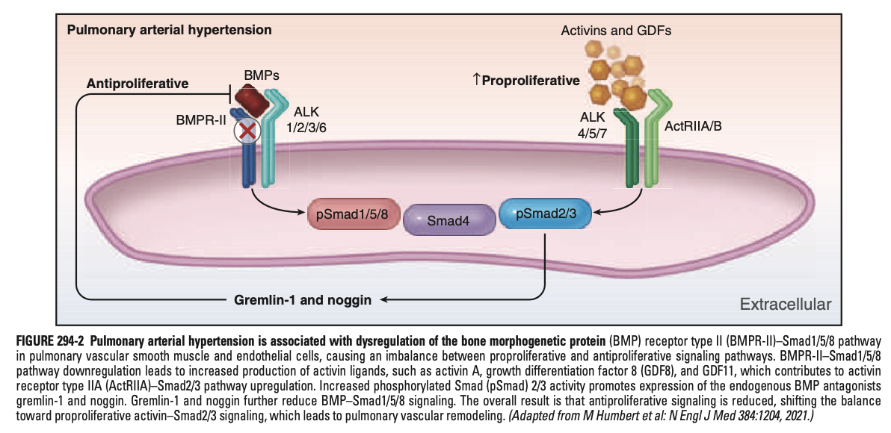
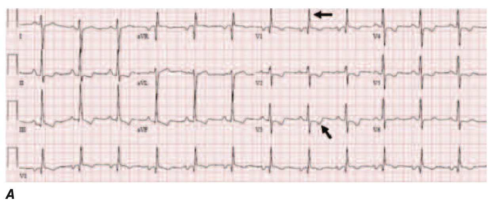
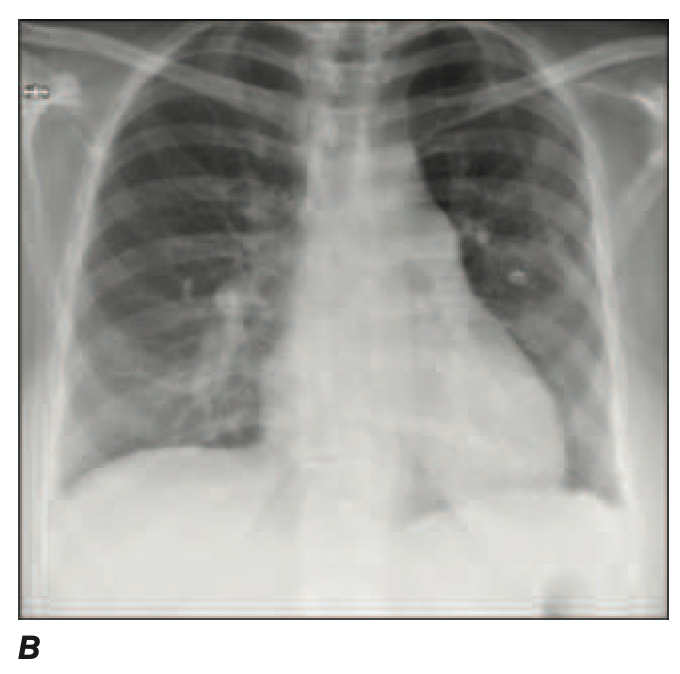
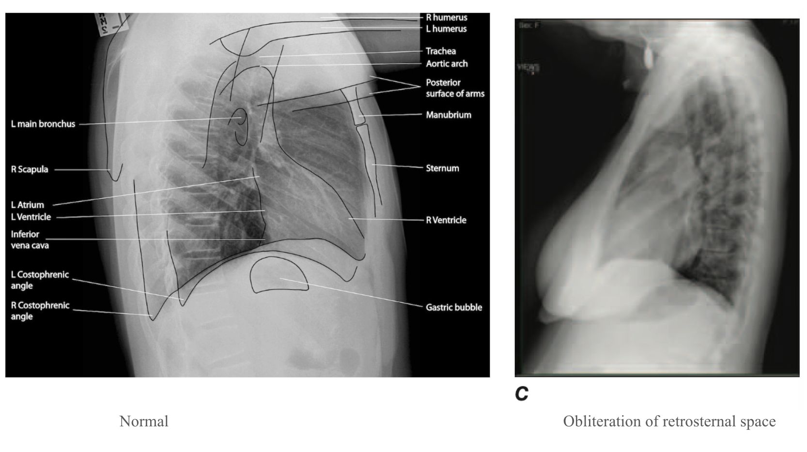
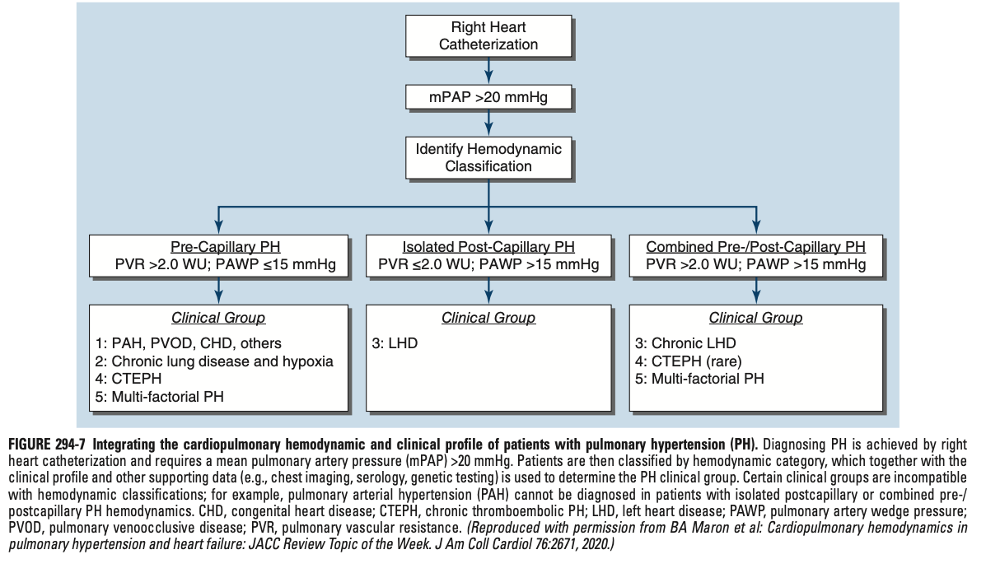
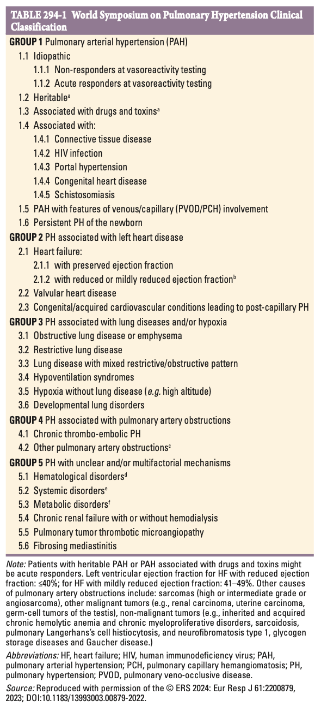
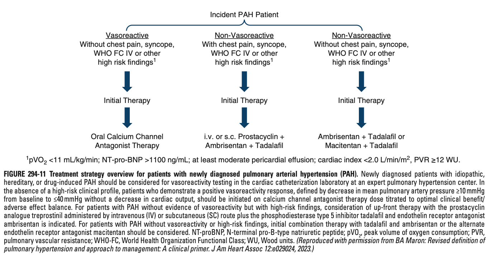
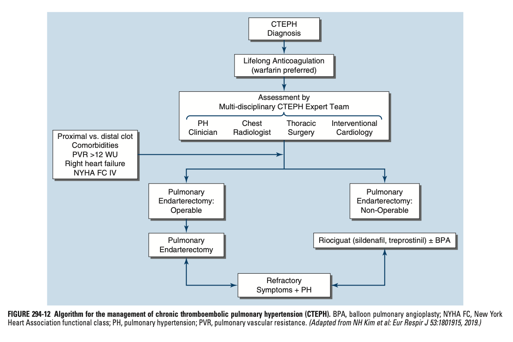

# Ch294 Pulmonary Hypertension

- **Definition** - heterogenous disease involving pathogenic remodelling of the pulmonary vasculature, which increases pulmonary artery pressure and pulmonary vascular resistance (PVR)
- **Most common cause of PH:**
    - Left heart disease
    - Primary lung disease
    - Luminal pulmonary embolism secondary to various haematological, myeloproliferative, and other systemic diseases (less common)
- **Recent advances in Dx of PH** - lowered threshold due to recognition of delay of Dx of up to 2y affecting both QoL and survival:
    - Previously mean pulmonary artery pressure (mPAP) \>= 25 mmHg, lowered to \> 20 mmHg
    - Previous PVR for identification of pre-capillary PH (PAH) \>= 3 WU, lowered to \> 2 WU

## Pathobiology

- **Hypertrophic, fibrotic, and plexogenic remodelling of distal pulmonary arterioles** - from various cellular events such as apoptosis resistance, cell proliferation, dysregulated metabolism, and increased oxidative stress to the local cells:
    - <u>Decreased vascular compliance</u> - often due to plexogenic pulmonary arteriopathy w/ intimal fibrosis from deposition of extracellular matrices, and medial hypertrophy resulting in stiffening of the pulmonary vasculature
    - <u>In situ thrombosis</u> - often a hallmark of pulmonary veno-occlusive disorders, but may be a component of increased PVR
    - <u>Vasoconstriction-dominant phenotype</u> - in minority of cases of PH, requires unique Tx strategies
- **Mechanisms of decompensated RV failure** - no longer only attributed to RV pressure overload:
    - <u>RV afterload</u> - increased afterload due to increased PVR only partly attributes to RV dysfunction
    - <u>Depression of RV sarcomere function</u> - arises from chronic inflammation or autoimmune mechanisms
- **Genetic drivers:**
    - **Genetic drivers underlying incident PAH** - several germline mutations implicated in GWAS:
        - <u>Bone morphogenetic protein receptor-2</u> (BMPR2) - receptor within the family of TGF-beta receptors; is the most common cause of hereditary pHTN:
            - Normal BMPR2 functioning exerts antiproliferative effects, enabling a balance between proliferative (activins and GDFs), and anti-proliferative (inhibins and BMPs) signals
            - LOF mutation of BMPR2 results in imbalance between proliferative and antiproliferative signals implicated in PAH

      
      
        - <u>TBX4 mutation</u> - responsible for regulation of activation of fibroblast growth factor 10
        - <u>SOX17 mutation</u> - responsible for regulation of hepatocyte growth factor
    - **Genetic predisposition to PH in left heart disease** - remains unresolved but certain mutations regarding actin-binding, basement membrane, and MHC have been reported
    - **Genetic predisposition to pulmonary veno-occlusive disease** - variant of EIF2AK4 as established risk factor inherited in autosomal recessive pattern, although clinical expression is evident in wide age range (10-60y)
- **Epigenetics in PH:**
- **Endothelial-Mesenchymal Transition** (EndoMT) - cellular phenotype switching from endothelial cells to mesenchymal cells driven by 1) inflammation, 2) hypoxia, 3) VEGF, and 4) loss of BMPR2 expression
- **Various effects of hypoxia, metabolism, and matrix remodelling** - serve as potential disease-modifying therapeutics:

## Pathophysiology

## Diagnosis

- **Barriers to Dx** - easily missed w/o a reasonable index of suspicion:
    - Non-specific Sx w/ insiduous onset
    - Overlapping Sx w/ many common conditions such as asthma, HFpEF, deconditioning
    - Misconception that patients w/ comorbid cardiopulmonary conditions, PH is a extension of underlying disease rather than a separate clinical entity
- **Signs:**
    - **Signs related to underlying PH** - often unrevealing in early stages, where late stages may manifest as:
        - <u>Edema</u> - LL oedema, ascites
        - <u>JVP</u> - elevated w/ prominant a wave
        - <u>Parasternal heave</u> - present signifying RVH
        - <u>Heart sounds</u> - accentuated P2 component (i.e. audible throughout precordium), w/ right-sided S3 or S4
        - <u>Murmurs</u> - holosystolic murmur best heard over tricuspid area signifying tricuspid regurgitation
    - **Signs related to underlying cause of PH:**
        - <u>Clubbing</u> - may be seen in some chronic lung disease
        - <u>Sclerodactyly and telangiectasia</u> - sigifying lcSSc
        - <u>Basal crepitations and systemic HTN</u> - clues for left-sided systolic or diastolic HF
- **Approach to diagnostic evaluation:**
    - <u>Initial suspicion of pulmonary HTN</u> - ECG, CXR, and echocardiography w/ agitated study as initial screening tests, and functional testing for quantification of disease burden
    - <u>Stepwise diagnostic evaluation of PH</u> - right-heart catheterisation as gold standard, supported by other Ix for evaluation of cause
- **ECG:**
    - <u>RVH</u> - RAD w/ tall R waves in V1, deep S waves in V6
    - <u>RV strain pattern</u> - ST depressions and TWI in V1-V3

  
  
- **CXR** - PA and lateral:
    - <u>Evidence of PH in PA films</u>:
        - Enlargement of pulmonary arteries
        - Peripheral prunning of pulmonary vessels

    
    
    - <u>Evidence of PH in lateral films</u>:
        - Obliteration of retrosternal space indicative of RVH

    
    
- **Echocardiography w/ agitated saline study** (bubble study) - most important screening test for PH:
    - <u>Diagnostic findings</u>:
        - Elevated estimated pulmonary artery systolic pressure \> 35 mmHg
        - Notched wafeform on continuous wave Doppler interrogation of RVOT
        - Hypertrophied or dilated RV supports Dx of PH
    - <u>Additional information regarding etiology</u>:
        - LV systolic function
        - LV valvular disease
        - LAE
        - Intra-cardiac shunting
- **Assessment of functional capacity** - for quantification of disease burden and assessing prognosis:
    - <u>6-minute walk test</u> (6MWT) - primarily for assessment of functional limitation and prognosis
    - <u>Cardiopulmonary exercise testing</u> (CPET) - for differentiation of etiology of dyspnoea
- **Right Heart Catheterisation** (RHC) - invasive cardiopulmonary haemodynamics remains gold standard test to both establish Dx of PH, and guide selection of appropriate medical therapy:
    - <u>Diagnostic findings of PH</u> - mean pulmonary arterial pressure (mPAP) \> 20 mmHg
    - <u>Differentiation between pre-capillary PH and post-capillary PH</u> - based on pulmonary artery wedge pressure (PAWP), which is the perssure when catheter is wedged into the pulmonary capillary bed:
        - Pre-capillary PH - PAWP \<= 15 mmHg
        - Post-capillary PH - PAWP \> 15 mmHg
    - <u>Haemodynamic profiling</u>:
        - Isolated pre-capillary PH (i.e. PAH) - PAWP \<= 15 mmHg and PVR \> 2.0 WU
        - Isolated post-capillary PH - PAWP \>= 15 mmHg and PVR \<= 2.0 WU
        - Combined pre- and post-capillary PH - PAWP \>= 15 mmHg and PVR \> 2.0 WU

    
    
- **Vasoreactive testing** - performed during RHC:
    - <u>Indications</u> - reserved for patients w/ idiopathic or hereditary PAH
    - <u>Procedure and interpretations</u>:
        - Administration of vasodilator w/ short duration of action, such as inhaled NO or inhaled epoprostenol
        - Measurement in changes of mPAP: a decrease by \>= 10 mmHg to absolute level \<= 40 mmHg w/o decrease in CO defined as +ve pulmonary vasodilator response
    - <u>Implication</u> - guides Tx for asymptomatic, low-risk idiopathic/ heretible PAH:
        - Vasoreactive - oral CCB therapy
        - Non-vasoreactive - combination therapy (e.g. ambrisentan/ macitentan + tadalafil)

## Pulmonary Hypertension Classification

- **Sixth World Symposium on Pulmonary Hypertension classification of PH** (2018): 

    - <u>Group 1 PH</u> (PAH) - classified into 1) idiopathic, 2) heritable, 3) association w/ drugs or toxins, 4) disease-associated w/ PAH, 5) other miscellaneous causes
    - <u>Group 2 PH</u> (PH due to left heart disease) - classified into 1) HF-related, 2) left-sided valvular heart disease, and 3) congenital/ acquired cardiac disorders known to cause post-capillary PH
    - <u>Groupe 3 PH</u> (PH due to chronic lung disease or hypoxia) - includes various causes of lung diseases w/ mixed respiratory physiology, and sleep-related disorders
    - <u>Group 4 PH</u> (PH associated w/ pulmonary artery obstruction) - most commonly CTEPH
    - <u>Group 5 PH</u> (PH w/ unclear or multifactorial mechanisms) - see above

## Other Disorders affecting the Pulmonary Vasculature

- **Other disorders affecting the pulmonary vasculature:**
    - Sarcoidosis
    - Sickle cell disease
    - Schistosomiasis

## Pharmacological Treatment of PAH

- **Approach to pharmacological Mx of PAH** - potential druggable pathways include:
    - Prostacyclin signalling pathways (prostanoids and non-prostanoid prostacyclin receptor agonists)
    - Nitric oxide signalling pathways (PDE5i, sGC stimulator)
    - Endothelin receptor signalling pathways (ERA)
    - Activin signalling pathways (Activin signal inhibitors)
- **Prostanoids and prostacyclin receptor agonists** - reduced prostacyclin synthetase expression in PAH offset by administration of either exogenous prostacyclins or a prostacyclin agonist:
    - **Selection:**
        - **Prostanoids:**
            - <u>Epoprostenol</u> - first prostanoid available delivered as a continuous intravenous infusion; short half life (~6 min)
            - <u>Treprostinil</u> - prostanoid delivered as SC injections or inhaled forms; longer half life (~4h)
            - <u>Iloprost</u> - prostanoid delivered as inhaled forms or IV infusions
        - **Non-prostanoid prostacyclin receptor agonists:**
            - <u>Selexipag</u> - oral nonprostanoid diphenylpyrazine derivative that binds to PGI2 receptors at high affinity; longer half life permitting twice-daily dosing
    - **MOA** - in PAH, endothelial dysfunction and platelet activation results in reduced prostacyclin levels and increased TXA2 levels resulting in vasoconstriction and proliferative effects:
        - cAMP-dependent pathway in VSMC to mediate vasodilation
        - Antiproliferative effects on VSMC
        - Inhibition of platelet aggregation
    - **Clinical efficacy:**
        - <u>Prostanoids</u> - epoprostenol, ipoprost, and treprostinil have demonstrated improved pulmonary haemodynamics, Sx, exercise tolerance, and survival in PAH
        - <u>Selexipag</u> - evaluated as add on-therapy on background of ERA, sildenafil or both, demonstrating reduced risk of hospitalisation and disease progression compared w/ placebo
- **Endothelin receptor antagonists** (ERA) - ET-1 levels in PAH associated positively w/ PVR and mPAP and inversely w/ CO and 6-MWD:
    - **ET-1 signalling axis in pulmonary vasaculature:**
        - <u>Pulmonary artery VSMC</u> - express both ETa and ETb receptors mediating **vasoconstriction**
        - <u>Pulmonary artery endothelial cells</u> - express ETb receptors mediating **ET-1 clearance**, and **vasodilation through NO synthase activation and PG release**
    - **Selection:**
        - <u>Non-selective ETa/b receptor antagonists</u> - bosentan, macitentan (optimised receptor-binding activity)
        - <u>Selective ETa receptor antagonists</u> - ambrisentan
    - **MOA** - endothelin receptor antagonism:
        - <u>Blockade of ETa receptors on VSMC</u> - reduced ET-1 mediated vasoconstriction resulting in vasodilation
        - <u>Selective ETa receptor antagonism preserves ETb signalling in endothelial cells</u> - preserves ET-1 clearance and vasodilation through NO synthase activation and PG release
    - **Clinical efficacy:**
        - <u>BREATHE-1 trial</u> - Bosenten results in improvement of Sx, 6-MWD, and WHO FC in patients Tx w/ bosentan compared w/ placebo
        - <u>EARLY study</u> - Bosenten in WHO FC class II patients (early PAH) results in improved pulmonary haemodynamics and 6-MWD compared w/ placebo
        - <u>ARIES-1 trial</u> - Ambrisenten results in improved exercise tolerance, WHO FC, haemodynamics, and QoL compared w/ placebo
        - <u>SERAPHIN trial</u> - macitentan showed reduced risk of composite primary endpoints of PAH-related clinical worsening, including death and disease progression
- **Phosphodiesterase type 5 inhibitors** (PDE5i):
    - **Selection** - sildenafil, tadalafil
    - **MOA** - PDE5 highly expressed in lung vascular tissue (and the corpus carvenosum of the penis):
        - Inhibition of PDE5-mediated hydrolysis (inactivation) of cGMP
        - Maximisation of NO-dependent vasodilation
    - **Clinical efficacy** - improved haemodynamics and 6-MWD
- **Soluble GC stimulators** (sGC stimulators):
    - **Selection** - riociguat
    - **MOA** - sGC stimulators, resulting in increased <u>cGAMP production</u> in a NO-dependent and -independent manner:
        - <u>NO-dependent pathway</u> - stabilisation of the molecular interaction between NO and sGC
        - <u>NO-independent pathway</u> - direct stimulation of sGC irrespective of NO bioavailability
    - **Clinical efficacy:**
        - Riociguat a/w improved ET, pulmonary haemodynamics, WHO FC, and time to clinical worsening compared w/ placebo
        - Serves as sole pharmacotherapy for CTEPH for whom surgical pulmonary endarterectomy is ineffective or C/I
- **Activin signal inhibitor therapy** - sotatercept rebalances the TGF-beta-BMPR2 pathway

## Approach to PAH Treatment

- **Principles of Mx:**
    - <u>Goals of therapy</u> - achievement of low clinical risk profiles
    - <u>Approach to therapy</u>:
        - Pharmacological therapy - early, aggressive combination therapy to target pathobiologic and pathophysiological events from plexogenic vascular remodelling
        - Supportive measures and risk factor modification - low-sodium diet, MRA as diuretics as tolerated, supplemetnl O2, prescription exercise
- **Low clinical risk profiles** - low mortality risk (\< 5%):
    - Minimal Sx
    - WHO FC I or II
    - 6-MWD \> 440m
    - Cardiac index \>= 2.5 L/min/m2
- **Escalation of pharmacological therapy in incident PAH** - guided by 1) vasoresponsiveness, and 2) clinical risk profiles: 

    - <u>AMBITON trial</u> shows that <u>early aggressive combination therapies w/ ambrisentan and tadalafil</u> a/w 50% reduce risk of composite outcomes of clinical worsening compared w/ monotherapy (registry studies showed that dual therapy w/ any PDE5i and ERA shows improved outcomes compared to those on monotherapy suggesting that benefits may not be drug-specific)
    - Expansion of early, aggressive pharmacotherapy to up-front triple combination therapy, but results remain mixed, likely driven by S/E when multiple vasoactive drugs initiated at the same time especially w/ limited haemodynamic reserve in a paitent w/ advanced PAH

## Management of Other Groups of Pulmonary Hypertension

- **Mx of PH due to lung disease** - currently one-size-fit-all model w/ use of inhaled iloprost, but unsure whether generalisable to all lung-PH phenotypes:
    - <u>Inhaled iloprost</u> as mainstay of Tx, but w/ limited evidence, substantial rates of Tx attrition (likely due to frequent dosing)
    - At least one trial demonstrates improved ET and 6-MWD in those w/ <u>ILD-PH</u>
    - At least one study for <u>COPD-IH</u> terminated due to lack of benefits or adverse effects
- **Mx of CTEPH:** 

