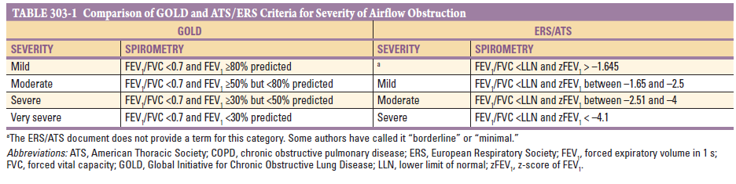

# Ch303 Chronic Obstructive Pulmonary Disease

- **Definition** - per GOLD guidelines, COPD is a clinical syndrome defined as:
    - A preventable and treatable disease state
    - Characterised by a persistent, irreversible and progressive clinical course
    - Of respiratory signs and symptoms reflecting chronic airflow limitation (reflected by spirometry)
    - Attributable to a noxious environmental exposure, most commonly products of combustion
- **Other terminologies** - likely reflect varying degree in a spectrum of COPD patients, usually not fitting the classical definition due to absence of airflow limitation:
    - <u>Emphysema</u> - patho-anatomically defined as destruction of lung alveoli with air space enlargement
    - <u>Chronic bronchitis</u> - clinically defined as chronic cough and sputum not attributable to another condition
    - <u>Small airway disease</u> - condition in which small broncioles are narrowed and reduced in number
- **Epidemiology:**
    - <u>Prevalence</u> - 480 million individuals with COPD worldwide (projection of 592 million by 2050)
    - <u>Burden</u> - 4th leading cause of death in the US

## Pathology, Pathogenesis, and Pathophysiology

- **Pathoanatomy of COPD** - cigarrette smoke exposure can affect 1) large airways, 2) small airways and 3) alveoli, the most clinically significant physiological marker being the resultant airflow limitation:
    - **Large airway disease:**
        - <u>Mucus hypersecretion</u> - loblet cell hyperplasia and mucus gland enlargement (+/- increase in extent in bronchial tree) leading to <u>cough and sputum</u> (mucus plugs seen in CT) seen in <u>chronic bronchitis</u>
        - <u>Bronchial hyper-reactivity</u> - hyper-reactivity of large areas attributes to airflow limitations, which is not seen in asthma
        - <u>Chronic inflammation</u> - neutrophilic influx associated with purulent sputum during respiratory tract infections
        - <u>Squamous metaplasia</u> - in response to noxious exposures and attributes to carcinogenesis and disrupts mucocilliary clearence (predisposes to infections)
    - **Small airway disease** (\< 2mm in diameter):
        - <u>Luminal narrowing</u> - caused by smooth muscle hypertrophy, fibrosis, mucus, edema and cellular infiltrates
        - <u>Goblet cell metaplasia</u> - replacing surfactant-secreting club cells resulting in increased surface tension predisposing to airway narrowing and <u>collapse</u>
        - <u>Parenchymal destruction</u> - narrowing and drop-out of small airways typically followed by onset of emphysematous destruction
    - **Lung parenchyma destruction and progression to emphysema** - various inflammatory infiltrates distal to terminal bronchioles results in obliteration alveolar wall perforation and subsequent obliteration and coalescence into large emphysematous air spaces:
        - <u>Centrilobular emphysema</u> - most common type w/ cigarette smoking with initial enlargement of air spaces in association with respiratory bronchioles, most prominent in upper lobes and superior segments of lower lobes
        - <u>Panlobular emphysema</u> - typically seen with A1AT deficiency, abnormally large spaces evenly distributed within and across acinar unit, with a predilection of lower lobes
        - <u>Paraseptal emphysema</u> - may be seen in chronic smokers, with distribution along pleural margins with relative sparing of the lung core or central regions
- **Pathogenesis of emphysema** - 4 interrelated events leading to emphysema: 

    - **Chronic noxious exposure in genetically susceptible individual** - triggers **inflammatory and immune cell recruitment** within **large and small airways** and in the **terminal air spaces**
    - **Inflammation and Proteinase-anti-proteinase imbalance** - damage extracellular matrix, vasculature and gas exchage surfaces:
        - <u>Elastase:antielastase hypothesis</u> - balance of elastin-degrading enzymes (serine protease and MMPs) and their inhibitors determines susceptibility to lung destruction and emphysema, observed in A1AT deficiency and animal models
        - <u>Oxidative-stress as key inciting componant of COPD pathobiology</u> - macrophage activation through oxidant-induced inactivation of histone deacetylase-2 (HDAC2), exposes NF-kappaB, leading to transcription of MMPs and cytokines (IL-8, TNF-alpha) that mediateneutrophil recruitment
        - <u>CD8+ T cells</u> - may release IP-10, CXCL-7 that result in macrophage production of MMP12
    - **Structural cell death through oxidant-induced damage** - 'premature aging of the lung' associated with cell death and additional mechanisms associated with cell senescence, beyond shifting altering proteinase expression
    - **Ineffective repair** - disordered repair of elastin and other ECM contributes to air-space enlargement and emphysema
- **Pathophysiology of COPD** - persistent irreversible airflow limitation is the defining abnormality in COPD:
    - **Airflow limitation** - persistent and irreversible, as demonstrated by a chronically reduced FEV1/FVC ratio that does not normalise following bronchodilation treatment, attributing to wheeze, dyspnoea and prolonged expiratory phase
    - **Hyperinflation** - as a compensatory mechanism for airflow limitation to **preserve maximum expiratory airflow**, as increased lung volume favours mechanics of breathing through, 1) elastic recoil pressure increases, and 2) airway enlarges and airway resistance decreased:
        - <u>Flattening of the diaphragm</u> - results in the following adverse effects on ventilation:
            - Decreased zone of apposition between diaphragm and the abdominal wall, preventing effective transfer of +ve intrabdominal pressure to chest wall during inspiration
            - Non-optimal 'zone of overlap' during cross bridge formation, as muscle fibres in the flattened diaphragm are shorter than those of a more normally curved diaphragm
            - Greater tension needed by the flattened diaphragm to create the same transpulmonary pressure required to produce tidal breathing
            - Abnormal chest wall static mechanics as additional work from inspiratory muscles necessary to overcome resistance of the thoracic cage rather than gaining the normal assistance from the outward recoil pressure of the chest wall at resting volume
        - <u>Progressive hyperinflation during tachypnoea</u> - due to shortened expiratory time, resulting in progressive air trapping which manifests as **progressive exertional dyspnoea**
        - <u>Changes in lung volume studies</u> - disease progression identified by two pathophysiological processes defined on lung volume studies:
            - Air trapping - increased RV and increased RV/TLC ratio
            - Progressive hyperinflation - increased TLC
    - **Gas exchange abnormalities** - typically attributed to **VQ mismatch** caused by non-uniform ventilations (regional differences in compliance and airway resistance) with minimal shunting, such that **modest elevations of FiO2 is typically required to correct hypoxaemia**

## Risk Factors and Natural History

- **Risk factors of COPD** - by definition, a diagnosis of COPD requires the presence of a chronic noxious exposure:
    - **Cigarette smoking and novel forms of smoking** - long established as a major risk factor of COPD by the Advisory Committee to the Surgeon General of the United States (1964):
        - Longitudinal studies showed <u>accelerated decline in FEV1</u> in a dose-response relationship, which also partly explains higher prevalence of COPD with increasing age
        - Marked <u>individual variability</u> in response to smokings, where only 15% of variability of FEV1 is attributable to pack-years
        - Additional developmental, environmental +/- genetic factors contribute to the impact of smoking on chronic airflow limitation
        - Cigar and pipe smoking have less compelling evidence supporting their associations with COPD possibly due to lower dose of inhaled tobacco by-products
        - E-smoking and vaping has indentified increased risk of pulmonary Sx but not COPD per say

    
    
    - **Airway responsiveness** - while often viewed as different disease mechanisms (allergic vs inflammatory), chronic asthma and COPD may likely share similar environmental and genetic factors, such that asthma and airway responsiveness are risk factors of COPD:
        - A study from the Childhood Asthma Management Program demonstrated that Asthmatics with low baseline lung functions were likely to develop persistent airflow airflow obstruction in early adulthood
        - The associatin is particularly relevant for childhood asthmatics who chronically smoke throughout adulthood
    - **Respiratory infections** - controversial relationship between chest infections and declining lung functions in normal subjects, but significant in COPD patients:
        - COPDGene and ECLIPSE studies showed AECOPD due to respiratory tract infections are associated w/ increased loss of lung function longitudinally, especially among those individuals with better baseline lung functions
        - Childhood respiratory illnesses, especially TB (tuberculosis-associated COPD) may increase risk of COPD in later life but lacks convincing longitudinal data
        - HIV infection is an increased risk of COPD and emphysema from opportunistic chest infections, and is frequently underdiagnosed in this setting
    - **Occupational expposures** - airflow obstruction is suggested to result from exposure to vapors, gas, dust or fumes (VGDF):
        - Non-smokers in these occupations can develop some reduction in FEV1, but unsure whether it is an independent risk factor or confounded by second-hand cigarette exposure during occupation
        - Coal mine dust exposure was a significant risk factor for emphysema irrespective of smoking status
    - **Air pollution and climate change** - increased respiratory symptoms in those living in urban compared to rural areas, but relationship w/ COPD is unproven
    - **Early-life passive smoke exposure** - esp. with maternal tobacco smoking during in utero development
    - **Genetic fators:**
        - <u>Alpha-1-antitrypsin deficiency</u> (S, Z or null allele) - proven genetic risk factor, although studies showed ascertainment bias in that genetic testing is performed after COPD diagnosis (fraction of A1AT deficiency patients developing COPD is unknown, and age of COPD onset is unknown)
        - <u>Other genetic risk factors</u> - GWAS showed \> 80 regions, particularly region near HHIP gene on chromosome 14 etc.
- **Normal trajectory of pulmonary function in a healthy individual** - individuals tend to track their quantiles of pulmonary function based on environmetal and genetic factors that put them on different tracts:
    - Steady trajectory of increasing pulmonary function in childhood and adolescence
    - Plateau in early adulthood
    - Gradual decline with aging starting from 4th decade of life
- **Natural Hx of COPD** - altered trajectory with accelerated decline of pulmonary function resulting in clinical disease:
    - Onset and rate of decline function depends on intensity, timing of noxious exposure (cigarette smoking) and baseline lung functions
    - Subsequent rate of decline in pulmonary function can be modified by changing environmental exposures (i.e. smoking cessation), especially at an earlier age providing the most beneficial effects
    - Absolute annual loss in FEV1 is highest in mild COPD and lowest in severe COPD

  
  
- **Natural Hx of other COPD-like disease entities:**
    - <u>Pre-COPD</u> - presence of substantial chest CT changes (emphysema and airway wall thickening) with normal spirometry in patients at risk of COPD progress in two patterns: 1) emphysema-predominant vs 2) airway predominant
    - <u>Preserved ratio-impaired spirometry (PRISm)</u> - reduced FEV1% predicted despite normal ratio is a/w increased risk of mortality, cardiovascular, and respiratory events (GOLD-Unclassified Smokers, AJRCCM 2011)
- **Risk of mortality from COPD** - a/w:
    - Reduced levels of FEV1
    - Presence of emphysema

## Clinical Presentation

- **Hx:**
    - Cardinal Sx of cough, sputum production, and progressive exertional dyspnoea are often present for months to years prior to first presentation, but many patients date the onset of disease to day of acute exacerbation (N.B. careful Hx probing Sx prior to first presentation is important)
    - Dyspnoea often described as chest tightness, increased effort to breath, air hunger or gasping, but can be insidious
    - Reduced exercise tolerance is insidious, and is best elicited by careful history focused on typical physical activities and have patients ability to perform them has changed (?individualised metric):
        - Characteristically activities involving significant arm work are poorly tolerated (due to difficulty in recruiting accessory muscles), while activities that enable patients to brace their arms (pushing shopping cart, walking on trendmill) are better tolerated
        - Principle feature of progressive dyspnoea is characterised by intrusion of ability to perform vocational and avocational activities
        - Final stage is characterised by breathlessness doing basic activities and resting hypoxaemia
    - Hx to elicit common comorbidities such as cardiovascular disease, gsatroesophageal reflux, osteoporosis, frailty, depression, anxiety
- **P/E:**
    - **General examination:**
        - <u>Cachexia</u> - weight loss and diffuse loss of subcutaneous adipoe tissue due to poor oral intake and pro-inflammatory cytokines and is an **independent poor prognostic factor**
        - <u>Cyanosis</u> - visible on lips and nail beds suggesting resting hypoxaemia signifying advanced disease
        - <u>Clubbing</u> - not a sign of COPD, but new-onset clubbing raises suspicion of CA lung
    - **Respiratory examination:**
        - <u>Cardinal features of COPD</u> - tripod position, recruitment of accessory respiratory muscles, barrel chest etc.
        - <u>Hyper-resonnance on percussion</u> - increased resonnance w/ poor diaphragmatic excursion
        - <u>Airflow limitation on auscultation</u> - prolonged expiratory phase w/ diffuse expiratory wheeze (+/- focal crackles if superimposed chest infections)
    - **Cardiovascular examination:**
        - <u>LL oedema</u> - classically attributed to cor pulmonale but is due to salt and water retention by the hypoxic hypercapnic kidney
        - <u>Parasternal heave and elevated JVP</u> - overt RHF
        - <u>Loud P2</u> - pulmonary HTN, especially if persistent activity limitations or LL oedema
- **Ix:**
    - **Pulmonary function test** - diagnostic:
        - <u>Spirometry</u> - severuty grading by FEV1 predicted using population-reference equations (N.B. ERS now advocates for population defined Z-scores to remove race as a factor): 
        
        - <u>Lung volumes</u> - increased TLC, RV, FRC w/ worsening disease
        - <u>DLCO</u> - reduced w/ emphysema reflecting parenchymal destruction
    - **Routine bloods** - CBC, RFT, ABG:
        - <u>Hb and HCT</u> - polycythaemia secondary to chronic hypoxaemia and right ventricular hypertrophy
        - <u>Eos</u> - guides stable Mx to reduce exacerbation risks
        - <u>RFT</u> - rough estimate of compensation to respiratory acidosis
    - **CXR** - hyperinflation +/- obvious emphysematous changes (bullae, hyperlucency, paucity of parenchymal markings)
    - **CT** - definitive for presence of emphysema and detection of concurrent ILDs, or bronchiectasis
    - **6-min walk test** - measurement of exercise tolerence
    - **A1AT deficiency testing** - guideline suggests testing in all (caucasian) subjects:
        - <u>Serum A1AT levels</u> - as initial test
        - <u>MS or molecular genotyping</u> - determining PI variants (M, S, and Z)
- **BODE index** - better predictor of mortality than spirometry alone:
    - Body mass index
    - Airflow obstruction
    - Dyspnoea
    - Exercise tolerance
- **Dx** - spirometrically-confirmed Dx

## Treatment

- **Goals of Mx:**
    - <u>Symptomatic relief</u> - reduce respiratory symptoms, improve ET, improve physical health
    - <u>Reduce future risk</u> - prevent disease progression, prevent and Tx exacerbations, reduce mortality
- **Approach to individualised therapy** - based on Sx evaluation and risk of exacerbation: 

- **Evidence for existing therapy:**
    - Smoking cessation, LTO2 in chronically hypoxaemic patients, and lung volume reduction surgery in selected patients with emphysema have strong evidence demonstrating improved survival
    - Evidence less strong for early NIV during hospitalisation, pulmonary rehabilitation programmes and lung transplant
    - Triple-inhaled therapy have shown to reduce mortality
- **Principles of Mx:**
    - **Pharmacological therapy:**
        - <u>Initial pharmacological therapy</u> - based on symptomatology and exacerbation Hx: 
        
        - <u>Escalation of pharmacological therapy</u> - if persistent Sx or exacerbations refractory to therapy: 
        
    - **Non-pharmacological therapy** - vaccination, pulmonary rehabilitation, lung volume reduction surgery, lung transplantation
- **Bronchodilators** - short-acting bronchodilators prn + maintenance long-acting bronchodilators:
    - **Muscarinic antagonists:**
        - <u>Selections</u>:
            - SAMA - ipratropium bromide
            - LAMA - aclidinium, glycopyrrolate, glycopyrronium, tiotropium, umeclidinium, revefenacin
        - <u>Clinical efficacy</u>:
            - SAMA symptomatic improvement by increasing FEV1
            - LAMA symptomatic relief and **prevents exacerbation** (according to a Cochrane meta-analysis and thus preferred)
        - <u>S/E</u> (typically minor):
            - Dry mouth
    - **Beta agonists:**
        - <u>Selection</u>:
            - SABA - salbutarol
            - LABA - arformoterol, formoterol, indacaterol, olodaterol, salmeterol, vilanterol
        - <u>Clinical efficacy</u> - symptomatic relief and reduced exacerbations (lesser extent than LAMA)
        - <u>S/E</u>:
            - Tremors
            - Tacahycardia
    - **Combined LABA and LAMA** - indications if very symptomatic or w/ exacerbations
- **Inhaled corticosteroids** - main role to reduce exacerbations and does not provide symptomatic improvement:
    - <u>Indications</u>:
        - Definite indications if Eos \> 300 w/ exacerbations
        - Contemplated by considering benefits to risk if Eos \> 100 w/ frequent exacerbations despite dual bronchodilator therapy
    - <u>Clinical efficacy</u> - according to population studies:
        - No benefit if Eos \< 100
        - Increasing benefit as Eos increase beyond 100
    - <u>Withdrawal</u> - considered in stable patients w/o exacerbations (demonstrated to not increase risk of exacerbations)
    - <u>S/E</u>:
        - Infections - oropharyngeal candidiasis, pneumonia
        - Osteoporosis or osteopenia
        - Cateracts
- **Oral glucocorticoids** - not used for stable COPD due to unvafourable benefit to risk ratio
- **PDE4 inhibitors** (Roflumilast):
    - <u>Clinical efficacy</u>:
        - Mainly to reduce exacerbations of COPD, chronic bronchitis in patients w/ refractory exacerbations
        - Minimal effect on airflow obstruction and respiratory Sx
    - <u>S/E</u>:
        - N/V
        - Diarrhoea
        - Weight loss
- **Macrolides:**
    - <u>Selection</u> - azithromycin (selected due to anti-inflammatory and anti-microbial effects)
    - <u>Clinical efficacy</u> - RCT demonstrates:
        - Daily azithromycin in patients w/ Hx of exacerbation in past 6 mo shown to have less exacerbation and longer time to first exacerbation
    - <u>S/E</u>:
        - Hearling loss
        - TdP (avoided in prolonged QTc)
        - Development of macrolide-resistant organisms
- **IL-4/IL-13 inhibitor** - Dupilumab:
    - <u>Indications</u> - severe COPD w/ Eos \> 300 w/ frequent exacerbations despite triple therapy
- **A1AT augmentation therapy:**
    - <u>Indications</u> - serum A1AT levels \< 11 microM (typically PiZ patients) w/ diagnosed COPD
    - <u>Clinical efficacy</u> - controversial

## Exacerbations of COPD
