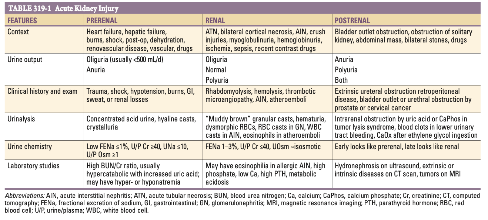
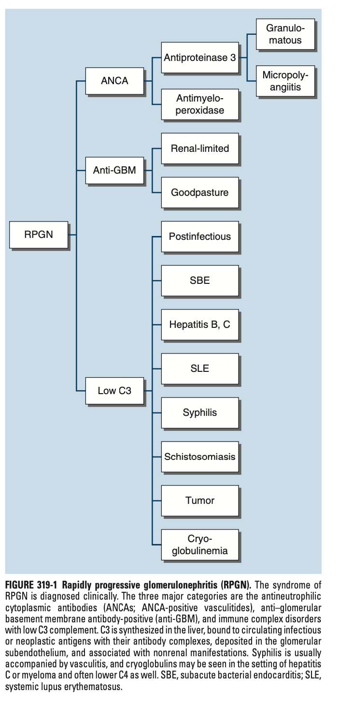
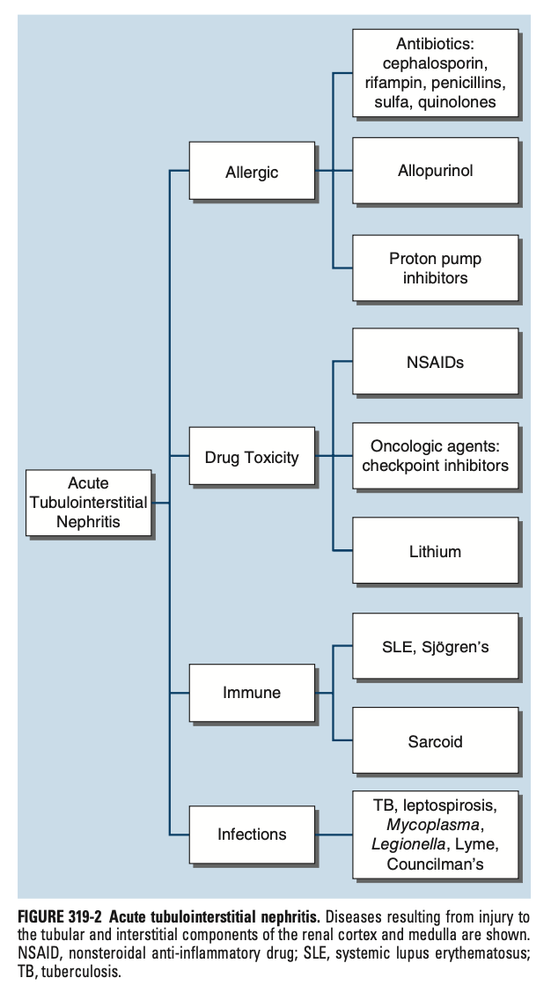

# Ch319 Approach to the Patient with Renal Disease or Urinary Tract Disease

- **Principles of clinical manifestation of renal disorders** - distinction clear only in the acute phase (glomerular disease will eventually impact the tubulointerstitum while tubulointerstial disease will progress to glomerosclerosis):
    - <u>Glomerular disease</u> - albuminuria as the disease hallmark
    - <u>Tubulointerstial disease</u> - electrolyte disorders or disorders of dilution and concentration of urine
- **3 pathways of the complement cascades:**
    - <u>Classical pathway</u>
    - <u>Alternate pathway</u> - activating signal is the presence of the antigen-antibody immune complexes (IC), and hence sites of inflammation are tissue deposits of such ICs
    - <u>Lectin-binding pathway</u>
- **Role of C3** - important in the classical, alternate, and lectin pathways:
    - <u>C3 convertase</u> - C3 cleaved into C3a and C3b
    - <u>Role of C3b</u> - pro-inflammatory effects including 1) amplification loop for C3, 2) production of C4/5, 3) activation of Ab production, and 4) formation of MAC
- **Principles of evaluation of a patient with potential renal impairments:**
    - Blind investigations is time-consuming and wasteful as it would yield a long list of DDx
    - Review of Hx and P/E before targeted texting to identify a particular disease process

  
  

## Nephritic Syndromes

- **Definition** - inflammatory condition of the kidneys, further subdivided depending on the inflamed structure within the kidneys
- **Pathophysiological origins of nephritic syndrome:**
    - Infection (or post-infection)
    - Autoimmune
    - Allergic
    - Toxic
- **Classification of nephritic syndrome based on microstructure involved:**
    - Glomerulonephritis
    - Tubulointerstitial nephritis
    - Vascular
- **Clinical manifestation of nephritic syndromes:**
    - <u>Abnormal urinalysis or other renal manifestations</u> - dependent on the microstructure affected
    - <u>Flank tenderness</u> - due to distension of the renal capsule, resulting in point tenderness over the flank, or sometimes exquisite costovertebral angle tenderness, requiring gentle palpation for Dx

### Glomerulonephritis

- **Clinical manifestations of glomerulonephritis:**
    - <u>Features of volume expansion</u> - presents with oedema (+/- ascites), hypertension, or pulmonary oedema w/ orthopnea and exertional dyspnoea in elderly
    - <u>Abnormal urinalysis</u> - may present in a nephritic or nephrotic patterns
    - <u>Oliguria or anuria</u> - low urine output and ocassionally anuria, w/ low urine Na content and concentrated urines reflecting salt and water retention
- **Histological findings on renal biopsy correlates to clinical presentations:**
    - <u>Acute GN</u> - acute inflammatory, proliferative or necrotising features
    - <u>Chronic GN</u> - sclerotic and necrotic findings of GN
- **Post-infectious glomerulonephritis** (PIGN) - classical form of acute GN, to be <u>distinguished from infection-associated GN</u>:
    - **Epidemiology** - decreasing incidence due to widespread availability of ABx
    - **Pathophysiology** - absence of ongoing infection at time of presentation in the ABx era:
        - <u>Group A streptococcal infection</u> - Ag of a nephritogenic strain of GAS 10 days to 3 weeks following acute pharyngitis or skin infection (e.g. impetigo)
        - <u>Formation and deposition of immune complexes</u> - Anti-streptolysin O (Anti-SLO) complexes w/ bacterial Ag and deposits within the glomeruli, particularly subendothelium (humps)
        - <u>Activation of alternate complement cascade</u> - results in intense inflammation, cellular proliferation , exhaustion of C3, and urinary sediment formation:
            - Glomerular demage - results in urinary sediment formation
            - Cellular proliferation - decreased filtering surface area resulting in pre-renal salt and water retention
            - Bloodless capillaries - proliferation disrupts capillary blood flow
        - <u>Clearance of subendothelial deposits</u> - nephritic signs progressively clear
    - **DDx:**
        - <u>Infection-associated GN</u> - a/w an **ongoing** staphylococcal infection (often MRSA)
        - <u>Sympharyngitic haematuria</u> (IgAN) - more likely to present w/ gross haematuria (heavier excretions), but lowering of C3 to a lesser extent compared w/ PIGN
- **IgA nephropathy:**
    - **Epidemiology** - common form of GN (esp. in Asia), leading causes of renal failure worldwide
    - **Pathophysiology** - mesangial C3 deposits to excess galactose-deficient IgA1
    - **Clinical manifestations:**
        - HTN
        - Proteinuria
        - Sympharyngitic haematuria
    - **Dx** - historically clinical Dx, but now pathological Dx requiring Bx as rapid GFR decline has encouraged use of renal pathology to guide aggressive Mx strategy
    - **Prognostic factors** - high risk APOL1 allele have more rapid GFR decline
    - **Mx:**
        - Removal of lymphoid tissues such as tonsillectomy (historical)
        - Corticosteroids
        - Mx of HTN and proteinuria (ACEi/ARB, oral dual endothelin I angiotensin II antagonist)
        - Targetted therapies (Complement blockade such as Avacopan, B cell therapies, plasma cell therapies)
- **Rapidly progressive glomerulonephritis** (RPGN) - syndrome arising from variety of GN defined pathologically:
    - **Pathophysiology:**
        - Cellular crescents - proliferation of glomerular parietal epithelial cells and inflammatory infiltrates to reduce surface area
        - Progression to glomerulosclerosis - N.B. focal segmental necrotising GN must be differentiated from primary FSGS which is a podocytopathy
    - **Clinical features of RPGN** - typically manifest as nephritic syndrome with other features suggesting underlying causes:
        - <u>Nephritic syndrome</u> - typical signs of haematuria, subnephrotic proteinuria, HTN, renal impairment seen
        - <u>Other diagnostic features</u>:
            - Pulmonary-renal syndromes (haemoptysis)
            - ILD
            - Hx of asthma (Churg-Strauss)
            - Sinusitis, nasal congestion, nasal blockade
    - **Distinguishing RPGN causes:**
        - <u>Demographic</u>:
            - Goodpasture syndrome - elderly population or young males who have Hx of inhaling hydrocarbon solvents; but not for patients w/ hereditary nephritis
        - <u>Clinical course</u> - Anti-GBM disease typically a/w single acute fulminant presentation, pauci-immune/ vasculitides a/w historical subclinical events at different times
        - <u>Other diagnostic features</u> - see above
        - <u>Rapid diagnostic evaluation</u> - ANCA, Anti-GBM serologies, C3

    
    
    - **Mx** - dependent on underlying causes:
        - <u>Anti-GBM disease</u> - plasmapharesis, anti-inflammatory medications, immunotherapy (cyclophosphamide or rituximab)
        - <u>ANCA-associated vasculitides</u> - treat the vasculitides

### Acute tubulointerstitial nephritis

- **Causes of acute TIN** - allergic, autoimmune, infectious, drug toxicity: 

    - <u>Allergic/ drug toxicities</u>:
        - NSAID (a/w heavy proteinuria)
        - ABx - ampicillin (a/w heavy proteinuria), other penicillins, cephalosporins, fluoroquinolones
        - PPIs (higher risk if already on ICIs)
        - ICIs
        - Lithium
    - <u>Autoimmune</u> - lupus nephritis, Sjogren's syndrome, Tubuolointerstital nephritis uveitis (TINU) syndrome (a/w painful red eyes and photophobia)
    - <u>Infectious</u> - Councilman's nephritis (scarlet fever), TB, Leptospirosis, Mycoplasma\< Legionella, Lyme's disease
- **Clinical features of acute TIN** - typically presents 1-2 weeks following exposure, change in dose, or re-exposure of drug:
    - <u>Classical triad of fever, rash and eosinophylia</u> - typical w/ certain types of penicillins cephalosporins, fluoroquinolones, and ICIs
    - <u>Features of tubular dysfunction</u>:
        - Hypo- or hyperkalaemia
        - Hyperchloremic metabolic acidosis
        - Nephrogenic diabetes incipidus
    - <u>Polyuria</u> - impaired water retention may or may not be a/w underlying AVP-R
    - <u>Bilateral flank tenderness</u> - inflammed kidney distending capsule
- **DDx of granulomatous interstitial nephritis:**
    - <u>Non-caseating</u> - rifampicin, ocassionally other drugs
    - <u>Caseating</u>:
        - TB (charactersitically first granulomas connected to cortex where O2 tension highest)
        - Sarcoid
        - Histoplasmosis

### Chronic tubulointerstitial nephritis

### Proteinuric states and nephrotic syndrome

## Haematuria and Lower Urinary Tract Syndromes

## Acute Kidney Injury

## Chronic Kidney Disease and the Uraemic Syndrome

- **Findings suggestive of CKD rather than an acute disease in the absence of time course:**
    - <u>Renal USG</u>:
        - Small fibrotic kidneys (\< 8cm, N = 10-12cm) are likely atrophic w/ irrevrsibly low function, suggestive of a chronic process (however DMN can be a/w large kidneys despite renal failure)
        - Thinning of the renal cortex is also a sign of chronicity
    - <u>Additional features on blood tests reflecting chronicity</u>:
        - Secondary hyperparathyroidism - low Ca, elevated PTH, and low 25(OH)D3 suggestive of a chronic process
        - NcNc anaemia - theoretically presence suggests a chronic process, however, even atrophic kidneys have marked capacity to synthesise EPO and as such only presents in very late stages
- **Causes of CKD and ESRD** - the goal of physician is to eliscit and Tx causes other than DMN:

## Renal Masses

## Imaging and Renal Biopsy Indications
