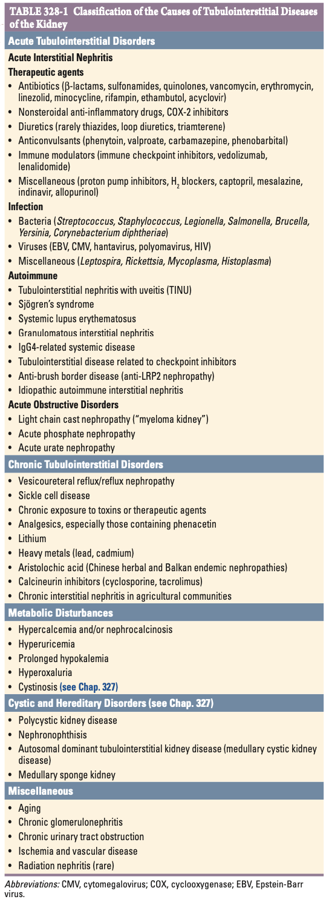
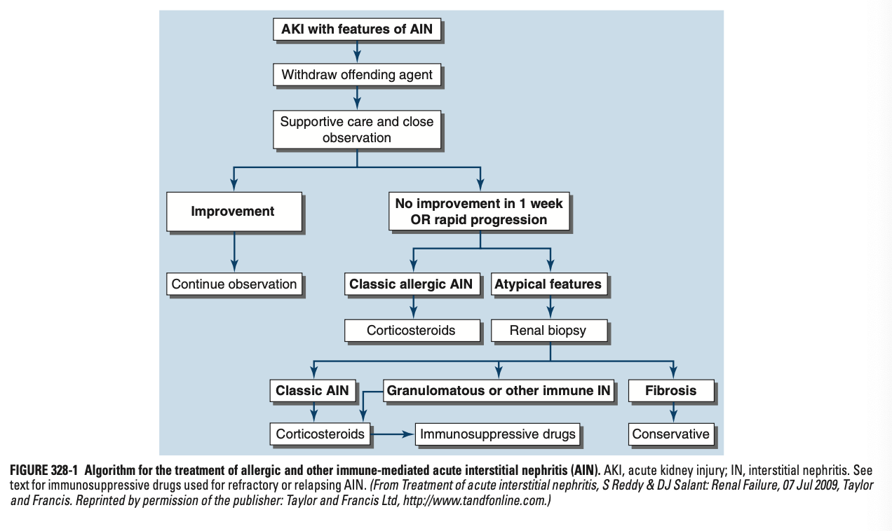
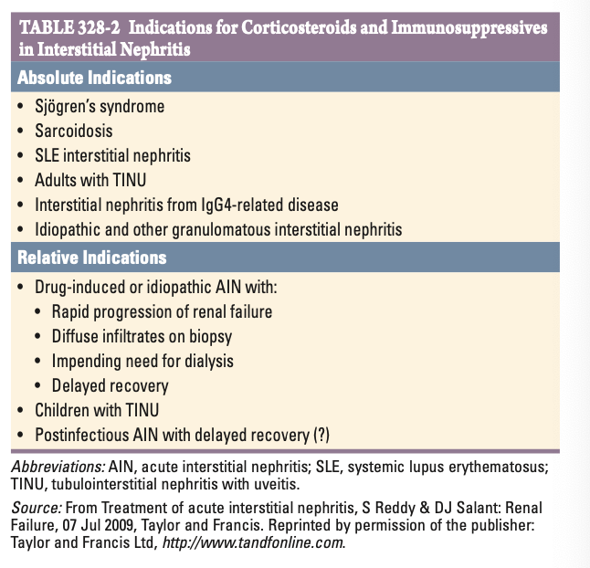

# Ch328 Tubulointerstitial Diseases of the Kidney

- **Primary tubulointerstitial pathology vs secondary tubulointerstitial involvement:**
    - <u>Primary disease</u> - primarily affecting tubules and interstitium w/ relative sparing of the glomeruli and renal vasculature
    - <u>Secondary invollvement</u> - inflammation or fibrosis of the renal interstitium w/ atrophy of the tubular compartment arising from disease of the glomeruli or vasculature
- **Classification of tubulointerstitial diseases of the kidney:**
    - <u>Acute interstitial nephritis</u> - previously Councilman's nephritis (post-infectious), heterogenous group of tubulointerstitial diseases from various causes manifesting as AKI characterised by tissue oedema and aggressive inflammatory infiltrates in the tubulointerstitium
    - <u>Chronic tubulointerstitial disease</u> - heterogenous group of disorders w/ variable causes, typically manifests as 1) defects of tubular function, and 2) progressive azotemia
    - <u>Metabolic disturbances affecting the tubulointerstitium</u> - caused by excessively high or low electrolytes and other products of metabolism
    - <u>Miscellaneous</u> - including cystic and hereditary disorders of the kidney

  
  
- **Pathophysiology of Acute TIN and Chronic TIN:**
    - <u>Acute TIN</u> - florid inflammatory infiltrates resulting in 1) tissue oedema, 2) tubular cell injury and comprimised tubular flow, and 3) frank obstruction of tubules by crystals, casts or cellular debris
    - <u>Chronic TIN</u> - fibrosis and atrophy of the tubulointerstitium with patchy mononuclear infiltration, a/w luminal dilatation and thickening of tubular basement membrane results resulting in:
        - Disorders of tubular function - e.g. Nephrogenic DI, Fanconi syndrome, type IV RTA due to impaired aminogenesis
        - Progressive azotemia - rising SCr and BUN
        - Modest proteinuria (\< 2g/d) - tubular proteinuria due to decreased tubular reabsorption of filtered proteins

## Acute Interstitial Nephritis

- **Historical perspective** - Councilman's nephritis:
    - Case reportman by Councilman, a pathologist in Boston City Hospital describing AIN as a post-infectious complication (3 from scarlet fever, 2 from diptheria)
    - Pathological reports describing the lesion as “an acute inflammation of the kidney characterized by cellular and fluid exudation in the interstitial tissue, accompanied by, but not dependent on, degeneration of the epithelium; the exudation is not purulent in character, and the lesions may be both diffuse and focal.”
- **Classification of AIN:**
    - <u>Allergic AIN</u> - often a/w a known inciting therapeutic agents
    - <u>Autoimmune AIN</u> - TINU, Sjogren's syndrome, SLE, IgG4-related systemic disease, tubulointerstial disease related to ICIs, anti-brush border disease, idiopathic autoimmune nephritis
    - <u>Infection-associated AIN</u> - local inflammatory reaction to microbial infection seen in immunocomprimised hosts, unlike acute bacterial pyelonephrititis that is typically unilateral and not a/w AKI
    - <u>Obstructive tubulopathies</u> - light chain cast nephropathy (myeloma kidney) and crystal deposition disorders
- **Urinalysis:**
    - Active urinary sediments w/ sterile pyuria and cellular casts
- **Alergic interstitial nephritis:**
    - **Epidemiology:**
        - Accounts for \< 15% of cases of unexplained AKI
        - Substantial under-estimate of true incidence as potentially offending agent discontinued empirically without renal Bx
    - **Clinical features** - classical triad of fever, rash, and peripheral eosinophilia is the exception rather than the rule:
        - <u>Asymptomatic</u> - patients found incidentally w/ rising serum creatinine or present w/ Sx attributable to AKI
        - <u>Classical triad</u> - fever, rash, and peripheral eosinophilia typically only seen in methicillin and related beta-lactams
        - <u>Proteinuria</u> - atypical reaction w/ glomerular involvement but is common in NSAID-induced AIN
        - <u>Bilateral flank tenderness</u> - inflammed kidney distending capsule
        - <u>Urine output</u> - may or may not present w/ oliguria
    - **Common inciting drugs and characteristic manifestations:**
        - <u>Beta-lactams</u> - methicillin most associated w/ classical triad of 1) fever, 2) rash, and 3) peripheral eosinophilia with an oliguric kidney and hence withdrawn, while other beta-lactams may behave atypically
        - <u>Rifampicin</u> - a/w re-introduction of rifampicin after prolonged drug-free period (anamnestic response), often extremely rapid onset
        - <u>Other ABx</u> - quinolones, vancomycin, sulphonamides reported by typically atypical presentation
        - <u>NSAID</u> - mechanistically complex when inducing AKI, and maybe associated w/ significant proteinuria secondary to glomerular involvement
        - <u>PPIs</u> - increasingly common due to widespread availability, unsure association between PPIs and incidental CKD involve an intermediary step of prolonged subclinical interstitial nephritis
        - <u>Other drugs</u> - 5-ASA, antiretrovirals etc.
    - **Dx:**
        - Usually a clinical diagnosis if inciting agent discovered (Classic allergic AIN)
        - Urinalysis shows sterile pyuria w/ WBC and haematuria (eosinophiluria not specific)
        - Renal Bx contemplated if atypical and does not respond to withdrawal of agent
    - **Mx:**
        - <u>Withdrawal of offending agent</u> - renal decovery dependent on duration of exposure and degree of irreversible damage dealt
        - <u>Glucocorticoids</u> - accelerates recovery but not required in most cases, only reserved for cases w/ severe AKI where dialysis is imminent

    
    
- **Tubulo-interstitial nephritis a/w Sjogren's syndrome**:
    - **Epidemiology** - most common renal manifestation of Sjogren's syndrome
    - **Clinical features:**
        - <u>Non-specific features of AKI</u> - evident by deteriorating renal functions
        - <u>Disorders of tubular function</u> - most commonly present w/ 1) nephrogenic DI and 2) type 1 RTA
        - <u>Sicca syndrome</u> - dry eyes and mouth due to atrophy of lacrimal and salivary glands
    - **Clinical assocaiation** - polyclonal hypergammaglobulinaemia
    - **Dx** - supported by +ve serological testing for anti-Ro (SS-A), and anti-LA (SS-B)
    - **Mx:**
        - <u>Initial therapy</u> - glucocorticoids
        - <u>Maintenance immunotherapy</u> - AZA, MMF

    
    
- **Tubulointerstitial nephritis with uveitis syndrome** (TINU syndrome) - systemic autoimmune disease of unknown etiology:
    - **Epidemiology:**
        - <u>Prevalence</u> - \< 5% of all cases of AIN
        - <u>Demographic</u>:
            - Age - median age of onset of 15y
            - Sex - female preponderance (F:M = 3:1)
    - **Clinical features** - relapsing and remitting course, occular manifestations precede renal manifestations in \< 33% of cases:
        - <u>Intersetitial nephritis</u> - lymphocyte predominant
        - <u>Anterior uveitis</u> - often bilateral painful red eye w/ photophobia and blurred features
    - **Dx** - Dx by exclusion:
        - Most autoimmune markers -ve
        - Exclusion of other causes of uveitis and kidney disease including Sjogren's, Behcet's, sarcoidosis, SLE
    - **Mx:**
        - <u>Initial therapy</u> - oral glucocorticoids
        - <u>Maintenance therapy</u> - MTX, AZA, MMF etc.
- **Systemic lupus erythematosus** - typically accompanying glomerular lesions, where IC deposits in tubular BM observed only in 50% of cases:
    - **Clinical features:**
        - <u>Glomerular disease</u> - typically class III or class IV lupus nephritis, a/w a nephritic pattern of presentation
        - <u>Tubulointerstitial disease</u> - ocasssionally predominates w/ azotemia and type IV RTA rather than features of GN
    - **Mx** - Mx as lupus nephritis

## Chronic Tubulointerstital Diseases

## Metabolic Disorders

## Global Perspective
