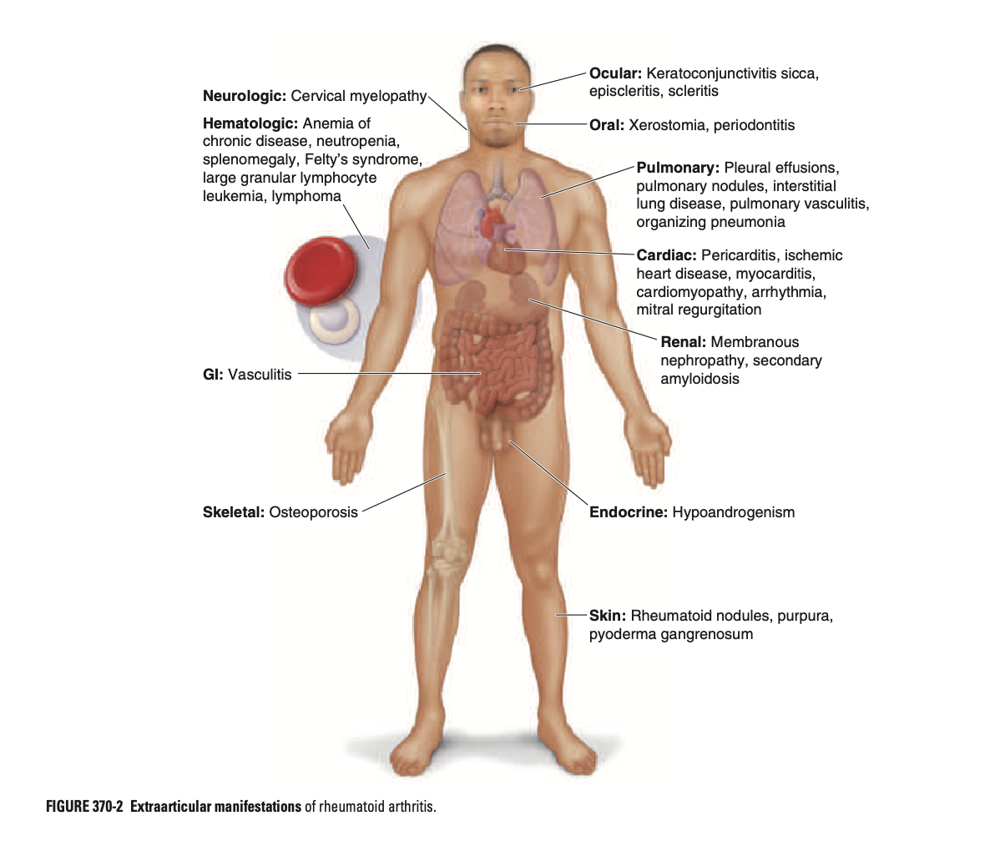
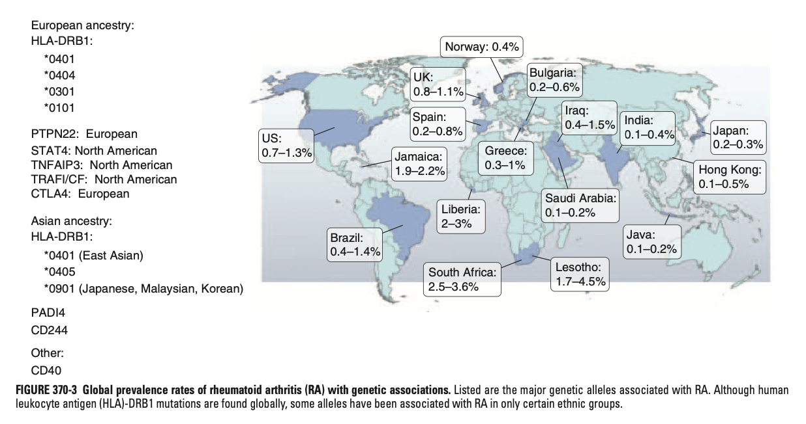
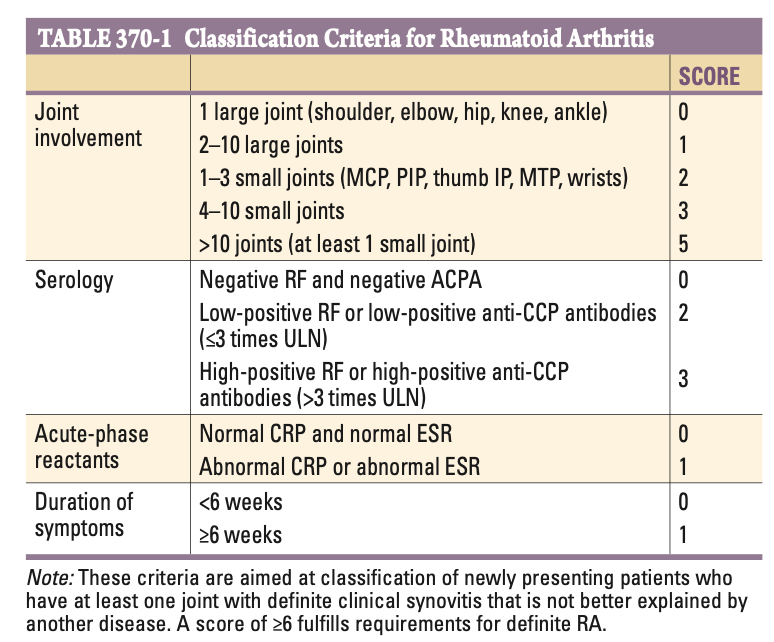
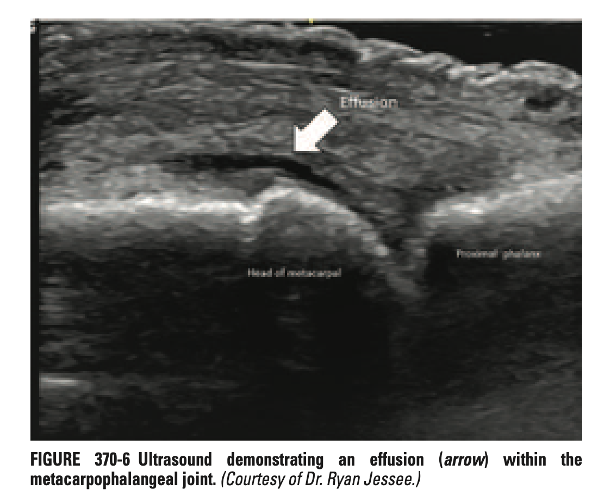
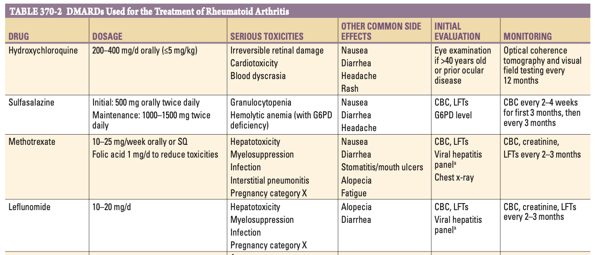
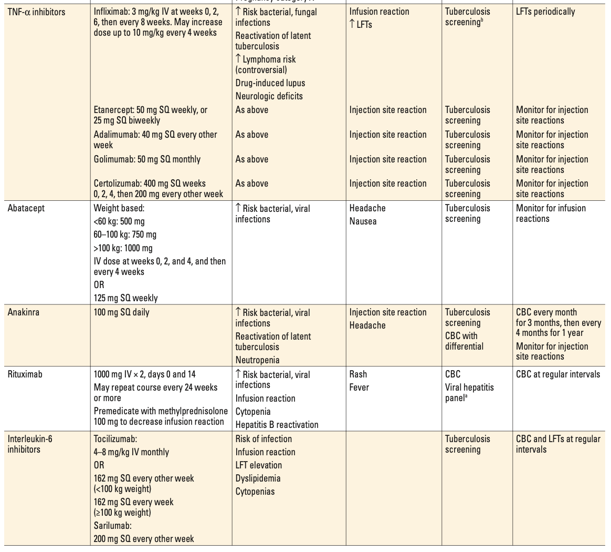
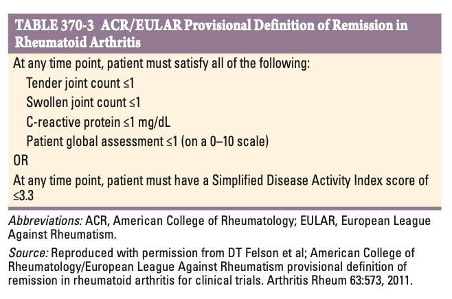

# Ch370 Rheumatoid Arthritis

ref: [[Rheumatoid Arthritis]]

## Introduction

- **Definition** - chronic, multisystemic, inflammatory disease characterised by <u>symmetrical, erosive polyarthritis</u>, a/w a variety of extra-articular manifestations
- **Modern goals of therapy for rheumatoid arthritis** - crippling arthritis is much less common currently due to advent of biologics and tDMARDs:
    - <u>Early referral and initiation of DMARDs</u> - early Dx and starting effective Tx, as delays is known to be a/w worse outcomes
    - <u>Treat-to-target approach</u> - reaching a clinical state of low disease activity by DAS28 is now an achievable goal for most patients
- **Current advances and gray areas in RA research:**
    - <u>Biomarkers</u> - anti-CPA and RF continues to be valuable not only in diagnosis, but also **prognostic significance** (N.B. RF -ve M w/ RA tend to have more pulmonary involvement)
    - <u>Advancements in imaging</u> - e.g. USG to detect occult joint inflammation and monitoring progression of damage to guide clinical decision making
    - <u>Molecular pathogenesis of RA</u> - understanding of new disease-related genes, environmental interactions, and molecular pathogenesis brought to light by efficacy of approved biologics and targeted synthetic disease-modifying therapies
    - <u>Early recognition and treat-to-target approach</u> - found to have greatly improve outcomes and reduce incidence of crippling arthritis and extra-articular manifestations

## Clinical Features

- **Typical presenting manifestations of RA** - Sx related to florid inflamation of the joints, tendons, and bursae a/w <u>pain</u>, <u>swelling</u>, and <u>early morning stiffness</u> (\> 1h):
    - <u>Polyarthritis</u> (\> 5 joints) - florid polyarthritis commonly affecting the small joints of the hands and feet in a symmetrical pattern
    - <u>Undifferentiated inflammatory arthritis</u> - those presenting w/ monoarthritis or oligoarthritis (\<= 4 joints), insufficient for a diagnosis of RA, w/ predictors of progression into RA including 1) high number of tender and swollen joints, 2) high titres on serology, and 3) higher scores for physical activities
- **Burden of extra-articular manifestations** - affects 40% of RA patients, may develop during disease course, or even prior to onset of arthritis:
    - Subcutaneous rheumatoid nodules
    - Sjogren's disease
    - Pulmonary involvement incluidng pleuritis, pulmonary nodules, and interstitial lung disease
    - Cardiac involvement such as pericarditis
    - Haematological involvement such as ACD, Felty syndrome, and lymphoma
    - Rheumatoid vasculitis
    - Associated conditions unrelated to disease activity but attributing to disease morbidity and mortality such as coronary artery disease and osteoporosis

  
  
- **Established polyarthritis of RA** - often a symmetrical, inflammatory, errosive arthritis of the small joints of the hands and feet, which may be a/w deformities:
    - <u>Site</u>:
        - Most commonly affects the **wrist**, **MCP**, **PIP joints** w/ sparing of the DIP joints
        - DIP joint involvement is rare, and is often attributed to coexistent osteoarthritis (i.e. Herberden's nodes)
        - MTP joint involvement may be an early feature and may result in pes planovalgus deformity
        - Large joint involvement such as knees, shoulders are often affected in established disease but largely remain asymptomatic
    - <u>Quality</u>:
        - **Non-mechanical pain** occuring at rest
        - Prominent features of **inflammation** such as erythema, swelling, and hyperaemia
        - Prolonged **early morning stiffness** ("gelling of joints") **lasting \> 1h**, gradually easing w/ physical activity
    - <u>Deformities a/w RA</u> - irreversible deformities of RA due to progressive destruction of joints and soft tissues:
        - **Ulnar deviation** - due to subluxation of the MCP joints, w/ subluxation of the proximal phalanx to the volar side of the hands
        - **Swan-neck deformity** - due to hyper-extension of the PIP joint, and flexion of the DIP joint
        - **Bountonniere deformity** - due to flexion of the PIP joint, and hyperextension of the DIP joint
        - **Z-line deformity** - due to subluxation of the first MTP joint, and hyperextension of the first IP joint
        - **Piano-key movement of the ulnar styloid** - as a result of inflammation of the ulnar styloid and tenosynovitis of the extensor carpi ulnaris resulting in subluxation of the ulna at the distal radioulnar joints
- **Tenosynovitis** - prominent periarticular inflammation that should be considered a <u>hallmark of RA</u>, as can result in <u>marked functional limitations even in the absence of deformities</u>:
    - <u>Flexor tendon tenosynovitis</u> - inflammation of the flexor tendons resulting in decreased ROM due to antalgia, and subsequently reduced grip strength
    - <u>Trigger fingers</u> - fingers locked in a flexed position due to flexor tendon tenosynovitis
    - <u>Tendon rupture</u> - most commonly occurs in the flexor polliis longus tendon
- **Atlantioaxial involvement of the cervical spine** (\< 10%) - often asymptomatic throught disease course, but results in instability of C1/2 joint, subluxation presents as high cervical myelopathy and neurological dysfunction resulting in a rheumatological emergency
- **Constitutional Sx** - generally a/w underlying disease activity but may preceed onset of joint Sx:
    - <u>Fever</u> - may correlate w/ disease activity; rule of thumb is that presence of fever \> 38.3 degrees celsiu should prompt search of **underlying infection** or **rheumatoid vasculitis**
    - <u>Fatigue or malaise</u> - reflects high degree of inflammation
    - <u>Depression</u> - related to functional limitation and debilitating nature of disease
    - <u>Weight loss or cachexia</u> - may occur w/ RA, but should not be immediately attributed to RA, and prompt for search of malignancy (e.g. lymphoma)
- **Subcutaneous rheumatoid nodules** (\< 30-40%; declining in incidence) - firm, non-tender nodules fixed to underlying periosteum, tendons, or bursae occuring at areas of repeated use, irritation, or trauma:
    - <u>Site</u>:
        - SubQ nodules tend to develop over elbows and forearms, sacral prominences, and Achilles tendon
        - These nodules are analogues to those developing over the serosa
    - <u>Factors increasing risk of rheumatoid nodules</u>:
        - +ve RF
        - Carriers of disease-related shared epitope (SE)
        - Severe erosive diseases
        - Long-term methotrexate use (a/w accelerated growth of smaller nodules in 10% although mechanism unclear)
    - <u>Complications</u> - generally benign nodules which are asymptomatic on its own:
        - Nerve entrapment
        - Ulcerations, gangrene, sinuses, or secondary infections
- **Secondary Sjogren's syndrome** (10%) - presence of Sicca symptoms such as <u>keratoconjunctivitis sicca</u> (dry eyes) or <u>xerostomia</u> (dry mouth)
- **Pulmonary involvement:**
    - **Pleuritis** - most common pulmonary manifesation of RA:
        - More common in M
        - Clinically manifests as <u>pleurtic chest pain</u> and <u>dyspnoea</u> a/w <u>pleural friction rub</u>
        - May manifest as <u>exudative pleural effusion</u> w/ reduced glucose due to "<u>entrance block</u>"
    - **Interstitial lung disease** (up to 12%) - may be diagnosed in up to 3.5% of patients prior to joint Sx:
        - <u>Clinical manifestations</u> - progressive SOBOE and dry cough
        - <u>Risk factors</u>:
            - Cigarette smoking
            - High disease activity
        - <u>Histological and radiological patterns</u> - may result in both UIP and NSIP picture
        - <u>Pulmonary function testing</u> - restrictive pattern w/ reduced DLCO and lung voumes
        - <u>Prognosis</u> - poor prognosis; but not as poor as IPF as generally responds better to immunosuppressive therapy
    - **Pulmonary nodules** - solitary or multiple; Caplan's syndrome is pulmonary nodululosis a/w subsequent pneumoconiosis after silicca exosure
    - **Other pulmonary manifestations** - pulmonary vasculitis, bronchiolar disorders such as respiratory bronchiolitis and bronchiectasis
- **Cardiac involvement:**
    - <u>Pericarditis</u> - often clinically silent, w/ \< 10% manifesting clinically w/ chest pain, despite evidence of involvement in 50% of RA patients in echocardiography and autopsy series
    - <u>Pericardial effusion</u> (\< 20%) - typically asymptomatic and does not produce tamponade effect
    - <u>Myocarditis</u> - may occur as complication of RA which is a singnificant cause of cardiomyopathy
    - <u>Cardiomyopathy</u> - multifactorial causes, including necrotising/ granulomatous myocarditis, diastolic dysfunction, coronary artery disease
- **Rheumatoid vasculitis** (\< 1%) - occurs w/ long-standing disease, +ve RF or ACPA, and hypocomplementaemia:
    - <u>Cutaneous manifestations</u> - palpable purpura, digital infarct, gangrene, livedo reticularis, or cutaneous ulcerations
    - <u>Sensorineural polyneuropathies</u> (or mononeuritis multiplex) - presents w/ new onset numbness, tingling, and focal muscle weakness
    - <u>Other systemic manifestations</u> - GI tract, pulmonary
- **Haematological involvement:**
    - <u>Anaemia of chronic illness</u> - most common haematological abnormality and correlates wll w/ CRP/ESR, often occuring w/ reactive thrombocytosis
    - <u>Immune-mediated thrombocytopenia</u> - generally rare and more associated w/ SLE rather than RA
    - <u>Leukopenia</u> - suggestive of T-LGL or Felty syndrome (see below), but most often a S/E of pharmacological therapy
    - <u>Lymphadenopathy</u> - may be reactive in response to disease activity, but persistent lymphadenopathy should be biopsied due to increased risk of lymphoma
    - <u>Felty syndrome</u> (\< 1%) - triad of neutropenia, splenomegaly, and nodular RA occuring in late-disease courses
    - <u>T-cell large granular lymphocyte leukaemia</u> (T-LGL) - chronic indolent proliferation of LGL clones, manifesting as neutropenia and splenomegaly, but occurs early in disease course in association w/ RA
    - <u>Lymphoma</u> - 2-4 fold risk of lymphoma, most commonly DLBCL; risk increases w/ presence of Felty syndrome, and high level of disease activities
- **Associated conditions:**
    - <u>Accelerated atherosclerosis and coronary artery disease</u> - at higher rates than general population even after controlling for traditional risk factors
    - <u>Congestive heart failure</u> - may be HFrEF or HFpEF; occurs at twofold risk compared w/ general population
    - <u>Osteoporosis</u> - 2x risk in age- and sex-matched populations, occuring in up to 33% of postmenopausal women w/ RA; increased incidence despite reduced use of chronic glucocorticoids, suggesting major contributions of the inflammatory response and disability-related imobility

## Epidemiology

- **Epidemiology** - most common <u>chronic inflammatory arthritis</u>:
    - <u>Prevalence</u> - affects 0.5-1% of adults worldwide (HK 0.1-5%)
    - <u>Demographic</u>:
        - Age - incidence increases from 25-55y, then plateus until 75y and then decreases
        - Sex - female preponderance (F:M = 2-3:1)
        - Geographic variability - a/w different genetic associations: 
        

## Genetic Considerations

## Environmental Factors

## Pathology

## Pathogenesis

## Diagnosis

- **Dx** - clinical Dx made by S/S of chronic inflammatory arthritis in a tyipical pattern of joint involvement, w/ laboratory and radiographic results providing corroborating information: 

    - Serves as a "classification criteria" rather than a "diagnostic criteria" aimed at early labelling of patients w/ possible RA and w/ high likelihood of evolution to chronic disease w/ persistent synovitis and joint damage
    - 2010 criteria does not mandate Sx to persist for \> 6 weeks to enable earlier diagnoses
    - Inclusion of ACPA, which has higher Sp compared w/ RF, of note, those w/ clinical and radiographically features compatible w/ RA, 75% will be seropositive while 25% will be seronegative
- **DDx of RA** - includes all types of acute and chronic inflammatory arthritides, differentiated based on 1) clinical course, 2) pattern of joint involvement, and 3) presence of damage to other organ Sx:
    - <u>Viral infections w/ rheumatological involvement</u> - e.g. parvovirus B19 infections, chikugunya fever although polyarthritis is typically self-limiting
    - <u>Primary Sjogren's syndrome</u> - predominant feature of sicca symptoms but may be complicated w/ polyarthralgia w/ evidence of mild synovial involvement, complicated by the fact that most w/ primary Sjogren's syndrome have **+ve RF**; however most have **+ve ANA and anti-SSA or anti-SSB**
    - <u>Seronegative spondyloarthropathies</u> - particularly **psoriatic arthritis**, and **enteropathy-associated arthritis** may present w/ similar joint involvement, but may be differentiated clinically by presence of **sacroillitis and anthesopathic features**, as well as presence of **psoriasis** and **inflammatory bowel disease** respectively; -ve RF is definitive
    - <u>Polymyalgia rheumatica</u> - esp. disease onset in the elderly, although classically affects midline and large joints (e.g. shoulder girdle), distal joint involvement may occur, however may be differentiated by **temporal evolution of joint Sx** (synchronous onset of large and small joints Sx in PMR, whereas predominant small joint involvement in RA at disease onset)
    - <u>Remitting seronegative symmetrical synovitis with pitting edema</u> (RS3PE) - a rare **paraneoplastic syndrome** characteristic joint involvement but a/w **prominent distal limb pitting oedema**, which is unusual in RA
    - <u>Chronic tophaceous gout</u> - may mimic severe RA due to deformation w/ gouti tophi being mistakened as rheumatoid nodules
    - <u>Hepatitis C-related arthropathy</u> - often small joint involvement and 50% will be +ve for RF, but generally not ACPA

## Laboratory Features

- **Blood tests** - Inflammatory markers (ESR, CRP), RF, Anti-CCP, ANA, ANCA:
    - **ESR/CRP** - non-specifically elevated as in a chronic inflammatory disease
    - **RF** - Ab against Fc portions of IgG as a marker of autoimmunity; IgM RF is most frequently measured in commercial assays but various isotypes (e.g. IgM, IgG, IgA) is likely present in a patient w/ rheumatoid arthritis:
        - <u>Test properties</u> - moderate Sn, and Sp (hence <u>non-diagnostic</u>):
            - -ve results does not r/o RA (only <u>75%</u> of RA patients are seropositive for RF)
            - Lack of specificity confers high rates of FP, in chronic inflammatory disease
        - <u>DDx of +ve RF</u>:
            - Healthy populations (at low levels in 1-5% of healthy populations, and possibly higher rates in asymptomatic elderly)
            - Other connective tissue disorders, e.g. primary Sjogren's syndrome, systemic lupus erythematosus, type II mixed essential cryoglobulinaemia
            - Chronic infections, e.g. chronic HBV, chronic HCV, subacute bacterial endocarditis
    - **Anti-cyclic citrulinated peptides** (Anti-CCP):
        - <u>Test properties</u> - similar Sn as RF (75%), but high specificity (95%)
        - <u>Significance of Anti-CCP</u>:
            - +ve test of anti-CCP Ab in setting of early inflammatory arthritis helps rule in RF
            - Prognostic significance, as high titres of anti-CCP predicts worse outcomes
    - **Other autoantibodies:**
        - <u>ANA</u> - 30% w/ RA test +ve for ANAs
        - <u>ANCAs</u> - minority test +ve in a pANCA pattern, however are -ve for anti-MPO or anti-PR3
- **Joint aspiration and synovial fluid analysis** - typically only performed w/ clinical suspicion of other pathologies:
    - **Role** - differentiation of infection or crystal-induced arthritis
    - **Findings** - an acute inflammatory arthritis:
        - <u>WCC</u> - 500 to 50000 WBC/ microL depending on severity of inflammation
        - <u>Differentials</u> - predominant neutrophils (different from the immune cells in synovial tissues and pannus which is predominantly lymphocytes)
        - <u>Crystals</u> - absence of crystals on microscopy
        - <u>Microbiology</u> - ve
- **Joint imaging** - plain radiographs, USG, MRI:
    - <u>Plain radiography</u> - for deformities, soft tissue swelling, periarticular osteopenia, juxtarticular erosions, and joint space loss
    - <u>USG</u> (power color Doppler) - detection of synovitis as evidence of joint vascularity indicative of inflammation; detection of joint effusion 
    
    - <u>MRI</u> - detection of 1) joint effusions, 2) early bone and bone marrow changes (e.g. edema)

## Clinical Course

- **Clinical evolution of articular involvement in RA:**
    - <u>Initial disease presentation</u> - variable degree of arthritis resulting in disability due to florrid inflammation
    - <u>Subsequent articular involvement after initial presentation</u> - can be extremely variable:
        - **Persistent and progressive disease** (most common) - persistent disease activity unable to achieve quiesent states that waxes and wanes in intensity over time
        - **Recurrent attacks of inflammatory arthritis** - intermittent and recurrent explosive attacks of inflammatory arthritis interspersed w/ periods of disease quiescence
        - **Inexorable progressive disease** - unfortunate relentless disease activity that takes a rapidly destructive course (less common in the modern era)
        - **Spontaneous remission** (10%) - in patients meeting the ACR classification criteria for RA, but undergoes spontaneous remission, especially for sero-negative RA (?as classification criteria are not 100% specific for predicting chronic disease activity)
    - <u>Effects on functional limitation and disease progression</u> - persistent over disease course w/ variable combinations of 1) reversible disease activity-related component, and 2) irreversible joint damage-related component:
        - Early in the course of disease, extent of joint inflammation is primary determinant of disability, which is potentially reversible by early initiation of disease-modifying therapies
        - Late in the course of disease, amount of cumulative joint and periarticular tissue damage is the primary determinant of disability, which does not respond well w/ medical Tx and can only be potentially resolved by surgery
        - 50% unable to work 10y after disease onset in an old study; Increased employability and less work absenteeism have been reported w/ newer therapies and earlier treatment intervention
- **Effects on mortality:**
    - <u>Higher mortality rates</u> - 2x greater than that of general populations
    - <u>Median life expentancy</u> - shortened by average of 7y in M, and 2y in F compared to control populations
    - <u>Main drivers of mortality</u>:
        - Respiratory illness
        - Cardiovascular disease
        - Infections

## Treatment

- **Pharmacological therapy for RA:**
    - **Symptomatic relief** - NSAIDs and glucocorticoids
    - **DMARDs** - class of drug that has demonstrable ability to slow or prevent structural progression of RAs, classified into conventional (cDMARDs), biologic (bDMARDs), and targeted synthetic (tsDMARDs) DMARDs:
        - <u>cDMARDs</u> - MTX, SSZ, LEF +/- HCQ
        - <u>bDMARDs</u> - anti-TNF agents, anti-IL1 agents, abatcept, anti-IL6R agents, rituximab
        - <u>tsDMARDs</u> - JAK inhibitors
- **NSAIDs** - formerly view as core RA therapy but now considered as adjuncts for Mx of Sx:
    - <u>MOA</u> - cycloxygenase inhibition
    - <u>Clinical efficacy</u>:
        - Generally all NSAIDs have equivalent efficacy
        - Experience suggests that some individuals respond to a particular NSAIDs, suggesting role of trial-and-error approach
        - ?Risk of masking disease activity
    - <u>S/E</u> - peptic ulcer disease (co-prescription w/ PPI), AKI
- **Glucocorticoids** - goal is to minimise dose of glucocorticoid use and find an effective DMARD therapy for disease control:
    - **Role of glucocorticoid therapy:**
        - <u>Induction therapy w/ DMARDs</u> - typically given at low-to-moderate doses to achieve rapid disease control before the onset of fully effective DMARD therapy
        - <u>Management of disease flares</u> - 1-2 week bursts of glucocorticoids to manage acute disease flare, w/ duration and dosage depending on severity of disease activity
        - <u>Maintenance therapy</u> - chronic administration of low-dose (P5-10) if inadequate response to DMARDs, but should be avoided in favour of finding effective DMARD regimen
        - <u>Management of extra-articular manifestation</u> - high doses of GC may be required for severe extra-articular manifestations such as ILDs
        - <u>Management of problem joints</u> - intra-articular injections of intermediate-acting glucocorticoid such as triamcinolone acetate for rapid control of inflammation (requires exclusion of septic arthritis as may mimick monoarticular RA flares)
    - **MOA** - via genomic and non-genomic pathway
    - **S/E** - various, from immunosuppression to metabolic dysfunction, w/ <u>osteoporosis</u> being an important consideration in context of RA:
        - Most patients w/ RA are at increased risk of osteoporosis even w/o chronic prednisone use
        - <u>Primary prevention w/ oral bisphosphonates</u> +/- other agents is warranted based on patient risk factors, total prednisone dosage, and length of Tx (e.g. \> P7.5 for 3mo)
- **Conventional DMARDs** - typically delayed onset of action of 6-12 weeks or longer:
    - **Selection and logic behind selection:**
        - <u>Methotrexate</u> (MTX) - considered anchor drug as monotherapy or combination therapy and is often pursued as 1st-line treatment of newly-diagnosed RA
            - <u>Sulfasalazide</u> (SSZ) - as combination w/ MTX or as monotherapy if MTX C/I, often limited by S/E profile
        - <u>Leflunomide</u> (LEF) - as first-line cDMARD if MTX C/I
        - <u>Hydroxychloroquine</u> (HCQ) - no evidence for disease-modifying effects, but recommended by the ACR as initial Tx for early mild disease or as adjunct to MTX at low-doses, or during pregnancy

    
    
    - **Oral triple therapy** - an acceptable alternative to initiation of bDMARDs or tsDMARDs in inadequate Tx responsiveness to methotrexate alone:
        - Comprimises of combination of HCQ, SSZ, and MTX
        - ACR recommends early step up to biologics and small molecules over oral triple therapy
        - However, the regimen has its roles due to local regimen (e.g. UK requires demonstration of failure of two cDMARDs regimen before stepping up), or C/I to other therapies
- **Biologic DMARDs** - protein therapuetics designed to target cytokines and cell-surface molecules: 

    - **Anti-TNF agents:**
        - <u>Selection</u> - five original inovators:
            - Infliximab
            - Adalimumab
            - Golimumab
            - Certolizumab pegol
            - Golimumab
        - <u>MOA</u> - inhibition of TNF-alpha, which is considered an upstream mediator of synovial inflammation
        - <u>Precautions</u>:
            - **Tuberculosis screening** - tuberculin (PPD) skin test or interferon-gamma release assay (IGRA) for detection of **LTBI** (+ve results require Tx for LTBI for 1mo before starting anti-TNF therapy)
            - **Viral hepatitis panel** - best if provided to detect chronic HBV infections
        - <u>S/E</u>:
            - Injection site reactions
            - Reactivation of latent TB infections
            - Infection risks (including bacterial, mycobacterial, and opportunistic fungal infections)
            - Hepatotoxicity (infliximab)
            - Lymphoma (controversal)
        - <u>C/I</u>:
            - Active infections
            - Tuberuclosis
            - Chronic HBV infections
            - Hypersensitivity reactions to Anti-TNF alpha
            - NYHA class III-IV congestive HF
    - **Anakinra:**
        - <u>MOA</u> - recombinant form of naturally occuring IL-1 antagonists
        - <u>Limited use</u> - as other biologics appear to have greater efficacy in practice
    - **Abatacept:**
        - <u>MOA</u> - soluble fusion protein containing extra-cellular domain of human CTLA-4 linked to modified portion of human IgG:
            - Interferes interaction CD28-CD80/86 interactions through binding to CD80/86 portion on APCs, thus reducing co-stimulation of T cells
            - Reverse signalling via CD80/86 resulting in inhibition of function of APC
        - <u>Precaution</u> - TB screening
        - <u>S/E</u>:
            - Injection site reaction
            - Headache
            - Increased risk of bacterial and vira reactions (and blunted vaccine response)
            - Reactivation of LTBI
            - Neutropaenia
    - **Rituximab:**
        - <u>MOA</u> - anti-CD-20 B cell depleting agents:
            - Reduction of pathogenic autoAb (hence more effective in seropositive compared w/ seronegative patients)
            - Inhibition of T cell activation
            - Alteration of cytokine production
        - <u>Indications</u> - only for refractory RA (i.e. failure of anti-TNF)
        - <u>Precaution</u> - viral hepatitis panel
        - <u>S/E</u>:
            - Infusion reaction
            - Reactivations of chronic viral hepatitis infections
            - Cytopenias and hypogammaglobulinaemia
            - Increased risk of bacterial and viral infections
    - **Anti-IL-6R agents:**
        - <u>Clinical efficacy</u> - effective as monotherapy or combination w/ cDMARDs
        - <u>Selection</u> - tocilizumab, sarilizumab
        - <u>MOA</u> - antagonism against IL-6 intracellular signalling pathways:
            - Reduced acute phase response
            - Reduced cytokine production
            - Reduced osteoclast activation
        - <u>S/E</u>:
            - Risk of infections
            - Infusion reactions
            - Dyslipidaemia
            - Hepatotoxicity
            - Neutropenia and thrombocytopenia
- **Targeted synthetic DMARDs** - currently available class of drugs includes <u>JAK inhibitors</u>:
    - **Selection:**
        - <u>Tofacitinib</u> - near pan-JAK inhibition w/ potent effects on JAK1 and 3m and minor effects on JAK2 and Tyk2
        - <u>Baricitinib</u> - pan-JAK inhibition, w/ JAK1 and JAK3 inhibiton w/ moderate inhibition of Tyk2 and minimal inhibition of JAK3
        - <u>Upadacitinib</u> - selective JAK1 inhibitors
    - **Minor S/E:**
        - Nasopharyngitis
        - Headaches
        - Diarrhoea
    - **Major S/E:**
        - Increased risk of infections
        - Hepatotoxicity
        - Dysplipidaemia
        - Elevated risks of malignancy, arterial and venous thrombosis (as illustrated in ORAL surveillance study; hence FDA black box warning limiting use)
    - **Current utilisation** - still considered as first-line therapy by EULAR, however not pursued in (although trial avialable for refractory RA, i.e. anti-TNF failure):
        - Age \> 65y
        - Current or past smoker
        - Prominent cardiovascular risk factors
        - Hx of malignancy (esp. for non-melanoma skin cancer)

## Approach to the Patient with Rheumatoid Arthritis

- **Principles of Mx** - Tx of RA adheres to the following principles and goals:
    - <u>Early identification and aggressive therapy</u> (Window of Opportunity) - known to immediately abort disability and prevent future joint damage
    - <u>Treat-to-target approach</u> - achieving whenever possible, low disease activity or clinical remission irrespective of early (\< 6mo) or established disease
    - <u>Frequent modification of DMARD therapy to achieve treatment goals</u> - limit clinical inertia through frequent consideration for the need to switch or add therapies for worsening or persistent moderate/ high disease activity
    - <u>Individualization of DMARD therapy</u> - in attempts to maximise responsiveness and minimising S/E
    - <u>Minimise long-term use of glucocorticoids</u> - to limit S/E as a result of glucocorticoids
- **Approach to step-up DMARD therapy in patient w/ RA** - aggressive escalation for those w/ inadequate response based on composite indices such as CDAI or SDAI:
    - Methotrexate monotherapy (+/- initial steroids)
    - Combination tDMARD therapy (methotrexate, sulfasalazine, leflunomide)
    - Switch to anti-TNF or non-TNF-based biologics +/- methotrexate
    - Alternative biologics or tsDMARDs if anti-TNF C/I, intolerable, or non-efficacious
- **ACR/ EULAR provisional definition of remission in rheumatoid arthritis** (2011): 

## Global Challenges

## Summary
