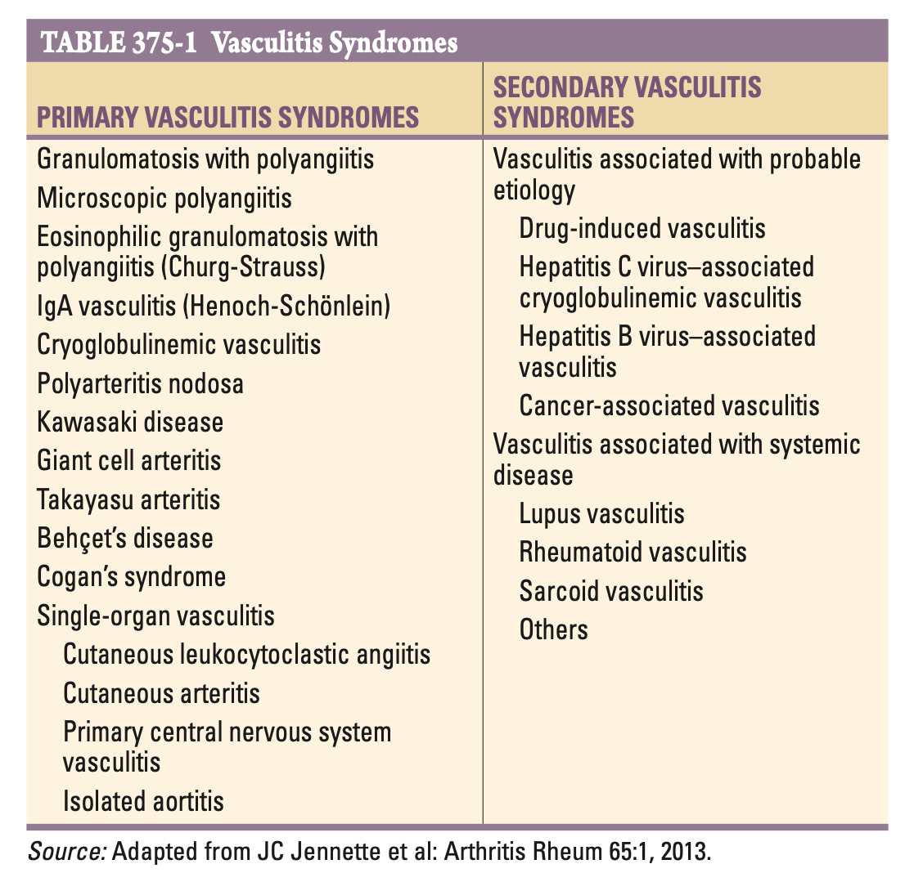
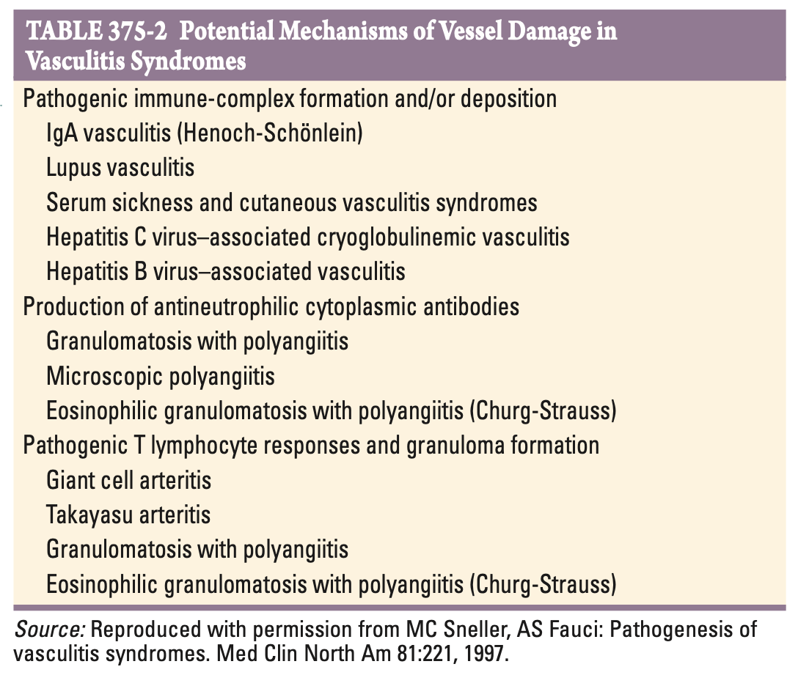
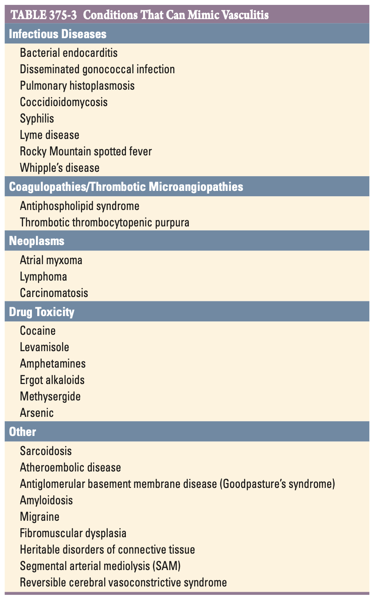
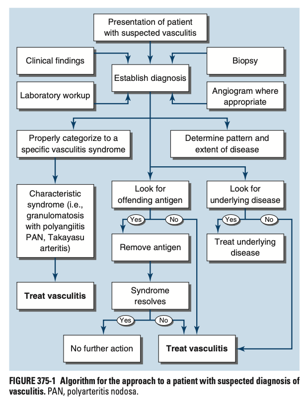
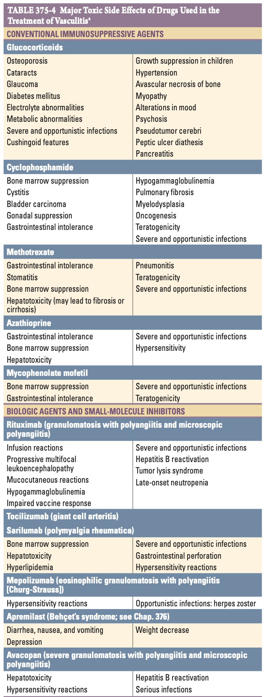
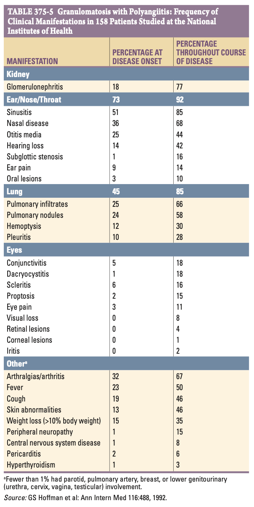
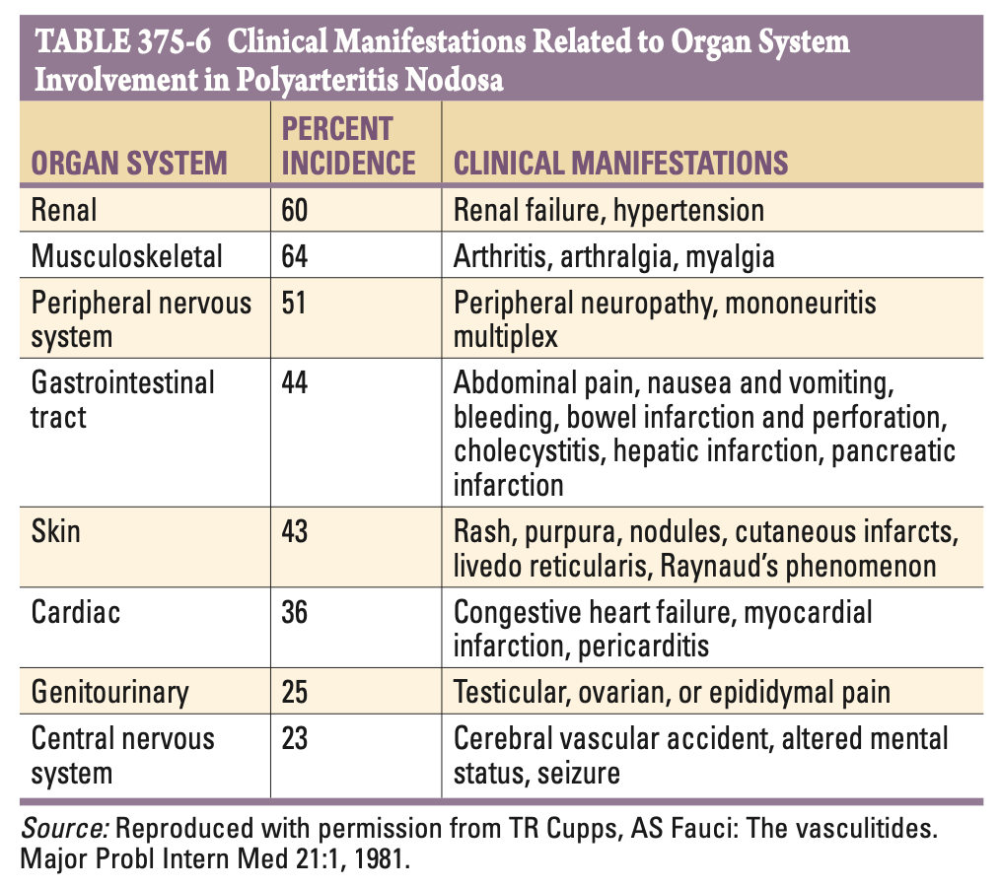

# Ch375 The Vasculitis Syndrome

## Definition

- **Definition of vasculitis:**
    - A clinico-pathological process characterised by inflammation of and damage to blood vessels
- **Concept of vasculitis:**
    - <u>Luminal obstruction</u> - vessel lumen is usually compromised and is associated w/ ischaemia of the tissues supplied by the involved vessel
    - <u>Classification based on</u>:
        - Blood vessel involvement (single-organ or systemic) - by type, size, and location
        - Primary vs secondary - primary vasculitic syndrome where vasculitis is the sole manifestation of disease, or if is a secondary component of another disease

## Classification

- **Vasculitic syndromes:** 

## Pathophysiology and Pathogenesis

- **General hypothesis of vasculitic phenomenon** - an immunopathogenic mechanism occuring against a certain antigenic stimuli:
    - Immune complex formation
    - Antineutrophil cytoplasmic antibodies (ANCA)
    - Pathogenic T lymphocyte responses

  
  
- **Factors influencing expression of vasculitic syndrome:**
    - Genetic predisposition
    - Environmental expaosures
    - Regulatory mechanisms associated w/ immune responses against certain Ag
- **Pathogenic immune-complex formation** - the first and most widely accepted pathogenic mechanism of vasculitis, although seldon demonstrable:
    - <u>Presence of an antigenic stimuli</u> - rarely identified by hepatitis B is associated w/ systemic vasculitis clinically similar to polyarteritis nodosa, while hepatitis C is associated w/ a form of cryoglobulinaemic vsaculitis
    - <u>Deposition of IC complex and inflammatory responses</u> - deposition into specific vessels due to increases in vaso-active amines released from PLT or mast cells in an IgE-mediated manner:
        - Acute inflammation - neutrophilic infiltration to phagocytose IC complex, with release of **intracytoplasmic enzymes**, causing destruction of vascular wall
        - Chronic inflammation - mononuclear infiltration resulting in **narrowing of vascular lumen**, and ischaemic changes in tissues supplied by the vessel
    - <u>Factors influencing inter-individual variability and vascular involvement</u>:
        - Patient factor - ability of RES to clear circulating complexes
        - Complex factor - size and psyicochemical properties
        - Vessel factor - size, turbulence, intravascular pressures, pre-existing integrity of vessel endothelium
- **Anti-neutrophil cytoplasmic antibodies** - Ab directed against certain proteins in cytoplsamic granules of neutrophils and monocytes, presence in a subset of vasculitis termed ANCA-associated vasculitis:
    - **Types of ANCA:**
        - <u>Cytoplasmic ANCA</u> (cANCA) - the major being proteinase 3 in neutrophil azurophilic granules, results in diffuse, granular cytoplasmic staining pattern, seen in 90% of patients w/ Wegner's granulomatosis
        - <u>Perinuclear ANCA</u> (pANCA) - the major Ag being myeloperoxidase, results in perinuclear staining pattern of the indicator neutrophils, seen in variable % of patients w/ microscopic polyangitis, granulomatosis with polyangitis, EGPA, or isolated crescentic GN
    - **Mechanism of vasculitic syndromes:**
        - <u>Neutrophil degranulation</u> - exposure to TNF-alpha or IL-1 triggers results in release of azurophilic granules and exposure of proteinase 3 or MPO
        - <u>ANCA-activation</u> - ANCA binds to exposed epitopes and results in:
            - Endothelial injury
            - Release of pro-inflammatory cytokines
- **Pathogenic T lymphocyte responses and granuloma formation** - explains histopathologic feature of granulomatous vasculitis:
    - <u>Role of endothelial cells as antigen-presenting cells</u> - expression of MHC class II in-response to INF-gamma, allows presentation of Ag to CD4 T cells
    - <u>Induction of immunological reaction in vessel wall</u> - e.g. release of IL-1 and TNF-alpha, priming leukocyte adhesion
- **Features suggestive of vasculitic phenomenon** - any patient w/ unexplained multisystemic illness:
    - Palpable purpura
    - Pulmonary infiltrates with microscopic haematuria
    - Chronic sinusitis
    - Mononeuritis multiplex
    - Unexplained ischaemic events
    - GN in the evidence of multi-system diseases
- **Conditions that mimic vasculitis:** 

- **Approach to patient w/ suspected Dx of vasculitis:** 

    - <u>Rule out conditions that mimic vasculitis</u> - see conditions that mimic vasculitis
    - <u>Proper work up for suspected vasculitis</u> - aimed at establishing Dx:
        - Clinical findings and laboratory workup (e.g. inflammatory markers, serology)
        - Bx of affected organs (most are histological diagnoses)
        - Angiogram whenever apropriate (e.g. Polyarteritis nodosa, Takayasu arteritis, primary CNS vasculitis)
    - <u>Identify underlying causes</u> - e.g. secondary underlying disease, presence of antigenic stimuli (e.g. HBV, HCV)
    - <u>Tx of vasculitis</u> - see below
- **Principles of Tx:**
    - <u>Identification and Tx of secondary cause</u>:
        - Offending Ag - removal Ag (w/ antiviral therapy)
        - Underlying disease - identification and Tx infections, neoplasms, or connective tissue disease
    - <u>Tx of primary vasculitic syndromes</u> - regimens based on efficacy reported in clinical trials and balancing of benefit-to-risk ratio (steroids +/- immunosuppressives if non-specific vasculitic phenomenon tailored to clinical response)
    - <u>Address acute and long-term complications of medications</u> - e.g. addressing risk of bone loss in those on steroids, bladder toxicity if on CTX, monitoring for cytopenias, reactivation of viral infections, and ABx prophylaxis of life-threatening infections (e.g. septrin for PJP)
- **Side effects of drugs used for vasculitic syndromes:** 

## Granulomatosis with Polyangiitis

- **Definition** - clinicopathological entity characterised by granulomatous vasculitis of the upper and lower respiratory tract togeether w/ glomerulonephritis, w/ variable degrees of systemic vasculiti
- **Epidemiology:**
    - <u>Prevalence</u> - 3/100000
    - <u>Demographic</u>:
        - Age - mean age of onset is 40-60y (only 15% \< 19y)
        - Sex - M:F = 1:1
        - Race - whites \> blacks
    - **Pathology:**
        - <u>Histopathological hallmark</u> - necrotising vasculitis of small arteries and veins w/ granuloma formation intravascularlly or extra-vascularlly
        - <u>Classical anatomical involvement</u>:
            - Lung - bilateral nodular or cavitary infiltrates w/ necrotising granulomatous vasculitis
            - Upper airway - inflammation, necrosis, and granulomas, w/ or w/o vasculitis
            - Kidneys - focal segmental glomerulonephritis progressing into pauci-immune RPGN; granuloma are rare
        - <u>Non-specific involvement</u> - virtually all organs can be affected by vasculitis, granuloma or both
    - **Immunopathogenesis of GpA:**
    - **Clinical manifestation of GpA** - virtually all organs affected, but defined by presence of ENT, lung, and kidney disease: 
    
        - **Upper airway (ENT) involvement** (95%):
            - <u>Chronic sinusitis</u> - a/w chronic purulent/ bloody nasal discharge, paranasal sinus pain
            - <u>Nasal disease</u> - chronic nasal blockade, nasal mucosal ulceration, or nasal septal perforation (saddle nose deformity)
            - <u>Seroous otitis media</u> - as a result of eustatchian tube blockade, manifesting as hearing loss and rarely ear pain
            - <u>Subglottic stenosis</u> - severe upper airway obstruction
        - **Pulmonary involvement** (85-90%) - however may be asymptomatic despite active disease in up to 30% cases:
            - <u>Pulmonary infiltration/ nodules</u> - manifest as cough, dyspnoea, chest discomfort, or haemoptysis
            - <u>Endobronchial disease</u> - may lead to obstruction and atelectasis
        - **Renal involvement** (77%) - generally dominates the clinical picture and accounts either directly or indirectly for most of the mortality of the disease:
            - <u>Chronic GN</u> - smouldering, mild GN manifests as haematuria, proteinuria, RBC casts, with minimal renal impairment
            - <u>RPGN</u> - typically rapidly progressive once clinically detectable renal function impairments occur
        - **Non-specific organ involvement:**
            - <u>Occular involvement</u> (52%) - ranges from mild conjunctivitis, dacrocystitis, scleritis, episcleritis, sclerouveitis, ciliary vessel vasculitis, or retro-orbital mass resulting in proptosis
            - <u>Cutaneous involvement</u> (46%) - palpable purpuras, ulcers, subcutaneous nodules, where Bx shows vasculitis +/- granuloma
            - <u>Neurological involvement</u> (23%) - **mononeuritis complex**, cranial neuritis, or rarely cerebral vasculitis +/- granuloma formation
            - <u>Cardiac involvement</u> (8%) - pericarditis, coronary vasculitis, and rarely cardiomyopathy
            - <u>Haematological manifestations</u> - increased incidence of VTE reported such that heightened awareness warranted
        - **Non-specic Sx** - usually during active disease:
            - Fever (r/o secondary infections typically in upper airway)
            - Weakness and myalgia
            - Arthalgias
            - Anorexia and weight loss
    - **Ix:**
        - **Routine bloods** - CBC, RFT, inflammatory markers, Ig:
            - <u>CBC</u> - anaemia, leukocytosis and thrombocytosis (+ve APR)
            - <u>RFT</u> - increased SCr
            - <u>CRP/ESR</u> - non-specificaly elevated
            - <u>Ig</u> - mild hypergammaglobulinaemia
        - **ANCA** - staining shows cANCA (diffuse deposits) w/ anti-proteinase-3 positivity:
            - <u>Test properties</u> - highly Sn in active disease (90%), moderate in absence of active disease (60-70%)
            - <u>Remarks</u>:
                - Isolated sinus/ lung disease where renal disease is absent decreases Sn of 30-60%, and Bx typically necessary to r/o infection or malignancy
                - Up to 20% may lack ANCA
                - Small proportion may show Anti-MPO positivity rather than antiproteinase-3 positivity
                - Does not correlate w/ severity of disease
        - **Bx** - definitive Dx (see below)
    - **Dx** - demonstration of necrotizing granulomatous vasculitis on tissue Bx in patient w/ compatible clinical features:
        - <u>Pulmonary tissue</u> offers highest diagnostic yield invariably showing granulomatous inflammation
        - Upper airway tissue are generally not diagnostic
        - Renal Bx never show granuloma but a presumptive diagnosis if pauci-immune RPGN seen and antiproteinase-3 ANCA is +ve for immediate initiation of Tx
    - **DDx of GpA** - in the absence of full-picture:
        - <u>Presentation w/ vasculitic phenomenone</u> - other vasculiitis
        - <u>Acute GN +/- pulmonary infiltrates</u> - anti-GBM disease, other GN
        - <u>Airway disease</u> - tumors of upper airway and lung, relapsing polychondritis
        - <u>Midline destructive upper airway disease</u>:
            - NK/T cell lymphoma - a/w EBV
            - Cocaine-induced tissue injury - may be a/w +ve ANCA against human neutrophil elastase, +/- adulteration w/ levamisole may induce a vasculitis
        - <u>Others</u>:
            - Histoplasmosis
            - Endocarditis
            - Mucocutaneous leishmaniasis
            - Rhinoscleroma
            - Non-infectious granulomatous disease
            - Lymphomatoid granulomatosis (pre-malignant lesion)
    - **Mx:**
        - **Principles of Mx:**
            - **Disease-specific pharmacological therapy** - two phases:
                - <u>Induction</u> - active disease put into remission
                - <u>Maintenance</u> - prevent relapse, dependent on C/I, comorbidities, disease severity, and relapse Hx
            - **Mx of complications** - e.g. RRT, surgery for sadle deformity etc.
        - **Approach to induction and maintenance in severe disease:**
            - <u>Remission induction</u> - corticosteroids, cyclophosphamide, rituximab, avacopan
            - <u>Maintenance therapy</u> - rituximab and other immunosuppressive agents
        - **Approach to induction and maintenance in non-severe disease:**
            - Low-dose steroids or rituximab may be used
            - Cyclophosphamide is rarely indicated due to severe risks, no data on use of avacopan

## Microscopic Polyangiitis

- **Definition** - clinico-pathological entity reflecting small-vessel vasculitis similar to GpA but with the absence of granuloma formation, where 1) GN, and 2) pulmonary capillaritis often occurs
- **Epidemiology:**
    - <u>Prevalence</u> - 3-5/100000
    - <u>Demographic</u>:
        - Age - mean age of onset at 57y
        - Sex - slight male predisposition
- **Pathology:**
    - Vasculitic manifestation in capillaries, venules, in addition to small- and medium-sized arteries
    - IMF shows paucity of Ig deposition in vascular lesions (pauci-immune), as IC complex formation is not central to pathogenesis, rather presence of ANCA is
    - Renal Bx is indistinguishable from that of GpA, as granulomas are not seen
- **Pathogenesis** - anti-MPO Ab (ANCA) has role of pathogenesis
- **Clinical features of microscopic polyangitis** - typically acute in onset but may be gradual, w/clinical features similar to GpA, w/ absence of upper airway disease and pulmonary nodules (granulomas):
    - **Non-specific Sx of multisystemic disease** - fever, weight loss and MSK pain
    - **Renal involvement** (79%) - manifests as <u>rapidly progressive glomerulonephritis</u>
    - **Pulmonary involvement** (12%) - manifests as haemptysis due to <u>alveolar haemorrhage</u>
    - **Non-specific systemic involvement:**
        - Cutaneous vasculitis
        - Gastrointestinal vasculitis
        - Mononeuritis multiplex
- **Ix:**
    - **Routine bloods** - CBC, RFT, inflammatory markers:
        - <u>CBC</u> - anaemia, leukocytosis, thrombocytosis
        - <u>RFT</u> - increased SCr, decreased eGFR
        - <u>CRP/ESR</u> - non-specific elevation
    - **ANCA** - +ve in 75% patients w/ microscopic polyangiitis, w/ anti-MPO Ab being the predominant association
    - **Bx** - typically pursued in patients who do not have a clinically compatible picture
- **Dx** - histological evidence of vasculitis or pauci-immune GN in patients w/ compatible clinical features of multisystem disease
- **Mx** - Mx as GpA as most Tx have evidence based on trials recruiting patients w/ GpA and microscopic polyangiitis
- **Prognosis:**
    - 74% 5y OS
    - Disease-related mortality occuring from alveolar haemorrhage, GI, cardiac or renal disease
    - Disease relapse in at least 34% of disease

## Eosinophilic Granulomatosis with Polyangiitis (Churg-Strauss)

## Polyarteritis Nodosa

- **Definition** - first described by Kussmaul and Maier in 1866, a multisystem, necrotising vasculitis of small- and medium-sized muscular arteries characteristically involving the renal and visceral arteries, with sparing of pulmonary arteries
- **Epidemiology** - as currently defined is an uncommon disease, where reports on incidence inconsistently include other similar vasculitides
- **Features distinguishing polyarteritis nodosa from other vasculitides:**
    - Absence of glomerulonephritis despite renal involvement
    - Absence of granuloma formation
    - No significant eosinophilia
- **Clinical associations of polyarteritis nodosa:**
    - Hepatitis B
    - Hepatitis C
    - Hairy cell leukaemia
    - Deficiency of adenosine deaminase type 2 (DADA2 typically responds to TNF inhibitors unlike polyarteritis nodosa)
- **Clinical manifestations of polyarteritis nodosa:** 

- **Ix:**
    - **Routine bloods** - CBC, RFT, inflammatory markers, Ig:
        - <u>CBC</u> - anaemia of chronic disease, neutrophilic leukocytosis (elevated Eos rare)
        - <u>RFT</u> - renal failure
        - <u>ESR/CRP</u> - elevated
        - <u>Ig</u> - hypergammaglobulinaemia
    - **Serology:**
        - <u>ANCA</u> - rarely found
        - <u>Viral hepatitis panel</u> - screen for HBV (HBsAg, Anti-HBc), and HCV (Anti-HCV)
    - **Additional Ix** - Bx, Ix for underlying organ involvement, catheter-based arteriogram (bead-on-string aneurysms, stenosis or obliteration of vessels)
- **Dx** - radiographical/ histological Dx:
    - Cather-directed dye arteriogram of renal, hepatic and visceral vasculature to demonstrate aneurysms (non-pathognomonic), stenosis, and obliteration of vessels
    - Bx showing charateristic histology (see above), w/ nodular skin lesions, painful testes, nerve/ muscle providing the highest diagnostic yields
- **Mx:**
    - **Principles of Mx:**
        - <u>Pharmacological therapy</u> - similar manner as in Mx of GpA (steroids + CTX for severe disease; steroids alone for less severe disease)
        - <u>Mx of HTN</u> - lessen subsequent vascular complications
        - <u>Screen and Tx associated diseases</u> - antivirals for HBV and HCV essentially for Mx

## Giant Cell Arteritis and Polymyalgia Rheumatica

## Takayasu Arteritis

## IgA Vasculitis (Henoch-Schonlein)

## Cryoglobulinemic Vasculitis

## Single-Organ Vasculitis

## Idiopathic Cutaneous Vasculitis

## Primary Central Nervous System Vasculitis

## Behcet's Disease

## Cogan's Syndrome

## Kawasaki's Disease

## Polyangiitis Overlap Syndromes

## Secondary Vasculitis
