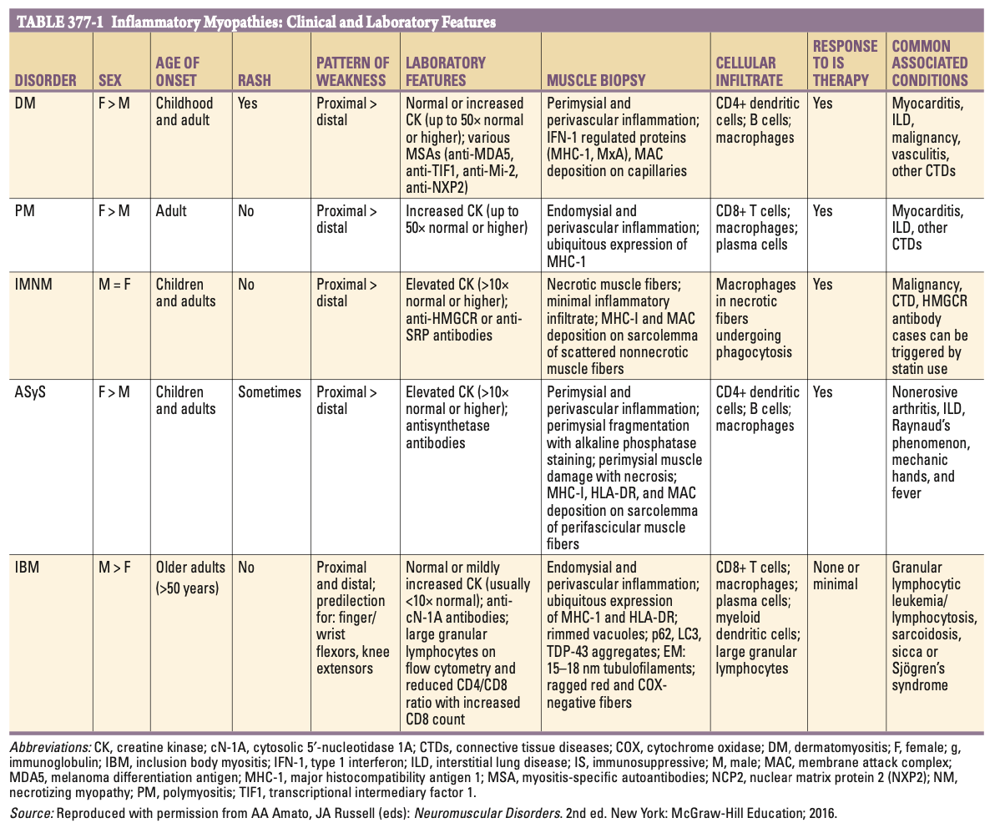
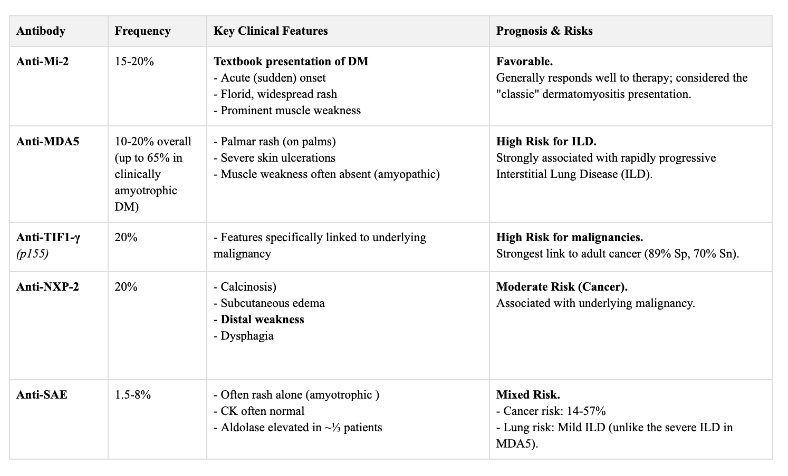
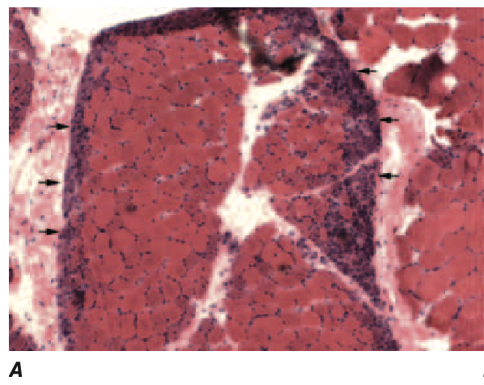
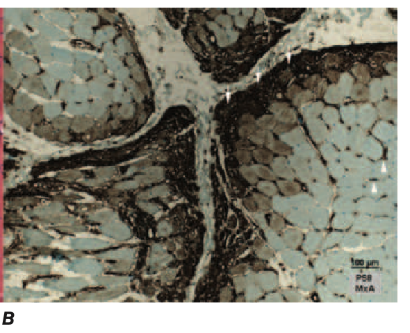
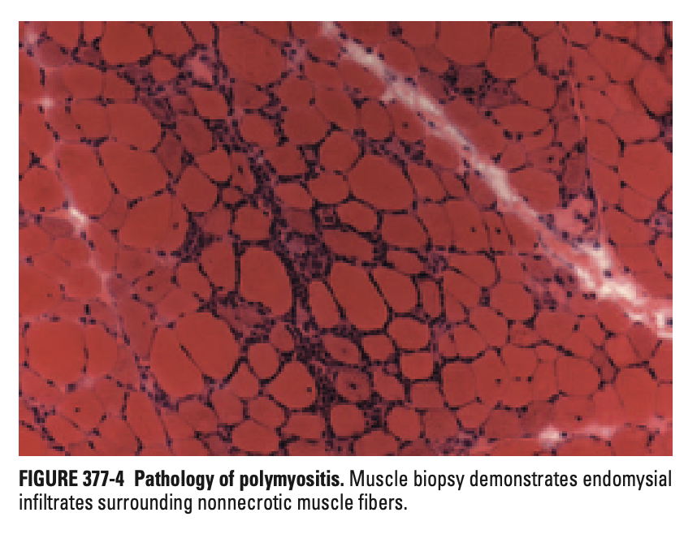
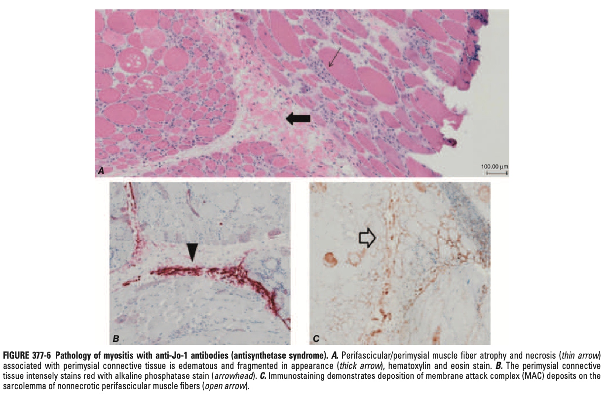
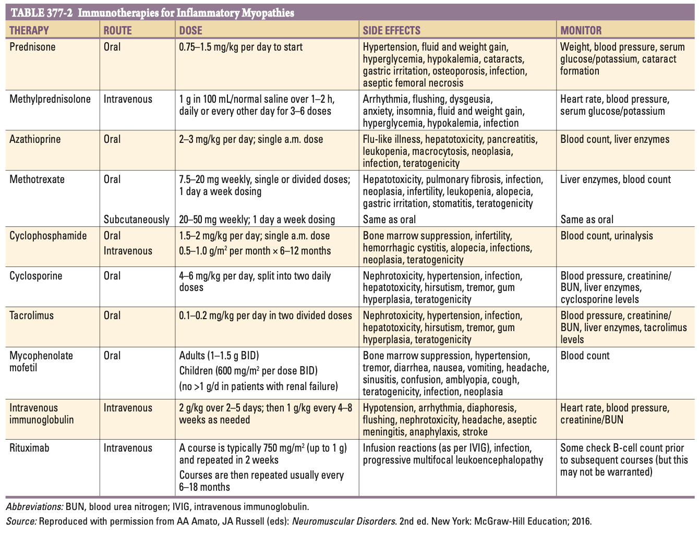

# Ch377 Inflammatory Myopathies

- **Major types of inflammatory myopathies** (IMs):
    - Dermatomyositis (DM)
    - Polymyositis (PM)
    - Immune-mediated necrotising myopathy (IMNM)
    - Antisynthetase syndrome (ASyS)
    - Inclusion body myositis

  
  
- **Other rarer forms of IMs:**
    - Infections (pyomyositis)
    - Eosinophilic myositis
    - Granulomatous myositis
    - Drug-induced myositis (statins, ICIs)
    - Toxic myopathies
    - Hereditary myopathies (not IMs but inflammatory cell infiltrates can be seen)
- **Epidemiology** - granular data on individual myositides is limited (although idiopathic PM w/o signs of overlap syndrome thought to be much rarer than other forms):
    - <u>Prevelance</u> - 14-32/100,000
    - <u>Incidence</u> - 16/100,000/y
    - <u>Demographic</u>:
        - Age - variable between entities (e.g. DM can occur in children and adults, while IBM exclusively occurs in \> 50y)
        - Sex - most show F preponderance except for IBM which shows M preponderance

## Diagnostic Approach and Differential Diagnosis

- **Additional information on further assessment based on likely lesion site:**
    - General approach to weakness (Ch26)
    - Suspected spinal cord lesion (Ch453)
    - Suspected anterior horn cell pathology (Ch448)
    - Suspected peripheral nerve pathology (Ch457-458)
    - Suspected NMJ disorder (Ch459)
    - Suspected myopathy (Ch460)
- **Principles of localising a lesion:**
    - Isolated weakness w/ no sensory involvement (after ruling out acute stroke) should raise the suspicion of anterior horn pathology, NMJ disorders, and myopathies (and ocassionally specific polyneuropathies such as multifocal motor neuropathy)
    - Hx and P/E are important for differentiation between myopathies from other neuromuscular disorders and differentiation of the different types of myopathies from each other
- **Important differentiating features in initial clinical assessment:**
    - <u>Concomitent sensory symptoms</u> - suggestive of a CNS problem (esp. spinal cord pathology), or polyneuropathy
    - <u>Early atrophy and fasciculations on examination</u> (+/- UMN lesions) - suggestive of a motor neuron disorder such as amyotrophic lateral sclerosis
    - <u>Fatigable weakness on examination</u> - myasthenia gravis
    - <u>Evidence of muscle hypertrophy</u> (e.g. calf hypertrophy, scapular winging) - strongly suggests muscular dystrophy esp. if +ve FHx
    - <u>Photosensitive rash</u> (e.g. heliotropic rash, Shawl sign, Gottron papules) - near diagnostic for DM
- **Initial Ix** - if unable to localise based on Hx and clinical examination alone:
    - <u>Creatine kinase</u> (CK) - most Sn marker of musle destruction, where markedly elevated CK (\> 2000 U/L) is near pathognomonic of a myopathic process:
        - False -ve - not all myopathies have elevated CK (e.g. IBMs)
        - False +ve - neurogenic processes may result in slightly elevated CK
    - <u>Electrophysiological studies</u> - NCS and EMG to localise the lesion, guiding muscle Bx especially if muscles normally biopsied appear normal on clinical examinations
    - <u>Myositis-specific Ab</u> - used to distinguish subtypes IMs (see below)
    - <u>Muscle Bx</u> - often required to distinguish one myopathy from another (see details below)
    - <u>MRI</u> - assessment of muscle involvement, fatty replacement, atrophy, oedema within muscles or surrounding fascia
- **Muscle Bx:**
    - <u>Indications</u> - pre-requisites include a high clinical suspicion of a myopathic process, evident by 1) abnormal clinical examination, 2) elevated CK, 3) abnormal EMG:
        - Often pursued in the absence of characteristic DM rash or myositis specific autoAb
        - If a diagnosis of PM suspected, pursued to exclude IBM especially when demographically fits
    - <u>Approach to selection of muscles to Bx</u> - common Bx sites include biceps brachii, triceps, deltoid, quadriceps (+/- gastronemius or tibialis anteror if distal myopathy suspected):
        - Guided by clinical examination - generally Bx of muscle that is clinically affected but not too weak (MRC 4/5) to avoid just revealing "end-stage muscle", where a myopathic process or severe neurogenic process cannot be differentiated
        - Guided by EMG - ocassionally used
- **Features not suggestive of IMs** - consider wider DDx such as PMR and fibromyalgia instead of offering muscle Bx:
    - Severe muscle pain
    - Subjective weakness and fatigue w/ normal strength and function
    - Normal CK and EMG (N.B. normal CK does not r/o IMs but a normal EMG makes it highly unlikely)

## Specific Disorders

### Dermatomyositis

- **Epidemiology** - can be present in children and adult:
    - <u>Children</u> - juvenile DM
    - <u>Adults</u> - higher risk of malignancies in adult-onset cases (~15% within first 2-3y)
- **Pathogenesis of DM:**
    - <u>Pathogenic role of MSA if DM</u> - starting to be described, e.g. anti-Mi-2 appears to enter myonuclei and exert its effects through CHD4/NuRD complex in the nucleosome
    - <u>Microvasculopathy mediated by type I INF pathways</u> - being described as driver of muscle and skin damage rather than Ab-mediated attack on endothelial cells
- **Spectrum of disease:**
    - <u>Classic DM</u> - prominent skin and muscle involvement
    - <u>Amyotrophic DM</u> - presence of characteristic rash w/ complete absence of muscle weakness
    - <u>Hypomyopathic DM</u> - presence of characteristic rash w/ minimal muscle disease
- **Clinical features of DM** - weakness and rash usually accompany each other but may be separated by months (requires clarification through Hx):
    - **Characteristic cutaneous rash** - photosensitive rash that can be particularly debilitating due to its possible "<u>pruritic</u>" nature:
        - <u>Heliotrope rash</u> - erythematous discolouration of the eyelids with periorbital oedema
        - <u>Gottron sign</u> - erythematous rash over extensor surfaces of joints such as the knuckles, elbows, knees, and ankles
        - <u>Gottron papules</u> - raised erythematous rash over the knuckles
        - <u>V-sign</u> - rash on sun-exposed areas of the anterior neck and chest w/ clear demarcation shaped like a V due to presence of T-shirts
        - <u>Shawl sign</u> - rash on sun-exposed areas of the posterior neck, neck, and shoulders akin to wearing a shawl
    - **Weakness** - due to myopathic process that is typically 1) <u>symmetrical</u>, and 2) <u>proximal greater than distal</u>, which may be a/w <u>myalgia</u> (although severe myalgia w/ absence of objectively demonstrable weakness is unlikely ims)
    - **Other features:**
        - <u>Arthralgia</u> - non-specific, non-erosive arthralgia
        - <u>Bulbar symptoms</u> - dysphagia and dysarthria due to myopathic process involving the bulbar muscles
        - <u>Dyspnoea</u> - can occur as a result of 1) ILD (anti-MDA5), 2) bronchopneumonia, 3) ventilatory muscle weakness, and 4) alveolitis
- **Ix:**
    - **Markers of muscle damage** - serum CK, serum aldolase:
        - <u>Serum CK</u> - elevated in 70-80% patients w/ DM (normal in 10% of DM)
        - <u>Serum aldolase</u> - may be elevated in those w/ normal CK
    - **EMG** - demonstration of a myopathic process but findings are non-specific for DM and can be seen in other myopathies:
        - Increased insertional and spontaneous activities (positive shartp waves and fibrillation potential)
        - Complex repetitive discharge along w/ early recruitment of small amplitude, short-duration, polyphasic motor units
    - **ANA** - can be +ve but is a non-specific findings
    - **Myositis-specific antibodies** (MSA) - complete MSA panel obtained but the following are specific for DM and are <u>a/w characteristic features</u> and recent studies reveal that they are in fact <u>pathogenic</u>:
        - <u>Anti-Mi-2</u> (15-20%) - anti-complex nucleosome remodeling histone deacetylase; typically **acute-onset of florid rash and prominent weakness**, and predicts good response to therapy and **favourable prognosis**
        - <u>Anti-TIF1-gamma</u> (20%) - anti-transcription intermediary factor 1-gamma (or p155), a/w **adult cancer-associated DM** (89% Sp, 70% Sp) especially within 3y of disease onset
        - <u>Anti-MDA5</u> (10-20%) - anti-melanoma differentiation-associated gene 5; associated w/ palmar rash, severe skin ulcerations from ischaemia, and **rapidly progressive ILD**
        - <u>Anti-NXP-2</u> (17%) - anti-nuclear matrix protein 2; a/w calcinosis, subcutaneous edema, distal weakness, dysphagia, and **malignancy**
        - <u>Anti-SAE</u> (1.5-8%) - anti-small ubiquitin-like modifier activating enzyme; a/w underlying cancer, and mild ILD

    
    
    - **Muscle Bx:**
        - <u>Histopathology</u> - perifascicular atrophy (50%):

            - Bordering on disrupted perimysial connective tissue
            - Perifascicular muscle fibres appears atrophic and basophilic on H&E stain

      
      

            - Additional features include inflammatory cell infiltrates in perivascular and located in perimysium, mainly composed of macrophages, B cells, and plasmacytioid dendritic cells

        - <u>IHC staining</u> - **myxovirus resistance protein A** (MxA) is diagnostic w/ high Sn and Sp:

            - Generally intense staining of MxA protein in perifascicular myofibrils
            - Exhibits a gradient of decreasing intensity from superficial to deep

      
      
    - **Skin Bx** - shows <u>cell-poor interface dermatitis</u>, analogous to perifascicular atrophy in the dermo-epidermal junction:
        - Inflammatory infiltrates minimal and when present located at border zone of dermis and epidermis
        - Basal layer of keratinocytes most damaged, w/ decreasing degree of damage moving more superficially
- **Prognosis:**
    - <u>Mortality</u> - generally favourable in the absence of malignancy (5y survival 70-93%)
    - <u>Poor prognostic factors</u>:
        - Increased age
        - Associated ILD
        - Myocarditis
        - Late or previous inadequate treatment
        - Malignancies

### Polymyositis

- **Definition** - heterogenous group of disorders presenting w/ symmetric, proximal weakness that worsens over several weeks or months, in the absence of skin involvements
- **Associations:**
    - Myocarditis
    - Interstitial lung disease
    - Arthralgias
    - Malignancies (traditionally risk thought to be lower in PM than DM, but these older series may include misdiagnosis of IBM or muscle dystrophies as having PM)
- **Clinical features of DM** - similar to other inflammatory myopathies:
    - **Weakness** - due to myopathic process that is typically 1) <u>symmetrical</u>, and 2) <u>proximal greater than distal</u>, which may be a/w <u>myalgia</u> (although severe myalgia w/ absence of objectively demonstrable weakness is unlikely IMs)
- **Ix:**
    - **Markers of muscle damage** - serum CK, serum aldolase:
        - <u>Serum CK</u> - invariably elevated in uncontrolled PM (normal CK should prompt suspicion of IBM in those \> 50y or a non-myopathic process)
        - <u>Serum aldolase</u> - may be elevated in those w/ normal CK
    - **EMG** - demonstration of a myopathic process but findings are non-specific for PM:
        - Increased insertional and spontaneous activities (positive shartp waves and fibrillation potential)
        - Complex repetitive discharge along w/ early recruitment of small amplitude, short-duration, polyphasic motor units
    - **Muscle Bx** - invariably necessary for Dx to r/o IBM:
        - <u>Histopathology</u> - variable histology suggestive a heterogenous group of disorder:
            - **Endomysial and perivascular inflammation** w/ non-specific inflammatory infiltrates
            - Presence of **true invasion into myofibers** indicative of IBM (but debate on whether this occurs in IM)

      
      
    - **Prognosis:**
        - <u>Mortality</u> - generally fair as responsive to Tx but requires life-long immunotherapies
        - <u>Poor prognostic factors</u> - similar to DM:
            - Increased age
            - Myocarditis
            - Interstitial lung disease
            - Late or previously inadequate Tx

### Overlap Syndrome

- **Myositis overlap** - inflammatory myopathy associated w/ other well-defined connective tissue isease:
    - <u>Mixed connective tissue disease</u> - overlap of SLE, SSc, and PM/DM a/w anti-U1-RNP
    - <u>Systemic sclerosis/ myositis overlap</u> - overlap of SSc and PM/DM a/w anti-Pm-SCl
    - <u>Sjogren's syndrome/ myositis overlap</u> - histopathologically IBM, usually poor Tx responsiveness
    - <u>Others</u> - overlap w/ SLE, RA etc.

### Immune-mediated Necrotising Myopathy

- **Causes of IMNM:**
    - Idiopathic (may be a/w specific Ab \[antiHMGCR and anti-SRP\], i.e. sero+ve, or absence of specific Ab, i.e. seronegative)
    - Underlying CTD (scleroderma, MCTD)
    - Malignancy (paraneoplastic necrotizig myopathy)
- **IMNM associated w/ specific Ab** - demonstrated to be pathogenic through histopathological correlation:
    - <u>Anti-HMGCR myopathy</u> - uncommon form of statin-associated myopathy (cf toxic myopathy a/w statin use), whch does not improve w/ discontinuation of statins
    - <u>Anti-SRP myopathies</u> - typically subacute, aggressive, and relatively refractory to Tx
- **Clinical features of IMNM** - similar to other inflammatory myopathies:
    - **Weakness** - due to myopathic process that is typically 1) <u>symmetrical</u>, and 2) <u>proximal greater than distal</u>, which may be a/w <u>myalgia</u> (although severe myalgia w/ absence of objectively demonstrable weakness is unlikely IMs)
    - **Associated features:**
        - <u>Myalgia</u> - due to myopathic process
        - <u>Bulbar Sx</u> - dysphagia and dysarthria
- **Ix:**
    - **Serum CK** - invariably markedly elevated (\> 10x ULN) due to necrosis
    - **Specific Ab for IMNM:**
        - Anti-HMGCR
        - Anti-SRP
    - **EMG** - non-specific changes
    - **Muscle Bx:**
        - Multifocal <u>necrotic</u> and <u>regenerative</u> myofibers
        - Generally <u>paucity of immune cells</u> (although some cases of anti-HMGCR myopathy have endomysial, macrophage predominant infiltrates similar seen in PM)
- **Prognosis:**
    - <u>Mortality</u> - generally poor (esp. late Dx)
    - <u>Response to Tx</u> - variable:
        - Anti-HMGCR generally responds to IVIG
        - Anti-SRP myopathy and sero-ve IMNM are more refractory to Tx

### Antisynthetase Syndrome

- **Definition** - specific syndrome of myositis, non-erosive arthritis, ILD, Raynaud's phenomenon, mechanical hands, and fever associated w/ antibodies against <u>aminoacyl-tRNA synthetase</u>
- **Clinical features of ASyS** - can present w/ rash and myositis mimicking DM (in fact these patients were previously classified as having DM):
    - Myositis (may show histopathological features of DM)
    - Non-erosive arthritis
    - ILD
    - Raynaud's phenomenon
    - Mechanic hands
    - Fever
    - DM-like rash
- **Ix:**
    - **Serum CK** - usually elevated
    - **Myositis-specific antibodies** (MSA) - Ab against aminoacyl-tRNA synthetase are the most common MSA, presenting in 25-35% of patients w/ myositis:
        - <u>Anti-Jo-1</u> (most common) - Ab against histidyl-tRNA synthetase
        - <u>Anti-PL-7</u> - Ab against threonyl-tRNA synthetase
        - <u>Anti-PL-12</u> - Ab against alanyl-tRNA synthetase
        - <u>Anti-EJ</u> - Ab against glycyl-tRNA synthetase
        - <u>Anti-OJ</u> - Ab against isoleucyl-tRNA synthetase
        - <u>Anti-KS</u> - Ab against asparaginyl-tRNA synthetase
        - <u>Anti-Ha</u> - Ab against tyrosyl-tRNA synthetase
        - <u>Anti-Zo</u> - Ab against phenylalanyl-tRNA synthetase
    - **EMG and MRI** - non-specific changes similar to other IMs
    - **Muscle Bx** - predilection for <u>perimysial damage</u>:
        - <u>Histopathology</u>:
            - Perifascicular muscle damage often w/ perfasicular necrosis (cf atrophy in DM)
            - Plasmacytoid dendritic cells and macrophage infiltrations in perimysum
        - <u>IHC staining</u>:
            - Perimysial Perimysial fragmentation and staining w/ ALP
            - Deposition of MAC, MHC-I, MHC-II (esp. HLA-DR) on sarcolemma of perifascicular muscle fibers

    
    
- **Prognosis:**
    - Do not appear to be at an increased risk of malignancy
    - Most respond to Tx although can be difficult to Tx esp. w/ ILD (requires early rituximab)

### Inclusion Body Myositis

## Treatment of Inflammatory Myopathies

- **Overview of Tx responsiveness of IMs:**
    - DM, PM, ASyS, IMNM and overlap syndromes (except Sjogren's overlap) are typically responsive to immunotherapy
    - IBM generally have no responsiveness to immunotherapy where mainstay of Tx is mainly physical, occupational and speech therapy
- **Principles of Mx:**
    - <u>General measures</u> - PT, OT, ST
    - <u>Immunotherapy</u>:
        - Induction therapy - typically consists of high-dose corticosteroids +/- IVIG
        - Maintenance therapy - low-dose steroids +/- consideration of steroid-sparing agents in an individualised manner
    - <u>Monitoring and screening for disease-specific complications</u> - malignancy screen and ILD, complications of drugs
- **Immunotherapies for IMs:**
    - <u>Induction therapy</u> - prednisone +/- IVIG
    - <u>Maintenance therapy</u> - low-dose steroids or steroid sparing agents, such as **MTX**, AZA, MMF, rituximab

  
  
- **Considerations for early initiation of second-line agents:**
    - Severe weakness or other organ involvement (e.g. myocarditis, ILD)
    - Those at risk of steroid-related complications (e.g. diabetics, osteoporosis, or post-menopausal women)
    - Those w/ IMNM who are known to have difficulty to Tx myositis
    - Failure of Tx on prednisone alone after 2-4 mo, or those failing steroid taper
- **Glucocorticoid therapy** - often as 1st-line agent as both induction therapy and maintenance dosing:
    - <u>Dosing</u> - high-dose prednisone (or pulse MP if visceral involvement), w/ gradual taper starting w/ return of strength:
        - IV Pulse MP (1g for 3d) prior to oral prednisone in patients w/ severe weakness, ILD, or myocarditis
        - Induction therapy of oral prednisone at 0.75-1.5 mg/kg/d up to 100 mg/d (usual starting dose of P60)
        - High-dose therapy until strength normalises or until improvement of strength until reaches a plateau (usu. 3-6 mo)
        - Gradual dose-reduction by 5 mg every 2-4 weeks until P20, followed by dose-reduction by 2.5 mg every 2-4 weeks
        - Goal is to taper until \<= 10mg
    - <u>Assessment of Tx responsiveness</u>:
        - Objective clinical examination (rather than CK or patient subjective Tx)
        - Lack of response raises suspicion of alternative DDx (e.g. IBM, or inflammatory muscular dystrophy)
    - <u>S/E</u> - see notes on glucocorticoids, but consider differentiation between steroid-induced myopathy and relapse of myositis:
        - Steroid-induced myopathies - new onset weakness during high-dosage, normal CK and EMG, and other Cushingoid features
        - Relapse of myositis - new onset of weakness during taper, increasing CK, and abnormal EMG
- **IVIG:**
    - <u>Indications</u>:
        - Monotherapy in Anti-HMGCR myopathy (form of IMNM)
        - Can be considered as 1st-line therapy for DM (PRODERM trial shows superiority over placebo but increased risk of thromboembolic events)
    - <u>Dosing</u>:
        - Induction w/ 2g/kg divided over 2-5 days
        - Repeated monthly infusion over at least 3mo, w/ subsequent lengthening of intervals
    - <u>S/E</u> - **thromboembolic events**
- **Second-line therapies:**
    - <u>Methotrexate</u> (5-7.5 mg/wk starting dose increasing to 25mg w/ folate supplementation) - considered second-line drug of choice due faster onset of action
    - <u>Azathioprine</u> (50 mg/d starting dose increasing to 2-3 mg/kg/d) - limited by slow onset of action and S/E
    - <u>MMF</u> (1g/d in divided dose escalated up to 3g/d) - considered Tx of choice for myositis a/w ILD
    - <u>Rituximab</u> - often considered for patients who are refractory to prednisone, IVIG, and one of the other second-line agents

## Myositis Associated with Checkpoint Inhibitors

- **IRAE-associated myositis** - occurs in isolation, or in a/w myocarditis and MG ("3M syndrome"):
    - Typically presentation w/ myalgia and symmetrical proximal weakness
    - Presence of bulbar Sx and diplopia <u>should not be attributed to myositis</u>, but should seek <u>co-occurence of MG</u>
    - <u>Myocarditis</u> may often develop
    - Ix should include both CK and anti-AChR and screen for myocardial involvement
    - Requires discontinuation of ICIs, and immediate concurrent Tx w/ glucocorticoids or IVIG (generally improve over several months)

## Myositis Associated with COVID-19 Infection

## Global Issues
