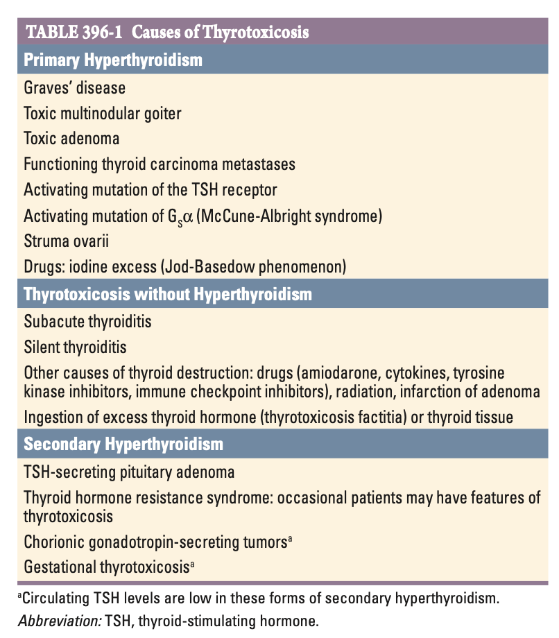
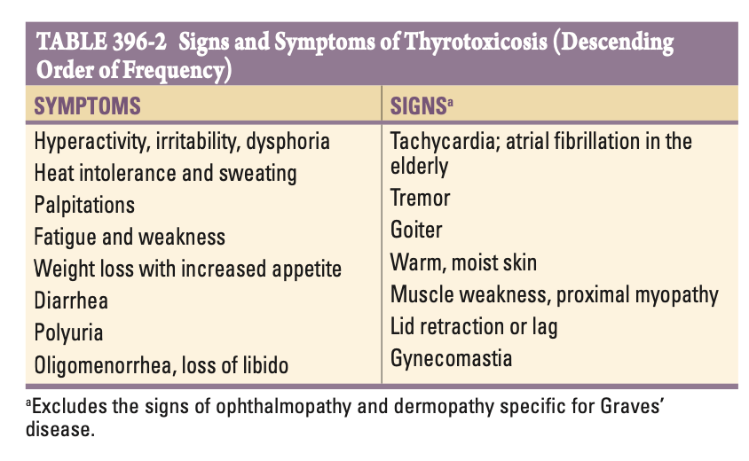
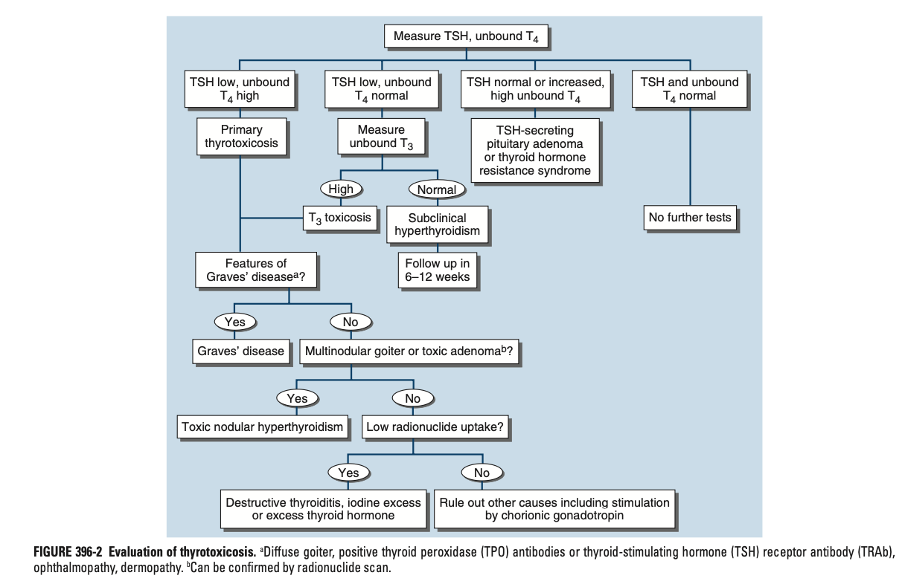
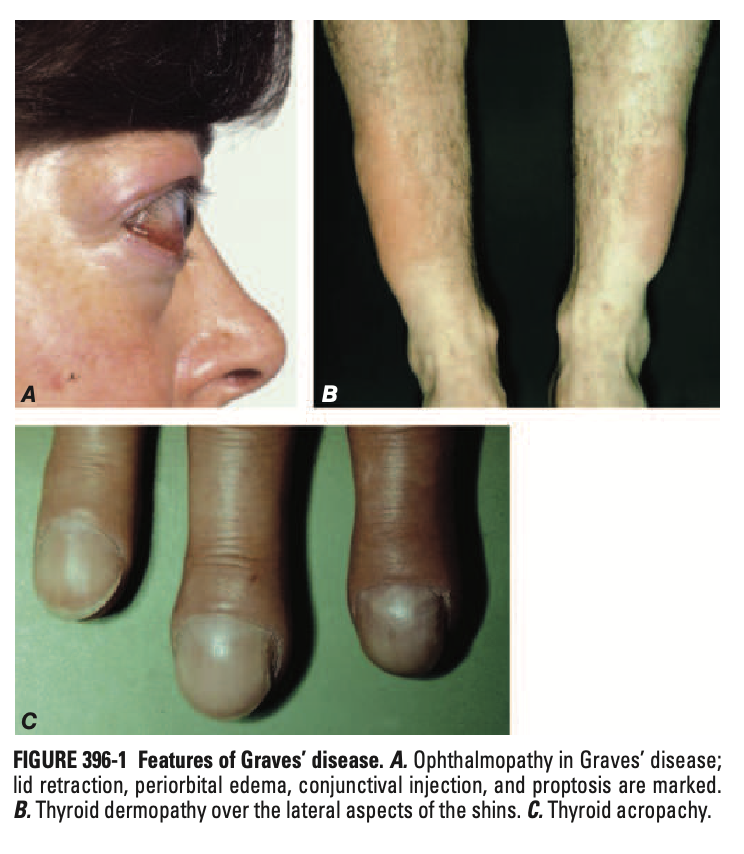
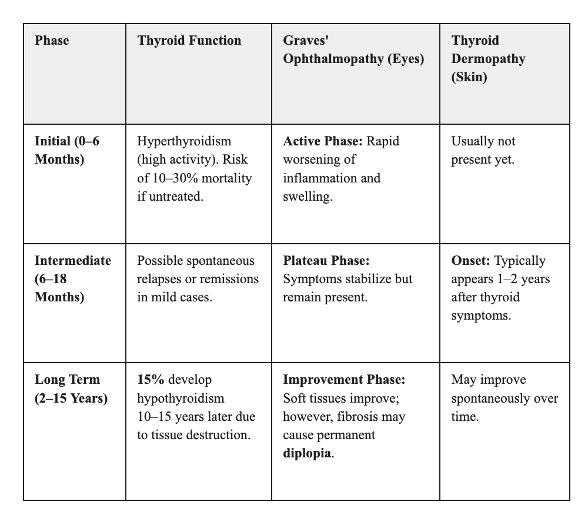
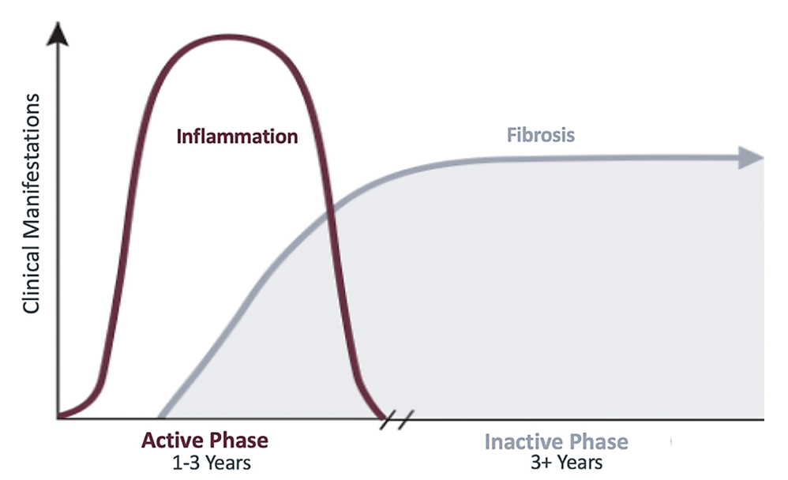
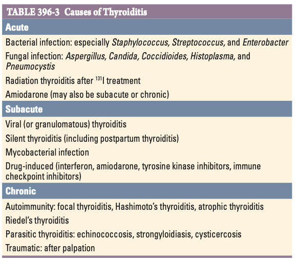
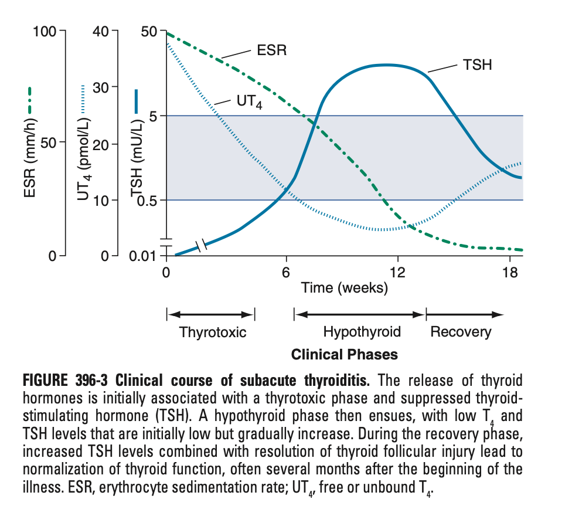

# Ch396 Hyperthyroidism and Other Causes of Thyrotoxicosis

## Thyrotoxicosis

- **Definition and terminology:**
    - <u>Thyrotoxicosis</u> - defined as a state of thyroid hormone excess, arising from 1) primary or secondary hyperthyroidism, and 2) release of colloid from destructive thyroiditis
    - <u>Hyperthyroidism</u> - the result of excessive thyroid function due to autonomous secretion, due to 1) Graves' disease, 2) toxic multinodular goitre, and 3)toxic adenomas
- **DDx of thyrotoxicosis:** 

    - **Primary hyperthyroidism** - autonomous secretion of T3/4 by the thyroid gland characterised by uptake signals in radioactive iodine scans:
        - <u>Autoimmune thyroid disease</u> - Graves' disease (60-80% cases of thyrotoxicosis)
        - <u>Simple or multinodular goitre</u> - Toxic multinodular goitre (TMG), solitary toxic adenoma
        - <u>Iodine-related causes</u> (Jod Basedow phenomenon) - iodine excess, amiodarone (N.B. multifactorial)
        - <u>Ectopic source of thyroid hormone</u> - struma ovarii
        - <u>Activating mutations resulting in autonomous production of thyroid hormones</u>:
            - McCune-Albright syndrome (activating mutation of Gs-alpha)
            - Activating mutation of the TSH receptors
    - **Thyrotoxicosis w/o hyperthyroidism** - reduced uptake in radioactive iodine scans:
        - <u>Exogenous source</u> - thyrotoxicosis factitia, ingestion of thyroid tissue
        - <u>Transient thyroiditis</u>:
            - Subacute thyroiditis
            - Silent thyroiditis
            - Drug-induced thyroiditis
            - Radiation thyroiditis
    - **Secondary hyperthyroidism:**
        - TSH-oma
        - Chorionic gonadotropin-secreting tumours (suppressed TSH)
        - Gestational thyrotoxicosis (suppressed TSH)
    - **Peripheral hyperthyroidism** - Resistance to thyroid hormone (features of thyrotoxicosis)
- **S/S of thyrotoxicosis:** 

- **Evaluation of the patient w/ thyrotoxicosis:** 

### Graves' Disease

- **Definition** - an autoimmune thyroid disorder characterised by antibodies against TSH-R
- **Epidemiology** - accounts for 60-80% cases of thyrotoxicosis:
    - <u>Prevalence</u> - genographically variable; High regional iodine intake a/w higher prevalence of Graves' disease
    - <u>Demographic</u>:
        - Age - rarely occurs during adolescence; onset typically 20-50y but can occur in the elderly
        - Sex - female preponderance (F:M = 10:1)
- **Pathogenesis of Graves' disease:**
- **Clinical manifestations of Graves' disease:**
    - **Features of hyperthyroidism and thyrotoxicosis** - variable cliinical presentation depending on 1) severity, 2) duration, 3) susceptibility to thyrotoxicosis, and 4) age:
        - **Weight loss despite increased appetite** - decrease in weight despite subjective sensation of increased in appetite due to an increased metabolic rate:
            - <u>Apathetic thyrotoxicosis</u> (common in elderly) - non-specific presentation w/ fatigue and weight loss +/- other features of fatiguability such as insomnia and impaired concentrations, while other S/S of thyrotoxicosis is masked (often indistinguishible from **depression** or **underlying malignancy**)
            - <u>Weight gain</u> (5%) - as a result of increased food intake out-pacing the increased metabolic rate
        - **Neurological manifestations:**
            - <u>Irritability</u> - often prominant **hyperactivity**, **nervousness**, **uneasiness**, **dysphoria**, where the heightened state of alertness ultimately leads to a **sense of fatiguability** (insomnia and impaired concentration follows, N.B. apathetic thyrotoxicosis)
            - <u>Tremors</u> - fine postural tremors best elicit by having patients stretch out fingers while feeling the finger tips w/ palms
            - <u>Proximal myopathy</u> - associated w/ muscle wasting but absence of fasciculations (and paradoxical hyperrefleixia \[i.e. non-LMN pattern\])
            - <u>Chorea</u> - rare manifestation resulting in involuntary movements of the limbs
            - <u>Hypokalaemic periodic paralysis</u> - particularly in oriental men w/ thyrotoxicosis (see below)
        - **Cardiovascular manifestations:**
            - <u>Palpitations</u> - as a result of 1) **sinus tachycardia**, 2) **supraventricular tachycardia**, 3) **atrial fibrillation** (see below)
            - <u>Atrial fibrillation</u> - common in those \> 50y, but usually sinus rhythm restored in 75% patients w/o underlying heart disease
            - <u>Other cardiovascular manifestations</u> - dependent on underlying cardiac disease:
                - Worsening angina - due to increased myocardial demand in a patient w/ underlying CCS
                - Worsening heart failure - due to high output state
        - **Cutaneous manifestations:**
            - <u>Heat intolerance</u> - intolerant to heart particularly during warm weather
            - <u>Sweating</u> - often a prominent complaint a/w heat intolerance, particularly over the arms
            - <u>Alopecia</u> - hair thinning and diffuse alopecia can occur in 40% of patients w/ long-standing hyperthyroidism, and may not completely resolve after restoration of euthyroidism
        - **Gastrointestinal manifestations** - due to decreased transit time, resulting in:
            - Increased stool frequency
            - Diarrhoea
            - Mild stearrhoea
        - **Other endocrine manifestations:**
            - <u>Bone resorption and osteopenia</u> - osteopenia only ensues w/ long-standing thyrotoxicosis and is a/w increased fracture risk, while hypercalciuria and mild hypercalcaemia (20%) is more common
            - <u>Amenorrhoea and decreased libo</u> - likely caused by alterations of SHBG
    - **Clinical features of Graves' opthalmopathy** - usual <u>onset 1y before or after thyrotoxicosis</u>, can occur in the absence of thyrotoxicosis in 10%, i.e. Thyroid eye disease (TED):
        - <u>Features due to prolonged corneal exposure</u> - sensation of grittiness, excess tearing, periorbital edema, scleral injection, chemosis
        - <u>Diplopia</u> - due to muscle swelling, typically worse when looking upward and laterally (superior and lateral rectus)
        - <u>Compressive optic neuropathy</u> - due to retro-orbital swelling, leading to papilledema, peripheral field defects and permanent visual loss
    - **Clinical features of thyroid dermopathy** (\< 5%) - almost always occurs in the presence of moderate-to-severe GO:
        - <u>Pretibial myxoedema</u> - non-inflamed indurated plaque w/ deep pink or purple colour and orange skin appearance over the anterior shin (but can occur in other sites of trauma)
        - <u>Thyroid acropachy</u> (\< 1%) - clubbing in the presence of Graves' disease, but so strongly associated w/ thyroid dermopathy that absence of skin or orbital involvement should raise suspicion of other cause of clubbing

    
    
- **"NO SPECS" scoring system** - useful mnenomic but inadequate to systematically assess disease activity:
    - 0 = No sign or symptoms
    - 1 = Only signs (lid retraction or lag), no symptoms
    - 2 = Soft tissue involvement (periorbital edema
    - 3 = Proptosis (\> 22 mm)
    - 4 = Extra-ocular muscle involvement (diplopia)
    - 5 = Corneal involvement
    - 6 = Sight loss
- **European Group on Graves' Orbitopathy System** (EUGOGO) - developed for monitoring of Tx responsivenes:
- **Ix:**
    - **TFT** - most will have suppressed TSH, and increased total and free T4/3:
        - <u>TSH</u> - invariably suppressed (u.d. \< 0.01 mIU/L)
        - <u>T4/T3</u> - normally total and free T4/3 elevated:
            - T3 toxicosis (2-5%) - T4 normal but fT3 elevated (common in regions of borderline iodine intake)
            - T4 toxicosis - fT4 elevated but T3 normal (due to iodine excess, i.e. Jod Basedow effect)
    - **TRAb** - +ve; supportive of Dx
    - **Other Ix:**
        - <u>Radioactive iodine scan</u> - used to exclude other causes of thyrotoxicosis (see below)
        - <u>Doppler USG</u> - able to differentiate between causes of thyrotoxicosis w/o radioactivity (see below
    - **Other laboratory features:**
        - <u>CBC</u> - microcytic anaemia and thrombocytopenia
        - <u>LFT</u> - elevated bilirubin, liver enzymes
        - <u>Iron profile</u> - raised ferritin
- **Doppler USG thyroid** - differentiating between hyperthyroidism, and thyrotoxicosis w/o hypothyroidism (e.g. destructive thyroiditis):
    - <u>Hyperthyroidism</u> - e.g. Graves' disease, TMG, a/w **increased blood flow**
    - <u>Thyrotoxicosis w/o hyperthyroidism</u> - e.g. destructive thyroiditis, factitious thyrotoxicosis, a/w **decrease in blood flow**
- **Radioactive iodine scan:**
    - <u>Reduced uptake</u> - suggestive of thyrotoxicosis w/o hyperthyroidism, i.e. destructive thyroditis, factitious thyrotoxicosis
    - <u>Diffuse uptake</u> - suggestive of Graves' disease
    - <u>Focal uptake w/ reduced uptake</u> - toxic adenoma or toxic MNG
    - <u>Ectopic uptake</u> - ectopic thyroid tissue
- **Natural Hx and clinical course of Graves' disease:** 

    - **Clinical course of Graves' hyperthyroidism:**
        - <u>Spontaneous relapse and remission</u> - for those w/ mild Graves' disease, spontaneous relapse and remission may occur
        - <u>Progressive disease</u> (most common) - generally worsening of thyroid status w/o Tx (10-30% mortality)
        - <u>Alternating thyroid status</u> - rarely fluctuations of hypothyroidism and hyperthyroidism due to changes in functional activity of TSH-R Ab
        - <u>Spontaneous hypothyroidism after remission</u> (15%) - hypothyroidism 10-15y after remisison due to onset of new destructive autoimmune process
    - **Clinical course of Graves' opthalmopathy** (<u>Rundle's curve</u>) - does not follow that of thyroid disease although thyroid dysfunction can worsen eye signs:
        - <u>Initial worsening of opthalmopathy</u> (initial 3-6 mo) - usually worsening eye Sx w/o Tx, and can be a rapid fulminant course (5%) if there is optic nerve compression and corneal ulcerations
        - <u>Plateau phase</u> (susbequent 12-18 mo) - phase of disease in-activity or mild disease activity, but diplopia may occur late w/ fibrosis
        - <u>Spontaneous improvement</u> - some subjective improvement attributable to soft tissue changes

    
    
    - **Clinical course of thyroid dermopathy** - appears 1-2y afater development ofo Graves' hyperthyroidism, often concurrently w/ moderate-to-severe GO

1.  Teratment of Graves' Disease

    - **Principles of Mx:**
      - <u>Mx by disease components</u> - considerations for the components of the Graves' triad, noting that presence of one component may influence the choice of therapy for another component (N.B. presence of active GO limits use of RAI)
      - <u>Mx of disturbing Sx and disease complications</u> - e.g. beta-blockade for Sx relief, anticoagulation for those w/ atrial fibrillation
    - **Disease components of Graves' disease and their approach to Mx:**
      - <u>Graves' hyperthyroidism</u> - 1) antithyroid medications, 2) radioactive iodine, 3) thyroidectomy
      - <u>Graves' opthalmopathy</u> - 1) general measures, 2) selenium, 3) immunosuppression and other biologics
      - <u>Thyroid dermopathy</u> - 1) topical steroids, 2) teprotumumab in selected cases
    - **Antithyroid drugs** (thionamides) - generally considered 1st-line therapy in most centres (NA practices RAI as first line):
      - **Selection:**
        - Propylthiouracil
        - Carbimazole (pro-drug) and methimazole (active metabolite)
      - **MOA:**
        - <u>Inhibition of TPO</u> - reduces oxidation and organification of iodide
        - <u>Inhibition of autoimmunity</u> - reflected reduced circulating TRAb levels although mechanism unclear
        - <u>Inhibition of peripheral conversion of T4 to T3</u> - only **propylthiouracil**, although benefits is limited except in severe thyrotoxicosis and thyroid storm
      - **Principles of dosing** - tapering regimen:
        - Higher initial doses with divided dosing in the initial stage of the disease
        - Progressive tapering of ATD w/ once-daily dosing as thyrotoxicosis improves
        - Preferred to minimize the dose of ATD and provide an index of Tx response
      - **Propiouracil:**
        - <u>Pharmacokinetics</u> - short-half life (90 min)
        - <u>Indications</u> - FDA limit indications for:
          - First trimester of pregnancy
          - Thyroid storm
          - Minor adverse reactions to methimazole
        - <u>Dosing</u> - depending on scenario:
          - Initial and maintenance threapy - 100-200 mg q6-8h titrated down to 50-100 mg/d
          - Thyroid storm - 500-1000 mg loading dose + 250 mg q4h
        - <u>Major S/E</u> - hepatotoxicity
        - <u>Monitoring</u> - routine LFTs
      - **Carbimazole and methimazole:**
        - <u>Pharmacokinetics</u> - substantially longer half-life than PTU (6h)
        - <u>Indications</u> - usually 1st-line
        - <u>Dosing</u> - initial 10-20 mg q12h followed by 2.5-10 mg o.d maintenance
        - <u>Majore S/E</u>:
          - Agranulocytosis
          - Teratogenicity (hence not used in 1st-trimester of pregnancy)
        - <u>Caution</u> - written instructions
      - **Clinical efficacy:**
        - <u>Remission rates</u> - 30-60% achieved by 12-18 mo for titration regimen
        - <u>Factors a/w higher rates of relapse</u>:
          - Geographical variation (unknown)
          - TRAb persistance
          - Younger patients
          - Male
          - Smokers
          - Hx of allergy
          - Severe hyperthyroidism
          - Large goitre
      - **S/E:**
        - **Minor S/E:**
          - <u>Rash</u> (5%) - urticarial, pruritic rash, responds to anti-histamines
          - <u>Arthralgia</u> (1-5%) - non-specific rash may resolve w/ substitution of another ATD
        - **Major S/E** - should stop and not restart ever again:
          - <u>Hepatotoxicity</u> - hepatitis w/ PTU (avoid in children), cholestasis w/ CMX or MMX
          - <u>Agranulocytosis</u> (\< 1%) - life-threatening S/E, often idiosyncratic and abrupt w/ no role of routine monitoring:
            - Written instruction regarding S/S of possible agranulocytosis (e.g. sore throat, fever, ulcers)
            - Immediate presentation and CBC to confirm agranulocytosis
          - <u>Vasculitis</u> - ANCA-associated vasculitis
    - **Adjunctive therapies:**
      - **Propanolol:**
        - <u>Indications</u>:
          - Sx relief especially in early stages before ATD takes effect
          - Thyrotoxic periodic paralysis pending correction of thyrotoxicosis
        - <u>MOA</u>:
          - Non-specific inhibition of beta-adrenergic drive
          - Inhibition of peripheral conversion of T4 to T3 (cf other BBs)
        - <u>Dosing</u> - PO 20-40 mg q6h
      - **Anticoagulation** - shared decision w/ patients and cardiologists using risk scores
    - **Radioiodine therapy** (RAI):
      - <u>Indications</u>:
        - As initial Tx in selected cases
        - Relapse after a trial of ATD
      - <u>MOA</u> - progressive destruction of thyroid follicles
      - <u>Procedures</u>:
        - Pre-treatment of ATD +/- beta-blockers for all paients for \>= 1 mo to render patient symptom free and euthyroid
        - Cessation of carbimazole or methimazole 2-3d prior to scheduled RAI to ensure optimum iodine uptake (PPU have more prolnged radioprotective effects and should be stopped for longer)
        - Administration of RAI as a single dose
        - Consider resarting ATD for those at risk for complications from worsening thyrotoxicosis
      - <u>Dosing</u> - 10-15 mCi (370-555 MBq):
        - Theoretical optimal dose aimed at 1) achieving euthyroidism, 2) prevention of relapse, and 3) prevent progression to hypothyroidism, but has not been discovered
        - Fixed dose based on set of clinical features including:
          - 1\. Severity of thyrotoxicosis
          - 2\. Size of goiter (larger goiter requires higher dosage)
          - 3\. Radioiodine uptake (higher update decreases dosage needed)
      - <u>Safety precautions after radiodine Tx</u>:
        - Early period - avoid close, prolonged contact with children and pregnant women for 5-7d to prevent transmission of residual isotope and exposure to radiation from the gland
        - Prolonged period - pregnancy and breast-feeding absolutely contraindicated for 6mo
      - <u>C/I</u>:
        - Pregnancy or breast-feeding
        - Active GO
      - <u>S/E</u>:
        - Exacerbation of GO - esp. for active GO in smoker
        - Malignancy (minimal)
        - Hypothyroidism (most will develop overt hypothyroidism in 5-10y)
      - <u>Adjunctive therapy</u>:
        - Prednisone 0.2-0.5 mg/kg/d if mild-active GO
        - ATD and beta-blockers restarted 5-7d after radioiodine if persistent Sx or at risk for cardiac complications
    - **Thyroidectomy** - total or near-total thyroidectomy preferred over subtotal thyroidectomy:
      - <u>Soft indications for thyroidectomy</u>:
        - Large goitre w/ compressive Sx
        - Young individuals
      - <u>Pre-operative Mx</u> - render patient euthyroid and reduce vascularity of thyroid pre-operative to minimise risk of thyroid storm:
        - ATD until euthyroid
        - SSKI 1-2 drops PO tid for 10d prior to surgery
      - <u>S/E</u> - see detail notes on thyroidectomy
    - **Thyroid storm** (thyrotoxic crisis):
      - **Definition** - life-threatening exacerbation of hyperthyroidism, accompanied by fever, delirium seizures, coma, vomiting, diarrhoea, and jaundice
      - **Precipitating factors of thyroid storm:**
        - <u>Acute illness</u> - infection, stroke, MI, trauma, DKA etc.
        - <u>Iatrogenic</u> - thyroid surgery or RAI in those w/ partially treated or untreated hyperthyroidism
      - **Mx:**
        - <u>Supportive therapy</u> - IV fluids, O2, cooling, ABx if concurrent infection
        - <u>Propylthiouracil</u> - 500-1000 mg loading dose and 250 mg q4h PO or via NG tube:
          - Preferred antithyroid medication due to **inhibitory action on T4 to T3 conversion**
          - Otherwise methimazole 20 mg q6h
        - <u>Stable iodide</u> - lugol's solution or SSKI (5 drops q6h) given one hour after first dose of antithyroid medications:
          - Blockade of thyroid hormone synthesis via **Wolff-Chaikoff effect**
          - The delay relative to PTU dosing is to allow PTU to prevent incorporation of iodine into new hormone
        - <u>Propanolol</u> - PO 60-80 mg q4h or IV 2mg q4h:
          - Non-selective beta-blockade to reduce tachycardia and other adrenergic effects
          - Added benefit of **reducing peripheral conversion of T4 to T3** (compared to other BBs)
          - Rate control necessary despite ADHF as some patients develop high-output failure
        - <u>Hydrocortisone</u> - IV 300 mg bolus followed by 100 mg q8h
        - <u>Cholestyramine</u> - for sequestration of thyroid hormone
      - **Prognosis** - poor:
        - High mortality rate (4-17%)
        - Heart failure, arrhythmias, and hypothermia are key drivers to mortality

### Other Causes of Thyrotoxicosis

- **TSH-secreting pituitary adenoma** (TSH-oma):
    - <u>Biochemical features</u> - inappropriately normal or increased TSH levels in patients w/ hyperthyroidism, elevated T4/3 levels
    - <u>Dx of TSH-oma</u>:
        - Compatible biochemical picture of secondary hyperthyroidism
        - Elevated levels of alpha-subunit of TSH (released by TSH-oma)
        - Pituitary tumour on MRI pituitary gland
    - <u>Mx</u>:
        - Definitive Mx - transphenoidal surgery or sela irradiation (+/- octreotide to normalise TSH and control local Sx
        - Mx of thyrotoxicosis - RAI or antithyroid drugs

## Thyroiditis

- **Approach to classification of thyroiditis:**
    - <u>Based on onset and duration</u> - acute thyroiditis, subacute thyroiditis, chronic thyroiditis
    - <u>Based on pain</u> - painful thyroiditis vs painless thyroiditis
- **Classification of thyroiditis:** 

- **DDx of thyroid pain:**
    - Subacute thyroiditis
    - Haemorrhage into a cyst
    - Thyroid malignancy including lymphoma
    - Amiodarone-induced thyroiditis
    - Amyloidosis

### Acute Thyroiditis

- **Definition** - clinical syndrome of thyroiditis that is acute in onset, often caused by suppurative infection of the thyroid
- **Pathophysiology of painful thyroiditis** - presence of piriform sinus (usu. left-sided):
    - Remnant of the embryonic 4th branchial pouch
    - Direct connection between the oropharynx and the thyroid
- **Risk factors of painful thyroiditis:**
    - <u>Children and young adults</u> - persistent piriform sinus (see above)
    - <u>Elderly</u> - long-standing goitre, degeneration in thyroid malignancy
- **Causes of acute thyroiditis:**
    - **Infective:**
        - <u>Bacterial</u> - oral compensals esp. Staphylococcus, Streptococcus, and Enterobacter
        - <u>Fungal</u> - Aspergillus, Candida, COccidiodes, Histoplasma, Pneumocystis
    - **Non-infective** - Radiation thyroiditis, amiodarone
- **Clinical features of acute thyroiditis** - abrupt onset of 1) thyroid pain, 2) compressive Sx, and 3) marked systemic complaints:
    - **Thyroid pain** - pain and tenderness over the thyroid:
        - <u>Site</u> - thyroid, often asymetrical
        - <u>Onset and duration</u> - acute
        - <u>Radiation</u> - to the throat or ears
        - <u>Severity</u> - severe; markedly tender on palpation
    - **Goitre** - may not be immediately present, but a small, asymetrical, exquisitely tender goitre may be present
    - **Compressive Sx:**
        - <u>Dysphagia</u> - out-of-proportion to the goitre possibly due to exacerbation of pain
        - <u>Dyspnoea</u> - rare as goitre minimal
    - **Systemic complaints:**
        - <u>Fever</u> - a/w other features of a febrile illness
        - <u>Lymphadenopathy</u> - presence of cervical LN
- **Ix:**
    - **Routine bloods** - CBC, ESR, TFT:
        - <u>CBC</u> - leukocytosis
        - <u>ESR</u> - non-specifically elevated
        - <u>TFT</u> - grossly normal
    - **FNAC:**
        - <u>Microscopic examination</u> - infiltration by PMN w/ organisms on Gram stain
        - <u>Culture</u> - identification of organism
- **Mx:**
    - **Principles of Mx:**
        - <u>ABx</u> - initially guided by G stain followed by Sn testing on culture
        - <u>Surgical drainage</u> - CT-guided or USG guided drainage of abscess
- **Complications** - rare w/ prompt ABx:
    - Tracheal obstruction
    - Septicaemia
    - Retropharyngeal abscess
    - Mediastinitis
    - Jugular venous obstruction

### Subacute Thyroiditis

- **Definition** - also termed de Quervain's thyroiditis, granulomatous thyroiditis, or viral thyroiditis, characterised by viral infections and chronic granulomatous inflammation of the thyroid gland
- **Epidemiology:**
    - <u>Incidence</u> - often overlooked as Sx can mimic pharyngitis
    - <u>Demographic</u>:
        - Age - peak incidence at 30-50y
        - Sex - female preponderance (F:M = 3:1)
- **Pathophysiology of subacute thyroiditis** - viral infection w/ patchy inflammatory infiltration leading to <u>disruption of thyroid follicles</u>, progresses to granuloma and subsequent fibrosis:
    - <u>Initial thyrotoxic phase</u> (several weeks) - follicular destruction resulting in release of TG and T3/4, and subsequent suppression of TSH
    - <u>Subsequent hypothyroid phase</u> (several months) - following depletion of thyroid hormone stores resulting in moderately elevated TSH
    - <u>Euthyroid phase</u> - marks residual inflammation as disease subsides (permanent hypothyroidism in 15% cases)

  
  
- **Clinical features of subacute thyroiditis:**
    - <u>Prodromal Sx</u> - malaise and URTI may precede thyroid-related features by up to several weeks (**soar throat** often the chief complaint)
    - <u>Painful goitre</u> - exquisitely tender thyroid gland although goitre is small, often referred to the jaw or ear, and **accompanied by fever**
    - <u>Altered thyroid status</u> - patient may present in thyrotoxic or hypothyroid phase
- **Signs:**
    - <u>General examination</u> - pyrexia, systemically unwell
    - <u>Neck examination</u>:
        - Erythema over thyroid gland on inspection
        - Exquisite tenderness on palpation
        - Minimal goitre
        - Lymphadenopathy
    - <u>Assessment of thyroid status</u> - variable dependent on stage of presentation
- **Ix:**
    - <u>WBC</u> - elevated
    - <u>TFT</u> - vaiable dependent on stage of presentation:
        - Thyrotoxic phase - suppressed TSH w/ elevated T4/3 (T4/3 ratio lower than in Graves' or thyroid autonomy)
        - Hypothyroid phase - elevated TSH w/ low T4/3
        - Recovery phase - biochemically euthyroid
    - <u>Anti-TPO</u> - usually -ve (differentiating feature w/ silent thyroiditis or Hashimoto's thyroiditis)
    - <u>ESR</u> - high
    - <u>Radioactive iodine scan</u> - low uptake of radiodine
    - <u>FNA Bx</u> - if doubtful to r/o bleeding into a cyst or neoplasm
- **Mx:**
    - **Principles of Mx:**
        - <u>Suppression of inflammation</u> - typically responds to high dose ASA, NSAIDs, and ocassionally glucocorticoids
        - <u>Routine monitoring</u> - routine TFT every 2-4 weeks
        - <u>Mx of Sx of thyrotoxicosis or hypothyroidism</u>:
            - Thyrotoxicosis - Sx ameliorated by use of beta-blockers
            - Levothyroxine - at low doses to abort Sx related to hypothyroidism
    - **Suppression of inflammation** - approach includes:
        - <u>High-dose aspirin</u> - 600 mg q4-6h
        - <u>NSAIDs</u> - often co-prescribed w/ PPIs for gastroprotection
        - <u>Glucocorticoids</u> - 15-40 mg tapered over 6-8 weeks
    - **Serial evaluation of thyroid function:**
        - TFTs q2-4 weeks
        - Accompanied by ESR
    - **Levothyroxine replacement:**
        - <u>Indication</u> - if prolonged hypothyroidism
        - <u>Dosing</u> - low doses (50-100 mcg/d) to allow for TSH-mediated recovery

### Silent Thyroiditis

- **Definition** - also known as "silent" thyroiditis, occurs in a patient with udnerlying autoimmune thyroid disease and has a clinical course similar to that of subacute thyroiditis
- **Clinical associations:**
    - Occurs in up to 5% of women 3-6mo after pregnancy (postpartum thyroiditis)
    - Associated w/ <u>presence of anti-TPO Ab</u> in antepartum period, and is more common in <u>F w/ T1DM</u>
    - Condition may recur in subsequent pregnancies
- **Clinical course of silent thyroiditis** - similar clinical course as subacute thyroiditis but usually only one phase is apparent:
    - Thyrotoxic phase (2-4 weeks)
    - Hypothyroid phase (4-12 weeks)
    - Recovery phase (recovery is the rule)
- **Differentiating features from subacute thyroiditis:**
    - <u>Clinical features</u> - painless goitre
    - <u>Biochemical features</u> - normal ESR, presence of anti-TPO
- **Mx:**
    - **Principles of Mx:**
        - **Symptomatic Mx based on the dominant phase:**
            - <u>Thyrotoxic phase</u> - propanolol (20-40 mg tid or qid)
            - <u>Hypothyroid phase</u> - low-dose thyroid hormone replacement withdrawn after 6-9 mo
        - **Annual follow-up** - recommended as porportion of individuals develop permanent hypothyroidism esp. w/ anti-TPO Ab

### Drug-induced Thyroiditis

- **Drugs associated w/ thyroiditis:**
    - Amiodarone
    - INF-alpha
    - Immune-checkpoint inhibitors (routine monitoring of TFT recommended)
    - Tyrosine kinase inhibitors
    - Lithium
- **Tx of drug-associated thyroiditis** - as in silent thyroiditis

### Chronic Thyroiditis

- **Epidemiology:**
    - 20-40% of euthyroid autopsy cases
    - In a/w serological evidence of autoimmunity (Anti-TPO positive)
- **Clinical entities of chronic thyroiditis:**
    - <u>Hashimoto thyroiditis</u> - the most common clinically apparent cause of chronic thyroiditis, characterised by a painless, firm goitre and hypothyroidism
    - <u>Atrophic thyroiditis</u> (spontaneous atrophic hypothyroidism) - likely similar disease entity as Hashimoto's buy absence of goitre
    - <u>Reidel's thyroiditis</u> - insiduous painless goitre causing local compressive Sx w/ dense fibrosis causing distorted glandular architecture and extend outside the thyroid capsule, associated w/ IgG-4 related disease (generally euthyroid)

## Sick Euthyroid Syndrome

- **Definition** - abnormalities of circulating TSH and free T3/4 levels in any acute, severe illness, in the absence of underlying thyroid disorder
- **Pathophysiology of NTI** - cytokine-mediated (e.g. IL-6)
- **Biochemical pattern of NTI:**
    - <u>Low T3 syndrome</u> - decrease in total and free T3 (correlating to severity of illness), w/ normal T4 and TSH
    - <u>Low T4 syndrome</u> - dramatic fall in total T4 and T3 levels, w/ subnormal TSH (rarely u.d \[\< 0.01 mIU/L)
    - <u>Fluctuations in TSH</u> - subnormal TSH (10%) ranging from 0.01 to 0.1 mIU/L esp. on dopamine or glucocorticoid therapy to \> 20 mIU/L (5%) during recovery of SES
- **Low T3 syndrome:**
    - <u>Pathophysiology</u> - teleologically thought to be a response to the illness state to limit catabolism (induced in individuals by fasting):
        - Impaired peripheral 5'-deiodination resulting in decreased T3, and increased rT3
        - Increased rT3 also as it is metabolised by 5'-deiodination
        - Metabolism of T4 into hormonally inactive T3 sulfate
    - <u>Correlation</u> - magnitude of fall of T3 correlates to severity of illness
- **Low T4 syndrome:**
    - <u>Pathophysiology</u>:
        - Increased expression of DIO3 due to decreased muscle and liver perfusion
        - Increased conversion of T4 into rT3 resulting in decreased total T4 and T3
    - <u>Correlation</u> - occurs only in very sick patients (extremely poor prognosis)
- **Disorders a/w distinctive thyroid function patterns:**
    - <u>Liver failure</u> - inital release of TBG result in initial rise in total (but not free) T3/4, but become subnormal in advanced liver failure
    - <u>Acute psychiatric illness</u> - 5-30% show acute rise in total and free T4 (but T3 unaffected), w/ variable TSH levels
    - <u>Renal disease</u> - low T3 concentrations but w/ normal rT3 due to unknown factor that increases rT3 uptake in the liver
    - <u>HIV infection</u> - increased T3/4 in early disease, w/ decreased T3 w/ progression to AIDS (TSH is usually normal)
- **Approach to NTI:**
    - <u>Historical information</u> - e.g. previous Hx of thyroid disease, TFT
    - <u>Current presentation</u> - evaluate the severity of current acute illness and document medications known to affect thyroid function
    - <u>Additional Ix</u> - rT3, free T3/4, TSH
    - <u>Time as a diagnostic indicator</u> - recovery of abnormal thyroid function as acute illness subsides
- **Dx** - presumptive or retrospective Dx
- **Mx** - no role of thyroid hormone replacement unless historical or clinical evidence suggesting hypothyroidism

## Amiodarone Effects on Thyroid Function
