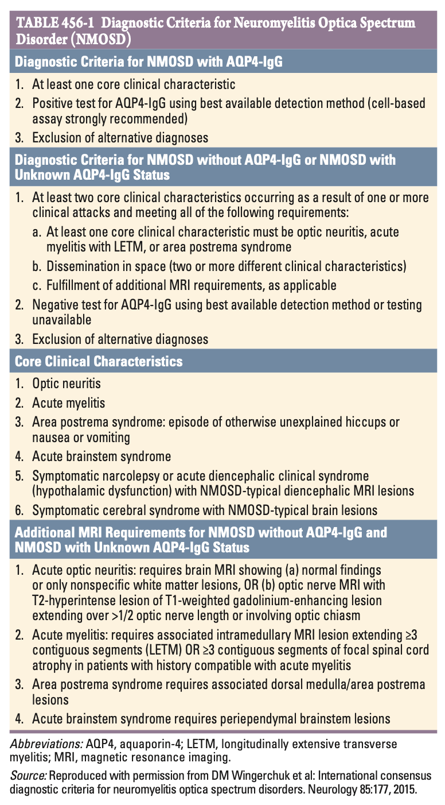
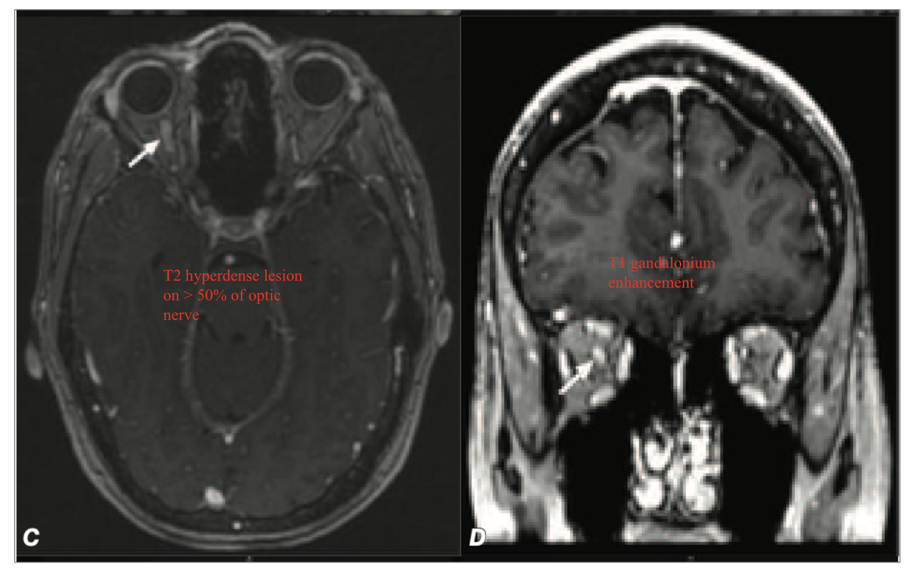
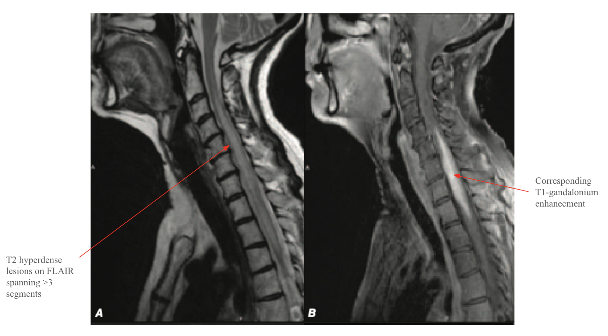
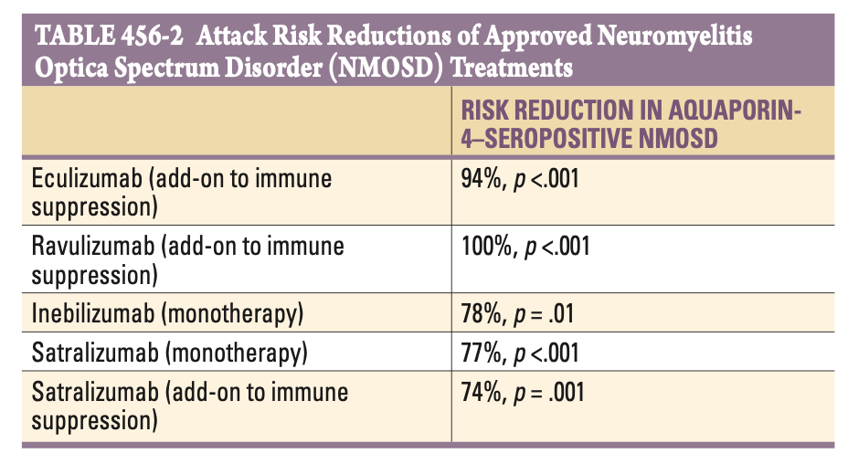
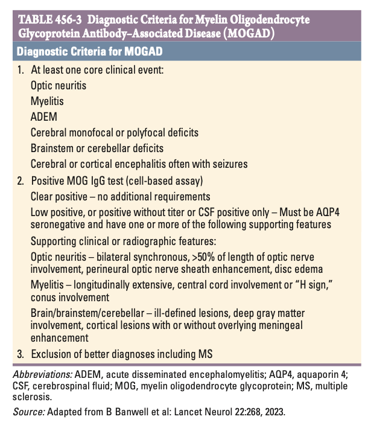

# Ch456 Neuromyelitis Optica

- **Definition and terminology:**
    - <u>Neuromyelitis Optica</u> (NMO) - an aggressive, antibody-mediated inflammatory disorder characterised by recurrent attacks of 1) optic neuritis, and 2) (transverse) myelitis
    - <u>Neuromyelitis Optica spectrum disorders</u> (NMOSD) - inclusive terminology prposed to incorporate individuals w/ partial forms and involvement of those w/ involvement of additional structures of the CNS beyond the spinal cord and optic nerve
    - **Key differentiating clinical features between NMOSD and MS:**
        - **Features supportive of a Dx of NMOSD:**
            - Attacks of ON in NMOSD are bilateral and severe, and produce severe vision loss (incl. colour vision) which is rare in MS
            - Attacks of myelitis in NMOSD is typically transverse and severe, longitudinal and extensive with involvement of \>= 3 contiguous vertebral segments
        - **Features supportive of Dx of MS:**
            - MS may take a progressive course (relapsing or progressive), w/ progressive Sx and increasing disability, while NMO rarely causes progressive Sx and disability only arises from attack-related injury (e.g. injury as a result of vision loss)
    - **Other differentiating features between NMOSD and MS:**
        - MRI brain is insufficient to distinguish between the two forms, where it is now recognised that NMO may result in brain lesions (e.g. area posterema, lower medulla, hypothalamus, cerebral hemispheres), and may be large (cloud-like), but are charateristically non-destructive and undergoes complete resolution
        - CSF findings in NMO are associated w/ a more significant neutrophilic pleocytosis, but oligoclonal bands are rare (\< 20%) in NMO patients
    - **Pathophysiology of NMOSD:**
        - <u>Autoimmune Ab-mediated disease</u> - Anti-AQP4 against water channel proteins expressed on foot-processes of astrocytes in close apposition to endothelial surfaces, as well as paranodal regions near the nodes of Ranvier:
            - Th17 cells recognizing epitope of AQP4 may contribute to pathogenesis
            - Population of B lymphocytes constituitively expressing AQP4 may interact w/ AQP4-specific T lymphocytes and contribute to antigen-specific toelerance, but postulated to be impaired in NMO
        - <u>Manifestation as astrocytopatahy</u> - hence CNS demyelination:
            - Complement fixation and ADCC resulting in cytolysis of astrocytes
            - Immunohistochemistry shows absence of staining of AQP-4 water channel proteins in animal studies
            - Anti-AQP-4 Ab demonstrated to be pathogenic as passive transfer into laboratory animals reproduces the same histological features of the disease
    - **Anti-AQP4** - +ve in \>90% NMO patients:
        - High specificity aids Dx when clinically compatible
        - Predicts risk of relapse, w/ high risk of relapse (\> 50% in 1y)
    - **Diagnostic criteria for NMOSD:** 
    

## Clinical Course

- **Natural Hx:**
    - Typically a recurrent disease
    - Monophasic NMOSD in \< 10% patients, typically in anti-AQP4 -ve patients but this is not the norm
- **Disease trajectory and major disabilities** - severely disabling over time, one case series reported:
    - Respiratory failure due to cervical myelitis in 33% patients
    - 60% total blindness 8y after onset
    - \> 50% permanent paralysis of one or more limbs
    - Recent increase in 5y survival (\> 90%) presumably due to improved diagnosis and widespread use of immunosuppressants
- **Clinical features of NMO** - core clinical features suggestive of NMO dependent on the site of astrocytopathy:
    - <u>Optic neuritis</u> - attacks are usually severe and **bilateral**, resulting in **profound vision loss** as opposed to ON in MS
    - <u>Acute myelitis</u> - depends on the level of lesion, but typically presents w/ spastic paraplegia, falls/ instability, +/- sensory involvement
    - <u>Area postrema syndrome</u> - episodes of otherwise unexplained **hiccups** or **N/V**
    - <u>Symptomatic narcolepsy or acute diencephalic clinical syndrome</u> - narcolepsy attacks (extreme sleepiness and weakness) or endocrinopathies (**hypopituitarism**) that <u>correlates to diencephalic MRI lesions</u>
    - <u>Symptomatic cerebral syndrome</u> - acute to subacute onset of focal neurological manifestations associated w/ characteristic MRI findidngs ('cloud-like' appearance)
- **MRI requirements for NMOSD for seronegative NMOSD:**
    - <u>Acute optic neuritis</u> - optic nerve MRI w/ T2-hyperdense lesions of T1-weighted gandolinium enhancing lesion extending over \> 50% optic nerve length or involving the optic chiasm 
    

    - <u>Acute myelitis</u> - either one:

        - Intramedullary MRI lesions extending \>= 3 contiguous segments (LETM)

    
    

        - \>= 3 contiguous segements of focal spinal cord atrophy w/ previous compatible Hx of acute neuritis:

    - <u>Other features</u> - associated MRI findings for:

        - Area postrema syndromes (dorsal medulla involvement)
        - Acute diencephalic clinical syndrome (periependymal brainstem lesions)

## Global Considerations

- **Epidemiology:**
    - <u>Prevalence</u> - \< 1 - \> 4 per 100,000 (significant variations between geographic locations)
    - <u>Demographic</u>:
        - Age - mean age of onset at 40y (theoretically at any age)
        - Sex - female preponderance (F:M = 9:1)
        - Ethinicity - Asians and Africans disproportionately affected (N.B. opticospinal MS is much more common in these ethnicities, and as such serology is the only differentiating feature between the two diseases)

## Associated Conditions

- **Clinical associations** - ~ 40% have a systemic autoimmune disorders (cf MS which is rarely associated w/ comorbid autoimmune disease):
    - Systemic lupus erythematosus
    - Sjogren's syndrome
    - pANCA-associated vasculitis
    - Myasthenia gravis
    - Hashimoto's thyroiditis
    - Mixed connective tissue disease

## Treatment for NMO

- **Mx of acute attacks:**

    - <u>High-dose glucocorticoids</u> - e.g. pulse methylprednisolone 1g/d for 5-10d followed by prednisolone taper
    - <u>Plasmapharesis</u> - typically 5-7 exchanges of 1.5 plasma volume per exchange if acute episodes non-responsive to glucocorticoids

- **Prophylaxis against relapse** - 4 MAbs approved for attack prevention in NMO but none approved for seronegative NMO:

    - <u>Initial therapy for AQP4-positive NMO</u> - inebilizumab (B cell depleting) or satralizumab (IL6 antagonist)
    - <u>2nd line therapy for AQP4-positive NMO</u> - eeculizumab or ravulizumab (terminal complement inhibitors) if refractory for first-line agent

  
  

    - <u>Empirical therapy for AQP-negative NMO</u> - MMF or rituximab to begin with, and step up to aforementioned therapies if progression

- **Ineblizumab** (Uplizna) - humanised affinity-optimised, afucosylated MAb against CD19 surface antigens on B lymphocyte surfaces:

    - <u>MOA</u> - B cell depleting agents, effective for wide range of B cells:
        - Mature plasma cells in secondary lymphoid organs (proportion express CD19)
        - Plasmablasts and pre-B cells (as CD19 expression occurs before CD20 expression)
    - <u>Dosing</u>:
        - Initial 300mg IV infusion followed by 2 weeks later a second 300mg IV infusion
        - Subsequent dosing of 300mg IV infusions q6mo
    - <u>S/E</u> - immunosuppression, w/ dose-dependent risk of:
        - Reduced IgG levels
        - Neutropenia
    - <u>Evidence</u> - in pivotal RCT recruiting NMO patients both +ve and -ve for AQP4, monotherapy of ineblizumab is a/w:
        - Longer time to first attack compared to placebo (HR 0.23, P \< 0.0001)
        - Reduced rates of hospitalisation, disability worsening and new MRI lesions

- **Satralizumab** (Enspryng) - MAb against IL-6 receptors blocking engagement of IL-6 upregulated in CSF:

    - <u>MOA</u> - IL-6R blockade:
        - Studies demonstrated raised IL-6 signalling in CSF during acute attacks
        - Theoretical blockade of IL-6 signalling reduces astrocytopathy
    - <u>Dosing</u>:
        - Loading dosage of 120 mg
        - SC injections at weeks 0, 2, and 4
        - Maintenance doses of 120 mg q4w
    - <u>S/E</u> - requires CBC, LFT monitoring:
        - Hepatotoxicity
        - Neutropenia
        - Weight gain
    - <u>Evidence</u> - two RCT trials enrolling NMO patients both +ve and -ve for AQP4, one as monotherapy, and one as add on therapy:
        - Monotherapy associated w/ reduced risk of attack by 74% (P = 0.014)
        - Add-on therapy associated w/ reduced risk of attack by 78% (P = 0.014)
        - Both studies showed **no clinically meaningful impact in seronegative participants**

- **Eculizumab** (Soliris):

    - <u>MOA</u> - terminal complement inhibitor binding to C5:
        - Inhibition of cleavage into C5a and C5b
        - Prevents generation of membrane attack complex
    - <u>Dosage</u>:
        - 900 mg weekly for first 4 weeks
        - 1200 mg for 5th dose in 5th week
        - 1200 mg q2w thereafter
    - <u>S/E</u> - essentially manifests as complement deficiency and profound risk of **meningococcal infections** (vaccination required)
    - <u>Evidence</u> - RCT (PREVENT trial) as add on therapy for **AQP-4 positive NMO**:
        - Longer time to first attack compared to placebo (HR 0.058, P \< 0.001)
        - Relative risk reduction of annualized attack rate by 96%
        - Reduced risk of hospitalisation and need for glucocorticoid for each attack

- **Ravulizumab** (Ultomiris):

    - <u>MOA</u> - terminal complement inhibitor binding to C5 (similar to eculizumab)
    - <u>Dosage</u> - increased half-life allowing for less frequent administration:
        - Weight-based loading dose
        - Maintenance dosing q8w
    - <u>S/E</u> - risk of **meningococcal infections**
    - <u>Evidence</u> - CHAMPION-NMOSD, a open-label study (externally controlled by PREVENT trial) showed no attacks in all patients in first 50 weeks

- **Other disease-modifying agents for NMO** - many drugs for MS not effective for NMO and may even cause paradoxical relapses (e.g. interferon beta):

    - MMF (1000 mg bid)
    - Rituximab (2g IV q6mo)
    - Combination of glucocorticoids and azathioprine
    - Plasma cell-targeted therapy w/ anti-B cell maturation antigen (BCMA) CAR-T therapy shows promise for non-responders

## Myelin Oligodendrocyte Glycoprotein Antibody-Associated Disease

- **Definition** - neuro-inflammatory, demyelinating disorders thought to be mediated by anti-myelin oligodendrocyte glycoprotein (MOG) antibodies, recently found to explain cases of ADEM in children, or sero-negative NMO
- **Clinical features of MOG Antibody-associated disease** - difficult to distinguish from NMOSD, MS, or ADEM:
    - <u>Abrupt onset of characteristic neurological manifestations</u> - may be clinically similar to ADEM, MS, or NMOSD, where Dx requires at least one core clinical event:
        - Optic neuritis
        - Transverse myelitis
        - Cerebral monofocal or polyfocal deficits
        - Brainstem or cerebellar deficits
        - Cerebral or cortical encephalitis often with seizures
        - ADEM-like presentation
    - <u>Bilateral papillitis</u> - seen on fundoscopy or orbital MRI, characteristic in MOGAD, and is usually unilateral in MS and uncommon in NMOSD
- **Ix:**
    - **MOG IgG test:**
        - <u>Clear positive</u> - no additional reqeuirements
        - <u>Weakly positive or -ve</u> - requires demonstrate CSF positivity and exclusion of other neuroinflammatory conditions
    - **LP:**
        - <u>WCC</u> - pleocytosis w/ occasional neutrophils
        - <u>Oligoclonal bands</u> - usually absent (present in 6-13% cases)
        - <u>Anti-MOG Ab</u> - detectable in CSF esp in those weakly +ve in serum
    - **MRI brain:**
        - Optic neuritis typically longitudinally extensive on MRI
        - Normal or fluffy areas of increased signal changes in white or gray matter similar to NMO
        - Dawson fingers and T1 hypointense lesions (MS-like lesions) are uncommon
    - **MRI spine** - longitudinal extensive or short, sometimes w/ conus medullaris involvement
- **Dx:** 

- **Mx:**
    - **Principles of Mx:**
        - <u>Induction therapy</u> - high-dose glucocorticoids w/ prednisone taper +/- plasmapharesis
        - <u>Maintenance therapy</u> - for those w/ recurrence

## Glial Fibrillary Acidic Protein Autoimmunity

## Acute Disseminated Encephalomyelitis

- **Definition** - monophasic, inflammatory and demyelinating disorders affecting both grey and white matter often associated w/ an antecedent infection (post-infectious encephalomyelitis)
- **Epidemiology:**
    - Disease of the childhood
    - ADEM in adults typically reflect MOGAD, or experience relapse suggesting Dx of MS or other inflammatory causes (cerebral vasculitis, sarcoidosis, lymphoma)
- **Associated infections** - most frequently associated w/ viral exanthems of childhood:
    - Measles (most common; 1 in 1000 cases)
    - Varicella (most common in areas w/ vaccination; 1 in 4000-10000 cases)
    - Other viral exanthems (e.g. rubella, mumps, EBV, HHV-6)
    - Upper respiratory viruses (influenza, parainfluenza)
    - HIV
    - Dengue
    - Zika virus
    - Mycoplasma pneumoniae
- **Associations w/ vaccines** - modern vaccines generally pose no risk of ADEM but historically reported:
    - Vaccine Safety Datalink Study shows no excess risk of ADEM post-vaccination w/ 24 vaccines
    - Tdap vaccine may show some increased risk but minimal (\< 1 case per 1,000,000 vaccinations)
- **Pathophysiology of ADEM** - presumed to be caused by molecular mimicy:
    - Cross-reactivity of immune response to infectious agent triggering inflammatory and demyelinating resonse
    - AutoAb to MBP and other myelin Ag detected in CSF (Anti-MOG if detected is now considered MOGAD)
    - Acute haemorhagic leukoencephalitis as a morbid subset of ADEM where lesions are both vasculitic and haemorrhagic
- **Clinical features** - abrupt onset and rapid progression, w/ neurological manifestation typically ocurring as the exanthem is fading:
    - <u>Fever</u> - typically reappears as the viral exanthem starts to fade, often associated with **headache**, and **meningismus**
    - <u>Reduced GC</u> - profound lethargy eventually progressing into coma
    - <u>Seizures</u> - often a common initial manifestations
    - <u>Evidence of disseminated neurological diseases</u> - on physical examination, signs of diffuse UMN involvement is consistently present:
        - Reduced muscle power in various distributions (e.g. hemiplegia, quadriplegia)
        - Up-going plantars with hyperreflexia
        - Cerebellar signs (notorious for chickenpox)
- **Ix:**
    - **LP:**
        - <u>CSF proteins</u> - elevated (50-150 mg/dL)
        - <u>WCC</u> - lymphocytic pleocytosis (\>= 200 cells/ microL), ocassionally mixed PMN and lymphocytic picture at initial onset of disease
        - <u>Oligoclonal bands</u> - -ve but transient presence reported in minority of cases (non-specific)
    - **MRI brain and spine** - extensive changes in brain and spinal cord:
        - **Lesion sites:**
            - Extensive and relative symmetric white matter involvement
            - Optic nerve involvement usually bilateral and transverse myelitis is complete
        - **Lesion characteristics:**
            - <u>T1</u> - gandolinium enhancement
            - <u>T2</u> - extensive white-matter hyper-intensities
            - <u>FLAIR</u> - extensive white-matter hyper-intensities
- **DDx of ADEM** - abrupt onset of encephalopathy w/ widespread CNS involvement on P/E and MRI:
    - Hypercoagulable states (esp. Anti-phospholipid syndrome)
    - Autoimmune (paraneoplastic) limbic encephalitis
    - Cerebral vasculitis
    - Sarcoidosis
    - Primary CNS lymphoma
    - Cerebral metastasis
    - Explosive presentation of MS
- **Dx:**
    - Clinically established w/ a history of recent infectious disease
    - Predominant cerebral involvement w/ absence of myelitis requires r/o of other infectious encephalitis (e.g. HIV)
- **Recurrent ADEM** - typically a mono-phasic disease, rarely occurs w/ children; most are essentially reclassified as having:
    - NMO
    - MOGAD
    - GFAP autoimmunity
    - Atypical MS
- **Mx:**
    - **Principles of Mx:**
        - <u>High-dose glucocorticoids</u> - titrated against response and may be continued for 8 weeks
        - <u>IVIG</u> - reserved for patients who fail to respond to glucocorticoids
        - <u>Plasma exchange</u> - reserved for patients who fail to respond to glucocorticoids
- **Prognosis:**
    - <u>Mortality</u> - 5-20% from a case series of pre-sumptive ADEM in adults
    - <u>Disability</u> - most have permanent neurological sequelae
