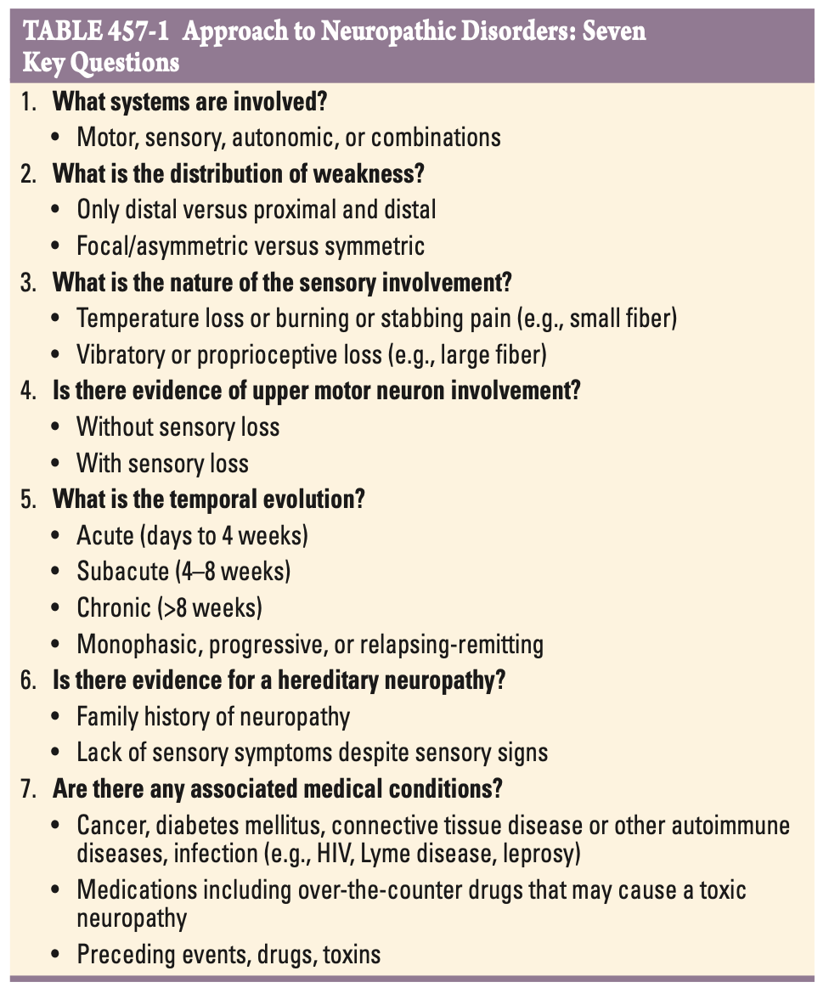
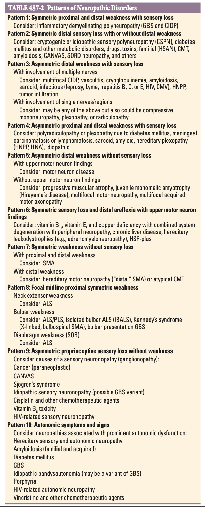
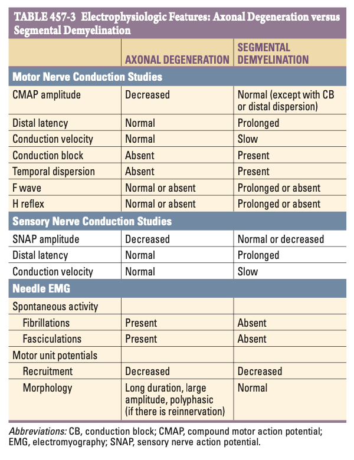
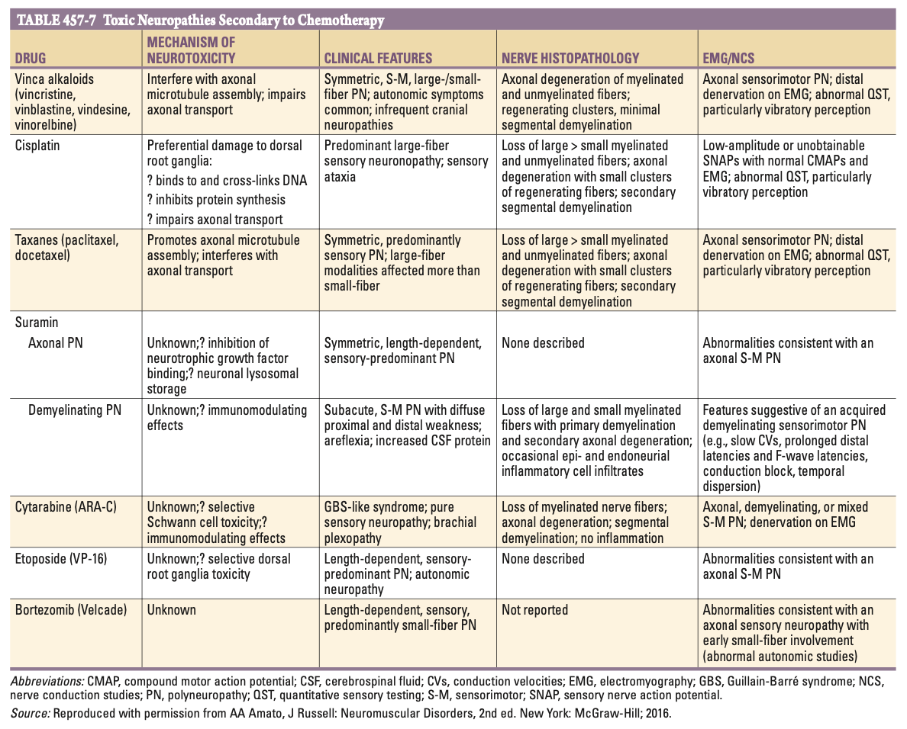

# Ch457 Peripheral Neuropathy

## General Approach

- **General approach** - 3 main goals:
    - <u>Where is the lesion</u> - obtained through Hx and P/E (answer 7 main questions for pattern recognition), electrodiagnostic studies +/- laboratory studies
    - <u>What is the cause</u> - from extensive Ix, although 50% w/ chronic peripheral neuropathies have no etiology identified, labelled as crytopgenic sensory and sensorimotor polyneuropathy (CSPN)
    - <u>What is the proper treatment</u> - depends on whether there is a treatable underlying cause
- **Seven key questions to answer from initial clinical assessment:** 

- **Clinical manifestation of autonomic dysfunction:**
    - Orthostatic lightheadedness or syncope
    - Heat intolerance
    - Bladder, bowel or sexual dysfunction
- **System involvement** - sensory, motor, autonomic or combination of these:
    - <u>DDx of isolated non-UMN weakness</u> - 1) motor neuropathy, 2) NMJ disorder, 3) myopathy, 4) anterior horn cell disease (consider motor multifocal neuropathy before)
    - <u>DDx of autonomic neuropathy</u> - 1) diabetic autonomic neuropathy, 2) amyloid polyneuropathy, 3) pandysautonomic syndrome
    - <u>DDx of sensory neuropathy</u> - most neuropathies are sensory in nature
- **Distribution of weakness** - if weakness is present, delineate whether 1) distal involvement, or involves both proximal and distal, and 2) symmetrical, or focal and asymmetrical:
    - <u>DDx of symmetrical proximal and distal weakness</u> - hallmark of **acquired immune demyelinating polyneuropathies**, usually w/ sensory involvement, including 1) Acute GBS, or 2) CIDP
    - <u>DDx of multifocal, asymmetrical weakness</u> (worisome for ALS if subacute and progressive over weeks or months in absence of sensory Sx):
        - **With multiple nerve involvement:**
            - Mononeuropathy multiplex (vasculitis, amyloidosis, infectious, malignancy)
            - Multifocal motor neuropathy, multifocal acquired motor axonopathy
            - Anterior horn cell disease (neck extensor weakness, bulbar Sx, SOB)
            - NMJ disorders
            - Certain myopathies
        - **With single nerve/ regional involvement** - any of the above and:
            - Radiculopathies and Plexopathies
            - Nerve entrapment syndrome (compressive mononeuropathies)
- **Nature of sensory involvement** - small fibre vs large fibre involvement:
    - <u>DDx of small-fibre neuropathy</u> - typically presents w/ 1) reduced pain and temperature, sensation, 2) preserved proprioception, 3) preserved muscle power and deep tendon reflexes:
        - Diabetes mellitus or impaired glucose tolerance
        - Amyloid neuropathy
        - Cryptogenic sensory polyneuropathy (CSPN)
    - <u>DDx of large-fibre neuropathy</u> - typically presents w/ 1) hyperpathia with numbness and 2) neuropathic/ protopathic pain (poorly localised burning, dull pain or lancinating pain), or 3) severe proprioceptive loss with imbalance:
        - Sensory neuronopathy/ ganglinopathy (paraneoplastic, Sjogren's, B6 toxicity, HIV-related sensory neuropathy etc.)
- **Evidence of upper motor neuron involvement:**
    - <u>DDx of distal sensory neuropathy w/ symmetrical UMN involvement</u> - combined system degeneration with neuropathy:
        - Vitamin B12 deficiency (most common; combined subacute degeneration of the cord)
        - Copper deficiency
        - HIV infection
        - Severe hepatic disease
        - Adrenomyeloneuropathy
        - Hereditary spastic paraplegia plus a neuropathy
    - <u>DDx of distal sensory neuropathy w/o symmetrical UMN involvement</u> - wide
- **Temporal evolution** - 1) acute (\< 4 weeks) vs subacute (4-8 weeks) vs chronic (\> 8 weeks), and 2) monophasic/static vs progressive vs relapsing and remitting:
    - <u>DDx of chronic and insidious progression of neuropathy</u> - most neuropathies
    - <u>DDx of acute and subacute onset of neuropathy with progression</u>:
        - GBS
        - Vasculitis (if mononeuritis multiplex)
        - Diabetic mononeuritis multiplex
        - Radiculopathies related to Lyme disease
    - <u>DDx of chronic neuropathy with relapsing and remitting course</u>:
        - CIDP
        - Porphyria
- **Evidence of hereditary neuropathy** - classical CMT disease shows the following:
    - C/O of slowly progressive distal weakness over many years with <u>few sensory Sx yet significant sensory deficits on examination</u>
    - Examination shows <u>Charcot neuropathic osteoarthropathy</u> (flat arches and hammer toes) and scoliosis
    - Potentially positive family studies, and it may be necessary to perform neurologic and electrophysiologic studies on family members in addition to the patient
- **Relevant medical conditions:**
    - Preceding or concurrent infections (e.g. diarrheal illness preceding GBS)
    - Associated medical conditions (e.g. DM, SLE)
    - Past surgieries (e.g. gastric bypass and nutritional neuropathies)
    - Drug Hx (drug-induced neuropathy, including OTC B6 preperations)
    - Dietary habits
    - Use of dentures (zinc leading to Cu deficiency)
- **Pattern recognition approach to neuropathic disorders:** 

- **Electrodiagnostic studies** (EDx) - consists of nerve conduction studies (NCS), and needle electromyography (EMG) +/- studies of autonomic function:
    - 1\. To differentiate mononeuropathy, mononeuropathy multiplex, radiculopathy, plexopathy, or polyneuropathy
    - 2\. To differentiate types of fibre involvement from sensory fibre, motor fibre, autonomic fibre
    - 3\. To differentiate between axonopathies and myelinopathies

  
  
- **Other important Ix** - esp. in a patient presenting w/ symmetrical peripheral neuropathy:
    - **Routine bloods** - CBC, LRFT, FBG, HBA1c, TFT, B12 and folate, ESR, autoimmune markers (ANA, RF), SPE with immunofixation, serum/ urine free light chains and kappa/lambda ratios
    - **Additional Ix based on predominant clinical picture:**
        - <u>Patients w/ mononeuritis multiplex</u> - vasculitis workup (ANCAs, cryoglobulins, hepatitis serology, Western-blot for Lyme disease, HIV, CMV-titres)
        - <u>Patients w/ symmetrical proximal and distal weakness</u> (suspected GBS or CIDP):
            - LP for albuminocytologic dissociation
            - Hepatitis, HIV, CMV, EBV serology if con-comittent dLFT
            - IgG4 against neurofascin and contactin-2 (CIDP w/ sensory ataxia that does not respond to conventional immunotherapy but responds to rituximab)
            - Porphyria screen if axonal GBS w/ suspicious coinciding Hx (e.g. unexplained abdominal pain, psychiatric illness, autonomic dysfunction)
        - <u>Patients w/ severe proprioceptive loss, sensory ataxia suggestive of ganglionopathy</u>:
            - Anti-Ro (SS-A), Anti-LA (SS-B) for Sjogren's syndrome
            - Anti-Hu Ab for paraneoplastic neuropathy + malignancy screen for SCLC, CA breast, prostate, ovary, lymphoma etc.
        - <u>Patients w/ suspected heavy metal poisoning</u> - heavy metal screen
    - **Nerve and skin biopsies:**
        - <u>Nerve Bx</u> - primary indications includes suspicion for 1) vasculitis, 2) amyloid
        - <u>Skin Bx</u> - for suspected small-fber neuropathy, where immunological staining of punch Bx shows reduced density of small unmyelinated fibres

## Hereditary Neuropathies (CMT Disease)

## Other Hereditary Neuropathies

## Acquired Neuropathies

- **Primary or AL amyloidosis** - occurs in setting of multiple myeloma, Waldenstrom's macroglobulinaemia, lymphoma, other plasmacytomas, or lymphoproliferative disease:
    - <u>Pathophysiology</u> - monoclonal proteins composed of IgG, IgA, IgM or only fee light chains (Lambda more common than kappa:
        - Deposition composed of immunoglobulin light chains
        - Slowly progressive disease
    - <u>Clinical manifestation of AL primary amyloidosis associated w/ neuropathy</u> - occurs in 30% patients, typically symmetrical distal sensory Sx with minimal weakness, and autonomic dysfunction:
        - Usually a **symmetrical distal sensory Sx** characterised by **painful dysathesia and burning sensation in the feet** (truncal involvement is also described)
        - Rarely presents w/ a mononeuritis multiplex pattern, or **bilateral carpal tunnel syndrome** as initial presentation
        - Weakness is typically late but may occur when there is large-fibre neuropathy
        - **Autonomic dysfunction** typically ensues w/ postural hypotension and syncope, sphincteric dysfunction, impotence, or impaired sweating
    - <u>Mx</u> - Tx of amyloidosis and reduction of monoclonal protein concentration (although whether neuropathy improves is controversial)
    - <u>Prognosis</u> - poor (\< 2y median survival; most die of CHF or renal failure)
- **Diabetic neuropathy** - most common cause of peripheral neuropathy, manifests as 1) diabetic distal symmetrical sensory and sensorimotor polyneuropathy (DSPN), 2) diabetic autonomic neuropathy, 3) diabetic mononeuropathies and mononeuropathy multiplex, 4) diabetic radiculoplexus neuropathy:
    - **Risk factors of diabetic neuropathy:**
        - Long-standing DM
        - Poorly controlled DM
        - Presence of DR and DMN
    - **Diabetic distal symmetrical sensory and sensorimotor polyneuropathy** (DSPN) - most common form of diabetic nephropathy:
        - <u>Pathophysiology of DSPN</u> - axonal small fibre neuropathy:
            - Slowed conduction velocities on NCS
            - Axonaldegeneration, endothelial hyperplasia and perivascular inflammation
        - <u>Clinical manifestations of DSPN</u>:
            - Symmetrical distal sensory loss
            - Gradual ascension up the legs, into the finger and arms when the knee is reached, truncal sensory loss if severe typically starting midline anteriorly and spreading laterally
            - Hyperpathia and allodynia w/ neuropathic pain may also be apparent
        - <u>Mx</u>:
            - Glycaemic control may improve underlying neuropathy
            - Anticonvulsants, antidepressants, sodium channel blockers or other analgesics for painful Sx (variable success)
    - **Diabetic autonomic neuropathy** - typically seen in combination w/ DSPN:
        - <u>Clinical manifestations of autonomic neuropathy</u>:
            - Dysfunctional thermoregulation (e.g. abnormal sweating)
            - Dry eyes and mouth
            - Cardiovascular manifestations (postural hypotension, cardiac arrhythmias)
            - GI abnormalities (gastroparesis, post-prandial bloating, chronic diarroea or constipation)
            - Genitourinary dysfunction (impotence, incontience, retrograde ejaculation)
        - <u>Dx</u> - autonomic studies
    - **Diabetic radiculoplexus neuropathy** (Diabetic Amyotrophy or Bruns-Garland Syndrome) - in fact presenting manifestion of DM in 33% patients:
        - <u>Clinical manifestation</u> - asymmetrical proximal and distal weakness with associated w/ sensory Sx:
            - Episode heralded by severe weight loss (diabetic neuropathic cachexia)
            - Acute to subacute onset of severe LBP, and pain in hip or thigh in one leg (Lumbosacral radiculoplexopathy)
            - LMN pattern weakness with pronounced progressing over severe several weeks or months
            - Gradual improvement but often w/ residual weakness, sensory loss and pain
        - <u>Ix</u>:
            - EDx shows axonopathy w/ active deneration of proximal and distal muscle of limbs and paraspinal muscles
            - Nerve biopsy may demonstrate axonal degeneration and perivascular inflammation
            - LP shows albuminocytologic dissociation
        - <u>Mx</u> - glucocorticoid in initiate period for pain Mx
    - **Diabetic mononeuropathies or mononeuropathy multiplex** - most common nerve involvement include:
        - High ulnar neuropathy
        - Carpal tunnel syndrome
        - Peroneal neuropathy at fibular head
        - Cranial neuropathies (7th followed by 6th and 4th most common but have other etiologies)
- **Hypothyroidism:**
    - Concomittent proximal myopathy and carpal tunnel syndrome (due to myxoedema) may confuse clinical picture
    - Generalised sensory polyneuropathy is rare but can occur, usually associated w/ painful parasthesia and numbness
    - Treatment is correction of hypothyroidism

## Neuropathies Associated with Malignancy

- **Forms of neuropathy a/w malignancy:**
    - Paraneoplastic sensory neuropathy/ gangliopathy (SCLC)
    - Neuropathy secondary to tumour infiltration
    - Neuropathy as a complication of bone marrow transplantation
    - Lymphoma
    - Multiple myeloma
    - Neuropathies associated with monoclonal gammopathies of undetermined significance
    - Toxic neuropathies secondary to chemotherapy

## Other Toxic Neuropathies

- **Toxic neuropathies secondary to chemotherapy** - mechanism of action varies as does the specific type of neuropathy produced:
    - **Risk factors** - increased risk if:
        - Background of pre-existing neuropathy (e.g. CMT disease, diabetic neuropathy)
        - Use of other neurotoxic drugs (esp. ABx)
    - **Clinical manifestations** - typically presents in the following two patterns:
        - Sensory \> motor length-dependent axonal neuropathy
        - Ganglionopathy
    - **DDx of toxic neuropathies secondary to chemotherapy:** 
    
- **Toxic neuropathies:**
    - <u>Chemotherapeutics</u> - platinum-based therapies, vinka alkaloids, taxanes, antimetabolites, topoisomerase inhibitors, bortezomib
    - <u>ABx</u> - metronidazole, dapsone, nitrofurantoin, isoniazid, ethambutol
    - <u>Immunosuppressants/ immunomodulators</u> - HCQ, thalidomide, leflunomide
    - <u>Antiretroviral agents</u> - various NRTIs or nucleoside analogues
    - <u>Other miscillenous drugs</u> - amiodarone, colcicine
    - <u>Toxic exposures</u> - lead, mercury, arsenic, gold, organophosphates, ethylene oxide, carbon disulfide etc.

## Pyridoxine (Vitamin B6) Toxicity

## Nutritional Neuropathies

## Cryptogenic Sensory and Sensorimotor Polyneuropathy

## Mononeuropathies/ Plexopathies/ Radiculopathies
