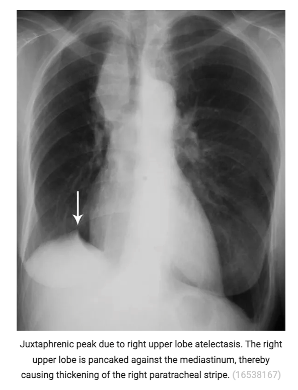
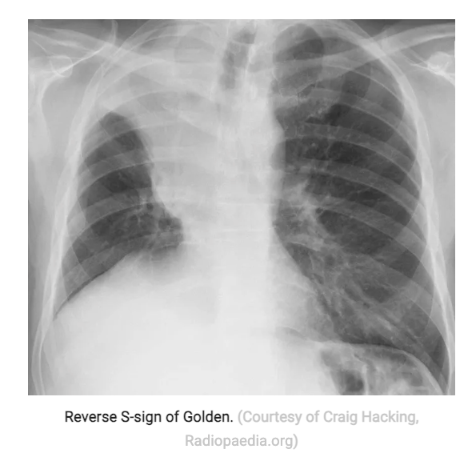
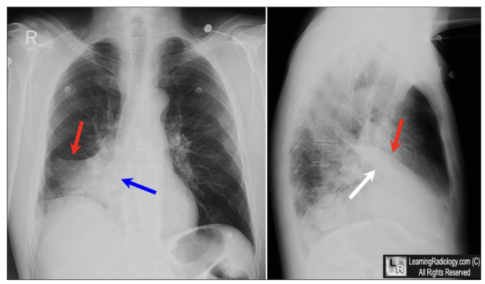
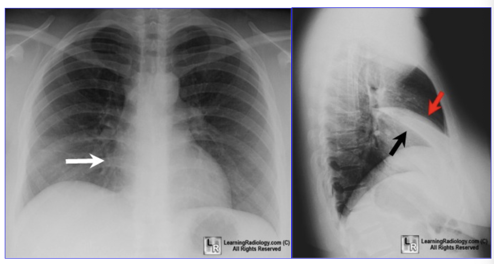
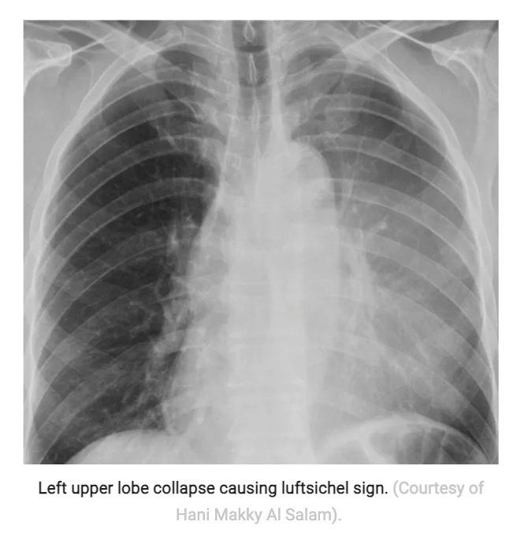
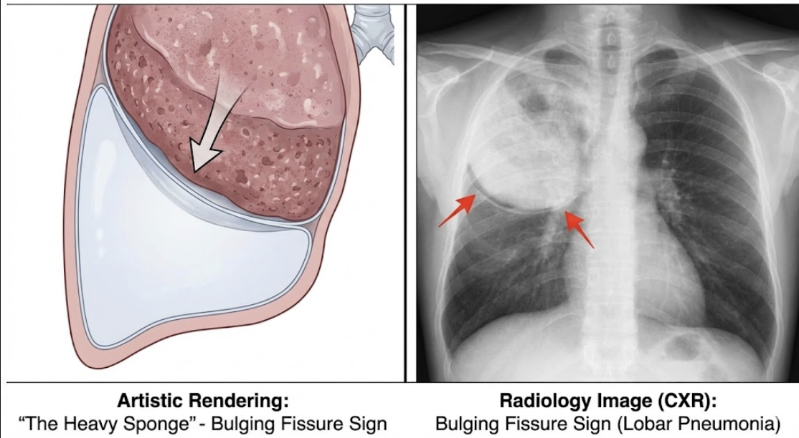

- **link:** <https://emcrit.org/ibcc/toc/>
- **Author:** Josh Farkas

# Cardiology

# Endocrinology

# Gastroenterology

# Haematology and Oncology

# Infectious Diseases

# Nephrology

# Neurology

# Obstetrics

# Pharmacology

# Pulmonology

## General Pulmonology

### Approach to Common Problems

### Diagnostics

### Radiology

1.  Approach to Thoracic Imaging in Acute Illness (Radiograph, CT Scan)

    - **Pre-amble:**
      - Omits items which are less important to immediate Mx
      - Increased focus on evaluation of cardiac abnormalities on CT scans which is frequently ignored
    - **Approach to the AP/PA chest radiograph:**
      - 1\. <u>Lines and tubes</u> - e.g. ET tube, tracheostomy tube, CVC, NG tube, chest tube
      - 2\. <u>Apices and soft tissue</u> - most important being the presence of surgical emphysema (suggestive of pneumothorax or pneumomediastinum) or apical pneumothorax
      - 3\. <u>Diaphragm and costophrenic angle</u> - evaluation for:
        - Blunting of the costo-phrenic angle
        - Subpulmonic effusion and deep sulcus sign
        - Free gas under diaphragm
      - 4\. <u>Cardiac silhouette</u> - for overall size of heart, chamber enlargements etc.
      - 5\. <u>Hilar and pulmonary arteries</u> - for pulHTN and hilar adenopathy
      - 6\. <u>Large airways</u> - focal vs diffuse narrowing; tracheal deviation as added evidence of mediastinal shift (due to pneumothorax or atelectasis)
      - 7\. <u>Lung fields</u> - various radiological patterns (and distribution of abnormalities) correlate w/ various differential diagnoses:
        - Atelectasis
        - Cavitations
        - Consolidations
        - Cystic lung diseases
        - Ground glass opacifications
        - Nodular patterns
        - Reticular patterns
    - **Approach to the CT thorax:**
      - 1\. <u>Lines and tubes</u> - e.g. ET tube, tracheostomy tube, CVC, NG tube, chest tube
      - 2\. <u>Right heart and pulmonary embolism</u>
      - 3\. <u>Left heart</u> - for chamber enlargements, valvular heart diseases, and coronary artery diseases
      - 4\. <u>Airways</u>:
        - Proximal airways - determine whether it is an inspiratory or expiratory film based on the posterior tracheal membrane
        - Extreme distal airways - should not be seen except in bronchiectactic changes
      - 5\. <u>Mediastinum and hilum</u> - evaluation for mediastinal mass (?SVCO) and hilar LNs
      - 6\. <u>Lung fields</u> - similar radiological pattern
    - **Lines and tubes:**
      - ET tube
      - Tracheostomy tube
      - Central venous catheter
      - NG tube
      - Chest tube
      - Intra-aortic balloon pump
      - Pulmonary artery catheter

2.  Atelectasis

    - **Definition** - i.e. collapse, volume reduction of lung tissue, due to reduced aeration
    - **Clinical significance** - clinical significance varies, depending on 1) causes, 2) configuration, and 3) severity:
      - Small amounts of dependent atelectasis may be seen w/ minimal clinical significance
      - Alternatively, lobar atelectasis may be the cause of type 1 respiratory failure
    - **Clinical manifestations of atelectasis:**
      - Cough
      - Features of respiratory distress (hyppoxemia, tachypnoea)
    - **Physical signs of atelectasis:**
      - Focally reduced chest expansion
      - Focally reduced breath sounds
      - If obstructive atelectasis, may be a/w focal wheeze
    - **DDx of atelectasis** - classified based on mechanisms:
      - **Obstructive atelaectasis** - also known as "resorptive" atelectasis:
        - <u>Endobronchial lesions</u> - endobronchial granulomas (e.g. TB, histoplasmosis, sarcoidosis), or neoplastic conditions (benign vs malignant; primary vs secondary)
        - <u>Extrinsic compression of bronchus</u> - e.g. neoplasm, lymphadenopathy, aortic aneuyrysm, cardiac enlargement
        - <u>Mucus plugging</u> - due to:
          - Infective - pneumonia, allergic bronchopulmonary aspergillosis
          - Airway diseases - asthma, chronic bronchitis, bronchiectasis, cystic fibrosis
          - Post-surgical
        - <u>Other materials in bronchus obstructing flow</u> - broncholithiasis (e.g. histoplasmosis), foreign body, malpositioned ET tube
      - **Compressive atelectasis** - also knnown as "passive" atelectasis:
        - <u>Pleural diseases</u> - pneumothorax, pleural effusion
        - <u>Organomegaly</u> - tumours, aortic aneurysms, cardiomegaly
        - <u>Others</u> - skeletal deformity, diaphragmatic elevation, adjacent SOL in the lung (e.g. bullae)
      - **Patchy atelectasis** - widespread collapse of alveoli due to surfactant deficiency:
        - Viral pneumonia
        - Smoke inhalation injury
        - Acute radiation pneumonitis (1-6 mo after therapy)
        - Pulmonary embolism (from focal ischaemia)
      - **Contraction atelectasis** - due to intrinsic fibrosis of lung tissue:
        - Radiation fibrosis
        - Interstitial lung disease
        - Chronic infections
    - **General principles regarding the radiology of atelectasis:**
      - Can be unimpressive radiologically as lesions are small in nature due to deflation
      - Atelectasis can be inferred by <u>opacities reflecting volume loss</u>, and <u>secondary effects of volume loss</u> (e.g. shifts in fissures, mediastinum, diaphragm)
      - <u>Air bronchograms within atelectasis r/o obstructive atelectasis</u> and suggests that atelectasis is due to compression, contraction, or adhesions
      - On CT, atelectasis will appear relatively hyperdense compared w/ consolidation, which usually have density similar to or lower than skeletal muscles
    - **RUL atelectasis:**
      - **Frontal CXR of RUL collapse:**
        - <u>Sillhuoette sign</u> - loss of right superior mediastinal border (may mimick widened superior mediastinum when collapse completed)
        - <u>Effects of volume loss</u> - shifts:
          - Horizontal fissure - pward displacement and rotation towards mediastinum
          - Elevated R hilum - identified because normally L hilum located higher than R hilum
          - Tracheal deviation - ipsilateral tracheal deviation (possibly w/ aorta)
          - Diaphranic tenting - i.e. juxtaphrenic peak

          
          
        - <u>Reverse S sign of Golden</u> - sinister sign of RUL collapse secondary to a hilar mass, usually bronchogenic carcinoma:
          - Superior half of the "S" generated by superior displacement of the horizontal fissure
          - Inferior half of the "S" generated by the medial convexity of the hilar mass

          
          
      - **Lateral CXR of RUL collapse** - indistinct "upside down triangle":
        - Horizontal fissure shifted upwards forming the anterior border of triangle
        - Oblique fissure shifted anteriorly forming the posterior border of triangle
    - **RML atelectasis:**
      - **Frontal CXR of RUL collapse** - may be quite indistinct:
        - <u>Sillhuoette sign</u> - loss of the right heart border due to sillhuoetting of the collapsed right middle lobe
        - <u>Effects of volume loss</u>:
          - Depressed horizontal fissure
          - Elevation of the right hemidiaphragm

        
        
      - **Lateral CXR of RML collapse** - <u>triangular density</u> caused by the atelectic RML, which is caused by:
        - Downward displacement of the horizontal fissure
        - Upward displacement of the oblique fissure

        
        
      - **RML is particularly prone to development of atelectasis** - "RML syndrome" defined as disorders resulting in recurrent or persistent atelectasis or consolidation of RML:
        - Right lung is particularly prone to obstruction as it is longer w/ narrower angle and oriface
        - RML has fewer effective collateral ventilations compared to other lobes, hence obstruction tends to cause lobar collapse
        - Crowded adjacent anatomy of RML by LNs causes it to be susceptible to extrinsic obstruction by bulky lymphadenopathy
      - **Clinical features of RML syndrome** - collapse of RML is often asymptomatic due to relatively small size:
        - Should not attribute to signifiant dyspnoea or hypoxaemia
        - Symptoms may result from the underlying lesions, usually a (productive) cough
      - **DDx of RML syndrome:**
        - <u>Anatomical obstructive process</u>:
          - Endobronchial lesions - endobronchial malignancy (lung cancer, carcinoid, endobronchial metastasis), foreign body, broncholithiasis, inspissated mucus (ABPA)
          - Extrinsic compression - hilar lymphadenopathy )e.g. TB, sarcoid, histoplasmosis, silicosis), enlargement of right atrium
          - Abnormal bronchial anatomy - bronchial stenosis (e.g. RT, TB), benign abnormality of RML anatomy
        - <u>Non-obstructive process</u> (often w/ bronchiectasis) - indolent infections such as TB, NTM
    - **LUL atelectasis:**
      - **Frontal CXR of LUL collapse:**
        - <u>Oppacities</u> - primarily over the left hemithorax mostly over the upper, middle (ocassionally lower) zones
        - <u>Silhuoette sign</u> - loss of the left heart border including the aortic knuckle +/- left border of the superior mediastinum, caused by silhuoetting of the actelectic LUL
        - <u>Effects of volume loss</u>:
          - Tracheal deviation - shifted towards the left
          - Elevated R hemidiaphragm (+/- diaphragmatic tenting) - evident as normally R hemidiaphragm should be higher than L hemidiaphragm
        - <u>Luftsichel sign</u> ("air sickle") - crescent shaped hyperluscency between aortic arch and the medial border of the atelectic LUL:
          - Caused by the interposition of the aerated superior sigment of LLL between the aortic arch and the collapsed LUL
          - Differential diagnoses include 1) anterior herniation of hyperinflated right lung across midline, 2) pneumomediastinum, 3) medial pneumothorax, 4) bullous lung disease adjacent to aortic arch

        
        
      - **Lateral CXR of LUL collapse** - collapsed into an anterior "vertical pancake":
        - Forward displacement of the oblique fissure almost parallel to the chest wall
        - Retrosternal air space caused by herniation of right lung accross the mediastinum, interposed between sternum and collapsed left lung
    - **Lower lobe atelectasis** - both RLL and LLL have similar anatomy resulting in similar radiological pattern:
      - **Frontal CXR of lower lobe atelectasis:**
        - <u>Wedge-shaped densities</u> - medially over near the heart collapsed into a wedge-shaped density
        - <u>Sillhuoette sign</u> - generally results in sillhouetting of the medial hemidiaphragm border and descending pulmonary artery:
          - Sparing of the heart border as collapse sittuated behind the heart
          - However, on the left, collapse my overlie the heart and silhouette the descending aorta
        - <u>Effects of volume loss</u>:
          - Mediastinal shift - towards the ipsilateral side; esp. LLL collapse causes loss of concavity of the left heart border termed "flat waist sign"
          - Elevated hemidaphragm - rarely w/ tenting
          - Depressed hilum (+/- depressed horizontal fissure on the R side)
      - **Lateral CXR of lower lobe atelectasis:**
        - <u>Triangular density</u> - however often indistinct only causing increasde density posteriorly
        - <u>Sillhuoette sign</u> - sillhuoetting of the posterior mediastinum
        - <u>Posterior displacement of oblique fissure</u> - volume loss effect
    - **Mx:**

3.  Cavitatory Lesions

4.  Consolidation

    - **Definition** - reflects an underlying <u>alveolar-filling process</u>, referring to air-space disease that is <u>dense enough to cause obscuration of the underlying pulmonary vasculature</u> (cf GGO which does not obscure the underlying vasculature)
    - **What are common causes of alveolar filling process resulting in consolidation:**
      - Pus
      - Cells
      - Fluids
      - Blood
    - **Radiographic appearance of consolidations:**
      - <u>Haziness</u> - by definition dense enough to cause **obscuration of the underlying lung vasculature**
      - <u>Shape</u> - usually **poorly discernable edges** ("fluffy") that suggests air-space involvement, except if involvement of the pleural edges or complete lobar consolidation, which will yield well-defined borders
      - <u>Air-bronchograms</u> - presence of patent proximal airways, suggesting the consolidation is due to an alveolar-filling process
      - <u>Sillhouette sign</u> - when consolidation comes into contact of border of solid organ, resulting in loss of the border:
        - LL processes - results in loss of hemidiaphragmatic border
        - RML or lingula process - results in loss of the heart borders
        - UL processes - loss of aortic arch border (particularly apicoposterior LUL and anterior RUL consolidations)
    - **Common causes of consolidations:**
      - **Infections:**
        - <u>Community acquired pneumonia</u> (CAP) - lobar pneumonia typically produces consolidation pattern than bronchopneumonia (same goes for P/E findings)
        - <u>Fungal pneumonia</u> (e.g. PJP) - results more commonly diffuse consolidations
        - <u>Mycobacterial infections</u> - NTM typically bilateral and diffuse
        - <u>Other infections</u> - Coxiella burnetii, Chlamydia psittaci
      - **Haemorrhage:**
        - <u>Secondary to focal diseases</u> (focal consolidation) - malignancy, bronchiectasis, pulmonary infarction secondary to PE
        - <u>Diffuse process</u> - diffuse alveolar haemorrhage secondary to anti-GBM disease or other vasculitic phenomenon
      - **Pulmonary oedema** - cardiogenic vs non-cardiogenic pulmonary oedema
      - **Malignancies:**
        - Post-obstructive pneumonia
        - Leipedic adenocarcinoma
        - Lymphoma
        - Radiation-induced lung injury
      - **Rare interstitial/ alveolar filling processes:**
        - Organising pneumonia (secondary or cryptogenic)
        - Chronic eosinophilic pneumonia (CEP)
        - Granulomatosis w/ polyangiitis (GpA)
        - Alveolar sarcoidosis
        - Lipoid pneumonia
        - Atelectasis/ sequestration
    - **Approach to classification of consolidations:**
      - <u>By anatomical distribution</u> - round consolidation, diffuse consolidation (acute vs chronic), peripheral consolidation
      - <u>By density</u> - low-density consolidation, high-density consolidation
      - <u>By presence of consolidation-related signs</u>:
        - Bulging fissure sign
        - Reversed halo sign (Atoll sign)
        - Perilobular pattern
    - **DDx of round consolidations:**
      - <u>Infective</u> - lobar bacterial pneumonia, fungal pneumonia, Q fever, septic embolism
      - <u>Others</u>:
        - Organising pneumonia (typically identified w/ failed resolution of consolidation w/ ABx)
        - Round atelectasis
        - Neoplasms (esp. adenocarcinoma or lymphoma)
    - **DDx of diffuse consolidation** - note that these conditions are characterised by central distribution:
      - <u>Oedema</u> - cardiogenic pulmonary oedema, non-cardiogenic pulmonary oedema
      - <u>Haemorrhage</u> - diffuse alveolar haemorrhage (DAH)
      - <u>Infections</u>:
        - PJP
        - CMV pneumonitis
        - Severe influenza pneumonitis
        - Severe bacterial pneumonitis
      - <u>Neoplastic</u> - primary or metastatic adenocarcinoma, lymphoma
      - <u>Other inflammatory conditions</u> (cellular infiltrates):
        - CEP
        - OP
        - Lipoid pneumonia
        - Pulmonary alveolar proteinosis
    - **DDx of peripheral consolidation** - consider Eos, IgE, ANCA +/- infectious evaluation:
      - <u>Inflammatory conditions</u>:
        - Organising pneumonia (OP) - secondary OP or COP
        - Pulmonary eosinophilia:
          - Chronic eosinophilic pneumonia
          - EGPA (usually lobular distribution)
          - HES syndrome
        - Sarcoidosis (rarely)
      - <u>Infections</u> - multiple septi emboli may produce a peripheral pattern
      - <u>Malignancy</u> - lung adenocarcinoma, lymphoma
    - **Bulging fissure sign:**
      - **Description** - aggresively enlarging consolidation causing fissure to bow outwards, often signifying aggressive lobar bacterial pneumonia often w/ necrosis (progression to <u>abscess formation</u>) 
      
      - **DDx of Bulging fissure sign** - CAP caused by aggressive pathogens:
        - <u>Infections</u> - **Klebsiella pneumoniae** (classical association), S. pneumoniae, P. aeruginosa, L. pneumophilia, M. tuberculosis, Y. pestis
        - <u>Malignancies</u> - malignant infiltration (e.g. bronchoalveolar carcinoma)
    - **Reversed halo sign** (Atoll sign) - best appreciated on CT:
      - **Description** - focal round area of GGO surrounded by more or less complete ring of consolidations:
        - In the classical of secondary organising pneumonia, it reflects an inflammatory organising pneumonia on top of the initial infective insult
        - The same logic is applied to other non-infective causes such as inflammation, ischaemia (pulmonary infarct) or malignancies
      - **DDx of reversed halo sign:**
        - <u>Infection</u>:
          - Mycobacterial - tuberculosis
          - Fungal (immunocomprimised) - paracoccidiodomycosis, murcomycosis, invasive pulmonary aspergillosis
        - <u>Inflammation</u>:
          - Orgaising pneumonia (classical cause) - including secondary organising pneumonia or cryptogenic organising pneumonia
          - Sarcoidosis (granulomatous reactions w/ likely conglomeration of nodules \[galaxy sign\])
          - Vasculitis (including GpA)
        - <u>Pulmonary infarction</u> - pulmonary embolism
        - <u>Malignancies</u> - NSCLC (lepidic adenoCa)
    - **Perilobular pattern:**

5.  Ground Glass Opacification (GGO)

6.  Lymphadenopathy

7.  Nodules

8.  Septal Thickening and Reticular Patterns

    - **The secondary pulmonary nodule** (ref radiopaedia) - "polygonal" structure considered the functional unit of the lung:
      - Each clusters of acini (3-30) bounded by intrestitial fibrous septa (interlobular septa), resulting in an irregular polyedron of varying sizes (5-25cm)
      - Peripheral lobules are larger and cuboidal/ pyramidal, while central lobules tend to be smaller and hexagonal
      - Each supplied by a single distal pulmonary artery and bronchiole
      - Each secondary pulmonary nodule can be divided into three components: 1) interlobular septal structures, 2) centrilobular structures, and 3) lobular parenchyma
    - **Septal thickening:**
      - <u>Definition</u> - well-defined polygonal thickening that outlines the secondary pulmonary nodule, most easily identified in places where septa are best developed, i.e. the apices, bases, subplural spaces, and adjacent to the fissures
    - **DDx of interlobular septal thickening** - caused by 1) oedema, 2) infiltrative disease, 3) fibrotic processes, and 4) other causes:
    - **DDx of nodular septal thickening** - narrowed DDx if septal thickening is unequivocally nodular:
      - <u>Infiltrative diseases</u> - lymphangitis carcinomatosis, KS, amyloidosis
      - <u>Other causes</u> - Sarcoidosis, dendriform pulmonary ossification
    - **Crazy-paving:**
      - **Definition** - presence of septal thickening along with ground glass opacities

### Therapeutics

## Airway Disorders

## Exposures

## Infectious Disorders

## Interstitial Lung Diseases

## Malignant Disorders

## Neuromuscular Weakness

## Pleural Disorders

## Vascular Disorders

## Others

# Rheumatology

# Toxicology & Addiction Medicine
