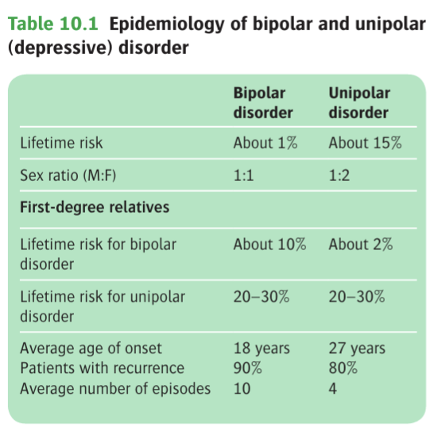
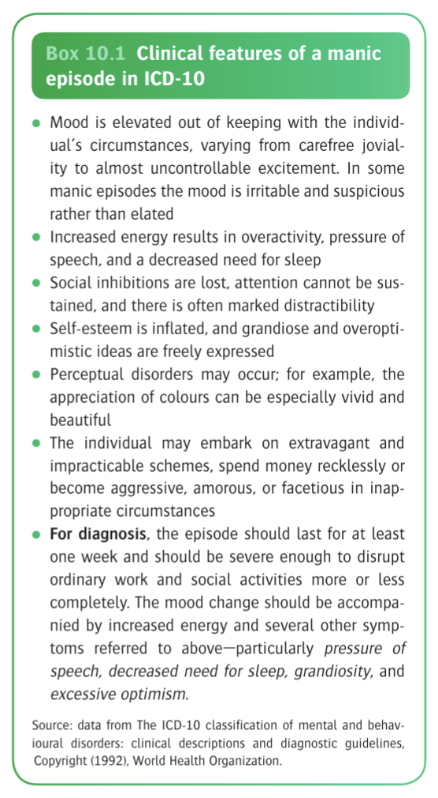
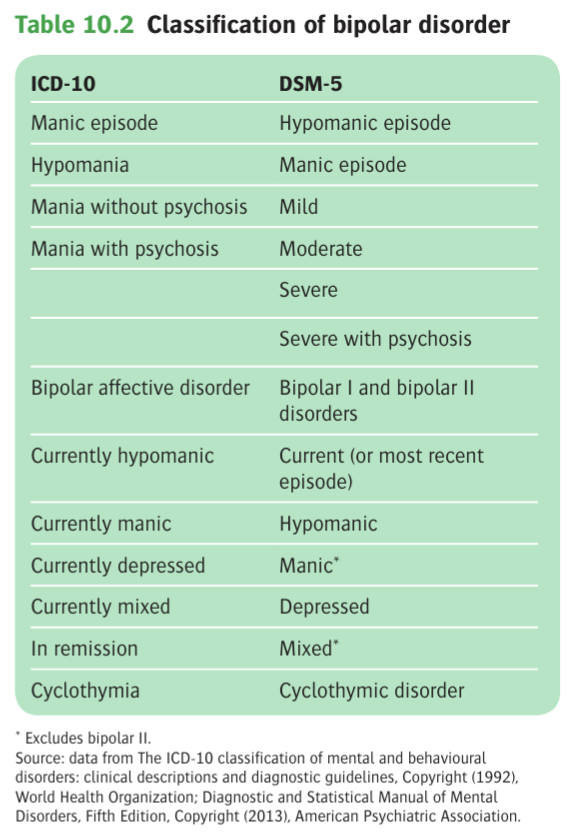

# Ch10 [[Bipolar Disorder]]s

## Introduction

- **Definition** - another group of mood disorders where depressive episodes are prominent, but are puntated by at least one episode of mania (bipolar I disorder) or hypomania (bipolar II disorder)
- **Kraepelin's dicotomy of psychotic disorders** - differentiated patients w/ psychotic Sx into 1) dementia praecox, and 2) manic depressive psychosis
- **Differentiation between unipolar depressive disorder and bipolar disorders:**
    - <u>Epidemiological differences</u> - unipolar depression generally have female preponderance, while bipolar disorders are not a/w any sex differences 
    
    - <u>Genetics and FHx</u> - stronger familial clustering of bipolar disorders

## Clinical Features

- **Mania** - clinical syndrome of 1) elated mood, 2) increased goal-directed activity (and increased energy levels), and 3) self-important ideas:
    - **Elevated mood** - historically described as mood elation although also commonly presents w/ irritability:
        - <u>Quality</u>:
            - Elated mood - appears euphoric, cheerful and optimistic and noted by earlier writers as "infectious gaiety"
            - Irritable mood - irritability can easily turn to anger and violence
        - <u>Timing</u> - no diurnal regulation that is characteristic of severe unipoolar disorders, and not uncommon for **high spirits to be interrupted by brief episodes of depression**
        - <u>Associated appeaence and behaviour</u>:
            - Appearence reflects prevailing mood, where clothing maybe brightly coloured and ill-assorted, but in severe cases appears untidy and dishevelled
            - Increased sociability, talkativeness, possibly w/ overfamiliarity
            - Appetite increased and may eat food greedily w/ little attention to convetional manners
            - Disinhibited sexual desires which is particularly important for women of child-bearing age
    - **Self-important ideas and grandiosity** - often revealed by the tempo and contents of speech and thoughts, impulsivity in spending habits, goal-directed activities, run-ins with the law, and may or may not ascend to delusional activities:
        - <u>Quality</u> - often reflected by a change in thought tempo and expansive ideas:
            - **Racing thoughts** described by patients w/ **rapid and copious** amounts of thoughts crowding the mind, which may result in **pressure of speech** and **flight of ideas**
            - **Expansive ideas** common, which is often grandiose, unrealistic, or overly optimistic, with a believe that their ideas are **original**, **important**, and **outstanding**, in which the patient may or may not act on
        - <u>Impact on patient</u> - often suffers when patient impulsively act on these expansive ideas:
            - Financial - extravagant shopping sprees, e.g. on expensive cars or jewellery, ill-considered investments, risky business ventures
            - Occupation - reckless decision to give up good jobs
            - Legal - plans may involve breaking the law, **substance use**
    - **Increased energy levels with increased goal-directed activity** - generally dependent on the content of self-important ideas but often reflected by:
        - <u>Reduced sleep</u> - requiring less sleep yet staying energetic, and characteristically wakes up in the middle of the night and busy themselves noisily (often to the annoyance of others)
        - <u>Increased planning</u> - planning based on the specific overvalued idea, however manic patients often **start many activities but leave them unfinished for new ones that attract the attention** (reflecting racing thoughts) and in fact get very little done
    - **Psychotic Sx** - 10-20% of manic patients experience first-rank Sx, but they usually do not last long, mostly dissapearing or changing in content within days:
        - **Delusions** - mostly regarded as secondary delusions that generally do not persist past the time point of elated mood, often <u>disappearing in days</u> or <u>rapidly changing content</u>:
            - <u>Grandiose delusion</u> (most common) - generally evolves from self-important (grandiose), expansive ideas and inflated self esteem
            - <u>Delusion of percusation or delusion of jealousy</u> - may arise from morbid irritability or arising secondary from grandiose delusion
            - <u>Delusion of reference</u> - ocassionally arises from elevated self-esteem
            - <u>Delusion of passivity</u> - as a first-rank Sx of schizophrenia but con occur in 10-20% of those w/ severe manic episodes
        - **Hallucinations** - usually AH that is <u>mood-congruent</u>, usually taking form of voices <u>affirming patients inflated self-esteem</u>, and may take a religious tone
    - **Impaired insight** - insight often invariably impaired:
        - See no reason why grandiose plans should be restrained or their extravagant expenditure curtailed due to being overly optimistic
        - Most do not think themselves as ill, and even if they do (e.g. run in with crimes or physical exhaustion), do not attribute to the Sx to the illness, nor do they believe that they are in need of Tx
        - However insight may be fluctuating in the hyperacute phase as they may exert some control over their Sx for a short period of time: Henry Maudsley (1879, p. 398) expressed the problem well: Just as it is with a person who is not too far gone in intoxication, so it is with a person who is not too far gone in acute mania; he may on occasion pull his scattered ideas together by an effort of will, stop his irrational doings and for a short time talk with an appearance of calmness and reasonableness that may well raise false hopes in inexperienced people.
- **Manic stupor** - rarely seen now, scenario where patient **appears elated**, and on recovery describes racing thoughts, but been rendered **mute and immobile** ("paralysed") by the excessive thought tempo: Therefore an earlier description by Kraepelin (1921, p. 106) is of interest: The patients are usually quite inaccessible, do not trouble themselves about their surroundings, give no answer, or at most speak in a low voice . . . smile without recognizable cause, lie perfectly quiet in bed or tidy about at their clothes and bedclothes, decorate themselves in an extraordinary way, all this without any sign of outward excitement.
- **Criteria for manic episodes in ICD-10 and DSM-5:**
    - In DSM-V, manic symptoms that remain at a syndromal intensity after withdrawal of antidepressants is denoted as manic episode rather than drug-induced manic illness

  
  
- **Criteria for hypomanic episodes in ICD-10 and DSM-5:**
    - Persistent mild elevation of mood over several days (\>= 4d in DSM-5) a/w increased energy and activity and feelings of weelbeing
    - Increased sociability, talkativeness, and overfamiliarity, increased sexual energy, and decreased need for sleep
    - Mood disturbances observed b others but is a/w an unequivocal change in function, as Sx is not sufficient enought to cause marked impairment in social or occupational activites, or to necessitate hospital admission
    - Psychotic features are absent
- **Other clinical presentation of bipolar disorders:**
    - <u>Depression</u>:
        - Common in the course of bipolar disorder and may initially present with an episode of major depression, often indistinguishable from unipolar depressive illness
        - Only clues being a Hx suggestive of hypomanic episodes, mixed symptomatology, and a FHx of bipolar disease
        - Other epidemiological evidences possibly includes early age of onset, clinical severity etc.
        - Melancholic features such as psychomotor retardation, early morning awakening, morning depression, and psychotic featuers are reportedly more common in patients with bipolar disorder
    - <u>Mixed affective states</u> - co-existence of depressive and manic episodes within the same episode:
        - Co-existence of increased activity, e.g. overactive and over-talkative despite having profoundly depressive thoughts
        - Or sequence of rapid changes in mood within the same episodes, e.g. manic patient becomes intensely depressed for a few hours and return back to manic states
        - Initially described by Willhelm Griesinger, with rekindled interests as appears to predict better response to valproate
    - <u>Rapid cycling disorders</u> (circular intensity coined by Jean-Pierre Falret) - recurrent episodes of depressive, manic, or mixed disorders by convention \>=4x distinct episodes a eyear, and that episodes are separated by period of remission or switched to opposite polarity:
        - Occurs in up to 15-30% of bipolar illness, but reflects a temporary phenomenon (remits in 2y)
        - Occurs more common in women and a/w concomitant hypothyroidism
        - Manic episodes are often triggered by antidepressants
    - <u>Cyclothymia</u> - seen as a milder variant of bipolar disorder characterised by persistent instability of mood w/ numerous episodes of mild elation or depressed mood that do not meet the severity criteria for MDD or hypomanic episodes

## Transcultural Factors
## Classification

- **Differences between ICD-10 and DMS-5:**
    - ICD-10 requires at least two episodes of mood disturbances (one of which has to be hypomania or mania) for the diagnosis
    - DSM-5 only requires single episode of mania or hypomania for the diagnosis

  
  
- **DSM-5 categorisation of bipolar disorders into bipolar I and bipolar II disorders** - intent is to correctly classify patients as having bipolar II disorders instead of recurrent major depressive disorders:
    - <u>Bipolar I</u> - bipolar disorder in which mania has occured at least one ocassion
    - <u>Bipolar II</u> - in which hypomani has occured, in the context of current major depressive episode (presence of manic episode precludes the diagnosis of bipolar II)

## Differential Diagnosis of Bipolar Disorder

- **Major differential diagnosis of mania:**
    - Schizophrenia
    - Organic brain disorders involving the frontal lobe (frontal lobe syndrome)
    - Substance use disorders (states of excitement induced by amphetamines and other illegal drugs)
    - Borderline personality disorders
- **Schizophrenia or schizoaffective disorder:**
    - Most difficult to distinguish especially as <u>psychotic symptoms</u>, including those first-rank symptoms can occur in both schizophrenia and manic disorders
    - <u>Content and duration of psychotic features</u> are the key differentiating features
    - In <u>bipolar disorders</u>, common delusions and AH are mood congruent and generally <u>arises from a morbid state of inflated self-esteem</u>; delusion of percusation or jealousy which is more seen in schizophrenia can occur in bipolar disorders
    - In bipolar disorders, psychotic features are usually <u>short-lasting</u>, or <u>changing in content</u>, and never persist <u>beyond period of over-activity</u>; persistence of a high-degree of conviction suggests schizophrenia-spectrum disorders
- **Frontal lobe pathology:**
    - Common causes are brain tumours or head injuries, but HIV infection should be considered when Hx is suggestive
    - Features of gross disinhibition strongly suggests a frontal lobe pathology
- **Drug misuse:**
    - Distinction made by detailed drug Hx and toxicology screening
    - However, manic episodes may complicate w/ substance use hence Hx should be clarified regarding the temporal relationship between mood and drug use
- **Borderline personality disorder:**
    - Often mimicks _affective instability_, but often rapidly shifts over hours and days, which is not fitting for bipolar disorders
    - Features of increased energy or increased activity is rare in BPD but prominent in manic disorders
    - Mood episodes in BPD is usually triggered by interpersonal issues while they are not too prominent in bipolar disorders

## Epidemiology

- **Epidemiology** - dependent on definition, where defining patients as having bipolar disorder precludes classification into recurrent MDD:
    - <u>Prevalence</u>:
        - Lifetime risk - ~ 1% (0.3-1.5%)
        - 6 mo prevalence - not much less than lifetime prevalence, indicating the chronic nature of the disorder
    - <u>Demographic</u>:
        - Age - mean age of onset ~18y (considered earlier than unipolar depressive disorders)
        - Sex - no sex preponderance (M=F)
    - <u>Comorbidities</u>:
        - Psychiatric comorbidities - anxiety disorder, substance misuse
        - Medical conditions - general medical conditions such as cardiovascular disease (?possibly due to cardiometabolic risks of medications)

## Etiology

- **Difficulties in distinguishing unipolar depression and bipolar disorders:**
    - Distinction of etiology between recurrent unipolar depression and bipolar depression has not always been made
    - This is particularly true as first-degree relatives of patients w/ known bipolar disorder are also at an increased risk of unipolar depression, suggesting some etiological overlap
- **High heritability and distinct neuropathophysiology:**
    - Most striking feature is the high heritability of bipolar disorders
    - Molecular genetics, and advances in structural and functional neuroimaging yields hypothesis that differentiate between the two disorders
    - However, such understanding has not lead to new biomarkers and Tx for patients with bipolar disorders

### Genetic Causes

- **Family and twin studies** - estimated hereditability of ~85% (Bienvenu et al 2011):
    - Twin studies showed a monozygotic concordance rate of ~60%, and dizygotic concordance rate of 20%
    - First degeree relatives of bipolar probands are a/w increased risk of bipolar disorders, unipolar depression, but also schizoaffective disorders
- **Mode of inheritence** - <u>polygenic inheritence</u> w/ conglomeration of multiple risk alles of small effects, possibly interacting with the environment
- **Genome-wide association studies** (GWAS) - has been promising as yielded robust associated genes:
    - <u>CACNAI1C gene</u>, which encodes subunit of L-type Ca channels showed significant association, as well as other genes a/w activity of voltage-gated Ca channels, w/ view of the possibly mood-stabilising effects of CCBs like verapamil
    - Significant <u>overlap between risk alleles between bipolar disorders and schizophrenia</u>, as suggesting bipolar disorder is etiologically more similar to schizophrenia than unipolar depressive disorders, but this is partially attributed to greater heterogeneity of diagnostic category of depression

### Environment

- **Environmental factors in bipolar disorders** - often <u>general risk factors</u> for most affective disorders or more general psychiatric illnesses:
    - <u>Childhood sexual abuse</u> - higher rates than healthy controls but similar or lower than other psychiatric illnesses; association drawn here as **childhood sexual abuse knwoown to link to development of psychosis**
    - <u>Life events</u> - generally known to precipitate episodes of both depression and mania in bipolar patients, and is generally more important in initial episodes, suggesting a possible "**kindling effect**"; possibly mediated through effects on circadian rhythms
    - <u>Social support</u> - **high levels of expressed emotion** (EE) a/w affective symptomatology and risk of relapse in bipolar disorders in a similar manner as schizophrenia

### Neurobiological Approaches to Etiology

- **Excessive dopamine activity:**
    - Initial hypothesis arises because those w/ drug abuse resulting in increased dopamine activity presents w/ evidence of acute mania, namely 1) mood elation, 2) increased energy levels
    - The hypothesis is generally of interest on an empirical basis due to the use of antipsychotics in the Tx of acute mania
    - However PET studies have failed to demonstrate increase dopamine release in patients w/ manic episodes (cf schizophrenia), and there is a shift to "<u>dopamine hyperreactivity</u>"
- **Excessive glutamate activity:**
    - Functional neuroimaging studies have demonstrated <u>increased Glu signalling</u> at various stages of illness, and explains why <u>anticonvulsants</u> are useful in the Tx of bipolar disorders
    - This is an interesting <u>differentiation w/ unipolar depressive disorders</u> where Glu neurotransmission is reduced, but there is <u>insufficient evidence</u> to ascertain the reliability of this finding and role as a biomarker of bipolar disorders
- **Endocrine abnormalities** - weak links to hypercortisolism and rapid drop in estrogen and progesterone (?post-partum psychosis as a form of bipolar disorder)
- **Neuroanatomical and neuropathological changes** - certain structural volume and neuroconnective changes implicated on neuroimaging studies
- **Neurocognitive changes** - some cognitive defects in bipolar disorders, although to a modest effect compared w/ schizophrenia

## Course and Prognosis

- **Clinical course of bipolar disorders** - epsiodic mood disturbances, where average length of manic episodes last ~ 6mo, usually w/ full clinical remission in between episodes:
    - <u>First mood episodes</u>:
        - Typically 21y in hospital studies but ~18y in community surveys; late onset bipolar disorders is rare and typically reflects organic brain disease
        - Usually presents w/ bipolar depression as initial presentation, w/ first manic episode manifesting around 5y later
    - <u>Subsequent episodes and risk of relapse</u>:
        - ~90% of patients w/ manic episode will develop further mood disturbances
        - On average 10 episodes of major mood disturbances over a 25y follow up
        - \< 20% achieve 5y period of clinical stability w/ good social and occupational performance
        - Intervals beween episodes becomes progressively shorter w/ age and number episodes ("**kindling effect**")
    - <u>Remission</u>:
        - Most will recover from acute episodes
        - However up to 33% will experience residual mood-related Sx of subclinical intensity after initial episodes, usually taking the form of depressive Sx
        - Persistent cognitive deficits and mood instability are poor prognostic factors
- **Mortality** - significantly increased risk of mortality:
    - <u>Suicide</u> - 8% of M and 5% of F died of suicide in 40y follow up
    - <u>Non-suicide causes of mortality</u>:
        - Substance misuse, including smoking and alcohol
        - Poorly controlled medical conditions (e.g. cardiovascular diseases)
        - Poor cardiometabolic effects of psychotropic mdrugs, particularly antipsychotics

## Treatment of Mania
### General Measures
- **Principles of Mx:**
	- _Pharmacological Mx_ - aimed at reducing physical and mental overactivity, improving features of psychosis, and preventing deteriorations in health caused by exhaustion, sleep deprivation, and poor fluid intake
	- _Electroconvulsive therapy_ - widely used in the treatment of mania
### Medication
Prior to the advent of modern drug treatment, mortality of mania in the in-patient setting was ~20%, nearly 50% of these patients died from exhaustion (Derby 1933).
- **Typical antipsychotic drugs:**
	- _Clinical efficacy_:
		- Several RCTs demonstrate efficacy of FGAs (e.g. chlopromazine, haloperidol) in mania irrespective of features of psychosis
	- _Limitations_:
		- Relatively high dose is required which results in marked EPSE
		- Not demonstrated to protect against **depressive downswings** that follow the manic illness
- **Atypical antipsychotic drugs** - now preferred over typical antipsychotics due to improved tolerability profile:
	- _Selection_ - the following SGAs are supported by RCTs (Cipriani et al 2011):
		- Aripiprazole
		- Asenapine
		- Olanzapine
		- Quetiapine
		- Respiradone
	- _Clinical efficacy and limitations_:
		- Efficacy in treatment of mania supported by several RCTs
		- Most RCTs enrolled severely ill patients, which limits generalisability of findings
- **Lithium:**
	- _MOA_ - effects on secondary messengers intracellularly, generally thought to have good:
		- Mood stabilising/ anti-manic effects
		- Anti-psychotic effects
	- _Indications_ - first line Tx for acute mania
	- _Clinical efficacy_:
		- Five RCTs support the use of lithium in acute treatment of mania (Cipriani et al 2011)
		- Response rate of ~49% for lithium compared to 48% for valproate and 25% for placebo (Bowden et al 1994)
	- _Limitations_:
		- Slower onset of action
		- Thought to be less effective compared w/ antipsychotic medications in highly active states, esp. w/ psychotic features (Goodwin et al 2016)
		- Poor predictors of response include 1) prominent depressive symptoms, 2) psychotic features, and 3) rapid cyclers
- **Carbamazepine:**
	- _Indications_ - usually as an adjunct in acute management of mania
	- _Clinical efficacy_ - limited by study design:
		- One recent placebo-controlled RCT demonstrated clinically significant antimanic effects (Goodwin et al 2016)
		- Older trials mainly use carbamazepine as an adjunctive therapy, or included mixed diagnostic groups
	- _Limitations_ - potent CYP450 inducers:
		- Auto-induction results in shortening of half-life of carbamazepine
		- Results in lowering of plasma levels of concomitantly administered drugs, namely antipsychotics
- **Valproate:**
	- _Indications_ - considered 1st-line in acute management of mania, but may be preferred due to rapid onset of action
	- _Clinical efficacy_ - similar clinical efficacy as lithium (Ciprani et al 2011), however may be more effective in subgroup predicted to have poor response to lithium:
		- Prominent depressive/ dysphoric symptoms
		- Rapid cyclers
	- _Valproate loading_ (20 mg/kg/d) - means of achieving faster onset of antimanic activity compared to other mood stabilisers:
		- Onset of antimanic effect can occur as early as 1-4d, hence may be preferred if rapid response is required
		- Postulated to be due to good tolerability enabling rapid dose escalation, where as lithium and carbamezapine required to be introduced more gradually
- **Benzodiazepines:**
	- _Indications_ - as adjuncts in treatment of mania for diminishing over activity and restoring sleep, w/ immediate effects giving time for mood stabilisers to take effect
	- _Selection_ - high potency, short-acting agents used on 'prn' basis for as short of time as possible:
		- Lorazepam (ativan)
		- Clonazepam
### Electroconvulsive therapy
- **Electroconvulsive therapy in treatment of acute mania:**
	- _Clinical efficacy_ - only two prospective control trials but demonstrated superiority over conventional drug treatment:
		- Small et al 1988 demonstrated that bilateral ECT was found to be superior to lithium
		- Mukherjee et al 1988 demonstrated that unilateral/ bilateral ECT (13/22 response rate) was superior to combination drug therapy of lithium and haloperidol (0/5 response rate) in those who did not respond to antipsychotics alone
		- Retrospective studies demonstrated **overall response rate of ~80%**, many of these patients are unresponsive to medications
		- No data comparing efficacy between bilateral and unilateral ECT
	- _Duration_ - shorter durations in treatment of mania compared w/ treatment of depression
### Continuation treatment of mania
- **Duration of continuation treatment of acute mania:**
	- At least 6 mo as an average length of a manic episode roughly is around 6 mo
	- Too rapid reduction in doses in medications can lead to sudden recrudescence of an apparently treated manic disorder
	- Antipsychotic drugs are often withdrawn first slowly due to adverse effects of the drug

## Treatment of Bipolar Depression
- **Differences in pharmacological treatment between bipolar depression and unipolar depression:**
	- Historically treated as the same for a number of issues
	- Recent years it has become apparent that pharmacological Tx differ significantly
### Medications
- **Antidepressant drugs:**
	- _Clinical efficacy_ - anti-depressants remain effective over placebo in recent meta-analysis:
		- In 1400 patient's with bipolar depression, ADs are superior to placebo (RR 1.43 [95% CI 1.11-1.84; NNT ~ 6]) (Vasquez et al 2011)
		- Postulated that more clinically useful in bipolar II depression than in bipolar I depression (Malhi 2015)
		- Venlafaxine thought to be more likely than SSRIs to cause manic switching (Vazquez et al 2014)
	- _Limitations and concerns_ - number of theoretical disadvantages of AD in bipolar depression:
		- Possibly lower efficacy than in unipolar depression
		- A risk of inducing mania, i.e. manic switching (however data only risk is much less than initially thought and only slightly higher than that in placebo; Vazquez et al 2014)
		- Risk of inducing rapid cycling
- **Lithium:**
	- _Role_ - limited in the treatment in bipolar depression, main role being the prevention of bipolar depression
	- _Clinical efficacy_ - limited data:
		- Generally less effective than atypical antipsychotics such as quetiapine (Young et al 2010)
		- Very few positive differences from placebo
- **Atypical antipsychotics:**
	- _Selection_ - certain atypical antipsychotics appear to be effective in the treatment of bipolar depression (Vazquez et al 2014):
		- Quetiapine
		- Lurasidone
		- Olanzapine + fluoxetine (olanzapine monotherapy seems to be less effective than other proven antipsychotics)
	- _Clinical efficacy_ - Vasquez et al 2014:
		
		![[Pasted image 20260404131753.png]]
- **Anticonvulsants:**
	- _Indications_ - mainly as augmentation for ineffective quietiapine therapy
	- _Selection_:
		- Lamotrigine
		- Valproate
	- _Benefits_ - free of risk of inducing manic switching or rapid cycling
	- _Clinical efficacy_ - Geddes et al 2016 evaluated augmentation w/ lamotrigine in those w/ ineffective quetiapine therapy:
		- 12 week remission in lamotrigine was 31% compared w/ 16% in placebo group
		- Similar benefits found at 52 weeks
### Electroconvulsive therapy
- **Electroconvulsive therapy in treatment-resistant bipolar depression:**
	- General consensus that bit is beneficial
	- Recent RCT demonstrates that improved antidepressant response with ECT, although no significant differences in remission rates (Schoeyen et al 2014)
## Longer-Term Treatment of Bipolar Disorder
### Medication
- **Lithium:**
	- _Clinical efficacy_ - as a rule of thumb 50% of patients respond to **lithium maintenance monotherapy**; substantial evidence for the efficacy of lithium in maintenance treatment of recurrent mood disturbances (Geddes et al 2004):
		- More effective than prevention of relapses in all mood  disorders (RR 0.65 [95% CI 0.5-0.84])
		- Prevention of bipolar depressive episodes was unequivocal and not statistically significant (RR 0.72 [95% CI 0.49-1.07])
		- Associated with significant reduction in mortality from suicide, observed from dedicated lithium clinics (Cipriani et al 2011)
	- _Predictors of relatively poorer response to lithium maintenance therapy_:
		- Prominent dysphoric symptoms or depressive polarity
		- Mixed affective states
		- Rapid-cycling disorders
		- Alcohol and drug misuse
		- Mood-incongruent psychotic features
- **Valproate:**
	- _Clinical efficacy_ - Limited longitudinal data regarding valproate maintenance therapy:
		- No statistically significant difference in time to first mood episode w/ valproate, lithium, and placebo for patients put on 1y of maintenance therapy (Bowden et al 2000)
		- In a most recent prospective RCT, valproate has a 69% 24 mo relapse rate, which is significantly higher than lithium alone (59%), or lithium and valproate (54%) combination therapy (BALANCE Study Group 2010)
- **Lamotrigine:**
	- _Clinical efficacy_ - prophylactic effects more marked for bipolar depression:
		- Some modest benefits in prevention of mania, but prophylactic effects clearly with depression
		- Profile of activity contrasts that w/ lithium and valproate which have more evidence for preventing mania, w/ unequivocal evidence for preventing depression
- **Carbamazepine:**
	- _Indications_ - typically used for Tx of lithium-resistant bipolar disease, esp. rapid-cycling disorders (as monotherapy or combination therapy)
	- _Clinical efficacy_ - less effective than lithium for "classical" bipolar illnesses (Goodwin et al 2016)
	- _Limitations_ - induction of CYP450 enzymes, reducing plasma level of other drugs used in combination therapy
- **Antipsychotic drugs:**
	- _Indications_ - some
### Psychotherapy
- **Cognitive behaviour therapy:**
	- _Theoretical aspects_ - theoretically valuable in:
		- Inducing insight - acceptance of illnesses and need for medical treatment
		- Emotional regulation - improving self-management of emotionally-stressful situations
	- _Clinical efficacy_ - small studies showed some effects but not replicated in large trials (Scott et al 2006; Geddes and Miklowitz 2013)
- **Family focused approaches:**
	- _Rationale_:
		- Mood swings, particularly manic phases, are extremely disturbing for families, which may result in high levels of "expressed emotion" (high EE)
		- High EE is known to worsen the clinical course of bipolar disorder
	- _Theoretical aspects_:
		- Psychoeducation for family regarding nature of illness and factors affecting relapse
		- Training communication skills and problem-solvings
	- _Clinical efficacy_ - reduction in both hospitalisations and symptomatology by 33% (Geddes and Miklowitz 2013)
- **Interpersonal and social rhythm therapy:**
	- _Rationale and theoretical aspects_:
		- Sleep deprivation in bipolar patients can trigger episodes of mania
		- Establishment of daily routine and maintaining regular sleep-activity schedules with careful attention to sleep hygiene may prevent manic relapse
	- _Clinical efficacy_ - patients who are able to attain stable sleep-wake routines do have a better longer-term outcomes (Geddes and Miklowitz 2013)
- **Group psychoeducation:**
	- _Theoretical aspects_ - application of the aforementioned concepts in group setting to attain cost-effectiveness:
		- Psychoeducation - education of the nature of disease, importance of Tx adherance, and relapse signatures
		- Mood regulation - understanding approaches to maintaining mood stability
		- Social rhythm therapy - stressing importance of sleep-wake cycle
	- _Clinical efficacy_ - pioneered in Barcelona (Colom et al 2009):
		- Reduced 5y relapse rate by > 50%
		- Early intervention (i.e. initiation at fewer episodes) a/w better responses
## Practical Management of Bipolar Disorders
### Acute mania
- **Assessment:**
	- _Making the Dx_ - Hx, P/E and Ix in r/o of other organic causes (e.g. substance use, frontal lobe lesions)
	- _Assessing severity of disorder_ - often requiring collateral information from an informant, as well as ward observations, as manic patients may exert certain degree of self-control in an interview
	- _Forming an opinion about the cause_ - stressful life events, sleep deprivation, treatment w/ other drugs (steroids, and antidepressants)
	- _Judge the effects on others_ - often full blown manic episodes are difficult to care for even for a few days
- **Treatment setting** - inpatient vs outpatient care:
	- In-hospital care is typically required to protect patient from potentially painful consequences of one's own behaviour
	- Patients will usually agree to enter the hospital after some persuasion, but compulsory admission is likely to be needed in severe cases
	- Only the mildest case can be treated in the outpatient setting
- **Pharmacological management:**
	
	![[Pasted image 20260404161218.png]]
	- _Approach to initial therapy in a mood-stabiliser-naive patient_ - **antipsychotics** usually used as first line therapy due to rapid effect on over-activity (mood stabilisers reserved for long-term therapy or augment antipsychotic response):
		- **Antipsychotic drugs** as first line therapy (olanzapine, quetiapine, risperidone, or modest dose halloperidol)
		- Adjunctive **high-potency benzodiazepine** to avoid high-dose therapy and to ensure satisfactory sleep
		- **Mood stabilisers** initiated if response is unsatisfactory (lithium for classical mania; valproate for atypical mania or where lithium is contraindicated)
	- _Approach to initial therapy with mood stabilisers_ - e.g. for patients already on a mood stabiliser:
		- **Mood stabiliser regimen optimised** in terms of dose and adherence, and a SGA is typically added (or a second mood stabiliser)
		- **Valproate** may be preferred in acute setting, as easier to use (no need for blood taking), and faster onset of action (**valproate loading**)
- **Electroconvulsive therapy** - typically for treatment-refractory cases:
	- Clinical experiences suggest that short-course ECT can be followed by a significant reduction in symptoms sufficient to allow response to pharmacological Tx
	- ECT may also be effective in mixed affective states where depressive symptoms are prominent
- **Assessment of treatment response** - antipsychotics can be withdrawn slowly based on treatment response:
	- _Psychological assessment_ - progress of manic episode can be judged by mental state and ward behaviour
	- _Biological assessment_ - pattern of sleep and regaining of weight loss are important adjuncts
- **Assessment for symptoms of depressive disorder** - whether transient or sustained, sucicidal risk is increased:
	- Transient, but severe depressive symptomatology are common in manic episodes w/ or w/o pharmacologicla therapy
	- Progression to a sustained depressive episode may occur and require additional treatment
### Bipolar depression
- **Pharmacological management** - AD no longer 1st-line treatment:
	
	![[Pasted image 20260404162400.png]]
	- _Approach to initial therapy for mood-stabiliser naive patient_:
		- **Atypical antipsychotics:**
			- Quetiapine or combination w/ olanzapine and fluoxetine (S/E include metabolic risks, and sedation)
			- Lurasidone considered if S/E too problematic
		- **Anticonvulsants** (lamotrigine) - lamotrigine monotherapy preferred if insufficient response to atypical antipsychotics
	- _Approach of initial therapy for mood-stabiliser agent_ - pre-existing mood mood stabiliser optimised despite equivocal evidence for bipolar depression:
		- **Optimise pre-existing mood stabiliser regimens** (lithium or valproate) in terms of dosing and adherence
		- Consider **atypical antipsychotics** or **lamotrigine**, however lamotrigine should be initiated carefully in a patient taking valproate
	- _Role of antidepressants_ - some patients do seem to require short-term treatment w/ antidepressants:
		- Requires concomitant treatment w/ mood stabiliser or antimanic dose of atypical antipsychotics
		- Stopped after 12 weeks to lessen risk of mood destabilisation
- **Psychotherapy** - no evidence for psychotherapy used in unipolar depression, dependent on patients preference: 
	- Cognitive behavioural therapy
	- Interpersonal therapy
### Prevention of relapse and recurrence