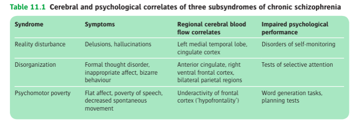
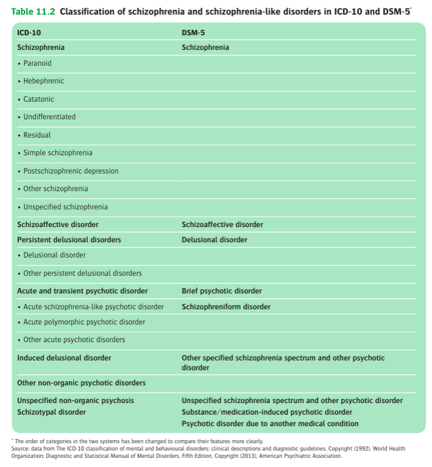

# Oxford Ch11 Schizophrenia

- ref [[Schizophrenia]]

## Introduction

- **Overview:**
    - One of the most difficult psychiatric syndrome to define and describe
    - Good example to explain concepts of disease, classification, etiology in psychiatry

## Clinical features

- **Classification of cardinal features of schizophrenia:**
    - <u>Positive symptoms</u> - the most florid and well-known types of symptoms of schizophrenia, characterised by delusions and hallucinations (N.B. particular types of delusions and hallucinations are callsed first-rank symptoms as proposed by Kurt Schneider)
    - <u>Negative symptoms</u> - symptoms reflecting a <u>loss of normal functioning</u>, often listed as the 'four As': 1) alogia, 2) avolition, 3) affective flattening, and 4) anhedonia
    - <u>Behavioural disorganisation</u> - includes formal thought disorders, as well as inappropriate affect and bizzare behaviours
    - <u>Cognitive symptoms</u> (N.B. dementia praecox) - extensive attentional and memory impairments occuring in those w/ chronic schizophrenia
- **Principles of clinical manifestations of schizophrenia** - predominant Sx differ between <u>acute schizophrenia</u> and <u>chronic schizophrenia</u>, but is an oversimplification; all features of schizophrenia can occur, and can occur at any phase of the disease:
    - <u>Acute schizophrenia</u> - dominated by positive symptoms, with the subtypes of acute schizophrenia classiically recognised based upon the relative prominence of different positive Sx (behaviour disorganisation may also be prominent \[simple schizophrenia\])
    - <u>Chronic schizophrenia</u> - dominated by negative symptoms and cognitive impairments
- **Acute schizophrenia** - florid positive Sx while behavioural disorganization and formal thought disorders also predominate (other Sx may be masked by positive Sx):
    - **Delusions** - almost invariable, although primary delusions (e.g. arising from a delusional mood, or a sudden delusional idea) is uncommon and also difficult to identify, and thus are usually secondary to the pre-morbid condition:
        - <u>Percusatory delusions</u> - common, but non-specific to schizophrenia, as they also characterize delusional disorders and can occur in all psychosis
        - <u>Delusions of reference</u> - of more diagnostic value, where there is an irrational, immovable belief that an unrelated, mundane event, has special, personal significance (e.g. the news reporter is directly communicating a message to them)
        - <u>Delusion of control</u> (passivity) - of more diagnostic value but rare, occurs when there is an irrational, immovable belief that ones thoughts and behaviour is being controlled by external forces
        - <u>Delusion of the possesion of thought</u> (thought alineanation) - first-rank symptoms, pertaining **thought withdrawal**, **thought insertion**, and **thought broadcasting**
    - **Hallucinations** - most commonly auditory hallucinations, although visual, tactile, olfactory hallucinations are reported but are often <u>conveyed in a delusional manner</u>:
        - <u>Elemental auditory hallucinations</u> - may take the form of noises or music
        - <u>Complex auditory hallucinations</u> - brief words, phrases or dialogue, of esp. significance if heard as commands, running commetary or echos
    - **Formal thought disorders** - as evident in the difficulty to grasp the underlying meaning of speech, while some patients have difficulty w/ abstract ideas, caused by a <u>loosening of association between expressed ideas</u>
    - **Alterations of mood:**
        - <u>Abnormal emotional reactions</u> - Sx of anxiety, depression, irritability or euphoria may arise from the morbid condition but is often short-lived; while if sufficiently prominent and sustained, the posisbility of <u>schizoaffective disorders or other affective psychosis</u> should be considered
        - <u>Morbid expressions of emotion</u>:
            - Bluntening of affect - diminution of emotional responsiveness manifesting as sustained emotinal indifferences
            - Incongruity of affect - expressed mood is not in keeping with the situation
    - **Insight** - usually impaired as most do not accept their experiences result from an illness and usually ascribes them to the malevolent actions of other people
- **Chronic schizophrenia** - characterised by negative Sx:
    - **Negative symptoms** - resulting in a loss of functioning, hence also known as 'defect state' or 'deficit syndrome':
        - <u>Alogia</u> - decreased spontaneous speech
        - <u>Avolition</u> - lack of drive, initiative to start or complete goal-directed activity, resulting in:
            - Prolonged periods of inactiveness or aimless repetitive activities if left by himself
            - Social withdrawal (hence social cognition and behaviour may deteriorate to a point that is embarrassing for others)
            - Poor self care (hence apperance may be bizzare and somewhat inappropriate)
        - <u>Affective flattening</u> - lack of emotional expressivity, but not depression, and when emotion is shown, it is incongrous or shallow
        - <u>Anhedonia</u> - general lost of interest, which may be related to avolition
    - **Behavioural disorganisation:**
        - <u>Formal thought disorders</u> - abnormality of speech that are similar to the manifestations of formal thought disorders, but may be <u>masked by alogia</u>
        - <u>Disorders of movements</u> - include stereotypies, mannerisms, other catatonic symptoms and dyskinesia
    - **Cognitive impairment** - common if not universal in chronic schizophrenia and may account to low level of functioning and poor outcomes
- **Clinical course:**
    - Acute schizophrenia may result in complete recovery to pre-morbid state or progression to chronic schizophrenia
    - Patients w/ chronic schizophrenia generally do not recover completely
- **Negative symptoms:**
    - Alogia - decreased spontaneous speech
    - Avolition - decreased motivation
    - Affective flattening - lack of emotional expressivity, but not depression
    - Anhedonia - lost of interest
- **Subtypes of schizophrenia** - conventionally divided into several subtypes based on predominant clinical features during acute phase:
    - <u>Paranoid schizophrenia</u> (most common form):
        - Characterised by **systematised percusatory delusions**, possibly caused by percusatory auditory hallucinations
        - Thought disorders, affective, catatonic and negative symptoms are not prominent
    - <u>Hebephrenic schizophrenia</u> (disorganised schizophrenia):
        - **Formal thought disorder** and **affective Sx** predominate, where behaviour often appears silly and unpredictable
        - **Delusions and hallucinations are fleeting and often not systematised**, possibly because of the severe loosening of association caused by formal thought disorders
        - **Speech is rambling and incoherent**, in its severe form manifests as 'word salad', reflecting underlying thought disorder
        - **Negative symptoms** occurs early and contribute to poor prognosis
    - <u>Catatonic schizophrenia</u>:
        - **Motor symptoms predominate**, w/ changes in activity that vary between excitement and stupor (at times person appears to be in a dream-like state)
        - Now an extremely rare diagnosis
    - <u>Simple schizophrenia</u>:
        - **Insiduous onset** of **negative symptoms and behavioural disorganisation**, often presenting w/ social withdrawal and declining performance at work
        - Positive Sx are often not evident
- **Other sub-classification of schizophrenia:**
    - <u>Liddle's three clinical subsyndrome</u>: 
    
    - <u>Crow's type I and type II schizophrenia</u> - based on clinical and neurobiological factors:
        - Type I schizophrenia - acute onset w/ florid positive Sx, and preserved social functioning during remissions and good response to antipsychotic drugs (due to association w/ dopamine overactivity)
        - Type II schizophrenia - insiduous onset of mainly negative symptoms, with poor outcomes and response to antipsychotic drugs (neurobiologically related to atrophic brain changes and not dopamine overactivity)
- **Prodrome of schizophrenia** - 'eary interventions' are explored to prevent onset of schizophrenia and thus improve long-term outcomes:
    - **Terminology:**
        - <u>At-risk mental states</u> (ARMS) - as defined objectively by the Comprehensive Assessment of At Risk Mental States (CAARMs)
        - <u>Clinically high risk</u> (CHR) - period of early Sx that indicate an increased likelihood of development of full psychotic disorders
    - **Rationale for identification of prodrome** - the longer the duration of untreated psychosis, the worse the outcome, possibly because:
        - A prolonged, insiduous onset is a feature of severe and treatment-resistant form of schizophrenia (if this is true, there is no role of early identification)
        - Prolonged untreated psychosis is 'neurotoxic' and makes the illness less responsive to treatment
        - Illness is more severe by time of treatment and is thus harder to treat
        - Longer prodrome associated w/ greater psychosocial impairment and loss of functioning, which hambers chance of re-integration into society and complete recovery

## Diagnosis and classification

- **Classification of schizophrenia and schizophrenia-like disorders in DSM-5 and ICD-10:** 
	
	
- **Schizophrenia-like disorders** - disorders that may resemble schizophrenia in some respects but do not meet the criteria for diagnosis:
    - Delusional disorders (paranoid psychosis)
    - Brief psychotic disorder (i.e. brief psychotic disorders vs schizophreniform disorders)
    - Psychotic disorders accompanied by prominent affective symptoms (i.e. Schizoaffective disorders)
    - Psychotic disorders without all of the symptoms required for schizophrenia (i.e. schizotypal personality disorders, schizotypical disorders etc.)
- **DDx of schizophrenia:**
    - <u>Organic syndromes</u> - delirium, characterised by clouding of consciousness, disorientation (cf orientation is normal in schizophrenia)
    - <u>Neurological disorders</u> (i.e. psychotic disorders due to another medical condition):
        - Temporal lobe epilepsy
        - General paralysis of the insane
        - Metachromatic leukodystrophy
    - <u>Drug-induced states</u> - e.g. steroids, dopamine agonists, psychoactive substances (e.g. alochol, psychostimulants)
    - <u>Affective psychosis</u> - typically differentiated by the degree and persistence of mood disorders, and the temporal relationship of the positive symptoms with the prevailing mood
    - <u>Delusional disorders</u> - characterised by absence of other symptoms of schizophrenia, but w/  chronic, systematized paranoid delusions
    - <u>Personality disorders</u> - particularly of paranoid, schizoid, and schizotypal forms

## Epidemiology

- **Epidemiology** - a disorder with low incidence and a high prevalence:
	- _Prevalence_ - often quoted a lifetime morbid risk of ~ 1% (1 in 100) but likely less:
		- Systematic reviews may describe a mean lifetime prevalence of 5.5 per 1000 w/ median value of 5 per 1000 (Simeone et al 2015)
		- Mean lifetime morbid risk of 11.9 per 1000 w/ median value of 7.2 per 1000 (McGrath et al 2008)
	- _Demographic_:
		- Age - most common onset in the mid twenties, w/ usual onset between 15 and 54y (two peaks, one at 20y, and one at 33y)
		- Sex - meta-analysis shows a slight male preponderance (M:F = 1.4:1), where some attributes this to the antipsychotic effects of estrogen (evidence remains controversial)
- **Schizophrenia and fertility** - controversial topic not least because of its implications for debate about whether schizophrenia is a disease, and with regards to its genetic basis:
	- Bundy et al 2011 showed substantial reduction inf fertility in people w/ schizophrenia (~ 40% less), which was greater in M than F
	- Likely confounded, have been adjusted for intrinsic features of schizophrenia, such as 1) limited opportunities by institutionalisations, and 2) sexual dysfunctions and amenorrhoea caused by an antipsychotc drugs
	- However Zimbron et al 2013 also demosntrates a decrease in fertility prior to onset of psychosis
	- Two broad questions remain: 1) whether there is an explanation regarding this association, 2) hoes does schizophrenia persist in the population despite the apparent reduction in fertility
## Etiology
### Overview
### Genetics
### Environmental risk factors
### Social and psychological factors
### Psychological factors
## Neurobiology

## Neurodevelopmental model

## Course and prognosis

- **Historical accounts on the course and prognosis of schizophrenia** - fiercely debated and difficult to interprate due to different ways in which 1) diagnosis is made, 2) patients were followed up, and 3) recovery was defined:
	- _Emil Kraepelin_ - initially thought that schiziophrenia (dementia praecox) had an invariably poor outcome, although later reported that 17% of patients eventually were socially well-adjusted
	- _Manfred Bleuler_ - performed a 20y follow up which showed that Kraepelin might have overestimated the gloomy prognosis: 20% had complete remission (which usually occured within the first two years), 35% had good social adjustment, and 24% remained seriously disturbed
	- _Ciompi_ - accounts for historical patients in the 17th century, suggesting that 1/3 are socially well-adjusted, however a major flaw being that the study was based on patients followed-up, rather than patients recruited
- **Evolving evidence regarding the clinical course of schizophrenia:**
	- _Harrison et al 2001_ - suggested that late recovery is seen in a significant minority, challenging the therapeutic pessimism that such improvements are exceedingly rare
	- _Morgan et al 2014_ - highlighted that social outcomes are often worse than symptomatic ones
- **Physical health, mortality and suicide:**
- **Predictors of outcome:**
	
	![[Pasted image 20260407211858.png]]
- **Social stimulation** - initially postulated that in the 40-50s that certain clinical features of schizophrenia were due a/w an unstimulating environment under institutionalisation:
	- _Wing and Brown 1970_ compared 3 types of institutions and devised a measure of _poverty of social milieu_, which was significantly associated to certain aspects of the clinical conditions:
		- The "poverty of social mileau" identified were a lack of contact with people of the outside world, few personal possessions, lack of constructive occupation, and pessimistic expectations from the ward staff
		- These correlate strongly with negative symptoms: social withdrawal (asociality and avolition), affect blunting, and poverty of speech (alogia)
	- Follow up studies demonstrated that improvement of hospital environment lead to improvements in these clinical features
	- It is postulated that similar factors can be applied in the community
- **Family life and expressed emotions:**
	- Families with high expressed emotion ('_high EE_') consisted of making critical comments, expressing hostility, and showing signs of emotional over-involvement
	- A combination of 1) returning to a high EE family, 2) intense contact, and 3) poor medication compliance predicts the highest risk of relapse (92%)
	- Family-focused therapies may reduce the risk of relapse (Leff et al 1985), and is recommended in clinical guidelines, but struggled to be adopted in practice
	- In practice, separation, e.g. entering to hostels may be an option to reduce risk of relapse
## Treatment

## Management

## Discussing schizophrenia with patients and carers
