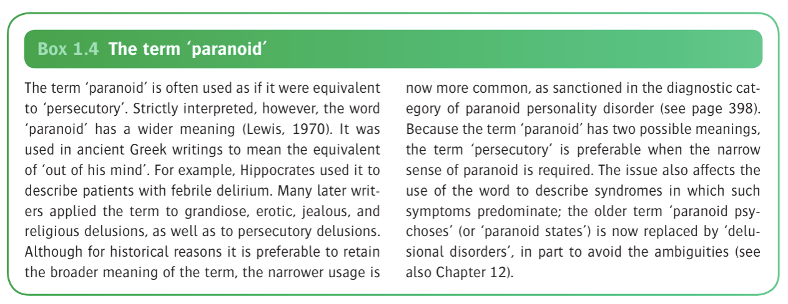
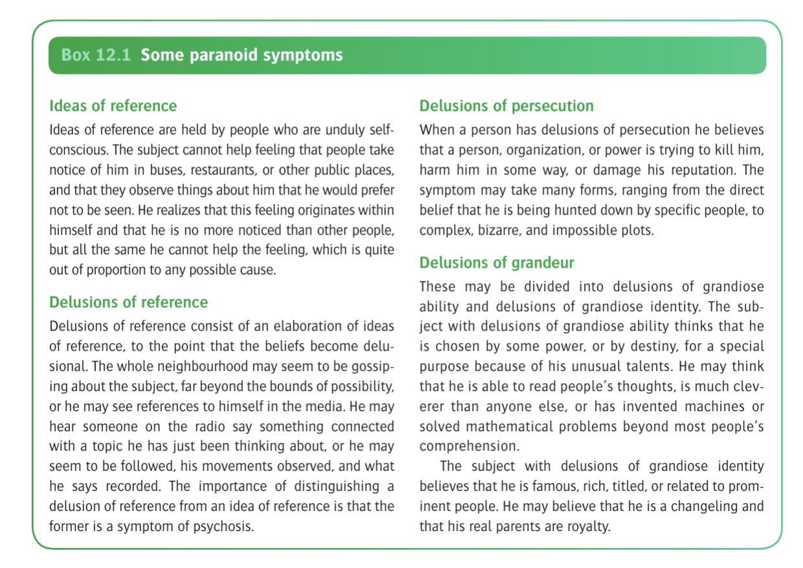
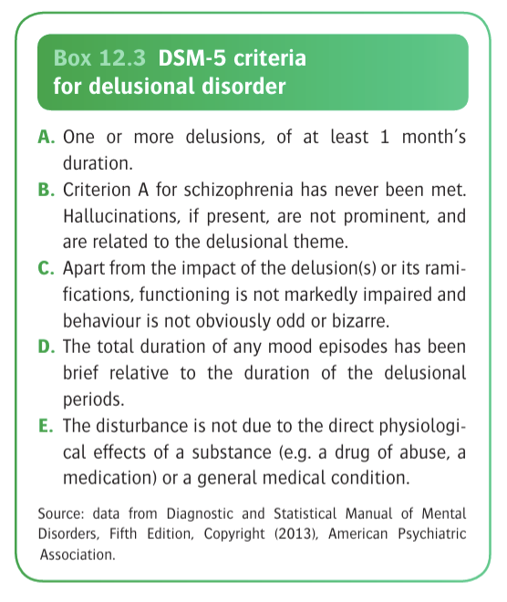
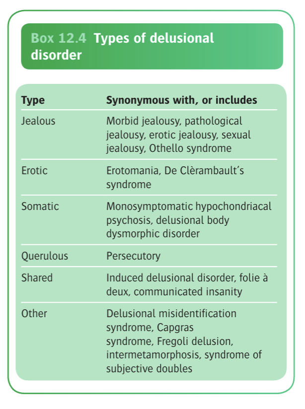
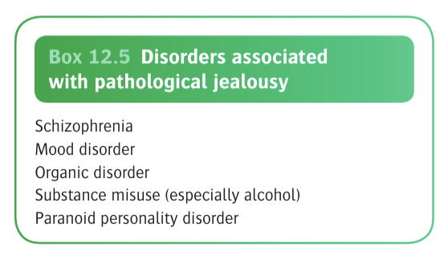

# Ch12 Paranoid Symptoms and Syndromes

- **Definition and terminology** - the term "paranoid" is descriptive and can be applied to symptoms, syndromes, or personality types:
    - <u>Paranoid symptoms</u> (paranoia) - overvalued ideas or delusions that are often persecutory, leading to mistrust towards others, but not always so
    - <u>Paranoid syndromes</u> - disorders in which paranoid delusions form a prominent part of a characteristic constellation of symptoms, such as pathological jealousy or erotomania
    - <u>Paranoid personality disorder</u> - excessive self-reference and undue sensitiveness to real or imaginary humiliations and rebuffs, often combiend with self-importance and combativeness

  
  
- **Classification of paranoid syndromes:**
    - <u>Paranoid symptoms occuring as part of another psychiatric disorder</u> - namely schizophrenia, mood disorder, or an organic mental disorder
    - <u>Paranoid symptoms occuring w/o evidence for an underlying cause</u> - previously termed "paranoid states" or "paranoid psychosis", but now categorised as a delusional disorder, where poorly defined nature has persistent implications on terminology, relationship to schizophrenia, and forensics
- **Paranoia and paraphrenia:**

## Paranoid Symptoms

- **Paranoid symptoms**
    - \_<u>Description of Form</u> - a central, morbid distortion of beliefs and attitudes concerning relationships between self and others
    - <u>Contents</u> - vast majorities are ideas of references or persecutory delusions, although the term is applied to less common delusions of grandiosity, jealousy, erotomania, litigation, or of religious contents (as defined by the Present State Examination): 
    
- **Causes of paranoid symptoms** - main etiological factors related to the etiology of the causative psychiatric illness, but the following describes why some people develop paranoid symptoms while others do not:
    - **Premorbid personality:**
        - Premorbid personalities of paranoid types, especially in patients w/ late-onset paraphrenia, were thought to be causative of paranoid symptoms
        - Freud believes mechanistically involves convoluted processees of defense mechanisms of denial and projection (based on the study of Daniel Schreber), but this configuration was abandoned fairly early on, and never had much clinical support
    - **Social isolation and deafness:**
        - Based on observation that prisoners esp. in solitary confinement and migrants have been considered to be prone to paranoid symptoms and syndromes with social isolation being the common factor
        - Haering impairment is found in 40% of patients w/ late-onset paraphrenia (Kay and Roth 1961), and association demonstrated to be robust, especially in the elderly (David et al 1995)
        - However, one must remember most deaf people do not become paranoid, and that many deaf people are not socially isolated

## Paranoid Personality Disorder

## Paranoid Symptoms in Psychiatric Disorders

- **Causes of paranoid symptoms:**
    - Organic disorders (e.g. dementia and delirium; focal brain pathologies; neurodevelopmental disorders)
    - Substance misuse disorders (esp. amphetamines, cocaine, and alcohol)
    - Mood episodes
    - Paranoid schizophrenia
    - Brief psychotic episodes and schizophreniform-like syndromes
- **Paranoid symptoms in organic brain disorders:**
    - <u>Delirium and dementia</u> - impaired grasp of what is going on may give rise to apprehension, misinterpretation, and so to suspicion, however limited cognited ability results only in transient, disorganised thoughts, leading to distrubed behaviour such as querulousness and aggression
    - <u>Focal brain pathology</u> - tumours, strokes, or trauma rarely gives rise to delusional disorder
    - <u>Neurodevelopmental disorders and learning disabilities</u> - often disorganised
- **Paranoid symptoms in substance misuse disorders:**
    - <u>Stimulants</u> - esp. cocaine, and amphetamines phenomenologically reflects transient psychotic states
    - <u>Alcohol</u> - association between alcohol misuse and morbid jealousy
- **Paranoid symptoms in mood disorders:**
    - <u>Psychotic depression</u> - delusions arise from negative cognition, where the delusional "belittling" of oneself gives rise to delusion of persecution or delusion of harm, but **characteristically beliefs that retribution is justified for their own guilt and wickedness** (cf depressive Sx in delusional disorders are usually bitterly resented)
    - <u>Manic episodes</u> - typically mood congruent, delusion of grandiosity
- **Paranoid symptoms in schizophrenia** - differentiation of the two disorders is of utmost importance although conception of the difference between the two disorders is:
    - Demographic features such as <u>later age of onset</u>, and <u>better premorbid adjustments and overall functioning</u> are more suggestive of delusional disorders rather than paranoid schizophrenia
    - Historically, content of delusions is more "plausible" in delusional disorders, while more "bizzare" or "un-understandable" in schizophrenia
    - In delusional disorders, delusions are systematised and based around a single, internally consistent theme, and is characteristically well-encapsulated such that the mental state appears remarkeably normal; In schizophrenia, delusions are fragmented and multiple
    - Presence of auditory hallcinations is extremely suggestive of schizophrenia (it may rarely be present in delusional disorders but are usually fleeting and congruent w/ the delusions)
    - In fact diagnostic stability of delusional disorders is around 60%, the most common change in diagnosis being schizophrenia

## Delusional Disorders (Paranoid Psychoses)

- **Principles:**
    - Whether psychosis that is not secondary to a morbid condition (e.g. organic, affective, or schizophrenia) have been disputed for many years
    - Various historical terms and themes provide the backdrop to which delusional disorders are classified
- **Definition** - akin to the widely-used term "paranoid psychosis" or "paranoid states", where DSM-5 uses the term delusional disorders to describe a disorder with <u>one or more persistent delusions</u> that is <u>not due to any other disorder</u>
- **Characteristics of delusions in the modern concepts of paranoid psychosis** - their organisation is qualitatively different from that of schizophrenia:
    - Often an insiduous onset in a person in middle or late life
    - Involves a highly stable, systematised system usually revolving around a single, internally consistent theme
    - The delusional system is well encapsulateed, and there is no impairment of other mental functions, and can often continue to work and his social life may be maintained very well
- **5 specific subtypes of delusional disorders and 2 other categories** - based on the <u>content</u> of the delusional system:
    - Persecutory (most important)
    - Jealous
    - Erotomanic
    - Somatic
    - Grandiose
    - Mixed
    - Unspecified (e.g. ICD-10 also defines litigious and self-referential subtypes, as well as delusional dysmorphophobia \[included in OCD in DSM-5\])
- **DSM-5 diagnostic criteria for delusional disorders** - N.B. ICD-10 requires persistence of Sx for 3mo rather than 1mo in DSM-5: 

- **Epidemiology of delusional disorders** - considered an uncommon illness w/ relatively few data:
    - <u>Prevalence</u> - lifetime prevalence of 0.18%
    - <u>Incidence</u> - 1-3 per 100,000/y (1-4% of psychiatric admissions)
    - <u>Demographic</u>:
        - Age - mean age of onset is 46y
- **Etiology of delusional disorders:**
    - <u>Genetics</u> - family studies of delusional disorder showed **asymetric coaggregation** (where delusional disorders are at increased incidence in probands of schizophrenia, while schizophreniform disorders are not at increased incidence in probands of delusional disorder), likely caused by:
        - Difference in incidence rates in general population
        - Difference i diagnostic error rates between probands and relatives
        - High genetic loading for severe illness in those who come to medical attention and are assessed as probands
    - <u>Neurobiological studies</u> - very little studies; elderly w/ delusional disorders have enlarged cerebral ventricles, while younger patients have changes in insula and cingulate cortex

## Specific Delusional Disorders

- **Classification of specific delusion disorders is confusing for certain reasons:**
    - There are many older eponyms that are not included in current classification systems but which remain in common usage
    - Certain behaviours (e.g. stalking and persistent litgation) are often secondary to the predominant delusion in the delusional system
    - Some syndromes can be secondary to other psychiatric disorders (e.g. delusional misidentification)
    - The symptoms are confusing because they have been of particular interest by French psychiatrists
- **Specific delusional disorders** - organised on the basis of the content of the predominant delusion(s): 

### Morbid Jealousy

- **Definition** - also known as Othello syndrome, initial form of delusional disorder, and serves as the archetypal delusional disorder, and carries the greatest risk of dangerousness
- **Epidemiology** - data based on case reports conducted in the late 20th century (Shepherd, Langfeldt, Vauhkonen, Mullen and Maack):
    - <u>Prevalence</u> - unknown, thought to be not uncommon (following persecutory or NOS delusional disorders)
    - <u>Demographic</u> - male preponderance (M:F = 2:1)
    - <u>Burden</u> - individuals are highly dangerous
- **Differentiating between morbid jealousy and "justified" jealousy** - degree of conviction relative to level of evidence and rational arguements:
    - Morbid jealousy is characterised by overvalued idea or delusions, held on inadequate grounds and is affected by rational arguments
    - Extreme jealousy may be "justified" in those w/ evidence (e.g. a man who finds his wife w/ a lover)
    - Both of which are a/w strong emotions, and characteristic behaviour (i.e. equally dangerous) and hence do not serve as the differentiating factor
- **Cliical features of morbid jealousy:**
    - <u>Central theme of delusion</u> - abnormal belief in partner's infidelity, however of interest:
        - The patient almost never has any idea who the supposed lover may be, or what kind of person they may be
        - Despite intensive search of evidence, they almost always avoid taking seps that cound produce unequivocal proof of the partner's loyalty
    - <u>Accompanying abnormal beliefs</u> - delusional system revolves around the central delusion of infidelity, for example:
        - Partner plotting against the patient
        - Partner trying to poison the patient
        - Partner taking away his sexual capacities
        - Partner infecting him w/ venereal disease
    - <u>Associated mood</u> - often variable, which may be of misery, depression, apprehension, or anger
    - <u>Associated behaviour</u>:
        - Preparation of violence and risk of harm (e.g. keeping weapons close should the patient catch the partner and lover in the act)
        - Intensive search of evidence (e.g. searching of diaries, checking phones, examining bed linens, underwear)
        - Hypervigillence and surveillance such as stalking behaviour, hiring a PI, or even mirror systems in home
        - Direct cross-questioning of partner when the most "minute evidence" comes up, resulting in violent quarrelling and paroxysms of rage
        - When partner is goaded into making a false confession, the jealousy characteristically inflames rather than assuaged
- **Disorders associated w/ morbid jealousy** - note strong association w/ alcohol misuse:
    - Schizophrenia (17-44%)
    - Depressive disorders (3-16%)
    - Neurosis and personality disorders (38-57%)
    - Alcohol misuse (5-7%)
    - Organic disorders (6-20%)

  
  
- **Predisposing, precipitating and perpetuating factors:**
    - <u>Premorbid pervasive sense of inadequacy</u> - often a baseline of low self esteem, and a discrepency between ambitions and attainment; usually particularly vulnerable to anything that may threaten this sense of inadequacy (often via projection)
    - <u>Precipitating life events</u>:
        - Recent loss of status
        - Development of sexual dysfunction and sexual difficulties
        - ?Freud on unconscious homosexual urges (clinical studies do not support an association)
- **Risk of violence and risk of suicide:**
    - <u>Violence</u> - homicide, threats to harm or kill partner (25%), violent or threatened supposed rival
    - <u>Suicide</u> - increased particularly when an accused partner finally decides to end the relationship
- **Assessment of morbid jealousy:**
    - Determine the degree of conviction
    - Determine how much resentment the patient feels
    - Determine degree of evidence search and associated behaviour
    - Determine any outbursts towards partner or suspected lover
    - Determine other comorbid psychiatric conditions
    - Assess risk of violence (whether patient has contemplated any vengeful actions)
    - Hx supplemented by partner separately (note how partner responds to outburst, how does patient respond in turn to partners behaviour, any violence or serious injury, relationship and sexual Hx)
- **Mx:**
    - **Principles of Mx:**
        - <u>Tx of comorbid disorders</u> - e.g. schizophrenia, substance abuse or mood disorders
        - <u>Pharmacological therapy</u> - ADs if causing distressing mood symptoms, trial of antipsychotics if delusional in nature (but lacks response)
        - <u>Psychotherapy</u> - individualised, some evidence that cognitive therapy superior to waiting list control groups (Dolan and Bishay 1996)
        - <u>Forced admission and separation</u> - esp. if violent risk is high (warn the partner even if is a breach of confidentiality)
- **Prognosis of pathological jealousy:**
    - Extremely variable likely dependent on nature of underlying psychiatric disoders and patient's premorbid personality
    - Langfeldt (1961) demonstrated that 50% still had persistent morbid jealousy, general clinical impression that the prognosis is poor

### Erotomania and Erotic Delusions

- **Definition** - also known as De Clerambault syndrome, refers to the delusional belief that an exalted person is in love with oneself
- **Causes of erotic delusions:**
    - Erotomania (primary delusional disorder where erotic delusions is the predominant and persistent symptom)
    - Secondary to psychotic disorders esp. paranoid schizophrenia
- **Epidemiology of erotomania:**
    - <u>Prevalence</u> - rare
    - <u>Demographic</u> - almost always described in single F
- **Clinical features of erotic delusions:**
    - <u>Predominant belief</u> - an exalted person, usually inaccessible (married or high status) being in love with one self:
        - Often derives **excitement**, **satisfaction** and **pride** from this delusional belief
        - Believes that it is because the supposed lover is unable to reveal his love for various unexplainable reasons, and has to behave in certain pardoxical/ contradictory ways to hide his love
        - Believes that the supposed lover has indirectly approached the patient to express his love, but is facing difficulties
        - Also believes that the supposed lover will never be truly happy or complete w/o oneself
    - <u>Abnormal behaviours</u>:
        - Stalking (pattern of intrusive behaviours a/w implicit or explicit threats, causing significant distress to the person being stalked)
        - Threats and assaults (e.g. hoax advertisements, orders for servicses, scandalous rumour mongering, damage to victim's properties)
        - Evolution from hope followed by resentment (delusion of love transforms to delusion of persecution and patient becomes abusive and making public complaintsof the supposed lovers)
- **Causes of stalking** - usually a heterogenos group w/ differing underlying psychopathology (Dressling et al 2006):
    - Erotomania or erotic delusions secondary to psychotic disorder
    - Personality disorders (primarily borderline, narcissistic, sociopathic traits)
- **Mx** - unclear as few data (see review article by Seeman \[2016\] for Tx details)

### Soamtic Delusional Disorders

- **Definition** - primary delusional disorder where patient believes that one is suffering from a physical illness, deformaty, or infestation; does not necessarily imply hypochondriasis, but the term encompasses monosymptomatic hypochondriacal psychosis
- **Somatic delusions requires differentiation from other disorders:**
    - Somatic hallucinations and general hypochondriacal disorders from other psychiatric conditions (e.g. schizophrenia, psychotic depresion)
    - Somatic symptoms secondary to substance use (e.g. cocaine abuse)
    - Genuine somatic symptoms that occur secondary to organic disorders
- **Clinical presentation** - often present to relevant medical specialism:
    - Body dysmorphic disorder to plastic surgeons
    - Delusional parasitosis (Morgellons disease) to dermatologists

### Querulant Delusions and Reformist Delusions

- **Querulant delusions:**
    - Kind of delusional individuals that indulge in a series of complaints and cliam lodges against the authority, closely related are paranoid litigants
- **Reformist delusions:**
    - Induldge in delusions of religious, philosophical or political themes, constantly criticizing society and embark on schemes for societal reformation
    - The diagnosis has been used by the Soviet Union in political rather than psychiatric grounds to silence oppositions

### Delusional Misidentification Syndrome

- **Defintion and terminology** - group of delusions that involves the misidentification of the self or others:
    - <u>Capgras syndrome</u> - delusional belief that a closely related person has been replaced by a double
    - <u>Fregoli syndrome</u> - delusional belief that one or more individuals have changed their appearance to resemble familiar people in order to persecute the patient in some way
    - <u>Intermetamorphosis</u> - delusional belief that one or more individuals have been transformed physically and psychologically, into another person or people, or that people have exchagned identities with each other
    - <u>The syndrome of subjective doubles</u> - delusional belief that an individual has transformed into his own self, like a doppleganger
- **Causes** - proposed to be a "face-processing disorder":
    - Other psychotic disorders (esp. schizophrenia)
    - Organic brain disorders
    - Delusional misidentification syndrome (i.e. other persistent delusional disorders)

### Shared (induced) Delusional Disorders

- **Definition and terminology** - a person who is in close relationship with someone who already has an established delusional system develops similar ideas:
    - <u>Folie a deux</u> - when one person is affected by a close person w/ a delusional disorder
    - <u>Folie a plusieurs</u> - when more than two person is affected by similar delusional ideas, which is exceedingly rare (?cults, however "patient zero" usually does not believe the delusions, rather "inducing delusions" for personal gain)
- **Pathogenesis** - 90% cases are members of the same family:
    - Usually the dominant partner first develops a fixed delusion
    - The belief is imparted onto a <u>dependent, suggestible partner</u>, which may or may not be truely delusional
    - Generally the two are in close intimacy and often in <u>isolation from the rest of the world</u>
- **Mx:**
    - <u>Separation</u> - may lead to quasi-delusional state in the recipiment
    - <u>Usual Mx of the primary patient</u> - the original patient is treated in the usal fashion for the specific delusional disorder

## Assessment of Paranoid Symptoms

- See details on assessment of dangerousness in Chapter 18

## Treatment of Paranoid Symptoms and Delusional Disorder

- **Principles of Mx:**
    - <u>Rapport building and establishment of Tx alliance</u> - notorious due to impaired insight, but certain strategies can be applied
    - <u>Pharmacological Tx</u> - antipsychotic drugs are mainstay of Tx but generally lack evidence; SSRI should be considered as first line for body dysmorphia
    - <u>Psychological Tx</u> - cognitive therapy is worth trying assuming good rapport
- **Establishment of rapport and Tx alliance:**
    - Impaired insight as most typically regard their delusional beliefs as justified and therefore does not require Tx
    - May become especially suspicious and distrustful, and may not disclose symptoms fully
    - Ocassionally Tx may be accepted by offering help to non-specific symptoms such as anxiety or insomnia, or by pointing out the harmful consequences of the beliefs
    - Voluntary admission or detention for inpatient care may be required if risk of violence to others or suicide
- **Pharmacological Tx** - antipsychotics:
    - Generally a high potency, non-sedating antipsychotic (e.g. risperidone) started at low dose (often w/ immediate Sx improvement over days)
    - Pimozide was advocated as antipsychotic of choice for somatic delusional disorders and morbid jealousy but cardiotoxocity must be taken into account of

## Prognosis of Delusional Disorder

- **Prognosis** - no reliable data:
    - <u>Remission</u> - generally poor (only 50% of those who are compliant on medications improve), most will be on antipsychotic for life
    - <u>Overall functioning</u> - generally well (esp. compared w/ schizophrenia)
