# Ch14 Dementia, Delirium, and other Neuropsychiatric Disorders

## Introduction

- **Neuropsychiatry** - used interchangeably w/ organic psychiatry (David 2009):
    - Deals with psychiatric disorders that arises from demnonstrable abnormalities of brain structure and function
    - Cognitive impairment is the most prominent feature, but behavioural and emotional disturbances are also common and should be evaluated, and may be the sole manifestations
    - Although a biological basis, there is risk that psychological and social factors play a role in management of such patients

## Classification

- **Classification of organic mental disorders in ICD-10 and DSM-5:** 
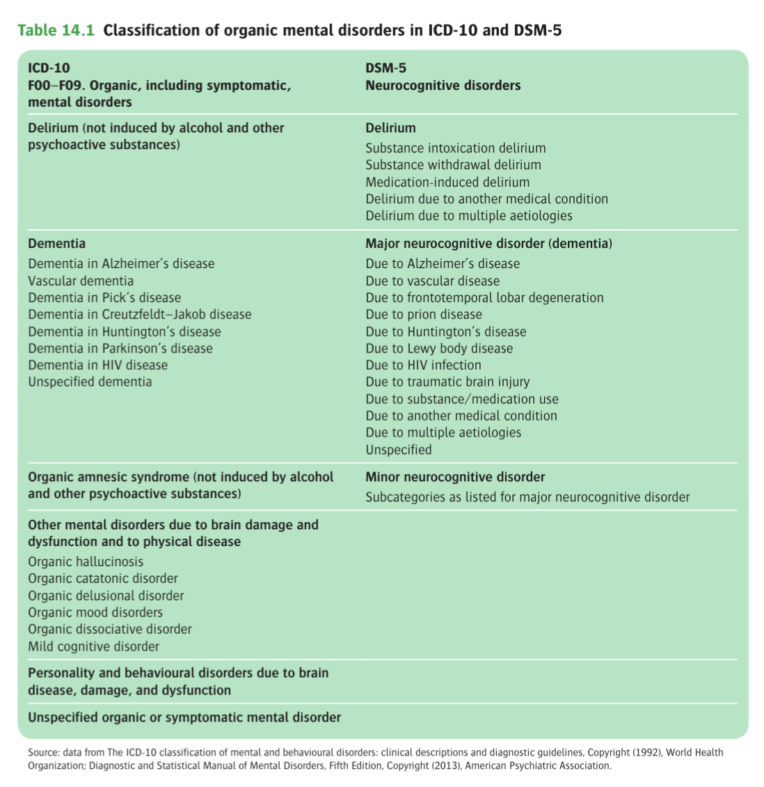
- **DSM-5 conventions:**
    - Neurocognition in DSM-5 divided into 6 domains: complex attention, executive function, learning and memory, language, percetual motor, and social cognition
    - New category of neurocognitive disorders, divided into major and minor forms
    - Major neurocognitive disorders subsumes conventionally distinct categories of dementia and amnestic disorders, but dementia is still used descriptively
    - Minor neurocognitive disorders probably reflect similar pathology but cases show lesser degree of cognitive and functional impairment
- **ICD-10 contentions:**
    - Subcategories for mental disorders due to brain damage, dysfunction, and physical disease, and for personality and behavioural disorders that are due to brain disease, damage and dysfunction (DSM-5 such conditions are classified separately under the relevant psychiatric disorder)

## Symptoms associated with Regional Brain Pathology

## Assessment of the 'Neuropsychiatric Patient'

## Dilirium

## Amnesia and Amnesic Disorders

## Dementia

- **Definition** - an acquired global cognitive impairment, involving intellect, memory, and personality, without impairment of consciousness (Burns and Illiffe 2009), usually, but not always progressive
- **Etiology** - the most common being 1) Alzheimer's disease, and 2) Cerebrovascular dementia and Lewy Body dementia: 
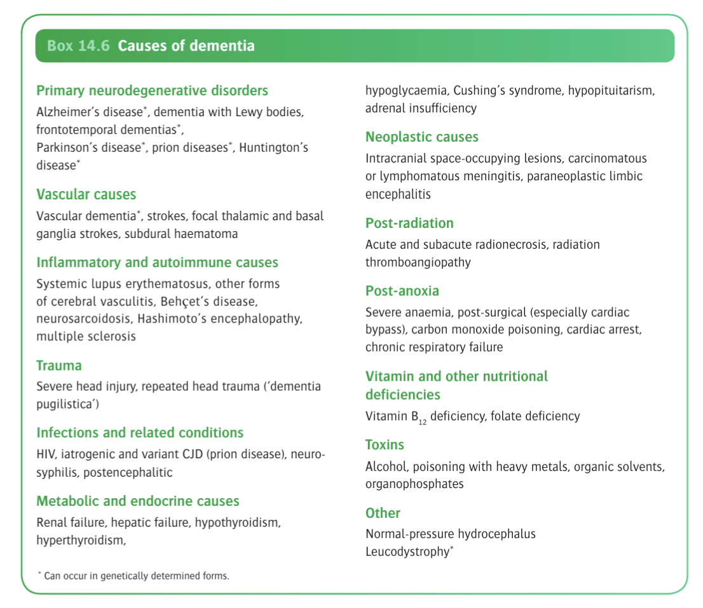
- **Natural Hx of dementia syndromes:**
    - Although by definition involves a global or generalised disorder (i.e. \>=2/6 cognitive functions impaired), it often begins with focal cognitive or behavioural disturbances, with limited functional impairments
    - Hence, a diagnosis of mild cognitive impairment (ICD-10), or minor neurocognitive disorder (DSM-5) should be given
- **Clinical presentation of dementia:**
    - Objective demonstration of poor memory (most common)
    - Disturbances in behaviour, language, or personality
    - Psychiatric manifestations such as disturbances of mood and perception
- **Clinical features of dementia** - picture much determined by 1) underlying cause, and 2) premorbid personality and functioning:
    - **Difficulties with memory** - forgetfulness is usually early and prominent, but difficult to detect in early stages:
        - <u>Contents of memory loss</u> - usually more evident for recent, than for remote features
        - <u>Forms of memory loss</u> - episodic memory affected more while procedural memory is generally preserved:
            - Episodic memory - forgetfulness of day-to-day events (?forgetting to turn off stove) usually apparent for trivial tasks, but may be subtle
            - Procedural memory - long-term implicit memory responsible for performing learned skills without much conscious effort, as well as general knowledge of the world at large is usually preserved initially
            - Semantic memory - memory of meaning of words, and of the object one is referring to usually occurs late, as in certain frontotemporal dementia
    - **Difficulties with attention and concentration** - common feature but non-specific
    - **Difficulties in learaning** - usually present but is a very conspicuous feature
    - **Inflexibility and poor adaptability to new or unfamiliar situations:**
        - <u>Organic orderliness</u> - appearance of rigid and stereotyped routines
        - <u>Catastrophic reactions</u> - sudden explosions of rage or grief **when taxed beyong restricted capabilities**
    - **Disorientation** - initially for time, but later for place and person
    - **Behavioural, affective, and psychotic features** (BPSD) - often accompanying the cognitive deficits, appear to be part of the underlying underlying biology but also a psychological response to realisation of declining cognition esp. when insight is preserved:
        - <u>Affective deficits</u>:
            - Mood disturbances particularly common w/ distress, anxiety, irritability, and depression
            - Restricted affect w/ sudden emotional outbursts and mood swings occur in late stageso
        - <u>Psychotic features</u>:
            - Overvalued ideas or delusions, usually of persecutory kind gains ground easily
            - Other pscyhotic symptoms such as hallucinations may be a common and fluctuating features of dementia
        - <u>Behavioural features</u>:
            - Reactive aggression on the basis of affective and psychotic influence
            - Aimless wandering may be a behavioural change that is often seen
            - Features of catatonia such as stereotypy, mannerisms, and mutism seen in extremely late stages
- **Differentiating features between major causes of dementia:** 
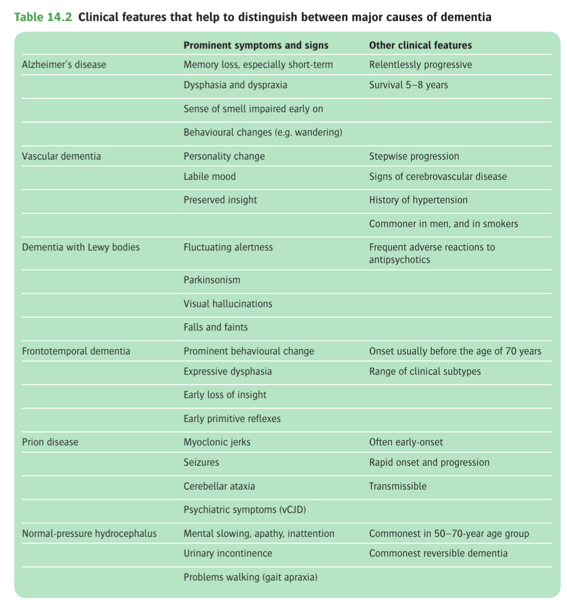
- **Subcortical and cortical dementia** - classified based on putative neuroanatomical basis, but distinction is blurred clinically:
    - <u>Subcortical dementia</u> - a difficult in coordination resulting in slowing in execution and speech, and emotional expression:
        - Syndrome of slowness of thought, difficulty w/ complex sequential intellectual tasks, and impoverishment of affect and personality
        - Relative preservation of learning, language, and calculation
    - <u>Cortical dementia</u> - spectrum of dysfunctions particularly in perceptual-motor, language, and memory

  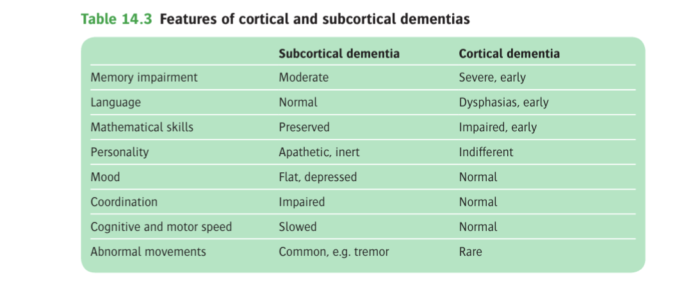 
  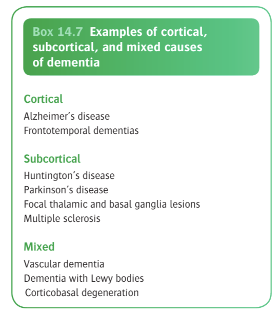
- **Presenile and senile dementia** - cutoff of 65y, clinically significant because <u>most common causes differ</u>:
    - <u>Presenile dementia</u> (early-onset dementia; \< 65y) - Alzheimers disease is most common, while fronto-temporal dementia, prion diseases are more common, while vascular cause is rarer
    - <u>Senile dementia</u> (late-onset dementia; \> 65y) - once thought that vascular dementia is the most common, but Alzheimer's disease subsequently is also common

### Assessment of Dementia

- **Approach to assessment of dementia:**
    - Early detection of dementia
    - Consider differential diagnoses of cognitive impairment, such as delirium, amnesia, mild cognitive impairment and depression
    - Assessment of severity and clinical profile
    - Assessment of its cause, and identification of potentially reversible components
    - Assessment of risk in dementia
- **Assessment of the severity and clinical profile:**
    - <u>Screening tests</u> - applied for assessing multiple domains of cognition, behavioural symptoms, global functioning and activities of daily living, and depression: 
    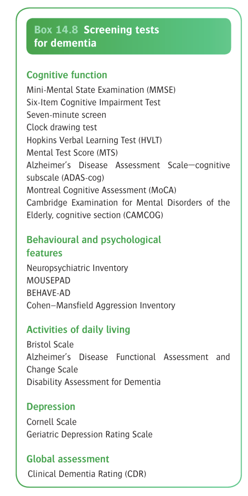
    - <u>Clinical assessment of behavioural and psychiatric symptoms</u>:
        - Integral part of assessment as are common, poses stress to carers, and often part of risks
        - Should be repeated during the illness, as often fluctuating in nature
- **Assessment of the cause of dementia:**
    - <u>Initial probabilistic diagnosis by clinical profiles</u> - made by experienced clinician on the basis of differing profiles of varioous dementias w/ reasonable accuracy
    - <u>Ix</u>:
        - biochemical, radiological, and genetic investigations modestly improve diagnostic dementia
        - Main role is for diagnosis of 1) **rarer**, and 2) **reversible causes**
        - Evolving biomarkers such as **serum beta-amyloids**, **CSF proteins**, and **PET imaging** utilised in differential diagnosis of dementia

    
    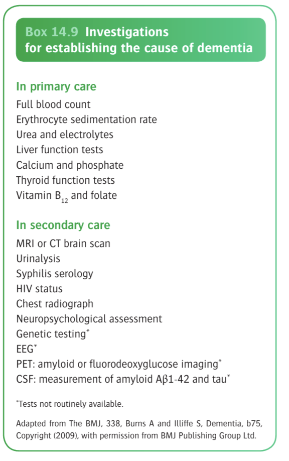
- **Assessment of risk in dementia:**
    - <u>Major risks in dementia</u>:
        - Self-neglect (esp. in poor physical health)
        - Poor judgement, including wandering
        - Abuse
        - Violence (due to agitation or disinhibited behaviour)
    - <u>Approach to assessment</u> - liase w/ OT:
        - Assessment of functional ability including ADLs and IADLs
        - Specific considerations including driving (subjected to annual review)
- **Presymptomatic diagnosis and biomarkers** - i.e. <u>at-risk for Alzheimers disease</u>, may be detected premorbidly, long before overt symptoms of any kind (including MCI) are present (Jack et al 2013):
    - Olfactory deficit as a simple and valuable biomarker (Devenand et al 2015)
    - CSF biomarkers (e.g. amyloid A-beta-1-42, tau)
    - PET imaging biomarkers (e.g. amyloid or FDG imaging)
    - Neuroimaging (CT/ MRI for hippocampal atrophy)

  
  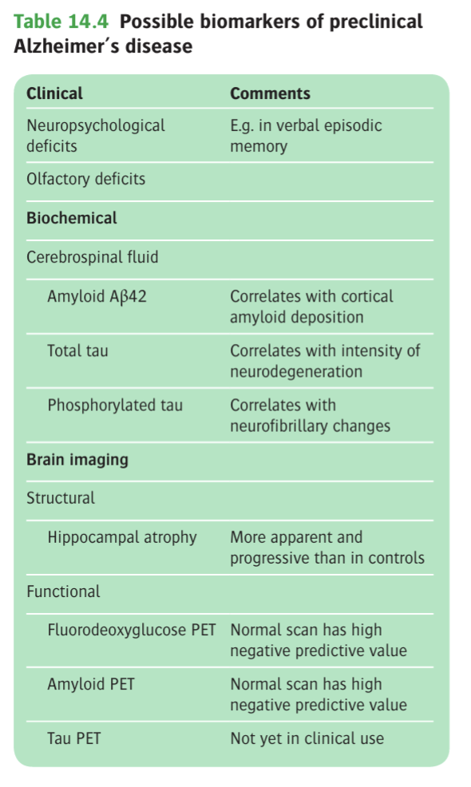

### Alzheimer's Disease

- **Definition** - a distinct neurodegenerative disorder constituting a unique neuropathological entity, being the most common cause of dementia
- **Epidemiology** - most common cause of presenile and senile dementia:
    - <u>Pravelence</u> - affects 5-7% of \>= 60y
- **Clinical features of dementia of Alzheimer's type** - minor forgetfulness as the initial presenting feature, followed by increasing memory disturbances and lack of spontaneity:
    - **Global cognitive impairment** - primarily difficulties w/ 1) memory, 2) language, and 3) visuospatial skills:
        - **Disturbances of memory:**
            - Minor forgetfulness often mistakened as a normal ageing process, progressing over the initial 2-4y
            - Memory is lost for recent events first
        - **Disturbances of language** - usually affected early on:
            - Difficulty in finding words or naming objects (Dysphasia)
            - Impairments in the ability to construct fluent and informative sentences
        - **Perceptual-motor disturbances** (e.g. visuospatial skills):
            - Finding difficulties such as copying pictures on cognitive assessments
            - Practically affects difficulties in <u>making way around unfamiliar environments</u>
    - **Depression** - relationship complex, where depression can be a risk factor, differential diagnosis or a component of Alzheimer's disease:
        - Major depressive episodes occur in 10% of the case
        - Depressive symptoms not to the severity of a MDE occurs in up to 50% of cases
    - **Psychotic symptoms** - delusions and hallucinations occur in a significant minority of patients at some stages of illness (although studies on prevalence do not differentiate between AD and LBD):
        - <u>Delusions</u> (10-50%) - usually are (persecutory\*, esp. concerning theft, **originating from the forgetfulness of the patients** (hence unsure of whether to define as true delusions)
        - <u>Hallucinations</u> (10-25%) -
    - **Changes in behaviour** - often common, and are particularly concerning to carers:
        - **Changes in sleep-wake cycle** - progressive disorganisation of sleep-wake cycle:
            - <u>Disorientation at night</u> - patient appears restless, disoriented and perplexed and may wake at night
            - <u>Sundowning</u> - phenomenon where motor activity may increase in the evenint
        - **Agression** - physical and verbal agression common, often taking form of <u>resistance to help with personal care</u>, although unprovoked violence to others are rare
        - **Changes in activity level** - increases and decreases of daily activity level and self care which involves <u>varying degrees of purposefulness</u>:
            - <u>Wandering</u> - can be variety of different activities putting themselves at risk by going to unsafe environments
            - <u>Changes in eating</u> - undereat or overeat in the absence of carer support, resulting in weight changes and nutritional states
            - <u>Changes in sexual behaviour</u> - usually loss of libido, although sexual disinhibition ocassionally occurs
            - <u>Self care</u> - usually decline in self care progressively from IADLs to basic ADLs
            - <u>Social behaviour</u> - often ersults in decreased social behaviours, but social facade can be maintained if carer able to assist w/ these functions
- **Clinical course of Alzheimer's disease** - relentlessly progressive over 5-8y:
    - <u>Early stage</u> - memory impairments is the most common presenting features but are heavily **modified by premorbid personality and functioning** (traits tend to be exagerated)
    - <u>Middle and lager stages</u>:
        - Global cognitive impairments more prominent
        - Presentation w/ more behavioural and psychiatric manifestations
        - Incidental physical illness may cause superimposed deterioration
- **Prognosis:**
    - <u>Survival</u> - median suvival from Dx is 5-7y
    - <u>Poor prognostic factors</u>:
        - Male
        - Older age of onset
        - Rapid rate of cognitive decline
- **Genetic testing for Alzheimer's disease** - indicated for familial early-onset Alzheimer's disease for ApoE gene and APP genes:
- **Neuropathology of Alzheimer's disease:**
    - <u>Gross pathology</u>:
        - Grossly shrunken brain w/ widened sulci (wulcal effacements) that is proportional to enlarged ventricles
        - Total brain weight is reduced
    - <u>Histopathology</u>:
        - **Diagnostic features** - 1) neurofibrillary tangles and 2) amyloid plaques, histopathological Dx based on abundance and distribution (CREAD criteria)
        - **Other non-diagnostic features:**
            - Gliosis, loss of neurons in hippocampus and enterohinal cortex, loss of synapses (most correlate w/ cognitive impairment)
            - Cerebral amyloid angiopathy
            - Hirano bodies (intracellular crystaliline deposits)
            - Granulovacuolar accumulations (vacuoles within neurons)
    - <u>Progression of neuropathology</u> - neuropathological processes occur long before the onset of symptomatology and are the basis of predictive biomarkers:
        - Disease **begins in the entorhinal cortex** (interface between medial temporal lobe and neocortex), and spreads to 1) hippocampus, 2) associated areas of the parietal lobe, and 3) subcortical nuclei and 4) cortico-cortical projections (effective disconnection between affected areas)
        - Braak stages include 6 stages based on beta-amyloid deposition, and correlates w/ clinical severity
    - <u>Amylod plaques</u> - extracellular deposits of misfolded amyloid-beta proteins (central to genetic etiology), w/ denegrating neutrites and glia:
        - **Neuritic plaques** - dense-staining core on silver stain, pathologically more significant
        - **Diffuse plaques** - liken to cotton wool, pathologically less significant
    - <u>Neurofibrillary tangles</u> - intracellular aggregates of hyperphosphorylated tau in pyramidal cells of cortex and hippocampus:
        - Tau normally functions in **axonal transport**, and **maintenance to neuronal cytoskeletion**
        - Hyperphosphorlyated tau is insoluble, resulting in **neuronal dysfunction**, and **neuronal cell death**
- **Etiology and pathogenesis of Alzheimer's disease:** 
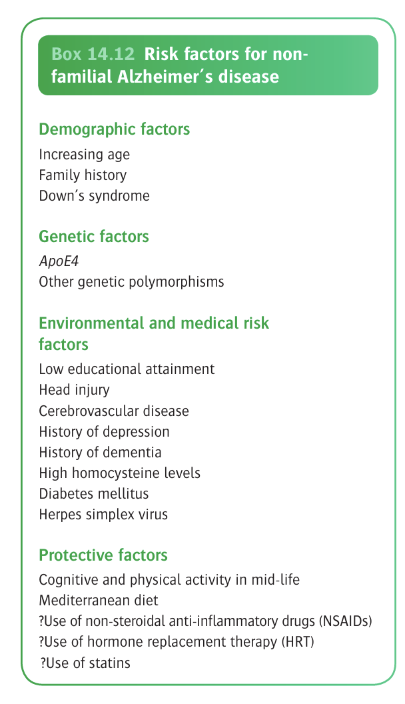
    - **Genetics** (Gotate 2015):
        - **Causative mutations** - Amyloid precursor protein (APP on Ch21), Presenilin 1 (PSEN1, Ch14), and Presenilin 2 (PSEN2, Ch1) accounts for most familial disorders (autosomal dominant pattern): 
        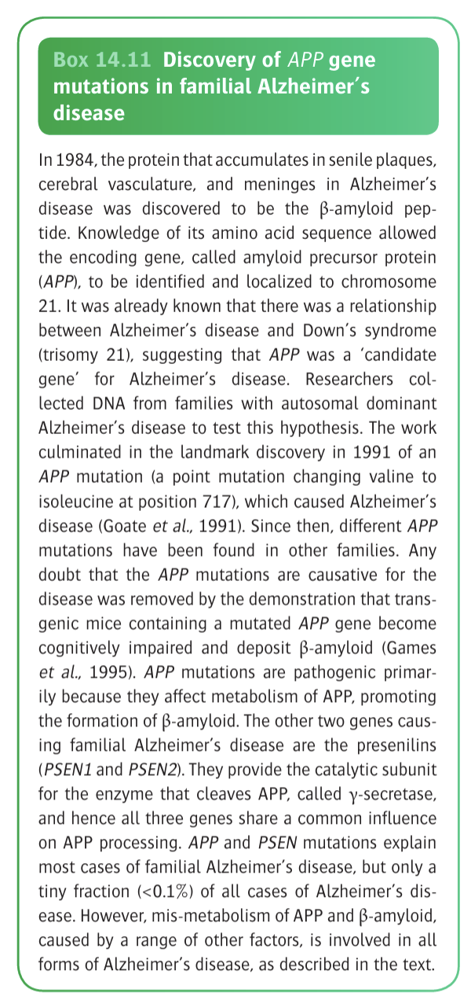
        - **Apolipoprotein E gene** (Caselli et al 2009) - polymorphism in ApoE gene (ApoE4 is pathognomic as compared to the normal ApoE3 variant) accounts for sporadic and familial cases of Alzheimer's disease:
            - ApoE4 variant accounts for <u>50% of vulnerability</u> for late-onset AD
            - ApoE4 heterozygotes have 3x risk while homozygotes have 8x lifetime risk of AD, but to note that <u>most ApoE4 homozygotes do not develop the disease</u>
            - May be a/w different forms of neuropathology than ApoE4-negative cases
            - Postulated interactions between cholesterol metabolism and beta-amyloid metabolism and clearance
    - **Environmental factors:**
        - <u>Medical comorbidities and vascular health</u> - e.g. DM, indices of vascular health present at or before middle age predicts onset of dementia esp. AD
        - <u>Cognitive reserve</u> - 'use it or lose it' hypothesis:
            - Higher educational level and cognitive activity protective against AD
            - Mental inactivity predicts dementia and AD
        - <u>Drugs</u> - use of NSAIDs, statins, and HRTs have a decreased rate of dementia and AD, w/ plausible biological mechanisms, but prospective trials unable to demonstrate efficacy
    - **The amyloid cascade hypothesis** (Hardy and Higgens 1992):
        - **Increased formation and deposition of beta-amyloid** - particularly the 42-a.a. variant, which is insoluble and directly neurotoxic:
            - <u>Normal processing of amyloid proteins</u> - expression of APP as transmembrane protein, where normal alpha-secretase activity predominates over beta/gamma-secretase activity, **preventing beta-amyloid formation**
            - <u>Increased beta-/ gamma-secretase activity</u> - increased processing to beta-amyloids
        - **Decreased removal of beta-amyloids** - also contributes to the disease
        - **Limitations:**
            - PET studies reveal that cognitively healthy elderly individuals also have high amyloid deposition
            - Recent controversies w/ the "amyloid mafia"
            - Current synthesis believes beta-amyloid is not the central pathogenic mechanism, but a component of a more complex, non-linear process, possibly w/ tau (Jack et al 2013)
    - **Inflammatory mechanisms** - microglial activiation:
        - Initially thought to be a response to the ongoing neurodegenerative process
        - Now thought to be important part of disease process itself (e.g. TREM2, a risk gene is a microglial receptors for beta-amyloid clearance \[Heppner et al 2015)
    - **The cholinergic hypothesis** - historical view in the 1970s, able to explain Sx, but not the central cause

### Vascular Dementia

- **Definition** - previously termed "atherosclerotic psychosis", refers to dementia caused by cerebrovascular diseases, most commonly caused by small-vessel disease of the subcortical regions
- **Epidemiology** - often said to be the 2nd commonest cause after Alzheimer's disease, and of comparable prevalence w/ dementia with lewy bodies:
    - Prevalence thought to be common although high heterogeneity in literature due to absence of an accepted neuropathological criteria
    - Often co-existence with Alzheimer-type pathology, hence relative contributions to cognitive impairment not truely known (O' Brien and Thomas 2015 suggests that pure CVD is rare)
- **Subtypes of vascular dementia:** 
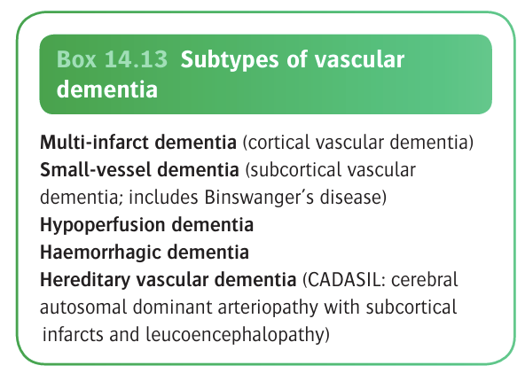
- **Neuropathological findings of vascular dementia** - variable:
    - Small vessel atherosclerotic disease of the subcortical region (most common)
    - Embolus
    - Vasculitis
    - Angiopathy
    - Haemorrhage
    - Infarcts
- **Clinical features of vascular dementia** - emotional and personality changes appear first, followed by impairments of memory and intellect that characteristicall occurs in stages:
    - **Emotional and personality changes** - usually occur first:
        - <u>Depression</u> - often frequent, may be confounded by post-stroke depression
        - <u>Emotional lability</u> - often episodic, characteristically occurs at night
        - <u>Apathy</u> - restricted affect more common than in Alzheimer's disease
        - <u>Anxiety</u> - more common than in Alzheimer's disease
        - <u>Behavioural retardation</u> - more common than in Alzheimer's disease
    - **Cognitive impairment** - variable:
        - Attention, information processing speed, and executive function are more likely affected (subcortical dementia)
        - Memory impairments is much more variable
    - **Insight** - usually preserved until late stage
- **Clinical course of vascular dementia** - classically "<u>step-wise progression</u>":
    - Onset usually in late 60s or 70s, and may follow an acute stroke (post-stroke dementia)
    - Periods of deterioration (?possibly a/w TIAs or mild strokes) that are sometimes followed by periods of partial recovery for a few months
    - Mortality higher than Alzheimer's disease due to underlying atherosclerotic risk: 50% die from ischaemic heart disease or other strokes
- **Signs:**
    - <u>Vital signs</u> - high BP
    - <u>Signs of target organ damage</u> - e.g. hypertensive retinopathy
    - <u>Neurological examiantion</u> - focal neurological signs (e.g. UMN signs, pseudobulbar palsy)
- **Ix** - CT/ MRI for infarcts
- **Etiology** - vascular causes of neuronal dysfunction and cell death:
    - <u>Risk factors for vascular dementia</u> - in fact general atherosclerotic risk factors a/w both CVD and AD, explaining co-occurence of disorders and the concept of "mixed-dementia": 
    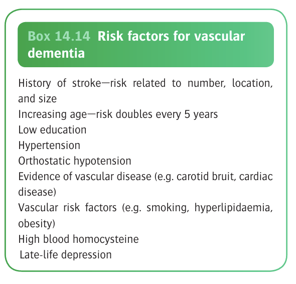
    - <u>Genetic risk factors</u>:
        - CADASIL (Notch gene)
        - ApoE and MTHFR (homocysteine metabolism) implicated

### Dementia with Lewy Bodies

- **Definition** - a recently recognised dementia w/ relatively distinct neuropathology and clinical course
- **Terminology:** 
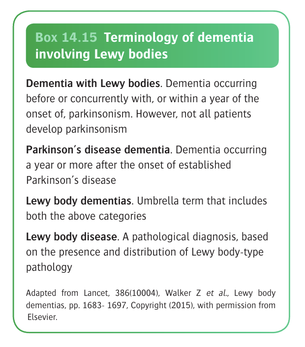
- **Clinical features of Dementia with Lewy Bodies** - characterised by 1) flucuating levels of dementia w/ recurrent delirium like states, 2) parkisonism, and 3) visual hallucinations:
    - **Global cognitive impairments:**
        - <u>Domains of cognition primarily affected</u> - attention, and visuospatial ability
        - <u>Flutuations of cognitive function</u> - pronounced fluctuations in cognnition and attention, w/ recurrent delirium-like states
    - **Visual hallucinations** - recurrent, usually well-formed and detailed
    - **Parkinsonism** - differential diagnosis of parkinsonism, although the motor features are not always present
- **Clinical criteria for Dementia with Lewy Bodies** (McKeith et al 2017): 
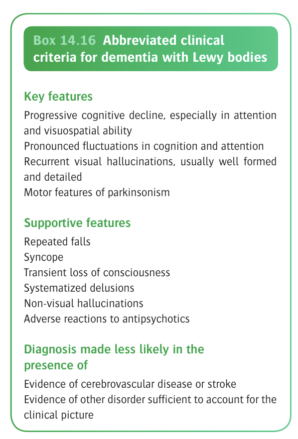
- **Neuropathology:**
    - **Gross pathology** - brain atrophy less marked than AD, especially in terms of hippocampal volume
    - **Histopathology:**
        - <u>Lewy bodies</u> - intraneuronal inclusions mainly composed of alpha-synuclein (and other proteins like ubiquitin):
            - Presence in the cerebral cortex
            - Presence in the substantial niagra suggests Parkinson's disease dementia
        - <u>Lewy neurites</u> - supportive features of axonal/ dendritic aggregates of alpha-synuclein
        - <u>Overlapping features w/ Alzheimer's disease</u> - amyloid plaques in the cortex w/ widespread reduction choline acetyltransferase activity; neurofibrillary tangles are rare
- **Etiology** - closely related to Parkinson's disease, where both are considered "<u>alpha-synucleinopathies</u>":
    - Familial aggregation for dementia with Lewy Bodies w/ some genes implicated
    - Neither genetic nor environmental factors wel established

### Fronto-temporal Dementia

### Pick's Disease

### Prion Diseases

### Other Dementias

### Emerging Concepts of Dementia

## Movement Disorders

## Cerebrovascular Disorders

## Head Injury

## Epilepsy

## Intracranial Infections

## Brain Tumours

## Other Neuropsychiatric Syndromes

## Secondary or Symptomatic Neuropsychiatric Syndromes
