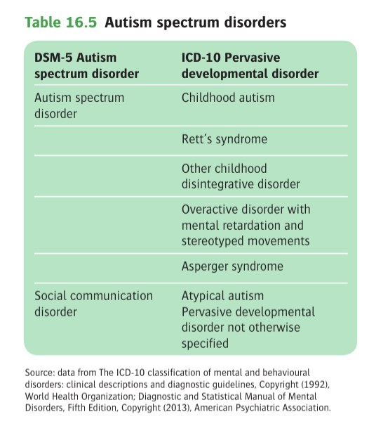
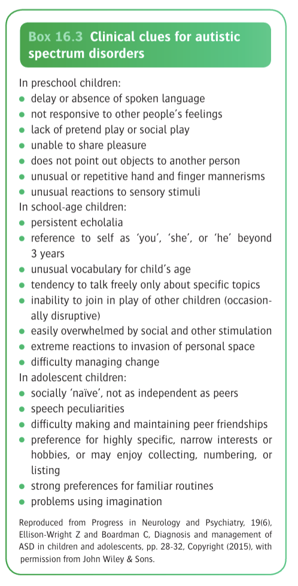

# Ch16 Child Psychiatry

## Introduction

## Normal Development

## Classification of Psychiatric Disorders in Children and Adolescents

## Epidemiology

## Etiology

## Psychiatric Assessment of Children and their Families

## Physical Examination

## Psychiatric Treatment for Children and Their Families

## Review of Syndromes

### Problems of Preschool Children and Their Families

### Specific Developmental Disorders

### Specific Learning Disorders

1.  Autism Spectrum Disorder

    - **Definition** - a group of neurodevelopmental disorders characterised by 1) abnormalities in communication and social interactions, and 2) restricted repetitive activities and interests (RRBs)
    - **Clinical course of autisim spectrum disorders:**
      - Abnormalities occur in wide range of situations
      - Development is abnormal from infancy, and most cases manifested before the age of 5y
    - **Classification conventions** - ICD-10 conventions defines 6 unique conditions under this rubric, while DSM-5 uses a single diagnosis reflecting a spectrum of disorders: 
    
    - **ASD is characterised by** (first described by Kanner \[1943\]):
		- 1\) Deficits in social communication and social interaction
		- 2\) Restricted repetitive behaviours, interests, and activities (RRBs)
	- **Clinical clues for ASD** - variable by age: 
	    
	    
    - **Clinical features of ASD:**
		- **Abnormalities of social development** - difficulties with emotional processing and in forming relationships:
			- <u>Poor response to emotional expression</u> - e.g. not responding to affectionate behaviour from parents (e.g. smiling, cuddling), and rather dislike being picked up or kissed, sometimes no more responsive to parents than to strangers
			- <u>Autistic aloneless</u> - inability to form warm emotional relationships, irrespective of wishes to form relationships w/ others
		- **Abnormalities w/ communication** - verbal and non-verbal communication:
			- <u>Delayed language development</u> - speech may develop late or never appear, occasionally it develops normally but dissapears in part or completely (the latter reflects cognitive defect)
			- <u>Persistence of abnormal speech</u> - although can be trained to pick up certain useful phrases, but speech may remain repetitive, and monotomous:
				- Pedantic - speech focused on minute, unimportant details
				- Echolalia - inappropriate repeating of words spoken by other people
				- Idiosyncratic - speech percularities, use of words that may not be appropriate under the social context
			- <u>Gaze avoidance</u> - i.e. the absence of eye contact
			- <u>Defects of non-verbal communication and play</u> - difficulties in engaging in:
				- Imitation or pretend play
				- Social play
				- Inappropriate way of playing toys
				- Imagination or creative play
		- **Restricted repetitive behaviours, interests and activities** (RRBs) - often described as an <u>obsessive desire for sameness</u>:
			- <u>Odd motor behaviours or mannerisms</u> - whirling round and round, twiddling their fingers repeatedly, flapping their hands, or rocking (however some do not differ in motor behaviours from normal children)
			- <u>Restricted interests</u> - stereotypically spinning toys, trains or buses, dinosaurs
			- <u>Rituals and sameness in activities</u> - distress may be provoked when there is a change in environment:
				- Insting on eating the same food repeatedly
				- Wearing the same clothes
				- Taking the same path to school
				- Engaing in repetitive games
		- **Intelligence levels:**
			- <u>Cognitive difficulties</u> - very common w/ some form of MR in 25-50% individuals w/ ASD, most common pattern w/ poor language and social comprehension (N.B. High-functioning ASD/ Aspergers a reversed pattern observed)
			- <u>Relative strengths</u>:
				- Spinter skills, particularly in visuospatial memory
				- Exceptional, albeit restricted powers in memory or mathematical skills
		- **Other features:**
	        - <u>Hypersensitivity</u> - sensitive to loud noises or flashing lights
	        - <u>Defects in attention</u> - overactive and distractable
	        - <u>Mood disturbances</u> - anger or fear for no apparent reason
	        - <u>Seizures</u> - 25% develop seizures usually at time of adolescence
    - **Epidemiology:**
		- <u>Prevalence</u> - ~ 1% in high-income countries, and lower in low- and middle-income countries
		- <u>Sex</u> - male preponderance (M:F = 5-6:1)
		- <u>Comorbid conditions</u>:
			- ADHD
			- Down syndrome
			- Fragile X syndrome
			- Intellectual disability (31% MR, 23% Borderline intelligence)
    - **Risk factors and etiology:**
		- **Genetics** - heritability of ASD estimated ~90%, but with a complex genetic architecture:
			- _Family studies_ - 25x higher risk in siblings of affected children than in general population
			- _Associated genetic mechanisms_ - various mechanisms:
				
				![[Pasted image 20260408143100.png]]
		- **Environmental risk factors:**
			- _Abnormal gene expression_:
				- Underexpression of module of genes related to synaptic function and neuronal projections
				- Overexpression of immune genes and glial markers
			- _Drugs and toxins_:
				- Prenatal exposure to valproate - in the first trimester of pregnancy, a/w 8x risk of ASD
				- SSRI - suggested modestly increase in risk of ASD, but data are weak
				- Other exposures to toxins - e.g. pesticides
		- **Socioeconomic status** - may not cause ASD:
			- _Obstetrics complications_ - often included although it is not clear whther these are true risk factors or represent an outcome a/w a primary abnormality in the feotus
			- Migration around time of pregnancy - increase risk of low-functioning autism
			- Maternal and paternal age - paternal age perhaps more significant role, may be related to higher burden of point mutations, gene imprinting effects, genetic changes in sperm cells, de novo CNVs or epigenetic influences
    - **Cognitive and emotional processes:**
		- **Weak theory of mind** - lack of appreciation of what others thinks, knows, or expects
		- **Executive dysfunction** - poor in planning and organisation, resulting in:
			- Perserveration and poor self-regulation
			- Impaired ability to abstract high-level meaning from diverse sources
		- **Weak central coherence** (WCC) - local processing bias explaining enhanced performance of children w/ autisim on some neurocognitive tasks and could explain the islet of ability commonly observed in individuals w/ ASD
	- **DDx of ASD:**
		- <u>Neurodevelopmental disorders</u> - e.g. specific learning disorders, language disorders
		- <u>Communication disorders</u> - usually responds normally to people and has good non-verbal communcation
		- <u>Intellectual disability</u> - response are more 'normal' than those of child w/ ASD, i.e. child w/ ASD has more impairment of language relative to other skills than is found in an intellectually disabled child of the same age
		- <u>Mental and behavioural disorders</u> - similar DDx as the comorbid ADHD
		- <u>Developmental regression</u> - e.g. Rett syndrome
		- <u>Deafness</u> - excluded by appropriate tests of hearing
	- **Psychiatric comorbidities:**
		- ADHD
		- Depression
		- Anxiety
		- Conduct disorder/ challenging behaviours
	- **Prognosis:**
	- **Assessment** - usually complete assessment does not consider a single diagnosis of autism, but ASD-significant Hx includes:
		- Cognitive level, langauge ability
		- Communication skills, social skills, and play
		- Repetitive or otherwise abnormal behaviour
		- ASD-specific developmental history
		- Associated medical conditions (e.g. comorbid epilepsy)
		- Psychosocial factors (needs of family)
		- ASD observational assessments
		- Standard individual assessments
	- **ASD assessment instruments:**
		- Autism Diagnostic Observation Schedule (ADOS)
		- Diagnostic Interview for Social and Communication Disorder (DISCO)
		- Development, Dimensional and Diagnostic Interviews (3di)
		- Child Autism Rating Scale (CARS)
	- **Mx:**
		- **Principles of Mx** - individualised the approach by specific strengths, and difficulties of the child, which also manages the changing developmental needs

2.  Asperger Syndrome, Atypical Autism, and Pervasive Developmental Disorder not otherwise specified

### Attention-deficit Hyperactivity Disorder

### Oppositional and Conduct Disorder

### Forensic Child Psychiatry and Juvenile Delinquency

### Anxiety Disorders

### Somatoform and Related Disorders

### Mood Disorders

### Other Childhood Psychiatric Disorders

### Gender Dysphoria

### Suicide Behaviour and Self-Harm

### Psychiatric Aspects of Physical Illness in Childhood

### Special Considerations for Adolescents Population

### Child Maltreatment

## Ethical and Legal Problems in Child and Adolescent Psychiatry
