# Oxford Ch25 Drugs and Other Physical Treatments

## Introduction

## History of Physical Treatments

## General Considerations

## The Classification of Drugs used in Psychiatry

## Anxiolytic Drugs

### Benzodiazepines

- **Benzodiazepines have several actions:**
	- Anxiolytic
	- Sedative and hypnotic
	- Muscle relaxant
	- Anticonvulsant
- **MOA** - medicated through specific receptor site located in a supramolecular complex w/ gamma-aminobutyric acid (GABA-A) receptors:
	- _Binding to BDZ-binding site in the BDZ-GABA-A receptor complex_ - does not directly bind to the GABA-A receptor complex
	- _Enhanced inhibitory response of GABA-A receptor_ - upon binding of GABA to a BDZ-primed supramolecular complex:
		- Inhibitory effects produced by hyperpolarisation due to increased Cl- influx
		- BDZ would not work in the absence of GABA-mediated neurotransmission
	- _Inhibitory effects on other neurotransmission systems_ - primarily inhibition of serotonergic and dopaminergic neurons
- **Classification of BZD based on potency and duration of action** - N.B. duration of action and potency of a drug also depends on the formation of metabolites that act on the GABA-BDZ supramolecular complex:
	- _High potency and short half life_ (< 12h, a/w higher risk of dependence or withdrawal) - lorazepam (ativan), temazepam, lormetazepam
	- _Long-acting benzodiazepam_ (> 12h; lower risk of dependence or withdrawal but higher risk of over sedation) - diazepam, alprazolam, clonazolam
	
	![[Pasted image 20260406172829.png]]
- **Pharmacokinetics:**
	- _Absorption_ - rapidly absorbed orally
	- _Transport, circulation and distribution_:
		- High first pass metabolism - short acting agents undergo one-pass metabolism into inactive agents; long-acting agents are metabolised into active metabolites (e.g. diazepam into desmethyldiazepam, temazepam, oxapam) which are therapeutically active
		- Highly protein-bounded - ?limited renal excretion
		- _Highly lipophilic_ - enables high uptake into the CNS
	- _Metabolism_ - step 1 and step 2 metabolism
	- _Excretion_ - renal excretion as conjugates
- **Routes of administration and respective bioavailability:**
	- _Oral_ - commonly used for treatment of anxiety, well absorbed
	- _Intravenous_ - usually used in agitation (e.g. mania, or psychotic states w/ low-dose antipsychotic)
	- _Intramuscular_ - generally poorly absorbed w/ the exception of lorazepam (ativan)
- **Unwanted effects** - akin to the unwanted effects of alcohol:
	- _Over-sedation_ - e.g. drowsiness, usually with long-acting BZD
	- _In-coordination/ psychomotor impairment_ (often unaware; potentiated by alcohol) - ataxia, falls, or impaired judgement when driving/ operating dangerous machineries
	- _Confusion_ - confused thinking and amnesia
	- _Disinhibition_ - despite release of tension/ aggression, disinhibition may result in sudden release of aggression in individuals with a tendancy towards aggressive behaviour (similar to alcohol)
- **Toxic effects:**
	- Generally no effects on BP, and respiratory suppression as compared to barbiturates hence most usually recover from overdose
	- However, fatal overdoses of BZD (respiratory depression may be due to drug interactions) have been reported
- **Flumazenil** (IV) - a BZD receptor antagonist serving as antidote for BZD overdose:
	- Produces little pharmacological effects on its own
	- Competitive antagonism by binding to the same BZD receptor as BZD, blocking its action
	- Given as IV in _reversing BZD intoxication_, but _carries risk of provoking BZD withdrawal_
- **Behaviours in those with benzodiazepine use disorders:**
	- Drug-seeking is common, although less common compared with opioid use disorders
	- Not uncommonly involved in polysubstance use
- **BZD withdrawal syndrome:**
	- **Timing of BZD withdrawal syndrome:**
		- _Short-acting BZD_ - < 3d of stopping
		- _Long-acting BZD_ - < 7d of stopping
	- **Duration of BZD withdrawal** - 3-10d
	- **Clinical features of BZD withdrawal syndrome** - may mimic a recrudescence of the anxiety disorder but features such as distorted perception points towards withdrawal:
		- _Anxiety_ - apprehension, agitation, or flare of anxiety symptoms including insomnia
		- _Depressive cognition_ - low mood, anhedonia, suicidality
		- _Abnormal perceptual experiences_ - 1) heightened perceptual sensitivity, and 2) perceptual disturbances
		- _Biological symptoms_ - insomnia, tremors, nausea and vomiting, **epileptic seizures**
- **Practical advices in prescription:**
	- Generally safe in prescription and has the advantages of becoming quicky effective
	- Prescription as 'PRN', and on a short-term basis (< 4 weeks), to help patient to cope with functionally disabling anxiety while other treatment measures (pharmacological and non-pharmacological) are instituted
## Hypnotics

## Antipsychotic Drugs

- **Definition** - class of drugs that control symptoms of psychosis, including hallucinations, delusions, agitations, and psychomotor excitement, mainly through D2 receptor antagonism
- **Other terms describing antipsychotics:**
    - <u>Neuroleptics</u> - mainly refers to the S/E rather than the therapeutic effects of the drugs
    - <u>Major tranquilizers</u> - mainly focuses its effects on reducing psychomotor excitement, but does not refer to the most important clinical action
- **Subtypes of dopamine receptors:**
    - Various subtypes ranging from D1 to D5
    - D2 receptor antagonism is critical for antipsychotic action, where all licensed antipsychotics exert antagonism towards this receptor at varying affinities
- **MOA of antipsychotics** - D2-receptor antagonism:
    - Targets the "dopamine hypothesis" which suggests excessive striatal dopamine release
    - Close relationship between potency in blocking dopaminergic receptors in vitro, w/ clinically observed therapeutic strengths
    - PET studies suggest antipsychotic effect obtained when D2-receptor occupancy lies in range of 60-70%
    - Higher levels result in other dopamine-related S/E including EPSE, and hyperprolactinaemia, and may not be a/w increased efficacy (Kapur et al 1999)
- **Distinction between typical and atypical antipsychotics** - FGA vs SGA:
    - Definition of "atypical" is the ability to produce antipsychotic effect w/o causing EPSE
    - Definition is problematic, because most likely reflects a spectrum of drugs, and antipsychotics generally do not fall clearly into two classes in this effect:
        - Certain low-potency FGAs such as <u>chlorpromazine</u> rarely causes EPSE at lower doses
        - Certain SGAs such as <u>risperidone</u>, or <u>lusaridone</u> are more prone to EPSE
    - Another property is that atypical antipsychotic generally exert greater effect on positive symptomatology than FGA, which is most demonstrable in olanzapine, amisulpride, and respiridone (Leucht et al 2013)
- **Pharmacology of typical antipsychotics** - generally effective D2 receptor antagonists bust may pocess <u>additional pharmacological properties influence adverse-S/E</u>:
    - **Phenothiazines** (additional alpha-1 adrenoreceptor, histamine H1-receptor, and muscarinic cholinergic receptor antagonism) - e.g. chlorpromazine (prototypical):
        - <u>Alpha-1 adrenoreceptor antagonism</u> - results in <u>postural hypotension</u>, and sedaation
        - <u>Histamine H1-receptor antagonism</u> - accounts for sedation
        - <u>Anticholinergic activity</u> - results in dry mouth, blury vision, urinary difficulties or AROU, and **constipation**, while on the other hand **offsets EPSE**
    - **Piperazine** - e.g. trifluoperazine, fluphenazine:
        - Similar effects as chlopromazine, but less effect on other receptors hence less sedating
        - More selective to D2 receptors, hence more prone to EPSE
    - **Thioxanthenes and butyrophenones** - e.g. flupenthixol, clopenthixol, haloperidol:
        - Similar to piperazine
        - Differentiates from chlopromazine as non-sedating
        - Extremely prone to EPSE
- **Pharmacology of atypical antipsychotics:** 
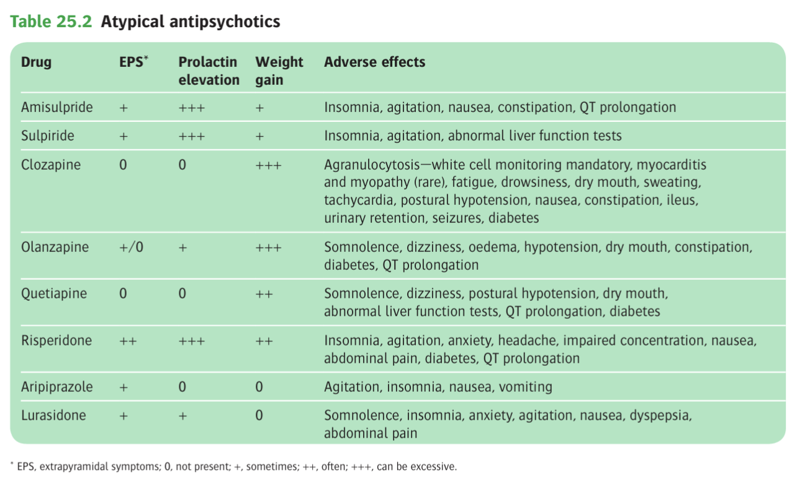
    - **Selective D2-receptor antagonists** - e.g. amisulpride (Solian), sulpride:
        - Highly selective to D2 receptors, but <u>remarkably little EPSE</u>
        - However extremely prone to <u>hyper-prolactinaemia</u>
    - **5-HT2-D2 receptor antagonists** - various drugs w/ 1) 5-HT2 antagonist properties, 2) variable potency of D2 receptor blockade, and 3) varying effects on other receptors:
        - <u>Respiradone</u> - potent antagonism of D2 receptors, 5-HT2 receptors, accounting for **strong EPSE and prolactin elevation**, as well as alpha-1 receptor blcoade, accounting for **sedation**, and **hypotension**
        - <u>Paliperidone</u> (Invega) - active metabolite of risperidone and has very similar pharmacological properties when given orally
        - <u>Olanzapine</u> - slightly weaker antagonism of D2 receptors than respiradone, hence **rare EPSE and prolactin elevation**, and rather strong anticholinergic and H1 receptor antagonism, making it **extremely sedation** (?hence IM olanzapine for agitated psychosis)
        - <u>Quetiapine</u> - weaker antagonism of D2 receptors, hence **rare EPSE and prolactin elevation**, but rather strong H1 receptor antagonism, resulting in **sedation**, and **weight gain**
        - <u>Lurasidone</u> - potent 5-HT2 and D2 receptor antagonism, but only weaker H1 antagonism
        - <u>Asenapine</u> (only for mania) - significant D2 receptor antagonism, and wide range of effects on 5-HT2 and alpha-2 receptors
        - <u>Sertindole</u> (currently use is suspended due to QTc prolongation) - potent 5-HT2 reeptor antagonism but weaker D2-receptor antagonism
        - <u>Aripiprazole</u> (Abilify) - partial dopamine agonists w/ 5-HT2 receptor blocking and 5-HT1A agonist properties, generally causing activating profile and hence **insomnia**, **N/V**
        - <u>Clozapine</u> - weak D2 receptor antagonism but high affinity to 5-HT2 receptors, but w/ significant H1, alpha-1, and muscarinic receptor activities, but is known for effects in treatment-resistant schizophrenia (?because less dopamine dependent)
- **Depot antipsychotic drugs** - main role in relapse prevention but cannot be relief upon to take it regularly:
    - Esters of conventional antipsychotic agents, e.g. fluphenazine decanoate, flupenthixol decanoate, zuclopenthixol decanoate, haloperidole decanoate
    - Other depot atypical antipsychotics now exist for risperidone, paliperidone, aripiprazole, and olanzapine
- **Pharmacokinetics** (of oral drugs):
    - <u>Absorption</u> - mainly well absorbed from the jejunum
    - <u>Transport and distribution</u>:k
        - When taken orally, subjected to first-pass metabolism
        - Generally highly **protein-bound**
    - <u>Excretion</u> - most have T1/2 of ~ 20h allowing od; quetiapine has T1/2 of ~ 3h requiring bid:
        - Extensive metabolism in the liver producing a range of active and inactive metabolites, hence difficult to interpret the clinical significance of the plasma concentration
        - With the exception of amisulpride and sulpride which are excreted in the liver unchanged
- **Pharmacokinetics of depot antipsychotics:** 
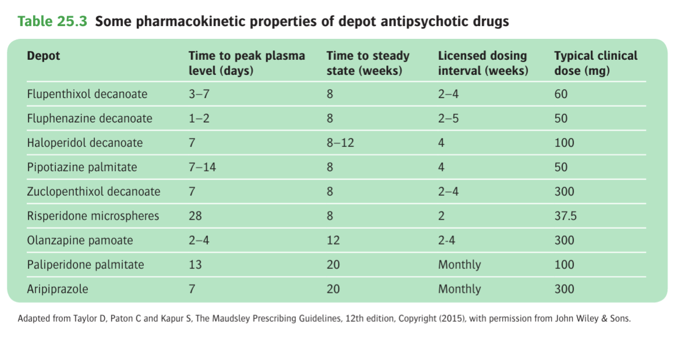
- **S/E** - unwanted effects related to the antidopaminergic, antiadrenergic, antihistaminic, and anticholinergic properties: 
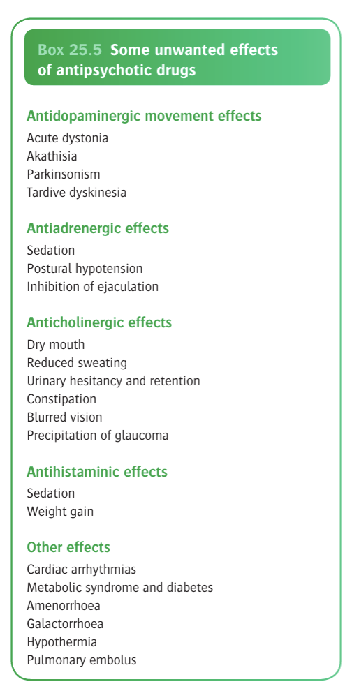
    - **Extrapyramidal S/E** - due to antidopaminergic S/E on the basal ganglia:
        - **Acute dystonia** - sudden uncontrollable muscle contractions:
            - <u>Timing</u> - usually at onset of Tx, esp. in young man
            - <u>Common agents</u> - FGAs:
                - Butyrophenones, e.g. haloperidone
                - Piperazines, e.g. trifluoperazine, fluphenazine
            - <u>Manifestations</u> - easily mistakened for histrionic behaviour:
                - Torticollis
                - Tongue protrusions
                - Grimacing
                - Opisthotonos
            - <u>Mx</u> - IM anticolinergics:
        - **Akatisia** - unpleasant feeling of physical restlessness and need to move, leading to inability to keep still:
            - <u>Timing</u> - usually occurs during first 2 weeks, but can be delayed onset
            - <u>Common agents</u> - e.g. Invega, abilify
            - <u>Core manifestations</u>:
                - Difficult to described, but usually as inner restlessness
                - Can result in marked agitations which can be mistakened by worsening psychosis
                - Known to precipitate suicide ideations
            - <u>Mx</u>:
                - Benzodiazepine prn
                - Beta-blockers
                - Dose reduction if possible
        - **Parkinsonian syndrome** - coarse tremor, rigidity, akinesia etc:
            - <u>Timing</u> - usually few months after drug has been used
            - <u>Mx</u> - antiparkisonian drugs, but not given prophylactically as can precipitate acute organic syndrome and may worsen tardive dyskinesia
        - **Tardive dyskinesia** - characterised by various dystonic-like features such as chewing and sucking movements, grimacing, choreoathetoid movements, and possibly akathessia:
            - <u>Epidemiology</u>:
                - Demographic - women, elderly, and those w/ diffuse brain pathology
                - Comorbidities - diagnosis of a concomittent mood disorder
                - Drugs - usually a/w long-term Tx of FGAs, although SGAs are still a/w TD albeit at a lower rate
            - <u>Pathophysiology</u> - supersensitivity to dopamine due to prolonged blockade, as:
                - May be aggravated by stopping antipsychotic drugs
                - May be aggravated byadministration of anticholinergic antiparkinsonian drugs
            - <u>Tx</u>:
                - Stopping antipsychotic if mental state allows, or switch to agents w/ weaker dopamine antagonism (e.g. quetiapine, olanzapine, aripiprazole, clozapine)
                - Vitamin E but evidence conflicting
                - Tetrabenazine (dopamine depleting agent) but poorly tolerated
    - **Antiadrenergic effects:**
        - Sedation
        - Postural hypotension w/ reflex tachycardia
        - Nasal congestion
        - Inhibition of ejaculation
    - **Anticholinergic effects:**
        - Dry mouth
        - Blurred vision or precipitation of glaucoma
        - Urinary hesitancy and retention
        - Constipation
    - **Antihistaminergic effects:**
        - Sedation
        - Weight gain due to increased appetite (and hence development of metabolic syndrome and T2DM)
    - **Other effects:**
        - <u>Cardiac conduction defects</u> - QTc prolongation
        - <u>Depression</u> - postulated due to excessive dopamine-receptor blockade in mesolimbic forebrain, but r/o concomittent depression or -ve Sx
        - <u>Diabetes and metabolic syndrome</u> - esp. w/ olanzapine, quetiapine, and clozapine
        - <u>Endocrine changes</u> - hyperprolactinaemia hence galactorrhoea and amenorrhoea, as well as increased risk of osteoporosis
        - <u>Others</u> - hypothremia, sensitivity reactions
    - **Adverse side effects of clozapine** - leukopenia (2-3%), agranulocytosis (usually in initial months)
    - **Neuroleptic malignant syndrome:**
        - <u>Epidemiology</u> - rare, occuring in small minority of patients, usually on high-potency antipsychotics (0.2%)
        - <u>Onset of neuroleptic malignant syndrome</u>:
            - Usually within first 10d of Tx onset but invariable
            - Rapid onset ocurring over 24-72h
        - <u>Clinical features of neuroleptic malignant syndrome</u> - hyperpyrexia w/ 1) motor, 2) mental, and 3) autonomic dysfunction:
            - **Hyperpyrexia** - often the core feature
            - **Motor symptoms** - generalised muscular hypertonicity, where contraction of muscles in the throat and chest may result in dysphagia and dyspnoea
            - **Mental symptoms** - usually impaired consciousness and reactivity to the external world:
                - Stupor
                - Akinetic mutism
            - **Autonomic disturbances:**
                - Unstable BP and tachycardia
                - Excessive sweating
                - Excessive salivation
                - Urinary incontinence
        - <u>DDx</u>:
            - Encephalitis
            - Heat stroke
            - Acute lethal catatonia
        - <u>Ix</u>:
            - **WCC** - raised
            - **CK** - raised
        - <u>Secondary complications</u> - up to 10% mortality rate:
            - Cardiovascular collapse
            - Renal failure
            - Thromboembolism
            - Pneumonia
        - <u>Mx</u>:
            - Stop the antipsychotic
            - ICU care usually requiring intubation and sedation
            - Cool the patient, maintain fluid balances, and treat intercurrent infections
            - Diazepam (Valium) for muscle stiffness
            - Dantrolene for malignant hyperthermia
            - Bromocriptine (dopamine agonist)
        - <u>Re-challenge w/ antipsychotics</u>:
            - Possible for the same drug to be given after the acute episode has resolved
            - Usually at least 2 weeks should elapse before antipsychotic drug treatment is reinstated
            - Antipsychotics w/ weaker dopamine-receptor blocking properties should be used
- **Dosing** - titrated for the individual patients, theoretically aiming at D2 receptor occupancy of 70-80% while minimising S/E: 
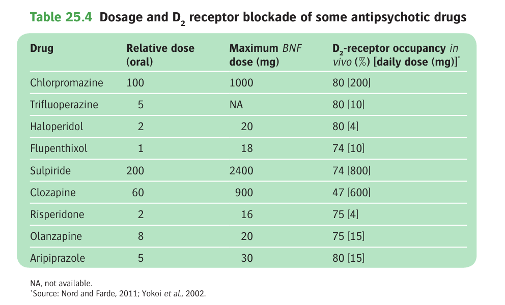

## Anticholinergic Drugs

## Antidepressant Drugs

- **Classification of antidepressant drugs into 3 main classes depending on acute pharmacological properties** - in a broad sense they are of <u>equivalent efficacy</u>, differing only in safety and adverse activities:
    - <u>Monoamine reuptake inhibitors</u> (TCAs, SSRIs, SNRIs, NARIs) - inhibit the reuptake of noradrenaline and/or 5-HT
    - <u>Monoamine oxidase inhibitors</u> (MAOIs) - deactivation of monoamine oxidase irreversibly (phenelzine, tranylcypromine) or reversibly (moclobemide)
    - <u>5-HT2 receptor antagonists</u> (trazadone, mirtazapine) - complex effects on monoamine mechanisms but share ability to block 5-HT2 receptors

  
  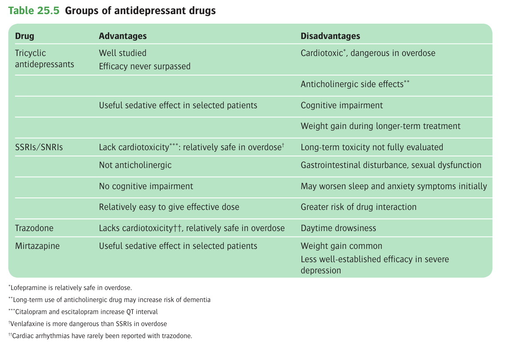
- **MOA of monoamine reuptake inhibitors and MAOIs** - early effects are usually described but usually does not translate to clinical effects:
    - <u>Early effects of monoamine reuptake inhibitors and MAOIs</u> (within hours of use) - increased functional activity of noradrenaline and/or 5-HT:
        - Monoamine reuptake inhibitors - reduced reuptake of monoamines to increase synaptic availability
        - Monoamine oxidase inhibitors - reduced breakdown of monoamines by MAO to increase synaptic availability
    - <u>Reasons for delayed onset of action</u> - full antidepressant effects of drug treatment can be delayed for weeks, and suggested that \>= 6 weeks before assessing effects:
        - Pharmacokinetic factors - half-life of most ADs are 24h, such that steady-state drug levels reached after 5-7d (i.e. 5 half-lifes)
        - Neuroadaptive changes in brain to acute potentiation of monoamine functions - animal studies showed various mechanisms including decreased desensitization of inhibitory autoreceptors on 5-HT and noradrenalines, increased BDNF, and increased synaptogenesis
        - Neuropsychological mechanisms - single doses produce positive biases in emotional processing in the absence of changes in subjective mood, where delayed onset of action reflects culmination of improved emotional processing (relearning) to be experienced as subjective change in mood
- **Selective serotonin reuptake inhibitors** - now preferred to TCAs as first-line treatment of depression as moderately better tolerated and markedly less toxic in overdose w/ comparable efficacy:
    - <u>Selection</u>:
        - Sertraline
        - Fluoxetine
        - Paroxetine
        - Fluvoxamine
        - Citalopram
        - Escitalopram
    - <u>Pharmacodynamic properties and MOA</u>:
        - High potency and selectivity for 5-HT reuptake transporters
        - Much less affinity for noradrenaline reuptake transporters or other monoamines
    - <u>Pharmacokinetics of SSRIs</u>:
        - **Absorption** - slow, reaching peak plasma levels after 4-8h, although citalopram and escitalopram are absorbed faster
        - **Metabolism** - most undergo extensive hepatic metabolism, but the metabolites are also bioactive:
            - Fluoxetine - metabolised into norfluoxetine which also serves as a potent 5-HT reuptake blocker w/ T1/2 of 7-9d
            - Sertraline - metabolised to desmethylsertraline, which is 5-10 less potent than sertaline and has a T1/2 of 2-3d (antidepressant effects unclear)
        - **Excretion** - renal excretion, overall half-lives around 24h but fluoxetine is 48-72h:
            - Fluoxetine - 48-72h
            - Others - 20-30h
    - <u>Efficacy of SSRIs in depression</u> - extensively compared w/ placebo and TCAs:
        - Generally suerior to placebo and as effective as TCAs in the treatment of MDDs
        - Concerns that SSRIs may be less effective than conventional TCAs for more severely depressed patients
    - <u>S/E</u>:
        - **GI discomfort** - N/V (20% but resolves w/ continuous administratino), dyspepsia, bloating, flatulence, and diarrhoea
        - **Weight gain** - over longer term Tx, most significantly w/ paroxetine
        - **Neuropsychiatric effects:**
            - Sleep disturbances such as insomnia or daytime somnolence
            - Agitations, tremors, restlessness and irritability
            - Seizures
            - Mania if underlying bipolarity
            - Seizures
        - **Other effects:**
            - Sexual dysfunction (e.g. ejaculation delay, anorgasmia)
            - Sweating
            - Dry mouth
            - QT prolongation (e.g. citalopram and escitalopram)
            - SIADH and hyponatraemia (esp. in elderly)
            - UGIB (esp if combined w/ NSAID)

    
    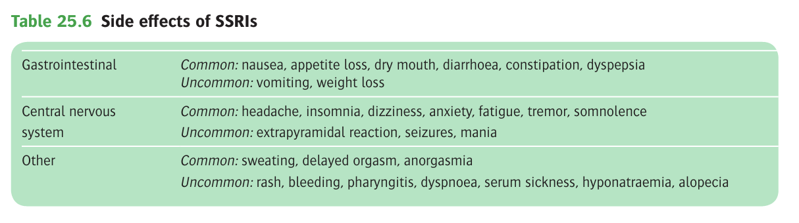
    - <u>SSRIs and violence and suicidal behaviour</u> - anecdotal reports where SSRI treatment may be a/w hostile and suicidal behaviour but a meta-analysis shows:
        - Small increased risk of self-harm relative to placebo (Gunnell et al 2005: 789 number-needed-to-harm vs 4 number-needed-to-treat)
        - Overall no significant increase of completed suicides and non-fatal suicidal behaviour between patients taking SSRI and those taking TCAs
        - However, risk of self harm w/ SSRIs might be greater in children and adolescents (Bridge et al 2010)
        - Statistically significant risk of self harm may be time dependent, suicide risk appears greatest at initiation of SSRIs (40x risk in first 9d), but becomes non-significant after 90d (Jick et al 2004); interestingly not possibly linked to SSRIs as also observed in early stages of psycholocal Tx (Simon and Savarino 2007)
        - Possibly because improvements of psychomotor retardations precedes resolution of depressed mood
    - <u>Drug interactions for SSRIs</u>:
        - **Pharmacokinetic interactions** - precipitating serotonin syndrome (hyperpyrexia, w/ mental and motor manifestations) through interacting w/ drugs that increase 5-HT function:
            - MAOIs
            - Lithium and tryptophan
            - Tramadol
            - Linezolid
            - Sumatriptan (5-HT receptor agonist)
        - **Pharmacokinetic interactions** - fluoxetine and paroxetine produce **substantial inhibition of P450 enzymes**, increasing drug levels of other drugs: 
        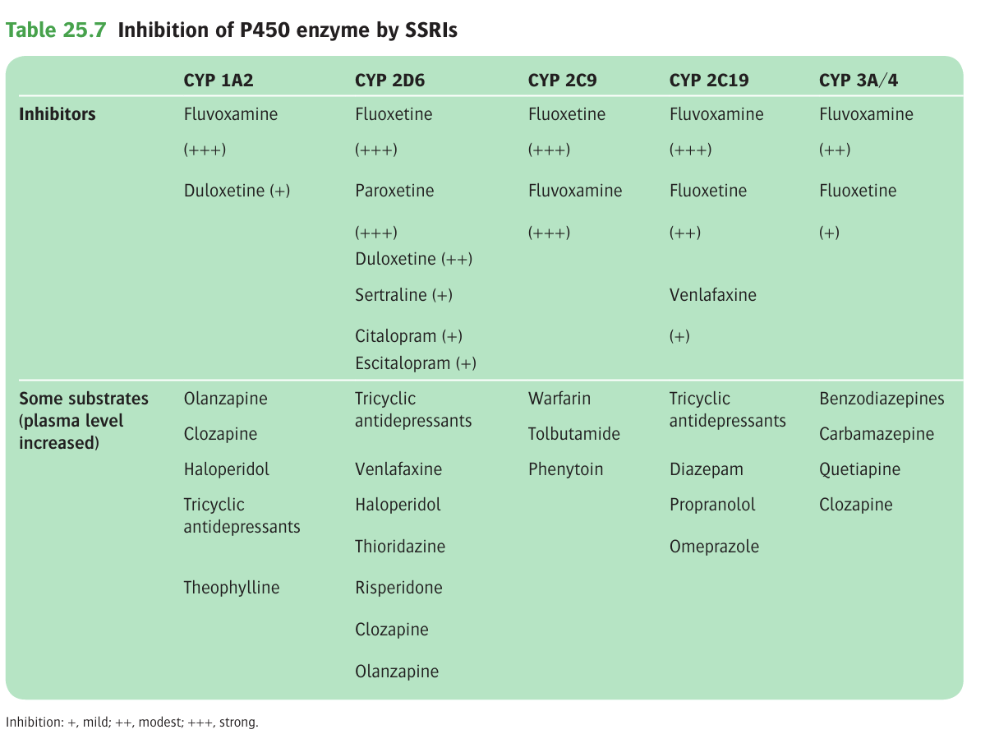
    - <u>Practical issues in the clinical use of SSRIs in Tx of depression</u>:
        - **Selection of antidepressants** - based on tolerability, and S/E profiles:
            - Fluoxetine has the most activating effects and distinct pharmacokinetics
            - Fluvoxamine is often the least tolerable and a/w highest drop-out rates in studies
            - Paroxetine has the most troublesome withdrawal symptoms
            - Escitalopram and citalporam tend to risk QTc prolongation

      
      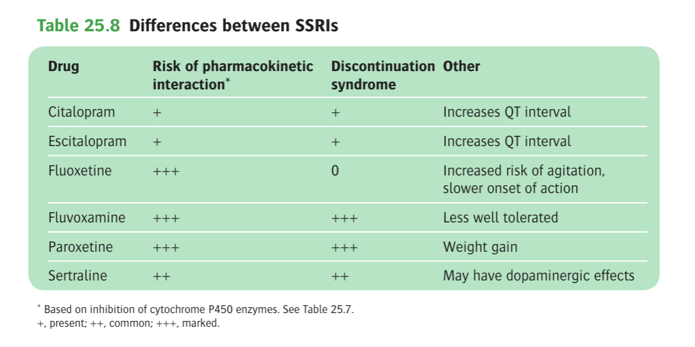
        - **Initiation of antidepressants:**
            - Warn patients of common early S/E such as GI disturbances, agitaiton or insomnia, to explain that this does not mean the underlying depression is worsening, as to improve compliance
            - Initial cover w/ benzodiazepines may be helpful if sleep disturbances is a problem
        - **Monitoring of antidepressant use:**
            - Frequent review in the initial weeks and education on S/E and ensure compliance
            - As to detect improvements in rapport and initiative in patients as well
        - **Continuation of antidepressant use:**
            - Good evidence for continuing treatment for at least 6 mo to lower rate of relapse
            - SSRI prophylaxis shown to be effective for recurrent depressive episodes
        - **Stopping antidepressant use** - graded reduction rather than stopping suddenly:
            - To prevent withdrawal reactions and antidepressant discontinuation syndrome (insomnia, agitation, nausea, dizziness) especially w/ paroxetine
            - Withdrawal reactions are likely less mild with fluoxetine due to pharmacokinetic properties, and switch to fluoxetine as to slow withdrawal is acceptable
- **Tricyclic antidepressants** - although no longer first line, still remains useful in treatment-refractory illness and those w/ severe depression (Cowen and Anderson 2015):
    - <u>Selection</u> - useful distinction between those that have a terminal methyl group side chain (tertiary amines), and those that do not:
        - Tertiary amines (more potent alpha-1 and muscarinic receptor antagonism) - e.g. amitriptyline, clomipramine, imipramine, lofepramine
        - Secondary amine (less potent antagonism of other receptors) - desipramine, nortriptyline, dosulepin, doxepin
    - <u>MOA</u> - three-ringed structure attached to side chains:
        - Inhibition of reuptake of 5-HT and noradrenaline
        - Antagonistic effects of variety of neurotransmitter receptors (alpha-1 adrenoreceptor, muscarinic cholinergic receptors) accounting for S/E
        - 5-HT2 receptor antagonism potentially explaining therapeutic effects
        - Quinidine-like membrane stabilising effects (cardio-toxic in overdose)
    - <u>Pharmacokinetics of TCAs</u>:
        - **Absorption** - well absorbed in GI tract; peak plasma levels 2-4h after ingestion
        - **Transport, circulation and distribution:**
            - Subjected to significant first pass metaboism (N.B. tertiary amine structures will give rise to secondary amine structures in the liver through demethylation but w/ substantial differences)
            - Highly protein-bounded, but free fraction widely distributed to body tissues
        - **Excretion** - half-life long enough to allow for od dosing
    - <u>S/E</u>: 
    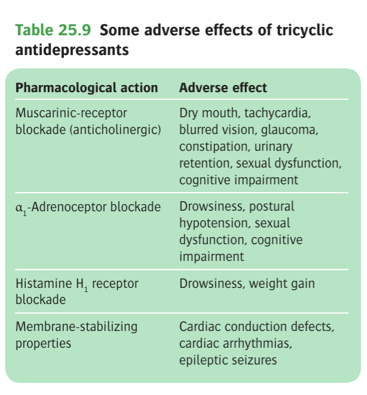
        - **Anticholinergic effects** - dry mouth, and blurry vision are most common; most important being acute closed-angle glaucoma and acute urinary retention:
            - Dry mouth
            - Blurry vision (disturbances of accomodation)
            - Urinary hesitancy or retention
            - Constipation
        - **Psychiatric effects:**
            - Sedation (w/ amitryptaline)
            - Insomnia (lofepramine, desipramine)
            - Mania in underlying bipolarity
        - **Cardiovascular effects:**
            - <u>Rhythm abnormalities</u> - prolongation of PR and QT intervals, heart blocks, tachycardias
            - <u>Postural hypotension</u> - due to alpha-1 adrenergic receptor blockade
        - **Neurological effects:**
            - Fine tremor (common)
            - Incoordination
            - Epileptic seizures in predisposed individuals
            - Peripheral neuropathy
        - **Other effects:**
            - Weight gain
            - Sexual dysfunction
            - Rashes
            - Cholestatic jaundice
            - Agranulocytosis
        - **Withdrawal effects** - N/V, agitation/ anxiety, sweating, GI Sx, insomnia and vivid dreaming
    - <u>Toxic effects in TCA overdose</u> - corresponds to S/E, but most being:
        - Cardiovascular effects - conduction abnormalities, and ventricular fibrillation, hypotensive episodes
        - Sedation and Coma - results in respiratory depression (hypoxia predisposes to arrhythmas), aspiration pneumonia
    - <u>Contraindications</u>:
        - Agranulocytosis
        - Severe liver disease
        - Glaucoma
        - Prostate hypertrophy
        - Uncontrolled epilepsy
        - Significantt cardiovascular disease
    - <u>Practical considerations in the clinical use of TCAs</u>:
        - **Selection of TCAs** - based on 1) sedation, 2) considerations of overdose, and 3) comorbid conditions:
            - Sedation - sedating compounds (e.g. amitriptyline), and less-sedating compounds (nortriptyline)
            - Considerations of overdose - lofepramine used for patients for risk of overdose
            - Comorbidities - chlomipramine reserved for comorbid OCDs
        - **Dosing and monitoring** - start low and go slow:
            - Initial dose dependent on age, weight, phhysical condition, history of previous exposure to TCAs
            - Titrate to targetable doses based on clinical responses and S/E
            - Consider ECG for monitoring at higher doses for S/E
- **Monoamine oxidase inhibitors** (MAOIs) - introduced prior to TCAs but limited by troublesome interactions w/ food and drugs and uncertainty about therapeutic efficacies:
- **Agomelatine:**
        - _MOA_ - melatonin receptor agonists w/ somewhat weaker antagonist at 5-HT2C receptor (anti-depressive mechanism not well established):
                - Melatonin agonists - AD effect mediated through a melatonin-like action on the circadian rhythms
                - 5-HT2C blockade - leads to increased dopamine release in the prefrontal cortex
        - _Pharmacokinetics_:
                - **Absorption** - rapid absorption, reaching maximum levels within 102 of ingestion
                - **Metabolism and excretion:**
                        - _First pass metabolism_ - 5-10% oral bioavailability
                        - _T1/2_ - ~ 2h, no metabolite likely contributing to its action
        - _Clinical efficacy_ - unequivocal results:
                - Comparable efficacy to velafaxine and paroxetine although doses of latter agents were relatively modest
                - Long term efficacy in terms of relapse prevention not well established (Koester et al 2013)
        - _S/E_:
                - N/V
                - Dizzinesss
                - Anxiety
                - Fatigue
                - Diarrhoea/ Constipation
                - dLFT (1.4-2.5% compared w/ 0.6% in placebo)
- **Mirtazapine:**
        - <u>MOA</u> - complex pharmacological actions, noradrenaline selective serotonin antagonists (NaSSA):
                - **5-HT receptor antagonism** - fairly potent antagonism against 5-HT2 receptors and 5-HT3 receptors
                - **H1 and alpha-1 receptor antagonism** - unrelated to AD effect, rather creates the **sedating profile**
                - **Alpha-2 adrenergic receptor antagonism** - inhibits presynaptic autoregulation and increases noradrenaline release (accounts for AD effect)
                - **No effects on muscarinic cholinergic receptors** - not anticholinergic and hence relatively safe in overdose
        - <u>Pharmacokinetics</u>:
                - **Absorption** - well absorbed w/ peak plasma levels reached in 1-2h
                - **Metabolism:**
                        - Metabolised in liver
                        - Minor inhibitory effects on cytochrome P450 system
                - **Excretion** - T1/2 16h, enabling od dosing at night (aids sleep)
        - <u>Clinical efficacy</u> - effective dose between 10-45 mg demonstrable in placebo control trials and comparator trials
        - <u>S/E</u> - mainly related to antihistaminergic effects:
                - Sedation
                - Weight gain
                - Dry mouth
- **Trazodone:**
        - _MOA_ - complex effects on serotonin system, while resulting in alpha-adrenergic receptor blockade:
                - **Effects on serotonin syndrome** - serotonin antagonist reuptake inhibitor (SARI):
                        - _Trazadone_ - mild serotonin-reuptake inhibitor, w/ 5-HT2 antagonism
                        - _m-CPP_ (active metabolite) - 5-HT receptor antagonists
                - **Alpha-adrenoreceptor blockade** - resulting in sedating effects
        - _Phamacokinetics_ - T1/2 ~ 4-14h
        - _S/E_:
                - Excessive sedation (can eresult in significant cognitive impairment)
                - N/V
                - Postural hypotension
                - Arrhythmias
                - Priapism (1 in 6000 M patients)
- **L-tryptophan:**
- **Venlaxafine:**
- **Bupropion:**
        - _MOA_ - noradrenaline dopamine reuptake inhibitor (NDRI)
        - _Clinical efficacy_ - Superior to placebo and equivalent to that of SSRI
        - _S/E_ - similar S/E profile as SSRI but:
                - Less likely to cause sexual dysfunction and weight gain
                - Higher risk of seizures
        - _Drug interactions_:
                - Should not be prescribed w/ other drugs that lower seizure thresholds (e.g. TCAs, antipsychotics)
                - Inhibition of CYP2D6 (raised drug levels of other AD and antipsychotics)

## Mood-Stabilizing Drugs

- **Commonly used mood-stabilizing drugs:**
    - Lithium
    - Anticonvulsants (e.g. carbamazepine, sodium valproate, lamotrigine)
- **Role of mood-stabilizing drugs:**
    - Prevention of recurrent affective illness
    - Acute treatment of mania
    - Augmentation of antideressant therapy (only for lithium as demonstrated antidepressive effects)
- **S/E of commonly used mood-stabilzing drugs:** 
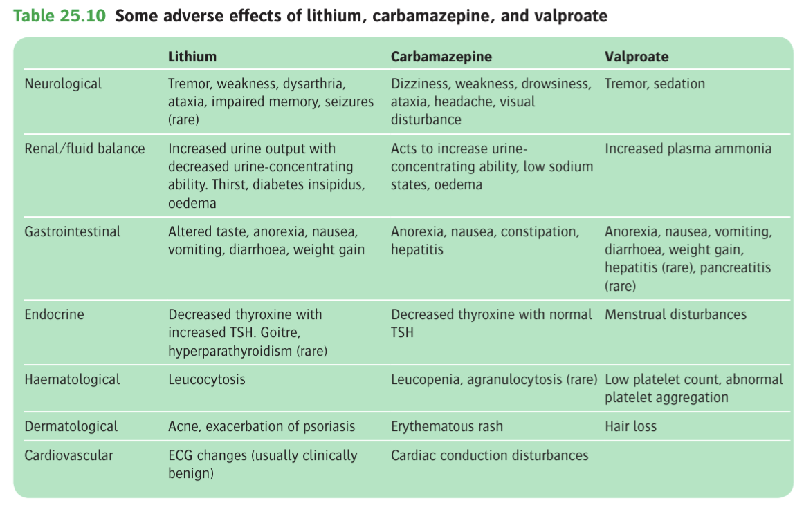

### Lithium

- **Evidence for lithium established efficacy in:**
    - Acute treatment of mania
    - Prophylaxis of unipolar and bipolar mood disorders
    - Augmentation therapy in resistant depression
    - Prevention of aggressive behaviour in patients with learning disabilities
- **MOA:**
    - <u>Inhibition of secondary messanger production</u> - reduced formation of cAMP and formation of inositol lipid-derived mediators
    - <u>Modulation of neurotransmitter pathways</u>:
        - Reduced effect of monoamine pathways
        - Improved cell survival, synaptic plasticity (through inhibition of glucogen synthase kinase 3)
- **Pharmacokinetics:**
    - <u>Absorption</u> - rapid absorption in the gut (rise by factor of 2-3 within 4h of oral dose)
    - <u>Transport and distribution</u> - diffuse quickly throught the body tissue and cells, moving out of cells more slowly than sodium
    - <u>Excretion</u> - biphasic:
        - Rapid phase urinary excretion - excretion of lithium distributed in the plasma
        - Slower phase urinary excretion - excretion of lithium that has entered the body cells, i.e. removal from the whole body pull
    - <u>Renal handling of lithium</u>:
        - Freely filtered and partly reabsorbed
        - Reabsorption in the PCT is driven by water, hence increased water reabsorption results in increased lithium reabsorption (i.e. increased reabsorption w/ dehydration)
        - Reabsorption in competition w/ Na, hence increased lithium reabsorption w/ hypoNa (e.g. w/ thiaide diuretics)
- **S/E** - mild diuresis (Na excretion), tremors, dry mouth, metallic taste, weakness and fatigue are common:
    - **Neurological disturbances:**
        - Fine-tremors
        - Muscle weakness
        - Ataxia
        - Impaired memory
    - **Renal/ fluid disturbances:**
        - <u>Impaired ADH function</u> - due to lithium blocking ADH effects on the collceting ducts, manifesting as mild thirst, polyuria, to frank nephrogenic DI (33% w/ chronic use)
        - <u>Long-term effects on kidney</u> (increased risk of CKD) - irreversible decline in renal tubular concentration resulting in declining glomerular functions
    - **Gastrointestinal disturbances:**
        - Metallic taste
        - N/V
        - Diarrhoea
        - Weight gain
    - **Endocrine disturbances:**
        - <u>Thyroid</u> - goitre (5%), primary hypothyroidism (20%; may account for fatigue and weight gain)
        - <u>Parathyroid</u> - hyperparathyroidism
    - **Other effects:**
        - <u>Haematological</u> - leukocytosis
        - <u>Dermatological</u> - exacerbation of psoriasis
        - <u>Cardiovascular</u> - benign ECG changes
- **Toxic effects of lithium** - dose-related:
    - <u>Clinical manifestations</u> - primarily neurological manifestations (permanent neurological damages have been reported):
        - Ataxia, poor coordination of limb movements, and slurred speech
        - Muscle twitching
        - Seizures
        - Confusion and coma
    - <u>Mx</u>:
        - Stopping lithium at once
        - Promoting renal excretion of lithium by 1) hydration, 2) NaCl supplementation to promote osmotic diuresis, 3) haemodialysis if impaired renal function
- **Lithium in pregnancy:**
    - <u>Teratogenicity</u> - risk of fetal abnormalities especially involving the heart but magnitude of individual risk is low
    - <u>Considerations for lithium during pregnancy</u> - case-based decision:
        - Consider likelihood of affective relapse during pregnancy
        - Consider difficulty of Mx of an episode of affective illness
    - <u>Monitoring and further Mx</u>:
        - Serial measurements of serum lithium levels
        - Fetal echocardiography
        - Consider lithium prophylaxis post-partum to reduce risk of post-partum relapse
        - Refrain from breast-feeding as significant concentrations of lithium can be measured in serum of breastfed infants
- **Drug interactions of lithium** - must be considered given the narrow therapeutic index of lithium:
    - **Pharmacokinetic interactions** - mainly affecting renal excretion:
        - <u>Increased lithium levels</u> - diuretics (furosemide safest), NSAIDs (aspirin/ sulindac safest), RAAS blockade (ACEi/ ARB)
        - <u>Decreased lithium levels</u> - theophyline, sodium bicarbonate
    - **Pharmacodynamic interactions:**
        - <u>5-HT promoting agents</u> (e.g. SNRI, TCA, MAOI, but SSRI can be used safely w/ care) - potentiation of 5-HT effects resulting in **serotonin syndrome**
        - <u>Potentiating effects of CNS-acting drugs or physical treatments</u> - CCBs, carbamazepine, phenytoin ECT (hence lithium suspended during ECT), or muscle relaxants
- **Contraindications:**
    - Renal failure or recent renal disease
    - Current heart failure or recent myocardial infarction
    - Chronic diarrhoea sufficient to alter electrolytes
- **Management of the patient on lithium:**
    - **Preparation:**
        - <u>Assessment prior to initiation</u> - r/o absolute contraindications of lithium:
            - P/E - BP, body weight, BMI
            - Bloods - CBC, RFT, Ca, TFT
            - Others - ECG, pregnancy test
        - <u>Drug review</u> - review drugs that may interact w/ lithium: 
        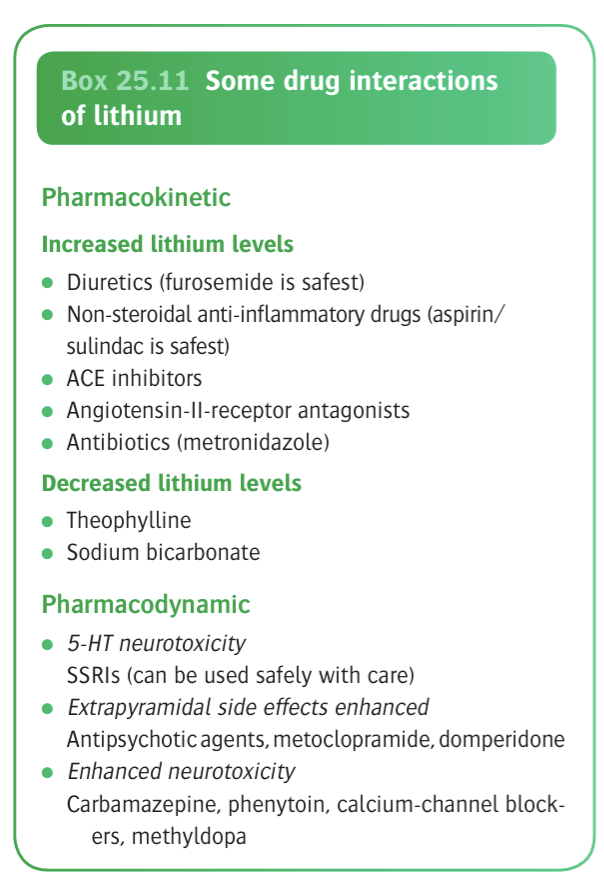
        - <u>Patient education on conditions that may precipitate toxic effects</u> - printed guidelines provided to patient and family:
            - Intercurrent gastroenteritis
            - Dehydration secondary to fever
            - Renal diseases
    - **Initiation, continuation, and monitoring:**
        - <u>Initiation</u>:
            - Initial dosing dependent on indication
            - 200-400 mg od dosing used for prophylaxis, starting on the lower side if risking pharmacokinetic or pharmacodynamic interactions
            - OD dosing used, unless GI intolerance, in which divided doses (bid) can be given
        - <u>Monitoring</u> - monitor every 1-2 weeks until appropriate dose is found:
            - Bloods taken at **12h after last dose**
            - Target serum lithium levels of **0.4-0.7 mmol/L**, for prophylaxis, but higher (**0.8-0.9 mmol/L**) if predominant symptomatology is manic
            - May take **several months for full clinical effects to take place** even after therapeutic levels have been reached
        - <u>Continuation</u> - need for drug is reviewed q1y:
            - Blood for serum lithium levels taken at q12w after appropriate dose is found
            - Blood screening for complications (CBC, TFT, RFT, Ca) taken q6mo
            - Repeated drug reviews for other psychotropic or other medications
    - **Cessation:**
        - Slowly wtihdrawal over a number of moths if possible
        - Patient should be informed not to discontinue lithium suddenly on their own initiative

### Carbamazepine

- **Position of carbamazepine in the management of mania and bipolar disorders:**
    - Initially introduced as an anticonvulsants, but found to have useful effects on mood in bipolar patients
    - Reasonable evidence for use in management of acute mania and prophylaxis of bipolar disorders, although overall efficacy is probably less than that of lithium in treatment-naive patients (Goodwin et al 2016)
    - However, found to be beneficial in bipolar patients who are refractory to lithium
- **MOA of carbamazepine:**
    - Mechanistically known for <u>Na channel blockde</u>, but unsure if related to mood-stabilising effects
    - Found to <u>facilitate 5-HT neurotransmission</u>, sharing similar effects as lithium
- **Pharmacokinetics:**
    - <u>Absorption</u> - slowly, but completely absorbed
    - <u>Distribution</u> - widely distributed in body tissues
    - <u>Metabolism</u>:
        - Extensively metabolised into many metabolites
        - At least one metabolite, carbamazepine eposide, found to be therapeutically active
        - Strong inducer of CYP3A4, **auto-induction** resulting in shortened half-life w/ repeated dosing, and reduces plasma levels of other drugs (e.g. contraceptives, anticoagulants, antipsychotics, benzodiazepines, and TCAs)
    - <u>Excretion</u> - T1/2 ~ 20h
- **Dosing and plasma concentrations:**
    - <u>Dosing</u> - similar to that used for treatment of epilepsy:
        - Within rages of 400-1600 mg daily, usually given bid to improve tolerance
    - <u>Monitoring</u> - Plasma concentrations (12h after last dose) to maintain the usual anticonvulsant range as a precaution against toxicity
- **S/E of carbamazepine:**
    - <u>Neurological S/E</u> - common at beginning of treatment:
        - Sedation
        - Dizziness
        - Ataxia
        - Diplopia
    - <u>Renal S/E</u> - hyponatraemia, oedema
    - <u>GI S/E</u> - N/V, anorexia, constipation
    - <u>Endocrine S/E</u> - mild lowering of T3/4 but clinical hypothyrodism is rare
    - <u>Haematological S/E</u> - relative leukopenia and agranulocytosis
    - <u>Other effects</u>:
        - Rash (5%)
        - Hepatitis
        - Cardiac conduction abnormalities
        - Teratogenic
- **Clinical use of carbamazepine** - generally placed low down the list of therapeutic options, after lithium, valproate, lamotrigine, primarily due to <u>drug-drug interactions</u>, and <u>perceived poor tolerability</u>:
    - <u>Prophylactic management of bipolar illness</u> for which lithium and valproate are ineffective or poorly tolerated
    - Considered for <u>frequent mood swings</u> (rapid cyclers), and <u>mixed affective mood states</u>, for which may be more effective than lithium
    - <u>Augmentation of lithium therapy</u>, keeping in mind of enhanced neurotoxicity
    - Management of acute mania as alternatives or additions to lithium and valproate
- **Management of patient on carbamazepine:**
    - <u>Initiation and titration</u> - only considered when other options are ineffective or unavailable:
        - Initiated at doses of 100-200 mg/d, slowly titrating in steps of 100-200 mg twice-weekly
        - Titration against S/E and clinical response rather than blood levels
    - <u>Monitoring for S/E</u> - patients asked to seek help urgently if fever or S/S of infection:
        - CBC - at 3mo and 6mo
        - Other bloods - LFT, electrolytes

### Valproate (Epilim)

### Lamotrigine

### Gabapentin

## Psychostimulants

## Other Physical Treatments
