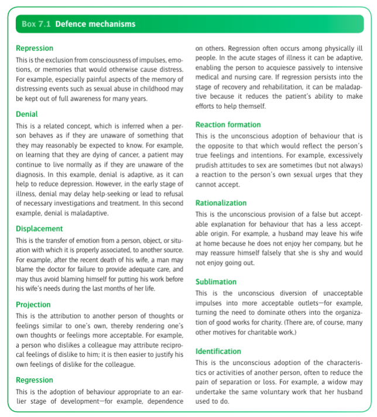
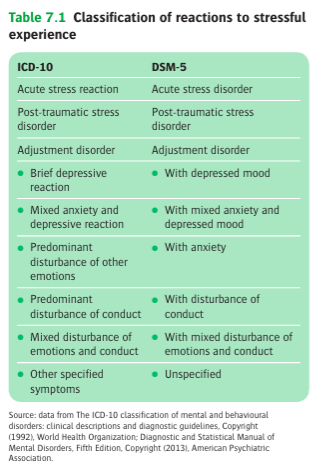

# Ch7 Reactions to Stressful Expierences

## Introduction

- **Stressful events** - events that have a propensity to provoke emotional reactions that are sterssful

## The response to stressful events

- **3 components of the response to sterssful event:**
    - An emotional response, with somatic accompainments
    - A coping strategy
    - A defense mechanism
- **Cognitive processes to adapt to stress** - tryping to make sense of specific one-off events by <u>a change of expectation</u>:
    - Coming to terms with stresses by 'working through them' (from a psychoanalytical sense), i.e. necessary changes to subconscious processing
    - Involves reflection and re-evaluation
- **Emotional and somatic responses** - generally two kinds of responses but are generally less intense than the pathological counterparts:
    - <u>Anxiety responses</u> - usually in response to threat, a/w autonomic arousal leading to apprehension, irritability, tachycardia, increased muscle tension and dry mouth
    - <u>Depressive responses</u> - usually in response to loss or seperation, a/w pessimistic thinking and reduced physical activity
- **Coping strategy vs defense mechanism** - overlapping concepts arising from different schools of thought:
    - <u>Coping strategy</u> - cognitive aware of the strategies to reduce the impact of the stressful event
    - <u>Defense mechanism</u> - cognitively unaware of the strategies to reduce the impact of the stressful event
- **Coping strategies:**
    - **Definition** - strategies to reduce the short-term impact of stressful events, thus attenuating the emotional and somatic responses and making it more possible to maintain normal performance at the time (although not always in the long term)
    - **Forms of coping strategies:**
        - <u>Problem-solving strategies</u> - modulating the sterssful event and making it less stressful, through 1) obtaining information, 2) solving problems, 3) confrontation (i.e. defending one's rights)
        - <u>Emotional-reducing strategies</u> - modulating the experience of the stressful event to alleviate the emotional response, through 1) ventilation of emotion, 2) evaluation of problem (e.g. change of mindset; Stoic view); 3) positive reappraisal of the problem, 4) avoidance of the problem
    - **Adaptive vs maladaptive coping strategies** - note all coping strategies are as effective:
        - In physical illness, problem solving (e.g. seeking medical attention) is far more effective than avoiding the problem
    - **Maladaptive coping strategies** - specific strategies that may reduce emotional response to stressors in the short term, but <u>lead to greater difficulties in the long term</u>:
        - <u>Use of alcohol or unprediscribed drugs</u> - means of avoidance by reducing the emotional response or to reduce awareness of the stressful circumstances
        - <u>Deliberate self-harm</u> (including o.d.) - by gaining temporary relieve from the stressful situation
        - <u>Unrestrained display of feeling</u> - e.g. excessive emotional responses (harming others), but such behaviour may be destructive as can cause damage to relationships w/ others who would otherwise have been supportive
        - <u>Aggressive behaviour</u> - immediate release of anger, but damages relationship
    - **Coping styles** - the propensity of an individual to repeatedly use a particular coping mechanism in different situations (e.g. those who repeatedly abuse drugs or overdose can be seen to actively avoid stressors before)
- **Defense mechanisms:**
    - **Definition** - unconscious responses to external stressors as well as to anxiety arising from internal conflict
    - **Historical interest:**
        - Denoted by Freud and his daughter (Anna Freud), which are defined as <u>uncoscious processes</u> that individuals are generally not aware of
        - They are identified through <u>observations of 'psychopathology of daily life'</u>, i.e. observing people's slip of tongue and lapses of memory and interpreting these as behaviour of people under stress
    - **Forms of defense mechanisms:** 
    
- **Factors influencing response to stressful events** (Brown and Harris 1978):
    - Present circumstances - may make a person more vulnerable to stressful life events (e.g. lack of a confidant to seek advice or vent to)
    - Previous experiences - experiences of negatively-perceived events in the past may increase the vulnerability to stressors of related themes (e.g. loss)

## Classification of reactions to stressful events

- **Classification of reactions to stressful experiences:** 

## Acute stress reaction and acute stress disorder

- **Clinical features of acute stress reaction** - core Sx being the acute psychological response of anxiety or depression:
    - **Acute psychological response:**
        - <u>Anxiety</u> - typical response to an acute threat, a/w apprehension and fear towards the threat accompanied by somatic Sx
        - <u>Depression</u> - typical response to separation or lost, a/w low mood, pessimistic thinking and reduced physical activity
    - **Somatic Sx related to autonomic arousal** - tachycardia, sweating, palpitations and tremors, and may manifest as full-blown fight-or-flight responses
    - **Other somatic manifestations:**
        - Insomnia
        - Poor concentration
        - Restlessness
    - **Coping strategies and defense mechanisms** - maintained temporarily to enable <u>social and occupational functioning</u> until depression or anxiety subsides, enabling 'working through' to occur:
        - <u>Coping strategies</u> - the most commonly adopted is avoidance, e.g. a conscious effort to avoid talking, thinking about stressful events, and avoiding cues for remembering them
        - <u>Defense mechanism</u> - the most commonly adopted is denial, which may manifest as feeling being numbed or dazed, with difficulty in remembering the whole sequence of traumatic event
    - **Dissociative Sx** - may not be seen in acute stress reaction, but seen in acute stress disorder:
        - Feelings of being numbed or detached from the current situation
        - Being in a daze, or a reduced awareness of the surrounding
        - Derealisation
        - Depersonalisation
        - Dissociative amnesia (can be considered as a severe form of defense mechanism)
    - **Atypical manifestations:**
        - <u>Re-experiencing</u> - vivid memories manifesting as iamgery, flashbacks or disturbing dreams
        - <u>Maladaptive coping strategies</u> - e.g. alcohol abuse or drug overdose to reduce distress
        - <u>Maladaptive defense mechanisms</u> - regression or displacement
- **Diagnostic conventions** - acute stress reaction (ICD-10) and acute stress disorders (DSM-5) capture different phases of the stress response:
    - <u>Acute stress reaction</u> - focuses on the onset of the reaction (i.e. start within 1h after exposure to the stressor), and the brevity of the reaction (diminishes not more than 48h, disappearing after a few days)
    - <u>Acute stress disorder</u> - focuses on exceptional nature of stressors, symptomatology (i.e. dissociation and re-experiencing), a more pronounced disease duration (\> 2d and \<= 4 weeks), and clinical distress
- **Epidemiology** - dependent on the 'exceptional' nature of the stressor
    - 15% in motor accident survivors
    - \> 50% of women victims of sexual assault
- **Risk factors:**
    - <u>Temperental factors</u> - coping styles, previous experiences, past Hx of psychiatric disorder (particularly disassociation or depression)
    - <u>Environmental factors</u> - present circumstances (e.g. availability of confidant)
    - <u>Genetic and physiological factors</u> - similar as in PTSD
- **Mx:**
    - **Principles of Mx:**
        - <u>Critical incident stress debriefing</u> - immediately offered after a major incident, but single-session is not helpful in lowering subsequent psychological distress, and may even be harmful
        - <u>Watchful waiting</u> - milld pharmacological therapy (e.g. anxiolytics and hypnotics) for initial Sx, and watchful waiting to identify those at risk of developing PTSD
        - <u>Counselling</u> - specific counselling techniques to prevent onset of PTSD:
            - Prolonged exposure therapy (avoid excessive avoidance)
            - Trauma-focused cognitive behaviour therapy

## Post-traumatic stress disorder

## Response to special kinds of severe stress

## Adjustment disorders

## Special kinds of adjustment
