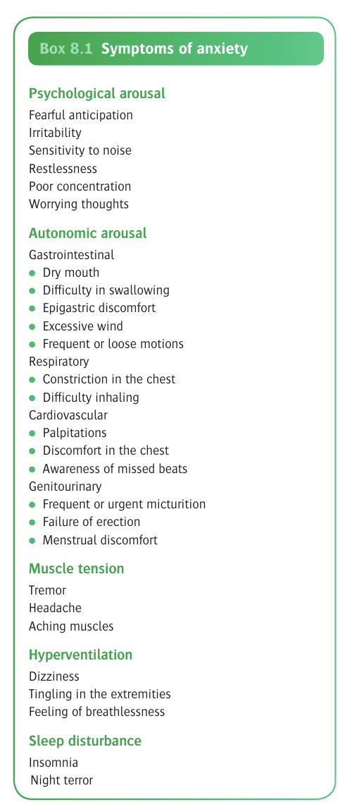
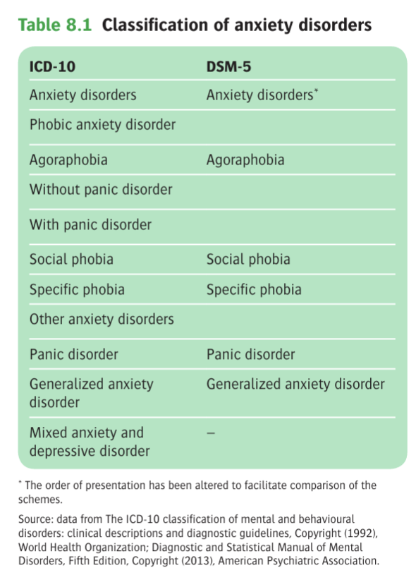
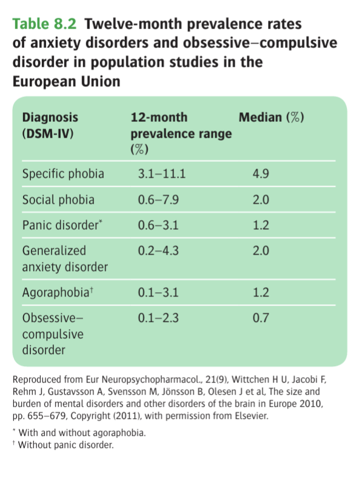
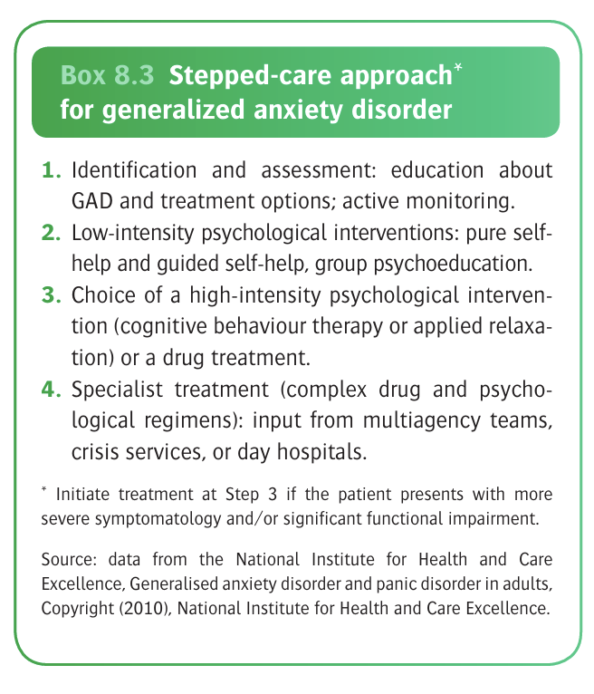

# Ch8 Anxiety and Obsessive-Compulsive Disorders

## Terminology and Classification

- **Classification:**
    - Anxiety is seen in a multitude of disorders including obsessional disorders
    - OCD has its separate section in DSM-5 and ICD-11 compared to DSM-IV

## Anxiety Disorders

- **Clinical features of anxiety** - presence of mental and physical symptoms reflecting an abnormal mental state rather than an organic brain disease or another psychiatric disorders (see Ch1): 

- **Classification of anxiety disorders** - all symptoms can occur in any of the anxiety disorders, rather, and may share similar clinical picture and etiology, rather it is the <u>characteristic pattern of each disorder that differentiates them</u>:
    - <u>Generalised anxiety disorder</u> (GAD) - anxiety is continuous but may fluctuate in intensity
    - <u>Phonic anxiety disorder</u> - anxiety is intermittent, arising in particular circumstances that can be identified
    - <u>Panic disorders</u> - anxiety is intermittent, but its occurrence is unrelated to any particular circumstances

  
  
- **Historical interests regarding classification of anxiety disorders:**
    - Freud's dichotomy of anxiety disorders (a group of patients w/ phonic disorders or panic attacks) based on the predominant clinical picture, 1) <u>anxiety neurosis</u> including cases w/ mainly psychological symptoms, and 2) <u>anxiety hysteria</u> including cases w/ mainly physical symptoms
    - Freud originally proposed that the <u>causes of anxiety disorders</u> were related to sexual conflicts, although he later acepted a wider range of causes, which is in line with most psychiatrists that believe a very wide range of stressful events can cause anxiety
    - Freud also proposed that phobic disorders could be classified into common phobias (i.e. exaggerated fear of something that is commonly feared), and specific phobias (i.e. fear of a situation that is not feared by others); although specific phobias nowadays have a different meaning
    - In the 1960s, <u>different responses of certain phobias to behavioural methods</u> suggest grouping of simple phobias, social phobias, and agoraphobias, reflecting subclassification of anxiety disorders especially because they differ in age of onset
    - It is also subsequently recognised that phobias presenting w/ marked panic attack respond poorly to behavioural therapy but better to pharmacological therapy such as imipramine (Klein 1964), leading to subgrouping of panic disorders
    - Relationship between OCDs and anxiety disorders is uncertain: Freud initially proposed that anxiety is the central pathology but the manifestations differ reflects different kinds of defense mechanisms against anxiety
- **Epidemiology of various anxiety disorders** - from meta-analysis of 85 European studies: 

## General Anxiety Disorder

- **Definition** - form of anxiety disorder where symptoms of anxiety are persistent, and are not restricted to, or markedly increased in particular set of circumstances (cf phobic anxiety disorders)
- **Clinical picture of GAD** - all symptoms of anxiety can occur in GAD but <u>it is the pattern that is diagnostic</u>:
    - **Worry and apprehension** (free floating anxiety) - more prolonged than in healthy people, often wide spread and not focused on a specific issue as they are in panic disorders, social phobias, or OCD, and are often very difficult to control
    - **Psychological arousal** - may manifest as:
        - Irritability
        - Poor concentration
        - Sensitivity of noise
        - Subjective sensation of poor memory (due to poor concentration)
    - **Autonomic overactivity** - due to increased sympathetic tone, which may be the presenting symptom
    - **Muscle tension** - results in various somatic complaints including:
        - Restlessness, trembling or inability to relax
        - Headaches which is usually bilateral or frontal/ occipital
        - Aching of the shoulder or back
    - **Hyperventilation** - increased rate of breathing which may lead to:
        - Dizziness
        - Tingling in the extremities
        - Subjectively felt as shortness of breath
    - **Sleep disturbances** - often:
        - Difficulty in initiating sleep due to persistent worrying thoughts
        - Intermittent, unrefreshing sleeps which may be due to unpleasant dreams
        - Early morning wakening is not a feature of GAD but suggests major depressive disorder instead
- **Signs of GAD:**
    - <u>Appearance</u> - face appears strained, frow is furrowed and posture is tense, skin pale and sweating is common
    - <u>Behaviour</u> - restlessness and trembling, ocassionally on a verge of tearfulness which suggests an apprehensive state
- **Difference between GAD and normal anxious state** - completely arbitrary:
    - Symptom should be present for most days and last for 6 mo
    - Symptom severity dependent on the diagnostic criteria used, where excessive worrying is more emphaised in DSM-5, while physical symptoms are described in details in ICD-11
    - Distress and functional impairment differentiates between GAD and normal anxiety in DSM-5
- **Comorbidities of anxiety symptoms in GAD:**
    - <u>Depression</u> - often mixed presentation w/ depressed mood, where ICD-11 provides a separate category of mixed anxiety and depressive disorder for those presenting w/ significant Sx but do not meet the full criteria of either disorders
    - <u>Other anxiety disorders and OCD</u> - often co-morbid in DSM-5 convention, although in ICD-10 convention, GAD is not diagnosed if a phobic anxiety disorder is met even if GAD criteria met
- **Differential diagnosis of GAD:**
    - **Depressive disorder** - anxiety is common in depressive disorders and GAD often presents w/ some depressive symptoms:
        - Dx is decided based on 1) <u>severity of each Sx</u>, and 2) <u>temporal relationship of the two Sx</u>
        - Anxiety Sx that is <u>worse in the morning</u>, and accompanied w/ depressive thinking is more suggestive of <u>depressive disorder</u>
        - Consider atypical presentation of <u>agitated depression</u> by screening for biological, cognitive Sx of depression
    - **Schizophrenia** - perplexed state in prodrome of schizophrenia may present as "anxiety":
        - Asking for <u>contributory factors of the symptoms</u> for patients presenting w/ anxiety
        - Unusual replies may suggest <u>unexpressed delusional ideas</u>
    - **Dementia** - anxiety may produce a subjective sensation of poor memory due to poor concentration, but if memory is objectively impaired, consider a Dx of schizophrenia
    - **Substance misuse** - bi-directional relationship between substance use and anxiety symptoms:
        - Some people take drugs or alcohol to relieve anxiety
        - Substance dependence and withdrawal may be interpreted as symptoms of anxiety, and may take anxiolytic drugs to control them
        - Consider substance dependence if anxiety occurs in the morning, which is the time when alcohol and drug withdrawal symptoms tends to occur
    - **Physical illness** - attributed to the somatic Sx (e.g. thyrotoxicosis, hypoglycaemia, phaeochromocytoma), and should be explored in all cases, esp in the absence of psychological causes
- **Epidemiology:**
    - <u>Prevalence</u> - 12mo prevalence of around 4.4% in the UK and US
    - <u>Demographic</u>:
        - Age - various rates, and expressions of anxiety across age
        - Sex - female preponderance (F:M = 2:1)
        - Social disadvantages - a/w lower household income, unemployment, divorce, and separation
- **Etiology** - appears to be caused by stressors acting on a personality that is predisposed to anxiety by a combination of genetic factors and environmental influences in childhood:
    - **Stressful events** - known to trigger GAD and result in chronicity if the stressor persists:
        - Life events characterised by loss a/w increased risk of GAD on top of depression
        - Life events characterised by danger where full effects yet to realise a/w GAD
    - **Genetic causes** - genes identified predisposes to wide range of anxiety and depressive disorders rather than GAD specifically
    - **Early experiences** - accounts given by anxious patients of their experiences in childhood suggest <u>early adverse experience</u> is a cause of GAD, w/ support from objective studies and psychoanalytic theories:
        - <u>Sociological studies</u> - individuals w/ accounts of parental indifferences and of abuse a/w increased rates of GAD, agarophobia, depressive disorder but not of simple phobia; and parental styles characterised by overprotection and lack of emotional warmth may also be a risk factor
        - <u>Psychoanalytical theories</u> - intrapsychic conflict where the ego (weakened by developental failure) is overwhelmed by excitation from any of the following sources, but are left unmodified by defense mechanisms (cf phobias and obsessions):
            - Excitation from the outside world (realistic anxiety)
            - Instintual levels of the id (neurotic anxiety)
            - The superego (moral anxiety)
    - **Cognitive behaviour theories:**
        - <u>Conditioning theories</u> - possibly conditioning of anxiety to previously neutral stimuli resulting in excessive activation of the autonomic nervous system
        - <u>Cognitive theory</u> - certain coping and cognitive styles (e.g. looming cognitive style) may predispose individuals to development of GAD (Reardon and Nathan 2007)
        - <u>Meta-cognitive belief</u> - process of worryng as a coping strategy to account for and eliminate all possible threats, but becomes pathological when one starts to "worry about worry" (Wells 2013)
    - **Personality traits and disorders:**
        - <u>Neurotism</u> - likely of a genetic substrate as demonstrated in twin studies
        - <u>Personality disorders</u> - occuring in patients w/ anxious-avoidant personality disorders, but also other PDs
    - **Neurobiological mechanisms:**
- **Prognosis** - generally poor (anxiety disorders that last for \> 6mo generally have poorer prognosis hence the cutoff in Dx criteria):
    - <u>Remission</u> - low rates of remission over short and medium term
    - <u>Course</u> - chronic and fluctuating illness in many clinically identified patients
- **Treatment:**
    - **Non-pharmacological Tx:**
        - <u>Self help and psychoeducation</u> - usually as initial stepped care approach as evidence limited and of moderate effects, but is superior to no Tx
        - <u>Relaxation training</u> - practice of relaxation exercise regularly known to reduce anxiety Sx, but not practised regularly by most patients; applied relaxation as short-term therapy on application of learned relaxation techniques to anxiety-provoking situations
        - <u>Cognitive behavioural therapy</u> - CBT as structured assessment of behaviour and cognitions thought to be effective in controlling worrying thoughts, but does not appear to be superior to other psychological interventions such as relaxation therapy and non-directive counselling
    - **Pharmacological Tx** - medication is often prescribed too rapidly and for too long risking dependence, and take note that even pill-placebo Tx can be effective in the short term (Baldwin et al 2006:
        - <u>Short-term treatment</u> - longer acting benzodiazepines (e.g. diazepam 5 mg bid to 10 mg tid), buspirone, or propanolol
        - <u>Long-term treatment</u> - SSRIs, SNRIs (duloxetine, venlafaxine), and pregabalin
- **Other aspects of Mx:**
    - Patient education on the common nature, its symptomatology and impact, and Tx
    - Consider psychiatric comorbidities such as depressive disorder, substance abuse, or a physical cause
    - Evaluate psychosocial maintaining factors scuh as persistent social problems, relationshiup conflicts or serious physical illness
    - Explain the evaluation and proposed Tx eespecially the origins of physical symptoms of anxiety
    - Offer structured psychological treatment
    - Consider use of medications
    - Discuss plans with the patient, the general practitioner, and the community

  
  

## Phobic Anxiety Disorders

### Classification of Phobic Disorders

### Specific Phobia

### Social Phobia

### Agoraphobia

- **Definition** - anxiety disorder a/w situations that one cannot leave easily, often a/w panic attacks
- **Clinical features of agoraphobia:**
    - **Anxiety** - anxiety Sx brought up by phobic situations or anticipation of such symptoms, are similar to that of other anxiety disorders, but more importantly provoke avoidance:
        - <u>Characteristic phobic situations</u> - three common themes:
            - Distance from home
            - Crowding
            - Confinement
        - <u>Anticipatory anxiety</u> - often common, and severity may be determined by the duration prior to exposure of phobic situation where the Sx begins
    - **Other symptoms:**
        - <u>Depressive Sx</u> - sometimes as a consequence of the limitations caused by anxiety and avoidance, while in others thought to be a part of disorder
        - <u>Deprsonalisation</u> - may occur in severe cases of agorophobia
- **Onset and course:**
    - <u>Age of onset</u> - in most cases, onset occurs in early or mid-twentiies, w/ a further period of high onset in mid-thirties (either way, it occurs much later than specific phobias or social phobias)
    - <u>Circumstances of onset</u>:
        - First episode occurs when the person is waiting for public transport or shopping in crowded areas, w/ sudden rush of anxiety Sx to near panic attack level requiring visit to A&E
        - The defining feature is the lack of explainable stress accounting for the panic attack, although some patients may describe a remote background of serious problems
        - Unexplained nature of the first episode results in anxiety once they enter same or similar surroundings, and thus resulting in another hurried escape
    - <u>Subsequent course</u> - sequence of anxiety and avoidance recurs during the subsequent weeks and months, w/ panic attacks experienced in a growing number of places, resulting in increasing habit of avoidance developed
    - <u>Effects on family</u>:
        - Increasing dependent on partner or relatives for help of activities that may provoke anxiety (e.g. shopping)
        - Consequent demands may lead to relationship difficulties
        - Alternatively, overly involved partner results in difficulty in relinquish role which serves as a perpetuating factor of the illness
- **Diagnostic conventions:**
    - Most but not all patients w/ agoraphobia have panic attacks which may be situational or spontaneous
    - In DSM-5, often both a diagnosis of agoraphobia and panic disorder is given, which differs from ICD-10 conventions
- **Differential diagnoses of agoraphobia:**
    - <u>Social phobia</u> - occurs in similar situations but is characterised by accounts where the patient fears scrutinised in a social setting
    - <u>Generalized anxiety disorder</u> - when agoraphobia is severe where anxiety is provoked in so many situations, it may resemble GAD, but can be differentiated longitudinally
    - <u>Panic disorders</u> - patients may meet criteria for both as agoraphobia often includes panic attacks
    - <u>Depressive disorder</u> - identification of the order of Sx allows better delineation
    - <u>Paranoid disorders</u> - the diagnosis is unvealed through thorough mental state examination, which generally uncovers delusions of persecution or reference
- **Epidemiology:**
    - <u>Prevalence</u> - variable based on diagnostic criteria used
    - <u>Demographic</u>:
        - Age - usual age of onset around early twenties or mid thirties
        - Sex - female preponderance (F:M = 2-3:1)
- **Principles of etiology** - requires explaining:
    - The onset of the first panic/ anxiety attack
    - Spread and recurrence of attacks over weeks or months
- **Theories of onsset:**
    - <u>Cognitive hypothesis</u> - anxiety attack develops because person is unreasonably afraid of some aspect of the situation or of certain physical symptoms that are experienced in the situation, but it is not known whether such fear is present before onset
    - <u>Biological theory</u> - chance environmental stimuli acting on an individual who is constitutionally predisposed to over-respond with anxiety:
        - Constitutional predisposition based on the fact that relatives of probands w/ agoraphobia are also at increased risk of anxiety disorders
        - ?Chance environmental stimuli provoked excessive fear to eliminate threats
    - <u>Psychoanalytic theory</u> - initial anxiety is caused by unconscious mental conflicts related to unacceptable sexual or aggressive impulses
- **Theories of spread and maintenance:**
    - <u>Learning theories</u> - condition account for association of anxiety w/ increasing number of situations, and avoidance learning could account for subsequent avoidance of these situations
    - <u>Personality</u> - dependent personality trait, and also more avoidant when confronting problems, possibly arising from overprotection in childhood
    - <u>Family influences</u> - clinical observation suggests symptoms often proloned by over-protective attitudes of family members but this feature is not found in all cases
- **Prognosis:**
    - <u>Duration</u> - usually a chronic disease, where most Sx that persist for 1y is predicted to remain in the next 5y (although short-lived cases exist)
    - <u>Psychiatric comorbidities</u> - depression
- **Treatment:**
    - <u>Psychological Tx</u> - exposure treatment, CBT
    - <u>Pharmacological Tx</u> - anxiolytic for temporary use, low-dose AD

## Panic Disorder

- **Definition** - form of anxiety disorder where the central feature is the recurrence of panic attacks, and fears of catastrophic consequences such as a heart attack
- **Historic terminologies** - assumed that patients were correct in fearing in a disorder of cardiac function:
	- Irritable heart, or disorderly actions of the heart
	- Da Costa's syndrome
	- Neurocirculatory asthenia
	- Effort syndrome (symptoms similar to experiences during exertion)
- **Historical interests:**
	- Previously thought to be a disorder of the heart due to prominent somatic symptoms, namely palpitations, but it was not until the World War II that Cardiologist Paul Wood suggested that it was a form of anxiety disorder
	- DSM-III introduced the diagnostic category of panic disorder, which included those w/ or w/o generalised anxiety, but excluded those w/ agoraphobia
	- In the DSM-IV, panic disorders are identified as a separate entity from agoraphobia (although current practices in DSM-5 and ICD-11 differ, i.e. DSM-5 offers a dual diagnosis, while ICD-11 offers a single diagnosis of agoraphobia with panic disorder)
- **Cardinal phenomenological aspects of a panic attack:**
	- _Onset_ - anxiety builds up quickly
	- _Severity_ - the symptoms are severe
	- _Cognition_ - the person fears a catastrophic outcome
- **Symptoms of a panic attack** - not every patient has all symptoms of a panic attack, and for Dx under DSM-5, a panic disorder can be diagnosed w/ only 4 or more symptoms:
	
	![[Pasted image 20260407114650.png]]
- **Hyperventilation during a panic attack** - not present in either diagnostic criteria, but occurs in some patients and adds to the symptoms:
	- _Definition_ - rapid and shallow breathing which results in an increased in minute ventilation that exceeds the metabolic activity of the body, resulting in **hypocapnia**
	- _Pathophysiology in hyperventilation_:
		- **Hypocapnia-mediated vasoconstriction** - results in reduced cerebral and coronary perfusion leading to:
			- _Reduced cerebral blood flow_ - headache, dizziness, faintness, weakness, tinnitus
			- _Reduced coronary blood flow_ - precordial discomfort
		- **Respiratory alkalosis and functional hypocalacaemia** - reduced H+ concentration results in increased Ca2+ binding to albumin, resulting in reduced Ca2+ concentration, underlying:
			- Numbness
			- Perioral and distal parasthesia
			- Carpopedal spasm
		- **Paradoxical feeling of breathlessness** - paradoxical as patient breathing excessively, which leads to further increased breathing rate and worsening of symptoms
- **DSM-5 diagnostic criteria of panic disorders:**
	- 1. Panic attacks occur recurrently (at least twice), and unexpectedly (i.e. not in response to an identified phobic stimulus)
	- 2. At least one attack has been followed by 4 weeks or more of persistent fear of another attack and worry about its implications (e.g. having a heart attack), and/or significant maladaptive changes in behaviour (e.g. avoiding exercise or public transport)
- **Panic attacks can occur in other disorders:**
	- General anxiety disorders
	- Phobic anxiety disorders (most often _agoraphobia_)
	- Depressive disorders
	- Acute organic disorders
- **Differentiating features of a panic disorder or recurrent panic attacks secondary to other conditions:**
	- 1. Persistent, marked concern about having further attacks
	- 2. Worry about the potentially catastrophic consequences of the attack
- **Epidemiology:**
	- _Prevalence_ - 12 mo prevalence ~ 2.7% (life-time risk of 4.7%)
	- _Demographic_:
		- Sex - female preponderance (F:M = 2:1)
		- Psychiatric comorbidities - higher rates of anxiety disorder, major depressive disorder, and alcohol misuse
- **Etiology:**
	- **Genetics** - strongly familial, estimated heritability of ~ 40%:
		- _Familial studies_  - 5x increased risk in first-degree relatives
		- _Twin studies_ - monozygotic concordance rates higher than dizygotic concordance rates
		- _Candidate gene studies_ - certain tentative loci identified, including catechol-O-methyltransferase (COMT), but effects dependent on ethnicity
	- **Biochemistry and neurochemistry:**
		- _Certain chemical agents can induce panic attacks_ - notably sodium lactate, yohimbine (noradrenaline alpha-2 adrenoreceptor antagonist) known to induce panic attacks more readily in those w/ panic disorders, but causal relationship uncertain as may be attributed to psychological mechanisms
		- _Neurochemistry_ - evident in functional imagings:
			- **GABA system** - Lowered cortical GABA levels from MR spectrometry, as well as deminished BZD receptor binding in parietotemporal regions in unmedicated patients
			- **Serotonin system** - reduced 5-HT1A receptor binding in patients with panic disorders similar to that in depression (may be related to high rates of comorbid depression)
	- **Neural mechanisms** - the neurocircuitry of fear and particularly escape behaviour is heavily implicated
	- **Cognitive hypothesis:**
		- _Observation_ - based on the observation that fears about serious medical or mental illness are more frequent in patients who experience panic attack than among anxious patients who do not have panic disorders
		- _Explaining rapid escalation of anxiety during panic attacks_:
			- Almost always begins with a noticeable physical symptoms
			- Physical symptoms activates the fear of illness that further increases anxiety, thus increasing the severity of physical symptoms
			- Underlies catastrophising of a life-threatening illness during the panic attack
		- _Explaining avoidance and safety behaviours_ - from patient's perspective, thought to avoid catastrophic outcomes of a second panic attack, but prevents disconfirmation of these fears, w/ implications in cognitive treatment (Helbig-Lang et al 2014)
	- **Hyperventilation as a cause** - no evidence that involuntary hyperventilation causes a panic attack, but has role in worsening symptomatology
- **Development and course** - most follow up studies included patients w/ and w/o agoraphobia where trajectory may differ:
	- _Overall prognosis_ - good social outcome, but many will have residual symptomatology (usually better in absence of agoraphobia ?due to less avoidant behaviour)
	- _Clinical course_ (Ballener et al 2009):
		- 30% remit w/o a subsequence relapse
		- Small proportion show useful improvements in symptomatology
		- Most have persistent symptomatology
	- _Mortality_ - higher rates of cardiovascular deaths (altered sympathetic nervous system implicated [Davies et al 2010])
- **Treatment:**
	- **Principles of Mx:**
		- _Supportive measures_ - e.g. psychoeducation, help with any causative life problems
		- _Pharmacological therapy_ - various medications including BZD, AD
		- _Cognitive therapy_ - effective by reducing fears of physical effects of anxiety, which precipitate escalation of anxiety and perpetuate the attack
	- **Benzodiazepines:**
		- _Indications_:
			- Treatment developed in the USA
			- Not widely adopted in the UK, where PZD are not recomended for the treatment of panic disorders
		- _Selection_ - high-dose alprazolam (short-acting potent BZD required, but relatively non-sedation)
		- _Clinical efficacy_ - effectiveness and tolerability demonstrated in many controlled trials (Ballenger 2009)
		- _Practical management of BZD for panic disorders_:
			- As 'prn', and short-course basis
			- Gradual reduction at end of treatment to avoid withdrawal symptoms (33% still report significant withdrawal symptoms which may "worsen panic attack")
	- **Antidepressants:**
		- _Selection_ - TCAs, SSRIs, SNRIs all have evidence compared w/ placebo
		- _Practical management of AD for panic disorders_:
			- Starting at low doses and titrate slowly to effective doses, as initial unwanted effects may provoke patients
			- Maintenance treatment for >= 6 mo prevents relapse
	- **Cognitive therapy:**
		- _Rationale_ - targeting fears of symptoms, and fear outcomes
		- _Clinical efficacy_:
			- As effective for treatment of panic disorders
			- Combined treatment may result in better result in acute phase but whether this persists in the longer term is uncertain
## Mixed Anxiety and Depressive Disorder

- **Definition** - a psychiatric syndrome defined in ICD-10, but not DSM-5, characterised by sub-threshold depressive and anxiety symptoms
- **Other terminologies:**
	- Minor affective disorder
	- Cothymia
	- Adjustment disorder (when temporally related to changes in life circumstances)
- **Overlap of anxiety and depressive symptoms:**
	- Anxiety and depressive symptoms often occur together
	- The overlap is greatest when symptoms are mild, and least when they are severe enough for a psychiatric diagnosis
	- The Adult Psychiatric Morbidity Survey in the UK found that mixed anxiety and depression was the most common (9%) psychiatric syndrome in the community (McManus et al 2009)
- **Reasons why anxiety and depression may occur together:**
	- _Similar predisposing factors_ - common genetic mechanisms, as well as distant predisposing causes such as childhood adversaries
	- _Precipitating factors are multidimensional_ - some stressful events combine elements of loss (a/w depression), and danger (a/w anxiety)
	- _Persistent anxiety leads to secondary depression_ - follow up studies have shown that onset of anxiety among people with persistent anxiety is more common than onset of anxiety among people with persistent depression
- **Mx:**
	- **Principles of Mx** - only a minority of individuals w/ mixed anxiety and depression receive treatment:
		- _Pharmacological Tx_ - antidepressants most commonly used but lacking RCT
		- _Psychological Tx_ - CBT and counselling are offered but effects are modest relative to pure anxiety disorder (Cape et al 2010)
- **Prognosis** - appears worse than that of a specific anxiety disorder

## Transcultural Variations in Anxiety Disorder

## Obsessive-Compulsive Disorder

- **Definition and terminology** - the description in ICD-9 remains valuable:
    - The outstanding symptom is a feeling of subjective compulsion - which must be resisted - to carry out some action, to dwell on an idea, to recall an experience, or ruminate on an abstract topic
    - Unwanted thoughts, which include the insistency of words or ideas, ruminations or train of thoughts are <u>perceived by the patient to be inappropriate or nonsensical</u>
    - The obsessional urges or ideas is recognised as <u>alien to the personality but coming from within the self</u>
    - Obsessional actions may be <u>quasi ritual performances designed to relieve anxiety</u>, e.g. washing the hands to deal with contamination
    - Attempts to dispel the unwelcomed thoughts or urges may lead to severe inner struggle, with intense anxiety
- **Clinical picture of OCD:**
    - **Obsessions** - obsessions are 1) <u>recognised by patients as their own</u>, and that 2) <u>intrude forcibly into the mind</u>, but may manifest as different forms:
        - <u>Core phenomenological aspects of obsessional symptoms</u> - the following defines obsessions and makes them unpleasant and wish for exclusion from the mind:
            - Recognised as the patient's own (cf thought alienation), but appear to be alien to the personality
            - Recognised as intrusive, and uncontrollable, resulting in efforts at resistance or an inner sense of compulsion
        - <u>Forms of obsessional symptoms</u> (and examples of their contents):
            - **Obsessional thoughts** - varying forms of thoughts that are set in "language", from single words, phrases, rhymes etc. which may be shocking, unplesent, obscene or blasphemous
            - **Obsessional images** - imagery that is known to be imagined (cf believed to be real and external in VH), often of a violent, sexual, or disghusting
            - **Obsessional ruminations** - intense internal debates (w/ arguments for and against) reviewing endlessly even for simplest everyday actions
            - **Obsessional impulses** - urges to perform acts, usually of a violent or embarassing kind (e.g. leaping in front of car, injuring a child, or shouting blasphemies at a religious ceremony)
            - **Obsessional rituals** - mental activities or behaviours that are repeated but senseless, which may or may not be connected to an upstream obsesional thoughts
            - **Obsessional slowness** - slow performance, which may or may not be related to obsessional thoughts, rituals or compusions
            - **Obsessional phobias** - likely secondary to obsessional thoughts and impulses, which may be exacerbated in certain situations, resulting in marked anxiety and avoidance in these situations (i.e. definition of phobias)
    - **Compulsions:**
    - **Associated features of OCD:**
        - <u>Anxiety</u> - prominent component of OCDs where obsessions often cause marked anxiety, where some rituals are followed by a decrease in anxiety while others may increase anxiety
        - <u>Depression</u> - often depressed, where depression may be an understandable reaction to obsessional symptoms; in others, depression appears to vary independently
        - <u>Depersonalization</u> - through patient reports, although unclear the mechanism behind the connection between depersonalisation w/ the other features
        - <u>Relationship to obsessional personality</u> - no simple relationship between obsessive-compulsive personality disorder with OCD; in fact OCPD patients are more associated w/ depressive illnesses than OCD
- **DSM-5 diagnostic criteria of OCD:**
    - Presence of either obsessions or compulsions or both, and requires them to be time consuming and/or causes clinically significant distress and/or impairment in social or occupational function
    - The obsessive-compulsive symptoms are not attributable to the effects of a substance or another medical condition, and that the disturbance is not better explained by the symptoms of another mental disorder
    - It is also possible to specify the degree of insight that a patient possesses, ranging from 'good or fair' to 'absent' or 'delusional'. Hence under these pretenses, it is not necessarily that patient's with OCD believe that their symptoms are unfounded or nonsensical (although most do)
- **ICD-10 diagnostic criteria of OCD:**
    - For a definite diagnosis, symptoms must be present on most days for a duration of at least 2 consecutives weeks, and be a source of distress and/or interference with usual activities
    - Classifies OCD as predominantly taking the form of obsessional thoughts and ruminationos, or predominantly compulsive acts or mixed obsessional thoughts and act if both prominent, which implicates effectiveness of CBT
    - Thoughts or impulses are recognized as the person's own, and there must be at least one thought or impulse that had been resisted uncsuccessfully
    - The compulsions, while relieve tension, are not in themselves as intrinsically pleasurable, distinguishing compulsions from the immediate gratification such as those associated with addictions
- **Differential diagnosis of OCD:**
    - <u>Anxiety disorder</u> - distinction from GAD, phobic disorders and panic disorders is seldom difficult w/ carful history taken and MSE examined thoroughly
    - <u>Depressive disorder</u> - often punctated by periods of depression when obsessional symptoms increase, and the depression disorder may be overlooked; ocassionally OCD occurs during the course of primary depression disorder and remits when the depression is successfully treated
    - <u>Schizophrenia</u> - obsessions may resemble delusions cause the contents of the obsessional thoughts is perculiar, or the rituals are exceptionally odd, and resistance is weak
    - <u>Organic disorders</u> - ocassionally seen in organic cerebral disorders most strikingly in chronic cases of encephalitis lethargica following the 1920s epidemic
    - <u>Childhood-onset disorders</u> - may be comorbid wit developmental disorders such as Gilles de la Tourette syndrome and autism spectrum disorder
- **Epidemiology:**
    - <u>Prevalence</u> - lifetime risk of 2.1%; total 1y prevalence of OCD in the US ~ 2.1% in 2002 (roughly 1.2% if isolated and not comorbid w/ another anxiety disorder)
    - <u>Demographic</u>:
        - Age - variable age of onset
        - Sex - unsure sex preponderance, likely no predisposition (although F:M ratio is variable from 1.2 to 3.8)
    - <u>Comorbidities</u> - high rates of comorbidities:
        - Anxiety disorders (including GAD, phobic disorders, and panic disorders)
        - Mood disorders
        - Impulse control disorders
        - Substance misuse

### Etiology

- **Preamble:**
    - Healthy individuals experience the ocassional intrusive thoughts, some of which are of a similar theme as those of obsessional patients
    - It is the frequency, intensity, and above all the persistence of the phenomena that has to be explained

1.  Neurobiological Theory

    - **Genetics:**
      - <u>Twin studies</u> - higher concordance rates in monozygotic compared w/ dizygotic twin pairs, indicated at least in part of the familial loading is genetic
      - <u>Familial studies</u> - similar conclusion, indicating risk of OCD in 1st-degree relatives is increased approximately 4x compared w/ healthy controls (Perez et al 2013)
      - <u>Molecular genetics</u> - number of association between OCD and various genes including those encoding for glutamate and serotonin transporters (5-HT2A), and BNDF, but have yet been replicated in GWAS
    - **Neuroimaging and neuropathology:**
      - <u>Observational evidence</u> - increased correlation between obsessional symptoms with actual pathological processes in the brain, from encephalitis lethargica (Spanish Flu), Syndenham's chorea following rheumatic heart disease (PANDAS \[Singer et al 2012), and Tourette's syndrome
      - <u>Neuroimaging studies</u> - revealed variable:
        - Structural changes - increased grey matter volume in the striatum, and decrease in orbitofrontal, dorsomedial and anterior cingulate cortex
        - Functional changes - increased activity of orbitofrontal cortex, caudate, ACC, and thalamus when those w/ OC symptomatology are exposed to psychological challenging paradigm, which is established in the description of the cortico-striatal-thalamic loops (e.g. compulsive behaviours can be explained by projection from OFC to the caudate)
    - **Neurochemical hypothesis** - abnormal serotonergic function (?can be comorbid w/ depression although appears independent):
      - <u>Observational evidence</u> - hypothesis first proposed as OC symptomatology respodns to drugs that increase 5-HT functions, where full effect takes place slower than in depression, such that the late effects are more relevant
      - <u>Empirical evidence</u> - neuroendocrine tests, SPET imaging, and drug challenges have been inconsistent at best for the neurochemical hypothesis

2.  Psychoanalytic Theory

    - **Freudian psychoanalysis** - obsessional symptoms result from unconscious umpulses of an aggressive or sexual nature:
      - <u>Source of anxiety</u> - these impulses can cause extreme anxiety at face value and hence are transformed
      - <u>Defense mechanisms</u> - defense mechanisms of repression or reaction formatio to keep the anxiety at bay, reflecte as a restraint on their own aggressive/ sexual impulse
      - <u>Regression to the anal stage of development</u> - hence related to frequent concerns of contamination/ excretory functions (and restraint in sphincteric actions); and as a means of avoiding impulses related to the subsequent genital stages

3.  Neuropsychological Function

    - **Compulsivity vs impulsivity** - compulsivity and impulsivity heavily implicated in the cortico-striatal-thalamic loop:
      - <u>Compulsivity</u> - in psychological terms, describes a tendancy to perform repetitive acts in a habitual or stereotyped manner
      - <u>Impulsivity</u> - a failure to inhibit inappropriate behaviour that are driven by reward and gratification (?suicidality)
    - **Increased compulsivity in OCD patients:**
      - From neuropsychological tasks that require an altered response once 'habit' is established by previous learnings
      - OCD patients tend to perform less well on tasks of 'set-shifting', and 'reversal learning' than controls, and a similar abnormality has been detected in first-degree relatives of PCD patients (note: i.e. requires more time and evidence to break pattern recognition)
      - Phenomenologically, a preponderance to 'habit learning' over 'goal-directed learning', which underpins development of compulsive behaviour:
    - **Abnormal impulsivity in OCD patients** - although often viewed as opposite, can co-exist in OCD patients (Finberg et al 2014):
      - Neuropsychological studies demonstrate failure to inhibit incorrect responses in tasks assessing motor performance
      - Compulsion can thus be framed as a failure of inappropriate responses, as well as a compulsion to carry them out

4.  Cognitive Theory

    - **Establishment of a cognitive theory of obsessions:**
      - No need to experience the genesis of intrusive thoughts as they are seen at times in healthy individuals
      - Phenomenon that requires explaining include:
        - 1\) The inability to control them
        - 2\) The distorted interpretation of them (e.g. thoughts as if they were personal consequences for their possible consequences)
    - **Cognitive processes driving obsessive-compulsive disorders** - the theory remains unproven but cognitive therapy can be adopted in OCD: 
    

### Prognosis

- **Prognosis:**
    - 75% see some improvement by the end of 1y (remission usally defined by free of Sx for period of 8 weeks)
    - For those that persist for \> 1y, most become chronic while some run a fluctuating course
    - Marcks et al 2011 demonstrated remission rates in the first year of illness were low (16%), but gradually increased during follow- up to just over 40% at 15 years. The presence of comorbid major depression diminished the chance of recovery
- **Good prognostic factors:**
    - Known precipitating event
    - Good social and occupational adjustment
    - Symptoms are episodic
- **Poor prognostic factors:**
    - Comorbid personality disorders
    - Onset in childhood
    - Male gender
    - Tic-related forms of OCD
    - Overvalued ideas relating to obsession

### Treatment

1.  Medications

    - **Approach:**
      - First line - SSRI
      - Second line - trial of other SSRIs
      - Third line - clomipramine or augmentation w/ SGA
    - **Clomipramine** (historical interest as first described for pharmacological management of OCD):
      - <u>Indications</u> - no longer first line treatment
      - <u>MOA</u> - late effects implicated (? 5-HT blockade as more effective than other TCA w/ less 5-HT blockade)
      - <u>Clinical efficacy</u>:
        - More effective than placebo in reducing obsessional Sx (Clomipramine Colaborative Study Group 1991)
        - Effects takes long to build up, first noticeable at around 6 weeks, and gradually increases another 6-12 weeks
      - <u>S/E</u> - generally tolerable:
        - General S/E of TCAs
        - Seizures occur w/ high dose
    - **Selective serotonin uptake inhibitors:**
      - <u>Indications</u> - first line (as less S/E than clomipramine)
      - <u>Selection</u>:
        - Unlikely any clinically important significance
        - Some patients may respond better to one SSRI than another
        - Likely beneficial agents dependent on patient characteristics, dosing, and tolerability
      - <u>Dosing</u> - up-titration, higher doses appear to be more efficacious (Bloch et al 2010)
      - <u>Efficacy</u> - only 50% of treated patients respond substantially:
        - Similar efficacy to clomipramine
        - Clomipramine treatment is associated w/ more dropouts from treatment
        - Generally relapse when off Tx
      - <u>Augmentations trategies</u> - attempts to increase response rates by:
        - Low-dose antipsychotic agent (FGA/SGA) (Veale et al 2014)
    - **Anxiolytic drugs:**
      - For symptom relief
      - Should not prescribed continuously for 2-4 weeks at a time

2.  Non-pharmacological Therapy

    - **Cognitive-behaviour therapy:**
      - <u>Exposure and response prevention</u> - response prevention and exposure to any evironmental cues that increase symptoms:
        - 2*3 w* moderately severe rituals expected to improve substantially but not completely (Zohar 2009)
        - As rituals respond, accompanying obsessions will improve as well
      - <u>Behavioural therapy</u>:
        - Technique of thought-stopping has been used but no good evidence of a specific effect
        - Likely less effective if rituals are less prominent or less time consuming
      - <u>Cognitive therapy</u> - aims to reduce attempts to suppress and avoid obsession thoughts (i.e. decrease the frequency of thes ethoughts):
        - Approached by reviewing evidence for and against the conviction of thought
        - Explore other cognitive distortions along the lines of cognitive therapy
    - **Psychodynamic psychotherapy:**
      - Seldom help obsessional patients
      - Indeed, some made worse as procedures encourage painful and unproductive rumination about the subjects discussed during the treatment
    - **Neurosurgery and deep brain stimulation:**
      - Inducing an orbitomedial or cingulate lesion
      - Possible immediate relieve of stress and tension w/ neurosurgery
      - However long-term effects uncertain as no prospective trials performed
      - Short term effects variable, frequency of second operations and modest improvement rates indicate limitaiton of neurosurgery

### Management

- **Principles of Mx:**
    - <u>Exhaustive search for comorbidities</u> - consistently look for MDD as often accompanying the illness
    - <u>General psychoeducation</u> - explanation of symptoms, and reassurance, and psychoeducation of patients and family
    - <u>Choice of therapy</u> - combined pharmacological and non-pharmacological therapy:
        - Pharmacologocal therapy aimed at symptom relief but most will relpase if ceased
        - Response prevention important, but difficult to achieve when symptomatology achieved

## Obsessive-Compulsive-Related Disorders

- **Disorders grouped with OCD under DSM-5 conventions** - principally because all display prominent compulsive features +/- obsessions:
	- Body dysmorphic disorder
	- Hoarding disorder
	- Trichotillomania
### Hoarding Disorder

- **Definition** - a persistent phenomenon of collecting items, possibly driven by emotional difficulties in parting with or discarding possessions, irrespective of their actual value
- **Historical context:**
	- _Anal personality_ - pathological hoarding behaviours initially recognised as a psychosexual trait under psychoanalytic traditions
	- _Obsessive-compulsive personality disorder_ - prior to DSM-IV conventions, hoarding behaviours were characteristic of OCPD
	- _Part of OCD_ - under DSM-IV conventions, hoarding behaviour were thought to be a manifestation of OCD
- **Epidemiology:**
	- _Prevalence_ - hoarding behaviour is relatively common in the general population, w/ life-time estimate of ~2-4% for pathological hoarding
	- _Demographic_ (Samuels et al. 2010):
		- Age - prevalence increases w/ age; usually arises in a middle-aged or elderly person
		- Sex - female preponderance (F:M = 2:1)
		- Socioeconomic status - more common in low SES status
		- Associated comorbidities - alcohol dependence
- **Collection of items in a normal individual:**
	- Systematic and purposeful
	- Does not interfere with the conduct of the individual's life
- **Clinical features of hoarding disorder:**
	- _Behaviour_ - towards a compulsive intensity:
		- Hoarding irrespective of their intrinsic value (e.g. newspapers, magazines, paperwork)
		- Congestion of living areas to the extent that their intended use is impossible, and could be unhygienic or unsafe for living
	- _Cognition and affective components_ - non-obsessional, hence reflects more as OCPD rather than OCD:
		- The thoughts of hoarding are not experienced as intrusive, repetitive/ persistent, nor egodystonic (senseless and inappropriate)
		- However, it is the attempts to reduce accumulated clutter that results in anxiety, or anger
- **Associations of OCPD:**
	- Hoarding behaviour remains one of the diagnostic criteria for OCPD (DSM-5)
	- However, presence of hoarding behaviour has low correlations w/ other symptoms of an obsessive-compulsive personality; most patients who hoard do not have evidence of a personality disorder (Mataix-Cols et al 2010)
- **Mx:**
	- **Principles of Mx:**
		- _Psychological Tx_ - CBT along the same lines as OCD, with specific forms of CBT designed for hoarding behaviour w/ unequivocal gain in benefit
		- _Pharmacological Tx_ - SSRIs and SNRIs showing benefits in open label trials
### Trichotillomania

- **Clinical features of trichotillomania:**