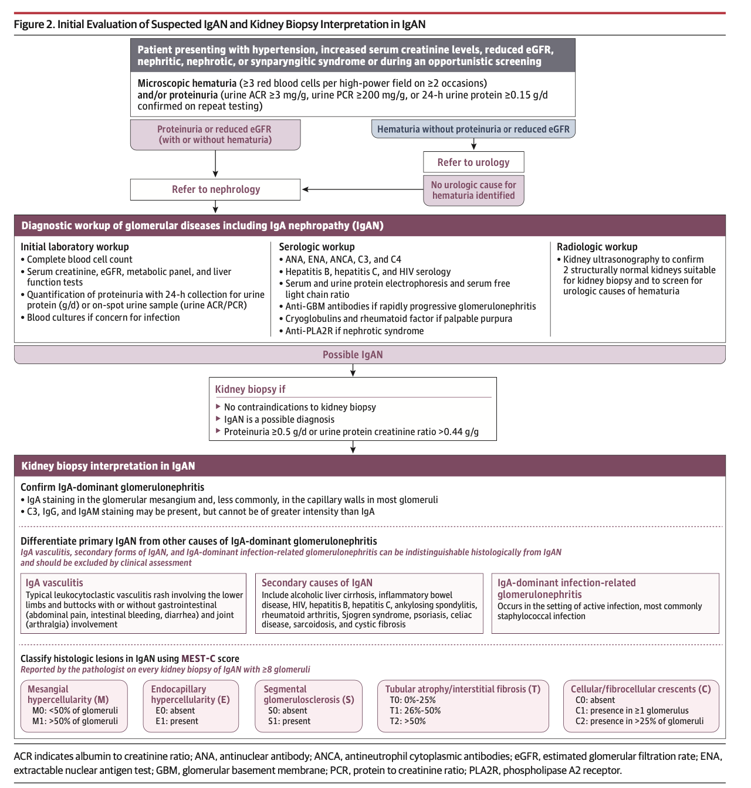
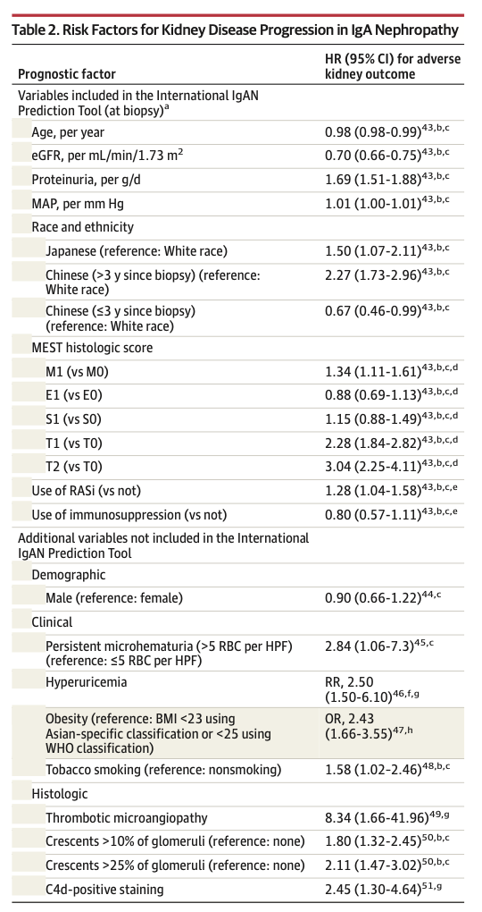
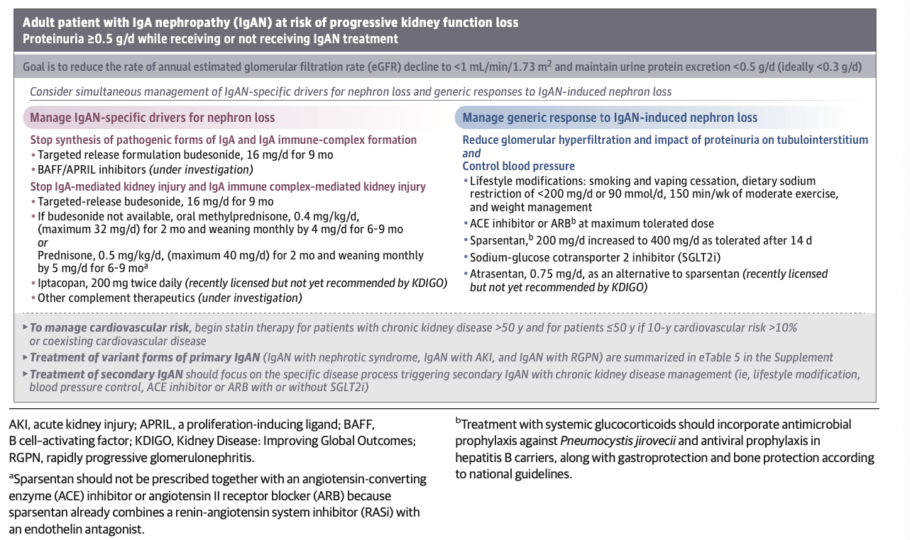
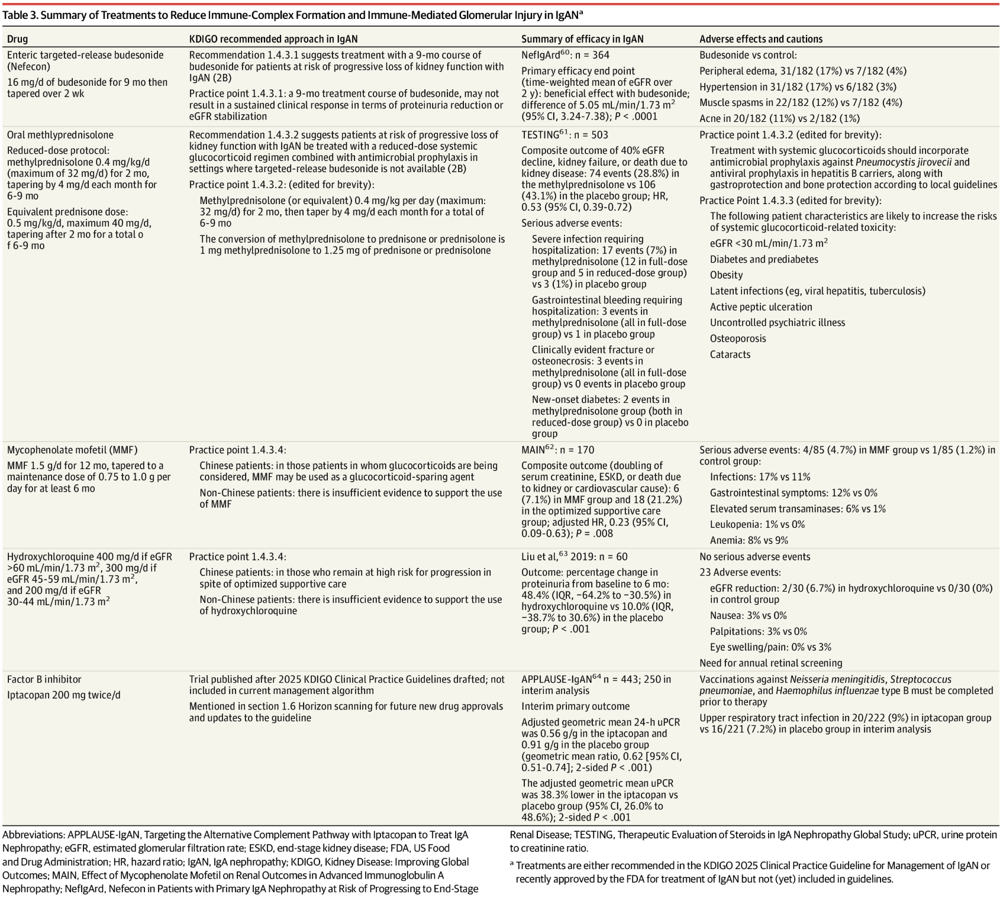
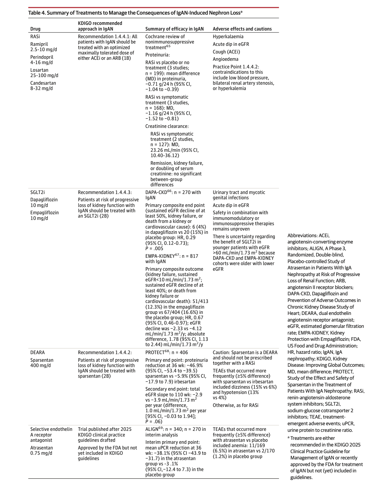

# Stoneman et al. - 2026 - IgA Nephropathy in Adults A Review

- **Pathophysiology of IgA nephropathy** - "4-hit pathogenesis" similar ot Henoch Schonlein purpura:
- **Epidemiology of IgAN:**
    - <u>Incidence</u> - 4.5/100,000/y in Asians
    - <u>Demographic</u>:
        - Age - mean age of disease at 34-45y
        - Sex - no sex preponderance in Asians (slight male preponderance \[M:F = 2:1\] in the Western world)
        - Geographic variation - more common among individuals w/ Asian ancestry (40% of glomerular disease in JP) and less frequent in those w/ African ancestry (may be biased by access to Healthcare)
- **Risk factors for IgAN development:**
    - <u>Genetic risk factors</u> - GWAS located 30 risk loci explaining 11% of overall IgAN risks (?+ve FHx)
    - <u>Non-genetic risk factors</u>:
        - Recurrent tonsillitis - at HR 2.72 (95% CI 1.79-4.14), supports hypothesis of role of NALT and observation that tonsillectomy reduces risk of recurrence in post-transplant patient
- **Clinical presentation of IgAN** - most present w/ some or all elements of nephritic syndrome usually in yunger adults (35-45y):
    - **Microscopic haematuria** - \>= 3 RBC per HPF on \>= 2 ocassions +/- presence of proteinuria
    - **Gross haematuria** (10-30%) - typically occurs concomitantly w/ an URTI ("synpharyngitic haematuria) or GI infections
    - **AKI** (\<10%) - presentiation w/ the full nephritic syndrome w/ 1) severe loss of kidney function due to severe glomerular inflammation, 2) malignant HTN w superimposed thrombotic microangiopathy, and 3) ocassionally due to tubular injury due to visible haematuria
    - **Nephrotic syndrome** (\< 5%) - presentation w/ the full nephrotic syndrome is rare and likely prepresents background IgAN w/ <u>superimposed MCD</u>
- **DDx of IgAN** - any cause of proteinuria, haematuria, or reduced kidney function
- **DDx of IgA-dominant glomerulonephritis on renal Bx** - all histologically indistinguishable from IgAN and are differentiated clinically:
    - <u>IgA vasculitis</u> - typically presents w/ a vasculitic rash (palpable purpura) on the buttocks, and lower limbs, arthralgia, or arthritis over the knees and ankles, and abdominal pain +/- PR bleeding
    - <u>IgA-dominant infection-related GN</u> - typically in patients who develop S. aurueus soft tissue infections (e.g. DM patients)
    - <u>Secondary forms of IgAN</u> - GI disorders, autoimmune diseases, infectious diseases and dermatologic disorders w/ an autoimmune basis
- **Secondary IgAN** - poorly defined clinical entity based on associations w/ no consensus definition, and conclusions on causality, natural Hx, and Tx effectiveness:
    - <u>Gastrointestinal disorders</u> - cirrhosis, inflammatory bowel disease
    - <u>Rheumatological disorders</u> - rheumatoid arthritis, SpA
    - <u>Infectious disorders</u> - viral hepatitis, HIV
    - <u>Dermatological disorders</u> - psoriasis, dermatitis herpetiformis
- **Clinical assessment and Dx of patients w/ suspected IgAN:** 

- **Evaluation of patient w/ confirmed IgA-dominant GN** - primary IgAN is a Dx by exclusion and repeat clinical assessment of:
    - 1\) S/S of IgA vasculitis
    - 2\) Active infection (esp. skin and soft tissue infection)
    - 3\) Diseases a/w secondary IgAN
- **Risk factors for progression of IgAN:**
    - **Non-modifiable risk factors:**
        - <u>Demographic</u> - age, sex, race and ethnicity
        - <u>Clinical factors</u> - presentation w/ persistent haematuira
        - <u>Histological factors</u> - based on oxford NEST-C classification predicting disease progression; additional histological features in International IgAN prediction tool
    - **Modifiable risk factors:**
        - <u>Smoking</u> - tobacco smoking a/w progression of glomerular disease
        - <u>Obesity</u> - high BMI predicts disease progression
        - <u>Degree of proteinuria</u> - driver of nephron loss in all glomerular disease
        - <u>MAP</u> - driver of nephron loss in all kidney disease

  
  
- **Goals of Tx** - reduce rate of decline of eGFR to \< 1 mL/min/1.73m2/y through maintaining urine protein excretion \< 0.5 g/d; Mx associated cardiovascular risk
- **Approach to Tx of IgAN:**
    - <u>General measures</u> - behavioural modification (smoking cessation, weight loss, dietary Na restriction), BP control, lipid control as extrapolated from general CKD populations
    - <u>Target drivers of nephron loss</u>:
        - IgAN-specific drivers of nephron loss (target "4-hit hypothesis")
        - Response to IgAN-induced nephron loss (reduce glomerular hyperfiltration and tubulointerstitial injury by proteinuria and BP control)

    
    
- **Mx of abnormal IgA production and immune-complex mediated glomerular injury** - steroids and anti-complement medications: 

- **Mx of consequences of IgAN-induced nephron loss** - reduced glomerular hyperfiltration through proteinuria and BP control: 

